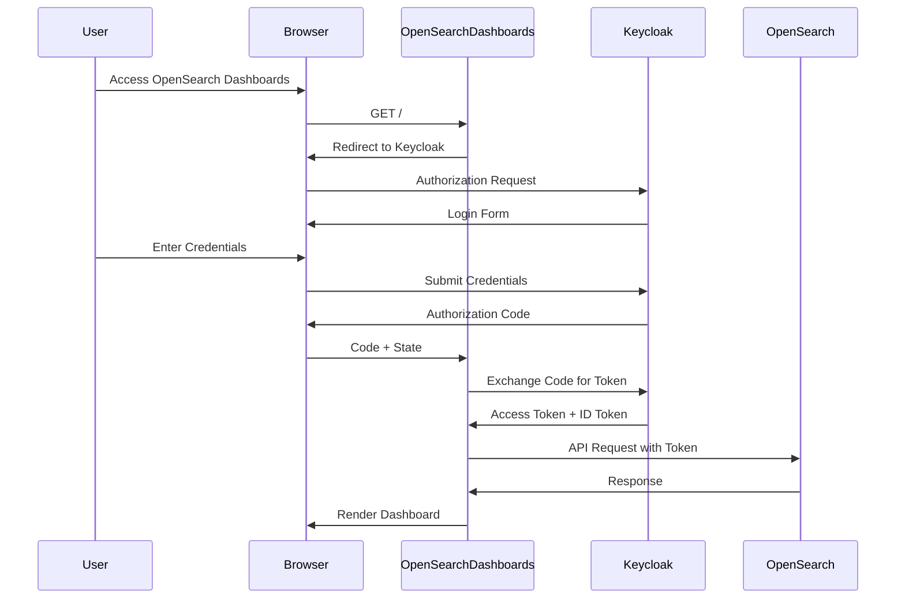
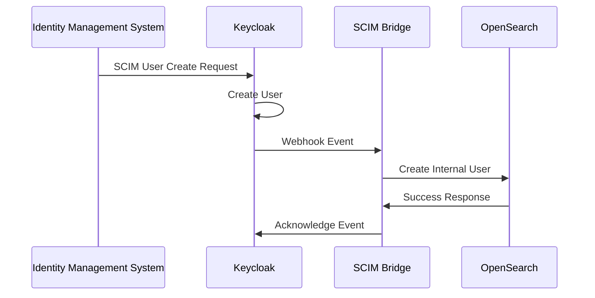

## Table of contents

## Executive Summary

This document provides a comprehensive technical implementation guide for integrating SCIM (System for Cross-domain Identity Management) provisioning with OpenSearch using Keycloak as the identity provider. Since OpenSearch lacks native SCIM support, this guide presents a production-ready architecture using OIDC integration and proxy-based authentication patterns.

## Architecture Overview

### Current State Analysis

OpenSearch Security plugin currently supports multiple authentication backends but does not natively support SCIM. The supported authentication methods include:

- HTTP Basic Authentication
- LDAP/Active Directory
- SAML 2.0
- OpenID Connect (OIDC)
- JWT
- Proxy Authentication
- Kerberos

### Solution Architecture

Our implementation leverages a hybrid approach combining:

1. **Keycloak as OIDC Identity Provider** with SCIM capabilities
2. **OIDC Authentication** for OpenSearch integration
3. **SCIM Proxy Bridge** for automated user lifecycle management
4. **Token-based Security** for secure communication

## Token Flow Architecture

### OIDC Authentication Flow



### SCIM Provisioning Flow



## Implementation Guide

### 1. Keycloak Configuration

#### Realm Setup

```yaml
# keycloak-realm-config.yaml
realm: opensearch-realm
enabled: true
registrationAllowed: false
loginWithEmailAllowed: true
duplicateEmailsAllowed: false
resetPasswordAllowed: true
editUsernameAllowed: false
bruteForceProtected: true
```

#### OIDC Client Configuration

```json
{
  "clientId": "opensearch-dashboards",
  "enabled": true,
  "clientAuthenticatorType": "client-secret",
  "secret": "your-client-secret",
  "redirectUris": [
    "https://opensearch-dashboards.example.com/auth/openid/login",
    "https://opensearch-dashboards.example.com/_opendistro/_security/oidc"
  ],
  "webOrigins": ["https://opensearch-dashboards.example.com"],
  "protocol": "openid-connect",
  "attributes": {
    "oidc.ciba.grant.enabled": "false",
    "oauth2.device.authorization.grant.enabled": "false",
    "backchannel.logout.session.required": "true"
  },
  "protocolMappers": [
    {
      "name": "roles",
      "protocol": "openid-connect",
      "protocolMapper": "oidc-usermodel-realm-role-mapper",
      "config": {
        "claim.name": "roles",
        "jsonType.label": "String",
        "multivalued": "true",
        "userinfo.token.claim": "true",
        "id.token.claim": "true",
        "access.token.claim": "true"
      }
    }
  ]
}
```

#### SCIM Configuration

```json
{
  "enabled": true,
  "endpoint": "/scim/v2",
  "requireAuth": true,
  "authMethods": ["bearer"],
  "schemas": [
    "urn:ietf:params:scim:schemas:core:2.0:User",
    "urn:ietf:params:scim:schemas:core:2.0:Group"
  ],
  "userAttributes": {
    "userName": "username",
    "givenName": "firstName",
    "familyName": "lastName",
    "emails[0].value": "email"
  }
}
```

### 2. OpenSearch Configuration

#### Security Configuration (config.yml)

```yaml
_meta:
  type: "config"
  config_version: 2

config:
  dynamic:
    authc:
      oidc_auth_domain:
        http_enabled: true
        transport_enabled: true
        order: 1
        http_authenticator:
          type: openid
          challenge: false
          config:
            subject_key: preferred_username
            roles_key: roles
            openid_connect_url: https://keycloak.example.com/auth/realms/opensearch-realm/.well-known/openid-configuration
            jwt_clock_skew_tolerance_seconds: 30
        authentication_backend:
          type: noop

      basic_internal_auth_domain:
        http_enabled: true
        transport_enabled: true
        order: 2
        http_authenticator:
          type: basic
          challenge: true
        authentication_backend:
          type: intern
```

#### OpenSearch Dashboards Configuration

```yaml
# opensearch_dashboards.yml
opensearch.username: "kibanaserver"
opensearch.password: "kibanaserver"

# OIDC Configuration
opensearch_security.auth.type: "openid"
opensearch_security.openid.connect_url: "https://keycloak.example.com/auth/realms/opensearch-realm/.well-known/openid-configuration"
opensearch_security.openid.client_id: "opensearch-dashboards"
opensearch_security.openid.client_secret: "your-client-secret"
opensearch_security.openid.scope: "openid profile email"
opensearch_security.openid.header: "Authorization"
opensearch_security.openid.logout_url: "https://keycloak.example.com/auth/realms/opensearch-realm/protocol/openid-connect/logout"

# TLS Configuration
opensearch.ssl.certificateAuthorities:
  ["/usr/share/opensearch-dashboards/config/root-ca.pem"]
opensearch.ssl.verificationMode: certificate
```

### 3. SCIM Bridge Implementation

#### Node.js SCIM Bridge Service

```javascript
// scim-bridge.js
const express = require("express");
const axios = require("axios");
const jwt = require("jsonwebtoken");
const app = express();

class SCIMBridge {
  constructor(config) {
    this.keycloakUrl = config.keycloakUrl;
    this.opensearchUrl = config.opensearchUrl;
    this.adminToken = config.adminToken;
  }

  // Handle Keycloak User Events
  async handleUserEvent(eventType, userData) {
    try {
      switch (eventType) {
        case "USER_CREATE":
          await this.createOpenSearchUser(userData);
          break;
        case "USER_UPDATE":
          await this.updateOpenSearchUser(userData);
          break;
        case "USER_DELETE":
          await this.deleteOpenSearchUser(userData);
          break;
      }
    } catch (error) {
      console.error(`Error handling ${eventType}:`, error);
    }
  }

  // Create User in OpenSearch
  async createOpenSearchUser(userData) {
    const userPayload = {
      password: this.generateTemporaryPassword(),
      backend_roles: this.mapKeycloakRolesToOpenSearch(userData.roles),
      attributes: {
        email: userData.email,
        firstName: userData.firstName,
        lastName: userData.lastName,
        keycloakId: userData.id,
      },
    };

    const response = await axios.put(
      `${this.opensearchUrl}/_plugins/_security/api/internalusers/${userData.username}`,
      userPayload,
      {
        headers: {
          Authorization: `Bearer ${this.adminToken}`,
          "Content-Type": "application/json",
        },
      }
    );

    console.log(`Created OpenSearch user: ${userData.username}`);
    return response.data;
  }

  // Update User in OpenSearch
  async updateOpenSearchUser(userData) {
    const updatePayload = [
      {
        op: "replace",
        path: "/backend_roles",
        value: this.mapKeycloakRolesToOpenSearch(userData.roles),
      },
      {
        op: "replace",
        path: "/attributes",
        value: {
          email: userData.email,
          firstName: userData.firstName,
          lastName: userData.lastName,
          keycloakId: userData.id,
        },
      },
    ];

    const response = await axios.patch(
      `${this.opensearchUrl}/_plugins/_security/api/internalusers/${userData.username}`,
      updatePayload,
      {
        headers: {
          Authorization: `Bearer ${this.adminToken}`,
          "Content-Type": "application/json",
        },
      }
    );

    console.log(`Updated OpenSearch user: ${userData.username}`);
    return response.data;
  }

  // Delete User from OpenSearch
  async deleteOpenSearchUser(userData) {
    const response = await axios.delete(
      `${this.opensearchUrl}/_plugins/_security/api/internalusers/${userData.username}`,
      {
        headers: {
          Authorization: `Bearer ${this.adminToken}`,
        },
      }
    );

    console.log(`Deleted OpenSearch user: ${userData.username}`);
    return response.data;
  }

  // Map Keycloak roles to OpenSearch backend roles
  mapKeycloakRolesToOpenSearch(keycloakRoles) {
    const roleMapping = {
      opensearch_admin: ["all_access"],
      opensearch_user: ["readall"],
      opensearch_readonly: ["readall_and_monitor"],
      kibana_user: ["kibana_user"],
    };

    const mappedRoles = [];
    keycloakRoles.forEach(role => {
      if (roleMapping[role]) {
        mappedRoles.push(...roleMapping[role]);
      }
    });

    return [...new Set(mappedRoles)]; // Remove duplicates
  }

  generateTemporaryPassword() {
    return (
      Math.random().toString(36).slice(-12) +
      Math.random().toString(36).slice(-12).toUpperCase() +
      "!@#"
    );
  }
}

// Webhook endpoint for Keycloak events
app.post("/webhook/keycloak", async (req, res) => {
  try {
    const event = req.body;
    const bridge = new SCIMBridge({
      keycloakUrl: process.env.KEYCLOAK_URL,
      opensearchUrl: process.env.OPENSEARCH_URL,
      adminToken: process.env.OPENSEARCH_ADMIN_TOKEN,
    });

    await bridge.handleUserEvent(event.type, event.user);
    res.status(200).json({ status: "success" });
  } catch (error) {
    console.error("Webhook error:", error);
    res.status(500).json({ error: error.message });
  }
});

module.exports = SCIMBridge;
```

#### Docker Deployment Configuration

```yaml
# docker-compose.yml
version: "3.8"
services:
  keycloak:
    image: quay.io/keycloak/keycloak:23.0
    environment:
      - KEYCLOAK_ADMIN=admin
      - KEYCLOAK_ADMIN_PASSWORD=admin
      - KC_DB=postgres
      - KC_DB_URL=jdbc:postgresql://postgres:5432/keycloak
      - KC_DB_USERNAME=keycloak
      - KC_DB_PASSWORD=password
    ports:
      - "8080:8080"
    depends_on:
      - postgres
    command: start-dev

  opensearch:
    image: opensearchproject/opensearch:2.11.0
    environment:
      - cluster.name=opensearch-cluster
      - node.name=opensearch-node1
      - discovery.seed_hosts=opensearch-node1
      - cluster.initial_cluster_manager_nodes=opensearch-node1
      - bootstrap.memory_lock=true
      - "OPENSEARCH_JAVA_OPTS=-Xms512m -Xmx512m"
      - plugins.security.ssl.transport.pemcert_filepath=esnode.pem
      - plugins.security.ssl.transport.pemkey_filepath=esnode-key.pem
      - plugins.security.ssl.http.enabled=true
      - plugins.security.ssl.http.pemcert_filepath=esnode.pem
      - plugins.security.ssl.http.pemkey_filepath=esnode-key.pem
    ulimits:
      memlock:
        soft: -1
        hard: -1
    ports:
      - "9200:9200"
      - "9600:9600"
    volumes:
      - opensearch-data:/usr/share/opensearch/data
      - ./certificates:/usr/share/opensearch/config/certificates

  opensearch-dashboards:
    image: opensearchproject/opensearch-dashboards:2.11.0
    ports:
      - "5601:5601"
    environment:
      - OPENSEARCH_HOSTS=["https://opensearch:9200"]
    depends_on:
      - opensearch
    volumes:
      - ./opensearch_dashboards.yml:/usr/share/opensearch-dashboards/config/opensearch_dashboards.yml

  scim-bridge:
    build: ./scim-bridge
    environment:
      - KEYCLOAK_URL=http://keycloak:8080
      - OPENSEARCH_URL=https://opensearch:9200
      - OPENSEARCH_ADMIN_TOKEN=${OPENSEARCH_ADMIN_TOKEN}
    ports:
      - "3000:3000"
    depends_on:
      - keycloak
      - opensearch

  postgres:
    image: postgres:15
    environment:
      - POSTGRES_DB=keycloak
      - POSTGRES_USER=keycloak
      - POSTGRES_PASSWORD=password
    volumes:
      - postgres-data:/var/lib/postgresql/data

volumes:
  opensearch-data:
  postgres-data:
```

## Security Considerations

### Token Security

1. **JWT Validation**: OpenSearch validates JWT tokens against Keycloak's JWKS endpoint
2. **Token Rotation**: Implement automatic token refresh mechanisms
3. **Secure Storage**: Store sensitive credentials in secure vaults
4. **Transport Security**: Use TLS for all communications

### Access Control

```yaml
# Role Mapping Configuration
opensearch_admin:
  reserved: false
  backend_roles:
    - "opensearch_admin"
  description: "Full access to OpenSearch"

opensearch_user:
  reserved: false
  backend_roles:
    - "opensearch_user"
  description: "Standard user access"

kibana_user:
  reserved: false
  backend_roles:
    - "kibana_user"
  description: "OpenSearch Dashboards access"
```

### Audit and Monitoring

```javascript
// Audit logging implementation
class AuditLogger {
  logUserCreation(username, roles, timestamp) {
    const auditEntry = {
      event: "USER_CREATED",
      username,
      roles,
      timestamp,
      source: "SCIM_BRIDGE",
    };

    // Send to OpenSearch audit index
    this.sendToAuditIndex(auditEntry);
  }

  async sendToAuditIndex(entry) {
    await axios.post(`${this.opensearchUrl}/audit-logs/_doc`, entry, {
      headers: {
        Authorization: `Bearer ${this.adminToken}`,
        "Content-Type": "application/json",
      },
    });
  }
}
```

## Deployment Checklist

### Prerequisites

- [ ] Keycloak instance deployed and configured
- [ ] OpenSearch cluster with Security plugin enabled
- [ ] TLS certificates configured
- [ ] Network connectivity between components

### Configuration Steps

1. [ ] Create Keycloak realm and OIDC client
2. [ ] Configure SCIM endpoints in Keycloak
3. [ ] Update OpenSearch security configuration
4. [ ] Deploy SCIM bridge service
5. [ ] Configure role mappings
6. [ ] Test OIDC authentication flow
7. [ ] Verify SCIM provisioning

### Testing

- [ ] User creation via SCIM
- [ ] User authentication via OIDC
- [ ] Role assignment verification
- [ ] User deactivation/deletion
- [ ] Token refresh mechanisms

## Troubleshooting Guide

### Common Issues

| Issue                  | Symptom                        | Solution                              |
| ---------------------- | ------------------------------ | ------------------------------------- |
| OIDC Login Fails       | Redirect loop or 401 errors    | Check client secret and redirect URIs |
| Token Validation Error | JWT validation failures        | Verify JWKS endpoint accessibility    |
| User Not Provisioned   | SCIM events not creating users | Check webhook connectivity and logs   |
| Role Mapping Issues    | Incorrect permissions          | Verify role mapping configuration     |

### Log Analysis

```bash
# OpenSearch Security Logs
tail -f /var/log/opensearch/opensearch.log | grep -i security

# Keycloak Logs
docker logs keycloak-container | grep -i scim

# Bridge Service Logs
docker logs scim-bridge-container
```

## Performance Considerations

### Scaling Recommendations

1. **Bridge Service**: Deploy multiple instances behind load balancer
2. **Token Caching**: Implement Redis-based token cache
3. **Batch Operations**: Process SCIM events in batches
4. **Connection Pooling**: Use connection pools for database operations

## Conclusion

This implementation provides a robust, enterprise-grade solution for SCIM integration with OpenSearch using Keycloak. The architecture ensures:

- **Automated User Lifecycle Management**: SCIM-driven provisioning
- **Secure Authentication**: OIDC-based token authentication
- **Scalable Design**: Microservices-based architecture
- **Comprehensive Auditing**: Full audit trail across components
- **Production Ready**: Docker-based deployment with monitoring

The solution bridges the gap between modern identity management requirements and OpenSearch capabilities, providing a foundation for secure, automated user management in enterprise environments.
