# Creating Organizational Charts with Mermaid

Organizational charts are essential for visualizing company structures, team hierarchies, and reporting relationships. Mermaid provides a powerful, text-based approach to creating these diagrams that can be easily maintained, version-controlled, and integrated into documentation systems.

This guide demonstrates how to create comprehensive organizational charts using Mermaid syntax, from simple team structures to complex enterprise hierarchies.

## Table of Contents

## Introduction to Mermaid

Mermaid is a diagramming and charting tool that uses markdown-inspired syntax to create diagrams dynamically. It's particularly useful for:

- **Documentation**: Embedding charts directly in markdown files
- **Version Control**: Text-based diagrams that track changes easily
- **Automation**: Generating charts programmatically
- **Integration**: Working seamlessly with platforms like GitHub, GitLab, and documentation sites

## Basic Organizational Chart Structure

### Simple Hierarchy Example

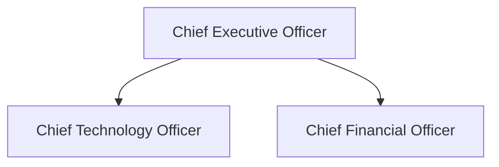

This creates a basic three-level hierarchy showing the CEO at the top with two direct reports.

### Department-Level Organization

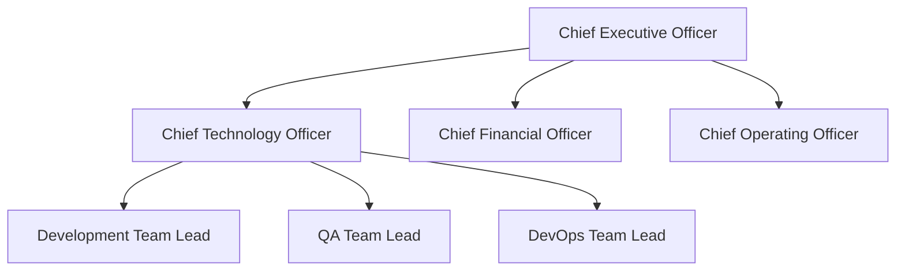

## Enterprise-Level Organizational Chart

Here's a comprehensive example of a complete enterprise organizational structure:

```mermaid
graph TD
    CEO["Chief Executive Officer"]
    COO["Chief Operating Officer"]
    CTO["Chief Technology Officer"]
    CFO["Chief Financial Officer"]
    CISO["Chief Information Security Officer"]

    PM["Project Manager"]
    Arch["Lead Architect"]
    SecArch["Security Architect"]

    DevLead["Development Team Lead"]
    Dev1["Senior Developer"]
    Dev2["Mid-level Developer"]
    Dev3["Junior Developer"]

    QA["Quality Assurance Lead"]
    QA1["QA Engineer"]
    QA2["QA Tester"]

    DevOpsLead["DevOps Team Lead"]
    DevOps1["DevOps Engineer"]
    DevOps2["System Administrator"]

    UXLead["UX/UI Lead Designer"]
    UX1["UX Researcher"]
    UX2["UI Designer"]

    SecAnalystLead["Security Analysis Lead"]
    SecAnalyst1["Security Analyst"]
    SecAnalyst2["Incident Responder"]

    SecEngLead["Security Engineering Lead"]
    SecEng1["Security Engineer"]
    SecEng2["Penetration Tester"]

    CommsLead["Communications Lead"]
    Comms1["Technical Writer"]
    Comms2["Community Manager"]

    Legal["Legal Advisor"]
    HR["Human Resources Manager"]
    FinAnalyst["Financial Analyst"]

    SalesLead["Sales Director"]
    Sales1["Account Manager"]
    Sales2["Sales Representative"]

    CustSuppLead["Customer Support Lead"]
    CustSupp1["Support Specialist"]
    CustSupp2["Support Technician"]

    CEO -->|Oversees| COO
    CEO -->|Oversees| CTO
    CEO -->|Oversees| CFO
    CEO -->|Oversees| CISO

    COO -->|Manages| PM
    CTO -->|Leads| Arch
    Arch -->|Collaborates with| SecArch
    Arch -->|Supervises| DevLead

    DevLead -->|Guides| Dev1
    DevLead -->|Guides| Dev2
    DevLead -->|Guides| Dev3

    PM -->|Coordinates| QA
    QA -->|Oversees| QA1
    QA -->|Oversees| QA2

    CTO -->|Manages| DevOpsLead
    DevOpsLead -->|Supervises| DevOps1
    DevOpsLead -->|Supervises| DevOps2

    PM -->|Works with| UXLead
    UXLead -->|Directs| UX1
    UXLead -->|Directs| UX2

    CISO -->|Heads| SecAnalystLead
    SecAnalystLead -->|Manages| SecAnalyst1
    SecAnalystLead -->|Manages| SecAnalyst2

    CISO -->|Oversees| SecEngLead
    SecEngLead -->|Leads| SecEng1
    SecEngLead -->|Leads| SecEng2

    COO -->|Oversees| CommsLead
    CommsLead -->|Manages| Comms1
    CommsLead -->|Manages| Comms2

    COO -->|Supervises| Legal
    COO -->|Supervises| HR

    CFO -->|Manages| FinAnalyst
    CFO -->|Oversees| SalesLead
    SalesLead -->|Supervises| Sales1
    SalesLead -->|Supervises| Sales2

    COO -->|Oversees| CustSuppLead
    CustSuppLead -->|Manages| CustSupp1
    CustSuppLead -->|Manages| CustSupp2
```

## Advanced Mermaid Features for Org Charts

### Styling and Customization

#### Adding Colors and Styles

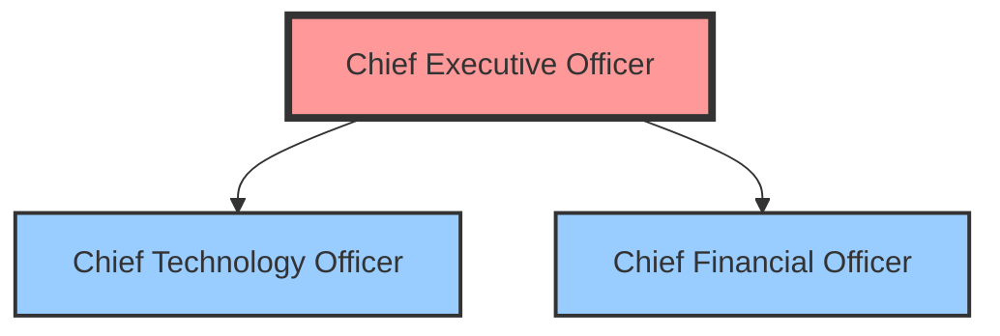

#### Custom Node Shapes

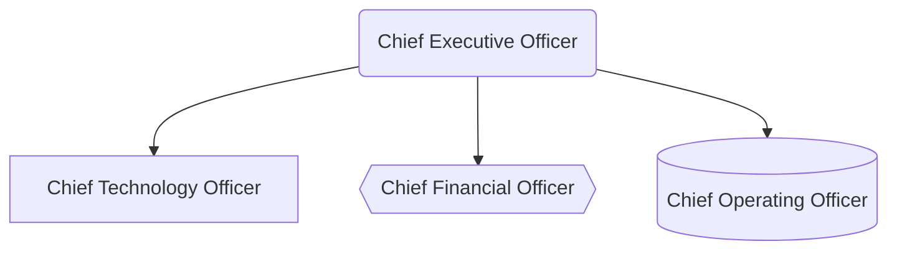

### Different Chart Orientations

#### Left-to-Right Hierarchy

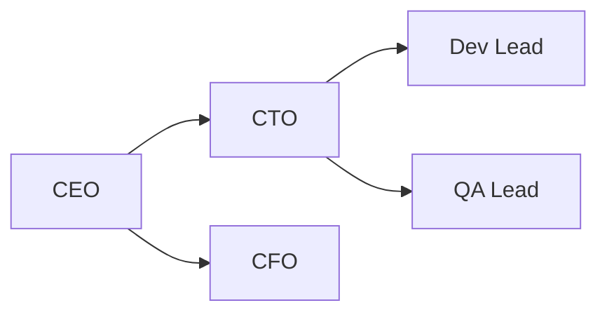

#### Top-Down with Subgraphs

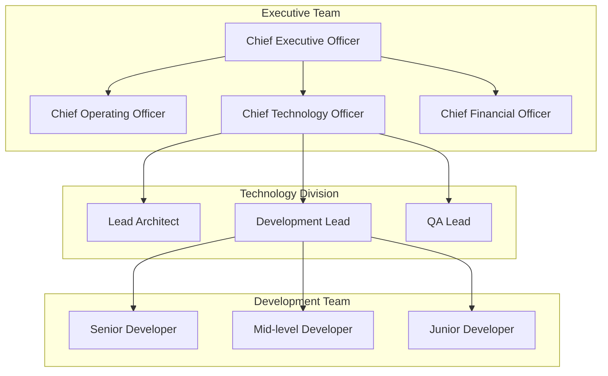

## Practical Implementation Examples

### Technology Team Structure

```mermaid
graph TD
    CTO["Chief Technology Officer<br/>Strategic Technology Leadership"]

    subgraph "Architecture Team"
        SolArch["Solutions Architect"]
        EntArch["Enterprise Architect"]
        SecArch["Security Architect"]
    end

    subgraph "Development Teams"
        FELead["Frontend Team Lead"]
        BELead["Backend Team Lead"]
        MobLead["Mobile Team Lead"]

        FEDev1["Senior Frontend Developer"]
        FEDev2["Frontend Developer"]

        BEDev1["Senior Backend Developer"]
        BEDev2["Backend Developer"]

        MobDev1["Senior Mobile Developer"]
        MobDev2["Mobile Developer"]
    end

    subgraph "Quality & Operations"
        QALead["QA Lead"]
        DevOpsLead["DevOps Lead"]

        QAEng["QA Engineer"]
        QATest["QA Tester"]

        DevOpsEng["DevOps Engineer"]
        SysAdmin["System Administrator"]
    end

    CTO --> SolArch
    CTO --> EntArch
    CTO --> SecArch

    CTO --> FELead
    CTO --> BELead
    CTO --> MobLead
    CTO --> QALead
    CTO --> DevOpsLead

    FELead --> FEDev1
    FELead --> FEDev2

    BELead --> BEDev1
    BELead --> BEDev2

    MobLead --> MobDev1
    MobLead --> MobDev2

    QALead --> QAEng
    QALead --> QATest

    DevOpsLead --> DevOpsEng
    DevOpsLead --> SysAdmin

    classDef cto fill:#ff6b6b,stroke:#333,stroke-width:3px,color:#fff
    classDef lead fill:#4ecdc4,stroke:#333,stroke-width:2px,color:#fff
    classDef senior fill:#45b7d1,stroke:#333,stroke-width:2px,color:#fff
    classDef regular fill:#96ceb4,stroke:#333,stroke-width:1px

    class CTO cto
    class SolArch,EntArch,SecArch,FELead,BELead,MobLead,QALead,DevOpsLead lead
    class FEDev1,BEDev1,MobDev1 senior
    class FEDev2,BEDev2,MobDev2,QAEng,QATest,DevOpsEng,SysAdmin regular
```

### Security Team Organization

```mermaid
graph TD
    CISO["Chief Information Security Officer<br/>Security Strategy & Governance"]

    subgraph "Security Operations"
        SOCLead["SOC Lead"]
        SOCAnalyst1["Senior SOC Analyst"]
        SOCAnalyst2["SOC Analyst"]
        IncidentResp["Incident Response Specialist"]
    end

    subgraph "Security Engineering"
        SecEngLead["Security Engineering Lead"]
        SecEng1["Senior Security Engineer"]
        SecEng2["Security Engineer"]
        PenTester["Penetration Tester"]
    end

    subgraph "Governance & Compliance"
        CompLead["Compliance Lead"]
        RiskAnalyst["Risk Analyst"]
        PolicyAnalyst["Policy Analyst"]
    end

    subgraph "Identity & Access"
        IAMLead["IAM Lead"]
        IAMEng["IAM Engineer"]
        PrivAccess["Privileged Access Specialist"]
    end

    CISO --> SOCLead
    CISO --> SecEngLead
    CISO --> CompLead
    CISO --> IAMLead

    SOCLead --> SOCAnalyst1
    SOCLead --> SOCAnalyst2
    SOCLead --> IncidentResp

    SecEngLead --> SecEng1
    SecEngLead --> SecEng2
    SecEngLead --> PenTester

    CompLead --> RiskAnalyst
    CompLead --> PolicyAnalyst

    IAMLead --> IAMEng
    IAMLead --> PrivAccess

    classDef ciso fill:#dc3545,stroke:#333,stroke-width:3px,color:#fff
    classDef lead fill:#fd7e14,stroke:#333,stroke-width:2px,color:#fff
    classDef senior fill:#ffc107,stroke:#333,stroke-width:2px
    classDef specialist fill:#28a745,stroke:#333,stroke-width:1px,color:#fff

    class CISO ciso
    class SOCLead,SecEngLead,CompLead,IAMLead lead
    class SOCAnalyst1,SecEng1 senior
    class SOCAnalyst2,IncidentResp,SecEng2,PenTester,RiskAnalyst,PolicyAnalyst,IAMEng,PrivAccess specialist
```

## Integration with Documentation Systems

### GitHub/GitLab Integration

Mermaid diagrams can be embedded directly in GitHub and GitLab markdown files:

````markdown

````

### Documentation Platforms

#### Gitiles Integration

```html
<div class="mermaid">
  graph TD CEO["Chief Executive Officer"] CTO["Chief Technology Officer"]
  CFO["Chief Financial Officer"] CEO --> CTO CEO --> CFO
</div>
```

#### Confluence Integration

Use the Mermaid macro in Confluence:

```
{mermaid}
graph TD
    CEO["Chief Executive Officer"]
    CTO["Chief Technology Officer"]
    CFO["Chief Financial Officer"]

    CEO --> CTO
    CEO --> CFO
{mermaid}
```

## Best Practices for Organizational Charts

### Design Principles

1. **Clarity**: Use clear, descriptive titles for roles
2. **Consistency**: Maintain consistent styling throughout
3. **Hierarchy**: Make reporting relationships obvious
4. **Readability**: Avoid overcrowding with too many connections

### Maintenance Tips

#### Version Control

```yaml
# .github/workflows/update-org-chart.yml
name: Update Org Chart
on:
  push:
    paths:
      - "docs/org-chart.mmd"
jobs:
  generate:
    runs-on: ubuntu-latest
    steps:
      - uses: actions/checkout@v2
      - name: Generate SVG
        uses: mermaidjs/mermaid-cli-action@v1
        with:
          files: "docs/org-chart.mmd"
```

#### Automated Updates

```javascript
// update-org-chart.js
const fs = require("fs");
const employees = require("./employees.json");

function generateOrgChart(employees) {
  let mermaidCode = "graph TD\n";

  employees.forEach(emp => {
    if (emp.manager) {
      mermaidCode += `    ${emp.manager}["${emp.managerTitle}"] --> ${emp.id}["${emp.title}"]\n`;
    }
  });

  return mermaidCode;
}

const chart = generateOrgChart(employees);
fs.writeFileSync("org-chart.mmd", chart);
```

### Accessibility Considerations

#### Alt Text and Descriptions

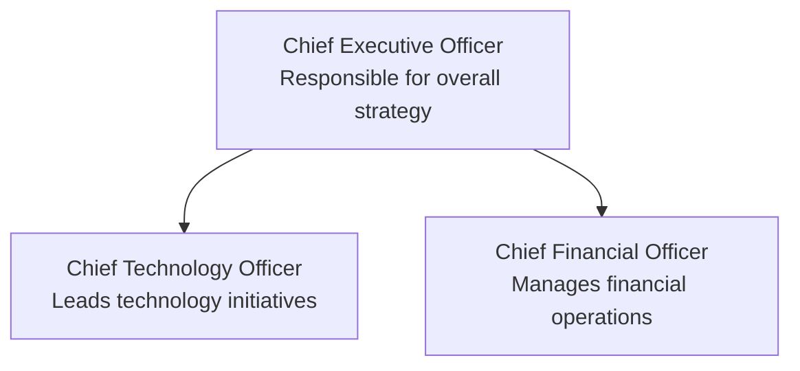

#### Color-Blind Friendly Palettes

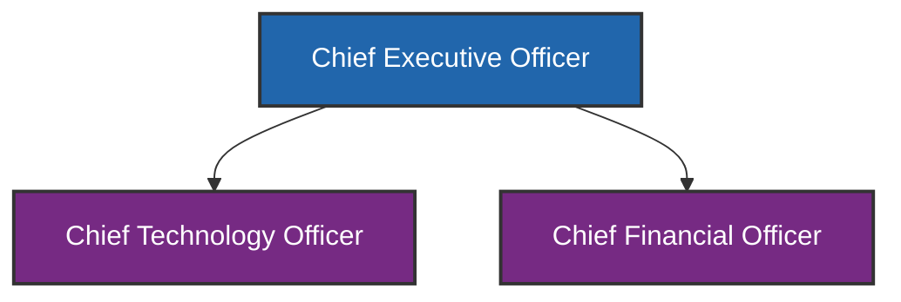

## Advanced Use Cases

### Matrix Organizations

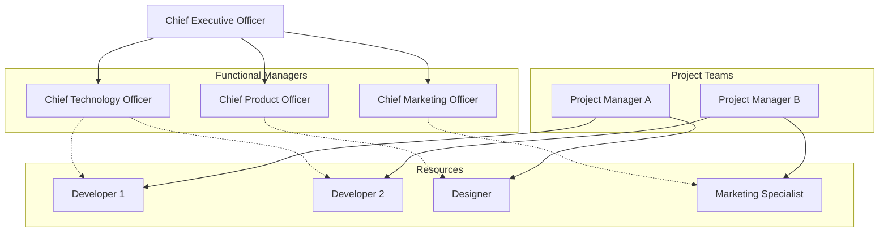

### Cross-Functional Teams

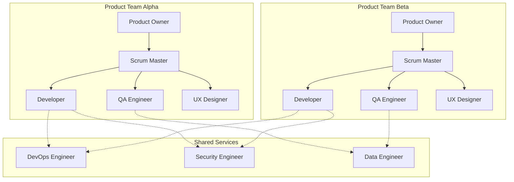

## Conclusion

Mermaid provides a powerful and flexible way to create organizational charts that are:

- **Maintainable**: Text-based format that's easy to update
- **Version-controlled**: Track changes over time
- **Scalable**: Handle everything from small teams to enterprise structures
- **Integrable**: Work seamlessly with documentation platforms

By following the patterns and best practices outlined in this guide, you can create professional organizational charts that effectively communicate your company's structure and help stakeholders understand reporting relationships and team dynamics.

Whether you're documenting a small startup or a large enterprise, Mermaid's syntax provides the flexibility to represent complex organizational structures while maintaining clarity and readability.
