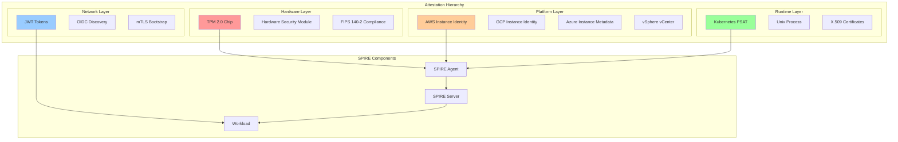
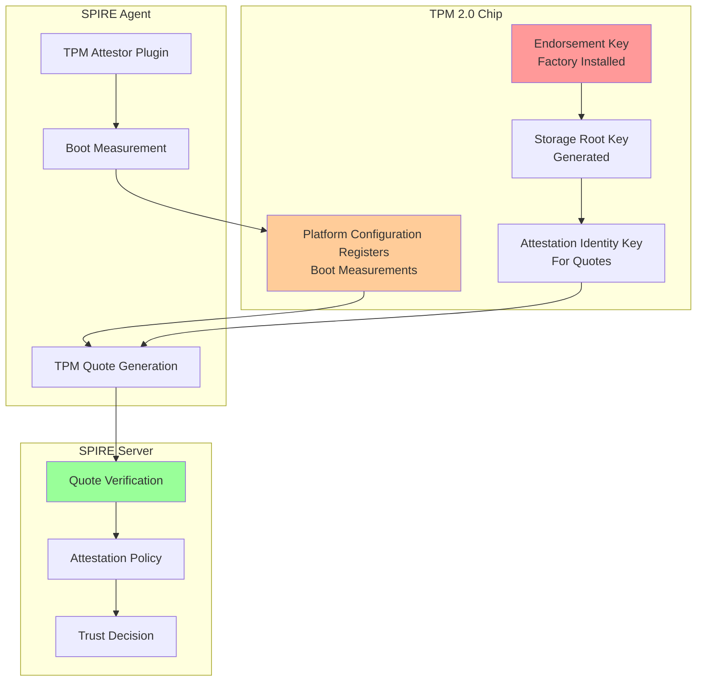

## Introduction: Beyond Basic Kubernetes Attestation

In our [previous guides](/spiffe-spire-kubernetes-complete-guide), we've focused primarily on Kubernetes PSAT (Projected Service Account Token) attestation—a solid foundation for most cloud-native workloads. However, enterprise environments often require more sophisticated attestation methods that leverage hardware security modules, cloud provider credentials, or multi-factor attestation strategies.

This comprehensive guide explores advanced workload attestation patterns using TPM (Trusted Platform Module) hardware, cloud provider instance identity documents, and hybrid attestation strategies that provide defense-in-depth for critical workloads.

## Understanding Advanced Attestation Architecture

Let's visualize the different attestation layers available in SPIFFE/SPIRE:



### Why Advanced Attestation Matters

1. **Regulatory Compliance**: FIPS 140-2, Common Criteria, SOC 2 requirements
2. **Zero Trust Architecture**: Multiple attestation factors reduce attack surface
3. **Cloud Security**: Leverage platform-native security features
4. **Hardware Root of Trust**: TPM provides tamper-resistant foundation
5. **Auditability**: Hardware-backed attestation provides stronger audit trails

## TPM (Trusted Platform Module) Attestation

TPM attestation provides the strongest security guarantee by leveraging hardware-based cryptographic capabilities that are resistant to software attacks.

### Understanding TPM Architecture



### TPM Node Attestor Configuration

Let's configure TPM attestation for SPIRE:

```yaml
# tpm-spire-server-config.yaml
apiVersion: v1
kind: ConfigMap
metadata:
  name: spire-server-tpm-config
  namespace: spire-system
data:
  server.conf: |
    server {
      bind_address = "0.0.0.0"
      bind_port = "8081"
      socket_path = "/tmp/spire-server/private/api.sock"
      trust_domain = "enterprise.example.com"
      data_dir = "/run/spire/data"
      log_level = "INFO"
      
      # TPM CA configuration
      ca_subject = {
        country = ["US"],
        organization = ["Example Corp"],
        common_name = "SPIRE Server CA with TPM",
      }
      
      # Default SVID TTL
      default_svid_ttl = "1h"
      
      # JWT issuer configuration
      jwt_issuer = "https://oidc.enterprise.example.com"
    }

    plugins {
      # TPM Node Attestor
      NodeAttestor "tpm" {
        plugin_data {
          # Path to TPM device (usually /dev/tpm0 or /dev/tpmrm0)
          tpm_path = "/dev/tpmrm0"
          
          # Hash algorithm for PCR measurements
          hash_algorithm = "sha256"
          
          # Required PCR values for attestation
          # PCR 0: BIOS/UEFI measurements
          # PCR 1: BIOS configuration
          # PCR 2: Option ROM measurements  
          # PCR 7: Secure boot measurements
          pcr_selections {
            hash_alg = "sha256"
            pcr_ids = [0, 1, 2, 7]
          }
          
          # Expected PCR values (base64 encoded)
          expected_pcr_values {
            "0" = "d2b2c8e5f4a3b9d7c6e8f1a4b7c9e2f5d8a1b4c7e0f3a6b9c2e5f8a1b4c7e0f3"
            "1" = "a1b2c3d4e5f6a7b8c9d0e1f2a3b4c5d6e7f8a9b0c1d2e3f4a5b6c7d8e9f0a1b2"
            "2" = "f1e2d3c4b5a6f7e8d9c0b1a2f3e4d5c6b7a8f9e0d1c2b3a4f5e6d7c8b9a0f1e2"
            "7" = "c4d5e6f7a8b9c0d1e2f3a4b5c6d7e8f9a0b1c2d3e4f5a6b7c8d9e0f1a2b3c4d5"
          }
          
          # Allow list of endorsement key certificates
          # These would be obtained from the TPM manufacturer
          allowed_ek_certs = [
            "/etc/spire/certs/tpm-ek-cert-1.pem",
            "/etc/spire/certs/tpm-ek-cert-2.pem"
          ]
          
          # Require secure boot
          require_secure_boot = true
          
          # Anti-replay protection window
          attestation_cache_ttl = "300s"
        }
      }

      # TPM Workload Attestor  
      WorkloadAttestor "tpm" {
        plugin_data {
          # Path to TPM device
          tpm_path = "/dev/tpmrm0"
          
          # Workload PCR for runtime measurements
          workload_pcr = 23
          
          # Measurement policy
          measurement_policy {
            # Require specific executable hashes
            required_measurements = [
              "sha256:a1b2c3d4e5f6a7b8c9d0e1f2a3b4c5d6e7f8a9b0c1d2e3f4a5b6c7d8e9f0a1b2"
            ]
            
            # Allow dynamic library measurements
            allow_dynamic_libraries = false
          }
        }
      }

      DataStore "sql" {
        plugin_data {
          database_type = "postgres"
          connection_string = "dbname=spire user=spire host=postgres-ha.data.svc.cluster.local sslmode=require"
        }
      }

      KeyManager "disk" {
        plugin_data {
          keys_path = "/run/spire/data/keys.json"
        }
      }

      UpstreamAuthority "disk" {
        plugin_data {
          cert_file_path = "/run/spire/ca/ca.crt"
          key_file_path = "/run/spire/ca/ca.key"
        }
      }

      # Notifier for updating Kubernetes trust bundles
      Notifier "k8sbundle" {
        plugin_data {
          webhook_label = "spiffe.io/webhook"
        }
      }
    }

    health_checks {
      listener_enabled = true
      bind_address = "0.0.0.0"
      bind_port = "8080"
      live_path = "/live"
      ready_path = "/ready"
    }

    telemetry {
      Prometheus {
        bind_address = "0.0.0.0"
        bind_port = "9988"
      }
    }
---
# TPM SPIRE Agent Configuration
apiVersion: v1
kind: ConfigMap
metadata:
  name: spire-agent-tpm-config
  namespace: spire-system
data:
  agent.conf: |
    agent {
      data_dir = "/run/spire/data"
      log_level = "INFO"
      server_address = "spire-server.spire-system"
      server_port = "8081"
      socket_path = "/run/spire/sockets/agent.sock"
      trust_bundle_path = "/run/spire/bundle/bundle.crt"
      trust_domain = "enterprise.example.com"
      
      # Insecure bootstrap for initial trust
      insecure_bootstrap = false
      
      # Join token for bootstrap (one-time use)
      # join_token = "bootstrap-token-12345"
    }

    plugins {
      # TPM Node Attestor
      NodeAttestor "tpm" {
        plugin_data {
          # TPM device path
          tpm_path = "/dev/tpmrm0"
          
          # Hash algorithm
          hash_algorithm = "sha256"
          
          # Ownership authentication (if required)
          # owner_auth = "your-tpm-owner-password"
          
          # PCR selection for node attestation
          pcr_selections {
            hash_alg = "sha256"
            pcr_ids = [0, 1, 2, 7]
          }
          
          # Generate quote on startup
          generate_quote_on_startup = true
          
          # Cache attestation results
          cache_attestation = true
          cache_ttl = "3600s"
        }
      }

      # TPM Workload Attestor
      WorkloadAttestor "tpm" {
        plugin_data {
          tpm_path = "/dev/tpmrm0"
          workload_pcr = 23
          
          # Measure workload on startup
          measure_on_startup = true
          
          # Workload measurement policy
          measurement_policy {
            # Executable path whitelist
            allowed_executables = [
              "/usr/bin/my-secure-app",
              "/opt/enterprise/secure-service"
            ]
            
            # Require code signing verification
            require_code_signing = true
            
            # Trusted signers
            trusted_signers = [
              "CN=Enterprise Code Signing,O=Example Corp,C=US"
            ]
          }
        }
      }

      # Kubernetes Workload Attestor (hybrid mode)
      WorkloadAttestor "k8s" {
        plugin_data {
          # Skip kubelet verification for speed
          skip_kubelet_verification = false
          
          # Kubelet read-only port (if enabled)
          kubelet_read_only_port = 10255
          
          # Use secure kubelet port
          kubelet_secure_port = 10250
          
          # Node name override
          # node_name_env = "MY_NODE_NAME"
          
          # Kubernetes configuration
          kube_config_file = "/run/spire/k8s/kubeconfig"
        }
      }

      KeyManager "memory" {
        plugin_data = {}
      }
    }

    health_checks {
      listener_enabled = true
      bind_address = "0.0.0.0"
      bind_port = "8080"
      live_path = "/live"
      ready_path = "/ready"
    }

    telemetry {
      Prometheus {
        bind_address = "0.0.0.0"
        bind_port = "9988"
      }
    }
```

### TPM Deployment with Helm

Create a Helm values file for TPM-enabled SPIRE:

```yaml
# tpm-values.yaml
global:
  spire:
    trustDomain: "enterprise.example.com"
    bundleEndpoint:
      address: "0.0.0.0"
      port: 8443

spire-server:
  replicaCount: 3

  # TPM-specific configuration
  configMap:
    server.conf: |
      # Include the TPM server config from above

  # Mount TPM certificates
  extraVolumes:
    - name: tpm-certs
      secret:
        secretName: tpm-endorsement-certs

  extraVolumeMounts:
    - name: tpm-certs
      mountPath: /etc/spire/certs
      readOnly: true

  # Enhanced security for TPM deployment
  securityContext:
    runAsNonRoot: true
    runAsUser: 1000
    fsGroup: 1000
    seccompProfile:
      type: RuntimeDefault

  # Resource requirements for TPM verification
  resources:
    requests:
      memory: "1Gi"
      cpu: "200m"
    limits:
      memory: "4Gi"
      cpu: "2000m"

spire-agent:
  # Node selection for TPM-enabled nodes
  nodeSelector:
    hardware.feature.node.kubernetes.io/tpm: "true"

  # Privileged mode for TPM access
  securityContext:
    privileged: true

  # Mount TPM device
  extraVolumes:
    - name: tpm-device
      hostPath:
        path: /dev/tpmrm0
        type: CharDevice

  extraVolumeMounts:
    - name: tpm-device
      mountPath: /dev/tpmrm0

  # Enhanced resources for TPM operations
  resources:
    requests:
      memory: "256Mi"
      cpu: "100m"
    limits:
      memory: "1Gi"
      cpu: "1000m"

spiffe-csi-driver:
  enabled: true

spiffe-oidc-discovery-provider:
  enabled: true
  config:
    domains:
      - "oidc.enterprise.example.com"
```

Deploy with TPM support:

```bash
# Label nodes with TPM capability
kubectl label nodes worker-node-1 hardware.feature.node.kubernetes.io/tpm=true
kubectl label nodes worker-node-2 hardware.feature.node.kubernetes.io/tpm=true

# Create TPM endorsement certificate secret
kubectl create secret generic tpm-endorsement-certs \
  --from-file=tpm-ek-cert-1.pem \
  --from-file=tpm-ek-cert-2.pem \
  -n spire-system

# Deploy SPIRE with TPM
helm upgrade --install spire spiffe/spire \
  --namespace spire-system \
  --values tpm-values.yaml \
  --wait
```

## Cloud Provider Attestation

Cloud provider attestation leverages platform-specific instance identity documents to verify node identity without requiring shared secrets or certificates.

### AWS Instance Identity Document (IID) Attestation

AWS provides cryptographically signed instance metadata that SPIRE can verify:

```yaml
# aws-attestation-config.yaml
apiVersion: v1
kind: ConfigMap
metadata:
  name: spire-server-aws-config
  namespace: spire-system
data:
  server.conf: |
    server {
      bind_address = "0.0.0.0"
      bind_port = "8081"
      trust_domain = "aws.enterprise.example.com"
      data_dir = "/run/spire/data"
      log_level = "INFO"
    }

    plugins {
      # AWS IID Node Attestor
      NodeAttestor "aws_iid" {
        plugin_data {
          # AWS credentials for verification
          # Can use IAM roles instead of access keys
          access_key_id = "${AWS_ACCESS_KEY_ID}"
          secret_access_key = "${AWS_SECRET_ACCESS_KEY}"
          
          # Alternative: Use IAM role
          # assume_role_arn = "arn:aws:iam::123456789012:role/spire-server-role"
          
          # AWS region
          region = "us-east-1"
          
          # Account ID whitelist
          account_ids_for_verification = [
            "123456789012",
            "234567890123"
          ]
          
          # Instance tag requirements
          # Only instances with these tags can attest
          instance_tag_requirements = {
            "Environment" = ["production", "staging"]
            "Team" = ["platform", "security"]
            "SPIREManaged" = ["true"]
          }
          
          # Allowed regions
          allowed_regions = [
            "us-east-1",
            "us-west-2",
            "eu-west-1"
          ]
          
          # Allowed instance types
          allowed_instance_types = [
            "t3.medium",
            "t3.large", 
            "m5.large",
            "m5.xlarge",
            "c5.large"
          ]
          
          # VPC ID whitelist
          allowed_vpc_ids = [
            "vpc-12345678",
            "vpc-87654321"
          ]
          
          # Subnet whitelist
          allowed_subnet_ids = [
            "subnet-12345678",
            "subnet-87654321"
          ]
          
          # Security group requirements
          required_security_groups = [
            "sg-spire-nodes"
          ]
          
          # AMI ID whitelist (for golden images)
          allowed_ami_ids = [
            "ami-0123456789abcdef0",
            "ami-0fedcba9876543210"
          ]
          
          # Skip verification of block device mappings
          skip_block_device = false
          
          # Local metadata only (don't call AWS APIs)
          local_only = false
          
          # Disable instance identity document signature verification
          # (NOT recommended for production)
          disable_instance_profile_selectors = false
          
          # Custom CA bundle for AWS API calls
          # ca_bundle_path = "/etc/ssl/certs/ca-bundle.pem"
          
          # HTTP timeout for AWS API calls  
          http_timeout = "30s"
          
          # Maximum number of retries for AWS API calls
          max_retries = 3
        }
      }

      # AWS Instance Metadata Workload Attestor
      WorkloadAttestor "aws_iid" {
        plugin_data {
          # Skip verification of instance metadata
          skip_verification = false
          
          # Use instance metadata v2 (more secure)
          use_imdsv2 = true
          
          # Custom metadata endpoint
          # metadata_endpoint = "http://169.254.169.254"
          
          # Timeout for metadata calls
          timeout = "10s"
        }
      }

      DataStore "sql" {
        plugin_data {
          database_type = "postgres"
          connection_string = "host=postgres-ha.data.svc.cluster.local dbname=spire user=spire sslmode=require"
        }
      }

      KeyManager "aws_kms" {
        plugin_data {
          # KMS key for SPIRE server keys
          key_id = "arn:aws:kms:us-east-1:123456789012:key/12345678-1234-1234-1234-123456789012"
          
          # AWS region
          region = "us-east-1"
          
          # Key spec
          key_spec = "RSA_2048"
          
          # Key usage
          key_usage = "SIGN_VERIFY"
          
          # AWS credentials (or use IAM role)
          access_key_id = "${AWS_ACCESS_KEY_ID}"
          secret_access_key = "${AWS_SECRET_ACCESS_KEY}"
        }
      }

      UpstreamAuthority "aws_pca" {
        plugin_data {
          # Private CA ARN
          certificate_authority_arn = "arn:aws:acm-pca:us-east-1:123456789012:certificate-authority/12345678-1234-1234-1234-123456789012"
          
          # AWS region
          region = "us-east-1"
          
          # Certificate validity period
          validity_period_hours = 8760  # 1 year
          
          # Certificate template ARN (optional)
          # template_arn = "arn:aws:acm-pca:::template/SubordinateCACertificate_PathLen0/V1"
          
          # AWS credentials
          access_key_id = "${AWS_ACCESS_KEY_ID}"
          secret_access_key = "${AWS_SECRET_ACCESS_KEY}"
          
          # Subject alternative names
          subject_alternative_names = [
            "spire-server.spire-system.svc.cluster.local"
          ]
          
          # Certificate signing algorithm
          signing_algorithm = "SHA256WITHRSA"
        }
      }
    }
---
# AWS Agent Configuration
apiVersion: v1
kind: ConfigMap
metadata:
  name: spire-agent-aws-config
  namespace: spire-system
data:
  agent.conf: |
    agent {
      data_dir = "/run/spire/data"
      log_level = "INFO"
      server_address = "spire-server.spire-system"
      server_port = "8081"
      socket_path = "/run/spire/sockets/agent.sock"
      trust_bundle_path = "/run/spire/bundle/bundle.crt"
      trust_domain = "aws.enterprise.example.com"
    }

    plugins {
      # AWS IID Node Attestor
      NodeAttestor "aws_iid" {
        plugin_data {
          # Use IMDSv2 for better security
          use_imdsv2 = true
          
          # Metadata endpoint override (if needed)
          # ec2_metadata_endpoint = "http://169.254.169.254"
          
          # Skip verification (for testing only)
          skip_verification = false
          
          # Local metadata timeout
          timeout = "30s"
          
          # Retry configuration
          max_retries = 3
          retry_delay = "1s"
        }
      }

      # Kubernetes Workload Attestor (hybrid)
      WorkloadAttestor "k8s" {
        plugin_data {
          skip_kubelet_verification = false
          kubelet_secure_port = 10250
        }
      }

      # Docker Workload Attestor (for non-K8s workloads)
      WorkloadAttestor "docker" {
        plugin_data {
          # Docker daemon socket
          docker_socket_path = "unix:///var/run/docker.sock"
          
          # Container label requirements
          container_id_cgroup_matchers = [
            "/docker/([^/]+)",
            "/system.slice/docker-([^.]+).scope"
          ]
          
          # Reuse connections
          use_new_container_locator = true
        }
      }

      KeyManager "memory" {
        plugin_data = {}
      }
    }
```

### GCP Instance Identity Token (IIT) Attestation

Google Cloud Platform provides JWT-based instance identity tokens:

```yaml
# gcp-attestation-config.yaml
apiVersion: v1
kind: ConfigMap
metadata:
  name: spire-server-gcp-config
  namespace: spire-system
data:
  server.conf: |
    server {
      bind_address = "0.0.0.0"
      bind_port = "8081"
      trust_domain = "gcp.enterprise.example.com"
      data_dir = "/run/spire/data"
      log_level = "INFO"
    }

    plugins {
      # GCP IIT Node Attestor
      NodeAttestor "gcp_iit" {
        plugin_data {
          # GCP Project ID whitelist
          projectid_whitelist = [
            "my-project-prod",
            "my-project-staging",
            "shared-services"
          ]
          
          # Service account whitelist  
          service_account_whitelist = [
            "spire-agent@my-project-prod.iam.gserviceaccount.com",
            "k8s-nodes@my-project-prod.iam.gserviceaccount.com"
          ]
          
          # Zone whitelist
          zone_whitelist = [
            "us-central1-a",
            "us-central1-b", 
            "us-central1-c",
            "us-east1-a"
          ]
          
          # Instance label requirements
          instance_label_whitelist = {
            "environment" = ["prod", "staging"]
            "team" = ["platform"]
            "spire-managed" = ["true"]
          }
          
          # Machine type whitelist
          machine_type_whitelist = [
            "n1-standard-2",
            "n1-standard-4",
            "e2-standard-2",
            "e2-standard-4"
          ]
          
          # Network whitelist
          network_whitelist = [
            "projects/my-project-prod/global/networks/vpc-prod",
            "projects/my-project-staging/global/networks/vpc-staging"
          ]
          
          # Subnetwork whitelist
          subnetwork_whitelist = [
            "projects/my-project-prod/regions/us-central1/subnetworks/subnet-k8s",
            "projects/my-project-prod/regions/us-east1/subnetworks/subnet-k8s"
          ]
          
          # Custom audience for token verification
          # audience = "spire://gcp.enterprise.example.com"
          
          # Token lifetime
          token_lifetime = "3600s"
          
          # Google Cloud credentials
          # If not specified, uses Application Default Credentials
          # credentials_file = "/var/secrets/google/key.json"
          
          # Custom CA bundle for Google APIs
          # ca_bundle_path = "/etc/ssl/certs/ca-bundle.pem"
          
          # HTTP timeout
          http_timeout = "30s"
          
          # Maximum retries
          max_retries = 3
        }
      }

      DataStore "sql" {
        plugin_data {
          database_type = "postgres"
          connection_string = "host=postgres-ha.data.svc.cluster.local dbname=spire user=spire sslmode=require"
        }
      }

      KeyManager "gcp_kms" {
        plugin_data {
          # Cloud KMS key
          key_name = "projects/my-project-prod/locations/us-central1/keyRings/spire/cryptoKeys/spire-server"
          
          # Key version (optional, uses latest if not specified)
          # key_version = "1"
          
          # Google Cloud credentials
          # credentials_file = "/var/secrets/google/key.json"
          
          # HTTP timeout
          http_timeout = "30s"
        }
      }

      UpstreamAuthority "gcp_cas" {
        plugin_data {
          # Certificate Authority Service CA
          ca_name = "projects/my-project-prod/locations/us-central1/certificateAuthorities/spire-ca"
          
          # Certificate validity
          validity_period_hours = 8760  # 1 year
          
          # Certificate template (optional)
          # certificate_template = "projects/my-project-prod/locations/us-central1/certificateTemplates/spire-template"
          
          # Google Cloud credentials
          # credentials_file = "/var/secrets/google/key.json"
          
          # Subject alternative names
          subject_alternative_names = [
            "spire-server.spire-system.svc.cluster.local"
          ]
        }
      }
    }
---
# GCP Agent Configuration
apiVersion: v1
kind: ConfigMap
metadata:
  name: spire-agent-gcp-config
  namespace: spire-system
data:
  agent.conf: |
    agent {
      data_dir = "/run/spire/data"
      log_level = "INFO"
      server_address = "spire-server.spire-system"
      server_port = "8081"
      socket_path = "/run/spire/sockets/agent.sock"
      trust_bundle_path = "/run/spire/bundle/bundle.crt"
      trust_domain = "gcp.enterprise.example.com"
    }

    plugins {
      # GCP IIT Node Attestor
      NodeAttestor "gcp_iit" {
        plugin_data {
          # Custom audience for token
          # audience = "spire://gcp.enterprise.example.com"
          
          # Service account email override
          # service_account_email = "spire-agent@my-project-prod.iam.gserviceaccount.com"
          
          # Token format (access_token or id_token)
          token_type = "id_token"
          
          # Custom metadata endpoint
          # metadata_endpoint = "http://metadata.google.internal"
          
          # Request timeout
          timeout = "30s"
        }
      }

      # Kubernetes Workload Attestor
      WorkloadAttestor "k8s" {
        plugin_data {
          skip_kubelet_verification = false
          kubelet_secure_port = 10250
        }
      }

      KeyManager "memory" {
        plugin_data = {}
      }
    }
```

### Azure Managed Service Identity (MSI) Attestation

Azure provides Managed Service Identity tokens for attestation:

```yaml
# azure-attestation-config.yaml
apiVersion: v1
kind: ConfigMap
metadata:
  name: spire-server-azure-config
  namespace: spire-system
data:
  server.conf: |
    server {
      bind_address = "0.0.0.0"
      bind_port = "8081"
      trust_domain = "azure.enterprise.example.com"
      data_dir = "/run/spire/data"
      log_level = "INFO"
    }

    plugins {
      # Azure MSI Node Attestor
      NodeAttestor "azure_msi" {
        plugin_data {
          # Azure tenant ID
          tenant_id = "12345678-1234-1234-1234-123456789012"
          
          # Subscription ID whitelist
          subscription_ids = [
            "12345678-1234-1234-1234-123456789012",
            "87654321-4321-4321-4321-210987654321"
          ]
          
          # Resource group whitelist
          resource_groups = [
            "rg-spire-prod",
            "rg-spire-staging", 
            "rg-shared-services"
          ]
          
          # VM resource name patterns
          vm_name_patterns = [
            "spire-agent-*",
            "k8s-node-*"
          ]
          
          # Network security group requirements
          required_nsg_names = [
            "nsg-spire-nodes"
          ]
          
          # Virtual network whitelist
          vnet_names = [
            "vnet-prod",
            "vnet-staging"
          ]
          
          # Subnet whitelist  
          subnet_names = [
            "subnet-k8s-prod",
            "subnet-k8s-staging"
          ]
          
          # VM size whitelist
          vm_sizes = [
            "Standard_D2s_v3",
            "Standard_D4s_v3",
            "Standard_B2s",
            "Standard_B4ms"
          ]
          
          # Location whitelist
          locations = [
            "East US",
            "West US 2",
            "Central US"
          ]
          
          # Custom audience for MSI token
          # audience = "spire://azure.enterprise.example.com"
          
          # Azure credentials for API verification
          # If not specified, uses Managed Identity
          # client_id = "12345678-1234-1234-1234-123456789012"
          # client_secret = "${AZURE_CLIENT_SECRET}"
          
          # Azure cloud environment
          # azure_environment = "AzurePublicCloud"  # or AzureGovernmentCloud, etc.
          
          # HTTP timeout
          http_timeout = "30s"
          
          # Maximum retries
          max_retries = 3
        }
      }

      DataStore "sql" {
        plugin_data {
          database_type = "postgres"
          connection_string = "host=postgres-ha.data.svc.cluster.local dbname=spire user=spire sslmode=require"
        }
      }

      KeyManager "azure_kv" {
        plugin_data {
          # Azure Key Vault URL
          vault_uri = "https://spire-kv-prod.vault.azure.net/"
          
          # Key name in Key Vault
          key_name = "spire-server-key"
          
          # Key type and size
          key_type = "RSA"
          key_size = 2048
          
          # Azure credentials
          # Use Managed Identity if available
          # client_id = "12345678-1234-1234-1234-123456789012"
          # client_secret = "${AZURE_CLIENT_SECRET}"
          tenant_id = "12345678-1234-1234-1234-123456789012"
          
          # HTTP timeout
          http_timeout = "30s"
        }
      }

      UpstreamAuthority "azure_kv" {
        plugin_data {
          # Certificate in Key Vault
          vault_uri = "https://spire-kv-prod.vault.azure.net/"
          cert_name = "spire-ca-cert"
          key_name = "spire-ca-key"
          
          # Certificate validity
          validity_period_hours = 8760
          
          # Azure credentials
          tenant_id = "12345678-1234-1234-1234-123456789012"
          
          # Subject alternative names
          subject_alternative_names = [
            "spire-server.spire-system.svc.cluster.local"
          ]
        }
      }
    }
---
# Azure Agent Configuration
apiVersion: v1
kind: ConfigMap
metadata:
  name: spire-agent-azure-config
  namespace: spire-system
data:
  agent.conf: |
    agent {
      data_dir = "/run/spire/data"
      log_level = "INFO"
      server_address = "spire-server.spire-system"
      server_port = "8081"
      socket_path = "/run/spire/sockets/agent.sock"
      trust_bundle_path = "/run/spire/bundle/bundle.crt"
      trust_domain = "azure.enterprise.example.com"
    }

    plugins {
      # Azure MSI Node Attestor
      NodeAttestor "azure_msi" {
        plugin_data {
          # Tenant ID
          tenant_id = "12345678-1234-1234-1234-123456789012"
          
          # Custom audience
          # audience = "spire://azure.enterprise.example.com"
          
          # Use system-assigned identity
          use_system_assigned_identity = true
          
          # Or use user-assigned identity
          # user_assigned_identity_client_id = "12345678-1234-1234-1234-123456789012"
          
          # Custom metadata endpoint
          # metadata_endpoint = "http://169.254.169.254"
          
          # Request timeout
          timeout = "30s"
        }
      }

      # Kubernetes Workload Attestor
      WorkloadAttestor "k8s" {
        plugin_data {
          skip_kubelet_verification = false
          kubelet_secure_port = 10250
        }
      }

      KeyManager "memory" {
        plugin_data = {}
      }
    }
```

## Hybrid Multi-Factor Attestation

For maximum security, combine multiple attestation methods:

```yaml
# hybrid-attestation-config.yaml
apiVersion: v1
kind: ConfigMap
metadata:
  name: spire-server-hybrid-config
  namespace: spire-system
data:
  server.conf: |
    server {
      bind_address = "0.0.0.0"
      bind_port = "8081"
      trust_domain = "hybrid.enterprise.example.com"
      data_dir = "/run/spire/data"
      log_level = "INFO"
      
      # Require multiple attestation factors
      experimental {
        # Multi-attestor support
        multi_attestor = true
        
        # Minimum number of successful attestors required
        min_attestor_count = 2
        
        # Required attestor combinations
        required_attestor_combinations = [
          ["tpm", "aws_iid"],           # TPM + AWS
          ["tpm", "k8s_psat"],          # TPM + Kubernetes  
          ["aws_iid", "k8s_psat"],      # AWS + Kubernetes
          ["gcp_iit", "k8s_psat"]       # GCP + Kubernetes
        ]
      }
    }

    plugins {
      # Primary: TPM Attestor (strongest)
      NodeAttestor "tpm" {
        plugin_data {
          tpm_path = "/dev/tpmrm0"
          hash_algorithm = "sha256"
          pcr_selections {
            hash_alg = "sha256"
            pcr_ids = [0, 1, 2, 7]
          }
          require_secure_boot = true
        }
      }

      # Secondary: AWS IID Attestor
      NodeAttestor "aws_iid" {
        plugin_data {
          access_key_id = "${AWS_ACCESS_KEY_ID}"
          secret_access_key = "${AWS_SECRET_ACCESS_KEY}"
          account_ids_for_verification = ["123456789012"]
          instance_tag_requirements = {
            "Environment" = ["production"]
            "TPMEnabled" = ["true"]
          }
        }
      }

      # Tertiary: Kubernetes PSAT Attestor
      NodeAttestor "k8s_psat" {
        plugin_data {
          service_account_allow_list = ["spire-agent"]
          audience = ["spire-server"]
          cluster = "production-cluster"
        }
      }

      # Workload attestation with multiple factors
      WorkloadAttestor "tpm" {
        plugin_data {
          tpm_path = "/dev/tpmrm0"
          workload_pcr = 23
          measurement_policy {
            required_measurements = [
              "sha256:a1b2c3d4e5f6a7b8c9d0e1f2a3b4c5d6e7f8a9b0c1d2e3f4a5b6c7d8e9f0a1b2"
            ]
          }
        }
      }

      WorkloadAttestor "k8s" {
        plugin_data {
          skip_kubelet_verification = false
          kubelet_secure_port = 10250
        }
      }

      WorkloadAttestor "docker" {
        plugin_data {
          docker_socket_path = "unix:///var/run/docker.sock"
        }
      }

      # Multi-cloud key management
      KeyManager "aws_kms" {
        plugin_data {
          key_id = "arn:aws:kms:us-east-1:123456789012:key/12345678-1234-1234-1234-123456789012"
          region = "us-east-1"
        }
      }

      DataStore "sql" {
        plugin_data {
          database_type = "postgres"
          connection_string = "host=postgres-ha.data.svc.cluster.local dbname=spire user=spire sslmode=require"
        }
      }
    }
```

## Advanced Attestation Policies

Create sophisticated policy enforcement for attestation:

```yaml
# attestation-policies.yaml
apiVersion: v1
kind: ConfigMap
metadata:
  name: spire-attestation-policies
  namespace: spire-system
data:
  # OPA policy for node attestation
  node-attestation.rego: |
    package spire.node_attestation

    import future.keywords.contains
    import future.keywords.if

    # Default deny
    default allow = false

    # Allow if all required attestors pass
    allow {
      required_attestors_present
      attestation_strength_sufficient
      node_meets_requirements
    }

    # Check required attestor combinations
    required_attestors_present {
      # Must have TPM + Cloud Provider attestation for production
      input.attestors.tpm.success == true
      count(cloud_attestors_success) > 0
    }

    cloud_attestors_success[attestor] {
      input.attestors[attestor].success == true
      attestor in ["aws_iid", "gcp_iit", "azure_msi"]
    }

    # Attestation strength requirements
    attestation_strength_sufficient {
      input.environment == "development"
    }

    attestation_strength_sufficient {
      input.environment == "staging"
      count(successful_attestors) >= 2
    }

    attestation_strength_sufficient {
      input.environment == "production"
      count(successful_attestors) >= 3
      input.attestors.tpm.secure_boot == true
    }

    successful_attestors[attestor] {
      input.attestors[attestor].success == true
    }

    # Node requirements based on environment
    node_meets_requirements {
      input.environment == "development"
    }

    node_meets_requirements {
      input.environment == "staging"
      node_properly_tagged
      node_in_allowed_network
    }

    node_meets_requirements {
      input.environment == "production"
      node_properly_tagged
      node_in_allowed_network
      node_meets_security_requirements
    }

    node_properly_tagged {
      input.node.tags.Environment == input.environment
      input.node.tags.Team != ""
      input.node.tags.SPIREManaged == "true"
    }

    node_in_allowed_network {
      input.node.network.vpc_id in ["vpc-12345678", "vpc-87654321"]
      input.node.network.subnet_id in allowed_subnets
    }

    allowed_subnets := [
      "subnet-12345678",
      "subnet-87654321",
      "subnet-abcdef01"
    ]

    node_meets_security_requirements {
      # Require encrypted storage
      input.node.storage.encrypted == true
      
      # Require specific instance types
      input.node.instance_type in allowed_instance_types
      
      # Require recent AMI/image
      time.now_ns() - input.node.image.created_time < (30 * 24 * 60 * 60 * 1000000000)  # 30 days
    }

    allowed_instance_types := [
      "m5.large",
      "m5.xlarge", 
      "c5.large",
      "c5.xlarge"
    ]

  # Workload attestation policy
  workload-attestation.rego: |
    package spire.workload_attestation

    import future.keywords.contains
    import future.keywords.if

    default allow = false

    # Allow based on workload type and environment
    allow {
      workload_type_permitted
      security_requirements_met
      resource_limits_appropriate
    }

    workload_type_permitted {
      input.workload.type == "database"
      input.workload.namespace in ["production", "staging"]
      input.workload.service_account == "postgres"
    }

    workload_type_permitted {
      input.workload.type == "api"
      input.workload.namespace in ["production", "staging", "development"]
      input.workload.labels.app != ""
    }

    workload_type_permitted {
      input.workload.type == "worker"
      input.workload.namespace in ["production", "staging"]
      input.workload.labels.component == "worker"
    }

    security_requirements_met {
      input.workload.namespace == "development"
    }

    security_requirements_met {
      input.workload.namespace in ["staging", "production"]
      workload_security_context_valid
      workload_properly_labeled
      workload_uses_secure_images
    }

    workload_security_context_valid {
      input.workload.security_context.run_as_non_root == true
      input.workload.security_context.read_only_root_filesystem == true
      input.workload.security_context.allow_privilege_escalation == false
    }

    workload_properly_labeled {
      input.workload.labels.version != ""
      input.workload.labels.environment == input.workload.namespace
      input.workload.labels["app.kubernetes.io/managed-by"] == "spire"
    }

    workload_uses_secure_images {
      # Require images from trusted registries
      startswith(input.workload.image, "enterprise.example.com/")
      
      # Require vulnerability scan tags
      input.workload.labels["security.scan.status"] == "passed"
      
      # Require recent images
      time.now_ns() - input.workload.image_created_time < (7 * 24 * 60 * 60 * 1000000000)  # 7 days
    }

    resource_limits_appropriate {
      input.workload.resources.limits.memory <= "2Gi"
      input.workload.resources.limits.cpu <= "1000m"
      input.workload.resources.requests.memory != ""
      input.workload.resources.requests.cpu != ""
    }
```

## Monitoring and Observability for Advanced Attestation

Set up comprehensive monitoring for attestation events:

```yaml
# attestation-monitoring.yaml
apiVersion: monitoring.coreos.com/v1
kind: ServiceMonitor
metadata:
  name: spire-attestation-monitoring
  namespace: spire-system
spec:
  selector:
    matchLabels:
      app: spire-server
  endpoints:
    - port: metrics
      interval: 30s
      path: /metrics
      relabelings:
        - sourceLabels: [__name__]
          regex: "spire_server_node_attestor_.*|spire_server_workload_attestor_.*"
          action: keep
---
# AlertManager rules for attestation failures
apiVersion: monitoring.coreos.com/v1
kind: PrometheusRule
metadata:
  name: spire-attestation-alerts
  namespace: spire-system
spec:
  groups:
    - name: spire.attestation
      rules:
        - alert: SPIRENodeAttestationFailure
          expr: increase(spire_server_node_attestor_failure_total[5m]) > 0
          for: 2m
          labels:
            severity: warning
            component: spire-server
          annotations:
            summary: "SPIRE node attestation failures detected"
            description: "Node attestation failures have been detected for attestor {{ $labels.attestor_type }}"

        - alert: SPIRETPMAttestationFailure
          expr: increase(spire_server_node_attestor_failure_total{attestor_type="tpm"}[5m]) > 0
          for: 1m
          labels:
            severity: critical
            component: spire-server
          annotations:
            summary: "SPIRE TPM attestation failure - critical security event"
            description: "TPM attestation failure detected - potential hardware tampering or misconfiguration"

        - alert: SPIREWorkloadAttestationFailure
          expr: increase(spire_server_workload_attestor_failure_total[5m]) > 5
          for: 3m
          labels:
            severity: warning
            component: spire-server
          annotations:
            summary: "High rate of workload attestation failures"
            description: "{{ $value }} workload attestation failures in the last 5 minutes"

        - alert: SPIREAttestationLatencyHigh
          expr: histogram_quantile(0.99, rate(spire_server_node_attestor_duration_seconds_bucket[5m])) > 30
          for: 5m
          labels:
            severity: warning
            component: spire-server
          annotations:
            summary: "SPIRE attestation latency is high"
            description: "99th percentile attestation latency is {{ $value }}s"

        - alert: SPIRECloudProviderAttestationDown
          expr: up{job="spire-server"} == 0
          for: 2m
          labels:
            severity: critical
            component: spire-server
          annotations:
            summary: "SPIRE server is down - cloud provider attestation unavailable"
            description: "SPIRE server has been down for more than 2 minutes"
```

## Performance Optimization for Advanced Attestation

Configure performance optimizations for resource-intensive attestation:

```yaml
# performance-tuning.yaml
apiVersion: v1
kind: ConfigMap
metadata:
  name: spire-performance-config
  namespace: spire-system
data:
  server.conf: |
    server {
      # ... other config ...
      
      # Performance optimizations for advanced attestation
      experimental {
        # Cache attestation results
        attestation_caching = true
        attestation_cache_ttl = "300s"
        attestation_cache_size = 10000
        
        # Parallel attestation processing
        parallel_attestation = true
        max_parallel_attestations = 10
        
        # TPM optimization
        tpm_attestation_cache = true
        tpm_cache_ttl = "3600s"
        
        # Cloud provider API optimization
        cloud_api_cache = true
        cloud_api_cache_ttl = "300s"
        cloud_api_max_concurrent_requests = 5
        
        # Connection pooling for cloud APIs
        cloud_api_connection_pool_size = 10
        cloud_api_connection_pool_timeout = "30s"
      }
    }

    plugins {
      # Optimized node attestors
      NodeAttestor "tpm" {
        plugin_data {
          # TPM performance optimizations
          cache_quotes = true
          quote_cache_ttl = "3600s"
          parallel_pcr_reads = true
          pcr_read_timeout = "5s"
          
          # Batch PCR operations
          batch_pcr_operations = true
          max_batch_size = 8
        }
      }

      NodeAttestor "aws_iid" {
        plugin_data {
          # AWS API optimizations
          connection_pool_size = 10
          max_idle_connections = 5
          idle_connection_timeout = "90s"
          
          # Request optimization
          http_timeout = "30s"
          max_retries = 3
          retry_delay = "1s"
          
          # Cache instance metadata
          cache_instance_metadata = true
          metadata_cache_ttl = "300s"
        }
      }

      # Resource limits for heavy operations
      DataStore "sql" {
        plugin_data {
          # Connection pooling
          max_open_connections = 25
          max_idle_connections = 10
          connection_max_lifetime = "5m"
          
          # Query optimization
          query_timeout = "30s"
          slow_query_threshold = "1s"
        }
      }
    }
---
# Resource configurations for performance
apiVersion: v1
kind: ConfigMap
metadata:
  name: spire-resource-config
  namespace: spire-system
data:
  values.yaml: |
    spire-server:
      # Enhanced resources for advanced attestation
      resources:
        requests:
          memory: "2Gi"
          cpu: "500m"
        limits:
          memory: "8Gi"
          cpu: "4000m"
          
      # JVM tuning for better performance
      extraEnv:
        - name: JAVA_OPTS
          value: "-Xmx6g -Xms2g -XX:+UseG1GC -XX:MaxGCPauseMillis=200"
          
      # Node selection for high-performance nodes
      nodeSelector:
        node-type: "high-memory"
        hardware.feature.node.kubernetes.io/tpm: "true"
        
      # Anti-affinity for spreading load
      affinity:
        podAntiAffinity:
          preferredDuringSchedulingIgnoredDuringExecution:
          - weight: 100
            podAffinityTerm:
              labelSelector:
                matchExpressions:
                - key: app
                  operator: In
                  values:
                  - spire-server
              topologyKey: kubernetes.io/hostname

    spire-agent:
      # Optimized agent resources
      resources:
        requests:
          memory: "512Mi"
          cpu: "200m"
        limits:
          memory: "2Gi"
          cpu: "1000m"
          
      # Priority class for critical workloads
      priorityClassName: "spire-high-priority"
      
      # Enhanced security context for TPM access
      securityContext:
        privileged: true
        allowPrivilegeEscalation: true
        
      # Node affinity for TPM-enabled nodes
      nodeAffinity:
        requiredDuringSchedulingIgnoredDuringExecution:
          nodeSelectorTerms:
          - matchExpressions:
            - key: hardware.feature.node.kubernetes.io/tpm
              operator: In
              values:
              - "true"
```

## Troubleshooting Advanced Attestation

Common issues and solutions for advanced attestation scenarios:

### TPM Attestation Issues

```bash
# Check TPM device availability
kubectl exec -n spire-system spire-agent-xxxxx -- ls -la /dev/tpm*

# Verify TPM ownership
kubectl exec -n spire-system spire-agent-xxxxx -- tpm2_getcap properties-fixed

# Check PCR values
kubectl exec -n spire-system spire-agent-xxxxx -- tpm2_pcrread sha256

# Debug TPM attestation
kubectl logs -n spire-system spire-agent-xxxxx | grep -i tpm

# Check TPM attestor status
kubectl exec -n spire-system spire-server-0 -c spire-server -- \
  /opt/spire/bin/spire-server agent list -attestation-type tpm
```

### Cloud Provider Attestation Issues

```bash
# AWS IID troubleshooting
kubectl exec -n spire-system spire-agent-xxxxx -- \
  curl -s http://169.254.169.254/latest/meta-data/instance-id

kubectl exec -n spire-system spire-agent-xxxxx -- \
  curl -s http://169.254.169.254/latest/dynamic/instance-identity/document

# GCP IIT troubleshooting
kubectl exec -n spire-system spire-agent-xxxxx -- \
  curl -s -H "Metadata-Flavor: Google" \
  http://metadata.google.internal/computeMetadata/v1/instance/service-accounts/default/identity?audience=spire-server

# Azure MSI troubleshooting
kubectl exec -n spire-system spire-agent-xxxxx -- \
  curl -s -H "Metadata: true" \
  "http://169.254.169.254/metadata/identity/oauth2/token?api-version=2018-02-01&resource=https://management.azure.com/"

# Check attestation logs
kubectl logs -n spire-system spire-server-0 -c spire-server | grep -i attestation
```

## Security Considerations and Best Practices

### Defense in Depth

1. **Multiple Attestation Factors**: Always use at least two attestation methods
2. **Hardware Root of Trust**: Prefer TPM when available
3. **Cloud Provider Integration**: Leverage platform-native security
4. **Regular Rotation**: Implement automated key and certificate rotation
5. **Monitoring**: Comprehensive logging and alerting for attestation events

### Compliance Requirements

```yaml
# FIPS 140-2 compliance configuration
apiVersion: v1
kind: ConfigMap
metadata:
  name: spire-fips-config
  namespace: spire-system
data:
  server.conf: |
    server {
      # FIPS mode enforcement
      experimental {
        fips_mode = true
        
        # Required cryptographic algorithms
        allowed_signing_algorithms = ["RS256", "ES256"]
        allowed_hash_algorithms = ["SHA256", "SHA384", "SHA512"]
        
        # Minimum key sizes
        min_rsa_key_size = 2048
        min_ec_key_size = 256
        
        # Certificate validation
        strict_certificate_validation = true
        require_san_validation = true
        
        # Audit logging
        audit_logging = true
        audit_log_path = "/var/log/spire/audit.log"
      }
    }
```

## Conclusion

Advanced workload attestation with TPM and cloud providers transforms SPIFFE/SPIRE from a software-based identity system into a hardware-backed, defense-in-depth security platform. By leveraging multiple attestation factors, you can:

- ✅ Achieve regulatory compliance (FIPS 140-2, Common Criteria)
- ✅ Implement true zero-trust architecture
- ✅ Leverage cloud-native security features
- ✅ Establish hardware root of trust
- ✅ Create tamper-resistant identity verification

The combination of TPM hardware security, cloud provider attestation, and Kubernetes-native workload verification provides enterprise-grade security suitable for the most demanding environments.

In our next post, we'll explore service mesh integration patterns, showing how to leverage these advanced attestation capabilities with Istio, Linkerd, and other service mesh platforms for comprehensive zero-trust networking.

## Additional Resources

- [TPM 2.0 Specification](https://trustedcomputinggroup.org/resource/tpm-library-specification/)
- [AWS Instance Identity Documents](https://docs.aws.amazon.com/AWSEC2/latest/UserGuide/instance-identity-documents.html)
- [GCP Instance Identity Tokens](https://cloud.google.com/compute/docs/instances/verifying-instance-identity)
- [Azure Managed Service Identity](https://docs.microsoft.com/en-us/azure/active-directory/managed-identities-azure-resources/)
- [SPIRE Advanced Attestation Plugins](https://github.com/spiffe/spire/tree/main/pkg/server/plugin/nodeattestor)

---

_Questions about implementing advanced attestation in your environment? The SPIFFE community actively supports enterprise deployments and complex attestation scenarios._
