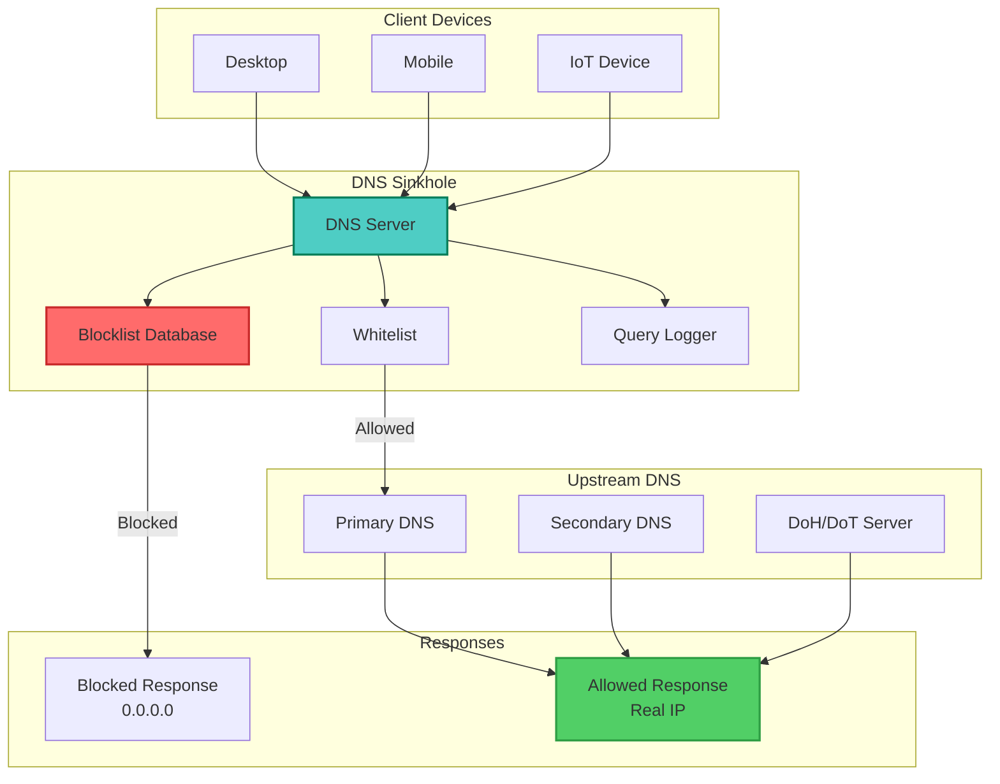
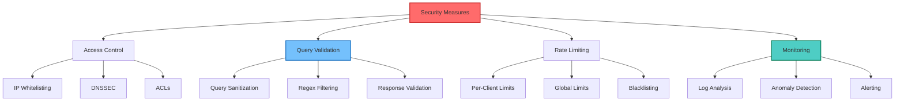
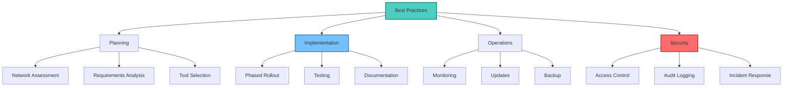

## Table of Contents

## Overview

A DNS sinkhole is a powerful network security mechanism that intercepts DNS queries for known malicious, unwanted, or tracking domains and returns false results, effectively blocking access to these domains at the DNS level. This guide covers multiple implementation approaches from simple to enterprise-grade solutions.

## DNS Sinkhole Architecture



## Basic DNS Sinkhole Implementation

### Using Dnsmasq

```bash
#!/bin/bash
# setup-dnsmasq-sinkhole.sh - Basic DNS sinkhole with dnsmasq

# Install dnsmasq
install_dnsmasq() {
    if command -v apt-get &> /dev/null; then
        sudo apt-get update
        sudo apt-get install -y dnsmasq
    elif command -v yum &> /dev/null; then
        sudo yum install -y dnsmasq
    else
        echo "Unsupported package manager"
        exit 1
    fi
}

# Configure dnsmasq
configure_dnsmasq() {
    # Backup original config
    sudo cp /etc/dnsmasq.conf /etc/dnsmasq.conf.backup

    # Create sinkhole configuration
    cat << 'EOF' | sudo tee /etc/dnsmasq.conf
# DNS Sinkhole Configuration

# Listen on all interfaces
interface=eth0
bind-interfaces

# Never forward plain names (without a dot or domain part)
domain-needed

# Never forward addresses in the non-routed address spaces
bogus-priv

# Don't read /etc/resolv.conf
no-resolv

# Upstream DNS servers
server=8.8.8.8
server=8.8.4.4
server=1.1.1.1

# Cache size
cache-size=10000

# Log queries (optional)
log-queries
log-facility=/var/log/dnsmasq.log

# Include blocklist configuration
conf-dir=/etc/dnsmasq.d/,*.conf
EOF

    # Create blocklist directory
    sudo mkdir -p /etc/dnsmasq.d/
}

# Download and setup blocklists
setup_blocklists() {
    local blocklist_dir="/etc/dnsmasq.d"

    # Create update script
    cat << 'EOF' | sudo tee /usr/local/bin/update-blocklists.sh
#!/bin/bash

BLOCKLIST_DIR="/etc/dnsmasq.d"
TEMP_DIR="/tmp/blocklists"

# Create temp directory
mkdir -p "$TEMP_DIR"

# Blocklist sources
declare -A BLOCKLISTS=(
    ["abuse"]="https://urlhaus.abuse.ch/downloads/hostfile/"
    ["someonewhocares"]="https://someonewhocares.org/hosts/zero/hosts"
    ["stevenblack"]="https://raw.githubusercontent.com/StevenBlack/hosts/master/hosts"
    ["adguard"]="https://raw.githubusercontent.com/AdguardTeam/AdguardSDNSFilter/master/Filters/filter.txt"
)

# Download and process blocklists
for name in "${!BLOCKLISTS[@]}"; do
    url="${BLOCKLISTS[$name]}"
    echo "Downloading $name blocklist..."

    wget -q -O "$TEMP_DIR/${name}.txt" "$url" || continue

    # Convert to dnsmasq format
    grep -E "^(0\.0\.0\.0|127\.0\.0\.1)" "$TEMP_DIR/${name}.txt" | \
        awk '{print "address=/" $2 "/0.0.0.0"}' | \
        grep -v "localhost" | \
        sort -u > "$BLOCKLIST_DIR/${name}.conf"
done

# Combine unique entries
cat "$BLOCKLIST_DIR"/*.conf | sort -u > "$BLOCKLIST_DIR/combined.conf.tmp"
mv "$BLOCKLIST_DIR/combined.conf.tmp" "$BLOCKLIST_DIR/combined.conf"

# Remove individual files if using combined
rm -f "$BLOCKLIST_DIR"/{abuse,someonewhocares,stevenblack,adguard}.conf

# Add custom blocks
cat >> "$BLOCKLIST_DIR/combined.conf" << 'CUSTOM'
# Custom blocked domains
address=/doubleclick.net/0.0.0.0
address=/googleadservices.com/0.0.0.0
address=/googlesyndication.com/0.0.0.0
address=/google-analytics.com/0.0.0.0
address=/facebook.com/pixel/0.0.0.0
CUSTOM

# Restart dnsmasq
systemctl restart dnsmasq

# Clean up
rm -rf "$TEMP_DIR"

echo "Blocklists updated: $(grep -c "address=" $BLOCKLIST_DIR/combined.conf) domains blocked"
EOF

    sudo chmod +x /usr/local/bin/update-blocklists.sh

    # Run initial update
    sudo /usr/local/bin/update-blocklists.sh

    # Setup cron job for daily updates
    echo "0 3 * * * root /usr/local/bin/update-blocklists.sh" | sudo tee /etc/cron.d/update-blocklists
}

# Setup whitelist
setup_whitelist() {
    cat << 'EOF' | sudo tee /etc/dnsmasq.d/whitelist.conf
# Whitelist - These domains will never be blocked
server=/github.com/#
server=/stackoverflow.com/#
server=/google.com/#
server=/cloudflare.com/#
EOF
}

# Enable and start service
enable_service() {
    sudo systemctl enable dnsmasq
    sudo systemctl restart dnsmasq

    # Test configuration
    sudo dnsmasq --test
}

# Main setup
main() {
    echo "Setting up DNS sinkhole with dnsmasq..."
    install_dnsmasq
    configure_dnsmasq
    setup_blocklists
    setup_whitelist
    enable_service
    echo "DNS sinkhole setup complete!"
}

main
```

## Advanced Pi-hole Implementation

### Automated Pi-hole Setup

```bash
#!/bin/bash
# setup-pihole-advanced.sh - Advanced Pi-hole configuration

# Install Pi-hole with custom settings
install_pihole() {
    # Create configuration
    cat << 'EOF' > /tmp/pihole-setupVars.conf
WEBPASSWORD=changeme
PIHOLE_INTERFACE=eth0
IPV4_ADDRESS=192.168.1.100/24
IPV6_ADDRESS=
QUERY_LOGGING=true
INSTALL_WEB_SERVER=true
INSTALL_WEB_INTERFACE=true
LIGHTTPD_ENABLED=true
BLOCKING_ENABLED=true
PIHOLE_DNS_1=1.1.1.1
PIHOLE_DNS_2=1.0.0.1
DNS_FQDN_REQUIRED=true
DNS_BOGUS_PRIV=true
DNSSEC=true
TEMPERATUREUNIT=C
WEBUIBOXEDLAYOUT=traditional
API_EXCLUDE_DOMAINS=
API_EXCLUDE_CLIENTS=
API_QUERY_LOG_SHOW=all
API_PRIVACY_MODE=0
EOF

    # Run Pi-hole installer
    curl -sSL https://install.pi-hole.net | sudo bash /dev/stdin --unattended
}

# Configure advanced blocklists
configure_blocklists() {
    # Add multiple blocklist sources
    cat << 'EOF' | sudo tee /etc/pihole/adlists.list
# Malware lists
https://raw.githubusercontent.com/StevenBlack/hosts/master/hosts
https://someonewhocares.org/hosts/zero/hosts
https://raw.githubusercontent.com/crazy-max/WindowsSpyBlocker/master/data/hosts/spy.txt
https://urlhaus.abuse.ch/downloads/hostfile/

# Advertising lists
https://raw.githubusercontent.com/AdguardTeam/AdguardSDNSFilter/master/Filters/filter.txt
https://v.firebog.net/hosts/Easylist.txt
https://raw.githubusercontent.com/anudeepND/blacklist/master/adservers.txt

# Tracking & Telemetry
https://v.firebog.net/hosts/Easyprivacy.txt
https://raw.githubusercontent.com/crazy-max/WindowsSpyBlocker/master/data/hosts/spy.txt
https://hostfiles.frogeye.fr/firstparty-trackers-hosts.txt

# Malicious lists
https://raw.githubusercontent.com/DandelionSprout/adfilt/master/Alternate%20versions%20Anti-Malware%20List/AntiMalwareHosts.txt
https://osint.digitalside.it/Threat-Intel/lists/latestdomains.txt
https://phishing.army/download/phishing_army_blocklist_extended.txt

# Suspicious lists
https://raw.githubusercontent.com/PolishFiltersTeam/KADhosts/master/KADhosts.txt
https://raw.githubusercontent.com/FadeMind/hosts.extras/master/add.Spam/hosts
EOF

    # Update gravity
    pihole -g
}

# Setup regex filters
setup_regex_filters() {
    # Add regex patterns for advanced blocking
    cat << 'EOF' | sudo tee /etc/pihole/regex.list
# Block all subdomains of tracking domains
^(.+\.)?google-analytics\.com$
^(.+\.)?googletagmanager\.com$
^(.+\.)?doubleclick\.net$
^(.+\.)?facebook\.com/tr
^(.+\.)?amazon-adsystem\.com$

# Block cryptocurrency miners
^(.+\.)?coinhive\.com$
^(.+\.)?coin-hive\.com$
^(.+\.)?crypto-loot\.com$

# Block specific tracking patterns
^(.+\.)?metric\.
^(.+\.)?telemetry\.
^(.+\.)?analytics\.
^(.+\.)?tracker\.
^(.+\.)?tracking\.
EOF

    # Import regex to database
    sudo pihole --regex-add "^(.+\.)?google-analytics\.com$"
}

# Configure DNS settings
configure_dns_settings() {
    # Setup DNS-over-HTTPS using cloudflared
    wget https://github.com/cloudflare/cloudflared/releases/latest/download/cloudflared-linux-amd64.deb
    sudo apt install ./cloudflared-linux-amd64.deb

    # Configure cloudflared
    sudo useradd -s /usr/sbin/nologin -r -M cloudflared

    cat << 'EOF' | sudo tee /etc/default/cloudflared
CLOUDFLARED_OPTS=--port 5053 --upstream https://1.1.1.1/dns-query --upstream https://1.0.0.1/dns-query
EOF

    # Create systemd service
    cat << 'EOF' | sudo tee /etc/systemd/system/cloudflared.service
[Unit]
Description=cloudflared DNS over HTTPS proxy
After=syslog.target network-online.target

[Service]
Type=simple
User=cloudflared
EnvironmentFile=/etc/default/cloudflared
ExecStart=/usr/local/bin/cloudflared proxy-dns $CLOUDFLARED_OPTS
Restart=on-failure
RestartSec=10
KillMode=process

[Install]
WantedBy=multi-user.target
EOF

    sudo systemctl enable cloudflared
    sudo systemctl start cloudflared

    # Configure Pi-hole to use cloudflared
    echo "server=127.0.0.1#5053" | sudo tee /etc/dnsmasq.d/01-pihole.conf
    sudo systemctl restart pihole-FTL
}

# Setup monitoring and logging
setup_monitoring() {
    # Create monitoring script
    cat << 'EOF' | sudo tee /usr/local/bin/pihole-monitor.sh
#!/bin/bash

# Monitor Pi-hole statistics
LOG_DIR="/var/log/pihole-monitor"
mkdir -p "$LOG_DIR"

# Function to get Pi-hole stats
get_stats() {
    local stats=$(pihole -c -j)
    echo "$stats" | jq -r '{
        domains_blocked: .domains_being_blocked,
        dns_queries_today: .dns_queries_today,
        ads_blocked_today: .ads_blocked_today,
        ads_percentage_today: .ads_percentage_today,
        unique_clients: .unique_clients,
        status: .status
    }'
}

# Log stats every 5 minutes
while true; do
    timestamp=$(date '+%Y-%m-%d %H:%M:%S')
    stats=$(get_stats)
    echo "[$timestamp] $stats" >> "$LOG_DIR/stats.log"

    # Alert if blocking percentage drops
    blocking_percentage=$(echo "$stats" | jq -r '.ads_percentage_today' | cut -d. -f1)
    if [[ $blocking_percentage -lt 10 ]]; then
        echo "[$timestamp] WARNING: Low blocking percentage: ${blocking_percentage}%" >> "$LOG_DIR/alerts.log"
    fi

    sleep 300
done
EOF

    sudo chmod +x /usr/local/bin/pihole-monitor.sh

    # Create systemd service
    cat << 'EOF' | sudo tee /etc/systemd/system/pihole-monitor.service
[Unit]
Description=Pi-hole Monitoring Service
After=pihole-FTL.service

[Service]
Type=simple
ExecStart=/usr/local/bin/pihole-monitor.sh
Restart=always
RestartSec=10

[Install]
WantedBy=multi-user.target
EOF

    sudo systemctl enable pihole-monitor
    sudo systemctl start pihole-monitor
}
```

## Bind9 DNS Sinkhole

### Enterprise Bind9 Setup

```bash
#!/bin/bash
# setup-bind9-sinkhole.sh - Enterprise-grade DNS sinkhole with Bind9

# Install BIND9
install_bind9() {
    sudo apt-get update
    sudo apt-get install -y bind9 bind9utils bind9-doc dnsutils
}

# Configure BIND9 as sinkhole
configure_bind9() {
    # Backup original config
    sudo cp -r /etc/bind /etc/bind.backup

    # Main configuration
    cat << 'EOF' | sudo tee /etc/bind/named.conf.options
options {
    directory "/var/cache/bind";

    // Forwarders for non-blocked queries
    forwarders {
        1.1.1.1;
        1.0.0.1;
        8.8.8.8;
        8.8.4.4;
    };

    // Security settings
    dnssec-validation auto;
    auth-nxdomain no;
    listen-on-v6 { any; };

    // Access control
    allow-query {
        localhost;
        192.168.0.0/16;
        172.16.0.0/12;
        10.0.0.0/8;
    };

    // Recursion for internal clients only
    recursion yes;
    allow-recursion {
        localhost;
        192.168.0.0/16;
        172.16.0.0/12;
        10.0.0.0/8;
    };

    // Rate limiting
    rate-limit {
        responses-per-second 10;
        window 5;
    };

    // Query logging
    querylog yes;
};

// Logging configuration
logging {
    channel default_log {
        file "/var/log/bind/default.log" versions 3 size 5m;
        severity dynamic;
        print-time yes;
    };

    channel query_log {
        file "/var/log/bind/query.log" versions 3 size 10m;
        severity info;
        print-time yes;
    };

    channel security_log {
        file "/var/log/bind/security.log" versions 3 size 5m;
        severity warning;
        print-time yes;
    };

    category default { default_log; };
    category queries { query_log; };
    category security { security_log; };
};
EOF

    # Create log directory
    sudo mkdir -p /var/log/bind
    sudo chown bind:bind /var/log/bind
}

# Setup Response Policy Zones (RPZ)
setup_rpz() {
    # RPZ configuration
    cat << 'EOF' | sudo tee -a /etc/bind/named.conf.options

// Response Policy Zone configuration
response-policy {
    zone "malware.rpz" policy given;
    zone "ads.rpz" policy given;
    zone "tracking.rpz" policy given;
    zone "custom.rpz" policy given;
};
EOF

    # Include RPZ zones
    cat << 'EOF' | sudo tee /etc/bind/named.conf.local
// RPZ zones for DNS sinkhole

zone "malware.rpz" {
    type master;
    file "/etc/bind/zones/db.malware.rpz";
    allow-query { none; };
};

zone "ads.rpz" {
    type master;
    file "/etc/bind/zones/db.ads.rpz";
    allow-query { none; };
};

zone "tracking.rpz" {
    type master;
    file "/etc/bind/zones/db.tracking.rpz";
    allow-query { none; };
};

zone "custom.rpz" {
    type master;
    file "/etc/bind/zones/db.custom.rpz";
    allow-query { none; };
};

// Sinkhole zone
zone "sinkhole" {
    type master;
    file "/etc/bind/zones/db.sinkhole";
};
EOF

    # Create zone directory
    sudo mkdir -p /etc/bind/zones

    # Create sinkhole zone file
    cat << 'EOF' | sudo tee /etc/bind/zones/db.sinkhole
$TTL 86400
@       IN      SOA     localhost. root.localhost. (
                        2021010101      ; Serial
                        3600            ; Refresh
                        1800            ; Retry
                        604800          ; Expire
                        86400 )         ; Minimum TTL

        IN      NS      localhost.
        IN      A       0.0.0.0
        IN      AAAA    ::
*       IN      A       0.0.0.0
*       IN      AAAA    ::
EOF

    # Create RPZ zone template
    create_rpz_zone() {
        local zone_name=$1
        cat << EOF | sudo tee "/etc/bind/zones/db.${zone_name}.rpz"
\$TTL 300
@       IN      SOA     localhost. root.localhost. (
                        $(date +%Y%m%d)01      ; Serial
                        3600                    ; Refresh
                        1800                    ; Retry
                        604800                  ; Expire
                        300 )                   ; Minimum TTL

        IN      NS      localhost.

; Blocked domains will be added below
EOF
    }

    # Create initial RPZ zones
    create_rpz_zone "malware"
    create_rpz_zone "ads"
    create_rpz_zone "tracking"
    create_rpz_zone "custom"
}

# Blocklist updater for RPZ
create_rpz_updater() {
    cat << 'EOF' | sudo tee /usr/local/bin/update-rpz-blocklists.sh
#!/bin/bash

# RPZ Blocklist Updater
ZONE_DIR="/etc/bind/zones"
TEMP_DIR="/tmp/rpz-update"
SERIAL=$(date +%Y%m%d%H)

mkdir -p "$TEMP_DIR"

# Function to convert hosts file to RPZ format
hosts_to_rpz() {
    local input_file=$1
    local output_file=$2

    echo "; Generated from $input_file on $(date)" > "$output_file"
    echo "" >> "$output_file"

    # Extract domains and convert to RPZ format
    grep -E "^(0\.0\.0\.0|127\.0\.0\.1)" "$input_file" | \
        awk '{if ($2 && $2 != "localhost") print $2 " CNAME sinkhole."}' | \
        sort -u >> "$output_file"

    # Add wildcards for subdomains
    grep -E "^(0\.0\.0\.0|127\.0\.0\.1)" "$input_file" | \
        awk '{if ($2 && $2 != "localhost") print "*." $2 " CNAME sinkhole."}' | \
        sort -u >> "$output_file"
}

# Update malware blocklist
echo "Updating malware blocklist..."
wget -q -O "$TEMP_DIR/malware-hosts.txt" \
    "https://urlhaus.abuse.ch/downloads/hostfile/"
hosts_to_rpz "$TEMP_DIR/malware-hosts.txt" "$TEMP_DIR/malware.rpz"

# Update ads blocklist
echo "Updating ads blocklist..."
wget -q -O "$TEMP_DIR/ads-hosts.txt" \
    "https://raw.githubusercontent.com/StevenBlack/hosts/master/hosts"
hosts_to_rpz "$TEMP_DIR/ads-hosts.txt" "$TEMP_DIR/ads.rpz"

# Update tracking blocklist
echo "Updating tracking blocklist..."
wget -q -O "$TEMP_DIR/tracking-hosts.txt" \
    "https://someonewhocares.org/hosts/zero/hosts"
hosts_to_rpz "$TEMP_DIR/tracking-hosts.txt" "$TEMP_DIR/tracking.rpz"

# Function to update RPZ zone
update_rpz_zone() {
    local zone_name=$1
    local new_data=$2
    local zone_file="$ZONE_DIR/db.${zone_name}.rpz"

    # Create new zone file with updated serial
    cat << ZONE > "$TEMP_DIR/${zone_name}.zone"
\$TTL 300
@       IN      SOA     localhost. root.localhost. (
                        $SERIAL         ; Serial
                        3600            ; Refresh
                        1800            ; Retry
                        604800          ; Expire
                        300 )           ; Minimum TTL

        IN      NS      localhost.

; Blocked domains
ZONE

    cat "$new_data" >> "$TEMP_DIR/${zone_name}.zone"

    # Check zone syntax
    if named-checkzone "${zone_name}.rpz" "$TEMP_DIR/${zone_name}.zone" > /dev/null 2>&1; then
        sudo mv "$TEMP_DIR/${zone_name}.zone" "$zone_file"
        echo "Updated ${zone_name} RPZ: $(grep -c "CNAME" $zone_file) domains blocked"
    else
        echo "ERROR: Invalid zone file for ${zone_name}"
    fi
}

# Update all zones
update_rpz_zone "malware" "$TEMP_DIR/malware.rpz"
update_rpz_zone "ads" "$TEMP_DIR/ads.rpz"
update_rpz_zone "tracking" "$TEMP_DIR/tracking.rpz"

# Reload BIND
sudo rndc reload

# Cleanup
rm -rf "$TEMP_DIR"

echo "RPZ blocklists updated successfully"
EOF

    sudo chmod +x /usr/local/bin/update-rpz-blocklists.sh

    # Create cron job
    echo "0 2 * * * root /usr/local/bin/update-rpz-blocklists.sh > /var/log/rpz-update.log 2>&1" | \
        sudo tee /etc/cron.d/update-rpz
}

# Setup custom blocking rules
setup_custom_blocks() {
    cat << 'EOF' | sudo tee -a /etc/bind/zones/db.custom.rpz
; Custom blocked domains
doubleclick.net         CNAME   sinkhole.
*.doubleclick.net       CNAME   sinkhole.
googleadservices.com    CNAME   sinkhole.
*.googleadservices.com  CNAME   sinkhole.
google-analytics.com    CNAME   sinkhole.
*.google-analytics.com  CNAME   sinkhole.
facebook.com.pixel      CNAME   sinkhole.
*.facebook.com.pixel    CNAME   sinkhole.

; Malware C&C servers (examples)
evil-malware.com        CNAME   sinkhole.
*.evil-malware.com      CNAME   sinkhole.
bad-tracker.net         CNAME   sinkhole.
*.bad-tracker.net       CNAME   sinkhole.
EOF
}

# Enable and start BIND
enable_bind() {
    # Check configuration
    sudo named-checkconf

    # Enable and start service
    sudo systemctl enable bind9
    sudo systemctl restart bind9

    # Verify it's working
    dig @localhost google.com
}

# Main installation
main() {
    echo "Setting up BIND9 DNS sinkhole..."
    install_bind9
    configure_bind9
    setup_rpz
    create_rpz_updater
    setup_custom_blocks
    enable_bind

    # Run initial update
    sudo /usr/local/bin/update-rpz-blocklists.sh

    echo "BIND9 DNS sinkhole setup complete!"
}

main
```

## Monitoring and Analytics

### DNS Query Analytics

```bash
#!/bin/bash
# dns-analytics.sh - Analyze DNS sinkhole queries

# Parse and analyze DNS logs
analyze_dns_logs() {
    local log_file="/var/log/bind/query.log"
    local output_dir="/var/www/html/dns-stats"

    mkdir -p "$output_dir"

    # Extract query statistics
    echo "Analyzing DNS queries..."

    # Top blocked domains
    grep "rpz QNAME" "$log_file" | \
        awk '{print $8}' | \
        sed 's/\.$//' | \
        sort | uniq -c | sort -rn | \
        head -50 > "$output_dir/top-blocked.txt"

    # Query types distribution
    awk '$0 ~ /query:/ {print $9}' "$log_file" | \
        sort | uniq -c | sort -rn > "$output_dir/query-types.txt"

    # Client statistics
    awk '$0 ~ /query:/ {print $6}' "$log_file" | \
        cut -d# -f1 | \
        sort | uniq -c | sort -rn > "$output_dir/top-clients.txt"

    # Hourly distribution
    awk '{print substr($1,12,2)}' "$log_file" | \
        sort | uniq -c > "$output_dir/hourly-distribution.txt"
}

# Generate HTML dashboard
generate_dashboard() {
    local output_dir="/var/www/html/dns-stats"

    cat << 'EOF' > "$output_dir/index.html"
<!DOCTYPE html>
<html>
<head>
    <title>DNS Sinkhole Analytics</title>
    <meta charset="UTF-8">
    <meta name="viewport" content="width=device-width, initial-scale=1.0">
    <script src="https://cdn.jsdelivr.net/npm/chart.js"></script>
    <style>
        body {
            font-family: Arial, sans-serif;
            margin: 20px;
            background-color: #f5f5f5;
        }
        .container {
            max-width: 1200px;
            margin: 0 auto;
        }
        .card {
            background: white;
            border-radius: 8px;
            padding: 20px;
            margin-bottom: 20px;
            box-shadow: 0 2px 4px rgba(0,0,0,0.1);
        }
        .metric {
            display: inline-block;
            margin: 10px 20px;
        }
        .metric-value {
            font-size: 2em;
            font-weight: bold;
            color: #333;
        }
        .metric-label {
            color: #666;
            font-size: 0.9em;
        }
        table {
            width: 100%;
            border-collapse: collapse;
        }
        th, td {
            padding: 8px 12px;
            text-align: left;
            border-bottom: 1px solid #ddd;
        }
        th {
            background-color: #f8f9fa;
            font-weight: bold;
        }
        .chart-container {
            position: relative;
            height: 300px;
            margin: 20px 0;
        }
    </style>
</head>
<body>
    <div class="container">
        <h1>DNS Sinkhole Analytics Dashboard</h1>

        <div class="card">
            <h2>Overview</h2>
            <div class="metric">
                <div class="metric-value" id="total-queries">0</div>
                <div class="metric-label">Total Queries</div>
            </div>
            <div class="metric">
                <div class="metric-value" id="blocked-queries">0</div>
                <div class="metric-label">Blocked Queries</div>
            </div>
            <div class="metric">
                <div class="metric-value" id="block-rate">0%</div>
                <div class="metric-label">Block Rate</div>
            </div>
            <div class="metric">
                <div class="metric-value" id="unique-clients">0</div>
                <div class="metric-label">Unique Clients</div>
            </div>
        </div>

        <div class="card">
            <h2>Query Distribution</h2>
            <div class="chart-container">
                <canvas id="queryChart"></canvas>
            </div>
        </div>

        <div class="card">
            <h2>Top Blocked Domains</h2>
            <table id="blocked-domains-table">
                <thead>
                    <tr>
                        <th>Domain</th>
                        <th>Count</th>
                        <th>Category</th>
                    </tr>
                </thead>
                <tbody></tbody>
            </table>
        </div>

        <div class="card">
            <h2>Client Activity</h2>
            <table id="client-table">
                <thead>
                    <tr>
                        <th>Client IP</th>
                        <th>Queries</th>
                        <th>Blocked</th>
                        <th>Block Rate</th>
                    </tr>
                </thead>
                <tbody></tbody>
            </table>
        </div>
    </div>

    <script>
        // Load and display analytics data
        async function loadAnalytics() {
            try {
                const response = await fetch('analytics-data.json');
                const data = await response.json();

                // Update metrics
                document.getElementById('total-queries').textContent = data.totalQueries.toLocaleString();
                document.getElementById('blocked-queries').textContent = data.blockedQueries.toLocaleString();
                document.getElementById('block-rate').textContent = data.blockRate + '%';
                document.getElementById('unique-clients').textContent = data.uniqueClients;

                // Create query distribution chart
                const ctx = document.getElementById('queryChart').getContext('2d');
                new Chart(ctx, {
                    type: 'line',
                    data: {
                        labels: data.hourlyLabels,
                        datasets: [{
                            label: 'Total Queries',
                            data: data.hourlyQueries,
                            borderColor: 'rgb(75, 192, 192)',
                            tension: 0.1
                        }, {
                            label: 'Blocked Queries',
                            data: data.hourlyBlocked,
                            borderColor: 'rgb(255, 99, 132)',
                            tension: 0.1
                        }]
                    },
                    options: {
                        responsive: true,
                        maintainAspectRatio: false,
                        scales: {
                            y: {
                                beginAtZero: true
                            }
                        }
                    }
                });

                // Populate tables
                populateBlockedDomainsTable(data.topBlockedDomains);
                populateClientTable(data.topClients);

            } catch (error) {
                console.error('Error loading analytics:', error);
            }
        }

        function populateBlockedDomainsTable(domains) {
            const tbody = document.querySelector('#blocked-domains-table tbody');
            domains.forEach(domain => {
                const row = tbody.insertRow();
                row.insertCell(0).textContent = domain.name;
                row.insertCell(1).textContent = domain.count.toLocaleString();
                row.insertCell(2).textContent = domain.category;
            });
        }

        function populateClientTable(clients) {
            const tbody = document.querySelector('#client-table tbody');
            clients.forEach(client => {
                const row = tbody.insertRow();
                row.insertCell(0).textContent = client.ip;
                row.insertCell(1).textContent = client.queries.toLocaleString();
                row.insertCell(2).textContent = client.blocked.toLocaleString();
                row.insertCell(3).textContent = client.blockRate + '%';
            });
        }

        // Load data on page load
        loadAnalytics();

        // Refresh every 5 minutes
        setInterval(loadAnalytics, 300000);
    </script>
</body>
</html>
EOF
}

# Generate JSON data for dashboard
generate_analytics_json() {
    local output_dir="/var/www/html/dns-stats"
    local log_file="/var/log/bind/query.log"

    python3 - "$log_file" "$output_dir" << 'EOF'
import json
import re
import sys
from collections import defaultdict, Counter
from datetime import datetime

log_file = sys.argv[1]
output_dir = sys.argv[2]

# Initialize counters
total_queries = 0
blocked_queries = 0
hourly_queries = defaultdict(int)
hourly_blocked = defaultdict(int)
blocked_domains = Counter()
client_stats = defaultdict(lambda: {'queries': 0, 'blocked': 0})

# Parse log file
with open(log_file, 'r') as f:
    for line in f:
        total_queries += 1

        # Extract timestamp
        match = re.search(r'(\d{2}:\d{2}:\d{2})', line)
        if match:
            hour = match.group(1)[:2]
            hourly_queries[hour] += 1

        # Check if blocked
        if 'rpz QNAME' in line:
            blocked_queries += 1
            if match:
                hourly_blocked[hour] += 1

            # Extract blocked domain
            domain_match = re.search(r'rpz QNAME.*?(\S+)\s+IN', line)
            if domain_match:
                domain = domain_match.group(1).rstrip('.')
                blocked_domains[domain] += 1

        # Extract client IP
        client_match = re.search(r'client.*?(\d+\.\d+\.\d+\.\d+)', line)
        if client_match:
            client = client_match.group(1)
            client_stats[client]['queries'] += 1
            if 'rpz QNAME' in line:
                client_stats[client]['blocked'] += 1

# Calculate metrics
block_rate = round((blocked_queries / total_queries * 100) if total_queries > 0 else 0, 2)
unique_clients = len(client_stats)

# Prepare data for JSON
analytics_data = {
    'totalQueries': total_queries,
    'blockedQueries': blocked_queries,
    'blockRate': block_rate,
    'uniqueClients': unique_clients,
    'hourlyLabels': [f'{h:02d}:00' for h in range(24)],
    'hourlyQueries': [hourly_queries.get(f'{h:02d}', 0) for h in range(24)],
    'hourlyBlocked': [hourly_blocked.get(f'{h:02d}', 0) for h in range(24)],
    'topBlockedDomains': [
        {
            'name': domain,
            'count': count,
            'category': categorize_domain(domain)
        }
        for domain, count in blocked_domains.most_common(50)
    ],
    'topClients': [
        {
            'ip': ip,
            'queries': stats['queries'],
            'blocked': stats['blocked'],
            'blockRate': round((stats['blocked'] / stats['queries'] * 100) if stats['queries'] > 0 else 0, 2)
        }
        for ip, stats in sorted(client_stats.items(), key=lambda x: x[1]['queries'], reverse=True)[:20]
    ]
}

def categorize_domain(domain):
    if 'google-analytics' in domain or 'googletagmanager' in domain:
        return 'Analytics'
    elif 'doubleclick' in domain or 'adsystem' in domain:
        return 'Advertising'
    elif 'facebook' in domain or 'fbcdn' in domain:
        return 'Social Media'
    elif 'malware' in domain or 'virus' in domain:
        return 'Malware'
    else:
        return 'Other'

# Write JSON file
with open(f'{output_dir}/analytics-data.json', 'w') as f:
    json.dump(analytics_data, f, indent=2)

print(f"Analytics data generated: {total_queries} queries analyzed")
EOF
}

# Create analytics cron job
setup_analytics_cron() {
    cat << 'EOF' | sudo tee /usr/local/bin/update-dns-analytics.sh
#!/bin/bash

# Update DNS analytics
/usr/local/bin/dns-analytics.sh
EOF

    sudo chmod +x /usr/local/bin/update-dns-analytics.sh

    # Run every 15 minutes
    echo "*/15 * * * * root /usr/local/bin/update-dns-analytics.sh" | \
        sudo tee /etc/cron.d/dns-analytics
}
```

## Security Hardening

### DNS Sinkhole Security



### Security Configuration

```bash
#!/bin/bash
# secure-dns-sinkhole.sh - Security hardening for DNS sinkhole

# Configure firewall rules
setup_firewall() {
    # Allow DNS queries only from internal networks
    sudo ufw allow from 192.168.0.0/16 to any port 53
    sudo ufw allow from 172.16.0.0/12 to any port 53
    sudo ufw allow from 10.0.0.0/8 to any port 53

    # Allow DNS over TLS/HTTPS
    sudo ufw allow 853/tcp  # DoT
    sudo ufw allow 443/tcp  # DoH

    # Rate limiting
    sudo iptables -A INPUT -p udp --dport 53 -m recent --set --name DNS
    sudo iptables -A INPUT -p udp --dport 53 -m recent --update --seconds 1 --hitcount 10 --name DNS -j DROP

    # Save rules
    sudo netfilter-persistent save
}

# Setup DNSSEC
configure_dnssec() {
    # Generate DNSSEC keys
    cd /etc/bind/keys
    sudo dnssec-keygen -a RSASHA256 -b 2048 -n ZONE sinkhole
    sudo dnssec-keygen -a RSASHA256 -b 4096 -n ZONE -f KSK sinkhole

    # Sign zones
    sudo dnssec-signzone -A -3 $(head -c 1000 /dev/random | sha1sum | cut -b 1-16) \
        -N INCREMENT -o sinkhole -t /etc/bind/zones/db.sinkhole
}

# Implement query logging and analysis
setup_security_monitoring() {
    cat << 'EOF' | sudo tee /usr/local/bin/dns-security-monitor.sh
#!/bin/bash

# DNS Security Monitor
LOG_FILE="/var/log/bind/query.log"
ALERT_LOG="/var/log/dns-security-alerts.log"

# Thresholds
QUERY_THRESHOLD=1000  # Queries per minute per client
NXDOMAIN_THRESHOLD=100  # NXDOMAIN responses per minute

# Monitor for anomalies
tail -F "$LOG_FILE" | while read line; do
    # Extract client IP
    client=$(echo "$line" | grep -oE 'client[[:space:]]+[^#]+' | awk '{print $2}')

    # Count queries per client
    query_count=$(grep -c "$client" "$LOG_FILE" | tail -n 1000)

    if [[ $query_count -gt $QUERY_THRESHOLD ]]; then
        echo "[$(date)] ALERT: High query rate from $client: $query_count queries" >> "$ALERT_LOG"

        # Temporarily block client
        sudo iptables -A INPUT -s "$client" -p udp --dport 53 -j DROP
        echo "[$(date)] Blocked $client for excessive queries" >> "$ALERT_LOG"
    fi

    # Check for DNS tunneling attempts
    if echo "$line" | grep -qE "TXT.*[a-zA-Z0-9]{50,}"; then
        echo "[$(date)] ALERT: Possible DNS tunneling attempt: $line" >> "$ALERT_LOG"
    fi

    # Check for cache poisoning attempts
    if echo "$line" | grep -qE "response.*REFUSED|FORMERR"; then
        echo "[$(date)] WARNING: Suspicious response: $line" >> "$ALERT_LOG"
    fi
done
EOF

    sudo chmod +x /usr/local/bin/dns-security-monitor.sh

    # Create systemd service
    cat << 'EOF' | sudo tee /etc/systemd/system/dns-security-monitor.service
[Unit]
Description=DNS Security Monitor
After=bind9.service

[Service]
Type=simple
ExecStart=/usr/local/bin/dns-security-monitor.sh
Restart=always
RestartSec=10

[Install]
WantedBy=multi-user.target
EOF

    sudo systemctl enable dns-security-monitor
    sudo systemctl start dns-security-monitor
}
```

## Performance Optimization

### Caching and Performance

```bash
#!/bin/bash
# optimize-dns-performance.sh - Performance tuning for DNS sinkhole

# Optimize BIND performance
optimize_bind_performance() {
    cat << 'EOF' | sudo tee -a /etc/bind/named.conf.options

// Performance tuning
max-cache-size 512M;
max-cache-ttl 3600;
max-ncache-ttl 300;

// Thread tuning
recursive-clients 10000;
tcp-clients 1000;
tcp-listen-queue 100;

// EDNS tuning
edns-udp-size 4096;
max-udp-size 4096;

// Prefetch popular records
prefetch 2 9;

// Minimal responses
minimal-responses yes;
EOF
}

# Setup Redis caching layer
setup_redis_cache() {
    # Install Redis
    sudo apt-get install -y redis-server redis-tools

    # Configure Redis for DNS caching
    cat << 'EOF' | sudo tee -a /etc/redis/redis.conf
# DNS Cache Configuration
maxmemory 1gb
maxmemory-policy allkeys-lru
save ""
appendonly no
EOF

    # Create DNS cache interface
    cat << 'EOF' | sudo tee /usr/local/bin/dns-cache-layer.py
#!/usr/bin/env python3

import redis
import socket
import struct
import threading
import time

class DNSCache:
    def __init__(self):
        self.redis = redis.Redis(host='localhost', port=6379, db=0)
        self.upstream_dns = '127.0.0.1'
        self.upstream_port = 5353  # BIND on different port

    def cache_key(self, query):
        return f"dns:{query['name']}:{query['type']}"

    def get_cached(self, query):
        key = self.cache_key(query)
        cached = self.redis.get(key)
        if cached:
            return cached
        return None

    def set_cached(self, query, response, ttl=300):
        key = self.cache_key(query)
        self.redis.setex(key, ttl, response)

    def handle_query(self, data, addr, sock):
        # Try cache first
        cached = self.get_cached(parse_dns_query(data))
        if cached:
            sock.sendto(cached, addr)
            return

        # Forward to upstream
        upstream_sock = socket.socket(socket.AF_INET, socket.SOCK_DGRAM)
        upstream_sock.sendto(data, (self.upstream_dns, self.upstream_port))

        response, _ = upstream_sock.recvfrom(4096)
        upstream_sock.close()

        # Cache and return response
        self.set_cached(parse_dns_query(data), response)
        sock.sendto(response, addr)

    def run(self):
        sock = socket.socket(socket.AF_INET, socket.SOCK_DGRAM)
        sock.bind(('0.0.0.0', 53))

        while True:
            data, addr = sock.recvfrom(4096)
            threading.Thread(target=self.handle_query, args=(data, addr, sock)).start()

if __name__ == '__main__':
    cache = DNSCache()
    cache.run()
EOF

    sudo chmod +x /usr/local/bin/dns-cache-layer.py
}
```

## Integration Examples

### Docker Deployment

```yaml
# docker-compose.yml - DNS Sinkhole Stack
version: "3.8"

services:
  pihole:
    container_name: pihole
    image: pihole/pihole:latest
    ports:
      - "53:53/tcp"
      - "53:53/udp"
      - "67:67/udp"
      - "80:80/tcp"
    environment:
      TZ: "America/New_York"
      WEBPASSWORD: "secure_password_here"
      PIHOLE_DNS_: "1.1.1.1;1.0.0.1"
      DNSSEC: "true"
      CONDITIONAL_FORWARDING: "true"
      CONDITIONAL_FORWARDING_IP: "192.168.1.1"
      CONDITIONAL_FORWARDING_DOMAIN: "local"
    volumes:
      - "./pihole/etc-pihole:/etc/pihole"
      - "./pihole/etc-dnsmasq.d:/etc/dnsmasq.d"
    cap_add:
      - NET_ADMIN
    restart: unless-stopped

  unbound:
    container_name: unbound
    image: mvance/unbound:latest
    ports:
      - "5353:53/tcp"
      - "5353:53/udp"
    volumes:
      - "./unbound:/opt/unbound/etc/unbound"
    restart: unless-stopped

  grafana:
    container_name: grafana
    image: grafana/grafana:latest
    ports:
      - "3000:3000"
    environment:
      - GF_SECURITY_ADMIN_PASSWORD=admin
    volumes:
      - grafana-storage:/var/lib/grafana
      - ./grafana/dashboards:/etc/grafana/provisioning/dashboards
    restart: unless-stopped

  prometheus:
    container_name: prometheus
    image: prom/prometheus:latest
    ports:
      - "9090:9090"
    volumes:
      - ./prometheus/prometheus.yml:/etc/prometheus/prometheus.yml
      - prometheus-storage:/prometheus
    command:
      - "--config.file=/etc/prometheus/prometheus.yml"
      - "--storage.tsdb.path=/prometheus"
    restart: unless-stopped

volumes:
  grafana-storage:
  prometheus-storage:
```

### Kubernetes Deployment

```yaml
# dns-sinkhole-k8s.yaml - Kubernetes deployment
apiVersion: v1
kind: Namespace
metadata:
  name: dns-sinkhole

---
apiVersion: v1
kind: ConfigMap
metadata:
  name: pihole-config
  namespace: dns-sinkhole
data:
  TZ: "UTC"
  PIHOLE_DNS_: "1.1.1.1;1.0.0.1"
  DNSSEC: "true"

---
apiVersion: apps/v1
kind: Deployment
metadata:
  name: pihole
  namespace: dns-sinkhole
spec:
  replicas: 2
  selector:
    matchLabels:
      app: pihole
  template:
    metadata:
      labels:
        app: pihole
    spec:
      containers:
        - name: pihole
          image: pihole/pihole:latest
          ports:
            - containerPort: 53
              protocol: TCP
            - containerPort: 53
              protocol: UDP
            - containerPort: 80
              protocol: TCP
          envFrom:
            - configMapRef:
                name: pihole-config
          volumeMounts:
            - name: pihole-storage
              mountPath: /etc/pihole
            - name: dnsmasq-storage
              mountPath: /etc/dnsmasq.d
      volumes:
        - name: pihole-storage
          persistentVolumeClaim:
            claimName: pihole-pvc
        - name: dnsmasq-storage
          persistentVolumeClaim:
            claimName: dnsmasq-pvc

---
apiVersion: v1
kind: Service
metadata:
  name: pihole-dns
  namespace: dns-sinkhole
spec:
  selector:
    app: pihole
  ports:
    - name: dns-tcp
      port: 53
      protocol: TCP
    - name: dns-udp
      port: 53
      protocol: UDP
  type: LoadBalancer

---
apiVersion: v1
kind: Service
metadata:
  name: pihole-web
  namespace: dns-sinkhole
spec:
  selector:
    app: pihole
  ports:
    - name: http
      port: 80
      protocol: TCP
  type: ClusterIP
```

## Maintenance and Updates

### Automated Maintenance

```bash
#!/bin/bash
# dns-sinkhole-maintenance.sh - Automated maintenance tasks

# Backup configuration and blocklists
backup_sinkhole() {
    local backup_dir="/backup/dns-sinkhole/$(date +%Y%m%d)"
    mkdir -p "$backup_dir"

    # Backup Pi-hole
    if command -v pihole &> /dev/null; then
        pihole -a -t "$backup_dir/pihole-teleporter.tar.gz"
    fi

    # Backup BIND
    if [[ -d /etc/bind ]]; then
        tar -czf "$backup_dir/bind-config.tar.gz" /etc/bind/
    fi

    # Backup custom scripts
    tar -czf "$backup_dir/scripts.tar.gz" /usr/local/bin/*dns* /usr/local/bin/*block*

    # Rotate old backups (keep last 30 days)
    find /backup/dns-sinkhole -type d -mtime +30 -exec rm -rf {} \;
}

# Update all components
update_sinkhole() {
    echo "Updating DNS sinkhole components..."

    # Update system packages
    sudo apt-get update
    sudo apt-get upgrade -y

    # Update Pi-hole
    if command -v pihole &> /dev/null; then
        pihole -up
    fi

    # Update blocklists
    /usr/local/bin/update-blocklists.sh
    /usr/local/bin/update-rpz-blocklists.sh

    # Restart services
    sudo systemctl restart bind9 || true
    sudo systemctl restart pihole-FTL || true
    sudo systemctl restart dnsmasq || true
}

# Health check
health_check() {
    local status="healthy"

    # Check DNS resolution
    if ! dig @localhost google.com +short &> /dev/null; then
        echo "ERROR: DNS resolution failed"
        status="unhealthy"
    fi

    # Check if blocking is working
    if ! dig @localhost doubleclick.net +short | grep -q "0.0.0.0"; then
        echo "WARNING: Blocking might not be working"
        status="degraded"
    fi

    # Check service status
    for service in bind9 pihole-FTL dnsmasq; do
        if systemctl is-active --quiet $service 2>/dev/null; then
            echo "$service: active"
        fi
    done

    echo "Health check status: $status"
}

# Main maintenance routine
main() {
    echo "Starting DNS sinkhole maintenance: $(date)"

    backup_sinkhole
    update_sinkhole
    health_check

    echo "Maintenance completed: $(date)"
}

# Run with logging
main 2>&1 | tee -a /var/log/dns-sinkhole-maintenance.log
```

## Best Practices

### Implementation Strategy



## Conclusion

A well-implemented DNS sinkhole provides:

- **Malware Protection**: Blocks communication with C&C servers
- **Ad Blocking**: Eliminates advertisements at the network level
- **Privacy Enhancement**: Prevents tracking and telemetry
- **Bandwidth Savings**: Reduces unnecessary network traffic
- **Centralized Control**: Single point for network-wide filtering
- **Performance Improvement**: Faster browsing through local caching

Key considerations for deployment:

1. Choose the right solution for your environment (Pi-hole for home, BIND for enterprise)
2. Maintain updated blocklists from multiple reputable sources
3. Implement proper monitoring and alerting
4. Plan for redundancy and high availability
5. Regular maintenance and updates
6. User education about false positives and whitelisting

The DNS sinkhole serves as a critical first line of defense in network security, complementing other security measures while improving the overall user experience.
