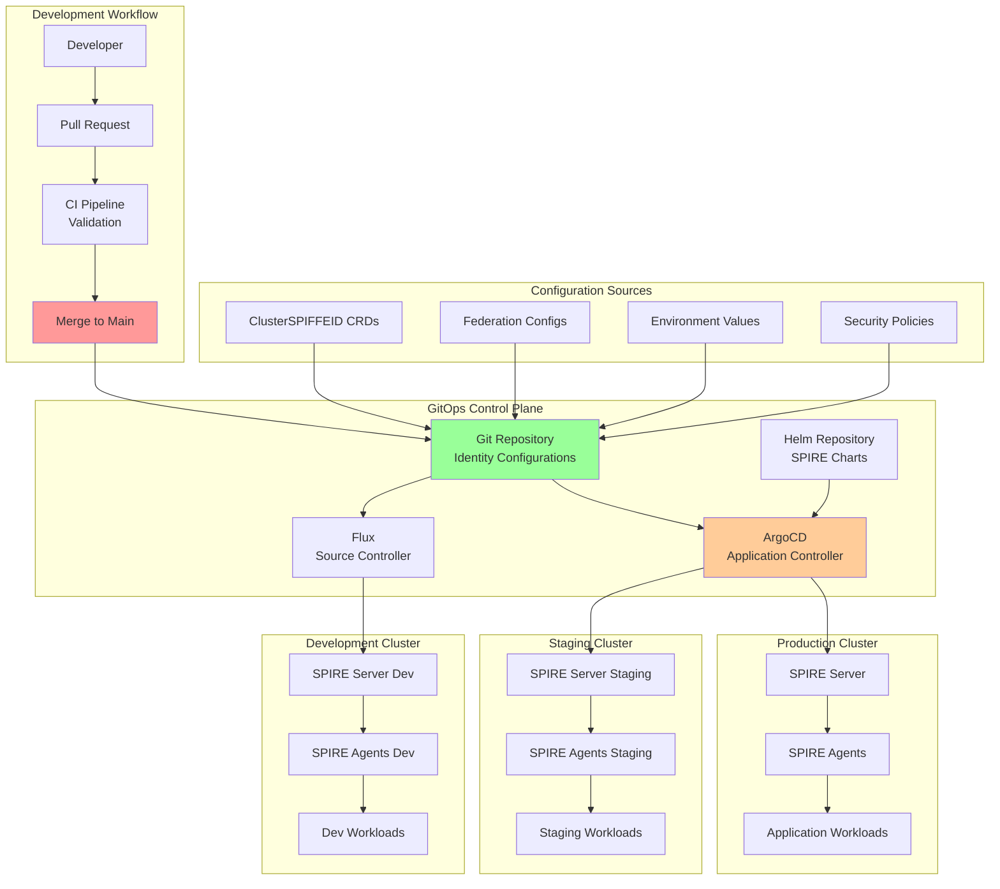

## Introduction: Identity Management as Code

In our [previous guides](/spiffe-spire-kubernetes-complete-guide), we've built sophisticated SPIFFE/SPIRE deployments with multi-cluster federation and advanced security patterns. However, managing these complex identity infrastructures manually becomes unsustainable at enterprise scale. This is where GitOps principles transform identity management from a manual, error-prone process into a declarative, automated, and auditable system.

This comprehensive guide explores how to implement GitOps patterns for SPIFFE/SPIRE, covering everything from basic deployment automation to advanced multi-environment identity governance with full audit trails and compliance reporting.

## GitOps Architecture for Identity Infrastructure

Let's visualize a complete GitOps workflow for SPIFFE/SPIRE:



### GitOps Benefits for Identity Management

1. **Declarative Configuration**: All identity policies defined as code
2. **Audit Trail**: Complete history of identity changes in Git
3. **Automated Rollback**: Quick recovery from identity misconfigurations
4. **Environment Consistency**: Identical deployments across dev/staging/prod
5. **Compliance**: Automated policy enforcement and reporting
6. **Collaboration**: Review process for identity changes

## Repository Structure and Organization

### Git Repository Layout

Let's establish a comprehensive repository structure for SPIFFE/SPIRE GitOps:

```bash
spiffe-gitops/
├── README.md
├── .gitignore
├── .github/
│   └── workflows/
│       ├── validate-spiffe-config.yml
│       ├── security-scan.yml
│       └── deploy-staging.yml
├── environments/
│   ├── development/
│   │   ├── kustomization.yaml
│   │   ├── spire-values.yaml
│   │   ├── cluster-spiffe-ids/
│   │   └── federation/
│   ├── staging/
│   │   ├── kustomization.yaml
│   │   ├── spire-values.yaml
│   │   ├── cluster-spiffe-ids/
│   │   └── federation/
│   └── production/
│       ├── kustomization.yaml
│       ├── spire-values.yaml
│       ├── cluster-spiffe-ids/
│       └── federation/
├── base/
│   ├── spire-server/
│   │   ├── kustomization.yaml
│   │   ├── namespace.yaml
│   │   ├── configmap.yaml
│   │   ├── statefulset.yaml
│   │   └── service.yaml
│   ├── spire-agent/
│   │   ├── kustomization.yaml
│   │   ├── daemonset.yaml
│   │   ├── configmap.yaml
│   │   └── rbac.yaml
│   └── common/
│       ├── crds/
│       ├── rbac/
│       └── policies/
├── charts/
│   ├── spire-custom/
│   │   ├── Chart.yaml
│   │   ├── values.yaml
│   │   └── templates/
│   └── spiffe-helper/
├── applications/
│   ├── argocd/
│   │   ├── app-of-apps.yaml
│   │   ├── spire-dev.yaml
│   │   ├── spire-staging.yaml
│   │   └── spire-production.yaml
│   └── flux/
│       ├── clusters/
│       ├── sources/
│       └── kustomizations/
├── policies/
│   ├── opa/
│   │   ├── spiffe-policies.rego
│   │   └── federation-policies.rego
│   ├── kustomize/
│   └── helm/
├── scripts/
│   ├── validate-spiffe-ids.sh
│   ├── generate-trust-bundle.sh
│   └── migration/
└── docs/
    ├── deployment-guide.md
    ├── troubleshooting.md
    └── runbooks/
```

## ArgoCD Configuration for SPIFFE/SPIRE

### App-of-Apps Pattern

```yaml
# applications/argocd/app-of-apps.yaml
apiVersion: argoproj.io/v1alpha1
kind: Application
metadata:
  name: spiffe-suite
  namespace: argocd
  finalizers:
    - resources-finalizer.argocd.argoproj.io
spec:
  project: default
  source:
    repoURL: https://github.com/company/spiffe-gitops
    targetRevision: main
    path: applications/argocd
  destination:
    server: https://kubernetes.default.svc
    namespace: argocd
  syncPolicy:
    automated:
      prune: true
      selfHeal: true
      allowEmpty: false
    syncOptions:
      - CreateNamespace=true
      - PrunePropagationPolicy=foreground
      - PruneLast=true
    retry:
      limit: 5
      backoff:
        duration: 5s
        factor: 2
        maxDuration: 3m
---
# SPIRE Development Environment
apiVersion: argoproj.io/v1alpha1
kind: Application
metadata:
  name: spire-development
  namespace: argocd
spec:
  project: spiffe-project
  source:
    repoURL: https://github.com/company/spiffe-gitops
    targetRevision: main
    path: environments/development
  destination:
    server: https://dev-cluster.company.com
    namespace: spire-system
  syncPolicy:
    automated:
      prune: true
      selfHeal: true
    syncOptions:
      - CreateNamespace=true
      - ServerSideApply=true
      - ApplyOutOfSyncOnly=true
    managedNamespaceMetadata:
      labels:
        environment: development
        managed-by: argocd
        spire-managed: "true"
  revisionHistoryLimit: 10
  ignoreDifferences:
    - group: apps
      kind: Deployment
      jsonPointers:
        - /spec/replicas
    - group: ""
      kind: ConfigMap
      name: spire-server-config
      jsonPointers:
        - /data/server.conf
---
# SPIRE Staging Environment
apiVersion: argoproj.io/v1alpha1
kind: Application
metadata:
  name: spire-staging
  namespace: argocd
  annotations:
    argocd.argoproj.io/sync-wave: "1"
spec:
  project: spiffe-project
  source:
    repoURL: https://github.com/company/spiffe-gitops
    targetRevision: main
    path: environments/staging
  destination:
    server: https://staging-cluster.company.com
    namespace: spire-system
  syncPolicy:
    # Manual sync for staging (requires approval)
    automated:
      prune: false
      selfHeal: false
    syncOptions:
      - CreateNamespace=true
      - ServerSideApply=true
      - RespectIgnoreDifferences=true
      # Require approval for staging changes
      - SkipDryRunOnMissingResource=true
  revisionHistoryLimit: 20
  # Pre-sync hooks for validation
  operation:
    sync:
      preSyncHooks:
        - name: validate-staging-config
          image: company/spire-validator:v1.0.0
          command: ["/bin/sh"]
          args:
            - -c
            - |
              echo "Validating SPIRE configuration for staging..."
              /opt/spire-validator/validate-config.sh /config/
              echo "Validation complete"
          volumes:
            - name: config
              configMap:
                name: spire-server-config
---
# SPIRE Production Environment
apiVersion: argoproj.io/v1alpha1
kind: Application
metadata:
  name: spire-production
  namespace: argocd
  annotations:
    argocd.argoproj.io/sync-wave: "2"
    notifications.argoproj.io/subscribe.on-sync-failed.slack: spire-alerts
    notifications.argoproj.io/subscribe.on-sync-succeeded.slack: spire-deployments
spec:
  project: spiffe-project
  source:
    repoURL: https://github.com/company/spiffe-gitops
    targetRevision: main
    path: environments/production
  destination:
    server: https://prod-cluster.company.com
    namespace: spire-system
  syncPolicy:
    # Manual sync only for production
    automated: {}
    syncOptions:
      - CreateNamespace=true
      - ServerSideApply=true
      - PrunePropagationPolicy=background
      - Replace=false
  # Enhanced validation for production
  operation:
    sync:
      preSyncHooks:
        - name: backup-current-config
          image: company/spire-backup:v1.0.0
          command: ["/scripts/backup-spire-config.sh"]
        - name: validate-production-config
          image: company/spire-validator:v1.0.0
          command: ["/scripts/validate-production.sh"]
        - name: security-scan
          image: company/security-scanner:v1.0.0
          command: ["/scripts/scan-spire-config.sh"]
      postSyncHooks:
        - name: health-check
          image: company/spire-health-checker:v1.0.0
          command: ["/scripts/verify-deployment.sh"]
        - name: notify-success
          image: curlimages/curl:latest
          command: ["/bin/sh"]
          args:
            - -c
            - |
              curl -X POST https://hooks.slack.com/services/xxx/yyy/zzz \
                -H 'Content-type: application/json' \
                --data '{"text":"SPIRE production deployment successful"}'
  revisionHistoryLimit: 50
```

### ArgoCD Project Configuration

```yaml
# applications/argocd/spiffe-project.yaml
apiVersion: argoproj.io/v1alpha1
kind: AppProject
metadata:
  name: spiffe-project
  namespace: argocd
spec:
  description: "SPIFFE/SPIRE Identity Infrastructure Project"

  # Source repositories
  sourceRepos:
    - https://github.com/company/spiffe-gitops
    - https://spiffe.github.io/helm-charts-hardened

  # Destination clusters and namespaces
  destinations:
    - namespace: spire-system
      server: https://dev-cluster.company.com
    - namespace: spire-system
      server: https://staging-cluster.company.com
    - namespace: spire-system
      server: https://prod-cluster.company.com
    - namespace: "spire-*"
      server: "*"

  # Cluster resource whitelist
  clusterResourceWhitelist:
    - group: ""
      kind: Namespace
    - group: "rbac.authorization.k8s.io"
      kind: ClusterRole
    - group: "rbac.authorization.k8s.io"
      kind: ClusterRoleBinding
    - group: "apiextensions.k8s.io"
      kind: CustomResourceDefinition
    - group: "spire.spiffe.io"
      kind: ClusterSPIFFEID
    - group: "spire.spiffe.io"
      kind: ClusterFederatedTrustDomain

  # Namespace resource whitelist
  namespaceResourceWhitelist:
    - group: ""
      kind: ConfigMap
    - group: ""
      kind: Secret
    - group: ""
      kind: Service
    - group: ""
      kind: ServiceAccount
    - group: "apps"
      kind: Deployment
    - group: "apps"
      kind: StatefulSet
    - group: "apps"
      kind: DaemonSet
    - group: "monitoring.coreos.com"
      kind: ServiceMonitor
    - group: "networking.k8s.io"
      kind: NetworkPolicy

  # RBAC policies
  roles:
    - name: spire-admin
      description: "Full access to SPIRE resources"
      policies:
        - p, proj:spiffe-project:spire-admin, applications, *, spiffe-project/*, allow
        - p, proj:spiffe-project:spire-admin, repositories, *, *, allow
        - p, proj:spiffe-project:spire-admin, certificates, *, *, allow
      groups:
        - company:spire-administrators

    - name: spire-operator
      description: "Operational access to SPIRE resources"
      policies:
        - p, proj:spiffe-project:spire-operator, applications, get, spiffe-project/*, allow
        - p, proj:spiffe-project:spire-operator, applications, sync, spiffe-project/spire-development, allow
        - p, proj:spiffe-project:spire-operator, applications, sync, spiffe-project/spire-staging, allow
      groups:
        - company:platform-engineers

    - name: spire-viewer
      description: "Read-only access to SPIRE resources"
      policies:
        - p, proj:spiffe-project:spire-viewer, applications, get, spiffe-project/*, allow
        - p, proj:spiffe-project:spire-viewer, repositories, get, *, allow
      groups:
        - company:developers

  # Sync windows for production deployments
  syncWindows:
    - kind: allow
      schedule: "0 2 * * 1-5" # Weekdays 2 AM
      duration: 2h
      applications:
        - spire-production
      manualSync: true

    - kind: deny
      schedule: "0 16 * * 5" # Friday 4 PM
      duration: 64h # Block weekend deployments
      applications:
        - spire-production
```

## Flux Configuration for SPIFFE/SPIRE

### Flux Sources and Kustomizations

```yaml
# applications/flux/sources/spiffe-gitops-source.yaml
apiVersion: source.toolkit.fluxcd.io/v1beta1
kind: GitRepository
metadata:
  name: spiffe-gitops
  namespace: flux-system
spec:
  interval: 1m
  url: https://github.com/company/spiffe-gitops
  ref:
    branch: main
  secretRef:
    name: flux-system
  verify:
    mode: head
    secretRef:
      name: flux-gpg-keys
---
# Helm repository for SPIRE charts
apiVersion: source.toolkit.fluxcd.io/v1beta1
kind: HelmRepository
metadata:
  name: spiffe-helm
  namespace: flux-system
spec:
  interval: 10m
  url: https://spiffe.github.io/helm-charts-hardened
---
# OCI repository for custom charts
apiVersion: source.toolkit.fluxcd.io/v1beta1
kind: OCIRepository
metadata:
  name: spiffe-oci
  namespace: flux-system
spec:
  interval: 5m
  url: oci://registry.company.com/spiffe-charts
  ref:
    tag: latest
  secretRef:
    name: oci-registry-auth
---
# Development environment kustomization
apiVersion: kustomize.toolkit.fluxcd.io/v1beta1
kind: Kustomization
metadata:
  name: spire-development
  namespace: flux-system
spec:
  interval: 2m
  sourceRef:
    kind: GitRepository
    name: spiffe-gitops
  path: "./environments/development"
  prune: true
  validation: client
  healthChecks:
    - apiVersion: apps/v1
      kind: StatefulSet
      name: spire-server
      namespace: spire-system
    - apiVersion: apps/v1
      kind: DaemonSet
      name: spire-agent
      namespace: spire-system
  timeout: 10m
  postBuild:
    substitute:
      CLUSTER_NAME: "development"
      TRUST_DOMAIN: "dev.company.com"
      ENVIRONMENT: "development"
    substituteFrom:
      - kind: ConfigMap
        name: cluster-config
        optional: true
      - kind: Secret
        name: spire-secrets
        optional: false
---
# Staging environment with dependency on development
apiVersion: kustomize.toolkit.fluxcd.io/v1beta1
kind: Kustomization
metadata:
  name: spire-staging
  namespace: flux-system
spec:
  interval: 5m
  sourceRef:
    kind: GitRepository
    name: spiffe-gitops
  path: "./environments/staging"
  prune: true
  validation: server
  dependsOn:
    - name: spire-development
    - name: spire-crds
  healthChecks:
    - apiVersion: apps/v1
      kind: StatefulSet
      name: spire-server
      namespace: spire-system
    - apiVersion: apps/v1
      kind: DaemonSet
      name: spire-agent
      namespace: spire-system
  timeout: 15m
  postBuild:
    substitute:
      CLUSTER_NAME: "staging"
      TRUST_DOMAIN: "staging.company.com"
      ENVIRONMENT: "staging"
  # Notification for staging deployments
  webhooks:
    - name: staging-webhook
      url: https://hooks.slack.com/services/xxx/yyy/zzz
      headers:
        Content-Type: application/json
      template: |
        {
          "text": "SPIRE staging deployment {{ .Status }}: {{ .Revision }}"
        }
---
# Production environment with strict controls
apiVersion: kustomize.toolkit.fluxcd.io/v1beta1
kind: Kustomization
metadata:
  name: spire-production
  namespace: flux-system
spec:
  interval: 10m
  sourceRef:
    kind: GitRepository
    name: spiffe-gitops
  path: "./environments/production"
  prune: false # Manual pruning for production
  validation: server
  dependsOn:
    - name: spire-staging
    - name: spire-crds
    - name: production-prerequisites
  healthChecks:
    - apiVersion: apps/v1
      kind: StatefulSet
      name: spire-server
      namespace: spire-system
    - apiVersion: apps/v1
      kind: DaemonSet
      name: spire-agent
      namespace: spire-system
    - apiVersion: spire.spiffe.io/v1alpha1
      kind: ClusterSPIFFEID
      name: production-workloads
      namespace: spire-system
  timeout: 30m
  # Manual approval required for production
  suspend: true
  postBuild:
    substitute:
      CLUSTER_NAME: "production"
      TRUST_DOMAIN: "prod.company.com"
      ENVIRONMENT: "production"
      SECURITY_LEVEL: "high"
    substituteFrom:
      - kind: Secret
        name: production-secrets
---
# CRDs must be applied first
apiVersion: kustomize.toolkit.fluxcd.io/v1beta1
kind: Kustomization
metadata:
  name: spire-crds
  namespace: flux-system
spec:
  interval: 24h
  sourceRef:
    kind: GitRepository
    name: spiffe-gitops
  path: "./base/common/crds"
  prune: false # Never prune CRDs automatically
  validation: client
  timeout: 5m
```

## Environment-Specific Configurations

### Development Environment

```yaml
# environments/development/kustomization.yaml
apiVersion: kustomize.config.k8s.io/v1beta1
kind: Kustomization

resources:
  - ../../base/spire-server
  - ../../base/spire-agent
  - ../../base/common/rbac
  - cluster-spiffe-ids
  - namespace.yaml

# Development-specific patches
patchesStrategicMerge:
  - spire-server-dev-patch.yaml
  - spire-agent-dev-patch.yaml

# Development-specific images
images:
  - name: ghcr.io/spiffe/spire-server
    newTag: 1.8.2
  - name: ghcr.io/spiffe/spire-agent
    newTag: 1.8.2

# Development-specific config
configMapGenerator:
  - name: spire-server-config
    files:
      - server.conf=configs/server-dev.conf
    options:
      disableNameSuffixHash: true

  - name: cluster-config
    literals:
      - CLUSTER_NAME=development
      - TRUST_DOMAIN=dev.company.com
      - ENVIRONMENT=development
      - LOG_LEVEL=DEBUG
      - ENABLE_FEDERATION=false

secretGenerator:
  - name: spire-secrets
    files:
      - ca.crt=secrets/dev-ca.crt
      - ca.key=secrets/dev-ca.key
    options:
      disableNameSuffixHash: true

# Development namespace configuration
namespace: spire-system

# Labels for all resources
commonLabels:
  environment: development
  managed-by: flux
  app.kubernetes.io/part-of: spire

# Annotations for all resources
commonAnnotations:
  config.kubernetes.io/origin: |
    configuredIn: environments/development/kustomization.yaml
    configuredBy:
      apiVersion: kustomize.config.k8s.io/v1beta1
      kind: Kustomization
```

```yaml
# environments/development/spire-server-dev-patch.yaml
apiVersion: apps/v1
kind: StatefulSet
metadata:
  name: spire-server
spec:
  replicas: 1 # Single replica for development
  template:
    spec:
      containers:
        - name: spire-server
          env:
            - name: LOG_LEVEL
              value: "DEBUG"
            - name: ENABLE_PROFILING
              value: "true"
          resources:
            requests:
              memory: "256Mi"
              cpu: "100m"
            limits:
              memory: "1Gi"
              cpu: "500m"
          # Development-specific health check
          livenessProbe:
            initialDelaySeconds: 15
            periodSeconds: 30
          readinessProbe:
            initialDelaySeconds: 10
            periodSeconds: 15
```

### Staging Environment

```yaml
# environments/staging/kustomization.yaml
apiVersion: kustomize.config.k8s.io/v1beta1
kind: Kustomization

resources:
  - ../../base/spire-server
  - ../../base/spire-agent
  - ../../base/common/rbac
  - ../../base/common/policies
  - cluster-spiffe-ids
  - federation
  - monitoring.yaml
  - namespace.yaml

# Staging-specific patches
patchesStrategicMerge:
  - spire-server-staging-patch.yaml
  - spire-agent-staging-patch.yaml

# JSON patches for fine-grained control
patchesJson6902:
  - target:
      group: apps
      version: v1
      kind: StatefulSet
      name: spire-server
    patch: |-
      - op: replace
        path: /spec/replicas
        value: 2
      - op: add
        path: /spec/template/spec/containers/0/env/-
        value:
          name: FEDERATION_ENABLED
          value: "true"

images:
  - name: ghcr.io/spiffe/spire-server
    newTag: 1.8.2
  - name: ghcr.io/spiffe/spire-agent
    newTag: 1.8.2

configMapGenerator:
  - name: spire-server-config
    files:
      - server.conf=configs/server-staging.conf
    options:
      disableNameSuffixHash: true

  - name: cluster-config
    literals:
      - CLUSTER_NAME=staging
      - TRUST_DOMAIN=staging.company.com
      - ENVIRONMENT=staging
      - LOG_LEVEL=INFO
      - ENABLE_FEDERATION=true
      - FEDERATION_ENDPOINT=https://spire-bundle.staging.company.com:8443

namespace: spire-system

commonLabels:
  environment: staging
  managed-by: flux
  app.kubernetes.io/part-of: spire

# Staging-specific annotations
commonAnnotations:
  config.kubernetes.io/origin: |
    configuredIn: environments/staging/kustomization.yaml
  notifications.flux.weave.works/webhook: staging-webhook
```

### Production Environment

```yaml
# environments/production/kustomization.yaml
apiVersion: kustomize.config.k8s.io/v1beta1
kind: Kustomization

resources:
  - ../../base/spire-server
  - ../../base/spire-agent
  - ../../base/common/rbac
  - ../../base/common/policies
  - cluster-spiffe-ids
  - federation
  - monitoring.yaml
  - security-policies.yaml
  - network-policies.yaml
  - backup-config.yaml
  - namespace.yaml

# Production-specific patches
patchesStrategicMerge:
  - spire-server-prod-patch.yaml
  - spire-agent-prod-patch.yaml

# Production hardening patches
patchesJson6902:
  - target:
      group: apps
      version: v1
      kind: StatefulSet
      name: spire-server
    patch: |-
      - op: replace
        path: /spec/replicas
        value: 3
      - op: add
        path: /spec/template/spec/securityContext
        value:
          runAsNonRoot: true
          runAsUser: 1000
          fsGroup: 1000
          seccompProfile:
            type: RuntimeDefault
      - op: add
        path: /spec/template/spec/containers/0/securityContext
        value:
          allowPrivilegeEscalation: false
          readOnlyRootFilesystem: true
          capabilities:
            drop:
            - ALL

images:
  - name: ghcr.io/spiffe/spire-server
    newTag: 1.8.2
    digest: sha256:abcd1234... # Pin to specific digest for production
  - name: ghcr.io/spiffe/spire-agent
    newTag: 1.8.2
    digest: sha256:efgh5678...

configMapGenerator:
  - name: spire-server-config
    files:
      - server.conf=configs/server-prod.conf
    options:
      disableNameSuffixHash: true

  - name: cluster-config
    literals:
      - CLUSTER_NAME=production
      - TRUST_DOMAIN=prod.company.com
      - ENVIRONMENT=production
      - LOG_LEVEL=WARN
      - ENABLE_FEDERATION=true
      - ENABLE_AUDIT_LOGGING=true
      - FEDERATION_ENDPOINT=https://spire-bundle.prod.company.com:8443

namespace: spire-system

commonLabels:
  environment: production
  managed-by: flux
  app.kubernetes.io/part-of: spire
  security.policy/enforce: strict

commonAnnotations:
  config.kubernetes.io/origin: |
    configuredIn: environments/production/kustomization.yaml
  security.policy/version: "v1.0.0"
  backup.policy/enabled: "true"
```

## Workload Identity Management as Code

### ClusterSPIFFEID Templates

```yaml
# environments/production/cluster-spiffe-ids/web-services.yaml
apiVersion: spire.spiffe.io/v1alpha1
kind: ClusterSPIFFEID
metadata:
  name: web-services
  labels:
    environment: production
    service-tier: web
    managed-by: gitops
spec:
  # Dynamic SPIFFE ID generation
  spiffeIDTemplate: |
    {{- $env := .PodMeta.Labels.environment | default "unknown" -}}
    {{- $service := required "service label required" .PodMeta.Labels.service -}}
    {{- $version := .PodMeta.Labels.version | default "v1" -}}
    spiffe://{{ .TrustDomain }}/{{ $env }}/web/{{ $service }}/{{ $version }}

  # Production web service selector
  podSelector:
    matchLabels:
      tier: web
      environment: production
    matchExpressions:
      - key: service
        operator: Exists
      - key: security-scan
        operator: In
        values: ["passed", "approved"]

  namespaceSelector:
    matchLabels:
      environment: production
      tier: web
    matchExpressions:
      - key: name
        operator: NotIn
        values: ["kube-system", "kube-public"]

  workloadSelectorTemplates:
    - "k8s:ns:{{ .PodMeta.Namespace }}"
    - "k8s:sa:{{ .PodSpec.ServiceAccountName }}"
    - "k8s:service:{{ .PodMeta.Labels.service }}"
    - "k8s:version:{{ .PodMeta.Labels.version }}"
    - "k8s:deployment:{{ .PodMeta.OwnerReferences[0].Name }}"

  dnsNameTemplates:
    - "{{ .PodMeta.Labels.service }}.{{ .PodMeta.Namespace }}.svc.cluster.local"
    - "{{ .PodMeta.Labels.service }}.prod.company.com"

  # Production settings
  ttl: 3600
  jwtSvidTTL: 300

  # Federation for cross-cluster communication
  federatesWith:
    - "staging.company.com"
    - "partner.trusted-vendor.com"
---
# Database services with enhanced security
apiVersion: spire.spiffe.io/v1alpha1
kind: ClusterSPIFFEID
metadata:
  name: database-services
  labels:
    environment: production
    service-tier: data
    security-level: high
spec:
  spiffeIDTemplate: |
    {{- $db := required "database label required" .PodMeta.Labels.database -}}
    {{- $role := .PodMeta.Labels.role | default "replica" -}}
    spiffe://{{ .TrustDomain }}/data/{{ $db }}/{{ $role }}

  podSelector:
    matchLabels:
      tier: data
      environment: production
    matchExpressions:
      - key: database
        operator: Exists
      - key: backup-enabled
        operator: In
        values: ["true"]

  namespaceSelector:
    matchLabels:
      environment: production
      tier: data

  workloadSelectorTemplates:
    - "k8s:ns:{{ .PodMeta.Namespace }}"
    - "k8s:sa:{{ .PodSpec.ServiceAccountName }}"
    - "k8s:database:{{ .PodMeta.Labels.database }}"
    - "k8s:role:{{ .PodMeta.Labels.role }}"
    - "k8s:statefulset:{{ .PodMeta.OwnerReferences[0].Name }}"

  # Longer TTL for stable database connections
  ttl: 7200

  # Admin access for primary database instances
  admin: |
    {{- if eq (.PodMeta.Labels.role | default "replica") "primary" -}}
    true
    {{- else -}}
    false
    {{- end -}}

  # No federation for database services (internal only)
  federatesWith: []
---
# API Gateway services
apiVersion: spire.spiffe.io/v1alpha1
kind: ClusterSPIFFEID
metadata:
  name: api-gateway-services
  labels:
    environment: production
    service-tier: gateway
spec:
  spiffeIDTemplate: |
    {{- $gateway := .PodMeta.Labels.gateway-type | default "api" -}}
    {{- $region := .PodMeta.Labels.region | default "us-east-1" -}}
    spiffe://{{ .TrustDomain }}/gateway/{{ $gateway }}/{{ $region }}

  podSelector:
    matchLabels:
      tier: gateway
      environment: production

  workloadSelectorTemplates:
    - "k8s:ns:{{ .PodMeta.Namespace }}"
    - "k8s:sa:{{ .PodSpec.ServiceAccountName }}"
    - "k8s:gateway-type:{{ .PodMeta.Labels.gateway-type }}"
    - "k8s:region:{{ .PodMeta.Labels.region }}"

  dnsNameTemplates:
    - "*.api.prod.company.com"
    - "gateway.{{ .PodMeta.Namespace }}.svc.cluster.local"

  ttl: 3600

  # Gateway can communicate with all federated domains
  federatesWith:
    - "staging.company.com"
    - "partner.trusted-vendor.com"
    - "aws.company.com"
    - "gcp.company.com"
```

## CI/CD Pipeline Integration

### GitHub Actions Workflow

```yaml
# .github/workflows/validate-spiffe-config.yml
name: Validate SPIFFE Configuration
on:
  pull_request:
    paths:
      - "environments/**"
      - "base/**"
      - "charts/**"
  push:
    branches:
      - main

jobs:
  validate-syntax:
    runs-on: ubuntu-latest
    steps:
      - uses: actions/checkout@v4

      - name: Setup tools
        run: |
          # Install kubectl
          curl -LO "https://dl.k8s.io/release/$(curl -L -s https://dl.k8s.io/release/stable.txt)/bin/linux/amd64/kubectl"
          chmod +x kubectl && sudo mv kubectl /usr/local/bin/

          # Install kustomize
          curl -s "https://raw.githubusercontent.com/kubernetes-sigs/kustomize/master/hack/install_kustomize.sh" | bash
          sudo mv kustomize /usr/local/bin/

          # Install SPIRE CLI for validation
          curl -L https://github.com/spiffe/spire/releases/download/v1.8.2/spire-1.8.2-linux-x86_64-glibc.tar.gz | tar xz
          sudo mv spire-1.8.2/bin/* /usr/local/bin/

          # Install OPA for policy validation
          curl -L -o opa https://openpolicyagent.org/downloads/v0.57.0/opa_linux_amd64_static
          chmod +x opa && sudo mv opa /usr/local/bin/

      - name: Validate Kubernetes manifests
        run: |
          echo "Validating Kubernetes syntax..."
          for env in development staging production; do
            echo "Validating $env environment..."
            kustomize build environments/$env > /tmp/$env-manifests.yaml
            kubectl apply --dry-run=client -f /tmp/$env-manifests.yaml
          done

      - name: Validate SPIFFE ID templates
        run: |
          echo "Validating SPIFFE ID templates..."
          ./scripts/validate-spiffe-ids.sh

      - name: Validate security policies
        run: |
          echo "Validating OPA policies..."
          for policy in policies/opa/*.rego; do
            opa fmt --diff $policy
            opa test $policy
          done

      - name: Check for secrets in manifests
        run: |
          echo "Scanning for secrets..."
          if grep -r "password\|secret\|key" environments/ --include="*.yaml" | grep -v "secretRef\|secretName"; then
            echo "ERROR: Found potential secrets in manifests"
            exit 1
          fi

      - name: Validate Helm charts
        run: |
          echo "Validating Helm charts..."
          for chart in charts/*/; do
            helm lint $chart
            helm template test $chart --dry-run
          done

  security-scan:
    runs-on: ubuntu-latest
    steps:
      - uses: actions/checkout@v4

      - name: Run Checkov security scan
        uses: bridgecrewio/checkov-action@master
        with:
          directory: .
          framework: kubernetes
          output_format: sarif
          output_file_path: results.sarif

      - name: Upload scan results
        uses: github/codeql-action/upload-sarif@v2
        with:
          sarif_file: results.sarif

  test-deployment:
    runs-on: ubuntu-latest
    needs: [validate-syntax, security-scan]
    steps:
      - uses: actions/checkout@v4

      - name: Setup kind cluster
        uses: helm/kind-action@v1.8.0
        with:
          cluster_name: spire-test

      - name: Deploy SPIRE to test cluster
        run: |
          # Install SPIRE CRDs
          kubectl apply -f base/common/crds/

          # Deploy development configuration
          kustomize build environments/development | kubectl apply -f -

          # Wait for deployment
          kubectl wait --for=condition=ready pod -l app=spire-server -n spire-system --timeout=300s
          kubectl wait --for=condition=ready pod -l app=spire-agent -n spire-system --timeout=300s

      - name: Run integration tests
        run: |
          ./scripts/integration-tests.sh
```

### Validation Scripts

```bash
#!/bin/bash
# scripts/validate-spiffe-ids.sh

set -e

echo "Validating SPIFFE ID templates..."

# Find all ClusterSPIFFEID resources
find environments/ -name "*.yaml" -exec grep -l "kind: ClusterSPIFFEID" {} \; | while read -r file; do
    echo "Validating $file..."

    # Extract SPIFFE ID templates
    yq eval '.spec.spiffeIDTemplate // empty' "$file" | while IFS= read -r template; do
        if [[ -n "$template" ]]; then
            # Validate template syntax
            if ! echo "$template" | grep -q "spiffe://"; then
                echo "ERROR: Invalid SPIFFE ID template in $file: $template"
                exit 1
            fi

            # Check for required trust domain placeholder
            if ! echo "$template" | grep -q "{{ .TrustDomain }}"; then
                echo "ERROR: SPIFFE ID template missing TrustDomain placeholder in $file"
                exit 1
            fi

            # Validate Go template syntax
            if ! echo "$template" | go-template-validator; then
                echo "ERROR: Invalid Go template syntax in $file: $template"
                exit 1
            fi

            echo "✓ Valid SPIFFE ID template: $template"
        fi
    done
done

echo "✓ All SPIFFE ID templates are valid"

# Validate workload selectors
echo "Validating workload selectors..."

find environments/ -name "*.yaml" -exec grep -l "workloadSelectorTemplates" {} \; | while read -r file; do
    echo "Validating selectors in $file..."

    yq eval '.spec.workloadSelectorTemplates[]? // empty' "$file" | while IFS= read -r selector; do
        if [[ -n "$selector" ]]; then
            # Validate selector format
            if ! echo "$selector" | grep -q "k8s:"; then
                echo "ERROR: Invalid workload selector format in $file: $selector"
                exit 1
            fi

            echo "✓ Valid workload selector: $selector"
        fi
    done
done

echo "✓ All workload selectors are valid"
```

## Policy as Code with OPA

### SPIFFE Policy Framework

```rego
# policies/opa/spiffe-policies.rego
package spiffe.policies

import future.keywords.contains
import future.keywords.if

# Default deny all SPIFFE ID creation
default allow_spiffeid_creation = false

# Allow SPIFFE ID creation for valid requests
allow_spiffeid_creation {
    input.kind == "ClusterSPIFFEID"
    valid_spiffe_id_format
    valid_trust_domain
    valid_selectors
    environment_specific_rules
}

# Validate SPIFFE ID format
valid_spiffe_id_format {
    spiffe_id := input.spec.spiffeIDTemplate
    startswith(spiffe_id, "spiffe://")
    contains(spiffe_id, "{{ .TrustDomain }}")
}

# Validate trust domain
valid_trust_domain {
    spiffe_id := input.spec.spiffeIDTemplate

    # Extract trust domain pattern
    trust_domain_pattern := regex.split(`\{\{\s*\.TrustDomain\s*\}\}`, spiffe_id)[1]

    # Validate against allowed patterns
    allowed_trust_domain_patterns[trust_domain_pattern]
}

allowed_trust_domain_patterns := {
    "/prod/",
    "/staging/",
    "/dev/",
    "/test/"
}

# Validate workload selectors
valid_selectors {
    selectors := input.spec.workloadSelectorTemplates

    # Must have namespace selector
    namespace_selector_present(selectors)

    # Must have service account selector
    service_account_selector_present(selectors)

    # No prohibited selectors
    no_prohibited_selectors(selectors)
}

namespace_selector_present(selectors) {
    some selector in selectors
    startswith(selector, "k8s:ns:")
}

service_account_selector_present(selectors) {
    some selector in selectors
    startswith(selector, "k8s:sa:")
}

no_prohibited_selectors(selectors) {
    prohibited := {"k8s:node-name:", "k8s:pod-uid:"}
    not any_prohibited_selector(selectors, prohibited)
}

any_prohibited_selector(selectors, prohibited) {
    some selector in selectors
    some prohibited_prefix in prohibited
    startswith(selector, prohibited_prefix)
}

# Environment-specific rules
environment_specific_rules {
    input.metadata.labels.environment == "production"
    production_rules
}

environment_specific_rules {
    input.metadata.labels.environment == "staging"
    staging_rules
}

environment_specific_rules {
    input.metadata.labels.environment == "development"
    development_rules
}

# Production environment rules
production_rules {
    # Must have security scan passed
    input.metadata.labels["security-scan"] == "passed"

    # TTL must not exceed 24 hours
    input.spec.ttl <= 86400

    # Must specify admin flag explicitly
    "admin" in object.keys(input.spec)

    # Federation must be explicitly controlled
    federation_controlled
}

federation_controlled {
    federates_with := input.spec.federatesWith
    allowed_federation_domains := {
        "staging.company.com",
        "partner.trusted-vendor.com"
    }

    # All federation domains must be in allowed list
    every domain in federates_with {
        domain in allowed_federation_domains
    }
}

# Staging environment rules
staging_rules {
    # TTL must not exceed 12 hours
    input.spec.ttl <= 43200

    # No admin privileges in staging
    not input.spec.admin
}

# Development environment rules
development_rules {
    # TTL must not exceed 4 hours
    input.spec.ttl <= 14400

    # No federation in development
    count(input.spec.federatesWith) == 0

    # No admin privileges in development
    not input.spec.admin
}

# Validate federation policies
default allow_federation = false

allow_federation {
    input.kind == "ClusterFederatedTrustDomain"
    valid_federation_domain
    valid_bundle_endpoint
    environment_allows_federation
}

valid_federation_domain {
    domain := input.spec.trustDomain

    # Must be in allowed domains list
    allowed_federation_domains[domain]
}

allowed_federation_domains := {
    "staging.company.com",
    "partner.trusted-vendor.com",
    "aws.company.com",
    "gcp.company.com"
}

valid_bundle_endpoint {
    endpoint := input.spec.bundleEndpointURL

    # Must use HTTPS
    startswith(endpoint, "https://")

    # Must use standard port
    contains(endpoint, ":8443")
}

environment_allows_federation {
    input.metadata.labels.environment == "production"
}

environment_allows_federation {
    input.metadata.labels.environment == "staging"
}
```

## Monitoring and Alerting for GitOps

### GitOps Monitoring Dashboard

```yaml
# monitoring/gitops-monitoring.yaml
apiVersion: v1
kind: ConfigMap
metadata:
  name: spire-gitops-dashboard
  namespace: monitoring
data:
  dashboard.json: |
    {
      "dashboard": {
        "title": "SPIRE GitOps Operations",
        "panels": [
          {
            "title": "ArgoCD Application Health",
            "type": "stat",
            "targets": [
              {
                "expr": "sum(argocd_app_health_status{project=\"spiffe-project\"}) by (health_status)",
                "legendFormat": "{{ health_status }}"
              }
            ]
          },
          {
            "title": "Deployment Frequency",
            "type": "graph",
            "targets": [
              {
                "expr": "increase(argocd_app_sync_total{project=\"spiffe-project\"}[1h])",
                "legendFormat": "{{ name }}"
              }
            ]
          },
          {
            "title": "Configuration Drift",
            "type": "table",
            "targets": [
              {
                "expr": "argocd_app_sync_status{project=\"spiffe-project\"} != 1",
                "legendFormat": "{{ name }}"
              }
            ]
          },
          {
            "title": "ClusterSPIFFEID Resources",
            "type": "stat",
            "targets": [
              {
                "expr": "count(kube_customresource{customresource_kind=\"ClusterSPIFFEID\"})"
              }
            ]
          }
        ]
      }
    }
---
# AlertManager rules for GitOps
apiVersion: monitoring.coreos.com/v1
kind: PrometheusRule
metadata:
  name: spire-gitops-alerts
  namespace: monitoring
spec:
  groups:
    - name: spire.gitops
      rules:
        - alert: SPIREGitOpsApplicationOutOfSync
          expr: |
            argocd_app_sync_status{project="spiffe-project"} != 1
          for: 10m
          labels:
            severity: warning
          annotations:
            summary: "SPIRE application out of sync"
            description: "ArgoCD application {{ $labels.name }} has been out of sync for more than 10 minutes"

        - alert: SPIREGitOpsApplicationUnhealthy
          expr: |
            argocd_app_health_status{project="spiffe-project",health_status!="Healthy"} == 1
          for: 5m
          labels:
            severity: critical
          annotations:
            summary: "SPIRE application unhealthy"
            description: "ArgoCD application {{ $labels.name }} is in {{ $labels.health_status }} state"

        - alert: SPIREGitOpsSyncFailure
          expr: |
            increase(argocd_app_sync_total{project="spiffe-project",phase="Failed"}[5m]) > 0
          for: 2m
          labels:
            severity: critical
          annotations:
            summary: "SPIRE GitOps sync failure"
            description: "ArgoCD application {{ $labels.name }} sync failed"

        - alert: SPIREConfigurationDrift
          expr: |
            time() - argocd_app_sync_timestamp{project="spiffe-project"} > 7200
          for: 1h
          labels:
            severity: warning
          annotations:
            summary: "SPIRE configuration drift detected"
            description: "SPIRE application {{ $labels.name }} hasn't synced in over 2 hours"
```

## Conclusion

Implementing GitOps for SPIFFE/SPIRE transforms identity management from manual operations to a scalable, auditable, and automated system. This approach provides:

- ✅ **Declarative Identity Configuration**: All identity policies defined as code in Git
- ✅ **Environment Consistency**: Identical processes across development, staging, and production
- ✅ **Automated Compliance**: Policy enforcement through code reviews and automated validation
- ✅ **Complete Audit Trail**: Every identity change tracked in Git history
- ✅ **Disaster Recovery**: Quick restoration from Git state
- ✅ **Collaborative Security**: Team-based review process for identity changes

The patterns and examples in this guide establish a foundation for enterprise-grade identity operations that can scale from small teams to large organizations while maintaining security, compliance, and operational excellence.

In our final post of this series, we'll explore edge computing scenarios with SPIFFE/SPIRE, showing how to extend zero-trust identity to IoT devices and edge locations.

## Additional Resources

- [ArgoCD Best Practices](https://argo-cd.readthedocs.io/en/stable/user-guide/best_practices/)
- [Flux Getting Started](https://fluxcd.io/flux/get-started/)
- [GitOps Security Best Practices](https://github.com/open-gitops/documents/blob/main/SECURITY.md)
- [SPIRE Kubernetes Configuration Reference](https://spiffe.io/docs/latest/spire/installing/install-kubernetes/)

---

_Ready to implement GitOps for your SPIFFE/SPIRE infrastructure? The GitOps community provides extensive guidance for implementing infrastructure-as-code practices at scale._
