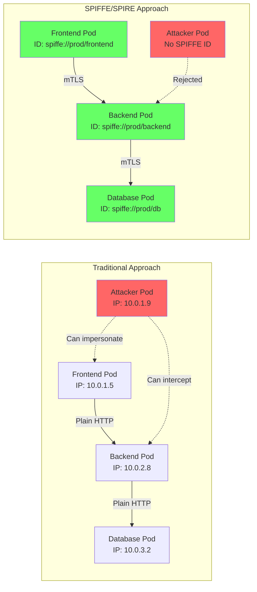
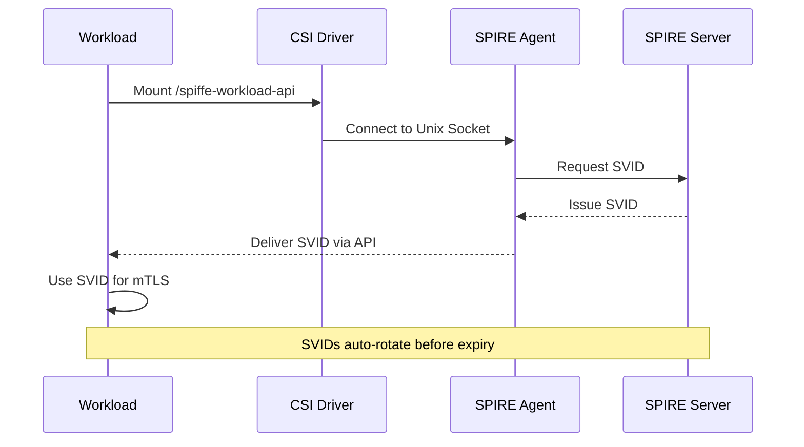

## Introduction: Beyond Network Policies to Cryptographic Identity

Traditional Kubernetes security relies on network policies and service accounts, but these approaches fall short in truly zero-trust environments. Network policies depend on IP addresses that change dynamically, while service accounts were designed for cloud provider authentication, not workload-to-workload communication.

Enter SPIFFE (Secure Production Identity Framework For Everyone) and its implementation SPIRE, which provide cryptographic identities to every workload. In this comprehensive guide, we'll implement pod-to-pod mutual TLS (mTLS) using SPIFFE identities, moving from theory to production-ready code.

## The Problem with Traditional Pod Communication

Let's visualize the security challenges in Kubernetes:



## Prerequisites and Setup

Before implementing mTLS, ensure you have SPIFFE/SPIRE installed (covered in my [previous post](/security/spiffe-spire-kubernetes-complete-guide)). Additionally, we'll need:

```bash
# Verify SPIRE is running
kubectl get pods -n spire-system

# Check SPIFFE CSI Driver
kubectl get csidriver csi.spiffe.io

# Create a demo namespace
kubectl create namespace spiffe-demo
kubectl label namespace spiffe-demo pod-security.kubernetes.io/enforce=restricted
```

## Understanding the SPIFFE Workload API

The Workload API is the interface between workloads and SPIRE:



## Step 1: Deploy Workloads with SPIFFE CSI Driver

Let's create two services that will communicate via mTLS:

### Frontend Service

```yaml
# frontend-deployment.yaml
apiVersion: v1
kind: ServiceAccount
metadata:
  name: frontend
  namespace: spiffe-demo
---
apiVersion: v1
kind: ConfigMap
metadata:
  name: frontend-config
  namespace: spiffe-demo
data:
  main.go: |
    package main

    import (
        "context"
        "crypto/tls"
        "encoding/json"
        "fmt"
        "io"
        "log"
        "net/http"
        "os"
        "time"
        
        "github.com/spiffe/go-spiffe/v2/spiffeid"
        "github.com/spiffe/go-spiffe/v2/spiffetls/tlsconfig"
        "github.com/spiffe/go-spiffe/v2/workloadapi"
    )

    type Response struct {
        Message    string    `json:"message"`
        ClientID   string    `json:"client_id"`
        ServerID   string    `json:"server_id"`
        Timestamp  time.Time `json:"timestamp"`
    }

    func main() {
        ctx := context.Background()
        
        // Create Workload API client using SPIFFE CSI Driver socket
        socketPath := "unix:///spiffe-workload-api/spire-agent.sock"
        client, err := workloadapi.New(ctx, workloadapi.WithAddr(socketPath))
        if err != nil {
            log.Fatalf("Unable to create workload API client: %v", err)
        }
        defer client.Close()
        
        // Get our own SPIFFE ID
        x509Context, err := client.FetchX509Context(ctx)
        if err != nil {
            log.Fatalf("Failed to fetch X509 context: %v", err)
        }
        
        myID := x509Context.DefaultSVID().ID.String()
        log.Printf("Frontend service started with SPIFFE ID: %s", myID)
        
        // Create HTTP client with mTLS
        backendID := spiffeid.RequireFromString("spiffe://prod.example.com/ns/spiffe-demo/sa/backend")
        tlsConfig := tlsconfig.MTLSClientConfig(client, client, tlsconfig.AuthorizeID(backendID))
        
        httpClient := &http.Client{
            Transport: &http.Transport{
                TLSClientConfig: tlsConfig,
            },
        }
        
        // Serve frontend API
        mux := http.NewServeMux()
        mux.HandleFunc("/", func(w http.ResponseWriter, r *http.Request) {
            // Call backend service
            backendURL := os.Getenv("BACKEND_URL")
            if backendURL == "" {
                backendURL = "https://backend.spiffe-demo.svc.cluster.local:8443/data"
            }
            
            resp, err := httpClient.Get(backendURL)
            if err != nil {
                http.Error(w, fmt.Sprintf("Backend call failed: %v", err), http.StatusInternalServerError)
                return
            }
            defer resp.Body.Close()
            
            body, _ := io.ReadAll(resp.Body)
            
            response := map[string]interface{}{
                "frontend_id": myID,
                "backend_response": json.RawMessage(body),
                "timestamp": time.Now(),
            }
            
            w.Header().Set("Content-Type", "application/json")
            json.NewEncoder(w).Encode(response)
        })
        
        mux.HandleFunc("/health", func(w http.ResponseWriter, r *http.Request) {
            w.WriteHeader(http.StatusOK)
            w.Write([]byte("healthy"))
        })
        
        log.Println("Frontend listening on :8080")
        if err := http.ListenAndServe(":8080", mux); err != nil {
            log.Fatalf("Failed to start server: %v", err)
        }
    }
---
apiVersion: apps/v1
kind: Deployment
metadata:
  name: frontend
  namespace: spiffe-demo
spec:
  replicas: 2
  selector:
    matchLabels:
      app: frontend
  template:
    metadata:
      labels:
        app: frontend
        spiffe: enabled
    spec:
      serviceAccountName: frontend
      containers:
        - name: frontend
          image: golang:1.21-alpine
          command: ["sh", "-c"]
          args:
            - |
              apk add --no-cache git
              go mod init frontend
              go get github.com/spiffe/go-spiffe/v2
              go run /app/main.go
          env:
            - name: BACKEND_URL
              value: "https://backend.spiffe-demo.svc.cluster.local:8443/data"
          ports:
            - containerPort: 8080
              name: http
          volumeMounts:
            - name: app-code
              mountPath: /app
            - name: spiffe-workload-api
              mountPath: /spiffe-workload-api
              readOnly: true
          resources:
            requests:
              memory: "128Mi"
              cpu: "100m"
            limits:
              memory: "256Mi"
              cpu: "200m"
          livenessProbe:
            httpGet:
              path: /health
              port: 8080
            initialDelaySeconds: 30
            periodSeconds: 10
          readinessProbe:
            httpGet:
              path: /health
              port: 8080
            initialDelaySeconds: 20
            periodSeconds: 5
      volumes:
        - name: app-code
          configMap:
            name: frontend-config
        - name: spiffe-workload-api
          csi:
            driver: "csi.spiffe.io"
            readOnly: true
---
apiVersion: v1
kind: Service
metadata:
  name: frontend
  namespace: spiffe-demo
spec:
  selector:
    app: frontend
  ports:
    - port: 80
      targetPort: 8080
      name: http
```

### Backend Service

```yaml
# backend-deployment.yaml
apiVersion: v1
kind: ServiceAccount
metadata:
  name: backend
  namespace: spiffe-demo
---
apiVersion: v1
kind: ConfigMap
metadata:
  name: backend-config
  namespace: spiffe-demo
data:
  main.go: |
    package main

    import (
        "context"
        "encoding/json"
        "fmt"
        "log"
        "net/http"
        "time"
        
        "github.com/spiffe/go-spiffe/v2/spiffeid"
        "github.com/spiffe/go-spiffe/v2/spiffetls/tlsconfig"
        "github.com/spiffe/go-spiffe/v2/workloadapi"
    )

    type DataResponse struct {
        Data      string    `json:"data"`
        ServerID  string    `json:"server_id"`
        ClientID  string    `json:"client_id"`
        Timestamp time.Time `json:"timestamp"`
        Metadata  map[string]string `json:"metadata"`
    }

    func main() {
        ctx := context.Background()
        
        // Create Workload API client
        socketPath := "unix:///spiffe-workload-api/spire-agent.sock"
        client, err := workloadapi.New(ctx, workloadapi.WithAddr(socketPath))
        if err != nil {
            log.Fatalf("Unable to create workload API client: %v", err)
        }
        defer client.Close()
        
        // Get our SPIFFE ID
        x509Context, err := client.FetchX509Context(ctx)
        if err != nil {
            log.Fatalf("Failed to fetch X509 context: %v", err)
        }
        
        myID := x509Context.DefaultSVID().ID.String()
        log.Printf("Backend service started with SPIFFE ID: %s", myID)
        
        // Create mTLS server config - only accept frontend service
        frontendID := spiffeid.RequireFromString("spiffe://prod.example.com/ns/spiffe-demo/sa/frontend")
        tlsConfig := tlsconfig.MTLSServerConfig(client, client, tlsconfig.AuthorizeID(frontendID))
        
        // Create HTTPS server
        mux := http.NewServeMux()
        
        mux.HandleFunc("/data", func(w http.ResponseWriter, r *http.Request) {
            // Extract client identity from TLS connection
            var clientID string
            if r.TLS != nil && len(r.TLS.PeerCertificates) > 0 {
                cert := r.TLS.PeerCertificates[0]
                if len(cert.URIs) > 0 {
                    id, err := spiffeid.FromURI(cert.URIs[0])
                    if err == nil {
                        clientID = id.String()
                    }
                }
            }
            
            log.Printf("Request from client: %s", clientID)
            
            response := DataResponse{
                Data:      "Secure data from backend service",
                ServerID:  myID,
                ClientID:  clientID,
                Timestamp: time.Now(),
                Metadata: map[string]string{
                    "version": "1.0",
                    "environment": "production",
                    "tls_version": r.TLS.Version,
                    "cipher_suite": tls.CipherSuiteName(r.TLS.CipherSuite),
                },
            }
            
            w.Header().Set("Content-Type", "application/json")
            json.NewEncoder(w).Encode(response)
        })
        
        mux.HandleFunc("/health", func(w http.ResponseWriter, r *http.Request) {
            w.WriteHeader(http.StatusOK)
            json.NewEncoder(w).Encode(map[string]string{"status": "healthy"})
        })
        
        server := &http.Server{
            Addr:      ":8443",
            Handler:   mux,
            TLSConfig: tlsConfig,
        }
        
        log.Println("Backend listening on :8443 with mTLS")
        // ListenAndServeTLS with empty cert/key paths because TLS config provides them
        if err := server.ListenAndServeTLS("", ""); err != nil {
            log.Fatalf("Failed to start server: %v", err)
        }
    }
---
apiVersion: apps/v1
kind: Deployment
metadata:
  name: backend
  namespace: spiffe-demo
spec:
  replicas: 3
  selector:
    matchLabels:
      app: backend
  template:
    metadata:
      labels:
        app: backend
        spiffe: enabled
    spec:
      serviceAccountName: backend
      containers:
        - name: backend
          image: golang:1.21-alpine
          command: ["sh", "-c"]
          args:
            - |
              apk add --no-cache git
              go mod init backend
              go get github.com/spiffe/go-spiffe/v2
              go run /app/main.go
          ports:
            - containerPort: 8443
              name: https
          volumeMounts:
            - name: app-code
              mountPath: /app
            - name: spiffe-workload-api
              mountPath: /spiffe-workload-api
              readOnly: true
          resources:
            requests:
              memory: "128Mi"
              cpu: "100m"
            limits:
              memory: "256Mi"
              cpu: "200m"
          livenessProbe:
            httpGet:
              path: /health
              port: 8443
              scheme: HTTPS
            initialDelaySeconds: 30
            periodSeconds: 10
          readinessProbe:
            httpGet:
              path: /health
              port: 8443
              scheme: HTTPS
            initialDelaySeconds: 20
            periodSeconds: 5
      volumes:
        - name: app-code
          configMap:
            name: backend-config
        - name: spiffe-workload-api
          csi:
            driver: "csi.spiffe.io"
            readOnly: true
---
apiVersion: v1
kind: Service
metadata:
  name: backend
  namespace: spiffe-demo
spec:
  selector:
    app: backend
  ports:
    - port: 8443
      targetPort: 8443
      name: https
```

## Step 2: Register Workloads with SPIRE

Create ClusterSPIFFEID resources for automatic registration:

```yaml
# workload-registration.yaml
apiVersion: spire.spiffe.io/v1alpha1
kind: ClusterSPIFFEID
metadata:
  name: frontend-workload
spec:
  spiffeIDTemplate: "spiffe://{{ .TrustDomain }}/ns/{{ .PodMeta.Namespace }}/sa/{{ .PodSpec.ServiceAccountName }}"
  podSelector:
    matchLabels:
      app: frontend
  namespaceSelector:
    matchNames:
      - spiffe-demo
  workloadSelectorTemplates:
    - "k8s:ns:{{ .PodMeta.Namespace }}"
    - "k8s:sa:{{ .PodSpec.ServiceAccountName }}"
    - "k8s:pod-label:app:frontend"
  dnsNameTemplates:
    - "{{ .PodMeta.Name }}.{{ .PodMeta.Namespace }}.svc.cluster.local"
    - "frontend.{{ .PodMeta.Namespace }}.svc.cluster.local"
  ttl: 3600
---
apiVersion: spire.spiffe.io/v1alpha1
kind: ClusterSPIFFEID
metadata:
  name: backend-workload
spec:
  spiffeIDTemplate: "spiffe://{{ .TrustDomain }}/ns/{{ .PodMeta.Namespace }}/sa/{{ .PodSpec.ServiceAccountName }}"
  podSelector:
    matchLabels:
      app: backend
  namespaceSelector:
    matchNames:
      - spiffe-demo
  workloadSelectorTemplates:
    - "k8s:ns:{{ .PodMeta.Namespace }}"
    - "k8s:sa:{{ .PodSpec.ServiceAccountName }}"
    - "k8s:pod-label:app:backend"
  dnsNameTemplates:
    - "{{ .PodMeta.Name }}.{{ .PodMeta.Namespace }}.svc.cluster.local"
    - "backend.{{ .PodMeta.Namespace }}.svc.cluster.local"
  ttl: 3600
```

Deploy everything:

```bash
# Apply workload registrations
kubectl apply -f workload-registration.yaml

# Deploy services
kubectl apply -f frontend-deployment.yaml
kubectl apply -f backend-deployment.yaml

# Wait for pods to be ready
kubectl wait --for=condition=ready pod -l app=frontend -n spiffe-demo --timeout=300s
kubectl wait --for=condition=ready pod -l app=backend -n spiffe-demo --timeout=300s
```

## Step 3: Verify mTLS Communication

Test the secure communication:

```bash
# Port-forward to frontend
kubectl port-forward -n spiffe-demo svc/frontend 8080:80 &

# Test the frontend endpoint
curl http://localhost:8080 | jq .

# Expected output:
{
  "frontend_id": "spiffe://prod.example.com/ns/spiffe-demo/sa/frontend",
  "backend_response": {
    "data": "Secure data from backend service",
    "server_id": "spiffe://prod.example.com/ns/spiffe-demo/sa/backend",
    "client_id": "spiffe://prod.example.com/ns/spiffe-demo/sa/frontend",
    "timestamp": "2025-01-29T10:30:45Z",
    "metadata": {
      "version": "1.0",
      "environment": "production",
      "tls_version": "771",
      "cipher_suite": "TLS_AES_128_GCM_SHA256"
    }
  },
  "timestamp": "2025-01-29T10:30:45Z"
}
```

## Step 4: Advanced mTLS Patterns

### Pattern 1: Service-to-Service with Multiple Backends

```go
// advanced-client.go - Load balancing across multiple backends
package main

import (
    "context"
    "crypto/tls"
    "net/http"
    "sync"
    "time"

    "github.com/spiffe/go-spiffe/v2/spiffeid"
    "github.com/spiffe/go-spiffe/v2/spiffetls/tlsconfig"
    "github.com/spiffe/go-spiffe/v2/workloadapi"
)

type SPIFFEClient struct {
    client      *workloadapi.Client
    httpClients map[string]*http.Client
    mu          sync.RWMutex
}

func NewSPIFFEClient(ctx context.Context) (*SPIFFEClient, error) {
    client, err := workloadapi.New(ctx, workloadapi.WithAddr("unix:///spiffe-workload-api/spire-agent.sock"))
    if err != nil {
        return nil, err
    }

    return &SPIFFEClient{
        client:      client,
        httpClients: make(map[string]*http.Client),
    }, nil
}

func (s *SPIFFEClient) GetHTTPClient(targetID string) (*http.Client, error) {
    s.mu.RLock()
    if client, ok := s.httpClients[targetID]; ok {
        s.mu.RUnlock()
        return client, nil
    }
    s.mu.RUnlock()

    s.mu.Lock()
    defer s.mu.Unlock()

    // Double-check after acquiring write lock
    if client, ok := s.httpClients[targetID]; ok {
        return client, nil
    }

    // Create new client
    id := spiffeid.RequireFromString(targetID)
    tlsConfig := tlsconfig.MTLSClientConfig(s.client, s.client, tlsconfig.AuthorizeID(id))

    client := &http.Client{
        Transport: &http.Transport{
            TLSClientConfig: tlsConfig,
            MaxIdleConns:    10,
            IdleConnTimeout: 30 * time.Second,
        },
        Timeout: 10 * time.Second,
    }

    s.httpClients[targetID] = client
    return client, nil
}

// Load balancer implementation
type LoadBalancer struct {
    spiffeClient *SPIFFEClient
    backends     []string
    current      int
    mu           sync.Mutex
}

func (lb *LoadBalancer) RoundRobinRequest(path string) (*http.Response, error) {
    lb.mu.Lock()
    backend := lb.backends[lb.current]
    lb.current = (lb.current + 1) % len(lb.backends)
    lb.mu.Unlock()

    client, err := lb.spiffeClient.GetHTTPClient("spiffe://prod.example.com/ns/spiffe-demo/sa/backend")
    if err != nil {
        return nil, err
    }

    return client.Get(backend + path)
}
```

### Pattern 2: JWT SVIDs for External Services

```go
// jwt-svid-client.go - Using JWT SVIDs for external APIs
package main

import (
    "context"
    "encoding/json"
    "fmt"
    "net/http"

    "github.com/spiffe/go-spiffe/v2/spiffeid"
    "github.com/spiffe/go-spiffe/v2/svid/jwtsvid"
    "github.com/spiffe/go-spiffe/v2/workloadapi"
)

func callExternalAPI(ctx context.Context) error {
    client, err := workloadapi.New(ctx, workloadapi.WithAddr("unix:///spiffe-workload-api/spire-agent.sock"))
    if err != nil {
        return err
    }
    defer client.Close()

    // Fetch JWT SVID for external service
    audience := []string{"https://api.external.com"}
    jwtSVID, err := client.FetchJWTSVID(ctx, jwtsvid.Params{
        Audience: audience[0],
    })
    if err != nil {
        return err
    }

    // Use JWT in Authorization header
    req, _ := http.NewRequest("GET", "https://api.external.com/data", nil)
    req.Header.Set("Authorization", fmt.Sprintf("Bearer %s", jwtSVID.Marshal()))

    resp, err := http.DefaultClient.Do(req)
    if err != nil {
        return err
    }
    defer resp.Body.Close()

    return nil
}
```

### Pattern 3: SPIFFE Helper for Legacy Applications

For applications that can't be modified to use the Workload API directly:

```yaml
# spiffe-helper-deployment.yaml
apiVersion: v1
kind: ConfigMap
metadata:
  name: spiffe-helper-config
  namespace: spiffe-demo
data:
  helper.conf: |
    agent_address = "/spiffe-workload-api/spire-agent.sock"
    cmd = "/app/legacy-app"
    cmd_args = ""
    cert_dir = "/certs"
    add_intermediates = true
    renew_signal = "SIGHUP"
    svid_file_name = "cert.pem"
    svid_key_file_name = "key.pem"
    svid_bundle_file_name = "ca.pem"
---
apiVersion: apps/v1
kind: Deployment
metadata:
  name: legacy-app
  namespace: spiffe-demo
spec:
  replicas: 1
  selector:
    matchLabels:
      app: legacy-app
  template:
    metadata:
      labels:
        app: legacy-app
        spiffe: enabled
    spec:
      serviceAccountName: legacy-app
      initContainers:
        - name: spiffe-helper
          image: ghcr.io/spiffe/spiffe-helper:latest
          command: ["/opt/spiffe-helper"]
          args: ["-config", "/config/helper.conf"]
          volumeMounts:
            - name: spiffe-workload-api
              mountPath: /spiffe-workload-api
              readOnly: true
            - name: helper-config
              mountPath: /config
            - name: certs
              mountPath: /certs
      containers:
        - name: legacy-app
          image: nginx:alpine
          volumeMounts:
            - name: certs
              mountPath: /etc/nginx/certs
              readOnly: true
          # Configure nginx to use certificates from /etc/nginx/certs/
      volumes:
        - name: spiffe-workload-api
          csi:
            driver: "csi.spiffe.io"
            readOnly: true
        - name: helper-config
          configMap:
            name: spiffe-helper-config
        - name: certs
          emptyDir: {}
```

## Step 5: Production Considerations

### Health Checks and Monitoring

```go
// health-check.go - SVID health monitoring
package main

import (
    "context"
    "encoding/json"
    "net/http"
    "time"

    "github.com/spiffe/go-spiffe/v2/workloadapi"
)

type HealthStatus struct {
    Status          string    `json:"status"`
    SPIFFEID        string    `json:"spiffe_id"`
    CertificateExpiry time.Time `json:"certificate_expiry"`
    TimeToRenewal   string    `json:"time_to_renewal"`
}

func healthCheckHandler(client *workloadapi.Client) http.HandlerFunc {
    return func(w http.ResponseWriter, r *http.Request) {
        ctx := context.Background()

        x509Context, err := client.FetchX509Context(ctx)
        if err != nil {
            w.WriteHeader(http.StatusServiceUnavailable)
            json.NewEncoder(w).Encode(map[string]string{
                "status": "unhealthy",
                "error":  err.Error(),
            })
            return
        }

        svid := x509Context.DefaultSVID()
        cert, _ := svid.Certificates[0], svid.PrivateKey

        status := HealthStatus{
            Status:          "healthy",
            SPIFFEID:        svid.ID.String(),
            CertificateExpiry: cert.NotAfter,
            TimeToRenewal:   time.Until(cert.NotAfter).String(),
        }

        // Warn if certificate expires soon
        if time.Until(cert.NotAfter) < 30*time.Minute {
            status.Status = "warning"
        }

        w.Header().Set("Content-Type", "application/json")
        json.NewEncoder(w).Encode(status)
    }
}
```

### Graceful SVID Rotation

```go
// svid-rotation.go - Handle SVID rotation gracefully
package main

import (
    "context"
    "crypto/tls"
    "log"
    "net/http"
    "sync"
    "time"

    "github.com/spiffe/go-spiffe/v2/workloadapi"
)

type RotatingTLSConfig struct {
    client    *workloadapi.Client
    tlsConfig *tls.Config
    mu        sync.RWMutex
    ctx       context.Context
    cancel    context.CancelFunc
}

func NewRotatingTLSConfig(ctx context.Context, client *workloadapi.Client) (*RotatingTLSConfig, error) {
    ctx, cancel := context.WithCancel(ctx)

    rtc := &RotatingTLSConfig{
        client: client,
        ctx:    ctx,
        cancel: cancel,
    }

    // Initial TLS config
    if err := rtc.updateTLSConfig(); err != nil {
        cancel()
        return nil, err
    }

    // Watch for SVID updates
    go rtc.watchSVIDRotation()

    return rtc, nil
}

func (rtc *RotatingTLSConfig) updateTLSConfig() error {
    x509Context, err := rtc.client.FetchX509Context(rtc.ctx)
    if err != nil {
        return err
    }

    tlsConfig := &tls.Config{
        GetCertificate: func(*tls.ClientHelloInfo) (*tls.Certificate, error) {
            svid := x509Context.DefaultSVID()
            cert := &tls.Certificate{
                Certificate: [][]byte{},
                PrivateKey:  svid.PrivateKey,
            }
            for _, c := range svid.Certificates {
                cert.Certificate = append(cert.Certificate, c.Raw)
            }
            return cert, nil
        },
        ClientAuth: tls.RequireAndVerifyClientCert,
        GetClientCertificate: func(*tls.CertificateRequestInfo) (*tls.Certificate, error) {
            svid := x509Context.DefaultSVID()
            cert := &tls.Certificate{
                Certificate: [][]byte{},
                PrivateKey:  svid.PrivateKey,
            }
            for _, c := range svid.Certificates {
                cert.Certificate = append(cert.Certificate, c.Raw)
            }
            return cert, nil
        },
    }

    rtc.mu.Lock()
    rtc.tlsConfig = tlsConfig
    rtc.mu.Unlock()

    log.Println("TLS configuration updated with new SVID")
    return nil
}

func (rtc *RotatingTLSConfig) watchSVIDRotation() {
    ticker := time.NewTicker(30 * time.Second)
    defer ticker.Stop()

    for {
        select {
        case <-rtc.ctx.Done():
            return
        case <-ticker.C:
            if err := rtc.updateTLSConfig(); err != nil {
                log.Printf("Failed to update TLS config: %v", err)
            }
        }
    }
}

func (rtc *RotatingTLSConfig) GetTLSConfig() *tls.Config {
    rtc.mu.RLock()
    defer rtc.mu.RUnlock()
    return rtc.tlsConfig
}
```

### Error Handling and Retries

```go
// resilient-client.go - Production-grade error handling
package main

import (
    "context"
    "fmt"
    "net/http"
    "time"

    "github.com/cenkalti/backoff/v4"
    "github.com/spiffe/go-spiffe/v2/spiffetls/tlsconfig"
    "github.com/spiffe/go-spiffe/v2/workloadapi"
)

type ResilientSPIFFEClient struct {
    workloadClient *workloadapi.Client
    httpClient     *http.Client
}

func (r *ResilientSPIFFEClient) CallWithRetry(ctx context.Context, url string) (*http.Response, error) {
    operation := func() (*http.Response, error) {
        req, err := http.NewRequestWithContext(ctx, "GET", url, nil)
        if err != nil {
            return nil, backoff.Permanent(err)
        }

        resp, err := r.httpClient.Do(req)
        if err != nil {
            return nil, err // Temporary error, will retry
        }

        // Don't retry client errors
        if resp.StatusCode >= 400 && resp.StatusCode < 500 {
            return resp, backoff.Permanent(fmt.Errorf("client error: %d", resp.StatusCode))
        }

        // Retry server errors
        if resp.StatusCode >= 500 {
            resp.Body.Close()
            return nil, fmt.Errorf("server error: %d", resp.StatusCode)
        }

        return resp, nil
    }

    // Configure exponential backoff
    b := backoff.NewExponentialBackOff()
    b.MaxElapsedTime = 30 * time.Second

    return backoff.RetryWithData(operation, b)
}
```

## Step 6: Observability and Debugging

### mTLS Metrics with Prometheus

```go
// metrics.go - Prometheus metrics for mTLS
package main

import (
    "github.com/prometheus/client_golang/prometheus"
    "github.com/prometheus/client_golang/prometheus/promauto"
)

var (
    mtlsConnectionsTotal = promauto.NewCounterVec(
        prometheus.CounterOpts{
            Name: "spiffe_mtls_connections_total",
            Help: "Total number of mTLS connections established",
        },
        []string{"source_id", "target_id", "status"},
    )

    svidRotationTotal = promauto.NewCounter(
        prometheus.CounterOpts{
            Name: "spiffe_svid_rotation_total",
            Help: "Total number of SVID rotations",
        },
    )

    svidExpirySeconds = promauto.NewGauge(
        prometheus.GaugeOpts{
            Name: "spiffe_svid_expiry_seconds",
            Help: "Time until SVID expiry in seconds",
        },
    )
)
```

### Debugging mTLS Issues

```bash
# Check if workloads have SVIDs
kubectl exec -n spiffe-demo deployment/frontend -- \
  ls -la /spiffe-workload-api/

# View SPIRE agent logs
kubectl logs -n spire-system -l app=spire-agent --tail=100

# Check registration entries
kubectl exec -n spire-system spire-server-0 -c spire-server -- \
  /opt/spire/bin/spire-server entry list -selector k8s:ns:spiffe-demo

# Test Workload API connectivity
kubectl exec -n spiffe-demo deployment/frontend -- \
  nc -zv /spiffe-workload-api/spire-agent.sock

# Capture TLS handshake details
kubectl exec -n spiffe-demo deployment/frontend -- \
  openssl s_client -connect backend:8443 -showcerts
```

## Common Issues and Solutions

### Issue 1: "Unable to create workload API client"

**Symptoms:**

```
Unable to create workload API client: workloadapi: unable to dial agent: dial unix /spiffe-workload-api/spire-agent.sock: connect: no such file or directory
```

**Solution:**

```yaml
# Ensure CSI driver volume is mounted correctly
volumes:
  - name: spiffe-workload-api
    csi:
      driver: "csi.spiffe.io"
      readOnly: true
      # Optional: specify node publish secret
      # nodePublishSecretRef:
      #   name: spiffe-csi-driver-node-publish-secret
```

### Issue 2: "x509: certificate signed by unknown authority"

**Symptoms:**

```
x509: certificate signed by unknown authority
```

**Solution:**

```go
// Ensure you're using SPIFFE trust bundle, not system roots
tlsConfig := tlsconfig.MTLSClientConfig(
    source,  // X.509 source (workload API client)
    source,  // Bundle source (same client)
    tlsconfig.AuthorizeID(serverID),
)
```

### Issue 3: SVID Not Issued

**Symptoms:**
Pods running but no SVID received

**Solution:**

```bash
# Check pod labels match ClusterSPIFFEID selector
kubectl get pod -n spiffe-demo -l app=frontend --show-labels

# Verify ClusterSPIFFEID is created
kubectl get clusterspiffeid

# Check SPIRE server for registration entries
kubectl exec -n spire-system spire-server-0 -c spire-server -- \
  /opt/spire/bin/spire-server entry list
```

## Performance Optimization

### Connection Pooling

```go
// connection-pool.go - Reuse mTLS connections
transport := &http.Transport{
    TLSClientConfig:     tlsConfig,
    MaxIdleConns:        100,
    MaxIdleConnsPerHost: 10,
    IdleConnTimeout:     90 * time.Second,
    TLSHandshakeTimeout: 10 * time.Second,
    ExpectContinueTimeout: 1 * time.Second,

    // HTTP/2 support
    ForceAttemptHTTP2: true,
}

client := &http.Client{
    Transport: transport,
    Timeout:   30 * time.Second,
}
```

### SVID Caching

```go
// svid-cache.go - Cache SVIDs to reduce Workload API calls
type SVIDCache struct {
    client     *workloadapi.Client
    x509Ctx    *workloadapi.X509Context
    jwtSVIDs   map[string]*jwtsvid.SVID
    mu         sync.RWMutex
    updateChan chan struct{}
}

func NewSVIDCache(ctx context.Context, client *workloadapi.Client) (*SVIDCache, error) {
    cache := &SVIDCache{
        client:     client,
        jwtSVIDs:   make(map[string]*jwtsvid.SVID),
        updateChan: make(chan struct{}, 1),
    }

    // Initial fetch
    if err := cache.update(ctx); err != nil {
        return nil, err
    }

    // Watch for updates
    go cache.watchUpdates(ctx)

    return cache, nil
}
```

## Integration with Service Meshes

### Using with Istio

```yaml
# istio-integration.yaml
apiVersion: v1
kind: ConfigMap
metadata:
  name: istio-spiffe
  namespace: istio-system
data:
  mesh: |
    defaultConfig:
      proxyStatsMatcher:
        inclusionRegexps:
        - ".*outlier_detection.*"
        - ".*osconfig.*"
        - ".*circuit_breakers.*"
      proxyMetadata:
        PILOT_ENABLE_WORKLOAD_ENTRY_AUTOREGISTRATION: true
        BOOTSTRAP_XDS_AGENT: true
    trustDomain: prod.example.com
    # Use SPIRE as CA
    caCertificates:
    - spiffe://prod.example.com/spire/ca
```

### Using with Linkerd

```yaml
# linkerd-spiffe-identity.yaml
apiVersion: linkerd.io/v1alpha1
kind: Policy
metadata:
  name: spiffe-identity
  namespace: spiffe-demo
spec:
  targetRef:
    kind: Service
    name: backend
  requiredAuthenticationRefs:
    - kind: MeshTLSAuthentication
      name: spiffe-mtls
---
apiVersion: linkerd.io/v1alpha1
kind: MeshTLSAuthentication
metadata:
  name: spiffe-mtls
  namespace: spiffe-demo
spec:
  identityRefs:
    - kind: ServiceAccount
      name: frontend
```

## Conclusion

Implementing pod-to-pod mTLS with SPIFFE/SPIRE transforms Kubernetes security from network-based trust to cryptographic identity-based trust. We've covered:

- ✅ CSI driver integration for seamless SVID delivery
- ✅ mTLS implementation patterns for different scenarios
- ✅ Production considerations including rotation and monitoring
- ✅ Debugging techniques and common issues
- ✅ Performance optimization strategies

The combination of SPIFFE's standardized identity format and SPIRE's robust implementation provides a production-ready foundation for zero-trust networking in Kubernetes.

In the next post, we'll explore high-availability SPIRE deployments, including multi-region federation and disaster recovery strategies.

## Additional Resources

- [SPIFFE Workload API Specification](https://github.com/spiffe/spiffe/blob/main/standards/SPIFFE_Workload_API.md)
- [go-spiffe Library Documentation](https://pkg.go.dev/github.com/spiffe/go-spiffe/v2)
- [SPIFFE Helper for Legacy Apps](https://github.com/spiffe/spiffe-helper)
- [CSI Driver Documentation](https://github.com/spiffe/spiffe-csi)

---

_Have questions about implementing mTLS in your environment? Join the discussion in the [SPIFFE Slack community](https://spiffe.slack.com) or reach out directly._
