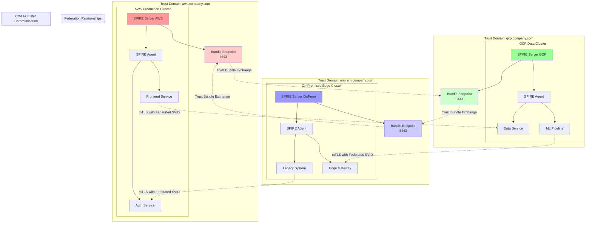

## Introduction: Beyond Single-Cluster Identity

In our [previous guides](/spiffe-spire-kubernetes-complete-guide), we've built robust SPIFFE/SPIRE deployments within single Kubernetes clusters. However, modern enterprises operate across multiple clusters, regions, and cloud providers. This creates the challenge of establishing trust relationships between workloads that span organizational boundaries while maintaining the cryptographic guarantees that make SPIFFE/SPIRE so powerful.

This comprehensive guide explores SPIFFE federation—the mechanism that enables secure, verifiable communication between workloads across different trust domains without compromising on zero-trust principles or requiring complex credential management.

## Understanding SPIFFE Federation Architecture

Let's visualize a multi-cluster federated SPIFFE deployment:



### Federation Benefits

1. **Cross-Cloud Zero Trust**: Workloads authenticate across cloud boundaries without VPNs or complex networking
2. **Cryptographic Trust**: Federation relationships are based on cryptographic verification, not network controls
3. **Scalable Identity**: Central identity management across distributed infrastructure
4. **Regulatory Compliance**: Meet data residency requirements while maintaining unified security
5. **Disaster Recovery**: Seamless failover between federated clusters

## Federation Concepts and Components

### Trust Domains

Each SPIRE deployment operates within a **trust domain** - a boundary within which SPIRE has authority to mint and validate identities:

```bash
# Trust domain examples
spiffe://aws.company.com          # AWS production environment
spiffe://gcp.company.com          # GCP data processing environment
spiffe://onprem.company.com       # On-premises legacy systems
spiffe://edge.company.com         # Edge computing nodes
spiffe://partner.example.com      # External partner systems
```

### Trust Bundles

A **trust bundle** contains the public keys (root CAs) that a trust domain uses to validate SVIDs. During federation, trust domains exchange their bundles to establish mutual trust.

### Bundle Endpoints

Each SPIRE Server exposes a **bundle endpoint** that allows other trust domains to retrieve its current trust bundle. This enables automatic trust bundle updates when certificates rotate.

## Setting Up Multi-Cluster Federation

### Step 1: Configure Trust Domain Infrastructure

Let's set up three clusters representing a typical enterprise scenario:

```yaml
# aws-cluster-config.yaml - AWS Production Cluster
apiVersion: v1
kind: ConfigMap
metadata:
  name: spire-server-aws-config
  namespace: spire-system
data:
  server.conf: |
    server {
      bind_address = "0.0.0.0"
      bind_port = "8081"
      socket_path = "/tmp/spire-server/private/api.sock"
      trust_domain = "aws.company.com"
      data_dir = "/run/spire/data"
      log_level = "INFO"
      
      # Federation configuration
      federation {
        # Bundle endpoint configuration
        bundle_endpoint {
          address = "0.0.0.0"
          port = 8443
          
          # ACL for bundle access
          acme {
            tos_accepted = true
            cache_dir = "/tmp/spire-server/private/acme"
            directory_url = "https://acme-v02.api.letsencrypt.org/directory"
          }
        }
        
        # Federated trust domains
        federates_with {
          "gcp.company.com" {
            bundle_endpoint_url = "https://spire-bundle.gcp.company.com:8443"
            bundle_endpoint_profile {
              endpoint_spiffe_id = "spiffe://gcp.company.com/spire/server"
              
              # Authentication method
              type = "https_spiffe"
              
              # Custom CA for verification (optional)
              # tls_ca_cert_path = "/etc/ssl/certs/gcp-ca.pem"
            }
          }
          
          "onprem.company.com" {
            bundle_endpoint_url = "https://spire-bundle.onprem.company.com:8443"
            bundle_endpoint_profile {
              type = "https_web"
              
              # Web PKI verification
              # tls_ca_cert_path = "/etc/ssl/certs/ca-certificates.crt"
            }
          }
          
          # Partner trust domain with restricted access
          "partner.example.com" {
            bundle_endpoint_url = "https://spire-bundle.partner.example.com:8443"
            bundle_endpoint_profile {
              type = "https_spiffe"
              endpoint_spiffe_id = "spiffe://partner.example.com/spire/server"
            }
            
            # Refresh interval for partner bundles
            refresh_hint = "3600s"
          }
        }
      }
      
      # CA configuration for federation
      ca_subject = {
        country = ["US"],
        organization = ["Company Corp"],
        organizational_unit = ["AWS Production"],
        common_name = "SPIRE Server CA - AWS",
      }
      
      # JWT issuer for cross-domain authentication
      jwt_issuer = "https://oidc.aws.company.com"
    }

    plugins {
      NodeAttestor "aws_iid" {
        plugin_data {
          access_key_id = "${AWS_ACCESS_KEY_ID}"
          secret_access_key = "${AWS_SECRET_ACCESS_KEY}"
          account_ids_for_verification = ["123456789012"]
          instance_tag_requirements = {
            "Environment" = ["production"]
            "TrustDomain" = ["aws.company.com"]
          }
        }
      }

      WorkloadAttestor "k8s" {
        plugin_data {
          skip_kubelet_verification = false
          kubelet_secure_port = 10250
        }
      }

      DataStore "sql" {
        plugin_data {
          database_type = "postgres"
          connection_string = "host=postgres-aws.data.svc.cluster.local dbname=spire user=spire sslmode=require"
        }
      }

      KeyManager "aws_kms" {
        plugin_data {
          key_id = "arn:aws:kms:us-east-1:123456789012:key/aws-spire-key"
          region = "us-east-1"
        }
      }

      UpstreamAuthority "aws_pca" {
        plugin_data {
          certificate_authority_arn = "arn:aws:acm-pca:us-east-1:123456789012:certificate-authority/aws-spire-ca"
          region = "us-east-1"
          validity_period_hours = 8760
        }
      }

      # Bundle endpoint notifier
      Notifier "k8sbundle" {
        plugin_data {
          webhook_label = "spiffe.io/webhook"
          config_map = "spire-bundle"
          config_map_key = "bundle.crt"
          namespace = "spire-system"
        }
      }
    }
---
# gcp-cluster-config.yaml - GCP Data Cluster
apiVersion: v1
kind: ConfigMap
metadata:
  name: spire-server-gcp-config
  namespace: spire-system
data:
  server.conf: |
    server {
      bind_address = "0.0.0.0"
      bind_port = "8081"
      socket_path = "/tmp/spire-server/private/api.sock"
      trust_domain = "gcp.company.com"
      data_dir = "/run/spire/data"
      log_level = "INFO"
      
      federation {
        bundle_endpoint {
          address = "0.0.0.0"
          port = 8443
          
          # GCP-specific TLS configuration
          tls {
            cert_chain_path = "/etc/ssl/spire/bundle-endpoint.crt"
            private_key_path = "/etc/ssl/spire/bundle-endpoint.key"
            ca_cert_path = "/etc/ssl/spire/ca.crt"
          }
        }
        
        federates_with {
          "aws.company.com" {
            bundle_endpoint_url = "https://spire-bundle.aws.company.com:8443"
            bundle_endpoint_profile {
              type = "https_spiffe"
              endpoint_spiffe_id = "spiffe://aws.company.com/spire/server"
            }
          }
          
          "onprem.company.com" {
            bundle_endpoint_url = "https://spire-bundle.onprem.company.com:8443"
            bundle_endpoint_profile {
              type = "https_web"
            }
          }
        }
      }
      
      ca_subject = {
        country = ["US"],
        organization = ["Company Corp"],
        organizational_unit = ["GCP Data Processing"],
        common_name = "SPIRE Server CA - GCP",
      }
      
      jwt_issuer = "https://oidc.gcp.company.com"
    }

    plugins {
      NodeAttestor "gcp_iit" {
        plugin_data {
          projectid_whitelist = ["company-gcp-data"]
          service_account_whitelist = [
            "spire-agent@company-gcp-data.iam.gserviceaccount.com"
          ]
          zone_whitelist = ["us-central1-a", "us-central1-b"]
        }
      }

      WorkloadAttestor "k8s" {
        plugin_data {
          skip_kubelet_verification = false
          kubelet_secure_port = 10250
        }
      }

      DataStore "sql" {
        plugin_data {
          database_type = "postgres"
          connection_string = "host=postgres-gcp.data.svc.cluster.local dbname=spire user=spire sslmode=require"
        }
      }

      KeyManager "gcp_kms" {
        plugin_data {
          key_name = "projects/company-gcp-data/locations/us-central1/keyRings/spire/cryptoKeys/spire-server"
        }
      }

      UpstreamAuthority "gcp_cas" {
        plugin_data {
          ca_name = "projects/company-gcp-data/locations/us-central1/certificateAuthorities/spire-ca"
          validity_period_hours = 8760
        }
      }
    }
---
# onprem-cluster-config.yaml - On-Premises Edge Cluster
apiVersion: v1
kind: ConfigMap
metadata:
  name: spire-server-onprem-config
  namespace: spire-system
data:
  server.conf: |
    server {
      bind_address = "0.0.0.0"
      bind_port = "8081"
      socket_path = "/tmp/spire-server/private/api.sock"
      trust_domain = "onprem.company.com"
      data_dir = "/run/spire/data"
      log_level = "INFO"
      
      federation {
        bundle_endpoint {
          address = "0.0.0.0"
          port = 8443
          
          # On-premises certificate management
          tls {
            cert_chain_path = "/etc/ssl/spire/server.crt"
            private_key_path = "/etc/ssl/spire/server.key"
            ca_cert_path = "/etc/ssl/spire/ca.crt"
          }
          
          # Access control for on-premises
          acl {
            authorized_keys = [
              "/etc/ssl/spire/federation-client.pub"
            ]
          }
        }
        
        federates_with {
          "aws.company.com" {
            bundle_endpoint_url = "https://spire-bundle.aws.company.com:8443"
            bundle_endpoint_profile {
              type = "https_spiffe"
              endpoint_spiffe_id = "spiffe://aws.company.com/spire/server"
            }
          }
          
          "gcp.company.com" {
            bundle_endpoint_url = "https://spire-bundle.gcp.company.com:8443"
            bundle_endpoint_profile {
              type = "https_spiffe"
              endpoint_spiffe_id = "spiffe://gcp.company.com/spire/server"
            }
          }
        }
      }
      
      ca_subject = {
        country = ["US"],
        organization = ["Company Corp"],
        organizational_unit = ["On-Premises Operations"],
        common_name = "SPIRE Server CA - OnPrem",
      }
      
      jwt_issuer = "https://oidc.onprem.company.com"
    }

    plugins {
      NodeAttestor "join_token" {
        plugin_data = {}
      }

      WorkloadAttestor "k8s" {
        plugin_data {
          skip_kubelet_verification = false
          kubelet_secure_port = 10250
        }
      }

      WorkloadAttestor "unix" {
        plugin_data {
          discover_workload_path = true
        }
      }

      DataStore "sql" {
        plugin_data {
          database_type = "postgres"
          connection_string = "host=postgres-onprem.data.svc.cluster.local dbname=spire user=spire sslmode=require"
        }
      }

      KeyManager "disk" {
        plugin_data {
          keys_path = "/run/spire/data/keys.json"
        }
      }

      UpstreamAuthority "disk" {
        plugin_data {
          cert_file_path = "/run/spire/ca/ca.crt"
          key_file_path = "/run/spire/ca/ca.key"
        }
      }
    }
```

### Step 2: Configure Workload Registration for Federation

Create ClusterSPIFFEID resources that enable cross-cluster communication:

```yaml
# federated-workload-registration.yaml
# AWS Frontend Service - can communicate with GCP data services
apiVersion: spire.spiffe.io/v1alpha1
kind: ClusterSPIFFEID
metadata:
  name: aws-frontend-service
  namespace: spire-system
spec:
  spiffeIDTemplate: "spiffe://aws.company.com/ns/{{ .PodMeta.Namespace }}/service/{{ .PodMeta.Labels.service }}"

  podSelector:
    matchLabels:
      component: frontend

  namespaceSelector:
    matchNames:
      - "production"
      - "staging"

  workloadSelectorTemplates:
    - "k8s:ns:{{ .PodMeta.Namespace }}"
    - "k8s:sa:{{ .PodSpec.ServiceAccountName }}"
    - "k8s:service:{{ .PodMeta.Labels.service }}"

  # Enable federation with GCP and on-premises
  federatesWith:
    - "gcp.company.com"
    - "onprem.company.com"

  dnsNameTemplates:
    - "{{ .PodMeta.Labels.service }}.{{ .PodMeta.Namespace }}.svc.cluster.local"
    - "frontend.aws.company.com"

  ttl: 3600
---
# GCP Data Service - can receive requests from AWS and send to on-premises
apiVersion: spire.spiffe.io/v1alpha1
kind: ClusterSPIFFEID
metadata:
  name: gcp-data-service
  namespace: spire-system
spec:
  spiffeIDTemplate: "spiffe://gcp.company.com/ns/{{ .PodMeta.Namespace }}/service/{{ .PodMeta.Labels.service }}/version/{{ .PodMeta.Labels.version }}"

  podSelector:
    matchLabels:
      component: data-processing

  workloadSelectorTemplates:
    - "k8s:ns:{{ .PodMeta.Namespace }}"
    - "k8s:sa:{{ .PodSpec.ServiceAccountName }}"
    - "k8s:service:{{ .PodMeta.Labels.service }}"
    - "k8s:version:{{ .PodMeta.Labels.version }}"

  # Federation with AWS (to receive requests) and on-premises (to access legacy data)
  federatesWith:
    - "aws.company.com"
    - "onprem.company.com"

  dnsNameTemplates:
    - "{{ .PodMeta.Labels.service }}.{{ .PodMeta.Namespace }}.svc.cluster.local"
    - "data.gcp.company.com"

  ttl: 3600
---
# On-Premises Legacy System - bridge to cloud services
apiVersion: spire.spiffe.io/v1alpha1
kind: ClusterSPIFFEID
metadata:
  name: onprem-legacy-bridge
  namespace: spire-system
spec:
  spiffeIDTemplate: "spiffe://onprem.company.com/datacenter/{{ .PodMeta.Labels.datacenter }}/system/{{ .PodMeta.Labels.system }}"

  podSelector:
    matchLabels:
      component: legacy-bridge

  workloadSelectorTemplates:
    - "k8s:ns:{{ .PodMeta.Namespace }}"
    - "k8s:sa:{{ .PodSpec.ServiceAccountName }}"
    - "k8s:datacenter:{{ .PodMeta.Labels.datacenter }}"
    - "k8s:system:{{ .PodMeta.Labels.system }}"

  # Can communicate with cloud services
  federatesWith:
    - "aws.company.com"
    - "gcp.company.com"

  dnsNameTemplates:
    - "{{ .PodMeta.Labels.system }}.{{ .PodMeta.Namespace }}.svc.cluster.local"
    - "legacy.onprem.company.com"

  ttl: 7200 # Longer TTL for stable legacy systems
---
# Cross-domain API Gateway
apiVersion: spire.spiffe.io/v1alpha1
kind: ClusterSPIFFEID
metadata:
  name: cross-domain-gateway
  namespace: spire-system
spec:
  spiffeIDTemplate: "spiffe://{{ .TrustDomain }}/gateway/{{ .PodMeta.Labels.gateway-type }}/{{ .PodMeta.Labels.region }}"

  podSelector:
    matchLabels:
      component: api-gateway

  workloadSelectorTemplates:
    - "k8s:ns:{{ .PodMeta.Namespace }}"
    - "k8s:sa:{{ .PodSpec.ServiceAccountName }}"
    - "k8s:gateway-type:{{ .PodMeta.Labels.gateway-type }}"
    - "k8s:region:{{ .PodMeta.Labels.region }}"

  # Gateway can communicate across all domains
  federatesWith:
    - "aws.company.com"
    - "gcp.company.com"
    - "onprem.company.com"
    - "partner.example.com"

  dnsNameTemplates:
    - "api-gateway.{{ .PodMeta.Namespace }}.svc.cluster.local"
    - 'api.{{ .TrustDomain | replace "://" "." }}'

  ttl: 3600
```

### Step 3: Deploy Cross-Cluster Application Example

Let's deploy a distributed application that spans multiple clusters:

```yaml
# aws-frontend-deployment.yaml - Deployed in AWS cluster
apiVersion: v1
kind: Namespace
metadata:
  name: distributed-app
  labels:
    federation: enabled
---
apiVersion: v1
kind: ServiceAccount
metadata:
  name: frontend-service
  namespace: distributed-app
---
apiVersion: apps/v1
kind: Deployment
metadata:
  name: frontend
  namespace: distributed-app
spec:
  replicas: 3
  selector:
    matchLabels:
      app: frontend
      service: frontend
  template:
    metadata:
      labels:
        app: frontend
        service: frontend
        component: frontend
        version: v1
    spec:
      serviceAccountName: frontend-service
      containers:
        - name: frontend
          image: company/frontend:v1.2.3
          ports:
            - containerPort: 8080
          env:
            # SPIFFE configuration
            - name: SPIFFE_ENDPOINT_SOCKET
              value: "unix:///run/spire/sockets/agent.sock"
            - name: TRUST_DOMAIN
              value: "aws.company.com"
            # Service endpoints in other clusters
            - name: DATA_SERVICE_URL
              value: "https://data.gcp.company.com:8443"
            - name: LEGACY_SERVICE_URL
              value: "https://legacy.onprem.company.com:8443"
          volumeMounts:
            - name: spire-agent-socket
              mountPath: /run/spire/sockets
              readOnly: true
      volumes:
        - name: spire-agent-socket
          hostPath:
            path: /run/spire/sockets
            type: DirectoryOrCreate
---
apiVersion: v1
kind: Service
metadata:
  name: frontend
  namespace: distributed-app
spec:
  selector:
    app: frontend
  ports:
    - port: 8080
      targetPort: 8080
      name: http
  type: LoadBalancer
```

```yaml
# gcp-data-service-deployment.yaml - Deployed in GCP cluster
apiVersion: v1
kind: Namespace
metadata:
  name: distributed-app
  labels:
    federation: enabled
---
apiVersion: v1
kind: ServiceAccount
metadata:
  name: data-service
  namespace: distributed-app
---
apiVersion: apps/v1
kind: Deployment
metadata:
  name: data-service
  namespace: distributed-app
spec:
  replicas: 2
  selector:
    matchLabels:
      app: data-service
      service: data-processing
  template:
    metadata:
      labels:
        app: data-service
        service: data-processing
        component: data-processing
        version: v2
    spec:
      serviceAccountName: data-service
      containers:
        - name: data-service
          image: company/data-service:v2.1.0
          ports:
            - containerPort: 8443
          env:
            - name: SPIFFE_ENDPOINT_SOCKET
              value: "unix:///run/spire/sockets/agent.sock"
            - name: TRUST_DOMAIN
              value: "gcp.company.com"
            # Allowed client trust domains
            - name: ALLOWED_CLIENT_TRUST_DOMAINS
              value: "aws.company.com,onprem.company.com"
            # Legacy system endpoint
            - name: LEGACY_DB_URL
              value: "https://database.onprem.company.com:5432"
          volumeMounts:
            - name: spire-agent-socket
              mountPath: /run/spire/sockets
              readOnly: true
      volumes:
        - name: spire-agent-socket
          hostPath:
            path: /run/spire/sockets
            type: DirectoryOrCreate
---
apiVersion: v1
kind: Service
metadata:
  name: data-service
  namespace: distributed-app
spec:
  selector:
    app: data-service
  ports:
    - port: 8443
      targetPort: 8443
      name: https
```

```yaml
# onprem-legacy-bridge-deployment.yaml - Deployed in on-premises cluster
apiVersion: v1
kind: Namespace
metadata:
  name: distributed-app
  labels:
    federation: enabled
---
apiVersion: v1
kind: ServiceAccount
metadata:
  name: legacy-bridge
  namespace: distributed-app
---
apiVersion: apps/v1
kind: Deployment
metadata:
  name: legacy-bridge
  namespace: distributed-app
spec:
  replicas: 1
  selector:
    matchLabels:
      app: legacy-bridge
      system: mainframe-bridge
  template:
    metadata:
      labels:
        app: legacy-bridge
        system: mainframe-bridge
        component: legacy-bridge
        datacenter: primary
    spec:
      serviceAccountName: legacy-bridge
      containers:
        - name: legacy-bridge
          image: company/legacy-bridge:v1.0.5
          ports:
            - containerPort: 8443
            - containerPort: 5432 # Database proxy port
          env:
            - name: SPIFFE_ENDPOINT_SOCKET
              value: "unix:///run/spire/sockets/agent.sock"
            - name: TRUST_DOMAIN
              value: "onprem.company.com"
            # Cloud service endpoints that can access this bridge
            - name: ALLOWED_CLIENT_TRUST_DOMAINS
              value: "aws.company.com,gcp.company.com"
            # Legacy system configuration
            - name: MAINFRAME_HOST
              value: "mainframe.internal.company.com"
            - name: DATABASE_HOST
              value: "db-cluster.internal.company.com"
          volumeMounts:
            - name: spire-agent-socket
              mountPath: /run/spire/sockets
              readOnly: true
            # Mount legacy certificates for backward compatibility
            - name: legacy-certs
              mountPath: /etc/ssl/legacy
              readOnly: true
      volumes:
        - name: spire-agent-socket
          hostPath:
            path: /run/spire/sockets
            type: DirectoryOrCreate
        - name: legacy-certs
          secret:
            secretName: legacy-system-certs
---
apiVersion: v1
kind: Service
metadata:
  name: legacy-bridge
  namespace: distributed-app
spec:
  selector:
    app: legacy-bridge
  ports:
    - port: 8443
      targetPort: 8443
      name: https
    - port: 5432
      targetPort: 5432
      name: database
```

### Step 4: Implement Cross-Cluster mTLS Communication

Here's how applications use federated SPIFFE identities for cross-cluster communication:

```go
// frontend-service.go - AWS Frontend Service
package main

import (
    "context"
    "crypto/tls"
    "fmt"
    "io"
    "net/http"
    "time"

    "github.com/spiffe/go-spiffe/v2/spiffeid"
    "github.com/spiffe/go-spiffe/v2/spiffetls"
    "github.com/spiffe/go-spiffe/v2/spiffetls/tlsconfig"
    "github.com/spiffe/go-spiffe/v2/workloadapi"
)

func main() {
    ctx := context.Background()

    // Create Workload API client
    client, err := workloadapi.New(ctx, workloadapi.WithAddr("unix:///run/spire/sockets/agent.sock"))
    if err != nil {
        panic(fmt.Sprintf("Failed to create workload API client: %v", err))
    }
    defer client.Close()

    // Set up HTTP server for incoming requests
    go startHTTPServer(client)

    // Example: Call GCP data service
    callGCPDataService(client)

    // Example: Call on-premises legacy service
    callOnPremLegacyService(client)

    select {} // Keep running
}

func startHTTPServer(client *workloadapi.Client) {
    // Create TLS config that accepts requests from any federated trust domain
    tlsConfig := tlsconfig.MTLSServerConfig(client, client, tlsconfig.AuthorizeAny())

    server := &http.Server{
        Addr:      ":8080",
        TLSConfig: tlsConfig,
        Handler: http.HandlerFunc(func(w http.ResponseWriter, r *http.Request) {
            // Extract client identity from certificate
            if r.TLS != nil && len(r.TLS.PeerCertificates) > 0 {
                clientID, err := spiffeid.FromURI(r.TLS.PeerCertificates[0].URIs[0])
                if err == nil {
                    fmt.Printf("Request from: %s\n", clientID)

                    // Make decisions based on client trust domain
                    switch clientID.TrustDomain().String() {
                    case "gcp.company.com":
                        w.Header().Set("Content-Type", "application/json")
                        fmt.Fprintf(w, `{"message": "Hello from AWS frontend", "client": "%s"}`, clientID)
                    case "onprem.company.com":
                        w.Header().Set("Content-Type", "application/json")
                        fmt.Fprintf(w, `{"message": "Legacy system acknowledged", "client": "%s"}`, clientID)
                    default:
                        http.Error(w, "Unauthorized trust domain", http.StatusForbidden)
                    }
                    return
                }
            }
            http.Error(w, "No valid client certificate", http.StatusUnauthorized)
        }),
    }

    fmt.Println("Frontend server starting on :8080...")
    if err := server.ListenAndServeTLS("", ""); err != nil {
        panic(fmt.Sprintf("Server failed: %v", err))
    }
}

func callGCPDataService(client *workloadapi.Client) {
    // Create TLS config for calling GCP data service
    gcpDataID := spiffeid.Must("gcp.company.com", "ns", "distributed-app", "service", "data-processing")
    tlsConfig := tlsconfig.MTLSClientConfig(client, client, tlsconfig.AuthorizeID(gcpDataID))

    httpClient := &http.Client{
        Transport: &http.Transport{
            TLSClientConfig: tlsConfig,
        },
        Timeout: 30 * time.Second,
    }

    // Make authenticated request to GCP data service
    resp, err := httpClient.Get("https://data.gcp.company.com:8443/api/process-data")
    if err != nil {
        fmt.Printf("Failed to call GCP data service: %v\n", err)
        return
    }
    defer resp.Body.Close()

    body, _ := io.ReadAll(resp.Body)
    fmt.Printf("GCP Data Service Response: %s\n", body)
}

func callOnPremLegacyService(client *workloadapi.Client) {
    // Create TLS config for calling on-premises legacy bridge
    onPremID := spiffeid.Must("onprem.company.com", "datacenter", "primary", "system", "mainframe-bridge")
    tlsConfig := tlsconfig.MTLSClientConfig(client, client, tlsconfig.AuthorizeID(onPremID))

    httpClient := &http.Client{
        Transport: &http.Transport{
            TLSClientConfig: tlsConfig,
        },
        Timeout: 60 * time.Second, // Longer timeout for legacy systems
    }

    // Make authenticated request to on-premises legacy bridge
    resp, err := httpClient.Get("https://legacy.onprem.company.com:8443/api/legacy-data")
    if err != nil {
        fmt.Printf("Failed to call on-premises legacy service: %v\n", err)
        return
    }
    defer resp.Body.Close()

    body, _ := io.ReadAll(resp.Body)
    fmt.Printf("On-Premises Legacy Service Response: %s\n", body)
}
```

```go
// data-service.go - GCP Data Service
package main

import (
    "context"
    "database/sql"
    "encoding/json"
    "fmt"
    "net/http"
    "strings"
    "time"

    "github.com/spiffe/go-spiffe/v2/spiffeid"
    "github.com/spiffe/go-spiffe/v2/spiffetls/tlsconfig"
    "github.com/spiffe/go-spiffe/v2/workloadapi"
    _ "github.com/lib/pq"
)

type DataService struct {
    client   *workloadapi.Client
    database *sql.DB
}

func main() {
    ctx := context.Background()

    // Create Workload API client
    client, err := workloadapi.New(ctx, workloadapi.WithAddr("unix:///run/spire/sockets/agent.sock"))
    if err != nil {
        panic(fmt.Sprintf("Failed to create workload API client: %v", err))
    }
    defer client.Close()

    // Connect to database (simulated)
    db, err := sql.Open("postgres", "host=db-cluster.data.svc.cluster.local dbname=analytics user=dataservice sslmode=require")
    if err != nil {
        panic(fmt.Sprintf("Failed to connect to database: %v", err))
    }
    defer db.Close()

    service := &DataService{
        client:   client,
        database: db,
    }

    service.startServer()
}

func (ds *DataService) startServer() {
    // Create TLS config that accepts federated clients
    allowedClients := []spiffeid.ID{
        spiffeid.Must("aws.company.com", "ns", "distributed-app", "service", "frontend"),
        spiffeid.Must("onprem.company.com", "datacenter", "primary", "system", "mainframe-bridge"),
    }

    tlsConfig := tlsconfig.MTLSServerConfig(ds.client, ds.client, tlsconfig.AuthorizeOneOf(allowedClients...))

    mux := http.NewServeMux()
    mux.HandleFunc("/api/process-data", ds.processDataHandler)
    mux.HandleFunc("/api/health", ds.healthHandler)

    server := &http.Server{
        Addr:      ":8443",
        TLSConfig: tlsConfig,
        Handler:   mux,
    }

    fmt.Println("GCP Data Service starting on :8443...")
    if err := server.ListenAndServeTLS("", ""); err != nil {
        panic(fmt.Sprintf("Server failed: %v", err))
    }
}

func (ds *DataService) processDataHandler(w http.ResponseWriter, r *http.Request) {
    // Extract and validate client identity
    clientID, err := ds.getClientIdentity(r)
    if err != nil {
        http.Error(w, "Invalid client identity", http.StatusUnauthorized)
        return
    }

    fmt.Printf("Processing data request from: %s\n", clientID)

    // Different processing based on client trust domain
    var response map[string]interface{}

    switch clientID.TrustDomain().String() {
    case "aws.company.com":
        // AWS frontend gets aggregated data
        response = map[string]interface{}{
            "type":      "aggregated",
            "data":      ds.getAggregatedData(),
            "source":    "gcp.company.com",
            "client":    clientID.String(),
            "timestamp": time.Now().Unix(),
        }

    case "onprem.company.com":
        // On-premises gets raw data for legacy processing
        response = map[string]interface{}{
            "type":      "raw",
            "data":      ds.getRawDataForLegacy(),
            "source":    "gcp.company.com",
            "client":    clientID.String(),
            "timestamp": time.Now().Unix(),
        }

    default:
        http.Error(w, "Unauthorized trust domain", http.StatusForbidden)
        return
    }

    w.Header().Set("Content-Type", "application/json")
    json.NewEncoder(w).Encode(response)
}

func (ds *DataService) healthHandler(w http.ResponseWriter, r *http.Request) {
    w.Header().Set("Content-Type", "application/json")
    json.NewEncoder(w).Encode(map[string]string{
        "status":       "healthy",
        "trust_domain": "gcp.company.com",
        "service":      "data-processing",
    })
}

func (ds *DataService) getClientIdentity(r *http.Request) (spiffeid.ID, error) {
    if r.TLS == nil || len(r.TLS.PeerCertificates) == 0 {
        return spiffeid.ID{}, fmt.Errorf("no client certificate")
    }

    return spiffeid.FromURI(r.TLS.PeerCertificates[0].URIs[0])
}

func (ds *DataService) getAggregatedData() interface{} {
    // Simulate aggregated data processing
    return map[string]interface{}{
        "total_records": 15420,
        "categories":    []string{"analytics", "ml-training", "reporting"},
        "processed_at":  time.Now().Format(time.RFC3339),
    }
}

func (ds *DataService) getRawDataForLegacy() interface{} {
    // Simulate raw data for legacy systems
    return map[string]interface{}{
        "records": []map[string]interface{}{
            {"id": 1, "value": "legacy-compatible-data-1"},
            {"id": 2, "value": "legacy-compatible-data-2"},
        },
        "format": "legacy-v1",
    }
}
```

## Advanced Federation Patterns

### Hierarchical Trust Relationships

Configure hierarchical trust where some domains trust others transitively:

```yaml
# hierarchical-federation.yaml
apiVersion: v1
kind: ConfigMap
metadata:
  name: spire-server-hierarchical-config
  namespace: spire-system
data:
  server.conf: |
    server {
      bind_address = "0.0.0.0"
      bind_port = "8081"
      trust_domain = "root.company.com"
      
      # Root trust domain configuration
      federation {
        bundle_endpoint {
          address = "0.0.0.0"
          port = 8443
        }
        
        # Direct trust relationships
        federates_with {
          # Production environments
          "aws.prod.company.com" {
            bundle_endpoint_url = "https://spire-bundle.aws.prod.company.com:8443"
            bundle_endpoint_profile {
              type = "https_spiffe"
              endpoint_spiffe_id = "spiffe://aws.prod.company.com/spire/server"
            }
            trust_level = "high"
          }
          
          "gcp.prod.company.com" {
            bundle_endpoint_url = "https://spire-bundle.gcp.prod.company.com:8443"
            bundle_endpoint_profile {
              type = "https_spiffe"
              endpoint_spiffe_id = "spiffe://gcp.prod.company.com/spire/server"
            }
            trust_level = "high"
          }
          
          # Staging environments (lower trust)
          "staging.company.com" {
            bundle_endpoint_url = "https://spire-bundle.staging.company.com:8443"
            bundle_endpoint_profile {
              type = "https_web"
            }
            trust_level = "medium"
            refresh_hint = "1800s"  # More frequent refresh for staging
          }
          
          # Partner environments (restricted trust)
          "partner.example.com" {
            bundle_endpoint_url = "https://spire-bundle.partner.example.com:8443"
            bundle_endpoint_profile {
              type = "https_spiffe"
              endpoint_spiffe_id = "spiffe://partner.example.com/spire/server"
            }
            trust_level = "limited"
            refresh_hint = "3600s"
            
            # Additional validation for partner domains
            additional_validation {
              required_san = ["spire-server.partner.example.com"]
              certificate_transparency = true
            }
          }
        }
        
        # Transitive trust policies
        transitive_trust {
          # Allow production environments to trust each other transitively
          allow_transitive = ["aws.prod.company.com", "gcp.prod.company.com"]
          
          # Block transitive trust for external partners
          block_transitive = ["partner.example.com"]
          
          # Maximum trust chain length
          max_chain_length = 3
        }
      }
    }
```

### Conditional Federation

Implement time-based and condition-based federation:

```yaml
# conditional-federation.yaml
apiVersion: v1
kind: ConfigMap
metadata:
  name: spire-server-conditional-config
  namespace: spire-system
data:
  server.conf: |
    server {
      bind_address = "0.0.0.0"
      bind_port = "8081"
      trust_domain = "conditional.company.com"
      
      federation {
        bundle_endpoint {
          address = "0.0.0.0"
          port = 8443
        }
        
        federates_with {
          # Business hours federation
          "partner.business.com" {
            bundle_endpoint_url = "https://spire-bundle.partner.business.com:8443"
            bundle_endpoint_profile {
              type = "https_spiffe"
              endpoint_spiffe_id = "spiffe://partner.business.com/spire/server"
            }
            
            # Time-based access control
            time_restrictions {
              allowed_hours = ["09:00-17:00"]
              timezone = "America/New_York"
              allowed_days = ["MON", "TUE", "WED", "THU", "FRI"]
            }
            
            # IP-based restrictions for additional security
            ip_restrictions {
              allowed_cidrs = ["203.0.113.0/24", "198.51.100.0/24"]
            }
          }
          
          # Emergency access federation
          "emergency.company.com" {
            bundle_endpoint_url = "https://spire-bundle.emergency.company.com:8443"
            bundle_endpoint_profile {
              type = "https_spiffe"
              endpoint_spiffe_id = "spiffe://emergency.company.com/spire/server"
            }
            
            # Emergency conditions
            emergency_access {
              # Only activate during incidents
              activation_conditions = ["incident_declared", "security_breach"]
              
              # Automatic deactivation
              max_duration = "4h"
              
              # Approval workflow
              requires_approval = true
              approvers = ["security-team", "incident-commander"]
            }
          }
          
          # Geographic federation
          "eu.company.com" {
            bundle_endpoint_url = "https://spire-bundle.eu.company.com:8443"
            bundle_endpoint_profile {
              type = "https_spiffe"
              endpoint_spiffe_id = "spiffe://eu.company.com/spire/server"
            }
            
            # Geographic restrictions for GDPR compliance
            geographic_restrictions {
              allowed_regions = ["eu-west-1", "eu-central-1"]
              data_residency_required = true
            }
          }
        }
      }
    }
```

## Monitoring and Observability for Federation

Set up comprehensive monitoring for federated environments:

```yaml
# federation-monitoring.yaml
apiVersion: monitoring.coreos.com/v1
kind: ServiceMonitor
metadata:
  name: spire-federation-monitoring
  namespace: monitoring
spec:
  selector:
    matchLabels:
      app: spire-server
      federation: enabled
  endpoints:
    - port: metrics
      interval: 30s
      path: /metrics
      relabelings:
        - sourceLabels: [__name__]
          regex: "spire_server_federation_.*|spire_server_bundle_.*"
          action: keep
---
# Federation-specific alerts
apiVersion: monitoring.coreos.com/v1
kind: PrometheusRule
metadata:
  name: spire-federation-alerts
  namespace: monitoring
spec:
  groups:
    - name: spire.federation
      rules:
        - alert: SPIREFederationBundleExpiry
          expr: |
            (spire_server_bundle_expiry_timestamp_seconds - time()) / 86400 < 7
          for: 1h
          labels:
            severity: warning
          annotations:
            summary: "SPIRE federation bundle expiring soon"
            description: "Bundle for trust domain {{ $labels.trust_domain }} expires in less than 7 days"

        - alert: SPIREFederationEndpointDown
          expr: |
            up{job="spire-federation-endpoints"} == 0
          for: 5m
          labels:
            severity: critical
          annotations:
            summary: "SPIRE federation endpoint down"
            description: "Federation endpoint {{ $labels.instance }} is unreachable"

        - alert: SPIREFederationTrustBundleUpdateFailed
          expr: |
            increase(spire_server_federation_bundle_update_errors_total[5m]) > 0
          for: 2m
          labels:
            severity: warning
          annotations:
            summary: "SPIRE federation bundle update failed"
            description: "Failed to update trust bundle from {{ $labels.trust_domain }}"

        - alert: SPIRECrossDomainAuthenticationFailures
          expr: |
            rate(spire_server_federation_authentication_failures_total[5m]) > 0.1
          for: 3m
          labels:
            severity: warning
          annotations:
            summary: "High rate of cross-domain authentication failures"
            description: "{{ $value }} authentication failures per second between trust domains"

        - alert: SPIREFederationLatencyHigh
          expr: |
            histogram_quantile(0.99, rate(spire_server_federation_request_duration_seconds_bucket[5m])) > 10
          for: 5m
          labels:
            severity: warning
          annotations:
            summary: "High federation request latency"
            description: "99th percentile federation request latency is {{ $value }}s"
---
# Grafana dashboard for federation
apiVersion: v1
kind: ConfigMap
metadata:
  name: spire-federation-dashboard
  namespace: monitoring
data:
  dashboard.json: |
    {
      "dashboard": {
        "title": "SPIRE Federation Overview",
        "panels": [
          {
            "title": "Active Federation Relationships",
            "type": "stat",
            "targets": [
              {
                "expr": "count(spire_server_federation_relationship_active)",
                "legendFormat": "Active Federations"
              }
            ]
          },
          {
            "title": "Cross-Domain Request Rate",
            "type": "graph",
            "targets": [
              {
                "expr": "sum(rate(spire_server_federation_requests_total[5m])) by (source_trust_domain, target_trust_domain)",
                "legendFormat": "{{ source_trust_domain }} -> {{ target_trust_domain }}"
              }
            ]
          },
          {
            "title": "Trust Bundle Health",
            "type": "table",
            "targets": [
              {
                "expr": "spire_server_bundle_expiry_timestamp_seconds",
                "legendFormat": "Bundle Expiry"
              }
            ]
          },
          {
            "title": "Federation Errors",
            "type": "graph",
            "targets": [
              {
                "expr": "sum(rate(spire_server_federation_errors_total[5m])) by (trust_domain, error_type)",
                "legendFormat": "{{ trust_domain }} - {{ error_type }}"
              }
            ]
          }
        ]
      }
    }
```

## Security Considerations and Best Practices

### Trust Domain Segmentation

```yaml
# trust-domain-segmentation.yaml
apiVersion: v1
kind: ConfigMap
metadata:
  name: trust-domain-security-policy
  namespace: spire-system
data:
  security-policy.rego: |
    package spire.federation.security

    import future.keywords.contains
    import future.keywords.if

    # Default deny all cross-domain access
    default allow_federation = false

    # Production trust domains
    production_domains := {
        "aws.prod.company.com",
        "gcp.prod.company.com",
        "onprem.prod.company.com"
    }

    # Staging trust domains
    staging_domains := {
        "aws.staging.company.com",
        "gcp.staging.company.com"
    }

    # Partner trust domains
    partner_domains := {
        "partner.example.com",
        "vendor.supplier.com"
    }

    # Allow federation within production environments
    allow_federation {
        input.source_trust_domain in production_domains
        input.target_trust_domain in production_domains
        production_security_checks
    }

    # Allow limited staging to production access
    allow_federation {
        input.source_trust_domain in staging_domains
        input.target_trust_domain in production_domains
        staging_to_production_checks
    }

    # Partner access with strict controls
    allow_federation {
        input.source_trust_domain in partner_domains
        input.target_trust_domain in production_domains
        partner_access_checks
        business_hours_check
    }

    production_security_checks {
        # Require strong attestation
        input.attestation_strength == "high"
        
        # Require recent certificate
        time.now_ns() - input.certificate_issued_time < (24 * 60 * 60 * 1000000000)  # 24 hours
        
        # Verify certificate chain
        input.certificate_chain_valid == true
    }

    staging_to_production_checks {
        # More restrictive for staging access
        input.attestation_strength == "high"
        input.purpose in ["testing", "development", "ci-cd"]
        
        # Time-based restrictions
        business_hours_check
    }

    partner_access_checks {
        # Very strict for partners
        input.attestation_strength == "high"
        input.partner_approval == true
        
        # Specific service restrictions
        input.target_service in allowed_partner_services
        
        # IP whitelist
        input.source_ip in partner_allowed_ips
    }

    business_hours_check {
        hour := time.now_ns() / 1000000000 / 3600 % 24
        hour >= 9
        hour <= 17
    }

    allowed_partner_services := [
        "api-gateway",
        "webhook-receiver",
        "data-export"
    ]

    partner_allowed_ips := [
        "203.0.113.0/24",
        "198.51.100.0/24"
    ]
```

### Certificate Rotation in Federated Environments

```yaml
# federated-cert-rotation.yaml
apiVersion: batch/v1
kind: CronJob
metadata:
  name: federation-cert-rotation
  namespace: spire-system
spec:
  schedule: "0 2 * * *" # Daily at 2 AM
  jobTemplate:
    spec:
      template:
        spec:
          serviceAccountName: spire-server
          containers:
            - name: cert-rotator
              image: company/spire-cert-rotator:v1.0.0
              env:
                - name: TRUST_DOMAIN
                  value: "aws.company.com"
                - name: FEDERATED_DOMAINS
                  value: "gcp.company.com,onprem.company.com,partner.example.com"
                - name: ROTATION_THRESHOLD_DAYS
                  value: "30"
              command:
                - /bin/sh
                - -c
                - |
                  # Check certificate expiry across all federated domains
                  for domain in $(echo $FEDERATED_DOMAINS | tr ',' ' '); do
                    echo "Checking federation with $domain..."
                    
                    # Get current bundle
                    kubectl exec spire-server-0 -c spire-server -- \
                      /opt/spire/bin/spire-server bundle show \
                      -format spiffe -socketPath /tmp/spire-server/private/api.sock \
                      -trustDomain $domain > /tmp/${domain}-bundle.pem
                    
                    # Check expiry
                    expiry=$(openssl x509 -in /tmp/${domain}-bundle.pem -noout -enddate | cut -d= -f2)
                    expiry_epoch=$(date -d "$expiry" +%s)
                    current_epoch=$(date +%s)
                    days_until_expiry=$(( (expiry_epoch - current_epoch) / 86400 ))
                    
                    if [ $days_until_expiry -lt $ROTATION_THRESHOLD_DAYS ]; then
                      echo "Certificate for $domain expires in $days_until_expiry days, triggering rotation..."
                      
                      # Trigger bundle refresh
                      kubectl exec spire-server-0 -c spire-server -- \
                        /opt/spire/bin/spire-server bundle refresh \
                        -trustDomain $domain -socketPath /tmp/spire-server/private/api.sock
                        
                      # Notify monitoring
                      curl -X POST http://alertmanager.monitoring.svc.cluster.local:9093/api/v1/alerts \
                        -H "Content-Type: application/json" \
                        -d "[{
                          \"labels\": {
                            \"alertname\": \"SPIREFederationCertRotation\",
                            \"trust_domain\": \"$domain\",
                            \"severity\": \"info\"
                          },
                          \"annotations\": {
                            \"summary\": \"Federation certificate rotated for $domain\"
                          }
                        }]"
                    else
                      echo "Certificate for $domain is valid for $days_until_expiry more days"
                    fi
                  done
          restartPolicy: OnFailure
```

## Troubleshooting Federation Issues

### Common Federation Problems and Solutions

```bash
# Federation troubleshooting commands

# 1. Check federation status
kubectl exec -n spire-system spire-server-0 -c spire-server -- \
  /opt/spire/bin/spire-server federation list

# 2. Verify bundle endpoint connectivity
kubectl exec -n spire-system spire-server-0 -c spire-server -- \
  curl -v https://spire-bundle.gcp.company.com:8443

# 3. Check trust bundle content
kubectl exec -n spire-system spire-server-0 -c spire-server -- \
  /opt/spire/bin/spire-server bundle show -format spiffe -trustDomain gcp.company.com

# 4. Test cross-domain SVID validation
kubectl exec -n spire-system spire-server-0 -c spire-server -- \
  /opt/spire/bin/spire-server validate-jwt-svid \
  -audience spiffe://aws.company.com/frontend \
  -svid-file /tmp/test-svid.jwt

# 5. Check federation logs
kubectl logs -n spire-system spire-server-0 -c spire-server | grep -i federation

# 6. Verify network connectivity between clusters
kubectl run federation-test --rm -i --tty --image=curlimages/curl -- \
  curl -v https://spire-bundle.gcp.company.com:8443

# 7. Check DNS resolution
kubectl run dns-test --rm -i --tty --image=busybox -- \
  nslookup spire-bundle.gcp.company.com

# 8. Test certificate chain validation
openssl s_client -connect spire-bundle.gcp.company.com:8443 -servername spire-bundle.gcp.company.com

# 9. Verify SPIFFE ID in cross-domain communication
kubectl exec -n distributed-app frontend-xxx -- \
  openssl s_client -connect data.gcp.company.com:8443 -servername data.gcp.company.com -showcerts
```

## Conclusion

Multi-cluster SPIFFE federation transforms isolated identity silos into a unified, enterprise-scale zero-trust architecture. By implementing federation, organizations can:

- ✅ **Enable Seamless Cross-Cloud Communication**: Workloads authenticate across any infrastructure boundary
- ✅ **Maintain Cryptographic Trust**: Federation relationships are based on verifiable certificates, not network controls
- ✅ **Scale Identity Management**: Central policies with distributed enforcement across all environments
- ✅ **Meet Compliance Requirements**: Satisfy data residency and regulatory requirements while maintaining security
- ✅ **Simplify Operations**: Reduce VPN complexity and eliminate credential sprawl across environments

The patterns and examples in this guide provide a foundation for building production-grade federated identity systems that can scale from small multi-cluster deployments to global enterprise architectures spanning clouds, edge locations, and partner organizations.

In our next post, we'll explore GitOps patterns for managing SPIFFE/SPIRE configurations, showing how to implement infrastructure-as-code practices for identity management at scale.

## Additional Resources

- [SPIFFE Federation Specification](https://github.com/spiffe/spiffe/blob/main/standards/SPIFFE_Federation.md)
- [SPIRE Federation Guide](https://spiffe.io/docs/latest/spire/using/federation/)
- [Multi-Cluster Service Mesh with SPIRE](https://github.com/spiffe/spire-examples/tree/main/k8s/federation)
- [SPIFFE Trust Domain Best Practices](https://spiffe.io/docs/latest/spiffe/concept/#trust-domain)

---

_Building a federated SPIFFE architecture for your organization? The SPIFFE community provides extensive support for enterprise federation deployments and complex multi-cloud scenarios._
