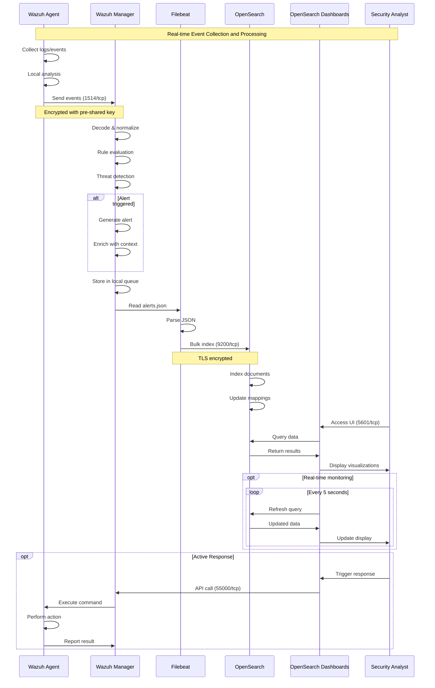
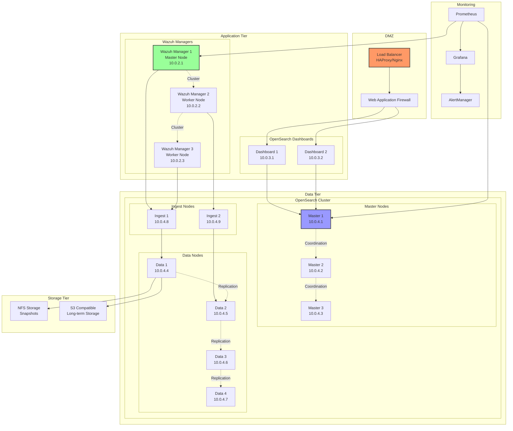
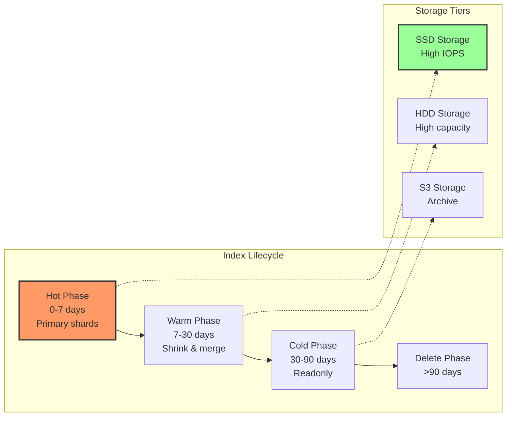
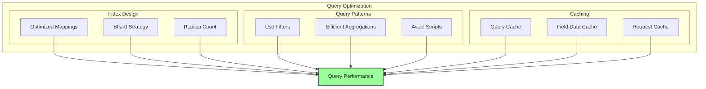
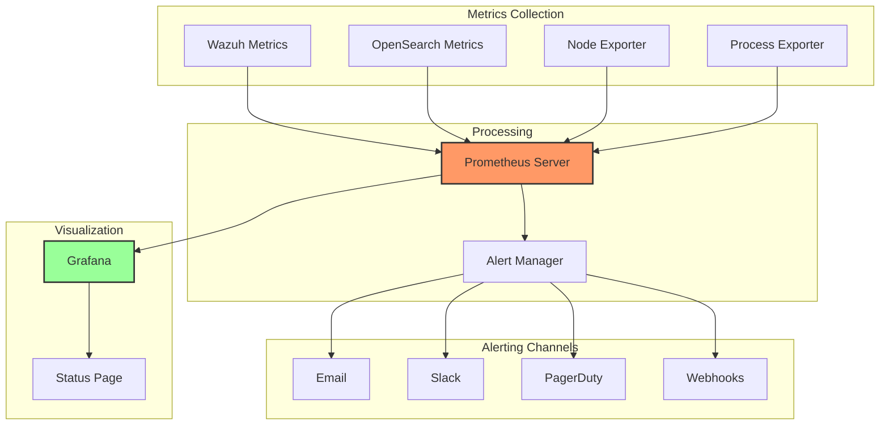
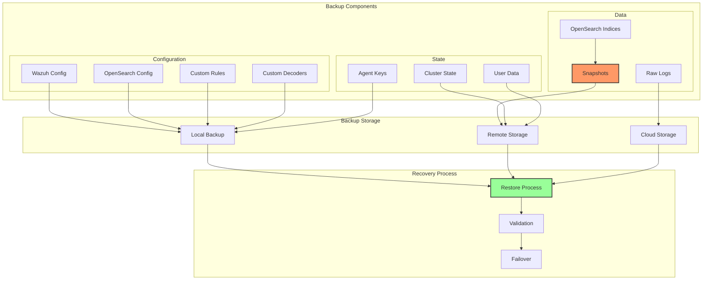
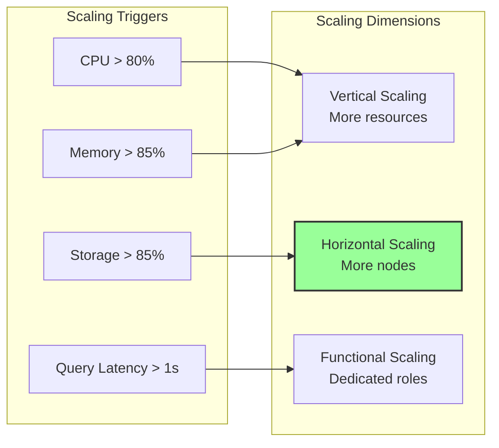

# OpenSearch and Wazuh Integration - Building a Comprehensive Security Analytics Platform

The integration of OpenSearch with Wazuh creates a powerful, open-source security information and event management (SIEM) platform. This comprehensive guide explores the architecture, implementation details, and best practices for deploying this solution at scale.

## Table of Contents

## Architecture Overview

The OpenSearch-Wazuh stack combines the search and analytics capabilities of OpenSearch with Wazuh's security monitoring and threat detection features. This integration provides real-time visibility into security events across your infrastructure.

```mermaid
graph TB
    subgraph "Data Sources"
        subgraph "Endpoints"
            Linux[Linux Servers]
            Windows[Windows Servers]
            Network[Network Devices]
            Cloud[Cloud Resources]
            Apps[Applications]
        end
    end

    subgraph "Collection Layer"
        subgraph "Wazuh Agents"
            LA[Linux Agent]
            WA[Windows Agent]
            AL[Agentless]
        end

        subgraph "Log Collectors"
            Syslog[Syslog Collector]
            Beats[Beats/Logstash]
            API[API Collectors]
        end
    end

    subgraph "Processing Layer"
        subgraph "Wazuh Manager Cluster"
            WM1[Wazuh Manager 1<br/>(Master)]
            WM2[Wazuh Manager 2<br/>(Worker)]
            WM3[Wazuh Manager 3<br/>(Worker)]

            subgraph "Manager Components"
                Analysisd[Analysis Engine]
                Remoted[Remote Daemon]
                Monitord[Monitor Daemon]
                Logcollector[Log Collector]
                Integratord[Integration Daemon]
            end
        end

        WazuhAPI[Wazuh API]
        Filebeat[Filebeat]
    end

    subgraph "Storage Layer"
        subgraph "OpenSearch Cluster"
            OS1[OpenSearch Node 1<br/>(Master Eligible)]
            OS2[OpenSearch Node 2<br/>(Master Eligible)]
            OS3[OpenSearch Node 3<br/>(Master Eligible)]
            OS4[OpenSearch Node 4<br/>(Data)]
            OS5[OpenSearch Node 5<br/>(Data)]
            OS6[OpenSearch Node 6<br/>(Ingest)]
        end
    end

    subgraph "Visualization Layer"
        OSD[OpenSearch Dashboards]
        WazuhApp[Wazuh App Plugin]
        Kibana[Alternative: Kibana]
    end

    subgraph "Security Layer"
        Certs[Certificate Authority]
        LDAP[LDAP/AD Integration]
        RBAC[Role-Based Access]
    end

    Linux --> LA
    Windows --> WA
    Network --> Syslog
    Cloud --> API
    Apps --> Beats

    LA --> Remoted
    WA --> Remoted
    AL --> Remoted
    Syslog --> Logcollector
    Beats --> OS6
    API --> Integratord

    Remoted --> Analysisd
    Logcollector --> Analysisd
    Integratord --> Analysisd

    Analysisd --> Monitord
    Monitord --> Filebeat

    WM1 -.->|Cluster Sync| WM2
    WM1 -.->|Cluster Sync| WM3

    Filebeat --> OS6

    OS1 -.->|Cluster| OS2
    OS2 -.->|Cluster| OS3
    OS3 -.->|Cluster| OS4
    OS4 -.->|Cluster| OS5
    OS5 -.->|Cluster| OS6

    OS1 --> OSD
    WazuhAPI --> WazuhApp
    WazuhApp --> OSD

    Certs --> WM1
    Certs --> OS1
    LDAP --> OSD
    RBAC --> WazuhApp

    style WM1 fill:#f96,stroke:#333,stroke-width:4px
    style OS1 fill:#9f9,stroke:#333,stroke-width:4px
    style OSD fill:#99f,stroke:#333,stroke-width:4px
```

### Component Responsibilities

1. **Wazuh Agents**: Collect logs, monitor file integrity, detect rootkits, and perform vulnerability scanning
2. **Wazuh Manager**: Process and analyze security events, manage agents, and coordinate responses
3. **OpenSearch**: Store and index security data for fast retrieval and analysis
4. **OpenSearch Dashboards**: Visualize security data and provide interactive dashboards
5. **Wazuh App**: Extend OpenSearch Dashboards with Wazuh-specific features

## Data Flow Diagram

Understanding how data flows through the system is crucial for troubleshooting and optimization:



### Data Processing Pipeline

```yaml
# Pipeline stages with processing details
pipeline:
  - stage: collection
    components:
      - wazuh_agent:
          functions:
            - log_collection
            - file_integrity_monitoring
            - system_calls_monitoring
            - command_monitoring
          output: raw_events

  - stage: normalization
    components:
      - wazuh_manager:
          functions:
            - decode_events
            - extract_fields
            - normalize_timestamps
            - enrich_metadata
          output: normalized_events

  - stage: analysis
    components:
      - analysis_engine:
          functions:
            - rule_matching
            - correlation
            - threat_intelligence
            - anomaly_detection
          output: alerts

  - stage: indexing
    components:
      - opensearch:
          functions:
            - document_parsing
            - field_mapping
            - indexing
            - replication
          output: searchable_data

  - stage: visualization
    components:
      - dashboards:
          functions:
            - query_execution
            - aggregation
            - visualization
            - reporting
          output: insights
```

## Security Certificate Chain

Security is paramount in a SIEM deployment. Here's how the certificate chain ensures secure communication:

```mermaid
graph TB
    subgraph "Certificate Authority Infrastructure"
        RootCA[Root CA<br/>CN=Wazuh Root CA]
        IntermediateCA[Intermediate CA<br/>CN=Wazuh Intermediate CA]
    end

    subgraph "Server Certificates"
        subgraph "Wazuh Certificates"
            WazuhAPI[Wazuh API<br/>CN=wazuh-api.domain.com]
            WazuhAuth[Wazuh Authd<br/>CN=wazuh-authd.domain.com]
            WazuhCluster[Wazuh Cluster<br/>CN=wazuh-cluster.domain.com]
        end

        subgraph "OpenSearch Certificates"
            OSNode[Node Certificates<br/>CN=os-node-*.domain.com]
            OSAdmin[Admin Certificate<br/>CN=os-admin.domain.com]
            OSTransport[Transport Certificate<br/>CN=os-transport.domain.com]
            OSHTTP[HTTP Certificate<br/>CN=os-http.domain.com]
        end

        subgraph "Dashboard Certificates"
            OSDash[OpenSearch Dashboards<br/>CN=dashboards.domain.com]
            WazuhApp[Wazuh App<br/>CN=wazuh-app.domain.com]
        end
    end

    subgraph "Client Certificates"
        FilebeatCert[Filebeat Client<br/>CN=filebeat.domain.com]
        AgentCert[Agent Certificates<br/>CN=agent-*.domain.com]
        UserCert[User Certificates<br/>CN=user@domain.com]
    end

    RootCA --> IntermediateCA

    IntermediateCA --> WazuhAPI
    IntermediateCA --> WazuhAuth
    IntermediateCA --> WazuhCluster

    IntermediateCA --> OSNode
    IntermediateCA --> OSAdmin
    IntermediateCA --> OSTransport
    IntermediateCA --> OSHTTP

    IntermediateCA --> OSDash
    IntermediateCA --> WazuhApp

    IntermediateCA --> FilebeatCert
    IntermediateCA --> AgentCert
    IntermediateCA --> UserCert

    style RootCA fill:#f96,stroke:#333,stroke-width:4px
    style IntermediateCA fill:#ff9,stroke:#333,stroke-width:2px
    style OSNode fill:#9f9,stroke:#333,stroke-width:2px
```



### Certificate Generation Script

```bash
#!/bin/bash
# Generate complete certificate chain for Wazuh-OpenSearch deployment

set -e

# Configuration
CERT_DIR="/etc/wazuh-certificates"
DAYS_VALID=3650
KEY_SIZE=4096
COUNTRY="US"
STATE="California"
CITY="San Francisco"
ORG="Security Organization"
OU="Security Operations"

# Create certificate directory
mkdir -p ${CERT_DIR}/{ca,server,client}

# Generate Root CA
echo "Generating Root CA..."
openssl genrsa -out ${CERT_DIR}/ca/root-ca-key.pem ${KEY_SIZE}
openssl req -new -x509 -sha256 -days ${DAYS_VALID} \
    -key ${CERT_DIR}/ca/root-ca-key.pem \
    -out ${CERT_DIR}/ca/root-ca.pem \
    -subj "/C=${COUNTRY}/ST=${STATE}/L=${CITY}/O=${ORG}/OU=${OU}/CN=Wazuh Root CA"

# Generate Intermediate CA
echo "Generating Intermediate CA..."
openssl genrsa -out ${CERT_DIR}/ca/intermediate-ca-key.pem ${KEY_SIZE}
openssl req -new -sha256 \
    -key ${CERT_DIR}/ca/intermediate-ca-key.pem \
    -out ${CERT_DIR}/ca/intermediate-ca.csr \
    -subj "/C=${COUNTRY}/ST=${STATE}/L=${CITY}/O=${ORG}/OU=${OU}/CN=Wazuh Intermediate CA"

# Sign Intermediate CA
openssl x509 -req -days ${DAYS_VALID} -sha256 \
    -in ${CERT_DIR}/ca/intermediate-ca.csr \
    -CA ${CERT_DIR}/ca/root-ca.pem \
    -CAkey ${CERT_DIR}/ca/root-ca-key.pem \
    -CAcreateserial \
    -out ${CERT_DIR}/ca/intermediate-ca.pem \
    -extensions v3_intermediate_ca \
    -extfile <(cat <<EOF
[v3_intermediate_ca]
subjectKeyIdentifier = hash
authorityKeyIdentifier = keyid:always,issuer
basicConstraints = critical, CA:true, pathlen:0
keyUsage = critical, digitalSignature, cRLSign, keyCertSign
EOF
)

# Create certificate chain
cat ${CERT_DIR}/ca/intermediate-ca.pem ${CERT_DIR}/ca/root-ca.pem > ${CERT_DIR}/ca/ca-chain.pem

# Function to generate server certificates
generate_server_cert() {
    local name=$1
    local cn=$2
    local san=$3

    echo "Generating certificate for ${name}..."

    # Generate private key
    openssl genrsa -out ${CERT_DIR}/server/${name}-key.pem ${KEY_SIZE}

    # Generate CSR
    openssl req -new -sha256 \
        -key ${CERT_DIR}/server/${name}-key.pem \
        -out ${CERT_DIR}/server/${name}.csr \
        -subj "/C=${COUNTRY}/ST=${STATE}/L=${CITY}/O=${ORG}/OU=${OU}/CN=${cn}"

    # Sign certificate
    openssl x509 -req -days ${DAYS_VALID} -sha256 \
        -in ${CERT_DIR}/server/${name}.csr \
        -CA ${CERT_DIR}/ca/intermediate-ca.pem \
        -CAkey ${CERT_DIR}/ca/intermediate-ca-key.pem \
        -CAcreateserial \
        -out ${CERT_DIR}/server/${name}.pem \
        -extensions v3_server \
        -extfile <(cat <<EOF
[v3_server]
subjectKeyIdentifier = hash
authorityKeyIdentifier = keyid,issuer
basicConstraints = CA:FALSE
keyUsage = critical, digitalSignature, keyEncipherment
extendedKeyUsage = serverAuth, clientAuth
subjectAltName = ${san}
EOF
)

    # Create full chain
    cat ${CERT_DIR}/server/${name}.pem ${CERT_DIR}/ca/ca-chain.pem > ${CERT_DIR}/server/${name}-chain.pem
}

# Generate OpenSearch node certificates
for i in {1..6}; do
    generate_server_cert "opensearch-node${i}" \
        "opensearch-node${i}.domain.com" \
        "DNS:opensearch-node${i}.domain.com,DNS:opensearch-node${i},IP:10.0.1.${i}"
done

# Generate OpenSearch admin certificate
generate_server_cert "opensearch-admin" \
    "opensearch-admin.domain.com" \
    "DNS:opensearch-admin.domain.com,DNS:localhost,IP:127.0.0.1"

# Generate Wazuh certificates
generate_server_cert "wazuh-manager" \
    "wazuh-manager.domain.com" \
    "DNS:wazuh-manager.domain.com,DNS:wazuh,IP:10.0.2.1"

generate_server_cert "wazuh-dashboard" \
    "wazuh-dashboard.domain.com" \
    "DNS:wazuh-dashboard.domain.com,DNS:dashboard,IP:10.0.2.2"

# Set appropriate permissions
chmod 400 ${CERT_DIR}/ca/*-key.pem
chmod 400 ${CERT_DIR}/server/*-key.pem
chmod 444 ${CERT_DIR}/ca/*.pem
chmod 444 ${CERT_DIR}/server/*.pem

echo "Certificate generation complete!"
```

## Deployment Architecture

### Production Deployment Topology



## Installation and Configuration

### OpenSearch Cluster Setup

```yaml
# opensearch.yml - Master node configuration
cluster.name: wazuh-security-cluster
node.name: opensearch-master-1
node.roles: [master]

network.host: 10.0.4.1
discovery.seed_hosts:
  - 10.0.4.1
  - 10.0.4.2
  - 10.0.4.3
cluster.initial_master_nodes:
  - opensearch-master-1
  - opensearch-master-2
  - opensearch-master-3

# Security settings
plugins.security.ssl.transport.pemcert_filepath: certificates/opensearch-node1.pem
plugins.security.ssl.transport.pemkey_filepath: certificates/opensearch-node1-key.pem
plugins.security.ssl.transport.pemtrustedcas_filepath: certificates/ca-chain.pem
plugins.security.ssl.transport.enforce_hostname_verification: true
plugins.security.ssl.transport.resolve_hostname: true

plugins.security.ssl.http.enabled: true
plugins.security.ssl.http.pemcert_filepath: certificates/opensearch-node1.pem
plugins.security.ssl.http.pemkey_filepath: certificates/opensearch-node1-key.pem
plugins.security.ssl.http.pemtrustedcas_filepath: certificates/ca-chain.pem

plugins.security.allow_unsafe_democertificates: false
plugins.security.allow_default_init_securityindex: false
plugins.security.authcz.admin_dn:
  - "CN=opensearch-admin.domain.com,OU=Security Operations,O=Security Organization,L=San Francisco,ST=California,C=US"

plugins.security.audit.type: internal_opensearch
plugins.security.enable_snapshot_restore_privilege: true
plugins.security.check_snapshot_restore_write_privileges: true
plugins.security.restapi.roles_enabled:
  ["all_access", "security_rest_api_access"]

# Performance tuning
indices.memory.index_buffer_size: 20%
indices.queries.cache.size: 15%
indices.fielddata.cache.size: 30%
thread_pool.search.size: 50
thread_pool.search.queue_size: 1000
thread_pool.write.size: 30
thread_pool.write.queue_size: 500

# Cluster routing
cluster.routing.allocation.disk.threshold_enabled: true
cluster.routing.allocation.disk.watermark.low: 85%
cluster.routing.allocation.disk.watermark.high: 90%
cluster.routing.allocation.disk.watermark.flood_stage: 95%
```

### Wazuh Manager Configuration

```xml
<!-- ossec.conf - Wazuh Manager configuration -->
<ossec_config>
  <global>
    <jsonout_output>yes</jsonout_output>
    <alerts_log>yes</alerts_log>
    <logall>no</logall>
    <logall_json>no</logall_json>
    <email_notification>no</email_notification>
    <smtp_server>smtp.domain.com</smtp_server>
    <email_from>wazuh@domain.com</email_from>
    <email_to>security@domain.com</email_to>
    <email_maxperhour>12</email_maxperhour>
    <queue_size>131072</queue_size>
  </global>

  <cluster>
    <name>wazuh-cluster</name>
    <node_name>wazuh-master</node_name>
    <node_type>master</node_type>
    <key>5f4dcc3b5aa765d61d8327deb882cf99</key>
    <port>1516</port>
    <bind_addr>0.0.0.0</bind_addr>
    <nodes>
      <node>10.0.2.1</node>
      <node>10.0.2.2</node>
      <node>10.0.2.3</node>
    </nodes>
    <hidden>no</hidden>
    <disabled>no</disabled>
  </cluster>

  <remote>
    <connection>secure</connection>
    <port>1514</port>
    <protocol>tcp</protocol>
    <queue_size>131072</queue_size>
  </remote>

  <alerts>
    <log_alert_level>3</log_alert_level>
    <email_alert_level>7</email_alert_level>
  </alerts>

  <command>
    <name>firewall-drop</name>
    <executable>firewall-drop</executable>
    <timeout_allowed>yes</timeout_allowed>
  </command>

  <active-response>
    <command>firewall-drop</command>
    <location>local</location>
    <level>7</level>
    <timeout>600</timeout>
  </active-response>

  <!-- OpenSearch output configuration -->
  <integration>
    <name>opensearch</name>
    <enabled>yes</enabled>
    <url>https://10.0.4.8:9200</url>
    <username>wazuh_indexer</username>
    <password>SecurePassword123!</password>
    <indices>
      <alerts>wazuh-alerts-*</alerts>
      <archives>wazuh-archives-*</archives>
    </indices>
    <ssl>
      <certificate>/etc/wazuh/certificates/wazuh-manager.pem</certificate>
      <key>/etc/wazuh/certificates/wazuh-manager-key.pem</key>
      <ca>/etc/wazuh/certificates/ca-chain.pem</ca>
    </ssl>
  </integration>
</ossec_config>
```

### Index Lifecycle Management



```json
// Index lifecycle policy
{
  "policy": {
    "phases": {
      "hot": {
        "min_age": "0ms",
        "actions": {
          "rollover": {
            "max_primary_shard_size": "50GB",
            "max_age": "7d"
          },
          "set_priority": {
            "priority": 100
          }
        }
      },
      "warm": {
        "min_age": "7d",
        "actions": {
          "shrink": {
            "number_of_shards": 1
          },
          "forcemerge": {
            "max_num_segments": 1
          },
          "set_priority": {
            "priority": 50
          },
          "allocate": {
            "node_type": "warm"
          }
        }
      },
      "cold": {
        "min_age": "30d",
        "actions": {
          "set_priority": {
            "priority": 0
          },
          "freeze": {},
          "allocate": {
            "node_type": "cold"
          },
          "searchable_snapshot": {
            "snapshot_repository": "s3_repository"
          }
        }
      },
      "delete": {
        "min_age": "90d",
        "actions": {
          "delete": {}
        }
      }
    }
  }
}
```

## Performance Optimization

### Query Performance Tuning



### Index Template Optimization

```json
// Optimized index template for Wazuh alerts
{
  "index_patterns": ["wazuh-alerts-*"],
  "priority": 100,
  "template": {
    "settings": {
      "number_of_shards": 3,
      "number_of_replicas": 1,
      "index.refresh_interval": "10s",
      "index.translog.durability": "async",
      "index.translog.sync_interval": "10s",
      "index.codec": "best_compression",
      "index.merge.scheduler.max_thread_count": 2,
      "index.merge.policy.max_merged_segment": "5gb"
    },
    "mappings": {
      "properties": {
        "@timestamp": {
          "type": "date",
          "format": "date_time_no_millis"
        },
        "agent": {
          "properties": {
            "id": {
              "type": "keyword"
            },
            "name": {
              "type": "keyword"
            },
            "ip": {
              "type": "ip"
            }
          }
        },
        "rule": {
          "properties": {
            "id": {
              "type": "keyword"
            },
            "level": {
              "type": "short"
            },
            "description": {
              "type": "text",
              "fields": {
                "keyword": {
                  "type": "keyword",
                  "ignore_above": 256
                }
              }
            }
          }
        },
        "data": {
          "type": "object",
          "enabled": true
        }
      }
    }
  }
}
```

## Security Hardening

### Security Architecture Layers

```mermaid
graph TB
    subgraph "Security Layers"
        subgraph "Network Security"
            FW[Firewall Rules]
            VLAN[VLAN Segmentation]
            VPN[VPN Access]
        end

        subgraph "Application Security"
            TLS[TLS Encryption]
            Auth[Authentication]
            Authz[Authorization]
        end

        subgraph "Data Security"
            EncRest[Encryption at Rest]
            EncTransit[Encryption in Transit]
            DataMask[Data Masking]
        end

        subgraph "Operational Security"
            Audit[Audit Logging]
            Monitor[Security Monitoring]
            Response[Incident Response]
        end
    end

    FW --> SecureStack[Secure Stack]
    VLAN --> SecureStack
    VPN --> SecureStack

    TLS --> SecureStack
    Auth --> SecureStack
    Authz --> SecureStack

    EncRest --> SecureStack
    EncTransit --> SecureStack
    DataMask --> SecureStack

    Audit --> SecureStack
    Monitor --> SecureStack
    Response --> SecureStack

    style SecureStack fill:#f96,stroke:#333,stroke-width:2px
```



### Security Configuration

```yaml
# opensearch-security-config.yml
_meta:
  type: "config"
  config_version: 2

config:
  dynamic:
    http:
      anonymous_auth_enabled: false
      xff:
        enabled: true
        internalProxies: '10\\.0\\.0\\.0/8'
        remoteIpHeader: "x-forwarded-for"

    authc:
      internal_auth:
        description: "Internal users"
        http_enabled: true
        transport_enabled: true
        order: 0
        http_authenticator:
          type: basic
          challenge: true
        authentication_backend:
          type: internal

      ldap_auth:
        description: "LDAP authentication"
        http_enabled: true
        transport_enabled: true
        order: 1
        http_authenticator:
          type: basic
          challenge: false
        authentication_backend:
          type: ldap
          config:
            enable_ssl: true
            enable_start_tls: false
            enable_ssl_client_auth: false
            verify_hostnames: true
            hosts:
              - ldap.domain.com:636
            bind_dn: "cn=admin,dc=domain,dc=com"
            password: "ldap_password"
            userbase: "ou=users,dc=domain,dc=com"
            usersearch: "(sAMAccountName={0})"
            username_attribute: "sAMAccountName"

    authz:
      roles_from_myldap:
        description: "LDAP authorization"
        http_enabled: true
        transport_enabled: true
        authorization_backend:
          type: ldap
          config:
            enable_ssl: true
            enable_start_tls: false
            enable_ssl_client_auth: false
            verify_hostnames: true
            hosts:
              - ldap.domain.com:636
            bind_dn: "cn=admin,dc=domain,dc=com"
            password: "ldap_password"
            rolebase: "ou=groups,dc=domain,dc=com"
            rolesearch: "(member={0})"
            userroleattribute: null
            userrolename: "memberOf"
            rolename: "cn"
            resolve_nested_roles: true
            skip_users:
              - "kibanaserver"
              - "admin"
```

## Monitoring and Alerting

### Monitoring Architecture



### Key Performance Indicators

```yaml
# Prometheus alert rules
groups:
  - name: wazuh_alerts
    interval: 30s
    rules:
      - alert: WazuhManagerDown
        expr: up{job="wazuh-manager"} == 0
        for: 5m
        labels:
          severity: critical
        annotations:
          summary: "Wazuh Manager is down"
          description: "Wazuh Manager {{ $labels.instance }} has been down for more than 5 minutes."

      - alert: HighAlertRate
        expr: rate(wazuh_alerts_total[5m]) > 100
        for: 10m
        labels:
          severity: warning
        annotations:
          summary: "High alert rate detected"
          description: "Alert rate is {{ $value }} alerts/sec"

  - name: opensearch_alerts
    interval: 30s
    rules:
      - alert: OpenSearchClusterRed
        expr: opensearch_cluster_health_status{color="red"} == 1
        for: 5m
        labels:
          severity: critical
        annotations:
          summary: "OpenSearch cluster is RED"
          description: "OpenSearch cluster health is RED for more than 5 minutes"

      - alert: HighJVMMemoryUsage
        expr: opensearch_jvm_memory_used_bytes / opensearch_jvm_memory_max_bytes > 0.9
        for: 10m
        labels:
          severity: warning
        annotations:
          summary: "High JVM memory usage"
          description: "JVM memory usage is {{ $value | humanizePercentage }}"
```

## Disaster Recovery

### Backup and Recovery Strategy



### Automated Backup Script

```bash
#!/bin/bash
# Automated backup script for Wazuh-OpenSearch stack

set -e

# Configuration
BACKUP_DIR="/backup"
S3_BUCKET="s3://wazuh-backups"
RETENTION_DAYS=30
DATE=$(date +%Y%m%d-%H%M%S)

# Create backup directories
mkdir -p ${BACKUP_DIR}/{wazuh,opensearch,config}/${DATE}

# Backup Wazuh configuration
echo "Backing up Wazuh configuration..."
tar czf ${BACKUP_DIR}/wazuh/${DATE}/wazuh-config.tar.gz \
    /var/ossec/etc \
    /var/ossec/rules \
    /var/ossec/decoders \
    /var/ossec/lists

# Backup Wazuh agent keys
echo "Backing up agent keys..."
cp /var/ossec/etc/client.keys ${BACKUP_DIR}/wazuh/${DATE}/

# Backup OpenSearch configuration
echo "Backing up OpenSearch configuration..."
tar czf ${BACKUP_DIR}/opensearch/${DATE}/opensearch-config.tar.gz \
    /etc/opensearch \
    /usr/share/opensearch/config

# Create OpenSearch snapshot
echo "Creating OpenSearch snapshot..."
curl -X PUT "https://localhost:9200/_snapshot/backup_repo/${DATE}?wait_for_completion=true" \
    -H 'Content-Type: application/json' \
    -u admin:admin \
    --cacert /etc/opensearch/ca.pem \
    -d '{
      "indices": "wazuh-*",
      "include_global_state": true,
      "metadata": {
        "taken_by": "automated_backup",
        "taken_because": "scheduled_backup"
      }
    }'

# Sync to S3
echo "Syncing to S3..."
aws s3 sync ${BACKUP_DIR}/ ${S3_BUCKET}/ --exclude "*.tmp"

# Clean up old local backups
echo "Cleaning up old backups..."
find ${BACKUP_DIR} -type d -mtime +${RETENTION_DAYS} -exec rm -rf {} \;

# Verify backup
echo "Verifying backup..."
if aws s3 ls ${S3_BUCKET}/${DATE}/ > /dev/null 2>&1; then
    echo "Backup completed successfully"
else
    echo "Backup verification failed"
    exit 1
fi

# Send notification
curl -X POST https://slack.webhook.url \
    -H 'Content-Type: application/json' \
    -d "{\"text\":\"Wazuh-OpenSearch backup completed successfully for ${DATE}\"}"
```

## Troubleshooting Guide

### Common Issues and Solutions

| Component   | Issue              | Symptoms                       | Solution                                                           |
| ----------- | ------------------ | ------------------------------ | ------------------------------------------------------------------ |
| Wazuh Agent | Connection Failed  | `Unable to connect to manager` | Check firewall rules, verify authd service, regenerate agent key   |
| OpenSearch  | Cluster Red Status | Unassigned shards              | Check disk space, verify node connectivity, force shard allocation |
| Filebeat    | Pipeline Blocked   | High memory usage              | Increase queue size, check OpenSearch performance                  |
| Dashboard   | Login Failed       | Authentication error           | Verify certificates, check user permissions, review auth logs      |
| Integration | No Data Flow       | Empty indices                  | Check Filebeat configuration, verify index patterns                |

### Debug Commands

```bash
# Wazuh Manager debugging
/var/ossec/bin/wazuh-control info
/var/ossec/bin/wazuh-control status
tail -f /var/ossec/logs/ossec.log

# Check cluster status
/var/ossec/bin/cluster_control -l

# OpenSearch cluster health
curl -X GET "https://localhost:9200/_cluster/health?pretty" \
    -u admin:admin --cacert /etc/opensearch/ca.pem

# Check indices
curl -X GET "https://localhost:9200/_cat/indices?v" \
    -u admin:admin --cacert /etc/opensearch/ca.pem

# Filebeat status
systemctl status filebeat
filebeat test config
filebeat test output

# Certificate validation
openssl x509 -in /path/to/cert.pem -text -noout
openssl verify -CAfile ca.pem cert.pem
```

## Best Practices

### Deployment Checklist

- [ ] **Infrastructure Requirements**

  - [ ] Adequate CPU and memory resources
  - [ ] SSD storage for hot data
  - [ ] Network bandwidth for replication
  - [ ] Backup storage capacity

- [ ] **Security Hardening**

  - [ ] TLS encryption enabled everywhere
  - [ ] Strong authentication configured
  - [ ] Role-based access control implemented
  - [ ] Audit logging enabled
  - [ ] Regular security updates

- [ ] **Performance Optimization**

  - [ ] Appropriate shard sizing (20-50GB)
  - [ ] Index lifecycle policies configured
  - [ ] Query optimization implemented
  - [ ] Monitoring and alerting active

- [ ] **Operational Readiness**
  - [ ] Backup and recovery tested
  - [ ] Disaster recovery plan documented
  - [ ] Runbooks created
  - [ ] Team trained
  - [ ] Support contracts in place

### Scaling Considerations



## Conclusion

The integration of OpenSearch with Wazuh creates a powerful, scalable, and secure SIEM platform capable of handling enterprise-scale security monitoring requirements. The architecture provides:

1. **Scalability**: Horizontal scaling capabilities for both processing and storage
2. **High Availability**: Clustered components with automatic failover
3. **Security**: End-to-end encryption and comprehensive access control
4. **Performance**: Optimized data flow and query performance
5. **Flexibility**: Customizable rules, decoders, and dashboards

By following the architectural patterns, security practices, and operational procedures outlined in this guide, organizations can build a robust security analytics platform that provides real-time visibility into their security posture while maintaining the performance and reliability required for production environments.

## References

- [OpenSearch Documentation](https://opensearch.org/docs/latest/)
- [Wazuh Documentation](https://documentation.wazuh.com/)
- [OpenSearch Security Plugin](https://opensearch.org/docs/latest/security-plugin/index/)
- [Elastic Common Schema](https://www.elastic.co/guide/en/ecs/current/index.html)
- [NIST Cybersecurity Framework](https://www.nist.gov/cyberframework)
