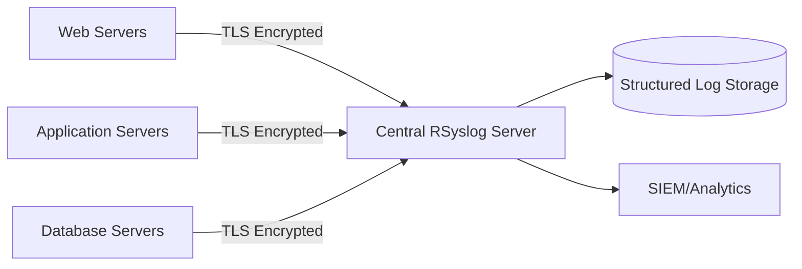

# Secure RSyslog Configuration - A Comprehensive Guide

In modern infrastructure, centralized logging is essential for security monitoring, troubleshooting, and compliance. However, a logging system itself can become a security liability if not properly secured. This guide provides a comprehensive approach to hardening RSyslog deployments with encryption, authentication, and robust queue management.

## Architecture Overview

A secure logging infrastructure consists of multiple clients (log sources) sending logs to a central server over encrypted channels. Our configuration implements:



This architecture ensures logs are:

- Encrypted during transit
- Authenticated using X.509 certificates
- Properly organized by source and facility
- Protected against data loss with queue management
- Rate-limited to prevent denial of service

## Security Controls Matrix

| Control Point  | Implementation            | Purpose                             |
| -------------- | ------------------------- | ----------------------------------- |
| Transport      | TLS 1.3                   | Data encryption in transit          |
| Authentication | X.509 Certificates        | Client/server mutual authentication |
| Authorization  | File permissions          | Access control for logs             |
| Integrity      | Message signing           | Tamper detection                    |
| Availability   | Queue management          | Reliability during outages          |
| Rate Limiting  | Session/connection limits | DoS protection                      |

## Server Configuration

The server configuration establishes a TLS-enabled listener and organizes incoming logs by type and source:

```conf
# Load required modules
module(load="imtcp")
module(load="imuxsock") # system log input
module(load="imjournal") # systemd journal input

# Enable TLS for secure transport
module(load="gtls"
    StreamDriver.Name="gtls"
    StreamDriver.Mode="1"
    StreamDriver.Authmode="x509/name"
    DefaultNetstreamDriver="gtls"
)

# TLS settings
global(
    DefaultNetstreamDriver="gtls"
    DefaultNetstreamDriverCAFile="/etc/rsyslog.d/certs/ca.pem"
    DefaultNetstreamDriverCertFile="/etc/rsyslog.d/certs/server-cert.pem"
    DefaultNetstreamDriverKeyFile="/etc/rsyslog.d/certs/server-key.pem"
)

# TCP Input configuration with TLS
input(
    type="imtcp"
    port="6514"
    StreamDriver.Name="gtls"
    StreamDriver.Mode="1"
    StreamDriver.Authmode="x509/name"
)

# Set file permissions and ownership
$FileCreateMode 0640
$FileOwner syslog
$FileGroup adm
$DirCreateMode 0750

# Separate log files by facility
template(name="SecureApacheError" type="string" string="/var/log/remote/httpd/%HOSTNAME%/error.log")
template(name="SecureApacheAccess" type="string" string="/var/log/remote/httpd/%HOSTNAME%/access.log")

# Rules for sorting logs
if $syslogfacility-text == 'local3' then ?SecureApacheError
if $syslogfaculty-text == 'local4' then ?SecureApacheAccess

# Rate limiting to prevent DoS
module(load="imtcp" MaxSessions="1000" RateLimit.Interval="1" RateLimit.Burst="20000")
```

### Key Security Features

1. **TLS Encryption**: All connections use TLS with X.509 certificate authentication
2. **Non-Standard Port**: Using port 6514 instead of the standard 514 to avoid common scanning
3. **Strict File Permissions**: Explicit file and directory permissions (0640/0750)
4. **Rate Limiting**: Connection limits to prevent denial of service attacks
5. **Structured Log Organization**: Logs organized by host and type

## Client Configuration

The client configuration securely forwards Apache logs to the central server:

```conf
# Load required modules
module(load="imfile")
module(load="gtls")

# TLS Configuration
global(
    DefaultNetstreamDriver="gtls"
    DefaultNetstreamDriverCAFile="/etc/rsyslog.d/certs/ca.pem"
    DefaultNetstreamDriverCertFile="/etc/rsyslog.d/certs/client-cert.pem"
    DefaultNetstreamDriverKeyFile="/etc/rsyslog.d/certs/client-key.pem"
)

# Apache Error Log Input
input(
    type="imfile"
    File="/var/log/httpd/error_log"
    Tag="httpd-error-default:"
    StateFile="stat-httpd-error"
    Severity="info"
    Facility="local3"
    PersistStateInterval="1000"
    ReadMode="2"
)

# Apache Access Log Input
input(
    type="imfile"
    File="/var/log/httpd/access_log"
    Tag="httpd-access-default:"
    StateFile="stat-httpd-access"
    Severity="info"
    Facility="local4"
    PersistStateInterval="1000"
    ReadMode="2"
)

# Queue configuration for reliability
main_queue(
    queue.filename="fwdRule1"
    queue.maxdiskspace="1g"
    queue.saveonshutdown="on"
    queue.type="LinkedList"
    queue.timeoutEnqueue="0"
    queue.maxFileSize="100m"
)

# Forward to central server with TLS
action(
    type="omfwd"
    Target="log.example.com"
    Port="6514"
    Protocol="tcp"
    StreamDriver="gtls"
    StreamDriverMode="1"
    StreamDriverAuthMode="x509/name"
    queue.type="LinkedList"
    queue.filename="fwdRule1"
    queue.maxdiskspace="1g"
    queue.saveonshutdown="on"
    action.resumeRetryCount="-1"
    action.resumeInterval="30"
)
```

### Key Client Features

1. **File Monitoring**: Continuously monitors Apache log files for changes
2. **Binary-Safe Reading**: `ReadMode="2"` ensures proper handling of binary data
3. **Reliable Delivery**: Disk-assisted queues with persistence across restarts
4. **Certificate Authentication**: Mutual TLS authentication with the server
5. **Automatic Recovery**: Configurable retry parameters for network outages

## Implementation Steps

### 1. Certificate Generation

First, create a certificate authority (CA) and generate server/client certificates:

```bash
# Create directories
mkdir -p /etc/rsyslog.d/certs

# Generate CA certificate
openssl req -newkey rsa:4096 -x509 -sha256 -days 365 -nodes \
    -out /etc/rsyslog.d/certs/ca.pem \
    -keyout /etc/rsyslog.d/certs/ca-key.pem

# Generate server certificate
openssl req -newkey rsa:4096 -nodes \
    -out /etc/rsyslog.d/certs/server.csr \
    -keyout /etc/rsyslog.d/certs/server-key.pem

# Sign server certificate
openssl x509 -req -in /etc/rsyslog.d/certs/server.csr \
    -CA /etc/rsyslog.d/certs/ca.pem \
    -CAkey /etc/rsyslog.d/certs/ca-key.pem \
    -CAcreateserial -out /etc/rsyslog.d/certs/server-cert.pem
```

Repeat the certificate generation process for each client, creating unique client certificates.

### 2. Set Permissions

Secure your certificates with strict permissions:

```bash
chown -R syslog:syslog /etc/rsyslog.d/certs
chmod -R 0500 /etc/rsyslog.d/certs
chmod 0400 /etc/rsyslog.d/certs/*.pem
```

### 3. Create Log Directories

Set up properly structured log directories:

```bash
mkdir -p /var/log/remote/httpd
chown -R syslog:adm /var/log/remote
chmod -R 0750 /var/log/remote
```

### 4. SELinux Configuration (if enabled)

Apply correct SELinux contexts:

```bash
semanage port -a -t syslogd_port_t -p tcp 6514
semanage fcontext -a -t var_log_t "/var/log/remote(/.*)?"
restorecon -R /var/log/remote
```

### 5. Validate Configuration

Check your configuration for errors:

```bash
rsyslogd -N1 -f /etc/rsyslog.conf
```

### 6. Restart RSyslog

Apply the configuration:

```bash
systemctl restart rsyslog
```

## Monitoring and Maintenance

### Certificate Management

Implement these practices for certificate security:

- Rotate certificates every 90 days
- Use strong key sizes (4096 bits for RSA)
- Set up automated renewal processes
- Implement certificate expiration monitoring

Create a certificate expiration checker:

```bash
echo "0 0 1 * * root /usr/local/bin/check_cert_expiry.sh" > /etc/cron.d/cert_check
```

### Queue Monitoring

Watch for queue buildup which might indicate issues:

```bash
watch -n 60 'du -sh /var/lib/rsyslog'
```

### Connection Verification

Verify encrypted connections are properly established:

```bash
tcpdump -i any port 6514 -nn | grep "TLS"
```

## Security Best Practices

### Network Security

- Implement network segmentation to isolate logging infrastructure
- Use a dedicated management network for rsyslog traffic
- Apply strict firewall rules to limit access to logging servers

### System Hardening

- Regularly apply security patches to RSyslog and system
- Run RSyslog with minimal privileges
- Implement filesystem integrity monitoring
- Configure host-based firewalls on all logging servers

### Operational Security

- Implement log rotation and archiving policies
- Set up log backup procedures
- Conduct regular security audits of logging infrastructure
- Document your logging architecture and security controls

## Troubleshooting Common Issues

### Certificate Problems

If you encounter TLS connection failures:

1. Verify certificate paths and permissions
2. Check certificate expiration dates
3. Ensure hostname verification is properly configured
4. Validate CA trust chain

### Queue Issues

If logs are not being delivered:

1. Check disk space on queue storage
2. Verify queue permissions
3. Inspect queue status with `rsyslogd -d`
4. Review retry parameters

### Connection Failures

For general connectivity issues:

1. Check firewall rules on both client and server
2. Verify network routing between systems
3. Ensure the correct port is being used
4. Test basic connectivity with `netcat` or similar tools

## Advanced Features

### Log Filtering and Processing

RSyslog can perform advanced processing on logs before forwarding:

```conf
# Filter out sensitive information
:msg, contains, "password=" stop

# Transform messages
template(name="JSONFormat" type="string" string="{\"message\":\"%msg%\",\"host\":\"%HOSTNAME%\",\"severity\":\"%syslogseverity-text%\",\"facility\":\"%syslogfacility-text%\",\"timereported\":\"%timereported:::date-rfc3339%\",\"timegenerated\":\"%timegenerated:::date-rfc3339%\"}\n")
```

### High Availability

For mission-critical environments, implement redundant RSyslog servers:

```conf
# Forward to multiple servers for redundancy
action(
    type="omfwd"
    Target="primary-log.example.com"
    Port="6514"
    Protocol="tcp"
    StreamDriver="gtls"
    StreamDriverMode="1"
    StreamDriverAuthMode="x509/name"
)

action(
    type="omfwd"
    Target="backup-log.example.com"
    Port="6514"
    Protocol="tcp"
    StreamDriver="gtls"
    StreamDriverMode="1"
    StreamDriverAuthMode="x509/name"
)
```

## Conclusion

A properly secured RSyslog implementation provides the foundation for robust security monitoring, compliance, and operational visibility. By implementing TLS encryption, certificate authentication, proper queue management, and following security best practices, you can ensure your logging infrastructure remains a security asset rather than a liability.

Remember that logging security is not a one-time setup but requires ongoing maintenance and monitoring. Regularly review your configuration, rotate certificates, and stay current with security updates to maintain the integrity of your logging system.
