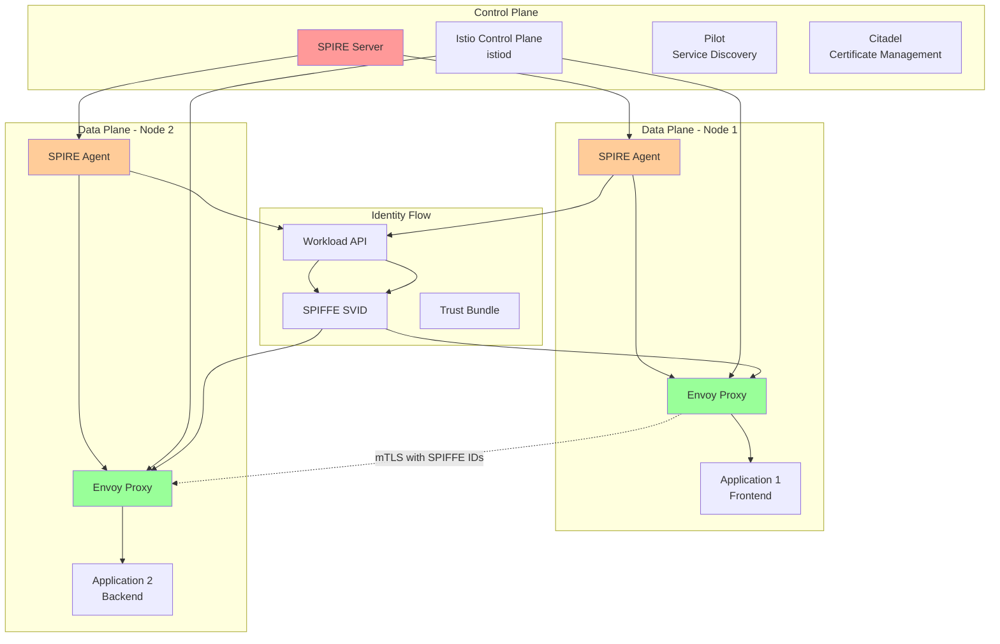

## Introduction: The Perfect Marriage of Identity and Mesh

In our [previous posts on SPIFFE/SPIRE](/spiffe-spire-kubernetes-complete-guide), we've built a robust workload identity platform. Now it's time to integrate this foundation with Istio service mesh to create a comprehensive zero-trust networking solution that combines cryptographic workload identity with intelligent traffic management.

This integration represents the evolution from basic service-to-service communication to a sophisticated platform where every connection is authenticated, authorized, and encrypted based on workload identity rather than network location.

## Understanding the Integration Architecture

Let's visualize how SPIFFE/SPIRE integrates with Istio:



### Integration Benefits

1. **Unified Identity**: SPIFFE IDs become the source of truth for both authentication and authorization
2. **Automatic mTLS**: Envoy proxies use SPIFFE SVIDs for mutual TLS without manual certificate management
3. **Fine-Grained Policies**: Authorization policies based on cryptographic identity, not network location
4. **Observability**: Rich telemetry combining service mesh metrics with identity information
5. **Multi-Cluster**: SPIFFE federation enables secure cross-cluster communication

## Installation and Configuration

### Step 1: Install Istio with SPIRE Integration

First, let's install Istio configured to use SPIRE as the certificate authority:

```bash
# Download and install Istio
curl -L https://istio.io/downloadIstio | sh -
cd istio-*
export PATH=$PWD/bin:$PATH

# Create Istio configuration for SPIRE integration
cat <<EOF > istio-spire-config.yaml
apiVersion: install.istio.io/v1alpha1
kind: IstioOperator
metadata:
  name: spire-integration
spec:
  values:
    # Disable Istio's built-in CA
    pilot:
      env:
        # Use SPIRE as external CA
        EXTERNAL_CA: ISTIOD_RA_KUBERNETES_API

        # SPIRE server endpoint
        CA_ADDR: spire-server.spire-system.svc:8081

        # Enable workload entry auto-registration
        PILOT_ENABLE_WORKLOAD_ENTRY_AUTOREGISTRATION: true

        # Use SPIFFE identity format
        PILOT_ENABLE_SPIFFE_ENDPOINT_SLICE: true

        # Custom trust domain
        TRUST_DOMAIN: "cluster.local"

        # JWT issuer (matches SPIRE configuration)
        JWT_ISSUER: "https://oidc.enterprise.example.com"

    # Global proxy configuration
    global:
      # Mesh ID for multi-cluster
      meshID: "mesh1"

      # Trust domain (should match SPIRE)
      trustDomain: "cluster.local"

      # External CA configuration
      caAddress: "spire-server.spire-system.svc:8081"

      # Proxy configuration
      proxy:
        # Enable automatic protocol detection
        autoInject: enabled

        # SPIFFE integration
        env:
          # SPIFFE endpoint socket path
          SPIFFE_ENDPOINT_SOCKET: "unix:///run/spire/sockets/agent.sock"

          # Trust bundle path
          TRUST_BUNDLE_PATH: "/run/spire/bundle/bundle.crt"

          # Workload API timeout
          WORKLOAD_API_TIMEOUT: "30s"

    # Sidecar injector configuration
    sidecarInjectorWebhook:
      # Enable automatic sidecar injection
      enableNamespacesByDefault: false

      # Custom injection template for SPIRE
      templates:
        spire: |
          spec:
            containers:
            - name: istio-proxy
              volumeMounts:
              - name: spire-agent-socket
                mountPath: /run/spire/sockets
                readOnly: true
              - name: spire-bundle
                mountPath: /run/spire/bundle
                readOnly: true
            volumes:
            - name: spire-agent-socket
              hostPath:
                path: /run/spire/sockets
                type: DirectoryOrCreate
            - name: spire-bundle
              configMap:
                name: spire-bundle

  components:
    pilot:
      k8s:
        # Enhanced resources for SPIRE integration
        resources:
          requests:
            cpu: 200m
            memory: 512Mi
          limits:
            cpu: 2000m
            memory: 2Gi

        # Environment variables for SPIRE integration
        env:
        - name: SPIFFE_ENDPOINT_SOCKET
          value: "unix:///run/spire/sockets/agent.sock"
        - name: TRUST_DOMAIN
          value: "cluster.local"

        # Volume mounts for SPIRE
        volumeMounts:
        - name: spire-agent-socket
          mountPath: /run/spire/sockets
          readOnly: true
        - name: spire-bundle
          mountPath: /run/spire/bundle
          readOnly: true

        volumes:
        - name: spire-agent-socket
          hostPath:
            path: /run/spire/sockets
            type: DirectoryOrCreate
        - name: spire-bundle
          configMap:
            name: spire-bundle

    # Proxy configuration
    proxy:
      k8s:
        # Security context for SPIRE access
        securityContext:
          runAsUser: 1337
          runAsGroup: 1337

        # Resource limits
        resources:
          requests:
            cpu: 100m
            memory: 128Mi
          limits:
            cpu: 1000m
            memory: 1Gi
EOF

# Install Istio with SPIRE integration
istioctl install -f istio-spire-config.yaml --set values.pilot.env.EXTERNAL_CA=ISTIOD_RA_KUBERNETES_API
```

### Step 2: Configure SPIRE for Istio Integration

Update your SPIRE configuration to work with Istio:

```yaml
# spire-istio-integration.yaml
apiVersion: v1
kind: ConfigMap
metadata:
  name: spire-server-istio-config
  namespace: spire-system
data:
  server.conf: |
    server {
      bind_address = "0.0.0.0"
      bind_port = "8081"
      socket_path = "/tmp/spire-server/private/api.sock"
      trust_domain = "cluster.local"
      data_dir = "/run/spire/data"
      log_level = "INFO"
      
      # JWT issuer configuration for Istio
      jwt_issuer = "https://oidc.enterprise.example.com"
      
      # Default SVID TTL (align with Istio expectations)
      default_svid_ttl = "1h"
      
      # CA configuration for Istio integration
      ca_subject = {
        country = ["US"],
        organization = ["Example Corp"],
        common_name = "SPIRE Server CA for Istio",
      }
    }

    plugins {
      # Kubernetes node attestor
      NodeAttestor "k8s_psat" {
        plugin_data {
          clusters = {
            "cluster.local" = {
              service_account_allow_list = ["spire-agent"]
              audience = ["spire-server"]
            }
          }
        }
      }

      # Kubernetes workload attestor with Istio support
      WorkloadAttestor "k8s" {
        plugin_data {
          # Skip kubelet verification for Istio sidecars
          skip_kubelet_verification = false
          kubelet_secure_port = 10250
          
          # Custom pod UID extraction for Istio
          use_new_container_locator = true
          
          # Verify node name
          verify_node_resolver = true
        }
      }

      # Istio-specific workload attestor
      WorkloadAttestor "docker" {
        plugin_data {
          docker_socket_path = "unix:///var/run/docker.sock"
          
          # Container ID matchers for Istio sidecars
          container_id_cgroup_matchers = [
            "/docker/([^/]+)",
            "/system.slice/docker-([^.]+).scope",
            "/kubepods/[^/]+/pod[^/]+/([^/]+)"
          ]
          
          # Use new container locator for better Istio support
          use_new_container_locator = true
        }
      }

      DataStore "sql" {
        plugin_data {
          database_type = "postgres"
          connection_string = "host=postgres-ha.data.svc.cluster.local dbname=spire user=spire sslmode=require"
        }
      }

      KeyManager "disk" {
        plugin_data {
          keys_path = "/run/spire/data/keys.json"
        }
      }

      UpstreamAuthority "disk" {
        plugin_data {
          cert_file_path = "/run/spire/ca/ca.crt"
          key_file_path = "/run/spire/ca/ca.key"
        }
      }

      # Kubernetes bundle notifier for Istio
      Notifier "k8sbundle" {
        plugin_data {
          # Update ConfigMap for Istio trust bundle
          webhook_label = "spiffe.io/webhook"
          config_map = "spire-bundle"
          config_map_key = "bundle.crt"
          namespace = "istio-system"
        }
      }
    }

    health_checks {
      listener_enabled = true
      bind_address = "0.0.0.0"
      bind_port = "8080"
      live_path = "/live"
      ready_path = "/ready"
    }

    telemetry {
      Prometheus {
        bind_address = "0.0.0.0"
        bind_port = "9988"
      }
    }
---
# SPIRE Agent configuration for Istio
apiVersion: v1
kind: ConfigMap
metadata:
  name: spire-agent-istio-config
  namespace: spire-system
data:
  agent.conf: |
    agent {
      data_dir = "/run/spire/data"
      log_level = "INFO"
      server_address = "spire-server.spire-system"
      server_port = "8081"
      socket_path = "/run/spire/sockets/agent.sock"
      trust_bundle_path = "/run/spire/bundle/bundle.crt"
      trust_domain = "cluster.local"
      
      # Insecure bootstrap for demo (use join tokens in production)
      insecure_bootstrap = false
    }

    plugins {
      NodeAttestor "k8s_psat" {
        plugin_data {
          cluster = "cluster.local"
          token_path = "/var/run/secrets/tokens/spire-agent"
        }
      }

      # Kubernetes workload attestor for Istio
      WorkloadAttestor "k8s" {
        plugin_data {
          skip_kubelet_verification = false
          kubelet_secure_port = 10250
          
          # Node name for verification
          node_name_env = "MY_NODE_NAME"
          
          # Kubernetes config for API access
          kube_config_file = "/var/lib/kubelet/kubeconfig"
        }
      }

      # Docker workload attestor for Istio sidecars
      WorkloadAttestor "docker" {
        plugin_data {
          docker_socket_path = "unix:///var/run/docker.sock"
          
          # Container matchers for Istio
          container_id_cgroup_matchers = [
            "/docker/([^/]+)",
            "/system.slice/docker-([^.]+).scope"
          ]
        }
      }

      KeyManager "memory" {
        plugin_data = {}
      }
    }

    health_checks {
      listener_enabled = true
      bind_address = "0.0.0.0"
      bind_port = "8080"
      live_path = "/live"
      ready_path = "/ready"
    }

    telemetry {
      Prometheus {
        bind_address = "0.0.0.0"
        bind_port = "9988"
      }
    }
```

### Step 3: Configure Workload Registration for Istio

Create ClusterSPIFFEID resources for Istio workloads:

```yaml
# istio-workload-registration.yaml
apiVersion: spire.spiffe.io/v1alpha1
kind: ClusterSPIFFEID
metadata:
  name: istio-sidecars
spec:
  # SPIFFE ID template for Istio sidecars
  spiffeIDTemplate: "spiffe://{{ .TrustDomain }}/ns/{{ .PodMeta.Namespace }}/sa/{{ .PodSpec.ServiceAccountName }}"

  # Select all pods with Istio sidecar injection
  podSelector:
    matchLabels:
      security.istio.io/tlsMode: istio

  # Include common application namespaces
  namespaceSelector:
    matchExpressions:
      - key: name
        operator: NotIn
        values: ["kube-system", "kube-public", "spire-system"]

  # Workload selectors for SPIRE Agent
  workloadSelectorTemplates:
    - "k8s:ns:{{ .PodMeta.Namespace }}"
    - "k8s:sa:{{ .PodSpec.ServiceAccountName }}"
    - "k8s:pod-label:app:{{ .PodMeta.Labels.app }}"

  # DNS names for service mesh communication
  dnsNameTemplates:
    - "{{ .PodMeta.Labels.app }}.{{ .PodMeta.Namespace }}.svc.cluster.local"
    - "{{ .PodMeta.Name }}.{{ .PodMeta.Namespace }}.svc.cluster.local"

  # SVID TTL aligned with Istio certificate rotation
  ttl: 3600
---
# Specific registration for ingress gateways
apiVersion: spire.spiffe.io/v1alpha1
kind: ClusterSPIFFEID
metadata:
  name: istio-gateways
spec:
  spiffeIDTemplate: "spiffe://{{ .TrustDomain }}/ns/{{ .PodMeta.Namespace }}/gateway/{{ .PodMeta.Labels.app }}"

  podSelector:
    matchLabels:
      app: istio-proxy
      istio: ingressgateway

  namespaceSelector:
    matchNames:
      - "istio-system"

  workloadSelectorTemplates:
    - "k8s:ns:{{ .PodMeta.Namespace }}"
    - "k8s:sa:{{ .PodSpec.ServiceAccountName }}"
    - "k8s:pod-label:istio:{{ .PodMeta.Labels.istio }}"

  dnsNameTemplates:
    - "istio-ingressgateway.istio-system.svc.cluster.local"
    - "*.example.com"

  # Longer TTL for stable gateway identities
  ttl: 7200
---
# Registration for Istio control plane
apiVersion: spire.spiffe.io/v1alpha1
kind: ClusterSPIFFEID
metadata:
  name: istio-control-plane
spec:
  spiffeIDTemplate: "spiffe://{{ .TrustDomain }}/ns/{{ .PodMeta.Namespace }}/istiod"

  podSelector:
    matchLabels:
      app: istiod

  namespaceSelector:
    matchNames:
      - "istio-system"

  workloadSelectorTemplates:
    - "k8s:ns:{{ .PodMeta.Namespace }}"
    - "k8s:sa:{{ .PodSpec.ServiceAccountName }}"
    - "k8s:pod-label:app:istiod"

  # Admin privileges for Istio control plane
  admin: true

  dnsNameTemplates:
    - "istiod.istio-system.svc.cluster.local"
    - "istiod.istio-system"

  ttl: 3600
```

### Step 4: Deploy Sample Application with Istio and SPIRE

Let's deploy a multi-tier application that uses both Istio service mesh and SPIFFE identities:

```yaml
# bookinfo-spire-example.yaml
apiVersion: v1
kind: Namespace
metadata:
  name: bookinfo
  labels:
    istio-injection: enabled
    spire-managed: "true"
---
# Service accounts for each service
apiVersion: v1
kind: ServiceAccount
metadata:
  name: productpage
  namespace: bookinfo
---
apiVersion: v1
kind: ServiceAccount
metadata:
  name: details
  namespace: bookinfo
---
apiVersion: v1
kind: ServiceAccount
metadata:
  name: reviews
  namespace: bookinfo
---
apiVersion: v1
kind: ServiceAccount
metadata:
  name: ratings
  namespace: bookinfo
---
# ProductPage service and deployment
apiVersion: v1
kind: Service
metadata:
  name: productpage
  namespace: bookinfo
  labels:
    app: productpage
    service: productpage
spec:
  ports:
    - port: 9080
      name: http
  selector:
    app: productpage
---
apiVersion: apps/v1
kind: Deployment
metadata:
  name: productpage
  namespace: bookinfo
spec:
  replicas: 1
  selector:
    matchLabels:
      app: productpage
      version: v1
  template:
    metadata:
      labels:
        app: productpage
        version: v1
        security.istio.io/tlsMode: istio
      annotations:
        # Custom sidecar injection template for SPIRE
        sidecar.istio.io/inject: "true"
        inject.istio.io/templates: "sidecar,spire"
    spec:
      serviceAccountName: productpage
      containers:
        - name: productpage
          image: docker.io/istio/examples-bookinfo-productpage-v1:1.16.2
          imagePullPolicy: IfNotPresent
          ports:
            - containerPort: 9080
          env:
            # Enable SPIFFE identity for application
            - name: SPIFFE_ENDPOINT_SOCKET
              value: "unix:///run/spire/sockets/agent.sock"
            - name: TRUST_DOMAIN
              value: "cluster.local"
          volumeMounts:
            - name: spire-agent-socket
              mountPath: /run/spire/sockets
              readOnly: true
      volumes:
        - name: spire-agent-socket
          hostPath:
            path: /run/spire/sockets
            type: DirectoryOrCreate
---
# Details service and deployment
apiVersion: v1
kind: Service
metadata:
  name: details
  namespace: bookinfo
  labels:
    app: details
    service: details
spec:
  ports:
    - port: 9080
      name: http
  selector:
    app: details
---
apiVersion: apps/v1
kind: Deployment
metadata:
  name: details
  namespace: bookinfo
spec:
  replicas: 1
  selector:
    matchLabels:
      app: details
      version: v1
  template:
    metadata:
      labels:
        app: details
        version: v1
        security.istio.io/tlsMode: istio
      annotations:
        sidecar.istio.io/inject: "true"
        inject.istio.io/templates: "sidecar,spire"
    spec:
      serviceAccountName: details
      containers:
        - name: details
          image: docker.io/istio/examples-bookinfo-details-v1:1.16.2
          imagePullPolicy: IfNotPresent
          ports:
            - containerPort: 9080
          env:
            - name: SPIFFE_ENDPOINT_SOCKET
              value: "unix:///run/spire/sockets/agent.sock"
          volumeMounts:
            - name: spire-agent-socket
              mountPath: /run/spire/sockets
              readOnly: true
      volumes:
        - name: spire-agent-socket
          hostPath:
            path: /run/spire/sockets
            type: DirectoryOrCreate
---
# Reviews service and deployment (multiple versions)
apiVersion: v1
kind: Service
metadata:
  name: reviews
  namespace: bookinfo
  labels:
    app: reviews
    service: reviews
spec:
  ports:
    - port: 9080
      name: http
  selector:
    app: reviews
---
apiVersion: apps/v1
kind: Deployment
metadata:
  name: reviews-v1
  namespace: bookinfo
spec:
  replicas: 1
  selector:
    matchLabels:
      app: reviews
      version: v1
  template:
    metadata:
      labels:
        app: reviews
        version: v1
        security.istio.io/tlsMode: istio
      annotations:
        sidecar.istio.io/inject: "true"
        inject.istio.io/templates: "sidecar,spire"
    spec:
      serviceAccountName: reviews
      containers:
        - name: reviews
          image: docker.io/istio/examples-bookinfo-reviews-v1:1.16.2
          imagePullPolicy: IfNotPresent
          ports:
            - containerPort: 9080
          env:
            - name: SPIFFE_ENDPOINT_SOCKET
              value: "unix:///run/spire/sockets/agent.sock"
          volumeMounts:
            - name: spire-agent-socket
              mountPath: /run/spire/sockets
              readOnly: true
      volumes:
        - name: spire-agent-socket
          hostPath:
            path: /run/spire/sockets
            type: DirectoryOrCreate
---
apiVersion: apps/v1
kind: Deployment
metadata:
  name: reviews-v2
  namespace: bookinfo
spec:
  replicas: 1
  selector:
    matchLabels:
      app: reviews
      version: v2
  template:
    metadata:
      labels:
        app: reviews
        version: v2
        security.istio.io/tlsMode: istio
      annotations:
        sidecar.istio.io/inject: "true"
        inject.istio.io/templates: "sidecar,spire"
    spec:
      serviceAccountName: reviews
      containers:
        - name: reviews
          image: docker.io/istio/examples-bookinfo-reviews-v2:1.16.2
          imagePullPolicy: IfNotPresent
          ports:
            - containerPort: 9080
          env:
            - name: SPIFFE_ENDPOINT_SOCKET
              value: "unix:///run/spire/sockets/agent.sock"
          volumeMounts:
            - name: spire-agent-socket
              mountPath: /run/spire/sockets
              readOnly: true
      volumes:
        - name: spire-agent-socket
          hostPath:
            path: /run/spire/sockets
            type: DirectoryOrCreate
---
# Ratings service and deployment
apiVersion: v1
kind: Service
metadata:
  name: ratings
  namespace: bookinfo
  labels:
    app: ratings
    service: ratings
spec:
  ports:
    - port: 9080
      name: http
  selector:
    app: ratings
---
apiVersion: apps/v1
kind: Deployment
metadata:
  name: ratings
  namespace: bookinfo
spec:
  replicas: 1
  selector:
    matchLabels:
      app: ratings
      version: v1
  template:
    metadata:
      labels:
        app: ratings
        version: v1
        security.istio.io/tlsMode: istio
      annotations:
        sidecar.istio.io/inject: "true"
        inject.istio.io/templates: "sidecar,spire"
    spec:
      serviceAccountName: ratings
      containers:
        - name: ratings
          image: docker.io/istio/examples-bookinfo-ratings-v1:1.16.2
          imagePullPolicy: IfNotPresent
          ports:
            - containerPort: 9080
          env:
            - name: SPIFFE_ENDPOINT_SOCKET
              value: "unix:///run/spire/sockets/agent.sock"
          volumeMounts:
            - name: spire-agent-socket
              mountPath: /run/spire/sockets
              readOnly: true
      volumes:
        - name: spire-agent-socket
          hostPath:
            path: /run/spire/sockets
            type: DirectoryOrCreate
```

## Advanced Authorization Policies with SPIFFE Identities

Now let's create sophisticated authorization policies using SPIFFE identities:

```yaml
# spiffe-authorization-policies.yaml
apiVersion: security.istio.io/v1beta1
kind: AuthorizationPolicy
metadata:
  name: productpage-policy
  namespace: bookinfo
spec:
  # Apply to productpage service
  selector:
    matchLabels:
      app: productpage
  rules:
    # Allow access from ingress gateway
    - from:
        - source:
            principals: ["cluster.local/ns/istio-system/gateway/istio-proxy"]
      to:
        - operation:
            methods: ["GET", "POST"]
            paths: ["/productpage*", "/static/*"]

    # Allow health checks from Kubernetes
    - from:
        - source:
            principals: ["cluster.local/ns/kube-system/sa/system"]
      to:
        - operation:
            methods: ["GET"]
            paths: ["/health", "/ready"]
---
# Reviews service authorization
apiVersion: security.istio.io/v1beta1
kind: AuthorizationPolicy
metadata:
  name: reviews-policy
  namespace: bookinfo
spec:
  selector:
    matchLabels:
      app: reviews
  rules:
    # Only allow access from productpage
    - from:
        - source:
            principals: ["cluster.local/ns/bookinfo/sa/productpage"]
      to:
        - operation:
            methods: ["GET"]
            paths: ["/reviews*"]

    # Allow internal health checks
    - from:
        - source:
            principals: ["cluster.local/ns/bookinfo/sa/reviews"]
      to:
        - operation:
            methods: ["GET"]
            paths: ["/health"]
---
# Details service authorization
apiVersion: security.istio.io/v1beta1
kind: AuthorizationPolicy
metadata:
  name: details-policy
  namespace: bookinfo
spec:
  selector:
    matchLabels:
      app: details
  rules:
    # Only allow access from productpage
    - from:
        - source:
            principals: ["cluster.local/ns/bookinfo/sa/productpage"]
      to:
        - operation:
            methods: ["GET"]
            paths: ["/details*"]
---
# Ratings service authorization
apiVersion: security.istio.io/v1beta1
kind: AuthorizationPolicy
metadata:
  name: ratings-policy
  namespace: bookinfo
spec:
  selector:
    matchLabels:
      app: ratings
  rules:
    # Only allow access from reviews service
    - from:
        - source:
            principals: ["cluster.local/ns/bookinfo/sa/reviews"]
      to:
        - operation:
            methods: ["GET"]
            paths: ["/ratings*"]

    # Allow specific reviews versions with different access patterns
    - from:
        - source:
            principals: ["cluster.local/ns/bookinfo/sa/reviews"]
      when:
        - key: source.labels[version]
          values: ["v2", "v3"]
      to:
        - operation:
            methods: ["GET", "POST"]
            paths: ["/ratings*"]
---
# Cross-namespace communication policy
apiVersion: security.istio.io/v1beta1
kind: AuthorizationPolicy
metadata:
  name: cross-namespace-policy
  namespace: bookinfo
spec:
  # Apply to all services in bookinfo namespace
  rules:
    # Allow monitoring from observability namespace
    - from:
        - source:
            principals: ["cluster.local/ns/monitoring/sa/prometheus"]
      to:
        - operation:
            methods: ["GET"]
            paths: ["/metrics", "/stats/prometheus"]

    # Allow tracing from jaeger
    - from:
        - source:
            principals: ["cluster.local/ns/istio-system/sa/jaeger"]
      to:
        - operation:
            methods: ["POST"]
            paths: ["/api/traces"]
---
# Time-based access policy (business hours only)
apiVersion: security.istio.io/v1beta1
kind: AuthorizationPolicy
metadata:
  name: business-hours-policy
  namespace: bookinfo
spec:
  selector:
    matchLabels:
      app: ratings
  rules:
    - from:
        - source:
            principals: ["cluster.local/ns/bookinfo/sa/reviews"]
      when:
        # Only allow access during business hours (simplified example)
        - key: request.time | date('%H')
          values: ["09", "10", "11", "12", "13", "14", "15", "16", "17"]
      to:
        - operation:
            methods: ["GET", "POST"]
---
# Environment-based access control
apiVersion: security.istio.io/v1beta1
kind: AuthorizationPolicy
metadata:
  name: environment-policy
  namespace: bookinfo
spec:
  rules:
    # Production environment - strict controls
    - from:
        - source:
            principals: ["cluster.local/ns/bookinfo/sa/*"]
      when:
        - key: destination.labels[environment]
          values: ["production"]
        - key: source.labels[environment]
          values: ["production"]
      to:
        - operation:
            methods: ["GET", "POST"]

    # Staging environment - more permissive
    - from:
        - source:
            principals: ["cluster.local/ns/bookinfo/sa/*"]
      when:
        - key: destination.labels[environment]
          values: ["staging"]
      to:
        - operation:
            methods: ["GET", "POST", "PUT", "DELETE"]
```

## Traffic Management with SPIFFE Identity Context

Enhance Istio traffic management with SPIFFE identity information:

```yaml
# spiffe-traffic-management.yaml
apiVersion: networking.istio.io/v1beta1
kind: VirtualService
metadata:
  name: reviews-routing
  namespace: bookinfo
spec:
  hosts:
    - reviews
  http:
    # Route based on source identity
    - match:
        - headers:
            # Custom header with SPIFFE ID
            spiffe-id:
              exact: "spiffe://cluster.local/ns/bookinfo/sa/productpage"
      route:
        - destination:
            host: reviews
            subset: v2
          weight: 50
        - destination:
            host: reviews
            subset: v1
          weight: 50

    # Route based on source service account
    - match:
        - sourceLabels:
            app: productpage
      route:
        - destination:
            host: reviews
            subset: v3
          weight: 100

    # Default routing for other identities
    - route:
        - destination:
            host: reviews
            subset: v1
---
# Destination rules with SPIFFE-aware load balancing
apiVersion: networking.istio.io/v1beta1
kind: DestinationRule
metadata:
  name: reviews-destination
  namespace: bookinfo
spec:
  host: reviews
  trafficPolicy:
    # Load balancing based on consistent hash of SPIFFE ID
    loadBalancer:
      consistentHash:
        httpHeaderName: "spiffe-id"

    # Connection pool settings for SPIFFE-enabled services
    connectionPool:
      tcp:
        maxConnections: 100
        connectTimeout: 30s
        tcpKeepalive:
          time: 7200s
          interval: 75s
      http:
        http1MaxPendingRequests: 50
        http2MaxRequests: 100
        maxRequestsPerConnection: 10
        maxRetries: 3
        idleTimeout: 60s

    # Circuit breaker with SPIFFE identity consideration
    outlierDetection:
      consecutive5xxErrors: 5
      consecutiveGatewayErrors: 5
      interval: 30s
      baseEjectionTime: 30s
      maxEjectionPercent: 50
      minHealthPercent: 30

  subsets:
    - name: v1
      labels:
        version: v1
      trafficPolicy:
        # Stricter settings for v1 (older version)
        connectionPool:
          tcp:
            maxConnections: 50
    - name: v2
      labels:
        version: v2
      trafficPolicy:
        # More permissive for v2
        connectionPool:
          tcp:
            maxConnections: 100
    - name: v3
      labels:
        version: v3
      trafficPolicy:
        # Latest version gets most resources
        connectionPool:
          tcp:
            maxConnections: 200
---
# Service entry for external services with SPIFFE identity
apiVersion: networking.istio.io/v1beta1
kind: ServiceEntry
metadata:
  name: external-ratings-service
  namespace: bookinfo
spec:
  hosts:
    - external-ratings.example.com
  ports:
    - number: 443
      name: https
      protocol: HTTPS
  location: MESH_EXTERNAL
  resolution: DNS
---
# Virtual service for external service with identity-based routing
apiVersion: networking.istio.io/v1beta1
kind: VirtualService
metadata:
  name: external-ratings
  namespace: bookinfo
spec:
  hosts:
    - external-ratings.example.com
  tls:
    - match:
        - port: 443
          sniHosts:
            - external-ratings.example.com
      route:
        - destination:
            host: external-ratings.example.com
            port:
              number: 443
---
# Gateway configuration with SPIFFE identity validation
apiVersion: networking.istio.io/v1beta1
kind: Gateway
metadata:
  name: bookinfo-gateway
  namespace: bookinfo
spec:
  selector:
    istio: ingressgateway
  servers:
    - port:
        number: 80
        name: http
        protocol: HTTP
      hosts:
        - bookinfo.example.com
      # Redirect HTTP to HTTPS
      tls:
        httpsRedirect: true
    - port:
        number: 443
        name: https
        protocol: HTTPS
      hosts:
        - bookinfo.example.com
      tls:
        mode: SIMPLE
        credentialName: bookinfo-tls-secret
---
# Virtual service for gateway with identity-aware routing
apiVersion: networking.istio.io/v1beta1
kind: VirtualService
metadata:
  name: bookinfo-gateway-vs
  namespace: bookinfo
spec:
  hosts:
    - bookinfo.example.com
  gateways:
    - bookinfo-gateway
  http:
    # Route based on client certificate SPIFFE ID (if mutual TLS)
    - match:
        - uri:
            exact: /productpage
      route:
        - destination:
            host: productpage
            port:
              number: 9080
    - match:
        - uri:
            prefix: /static
      route:
        - destination:
            host: productpage
            port:
              number: 9080
    # API endpoints with stronger authentication
    - match:
        - uri:
            prefix: /api/
      route:
        - destination:
            host: productpage
            port:
              number: 9080
      headers:
        request:
          add:
            # Add SPIFFE ID header for backend processing
            x-spiffe-id: "spiffe://cluster.local/ns/istio-system/gateway/istio-proxy"
```

## Observability and Monitoring Integration

Enhance observability with SPIFFE identity context:

```yaml
# spiffe-telemetry-config.yaml
apiVersion: telemetry.istio.io/v1alpha1
kind: Telemetry
metadata:
  name: spiffe-metrics
  namespace: bookinfo
spec:
  # Apply to all workloads in namespace
  metrics:
    - providers:
        - name: prometheus
    - overrides:
        - match:
            metric: ALL_METRICS
          tagOverrides:
            # Add SPIFFE ID tags to all metrics
            source_spiffe_id:
              value: "%{SOURCE_PRINCIPAL}"
            destination_spiffe_id:
              value: "%{DESTINATION_PRINCIPAL}"
            source_trust_domain:
              value: "%{SOURCE_PRINCIPAL | split('/')[0]}"
            destination_trust_domain:
              value: "%{DESTINATION_PRINCIPAL | split('/')[0]}"
---
# Enhanced access logging with SPIFFE context
apiVersion: telemetry.istio.io/v1alpha1
kind: Telemetry
metadata:
  name: spiffe-access-logs
  namespace: bookinfo
spec:
  accessLogging:
    - providers:
        - name: otel
    - format:
        # Custom log format with SPIFFE identity
        text: |
          [%START_TIME%] "%REQ(:METHOD)% %REQ(X-ENVOY-ORIGINAL-PATH?:PATH)% %PROTOCOL%"
          %RESPONSE_CODE% %RESPONSE_FLAGS% %BYTES_RECEIVED% %BYTES_SENT%
          %DURATION% %RESP(X-ENVOY-UPSTREAM-SERVICE-TIME)% 
          "%REQ(X-FORWARDED-FOR)%" "%REQ(USER-AGENT)%" "%REQ(X-REQUEST-ID)%"
          "%REQ(:AUTHORITY)%" "%UPSTREAM_HOST%" 
          source_spiffe_id="%SOURCE_PRINCIPAL%" 
          destination_spiffe_id="%DESTINATION_PRINCIPAL%"
          source_app="%SOURCE_APP%" destination_service="%DESTINATION_SERVICE_NAME%"
          source_version="%SOURCE_VERSION%" destination_version="%DESTINATION_VERSION%"
          mutual_tls="%CONNECTION_MTLS%" 
          spiffe_verification="%DOWNSTREAM_TLS_SUBJECT%"
---
# Distributed tracing with SPIFFE context
apiVersion: telemetry.istio.io/v1alpha1
kind: Telemetry
metadata:
  name: spiffe-tracing
  namespace: bookinfo
spec:
  tracing:
    - providers:
        - name: jaeger
    # Custom tracing tags
    - customTags:
        source_spiffe_id:
          header:
            name: "x-spiffe-source-id"
            defaultValue: "%{SOURCE_PRINCIPAL}"
        destination_spiffe_id:
          header:
            name: "x-spiffe-dest-id"
            defaultValue: "%{DESTINATION_PRINCIPAL}"
        trust_domain:
          header:
            name: "x-spiffe-trust-domain"
            defaultValue: "cluster.local"
        mtls_enabled:
          environment:
            name: "CONNECTION_MTLS"
            defaultValue: "unknown"
---
# Prometheus configuration for SPIFFE metrics
apiVersion: v1
kind: ConfigMap
metadata:
  name: prometheus-spiffe-config
  namespace: monitoring
data:
  spiffe-recording-rules.yml: |
    groups:
    - name: spiffe.rules
      rules:
      # Request rate by SPIFFE identity
      - record: spiffe:request_rate_5m
        expr: |
          sum(rate(istio_requests_total[5m])) by (
            source_spiffe_id,
            destination_spiffe_id,
            source_app,
            destination_service_name
          )
          
      # Error rate by SPIFFE identity
      - record: spiffe:error_rate_5m
        expr: |
          sum(rate(istio_requests_total{response_code!~"2.."}[5m])) by (
            source_spiffe_id,
            destination_spiffe_id,
            source_app,
            destination_service_name
          ) 
          / 
          sum(rate(istio_requests_total[5m])) by (
            source_spiffe_id,
            destination_spiffe_id,
            source_app,
            destination_service_name
          )
          
      # P99 latency by SPIFFE identity
      - record: spiffe:request_duration_p99_5m
        expr: |
          histogram_quantile(0.99,
            sum(rate(istio_request_duration_milliseconds_bucket[5m])) by (
              source_spiffe_id,
              destination_spiffe_id,
              le
            )
          )
          
      # mTLS usage by service
      - record: spiffe:mtls_usage
        expr: |
          sum(istio_requests_total{connection_security_policy="mutual_tls"}) by (
            source_spiffe_id,
            destination_spiffe_id
          )
          /
          sum(istio_requests_total) by (
            source_spiffe_id,
            destination_spiffe_id
          )
---
# Alert rules for SPIFFE/Istio integration
apiVersion: monitoring.coreos.com/v1
kind: PrometheusRule
metadata:
  name: spiffe-istio-alerts
  namespace: monitoring
spec:
  groups:
    - name: spiffe.istio
      rules:
        - alert: SPIFFEIdentityMTLSFailure
          expr: |
            sum(rate(istio_requests_total{connection_security_policy!="mutual_tls"}[5m])) by (
              source_spiffe_id, destination_spiffe_id
            ) > 0
          for: 2m
          labels:
            severity: warning
          annotations:
            summary: "Non-mTLS traffic detected between SPIFFE identities"
            description: "Traffic from {{ $labels.source_spiffe_id }} to {{ $labels.destination_spiffe_id }} is not using mutual TLS"

        - alert: SPIFFEUnauthorizedAccess
          expr: |
            sum(rate(istio_requests_total{response_code="403"}[5m])) by (
              source_spiffe_id, destination_spiffe_id
            ) > 0.1
          for: 1m
          labels:
            severity: critical
          annotations:
            summary: "Unauthorized access attempts detected"
            description: "{{ $labels.source_spiffe_id }} is being denied access to {{ $labels.destination_spiffe_id }}"

        - alert: SPIFFEIdentityHighErrorRate
          expr: spiffe:error_rate_5m > 0.05
          for: 3m
          labels:
            severity: warning
          annotations:
            summary: "High error rate for SPIFFE identity communication"
            description: "Error rate between {{ $labels.source_spiffe_id }} and {{ $labels.destination_spiffe_id }} is {{ $value | humanizePercentage }}"

        - alert: SPIFFEIdentityHighLatency
          expr: spiffe:request_duration_p99_5m > 5000
          for: 5m
          labels:
            severity: warning
          annotations:
            summary: "High latency for SPIFFE identity communication"
            description: "P99 latency between {{ $labels.source_spiffe_id }} and {{ $labels.destination_spiffe_id }} is {{ $value }}ms"
```

## Multi-Cluster Federation with Istio and SPIRE

Configure cross-cluster communication with federated trust:

```yaml
# multi-cluster-federation.yaml
apiVersion: spire.spiffe.io/v1alpha1
kind: ClusterFederatedTrustDomain
metadata:
  name: remote-cluster-federation
spec:
  # Remote cluster trust domain
  trustDomain: "remote.cluster.local"

  # Bundle endpoint of remote cluster
  bundleEndpointURL: "https://spire-bundle.remote.cluster.local:8443"

  # Authentication method
  bundleEndpointProfile:
    type: "https_spiffe"
    endpointSPIFFEID: "spiffe://remote.cluster.local/spire/server"
---
# Istio multi-cluster configuration
apiVersion: networking.istio.io/v1beta1
kind: ServiceEntry
metadata:
  name: remote-productpage
  namespace: bookinfo
spec:
  hosts:
    - productpage.bookinfo.remote
  location: MESH_EXTERNAL
  ports:
    - number: 9080
      name: http
      protocol: HTTP
  resolution: DNS
  addresses:
    - 240.0.0.1 # Virtual IP for remote service
  endpoints:
    - address: productpage.bookinfo.svc.cluster.local
      network: remote-network
      ports:
        http: 9080
---
# Cross-cluster authorization policy
apiVersion: security.istio.io/v1beta1
kind: AuthorizationPolicy
metadata:
  name: cross-cluster-policy
  namespace: bookinfo
spec:
  selector:
    matchLabels:
      app: reviews
  rules:
    # Allow access from remote cluster productpage
    - from:
        - source:
            principals: ["remote.cluster.local/ns/bookinfo/sa/productpage"]
      to:
        - operation:
            methods: ["GET"]
            paths: ["/reviews*"]
    # Allow access from local cluster
    - from:
        - source:
            principals: ["cluster.local/ns/bookinfo/sa/productpage"]
      to:
        - operation:
            methods: ["GET"]
            paths: ["/reviews*"]
---
# Virtual service for cross-cluster routing
apiVersion: networking.istio.io/v1beta1
kind: VirtualService
metadata:
  name: cross-cluster-reviews
  namespace: bookinfo
spec:
  hosts:
    - reviews
  http:
    # Route based on source cluster
    - match:
        - headers:
            cluster-id:
              exact: "remote-cluster"
      route:
        - destination:
            host: reviews.bookinfo.remote
            port:
              number: 9080
          weight: 100
    # Local cluster traffic
    - route:
        - destination:
            host: reviews
            subset: v1
          weight: 100
```

## Performance Optimization and Troubleshooting

### Performance Tuning

```yaml
# performance-optimization.yaml
apiVersion: v1
kind: ConfigMap
metadata:
  name: istio-spire-performance
  namespace: istio-system
data:
  # Pilot performance tuning
  pilot-config.yaml: |
    env:
      # Increase pilot resources for SPIFFE processing
      PILOT_MAX_WORKLOAD_ENTRIES: "10000"
      PILOT_DEBOUNCE_AFTER: "100ms"
      PILOT_DEBOUNCE_MAX: "10s"
      
      # SPIFFE-specific optimizations
      SPIFFE_BUNDLE_REFRESH_INTERVAL: "300s"
      SPIFFE_CACHE_SIZE: "10000"
      SPIFFE_VALIDATION_TIMEOUT: "30s"
      
      # Memory optimization
      GODEBUG: "gctrace=1"
      GOMAXPROCS: "4"

  # Envoy performance tuning for SPIFFE
  envoy-config.yaml: |
    admin:
      address:
        socket_address:
          address: 127.0.0.1
          port_value: 15000

    # Enhanced cluster configuration for SPIFFE
    cluster_manager:
      outlier_detection:
        split_external_local_origin_errors: true
      upstream_bind_config:
        source_address:
          address: 0.0.0.0
          port_value: 0
          
    # SDS configuration for SPIFFE
    node:
      metadata:
        SPIFFE_BUNDLE_REFRESH_DELAY: "30s"
        SPIFFE_CERT_REFRESH_DELAY: "300s"
        WORKLOAD_API_TIMEOUT: "30s"
```

### Troubleshooting Commands

```bash
# Check SPIFFE identity integration
kubectl exec -n bookinfo $(kubectl get pod -l app=productpage -o jsonpath='{.items[0].metadata.name}') -c istio-proxy -- \
  openssl s_client -connect details:9080 -servername details -showcerts

# Verify SPIRE registration entries
kubectl exec -n spire-system spire-server-0 -c spire-server -- \
  /opt/spire/bin/spire-server entry list -spiffeID spiffe://cluster.local/ns/bookinfo/sa/productpage

# Check Istio proxy configuration
istioctl proxy-config cluster productpage-xxx.bookinfo --fqdn details.bookinfo.svc.cluster.local

# Verify mTLS configuration
istioctl authn tls-check productpage-xxx.bookinfo details.bookinfo.svc.cluster.local

# Debug authorization policies
istioctl analyze -n bookinfo

# Check SPIFFE bundle propagation
kubectl get configmap spire-bundle -n istio-system -o yaml

# Verify Envoy SPIFFE integration
kubectl exec -n bookinfo productpage-xxx -c istio-proxy -- \
  curl -s localhost:15000/certs | jq '.certificates[].cert_chain[].subject_alt_names'
```

## Conclusion

The integration of SPIFFE/SPIRE with Istio service mesh creates a powerful zero-trust networking platform that provides:

- ✅ **Cryptographic Workload Identity**: Every service has a verifiable SPIFFE ID
- ✅ **Automatic mTLS**: No manual certificate management required
- ✅ **Fine-Grained Authorization**: Policies based on identity, not network location
- ✅ **Rich Observability**: Telemetry enhanced with identity context
- ✅ **Multi-Cluster Support**: Federated trust across environments
- ✅ **Defense in Depth**: Multiple layers of security validation

This foundation enables true zero-trust architecture where trust is established through cryptographic proof rather than network perimeters. The combination of SPIRE's robust identity platform with Istio's sophisticated traffic management creates an enterprise-grade security solution suitable for the most demanding environments.

In our next post, we'll explore multi-cluster SPIFFE federation patterns, showing how to extend this zero-trust architecture across multiple Kubernetes clusters and cloud providers.

## Additional Resources

- [Istio Security Documentation](https://istio.io/latest/docs/concepts/security/)
- [SPIRE Istio Integration Guide](https://github.com/spiffe/spire/tree/main/support/k8s/k8s-workload-registrar)
- [Envoy SPIFFE Integration](https://www.envoyproxy.io/docs/envoy/latest/api-v3/extensions/transport_sockets/tls/v3/tls.proto#extensions-transport-sockets-tls-v3-sdsconfig)
- [Istio Authorization Policy Reference](https://istio.io/latest/docs/reference/config/security/authorization-policy/)

---

_Need help implementing SPIFFE/SPIRE with Istio in your environment? The communities actively support production deployments and complex integration scenarios._
