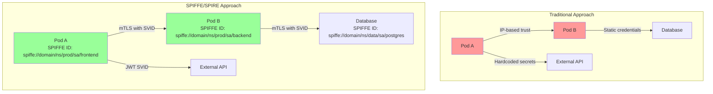
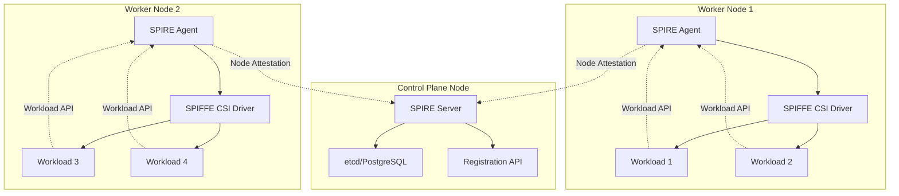

## Introduction: From VMs to Kubernetes-Native Zero Trust

In my previous post on [building a secure service mesh without Kubernetes](/secure-service-mesh-without-kubernetes), I demonstrated how to implement SPIFFE/SPIRE on traditional VMs. Today, we're taking that knowledge to the cloud-native world with a comprehensive guide to deploying SPIFFE/SPIRE natively on Kubernetes.

While the core concepts remain the same—cryptographic workload identities, attestation, and zero-trust networking—the Kubernetes implementation brings unique advantages: dynamic workload management, native integration with Kubernetes primitives, and seamless scaling. This guide bridges the gap between traditional infrastructure and cloud-native security.

## Why SPIFFE/SPIRE on Kubernetes?

Before diving into implementation, let's understand why SPIFFE/SPIRE has become the de facto standard for workload identity in Kubernetes:

### The Identity Challenge in Kubernetes



### Key Benefits

1. **Dynamic Identity Management**: Automatic identity issuance and rotation
2. **Platform Agnostic**: Works across clouds, on-premises, and hybrid environments
3. **Kubernetes Native**: Leverages Service Accounts, Namespaces, and other K8s primitives
4. **Zero Trust by Default**: No implicit trust based on network location
5. **Attestation Flexibility**: Multiple methods from K8s tokens to hardware TPMs

## Architecture Overview

Let's understand the SPIFFE/SPIRE architecture in a Kubernetes context:



### Core Components

1. **SPIRE Server**: Central authority that issues SPIFFE IDs and manages trust bundles
2. **SPIRE Agent**: Runs on each node, performs workload attestation
3. **SPIFFE CSI Driver**: Mounts the Workload API socket into pods
4. **Registration Entries**: Define which workloads get which identities

## Prerequisites

Before we begin, ensure you have:

```bash
# Kubernetes cluster (1.19+)
kubectl version --short

# Helm 3
helm version --short

# cert-manager (for TLS certificates)
kubectl apply -f https://github.com/cert-manager/cert-manager/releases/download/v1.13.3/cert-manager.yaml

# Verify cert-manager is ready
kubectl wait --for=condition=ready --timeout=300s -n cert-manager pod -l app.kubernetes.io/instance=cert-manager
```

## Step 1: Install SPIRE Using Helm

First, let's add the SPIFFE Helm repository and install SPIRE:

```bash
# Add SPIFFE Helm repository
helm repo add spiffe https://spiffe.github.io/helm-charts-hardened/
helm repo update

# Create namespace
kubectl create namespace spire-system

# Install SPIRE with production-ready configuration
cat <<EOF > spire-values.yaml
global:
  spire:
    # Your trust domain - change this!
    trustDomain: "prod.example.com"
    # Bundle endpoint for federation
    bundleEndpoint:
      address: "0.0.0.0"
      port: 8443

spire-server:
  # High availability configuration
  replicaCount: 1  # Increase for HA

  controllerManager:
    enabled: true

  nodeAttestor:
    k8sPsat:
      enabled: true

  dataStore:
    sql:
      databaseType: sqlite3
      connectionString: "/run/spire/data/datastore.sqlite3"

  # For production, use PostgreSQL:
  # dataStore:
  #   sql:
  #     databaseType: postgres
  #     connectionString: "dbname=spire user=spire host=postgres password=\${DBPASSWORD}"

  keyManager:
    disk:
      enabled: true

  upstreamAuthority:
    disk:
      enabled: true
      cert: "/run/spire/ca/ca.crt"
      key: "/run/spire/ca/ca.key"

  ca:
    subject:
      country: ["US"]
      organization: ["Example Corp"]
      commonName: "SPIRE Server CA"

spire-agent:
  # Run on all nodes
  nodeSelector: {}

  server:
    address: "spire-server.spire-system"
    port: 8081

  # Enable Workload API for all pods
  socketPath: "/run/spire/agent-sockets/spire-agent.sock"

  # Health checks
  healthChecks:
    enabled: true
    port: 9982

# SPIFFE CSI Driver
spiffe-csi-driver:
  enabled: true

# SPIFFE OIDC Discovery Provider
spiffe-oidc-discovery-provider:
  enabled: true

  config:
    domains:
      - "oidc-discovery.example.com"
EOF

# Install SPIRE
helm upgrade --install spire spiffe/spire \
  --namespace spire-system \
  --values spire-values.yaml \
  --wait
```

## Step 2: Verify SPIRE Installation

Let's verify that SPIRE is running correctly:

```bash
# Check pods
kubectl get pods -n spire-system

# Expected output:
# NAME                                READY   STATUS    RESTARTS   AGE
# spire-server-0                      2/2     Running   0          2m
# spire-agent-xxxxx                   1/1     Running   0          2m
# spiffe-csi-driver-xxxxx             1/1     Running   0          2m
# spiffe-oidc-discovery-provider-xxx  1/1     Running   0          2m

# Check SPIRE Server health
kubectl exec -n spire-system spire-server-0 -c spire-server -- \
  /opt/spire/bin/spire-server healthcheck

# Check SPIRE Agent health on a node
kubectl exec -n spire-system -it $(kubectl get pods -n spire-system -l app=spire-agent -o jsonpath='{.items[0].metadata.name}') -- \
  /opt/spire/bin/spire-agent healthcheck
```

## Step 3: Configure Workload Registration

Now let's register workloads. We'll use the Kubernetes Workload Registrar for automatic registration:

```yaml
# workload-registration.yaml
apiVersion: spire.spiffe.io/v1alpha1
kind: ClusterSPIFFEID
metadata:
  name: default-workloads
spec:
  # SPIFFE ID template
  spiffeIDTemplate: "spiffe://{{ .TrustDomain }}/ns/{{ .PodMeta.Namespace }}/sa/{{ .PodSpec.ServiceAccountName }}"

  # Pod selector
  podSelector:
    matchLabels:
      spiffe: "enabled"

  # Workload selector for the agent
  workloadSelectorTemplates:
    - "k8s:ns:{{ .PodMeta.Namespace }}"
    - "k8s:sa:{{ .PodSpec.ServiceAccountName }}"

  # Optional: DNS names for the SVID
  dnsNameTemplates:
    - "{{ .PodMeta.Name }}.{{ .PodMeta.Namespace }}.svc.cluster.local"

  # TTL for the SVID
  ttl: 3600
---
# More specific registration for critical workloads
apiVersion: spire.spiffe.io/v1alpha1
kind: ClusterSPIFFEID
metadata:
  name: database-workloads
spec:
  spiffeIDTemplate: "spiffe://{{ .TrustDomain }}/ns/{{ .PodMeta.Namespace }}/sa/{{ .PodSpec.ServiceAccountName }}/{{ .PodMeta.Name }}"

  namespaceSelector:
    matchNames:
      - "production"
      - "staging"

  podSelector:
    matchLabels:
      app: "postgresql"

  workloadSelectorTemplates:
    - "k8s:ns:{{ .PodMeta.Namespace }}"
    - "k8s:sa:{{ .PodSpec.ServiceAccountName }}"
    - "k8s:pod-name:{{ .PodMeta.Name }}"

  # Federates with these trust domains
  federatesWith:
    - "partner.example.com"
    - "cloud.example.com"
```

Apply the registration:

```bash
kubectl apply -f workload-registration.yaml
```

## Step 4: Deploy a Sample Application with SPIFFE Identity

Let's deploy a sample application that uses SPIFFE identities:

```yaml
# sample-app.yaml
apiVersion: v1
kind: ServiceAccount
metadata:
  name: frontend
  namespace: default
---
apiVersion: v1
kind: ServiceAccount
metadata:
  name: backend
  namespace: default
---
apiVersion: apps/v1
kind: Deployment
metadata:
  name: frontend
  namespace: default
spec:
  replicas: 1
  selector:
    matchLabels:
      app: frontend
  template:
    metadata:
      labels:
        app: frontend
        spiffe: enabled
    spec:
      serviceAccountName: frontend
      containers:
        - name: frontend
          image: spiffe/spire-examples:latest
          command: ["/opt/spire-examples/spiffe-workload"]
          env:
            - name: SPIFFE_ENDPOINT_SOCKET
              value: "unix:///spiffe-workload-api/spire-agent.sock"
          volumeMounts:
            - name: spiffe-workload-api
              mountPath: /spiffe-workload-api
              readOnly: true
      volumes:
        - name: spiffe-workload-api
          csi:
            driver: "csi.spiffe.io"
            readOnly: true
---
apiVersion: apps/v1
kind: Deployment
metadata:
  name: backend
  namespace: default
spec:
  replicas: 1
  selector:
    matchLabels:
      app: backend
  template:
    metadata:
      labels:
        app: backend
        spiffe: enabled
    spec:
      serviceAccountName: backend
      containers:
        - name: backend
          image: spiffe/spire-examples:latest
          command: ["/opt/spire-examples/spiffe-workload"]
          env:
            - name: SPIFFE_ENDPOINT_SOCKET
              value: "unix:///spiffe-workload-api/spire-agent.sock"
          volumeMounts:
            - name: spiffe-workload-api
              mountPath: /spiffe-workload-api
              readOnly: true
      volumes:
        - name: spiffe-workload-api
          csi:
            driver: "csi.spiffe.io"
            readOnly: true
```

Deploy the application:

```bash
kubectl apply -f sample-app.yaml

# Wait for pods to be ready
kubectl wait --for=condition=ready pod -l app=frontend --timeout=60s
kubectl wait --for=condition=ready pod -l app=backend --timeout=60s
```

## Step 5: Verify Workload Identity

Let's verify that our workloads have received their SPIFFE identities:

```bash
# Check frontend identity
kubectl exec -it $(kubectl get pod -l app=frontend -o jsonpath='{.items[0].metadata.name}') -- \
  /opt/spire-examples/spiffe-workload get-svid

# Expected output:
# SPIFFE ID: spiffe://prod.example.com/ns/default/sa/frontend
# SVID Valid After: 2025-01-27 10:00:00 +0000 UTC
# SVID Valid Until: 2025-01-27 11:00:00 +0000 UTC
# CA #1 Valid After: 2025-01-27 00:00:00 +0000 UTC
# CA #1 Valid Until: 2026-01-27 00:00:00 +0000 UTC

# Check backend identity
kubectl exec -it $(kubectl get pod -l app=backend -o jsonpath='{.items[0].metadata.name}') -- \
  /opt/spire-examples/spiffe-workload get-svid
```

## Step 6: Implement mTLS Between Workloads

Now let's implement mutual TLS between our workloads using SPIFFE identities:

```go
// mtls-client.go - Frontend calling Backend
package main

import (
    "context"
    "crypto/tls"
    "fmt"
    "io"
    "net/http"

    "github.com/spiffe/go-spiffe/v2/spiffeid"
    "github.com/spiffe/go-spiffe/v2/spiffetls"
    "github.com/spiffe/go-spiffe/v2/spiffetls/tlsconfig"
    "github.com/spiffe/go-spiffe/v2/workloadapi"
)

func main() {
    ctx := context.Background()

    // Create a Workload API client
    client, err := workloadapi.New(ctx, workloadapi.WithAddr("unix:///spiffe-workload-api/spire-agent.sock"))
    if err != nil {
        panic(err)
    }
    defer client.Close()

    // Create TLS config for mTLS
    backendID := spiffeid.Must("prod.example.com", "ns", "default", "sa", "backend")
    tlsConfig := tlsconfig.MTLSClientConfig(client, client, tlsconfig.AuthorizeID(backendID))

    // Create HTTP client with SPIFFE TLS
    httpClient := &http.Client{
        Transport: &http.Transport{
            TLSClientConfig: tlsConfig,
        },
    }

    // Make authenticated request
    resp, err := httpClient.Get("https://backend.default.svc.cluster.local:8443/api/data")
    if err != nil {
        panic(err)
    }
    defer resp.Body.Close()

    body, _ := io.ReadAll(resp.Body)
    fmt.Printf("Response: %s\n", body)
}
```

```go
// mtls-server.go - Backend server
package main

import (
    "context"
    "fmt"
    "net/http"

    "github.com/spiffe/go-spiffe/v2/spiffeid"
    "github.com/spiffe/go-spiffe/v2/spiffetls"
    "github.com/spiffe/go-spiffe/v2/spiffetls/tlsconfig"
    "github.com/spiffe/go-spiffe/v2/workloadapi"
)

func main() {
    ctx := context.Background()

    // Create Workload API client
    client, err := workloadapi.New(ctx, workloadapi.WithAddr("unix:///spiffe-workload-api/spire-agent.sock"))
    if err != nil {
        panic(err)
    }
    defer client.Close()

    // Create TLS config that only accepts frontend
    frontendID := spiffeid.Must("prod.example.com", "ns", "default", "sa", "frontend")
    tlsConfig := tlsconfig.MTLSServerConfig(client, client, tlsconfig.AuthorizeID(frontendID))

    // Create HTTPS server
    server := &http.Server{
        Addr:      ":8443",
        TLSConfig: tlsConfig,
        Handler: http.HandlerFunc(func(w http.ResponseWriter, r *http.Request) {
            // Extract peer identity
            if r.TLS != nil && len(r.TLS.PeerCertificates) > 0 {
                id, err := spiffeid.FromURI(r.TLS.PeerCertificates[0].URIs[0])
                if err == nil {
                    fmt.Fprintf(w, "Hello %s! Here's your secure data.\n", id)
                    return
                }
            }
            http.Error(w, "Unauthorized", http.StatusUnauthorized)
        }),
    }

    fmt.Println("Server listening on :8443...")
    if err := server.ListenAndServeTLS("", ""); err != nil {
        panic(err)
    }
}
```

## Step 7: Advanced Configuration

### High Availability Setup

For production environments, configure SPIRE Server for high availability:

```yaml
# ha-values.yaml
spire-server:
  replicaCount: 3

  dataStore:
    sql:
      databaseType: postgres
      connectionString: "host=postgres-ha.data.svc.cluster.local dbname=spire user=spire sslmode=require"

  notifier:
    k8sbundle:
      enabled: true
      namespace: "spire-system"

  # Anti-affinity for spreading across nodes
  affinity:
    podAntiAffinity:
      requiredDuringSchedulingIgnoredDuringExecution:
        - labelSelector:
            matchExpressions:
              - key: app
                operator: In
                values:
                  - spire-server
          topologyKey: kubernetes.io/hostname
```

### Federation Configuration

To enable federation between trust domains:

```yaml
# federation-config.yaml
apiVersion: v1
kind: ConfigMap
metadata:
  name: spire-federation
  namespace: spire-system
data:
  federation.conf: |
    federates_with {
      "partner.example.com" {
        bundle_endpoint_address = "spire-bundle.partner.example.com"
        bundle_endpoint_port = 8443
        bundle_endpoint_spiffe_id = "spiffe://partner.example.com/spire/server"
      }
    }
```

### Custom Node Attestor

For cloud environments, use platform-specific attestors:

```yaml
# AWS node attestor
spire-server:
  nodeAttestor:
    aws_iid:
      enabled: true
      access_key_id: "${AWS_ACCESS_KEY_ID}"
      secret_access_key: "${AWS_SECRET_ACCESS_KEY}"
      skip_block_device: true

spire-agent:
  nodeAttestor:
    aws_iid:
      enabled: true

# GCP node attestor
spire-server:
  nodeAttestor:
    gcp_iit:
      enabled: true
      projectid_allow_list: ["my-project-1", "my-project-2"]

spire-agent:
  nodeAttestor:
    gcp_iit:
      enabled: true
```

## Step 8: Integration with Service Mesh

### Istio Integration

To use SPIRE as Istio's certificate provider:

```bash
# Install Istio with custom CA
istioctl install --set values.pilot.env.EXTERNAL_CA=ISTIOD_RA_KUBERNETES_API \
  --set values.global.caAddress=spire-server.spire-system.svc:8081 \
  --set values.global.meshID=spiffe://prod.example.com \
  --set values.pilot.env.PILOT_ENABLE_WORKLOAD_ENTRY_AUTOREGISTRATION=true
```

### Linkerd Integration

For Linkerd, configure the identity issuer:

```yaml
# linkerd-identity-issuer.yaml
apiVersion: cert-manager.io/v1
kind: Certificate
metadata:
  name: linkerd-identity-issuer
  namespace: linkerd
spec:
  secretName: linkerd-identity-issuer
  duration: 48h
  renewBefore: 25h
  issuerRef:
    name: spire-ca
    kind: ClusterIssuer
  commonName: identity.linkerd.cluster.local
  dnsNames:
    - identity.linkerd.cluster.local
  isCA: true
  privateKey:
    algorithm: ECDSA
  usages:
    - cert sign
    - crl sign
    - server auth
    - client auth
```

## Step 9: Monitoring and Observability

Configure Prometheus metrics for SPIRE:

```yaml
# prometheus-scrape-config.yaml
apiVersion: v1
kind: ConfigMap
metadata:
  name: prometheus-config
  namespace: monitoring
data:
  prometheus.yml: |
    scrape_configs:
    - job_name: 'spire-server'
      static_configs:
      - targets: ['spire-server.spire-system:9988']
      metric_relabel_configs:
      - source_labels: [__name__]
        regex: 'spire_server_.*'
        action: keep
        
    - job_name: 'spire-agent'
      kubernetes_sd_configs:
      - role: pod
        namespaces:
          names: ['spire-system']
      relabel_configs:
      - source_labels: [__meta_kubernetes_pod_label_app]
        regex: spire-agent
        action: keep
      - source_labels: [__meta_kubernetes_pod_ip]
        target_label: __address__
        replacement: '${1}:9988'
```

## Step 10: Production Best Practices

### Security Hardening

1. **Network Policies**: Restrict SPIRE Server access

```yaml
apiVersion: networking.k8s.io/v1
kind: NetworkPolicy
metadata:
  name: spire-server-ingress
  namespace: spire-system
spec:
  podSelector:
    matchLabels:
      app: spire-server
  policyTypes:
    - Ingress
  ingress:
    - from:
        - namespaceSelector:
            matchLabels:
              name: spire-system
        - podSelector:
            matchLabels:
              app: spire-agent
      ports:
        - protocol: TCP
          port: 8081
```

2. **RBAC Configuration**: Limit SPIRE permissions

```yaml
apiVersion: rbac.authorization.k8s.io/v1
kind: ClusterRole
metadata:
  name: spire-server-limited
rules:
  - apiGroups: [""]
    resources: ["nodes", "pods"]
    verbs: ["get", "list", "watch"]
  - apiGroups: ["authentication.k8s.io"]
    resources: ["tokenreviews"]
    verbs: ["create"]
```

### Performance Tuning

```yaml
# performance-tuning.yaml
spire-server:
  resources:
    requests:
      memory: "512Mi"
      cpu: "100m"
    limits:
      memory: "2Gi"
      cpu: "1000m"

  # Cache configuration
  config:
    server:
      cache_size: 10000

spire-agent:
  resources:
    requests:
      memory: "128Mi"
      cpu: "50m"
    limits:
      memory: "512Mi"
      cpu: "500m"

  # Sync interval optimization
  config:
    agent:
      sync_interval: "10s"
```

## Troubleshooting Common Issues

### Issue 1: Workload Not Receiving SVID

```bash
# Check registration entries
kubectl exec -n spire-system spire-server-0 -c spire-server -- \
  /opt/spire/bin/spire-server entry list

# Check agent logs
kubectl logs -n spire-system $(kubectl get pods -n spire-system -l app=spire-agent -o jsonpath='{.items[0].metadata.name}')

# Verify CSI driver
kubectl get csidriver csi.spiffe.io
kubectl get csinodes
```

### Issue 2: Federation Not Working

```bash
# Check bundle endpoint
kubectl exec -n spire-system spire-server-0 -c spire-server -- \
  /opt/spire/bin/spire-server bundle show -format spiffe

# Test bundle endpoint connectivity
kubectl exec -n spire-system spire-server-0 -c spire-server -- \
  curl -k https://localhost:8443/bundle
```

### Issue 3: Performance Issues

```bash
# Check metrics
kubectl exec -n spire-system spire-server-0 -c spire-server -- \
  curl -s localhost:9988/metrics | grep spire_server_

# Analyze datastore performance
kubectl exec -n spire-system spire-server-0 -c spire-server -- \
  /opt/spire/bin/spire-server entry count
```

## Migration from VM-Based SPIRE

If you're migrating from my [VM-based SPIFFE/SPIRE setup](/secure-service-mesh-without-kubernetes), here are the key differences:

1. **Node Attestation**: Use Kubernetes PSAT instead of join tokens
2. **Workload Attestation**: Kubernetes selectors instead of Unix selectors
3. **Registration**: Automatic via CRDs instead of manual CLI
4. **Scaling**: Horizontal pod autoscaling instead of manual node addition
5. **Storage**: Consider managed databases instead of local SQLite

Migration checklist:

- [ ] Export existing registration entries
- [ ] Update SPIFFE ID structure for Kubernetes namespaces
- [ ] Migrate trust bundles if keeping the same trust domain
- [ ] Update workload code to use CSI driver paths
- [ ] Test federation with existing infrastructure

## Conclusion and Next Steps

You now have a production-ready SPIFFE/SPIRE deployment on Kubernetes that provides:

- ✅ Cryptographic workload identities
- ✅ Automatic certificate rotation
- ✅ Zero-trust pod-to-pod communication
- ✅ Integration with Kubernetes primitives
- ✅ Foundation for service mesh adoption

In upcoming posts, we'll explore:

- Deep dive into SPIRE Controller Manager and CRDs
- Multi-cluster federation patterns
- Advanced attestation with TPM and cloud providers
- Performance optimization for large-scale deployments
- Integration with Istio and Linkerd service meshes

The journey from traditional PKI to cloud-native workload identity is complete. Your Kubernetes cluster now has a robust, scalable, and secure identity foundation ready for zero-trust networking.

## Additional Resources

- [Official SPIFFE Documentation](https://spiffe.io/docs/latest/)
- [SPIRE Helm Charts](https://github.com/spiffe/helm-charts-hardened)
- [SPIFFE Examples](https://github.com/spiffe/spire-examples)
- [My VM-Based SPIFFE/SPIRE Guide](/secure-service-mesh-without-kubernetes)

---

_Have questions or ran into issues? Feel free to reach out or check the [SPIFFE Slack community](https://spiffe.slack.com) for help._
