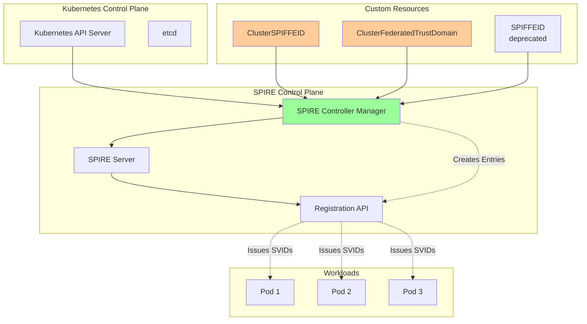

## Introduction: The Missing Piece in SPIFFE/SPIRE Documentation

After deploying SPIFFE/SPIRE on Kubernetes, you might have noticed a glaring gap in the ecosystem: comprehensive documentation for the SPIRE Controller Manager and its Custom Resource Definitions (CRDs). While the official docs provide basic examples, they barely scratch the surface of what's possible with these powerful Kubernetes-native tools.

In this deep dive, we'll explore every aspect of the SPIRE Controller Manager, from basic ClusterSPIFFEID resources to advanced federation patterns, templating strategies, and production-grade implementations. This is the guide I wish existed when I first started working with SPIRE CRDs.

## Understanding SPIRE Controller Manager Architecture

Before diving into CRDs, let's understand how the SPIRE Controller Manager fits into the overall architecture:



### Key Components

1. **SPIRE Controller Manager**: A Kubernetes controller that watches for CRD changes and reconciles them with SPIRE Server
2. **ClusterSPIFFEID**: Cluster-wide resource for registering workloads
3. **ClusterFederatedTrustDomain**: Manages federation relationships
4. **SPIFFEID**: Namespace-scoped resource (deprecated but still supported)

## Installation and Setup

First, ensure the SPIRE Controller Manager is properly installed:

```bash
# Check if controller manager is enabled in your Helm values
helm get values spire -n spire-system | grep controllerManager

# If not enabled, update your values:
cat <<EOF > controller-manager-values.yaml
spire-server:
  controllerManager:
    enabled: true
    resources:
      requests:
        cpu: 100m
        memory: 128Mi
      limits:
        cpu: 200m
        memory: 256Mi

    # Important: Controller Manager identity
    identities:
      clusterSPIFFEIDs:
        default:
          enabled: true

    # Configure which CRDs to install
    installAndUpgradeCRDs: true
    deleteWebhookConfigurationOnDelete: true

    # Webhook configuration for validation
    validatingWebhookConfiguration:
      enabled: true
EOF

# Upgrade SPIRE with controller manager enabled
helm upgrade spire spiffe/spire \
  -n spire-system \
  -f controller-manager-values.yaml
```

Verify the installation:

```bash
# Check CRDs are installed
kubectl get crd | grep spiffe

# Expected output:
# clusterfederatedtrustdomains.spire.spiffe.io
# clusterspiffeids.spire.spiffe.io
# spiffeids.spire.spiffe.io

# Check controller manager is running
kubectl get pods -n spire-system -l component=controller-manager
```

## ClusterSPIFFEID: The Foundation of Workload Registration

### Basic ClusterSPIFFEID

Let's start with a simple example:

```yaml
apiVersion: spire.spiffe.io/v1alpha1
kind: ClusterSPIFFEID
metadata:
  name: basic-workload
spec:
  # SPIFFE ID template - supports Go templating
  spiffeIDTemplate: "spiffe://{{ .TrustDomain }}/ns/{{ .PodMeta.Namespace }}/sa/{{ .PodSpec.ServiceAccountName }}"

  # Select pods by labels
  podSelector:
    matchLabels:
      app: my-app

  # Workload selectors for SPIRE agent
  workloadSelectorTemplates:
    - "k8s:ns:{{ .PodMeta.Namespace }}"
    - "k8s:sa:{{ .PodSpec.ServiceAccountName }}"
```

### Advanced Templating

The real power comes from advanced templating. Here's what's available:

```yaml
apiVersion: spire.spiffe.io/v1alpha1
kind: ClusterSPIFFEID
metadata:
  name: advanced-templating
spec:
  # All available template variables
  spiffeIDTemplate: |
    spiffe://{{ .TrustDomain }}/
    region/{{ .PodMeta.Annotations.region | default "us-east-1" }}/
    cluster/{{ .PodMeta.Labels.cluster | default "primary" }}/
    ns/{{ .PodMeta.Namespace }}/
    sa/{{ .PodSpec.ServiceAccountName }}/
    pod/{{ .PodMeta.Name }}/
    node/{{ .PodSpec.NodeName }}

  # Complex pod selection
  podSelector:
    matchExpressions:
      - key: environment
        operator: In
        values: ["production", "staging"]
      - key: security-scan
        operator: NotIn
        values: ["failed"]

  # Namespace selection
  namespaceSelector:
    matchLabels:
      team: platform
    matchExpressions:
      - key: compliance
        operator: Exists

  # Advanced workload selectors
  workloadSelectorTemplates:
    - "k8s:ns:{{ .PodMeta.Namespace }}"
    - "k8s:sa:{{ .PodSpec.ServiceAccountName }}"
    - "k8s:pod-label:app:{{ .PodMeta.Labels.app }}"
    - "k8s:pod-label:version:{{ .PodMeta.Labels.version }}"
    {{- if .PodMeta.Labels.region }}
    - "k8s:pod-label:region:{{ .PodMeta.Labels.region }}"
    {{- end }}

  # DNS names for the certificate
  dnsNameTemplates:
    - "{{ .PodMeta.Name }}.{{ .PodMeta.Namespace }}.svc.cluster.local"
    - "{{ .PodMeta.Name }}.{{ .PodMeta.Namespace }}.svc"
    - "{{ .PodMeta.Name }}.{{ .PodMeta.Namespace }}"
    {{- range .PodSpec.Containers }}
    {{- range .Ports }}
    - "{{ $.PodMeta.Name }}-{{ .ContainerPort }}.{{ $.PodMeta.Namespace }}.svc.cluster.local"
    {{- end }}
    {{- end }}

  # TTL for the SVID (in seconds)
  ttl: 3600

  # JWT SVID TTL (optional, different from X.509)
  jwtSvidTTL: 300

  # Federation
  federatesWith:
    - "partner.example.com"
    - "cloud.example.com"

  # Admin flag - grants access to SPIRE Server API
  admin: false

  # Downstream flag - for nested SPIRE deployments
  downstream: false

  # Entry expiry time (Unix timestamp)
  # entryExpiry: 1735689600
```

### Template Functions and Advanced Logic

SPIRE Controller Manager supports Go template functions:

```yaml
apiVersion: spire.spiffe.io/v1alpha1
kind: ClusterSPIFFEID
metadata:
  name: template-functions
spec:
  spiffeIDTemplate: |
    {{- $ns := .PodMeta.Namespace -}}
    {{- $sa := .PodSpec.ServiceAccountName -}}
    {{- if eq $ns "production" -}}
    spiffe://{{ .TrustDomain }}/prod/{{ $sa }}
    {{- else if eq $ns "staging" -}}
    spiffe://{{ .TrustDomain }}/staging/{{ $sa }}
    {{- else -}}
    spiffe://{{ .TrustDomain }}/dev/{{ $ns }}/{{ $sa }}
    {{- end -}}

  # Using default values
  dnsNameTemplates:
    - "{{ .PodMeta.Labels.service | default .PodMeta.Name }}.{{ .PodMeta.Namespace }}.svc.cluster.local"

  # String manipulation
  workloadSelectorTemplates:
    - "k8s:ns:{{ .PodMeta.Namespace }}"
    - "k8s:sa:{{ .PodSpec.ServiceAccountName }}"
    # Convert to uppercase
    - "k8s:env:{{ .PodMeta.Labels.environment | upper }}"
    # Replace characters
    - 'k8s:app:{{ .PodMeta.Labels.app | replace "-" "_" }}'
```

## Real-World Use Cases

### 1. Multi-Tenant SaaS Platform

```yaml
apiVersion: spire.spiffe.io/v1alpha1
kind: ClusterSPIFFEID
metadata:
  name: saas-tenant-workloads
spec:
  # Include tenant ID in SPIFFE ID
  spiffeIDTemplate: |
    spiffe://{{ .TrustDomain }}/
    tenant/{{ required "Missing tenant label" .PodMeta.Labels.tenant }}/
    service/{{ required "Missing service label" .PodMeta.Labels.service }}/
    version/{{ .PodMeta.Labels.version | default "v1" }}

  # Only pods with tenant label
  podSelector:
    matchExpressions:
      - key: tenant
        operator: Exists
      - key: service
        operator: Exists

  namespaceSelector:
    matchLabels:
      purpose: tenant-workloads

  workloadSelectorTemplates:
    - "k8s:ns:{{ .PodMeta.Namespace }}"
    - "k8s:sa:{{ .PodSpec.ServiceAccountName }}"
    - "k8s:tenant:{{ .PodMeta.Labels.tenant }}"
    - "k8s:service:{{ .PodMeta.Labels.service }}"

  # Tenant-specific DNS names
  dnsNameTemplates:
    - "{{ .PodMeta.Labels.service }}.{{ .PodMeta.Labels.tenant }}.{{ .PodMeta.Namespace }}.svc.cluster.local"
    - "{{ .PodMeta.Labels.service }}.{{ .PodMeta.Labels.tenant }}.internal"

  # Federate with customer environments
  federatesWith:
    - "customer1.example.com"
    - "customer2.example.com"
```

### 2. Microservices with Versioning

```yaml
apiVersion: spire.spiffe.io/v1alpha1
kind: ClusterSPIFFEID
metadata:
  name: versioned-microservices
spec:
  spiffeIDTemplate: |
    {{- $service := required "service label required" .PodMeta.Labels.service -}}
    {{- $version := required "version label required" .PodMeta.Labels.version -}}
    {{- $env := .PodMeta.Namespace -}}
    spiffe://{{ .TrustDomain }}/env/{{ $env }}/svc/{{ $service }}/{{ $version }}

  podSelector:
    matchExpressions:
      - key: service
        operator: Exists
      - key: version
        operator: Exists
      - key: canary
        operator: DoesNotExist  # Exclude canary deployments

  workloadSelectorTemplates:
    - "k8s:ns:{{ .PodMeta.Namespace }}"
    - "k8s:service:{{ .PodMeta.Labels.service }}"
    - "k8s:version:{{ .PodMeta.Labels.version }}"
    {{- if .PodMeta.Labels.feature }}
    - "k8s:feature:{{ .PodMeta.Labels.feature }}"
    {{- end }}

  # Version-specific DNS
  dnsNameTemplates:
    - "{{ .PodMeta.Labels.service }}-{{ .PodMeta.Labels.version }}.{{ .PodMeta.Namespace }}.svc.cluster.local"
    - "{{ .PodMeta.Labels.service }}.{{ .PodMeta.Namespace }}.svc.cluster.local"  # Also respond to non-versioned
```

### 3. Database Workloads with Special Permissions

```yaml
apiVersion: spire.spiffe.io/v1alpha1
kind: ClusterSPIFFEID
metadata:
  name: database-workloads
spec:
  spiffeIDTemplate: |
    spiffe://{{ .TrustDomain }}/db/{{ .PodMeta.Labels.database }}/{{ .PodMeta.Labels.role | default "replica" }}

  podSelector:
    matchLabels:
      component: database

  workloadSelectorTemplates:
    - "k8s:ns:{{ .PodMeta.Namespace }}"
    - "k8s:sa:{{ .PodSpec.ServiceAccountName }}"
    - "k8s:statefulset:{{ .PodMeta.OwnerReferences[0].Name }}"

  # Longer TTL for stable database workloads
  ttl: 86400 # 24 hours

  # Admin access for primary database
  admin: |
    {{- if eq (.PodMeta.Labels.role | default "replica") "primary" -}}
    true
    {{- else -}}
    false
    {{- end -}}
```

## ClusterFederatedTrustDomain: Managing Federation

Federation allows workloads from different trust domains to authenticate with each other:

```yaml
apiVersion: spire.spiffe.io/v1alpha1
kind: ClusterFederatedTrustDomain
metadata:
  name: partner-federation
spec:
  # The trust domain to federate with
  trustDomain: "partner.example.com"

  # Bundle endpoint URL of the foreign trust domain
  bundleEndpointURL: "https://spire-bundle.partner.example.com:8443"

  # How to authenticate to the bundle endpoint
  bundleEndpointProfile:
    # Option 1: Web PKI (HTTPS)
    type: "https_web"

    # Option 2: SPIFFE authentication
    # type: "https_spiffe"
    # endpointSPIFFEID: "spiffe://partner.example.com/spire/server"

  # Trust domain bundle (optional - for bootstrap)
  # trustDomainBundle: |
  #   -----BEGIN CERTIFICATE-----
  #   ...
  #   -----END CERTIFICATE-----
```

### Advanced Federation Scenarios

#### Multi-Cloud Federation

```yaml
# AWS Federation
apiVersion: spire.spiffe.io/v1alpha1
kind: ClusterFederatedTrustDomain
metadata:
  name: aws-federation
spec:
  trustDomain: "aws.company.com"
  bundleEndpointURL: "https://spire.us-east-1.aws.company.com:8443"
  bundleEndpointProfile:
    type: "https_web"
---
# GCP Federation
apiVersion: spire.spiffe.io/v1alpha1
kind: ClusterFederatedTrustDomain
metadata:
  name: gcp-federation
spec:
  trustDomain: "gcp.company.com"
  bundleEndpointURL: "https://spire.us-central1.gcp.company.com:8443"
  bundleEndpointProfile:
    type: "https_spiffe"
    endpointSPIFFEID: "spiffe://gcp.company.com/spire/server"
---
# On-Premises Federation
apiVersion: spire.spiffe.io/v1alpha1
kind: ClusterFederatedTrustDomain
metadata:
  name: onprem-federation
spec:
  trustDomain: "onprem.company.com"
  bundleEndpointURL: "https://spire.datacenter.company.com:8443"
  bundleEndpointProfile:
    type: "https_web"
```

#### Partner Ecosystem Federation

```yaml
# Customer federation with bootstrap bundle
apiVersion: spire.spiffe.io/v1alpha1
kind: ClusterFederatedTrustDomain
metadata:
  name: customer-acme-federation
spec:
  trustDomain: "acme.customer.com"
  bundleEndpointURL: "https://spire.acme.customer.com:8443"
  bundleEndpointProfile:
    type: "https_spiffe"
    endpointSPIFFEID: "spiffe://acme.customer.com/spire/server"
  # Bootstrap bundle for initial trust
  trustDomainBundle: |
    -----BEGIN CERTIFICATE-----
    MIIDQTCCAimgAwIBAgIUAAAAAAAAAAAAAAAAAAAAAIwDQYJKoZIhvcNAQEL
    ... (customer root CA cert) ...
    -----END CERTIFICATE-----
```

## Production Patterns and Best Practices

### 1. Hierarchical SPIFFE ID Structure

```yaml
apiVersion: spire.spiffe.io/v1alpha1
kind: ClusterSPIFFEID
metadata:
  name: hierarchical-structure
spec:
  spiffeIDTemplate: |
    {{- $region := .PodMeta.Labels.region | default "global" -}}
    {{- $env := .PodMeta.Labels.environment | default "dev" -}}
    {{- $team := .PodMeta.Labels.team | default "platform" -}}
    {{- $service := required "service label required" .PodMeta.Labels.service -}}
    spiffe://{{ .TrustDomain }}/{{ $region }}/{{ $env }}/{{ $team }}/{{ $service }}
```

### 2. Canary Deployments

```yaml
# Separate registration for canary workloads
apiVersion: spire.spiffe.io/v1alpha1
kind: ClusterSPIFFEID
metadata:
  name: canary-workloads
spec:
  spiffeIDTemplate: |
    spiffe://{{ .TrustDomain }}/canary/{{ .PodMeta.Labels.service }}/{{ .PodMeta.Labels.version }}

  podSelector:
    matchLabels:
      deployment: canary

  # Shorter TTL for canary deployments
  ttl: 900 # 15 minutes

  # Different workload selectors for monitoring
  workloadSelectorTemplates:
    - "k8s:deployment:canary"
    - "k8s:service:{{ .PodMeta.Labels.service }}"
    - "k8s:version:{{ .PodMeta.Labels.version }}"
```

### 3. Emergency Access Patterns

```yaml
apiVersion: spire.spiffe.io/v1alpha1
kind: ClusterSPIFFEID
metadata:
  name: emergency-access
spec:
  spiffeIDTemplate: |
    spiffe://{{ .TrustDomain }}/emergency/{{ .PodSpec.ServiceAccountName }}

  podSelector:
    matchLabels:
      access-level: emergency

  # Very short TTL
  ttl: 300 # 5 minutes

  # Admin access for emergency pods
  admin: true

  # Specific namespace only
  namespaceSelector:
    matchNames:
      - emergency-access
```

## Debugging and Troubleshooting

### Common Issues and Solutions

#### 1. Templates Not Rendering

```bash
# Check controller manager logs
kubectl logs -n spire-system -l component=controller-manager

# Common template errors:
# - Missing required fields
# - Invalid template syntax
# - Nil pointer references

# Debug template rendering
kubectl get clusterspiffeid <name> -o yaml | kubectl neat
```

#### 2. Workloads Not Getting Identities

```bash
# Check if entries are created in SPIRE
kubectl exec -n spire-system spire-server-0 -c spire-server -- \
  /opt/spire/bin/spire-server entry list -selector k8s:ns:default

# Check pod labels match selector
kubectl get pod <pod-name> --show-labels

# Verify namespace labels
kubectl get ns <namespace> --show-labels
```

#### 3. Federation Not Working

```bash
# Check federation status
kubectl get clusterfederatedtrustdomain -o wide

# Verify bundle endpoint connectivity
kubectl exec -n spire-system spire-server-0 -c spire-server -- \
  curl -v https://<bundle-endpoint>:8443

# Check SPIRE server logs for federation errors
kubectl logs -n spire-system spire-server-0 -c spire-server | grep federation
```

### Validation Webhook Issues

The controller manager includes a validating webhook that can block invalid resources:

```yaml
# Temporarily disable webhook for debugging
apiVersion: v1
kind: ValidatingWebhookConfiguration
metadata:
  name: spire-controller-manager-webhook
webhooks:
  - name: clusterspiffeid.spire.spiffe.io
    failurePolicy: Ignore # Change from Fail to Ignore
```

## Advanced Controller Manager Configuration

### Custom Controller Settings

```yaml
apiVersion: v1
kind: ConfigMap
metadata:
  name: spire-controller-manager-config
  namespace: spire-system
data:
  controller-manager-config.yaml: |
    apiVersion: spire.spiffe.io/v1alpha1
    kind: ControllerManagerConfig

    # Reconciliation settings
    reconcileInterval: 30s

    # Leader election
    leaderElection:
      enabled: true
      namespace: spire-system
      
    # Metrics
    metrics:
      bindAddress: ":8080"
      
    # Health probes
    health:
      healthProbeBindAddress: ":8081"
      
    # Webhook settings
    webhook:
      port: 9443
      
    # Ignore certain namespaces
    ignoreNamespaces:
      - kube-system
      - kube-public
      - kube-node-lease
```

### Performance Tuning

```yaml
# For large clusters with many ClusterSPIFFEIDs
apiVersion: spire.spiffe.io/v1alpha1
kind: ClusterSPIFFEID
metadata:
  name: performance-optimized
  annotations:
    # Reduce reconciliation frequency
    spiffe.io/reconcile-interval: "5m"
spec:
  # Use specific selectors to reduce watch overhead
  podSelector:
    matchLabels:
      spiffe-managed: "true"

  # Limit namespace scope
  namespaceSelector:
    matchExpressions:
      - key: name
        operator: NotIn
        values: ["kube-system", "kube-public"]
```

## Integration with GitOps

### ArgoCD Integration

```yaml
# Application definition for SPIFFE IDs
apiVersion: argoproj.io/v1alpha1
kind: Application
metadata:
  name: spiffe-identities
  namespace: argocd
spec:
  source:
    repoURL: https://github.com/company/spiffe-config
    path: identities/
    targetRevision: main
  destination:
    server: https://kubernetes.default.svc
  syncPolicy:
    automated:
      prune: true
      selfHeal: true
    syncOptions:
      # Important: ServerSideApply for CRDs
      - ServerSideApply=true
```

### Flux Integration

```yaml
apiVersion: kustomize.toolkit.fluxcd.io/v1
kind: Kustomization
metadata:
  name: spiffe-identities
  namespace: flux-system
spec:
  interval: 5m
  path: ./clusters/production/spiffe
  prune: true
  sourceRef:
    kind: GitRepository
    name: flux-system
  # Ensure CRDs are applied first
  dependsOn:
    - name: spire-crds
```

## Security Considerations

### RBAC for ClusterSPIFFEID Management

```yaml
# Role for managing ClusterSPIFFEIDs
apiVersion: rbac.authorization.k8s.io/v1
kind: ClusterRole
metadata:
  name: spiffeid-manager
rules:
  - apiGroups: ["spire.spiffe.io"]
    resources: ["clusterspiffeids"]
    verbs: ["get", "list", "watch", "create", "update", "patch"]
  - apiGroups: ["spire.spiffe.io"]
    resources: ["clusterfederatedtrustdomains"]
    verbs: ["get", "list", "watch"]
---
# Restrict who can create admin ClusterSPIFFEIDs
apiVersion: rbac.authorization.k8s.io/v1
kind: ClusterRole
metadata:
  name: spiffeid-admin-manager
rules:
  - apiGroups: ["spire.spiffe.io"]
    resources: ["clusterspiffeids"]
    verbs: ["get", "list", "watch", "create", "update", "patch", "delete"]
    # Note: No resource-level restrictions on admin field
```

### Policy Enforcement with OPA

```rego
# policy.rego - Enforce ClusterSPIFFEID policies
package spiffe.clusterspiffeid

import future.keywords.contains
import future.keywords.if

# Deny admin ClusterSPIFFEIDs in non-admin namespaces
deny[msg] {
    input.request.kind.kind == "ClusterSPIFFEID"
    input.request.object.spec.admin == true
    not input.request.object.spec.namespaceSelector.matchNames[_] == "spire-admin"
    msg := "Admin ClusterSPIFFEIDs must target only spire-admin namespace"
}

# Enforce naming conventions
deny[msg] {
    input.request.kind.kind == "ClusterSPIFFEID"
    not regex.match("^[a-z0-9]([-a-z0-9]*[a-z0-9])?$", input.request.object.metadata.name)
    msg := "ClusterSPIFFEID names must follow DNS subdomain format"
}

# Limit TTL values
deny[msg] {
    input.request.kind.kind == "ClusterSPIFFEID"
    input.request.object.spec.ttl > 86400  # 24 hours
    msg := "TTL cannot exceed 24 hours"
}
```

## Monitoring and Observability

### Metrics for ClusterSPIFFEIDs

```yaml
# ServiceMonitor for controller manager metrics
apiVersion: monitoring.coreos.com/v1
kind: ServiceMonitor
metadata:
  name: spire-controller-manager
  namespace: spire-system
spec:
  selector:
    matchLabels:
      app: spire-controller-manager
  endpoints:
    - port: metrics
      interval: 30s
      path: /metrics
```

### Useful Metrics to Track

```promql
# Number of ClusterSPIFFEIDs
count(kube_customresource_clusterspiffeid_info)

# Failed reconciliations
rate(controller_runtime_reconcile_errors_total{controller="clusterspiffeid"}[5m])

# Reconciliation duration
histogram_quantile(0.99,
  rate(controller_runtime_reconcile_duration_seconds_bucket{controller="clusterspiffeid"}[5m])
)

# Webhook rejection rate
rate(controller_runtime_webhook_rejections_total[5m])
```

## Migration Strategies

### From Manual Entry Registration to CRDs

```bash
#!/bin/bash
# Export existing entries
kubectl exec -n spire-system spire-server-0 -c spire-server -- \
  /opt/spire/bin/spire-server entry list -format json > entries.json

# Convert to ClusterSPIFFEID format
cat entries.json | jq -r '.entries[] |
{
  apiVersion: "spire.spiffe.io/v1alpha1",
  kind: "ClusterSPIFFEID",
  metadata: {
    name: ("imported-" + .id)
  },
  spec: {
    spiffeIDTemplate: .spiffe_id,
    workloadSelectorTemplates: [.selectors[].value],
    ttl: .ttl
  }
}' > imported-entries.yaml
```

### From SPIFFEID to ClusterSPIFFEID

```yaml
# Before: Namespace-scoped SPIFFEID
apiVersion: spire.spiffe.io/v1alpha1
kind: SPIFFEID
metadata:
  name: old-workload
  namespace: default
spec:
  spiffeId: "spiffe://example.org/ns/default/sa/my-service"
  parentId: "spiffe://example.org/node/example"
  selector:
    namespace: default
    serviceAccount: my-service
---
# After: Cluster-scoped ClusterSPIFFEID
apiVersion: spire.spiffe.io/v1alpha1
kind: ClusterSPIFFEID
metadata:
  name: new-workload
spec:
  spiffeIDTemplate: "spiffe://{{ .TrustDomain }}/ns/{{ .PodMeta.Namespace }}/sa/{{ .PodSpec.ServiceAccountName }}"
  namespaceSelector:
    matchNames: ["default"]
  podSelector:
    matchLabels:
      serviceAccount: my-service
  workloadSelectorTemplates:
    - "k8s:ns:{{ .PodMeta.Namespace }}"
    - "k8s:sa:{{ .PodSpec.ServiceAccountName }}"
```

## Future-Proofing Your Implementation

### Upcoming Features and Preparation

```yaml
# Prepare for future features
apiVersion: spire.spiffe.io/v1alpha1
kind: ClusterSPIFFEID
metadata:
  name: future-ready
  annotations:
    # Future: Automatic rotation policies
    spiffe.io/rotation-policy: "auto"
    # Future: Priority classes
    spiffe.io/priority-class: "critical"
    # Future: Topology awareness
    spiffe.io/topology-key: "topology.kubernetes.io/zone"
spec:
  spiffeIDTemplate: "spiffe://{{ .TrustDomain }}/workload/{{ .PodMeta.UID }}"

  # Future: Conditional federation
  # federatesWithTemplate:
  #   - "{{ if eq .PodMeta.Labels.external \"true\" }}partner.com{{ end }}"

  # Future: Dynamic TTL based on workload
  # ttlTemplate: "{{ if eq .PodMeta.Labels.critical \"true\" }}3600{{ else }}7200{{ end }}"
```

## Conclusion

The SPIRE Controller Manager and its CRDs transform SPIFFE/SPIRE from a powerful but manual system into a truly Kubernetes-native identity platform. By mastering ClusterSPIFFEID and ClusterFederatedTrustDomain resources, you can:

- ✅ Automate workload registration at scale
- ✅ Implement complex identity hierarchies
- ✅ Manage multi-cloud federation declaratively
- ✅ Integrate with GitOps workflows
- ✅ Build production-grade zero-trust architectures

This deep dive has covered everything from basic usage to advanced patterns, but the real power comes from applying these concepts to your specific use cases. Start simple with basic ClusterSPIFFEID resources, then gradually add complexity as your understanding and requirements grow.

In the next post, we'll explore how to implement end-to-end mTLS between pods using these identities, including integration with service meshes and advanced traffic policies based on SPIFFE IDs.

## Additional Resources

- [SPIRE Controller Manager Source Code](https://github.com/spiffe/spire-controller-manager)
- [CRD API Reference](https://github.com/spiffe/spire-controller-manager/tree/main/docs)
- [SPIFFE Slack #spire-controller-manager](https://spiffe.slack.com)

---

_Found an issue or have a question? The SPIRE Controller Manager is actively developed, and the community is very responsive to feedback and feature requests._
