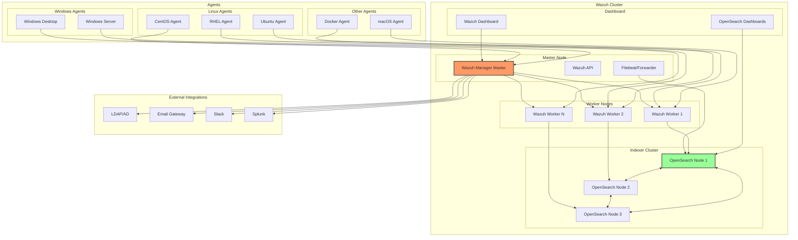
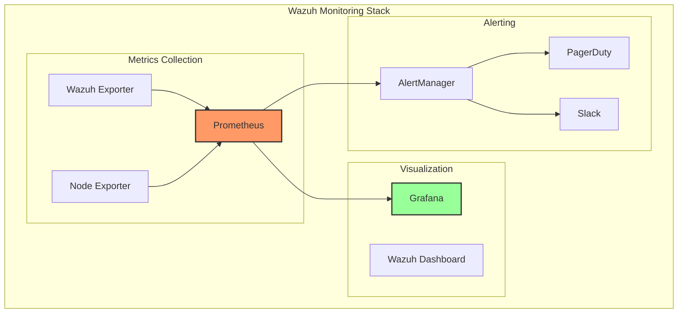

# Wazuh Ansible Deployment

Deploying Wazuh at scale requires robust automation to ensure consistency, repeatability, and efficient management. This guide provides a complete Ansible-based deployment solution for Wazuh, covering everything from initial cluster setup to ongoing maintenance and monitoring.

## Wazuh Architecture for Ansible Deployment

Understanding the Wazuh architecture is crucial for planning your Ansible deployment strategy:



## Ansible Project Structure

### Directory Layout

```bash
wazuh-ansible/
├── ansible.cfg
├── inventory/
│   ├── production/
│   │   ├── hosts.yml
│   │   ├── group_vars/
│   │   │   ├── all.yml
│   │   │   ├── wazuh_managers.yml
│   │   │   ├── wazuh_indexers.yml
│   │   │   └── wazuh_agents.yml
│   │   └── host_vars/
│   │       ├── wazuh-master.yml
│   │       └── wazuh-worker-01.yml
│   └── staging/
│       └── hosts.yml
├── playbooks/
│   ├── site.yml
│   ├── deploy-cluster.yml
│   ├── deploy-agents.yml
│   ├── upgrade-wazuh.yml
│   └── backup-restore.yml
├── roles/
│   ├── common/
│   ├── wazuh-manager/
│   ├── wazuh-indexer/
│   ├── wazuh-dashboard/
│   ├── wazuh-agent/
│   └── wazuh-integrations/
├── templates/
│   ├── ossec.conf.j2
│   ├── cluster.conf.j2
│   └── rules/
├── files/
│   ├── certificates/
│   └── custom-rules/
└── requirements.yml
```

## Core Ansible Configuration

### ansible.cfg

```ini
[defaults]
inventory = inventory/production/hosts.yml
remote_user = ansible
host_key_checking = False
retry_files_enabled = True
retry_files_save_path = .ansible-retry
stdout_callback = yaml
callback_whitelist = timer, profile_tasks
gathering = smart
fact_caching = jsonfile
fact_caching_connection = /tmp/ansible_fact_cache
fact_caching_timeout = 86400
roles_path = roles
force_color = True
nocows = 1

[inventory]
enable_plugins = yaml, ini, script

[privilege_escalation]
become = True
become_method = sudo
become_user = root
become_ask_pass = False

[ssh_connection]
ssh_args = -C -o ControlMaster=auto -o ControlPersist=60s -o StrictHostKeyChecking=no
pipelining = True
control_path = /tmp/ansible-%%h-%%p-%%r
```

### Inventory Configuration

```yaml
# inventory/production/hosts.yml
all:
  children:
    wazuh_cluster:
      children:
        wazuh_managers:
          hosts:
            wazuh-master:
              ansible_host: 10.0.1.10
              wazuh_node_type: master
              wazuh_cluster_key: "my_secure_cluster_key"
            wazuh-worker-01:
              ansible_host: 10.0.1.11
              wazuh_node_type: worker
            wazuh-worker-02:
              ansible_host: 10.0.1.12
              wazuh_node_type: worker

        wazuh_indexers:
          hosts:
            indexer-01:
              ansible_host: 10.0.2.10
              indexer_node_name: node-1
              indexer_cluster_initial_master_nodes:
                - node-1
                - node-2
                - node-3
            indexer-02:
              ansible_host: 10.0.2.11
              indexer_node_name: node-2
            indexer-03:
              ansible_host: 10.0.2.12
              indexer_node_name: node-3

        wazuh_dashboard:
          hosts:
            dashboard-01:
              ansible_host: 10.0.3.10

    wazuh_agents:
      children:
        linux_agents:
          hosts:
            web-server-01:
              ansible_host: 10.0.4.10
              wazuh_agent_name: web-server-01
              wazuh_agent_groups:
                - webservers
                - linux
            db-server-01:
              ansible_host: 10.0.4.20
              wazuh_agent_name: db-server-01
              wazuh_agent_groups:
                - databases
                - linux

        windows_agents:
          hosts:
            win-server-01:
              ansible_host: 10.0.5.10
              ansible_connection: winrm
              ansible_winrm_transport: ntlm
              ansible_winrm_server_cert_validation: ignore
              wazuh_agent_name: win-server-01
              wazuh_agent_groups:
                - windows
                - domain_controllers
```

## Wazuh Manager Role

### Role Structure

```bash
roles/wazuh-manager/
├── defaults/
│   └── main.yml
├── tasks/
│   ├── main.yml
│   ├── install.yml
│   ├── configure.yml
│   ├── cluster.yml
│   └── ssl.yml
├── templates/
│   ├── ossec.conf.j2
│   ├── cluster.conf.j2
│   └── api.yaml.j2
├── handlers/
│   └── main.yml
└── vars/
    └── main.yml
```

### Manager Installation Tasks

```yaml
# roles/wazuh-manager/tasks/install.yml
---
- name: Add Wazuh repository GPG key
  rpm_key:
    key: https://packages.wazuh.com/key/GPG-KEY-WAZUH
    state: present
  when: ansible_os_family == "RedHat"

- name: Add Wazuh repository
  yum_repository:
    name: wazuh
    description: Wazuh repository
    baseurl: https://packages.wazuh.com/4.x/yum/
    gpgcheck: yes
    gpgkey: https://packages.wazuh.com/key/GPG-KEY-WAZUH
    enabled: yes
  when: ansible_os_family == "RedHat"

- name: Install Wazuh manager package
  package:
    name: wazuh-manager
    state: present
  notify: restart wazuh-manager

- name: Enable and start Wazuh manager service
  systemd:
    name: wazuh-manager
    enabled: yes
    state: started
    daemon_reload: yes
```

### Manager Configuration Template

```jinja2
<!-- templates/ossec.conf.j2 -->
<ossec_config>
  <global>
    <jsonout_output>yes</jsonout_output>
    <alerts_log>yes</alerts_log>
    <logall>no</logall>
    <logall_json>no</logall_json>
    <email_notification>{{ wazuh_email_notification | default('no') }}</email_notification>
    <smtp_server>{{ wazuh_smtp_server | default('localhost') }}</smtp_server>
    <email_from>{{ wazuh_email_from | default('wazuh@company.com') }}</email_from>
    <email_to>{{ wazuh_email_to | default('security@company.com') }}</email_to>
    <email_maxperhour>{{ wazuh_email_maxperhour | default(12) }}</email_maxperhour>
    <email_log_source>alerts.log</email_log_source>
    <agents_disconnection_time>{{ wazuh_agents_disconnection_time | default('10m') }}</agents_disconnection_time>
    <agents_disconnection_alert_time>{{ wazuh_agents_disconnection_alert_time | default('0') }}</agents_disconnection_alert_time>
  </global>

  <alerts>
    <log_alert_level>{{ wazuh_log_alert_level | default(3) }}</log_alert_level>
    <email_alert_level>{{ wazuh_email_alert_level | default(12) }}</email_alert_level>
  </alerts>

  <!-- Cluster configuration -->
  
  <cluster>
    <name>{{ wazuh_cluster_name }}</name>
    <node_name>{{ inventory_hostname }}</node_name>
    <node_type>{{ wazuh_node_type }}</node_type>
    <key>{{ wazuh_cluster_key }}</key>
    <port>{{ wazuh_cluster_port | default(1516) }}</port>
    <bind_addr>{{ wazuh_cluster_bind_addr | default('0.0.0.0') }}</bind_addr>
    <nodes>
      <node>{{ wazuh_master_node }}</node>
    </nodes>
    <hidden>{{ wazuh_cluster_hidden | default('no') }}</hidden>
    <disabled>no</disabled>
  </cluster>
  

  <!-- Remote connections -->
  <remote>
    <connection>secure</connection>
    <port>{{ wazuh_authd_port | default(1514) }}</port>
    <protocol>tcp</protocol>
    <queue_size>{{ wazuh_queue_size | default(131072) }}</queue_size>
  </remote>

  <!-- Policy monitoring -->
  <rootcheck>
    <disabled>no</disabled>
    <check_files>yes</check_files>
    <check_trojans>yes</check_trojans>
    <check_dev>yes</check_dev>
    <check_sys>yes</check_sys>
    <check_pids>yes</check_pids>
    <check_ports>yes</check_ports>
    <check_if>yes</check_if>
    <frequency>{{ wazuh_rootcheck_frequency | default(43200) }}</frequency>
    <rootkit_files>etc/rootcheck/rootkit_files.txt</rootkit_files>
    <rootkit_trojans>etc/rootcheck/rootkit_trojans.txt</rootkit_trojans>
  </rootcheck>

  <!-- File integrity monitoring -->
  <syscheck>
    <disabled>no</disabled>
    <frequency>{{ wazuh_syscheck_frequency | default(43200) }}</frequency>
    <scan_on_start>yes</scan_on_start>
    <alert_new_files>yes</alert_new_files>
    <auto_ignore>no</auto_ignore>

    <!-- Directories to check -->
    
    <directories>{{ directory }}</directories>
    

    <!-- Files/directories to ignore -->
    
    <ignore>{{ ignore }}</ignore>
    

    <!-- File types to ignore -->
    <ignore type="sregex">.log$|.swp$</ignore>

    <!-- Check files configuration -->
    <whodata>
      <restart_audit>yes</restart_audit>
      <audit_key>{{ wazuh_audit_key | default('wazuh_fim') }}</audit_key>
      <startup_healthcheck>yes</startup_healthcheck>
    </whodata>
  </syscheck>

  <!-- Log analysis -->
  <localfile>
    <log_format>syslog</log_format>
    <location>/var/log/messages</location>
  </localfile>

  <localfile>
    <log_format>syslog</log_format>
    <location>/var/log/secure</location>
  </localfile>

  
  <localfile>
    <log_format>{{ custom_log.format }}</log_format>
    <location>{{ custom_log.location }}</location>
    
    <label key="{{ custom_log.label }}">{{ custom_log.value }}</label>
    
  </localfile>
  

  <!-- Active response -->
  <active-response>
    <disabled>no</disabled>
    <ca_store>etc/wpk_root.pem</ca_store>
    <ca_verification>yes</ca_verification>
  </active-response>

  <!-- Vulnerability detector -->
  <vulnerability-detector>
    <enabled>yes</enabled>
    <interval>12h</interval>
    <ignore_time>6h</ignore_time>
    <run_on_start>yes</run_on_start>

    <!-- Operating systems to scan -->
    
    <provider name="{{ os }}">
      <enabled>yes</enabled>
      <update_interval>1h</update_interval>
    </provider>
    
  </vulnerability-detector>

  <!-- Integration with external systems -->
  
  
  <integration>
    <name>{{ integration.name }}</name>
    <hook_url>{{ integration.hook_url }}</hook_url>
    <level>{{ integration.level | default(10) }}</level>
    <alert_format>{{ integration.format | default('json') }}</alert_format>
    
    <options>{{ integration.options | to_json }}</options>
    
  </integration>
  
  
</ossec_config>
```

### Cluster Configuration

```yaml
# roles/wazuh-manager/tasks/cluster.yml
---
- name: Configure Wazuh cluster
  template:
    src: cluster.conf.j2
    dest: /var/ossec/etc/cluster.conf
    owner: root
    group: wazuh
    mode: "0640"
  notify: restart wazuh-manager
  when: wazuh_cluster_enabled | default(false)

- name: Generate cluster key if master node
  shell: |
    openssl rand -hex 16 > /var/ossec/etc/cluster.key
  args:
    creates: /var/ossec/etc/cluster.key
  when:
    - wazuh_node_type == "master"
    - wazuh_cluster_key is not defined

- name: Read cluster key from master
  slurp:
    src: /var/ossec/etc/cluster.key
  register: cluster_key_content
  when: wazuh_node_type == "master"

- name: Set cluster key fact
  set_fact:
    wazuh_cluster_key: "{{ cluster_key_content.content | b64decode | trim }}"
  when: wazuh_node_type == "master"

- name: Distribute cluster key to workers
  copy:
    content: "{{ hostvars[wazuh_master_node]['wazuh_cluster_key'] }}"
    dest: /var/ossec/etc/cluster.key
    owner: root
    group: wazuh
    mode: "0640"
  when: wazuh_node_type == "worker"
  notify: restart wazuh-manager
```

## Wazuh Indexer Role

### Indexer Configuration

```yaml
# roles/wazuh-indexer/templates/opensearch.yml.j2
cluster.name: {{ wazuh_cluster_name | default('wazuh-cluster') }}
node.name: {{ indexer_node_name }}
network.host: {{ ansible_default_ipv4.address }}
http.port: {{ indexer_http_port | default(9200) }}
transport.port: {{ indexer_transport_port | default(9300) }}

# Discovery
discovery.seed_hosts:

  - {{ hostvars[host]['ansible_default_ipv4']['address'] }}:{{ indexer_transport_port | default(9300) }}


cluster.initial_master_nodes:

  - {{ node }}


# Security settings
plugins.security.ssl.transport.pemcert_filepath: {{ indexer_cert_path }}/{{ indexer_node_name }}.pem
plugins.security.ssl.transport.pemkey_filepath: {{ indexer_cert_path }}/{{ indexer_node_name }}-key.pem
plugins.security.ssl.transport.pemtrustedcas_filepath: {{ indexer_cert_path }}/root-ca.pem
plugins.security.ssl.transport.enforce_hostname_verification: true

plugins.security.ssl.http.enabled: true
plugins.security.ssl.http.pemcert_filepath: {{ indexer_cert_path }}/{{ indexer_node_name }}.pem
plugins.security.ssl.http.pemkey_filepath: {{ indexer_cert_path }}/{{ indexer_node_name }}-key.pem
plugins.security.ssl.http.pemtrustedcas_filepath: {{ indexer_cert_path }}/root-ca.pem

plugins.security.allow_unsafe_democertificates: false
plugins.security.allow_default_init_securityindex: true
plugins.security.authcz.admin_dn:
  - CN=admin,O=Wazuh,L=California,C=US

plugins.security.audit.type: internal_opensearch
plugins.security.enable_snapshot_restore_privilege: true
plugins.security.check_snapshot_restore_write_privileges: true
plugins.security.restapi.roles_enabled: ["all_access", "security_rest_api_access"]

# Performance settings
indices.memory.index_buffer_size: {{ indexer_memory_buffer_size | default('10%') }}
thread_pool.search.size: {{ indexer_search_threads | default(ansible_processor_vcpus * 2) }}
thread_pool.search.queue_size: {{ indexer_search_queue_size | default(1000) }}
thread_pool.write.size: {{ indexer_write_threads | default(ansible_processor_vcpus) }}
thread_pool.write.queue_size: {{ indexer_write_queue_size | default(200) }}

# Path settings
path.data: {{ indexer_data_path | default('/var/lib/wazuh-indexer') }}
path.logs: {{ indexer_log_path | default('/var/log/wazuh-indexer') }}
```

## Wazuh Agent Role

### Multi-Platform Agent Deployment

```yaml
# roles/wazuh-agent/tasks/main.yml
---
- name: Include OS-specific variables
  include_vars: "{{ ansible_os_family }}.yml"

- name: Deploy Wazuh agent on Linux
  include_tasks: install-linux.yml
  when: ansible_system == "Linux"

- name: Deploy Wazuh agent on Windows
  include_tasks: install-windows.yml
  when: ansible_system == "Win32NT"

- name: Deploy Wazuh agent on macOS
  include_tasks: install-macos.yml
  when: ansible_system == "Darwin"

- name: Configure Wazuh agent
  include_tasks: configure.yml

- name: Register agent with manager
  include_tasks: register.yml
```

### Linux Agent Installation

```yaml
# roles/wazuh-agent/tasks/install-linux.yml
---
- name: Add Wazuh repository (Debian/Ubuntu)
  apt:
    deb: https://packages.wazuh.com/4.x/apt/pool/main/w/wazuh-agent/wazuh-agent_{{ wazuh_agent_version }}_amd64.deb
  when: ansible_os_family == "Debian"

- name: Add Wazuh repository (RedHat/CentOS)
  yum:
    name: https://packages.wazuh.com/4.x/yum/wazuh-agent-{{ wazuh_agent_version }}.x86_64.rpm
    state: present
  when: ansible_os_family == "RedHat"

- name: Create Wazuh agent configuration
  template:
    src: ossec-agent.conf.j2
    dest: /var/ossec/etc/ossec.conf
    owner: root
    group: ossec
    mode: "0640"
  notify: restart wazuh-agent

- name: Import Wazuh manager SSL certificate
  copy:
    src: "{{ wazuh_ssl_cert_file }}"
    dest: /var/ossec/etc/sslmanager.cert
    owner: root
    group: ossec
    mode: "0640"
```

### Windows Agent Installation

```yaml
# roles/wazuh-agent/tasks/install-windows.yml
---
- name: Download Wazuh agent installer
  win_get_url:
    url: "https://packages.wazuh.com/4.x/windows/wazuh-agent-{{ wazuh_agent_version }}-1.msi"
    dest: "C:\\temp\\wazuh-agent.msi"

- name: Install Wazuh agent
  win_package:
    path: "C:\\temp\\wazuh-agent.msi"
    arguments: /q WAZUH_MANAGER="{{ wazuh_manager_ip }}" WAZUH_REGISTRATION_SERVER="{{ wazuh_manager_ip }}" WAZUH_AGENT_NAME="{{ wazuh_agent_name }}" WAZUH_AGENT_GROUP="{{ wazuh_agent_groups | join(',') }}"
    state: present

- name: Configure Windows agent
  win_template:
    src: ossec-agent-windows.conf.j2
    dest: "C:\\Program Files (x86)\\ossec-agent\\ossec.conf"
  notify: restart wazuh-agent-windows

- name: Start Wazuh agent service
  win_service:
    name: WazuhSvc
    state: started
    start_mode: auto
```

### Agent Registration

```yaml
# roles/wazuh-agent/tasks/register.yml
---
- name: Check if agent is already registered
  stat:
    path: /var/ossec/etc/client.keys
  register: client_keys_file

- name: Register agent with manager
  shell: |
    /var/ossec/bin/agent-auth -m {{ wazuh_manager_ip }} \
      -A {{ wazuh_agent_name }} \
      -G {{ wazuh_agent_groups | join(',') }} \
      -P {{ wazuh_agent_password }}
  when: not client_keys_file.stat.exists
  notify: restart wazuh-agent

- name: Wait for agent to connect
  wait_for:
    path: /var/ossec/logs/ossec.log
    search_regex: "Connected to the server"
    timeout: 60
  when: not client_keys_file.stat.exists
```

## Custom Rules and Decoders

### Deploy Custom Rules

```xml
<!-- files/custom-rules/web-attacks.xml -->
<group name="web,attack">
  <!-- SQL Injection attempts -->
  <rule id="100001" level="10">
    <if_sid>31100</if_sid>
    <match>(?i)(union.*select|select.*from|insert.*into|delete.*from|drop.*table|update.*set)</match>
    <description>SQL injection attempt detected</description>
    <group>web,sql_injection,attack</group>
  </rule>

  <!-- XSS attempts -->
  <rule id="100002" level="8">
    <if_sid>31100</if_sid>
    <regex><script|javascript:|onerror=|onload=</regex>
    <description>Possible XSS attack detected</description>
    <group>web,xss,attack</group>
  </rule>

  <!-- Directory traversal -->
  <rule id="100003" level="7">
    <if_sid>31100</if_sid>
    <match>../</match>
    <description>Directory traversal attempt</description>
    <group>web,directory_traversal,attack</group>
  </rule>

  <!-- Rate limiting rule -->
  <rule id="100004" level="10" frequency="50" timeframe="60">
    <if_matched_sid>31100</if_matched_sid>
    <same_source_ip />
    <description>Multiple web requests from same IP (possible DoS)</description>
    <group>web,dos,attack</group>
  </rule>
</group>
```

### Custom Decoder

```xml
<!-- files/custom-decoders/application.xml -->
<decoder name="custom-app">
  <program_name>^custom-app</program_name>
</decoder>

<decoder name="custom-app-json">
  <parent>custom-app</parent>
  <type>json</type>
  <regex>^(\S+) (\S+) ({.*})$</regex>
  <order>timestamp,level,json_message</order>
</decoder>

<decoder name="custom-app-fields">
  <parent>custom-app-json</parent>
  <regex>"user":"(\S+)".*"action":"(\S+)".*"status":"(\S+)"</regex>
  <order>user,action,status</order>
</decoder>
```

## Complete Deployment Playbook

```yaml
# playbooks/deploy-cluster.yml
---
- name: Deploy Wazuh cluster
  hosts: all
  gather_facts: yes

  pre_tasks:
    - name: Verify connectivity to all hosts
      ping:

    - name: Gather facts from all hosts
      setup:
      tags: always

- name: Install and configure indexer cluster
  hosts: wazuh_indexers
  serial: 1
  roles:
    - role: common
      tags: common
    - role: wazuh-indexer
      tags: indexer

  post_tasks:
    - name: Wait for indexer to be ready
      uri:
        url: "https://{{ ansible_default_ipv4.address }}:9200/_cluster/health"
        user: admin
        password: "{{ indexer_admin_password }}"
        validate_certs: no
      register: cluster_health
      until: cluster_health.json.status == "green" or cluster_health.json.status == "yellow"
      retries: 30
      delay: 10

- name: Install and configure Wazuh managers
  hosts: wazuh_managers
  serial: "{{ wazuh_rolling_update | default(1) }}"
  roles:
    - role: common
      tags: common
    - role: wazuh-manager
      tags: manager

  post_tasks:
    - name: Verify cluster status
      command: /var/ossec/bin/cluster_control -l
      register: cluster_status
      changed_when: false

    - name: Display cluster status
      debug:
        var: cluster_status.stdout_lines

- name: Install and configure dashboard
  hosts: wazuh_dashboard
  roles:
    - role: common
      tags: common
    - role: wazuh-dashboard
      tags: dashboard

- name: Deploy Wazuh agents
  hosts: wazuh_agents
  strategy: free
  roles:
    - role: wazuh-agent
      tags: agent

  post_tasks:
    - name: Verify agent connection
      delegate_to: "{{ wazuh_manager_ip }}"
      shell: |
        /var/ossec/bin/agent_control -l | grep "{{ wazuh_agent_name }}"
      register: agent_status
      changed_when: false
      failed_when: agent_status.rc != 0
```

## Monitoring and Maintenance Playbooks

### Health Check Playbook

```yaml
# playbooks/health-check.yml
---
- name: Wazuh cluster health check
  hosts: wazuh_managers
  gather_facts: no

  tasks:
    - name: Check Wazuh manager service status
      systemd:
        name: wazuh-manager
      register: manager_service

    - name: Check cluster synchronization
      command: /var/ossec/bin/cluster_control -i
      register: cluster_info
      changed_when: false

    - name: Count connected agents
      shell: |
        /var/ossec/bin/agent_control -l | grep -c "Active"
      register: active_agents
      changed_when: false

    - name: Check disk usage
      shell: |
        df -h /var/ossec | tail -1 | awk '{print $5}' | sed 's/%//'
      register: disk_usage
      changed_when: false

    - name: Generate health report
      set_fact:
        health_report:
          hostname: "{{ inventory_hostname }}"
          service_status: "{{ manager_service.status.ActiveState }}"
          cluster_status: "{{ cluster_info.stdout | from_json }}"
          active_agents: "{{ active_agents.stdout }}"
          disk_usage: "{{ disk_usage.stdout }}%"

    - name: Alert if issues found
      mail:
        to: "{{ wazuh_admin_email }}"
        subject: "Wazuh Health Alert - {{ inventory_hostname }}"
        body: |
          Health check found issues:

          Service Status: {{ health_report.service_status }}
          Active Agents: {{ health_report.active_agents }}
          Disk Usage: {{ health_report.disk_usage }}
      when:
        - health_report.service_status != "active" or
          health_report.disk_usage | int > 80

- name: Check indexer cluster health
  hosts: wazuh_indexers
  gather_facts: no

  tasks:
    - name: Check cluster health
      uri:
        url: "https://{{ ansible_default_ipv4.address }}:9200/_cluster/health"
        user: admin
        password: "{{ indexer_admin_password }}"
        validate_certs: no
      register: cluster_health

    - name: Check indices health
      uri:
        url: "https://{{ ansible_default_ipv4.address }}:9200/_cat/indices/wazuh-*?format=json"
        user: admin
        password: "{{ indexer_admin_password }}"
        validate_certs: no
      register: indices_health

    - name: Alert on cluster issues
      mail:
        to: "{{ wazuh_admin_email }}"
        subject: "Wazuh Indexer Alert - Cluster Status {{ cluster_health.json.status }}"
        body: |
          Indexer cluster status: {{ cluster_health.json.status }}
          Number of nodes: {{ cluster_health.json.number_of_nodes }}
          Active shards: {{ cluster_health.json.active_shards }}
          Unassigned shards: {{ cluster_health.json.unassigned_shards }}
      when: cluster_health.json.status == "red"
```

### Backup Playbook

```yaml
# playbooks/backup-wazuh.yml
---
- name: Backup Wazuh configuration and data
  hosts: wazuh_managers

  vars:
    backup_dir: "/backup/wazuh/{{ ansible_date_time.date }}"

  tasks:
    - name: Create backup directory
      file:
        path: "{{ backup_dir }}"
        state: directory
        mode: "0700"

    - name: Stop Wazuh manager for consistent backup
      systemd:
        name: wazuh-manager
        state: stopped
      when: wazuh_online_backup is not defined or not wazuh_online_backup

    - name: Backup Wazuh configuration
      archive:
        path:
          - /var/ossec/etc
          - /var/ossec/rules
          - /var/ossec/decoders
        dest: "{{ backup_dir }}/wazuh-config-{{ inventory_hostname }}.tar.gz"
        format: gz

    - name: Backup Wazuh database
      shell: |
        tar czf {{ backup_dir }}/wazuh-db-{{ inventory_hostname }}.tar.gz /var/ossec/queue/db/
      args:
        creates: "{{ backup_dir }}/wazuh-db-{{ inventory_hostname }}.tar.gz"

    - name: Backup agent keys
      copy:
        src: /var/ossec/etc/client.keys
        dest: "{{ backup_dir }}/client.keys-{{ inventory_hostname }}"
        remote_src: yes

    - name: Start Wazuh manager
      systemd:
        name: wazuh-manager
        state: started
      when: wazuh_online_backup is not defined or not wazuh_online_backup

    - name: Create backup manifest
      copy:
        content: |
          Backup Date: {{ ansible_date_time.date }}
          Backup Time: {{ ansible_date_time.time }}
          Hostname: {{ inventory_hostname }}
          Wazuh Version: {{ wazuh_version }}
          Total Agents: {{ groups['wazuh_agents'] | length }}

          Files:
          - wazuh-config-{{ inventory_hostname }}.tar.gz
          - wazuh-db-{{ inventory_hostname }}.tar.gz
          - client.keys-{{ inventory_hostname }}
        dest: "{{ backup_dir }}/manifest.txt"

    - name: Sync backup to remote storage
      synchronize:
        src: "{{ backup_dir }}"
        dest: "{{ backup_remote_path }}"
        mode: push
      when: backup_remote_path is defined

- name: Backup indexer data
  hosts: wazuh_indexers

  tasks:
    - name: Create indexer snapshot repository
      uri:
        url: "https://{{ ansible_default_ipv4.address }}:9200/_snapshot/backup"
        method: PUT
        user: admin
        password: "{{ indexer_admin_password }}"
        body_format: json
        body:
          type: fs
          settings:
            location: "/backup/indexer/{{ ansible_date_time.date }}"
        validate_certs: no

    - name: Create snapshot
      uri:
        url: "https://{{ ansible_default_ipv4.address }}:9200/_snapshot/backup/{{ ansible_date_time.epoch }}"
        method: PUT
        user: admin
        password: "{{ indexer_admin_password }}"
        body_format: json
        body:
          indices: "wazuh-*"
          include_global_state: false
        validate_certs: no
```

## Integration Playbooks

### Slack Integration

```yaml
# playbooks/configure-slack-integration.yml
---
- name: Configure Slack integration for Wazuh alerts
  hosts: wazuh_managers

  vars:
    slack_webhook_url: "{{ vault_slack_webhook_url }}"

  tasks:
    - name: Install jq for JSON processing
      package:
        name: jq
        state: present

    - name: Create Slack integration script
      template:
        src: wazuh-slack-integration.sh.j2
        dest: /var/ossec/integrations/slack
        mode: "0750"
        owner: root
        group: wazuh

    - name: Configure Slack integration in ossec.conf
      blockinfile:
        path: /var/ossec/etc/ossec.conf
        marker: "<!-- {mark} ANSIBLE MANAGED SLACK INTEGRATION -->"
        insertbefore: "</ossec_config>"
        block: |
          <integration>
            <name>slack</name>
            <hook_url>{{ slack_webhook_url }}</hook_url>
            <level>10</level>
            <alert_format>json</alert_format>
            <options>{"channel": "#security-alerts"}</options>
          </integration>
      notify: restart wazuh-manager
```

### Splunk Forwarder Integration

```yaml
# playbooks/configure-splunk-forwarder.yml
---
- name: Configure Splunk forwarder for Wazuh
  hosts: wazuh_managers

  tasks:
    - name: Install Splunk Universal Forwarder
      unarchive:
        src: "{{ splunk_forwarder_url }}"
        dest: /opt
        remote_src: yes
        owner: splunk
        group: splunk

    - name: Configure Splunk forwarder inputs
      template:
        src: splunk-inputs.conf.j2
        dest: /opt/splunkforwarder/etc/system/local/inputs.conf

    - name: Configure Splunk forwarder outputs
      template:
        src: splunk-outputs.conf.j2
        dest: /opt/splunkforwarder/etc/system/local/outputs.conf

    - name: Start Splunk forwarder
      command: |
        /opt/splunkforwarder/bin/splunk start --accept-license
        /opt/splunkforwarder/bin/splunk enable boot-start
```

## Ansible Vault for Sensitive Data

```yaml
# group_vars/all/vault.yml (encrypted with ansible-vault)
$ANSIBLE_VAULT;1.1;AES256
66383439383437363764343838376...

# Decrypted content:
vault_wazuh_authd_password: "SecureAuthPassword123!"
vault_indexer_admin_password: "AdminPassword456!"
vault_wazuh_api_password: "ApiPassword789!"
vault_slack_webhook_url: "https://hooks.slack.com/services/XXX/YYY/ZZZ"
vault_smtp_password: "SmtpPassword321!"
vault_ldap_bind_password: "LdapPassword654!"
```

## Testing and Validation

### Molecule Testing Configuration

```yaml
# molecule/default/molecule.yml
---
dependency:
  name: galaxy
driver:
  name: docker
platforms:
  - name: wazuh-manager
    image: centos:7
    pre_build_image: true
    privileged: true
    command: /sbin/init
    groups:
      - wazuh_managers

  - name: wazuh-indexer
    image: centos:7
    pre_build_image: true
    privileged: true
    command: /sbin/init
    groups:
      - wazuh_indexers

  - name: wazuh-agent-centos
    image: centos:7
    pre_build_image: true
    privileged: true
    command: /sbin/init
    groups:
      - wazuh_agents
      - linux_agents

  - name: wazuh-agent-ubuntu
    image: ubuntu:20.04
    pre_build_image: true
    privileged: true
    command: /sbin/init
    groups:
      - wazuh_agents
      - linux_agents

provisioner:
  name: ansible
  inventory:
    group_vars:
      all:
        wazuh_manager_ip: wazuh-manager
        wazuh_cluster_name: test-cluster

verifier:
  name: ansible
```

### Test Playbook

```yaml
# molecule/default/verify.yml
---
- name: Verify Wazuh deployment
  hosts: all
  gather_facts: no

  tasks:
    - name: Check if Wazuh service is running
      systemd:
        name: "{{ 'wazuh-manager' if inventory_hostname in groups['wazuh_managers'] else 'wazuh-agent' }}"
      register: wazuh_service
      failed_when: wazuh_service.status.ActiveState != "active"
      when: inventory_hostname != 'wazuh-indexer'

    - name: Verify manager API is accessible
      uri:
        url: "https://{{ ansible_default_ipv4.address }}:55000/security/user/authenticate"
        method: GET
        user: wazuh
        password: "{{ wazuh_api_password }}"
        validate_certs: no
      when: inventory_hostname in groups['wazuh_managers']

    - name: Verify agent connection
      delegate_to: wazuh-manager
      shell: |
        /var/ossec/bin/agent_control -l | grep "{{ inventory_hostname }}"
      when: inventory_hostname in groups['wazuh_agents']
```

## Production Best Practices

### Performance Tuning Variables

```yaml
# group_vars/production/performance.yml
# Manager performance settings
wazuh_max_agents: 5000
wazuh_queue_size: 131072
wazuh_rlimit_nofile: 65536
wazuh_worker_pool: 8
wazuh_logcollector_threads: 4

# Indexer performance settings
indexer_heap_size: "{{ (ansible_memtotal_mb * 0.5) | int }}m"
indexer_memory_lock: true
indexer_bootstrap_memory_lock: true

# Agent performance settings
wazuh_agent_buffer_disabled: no
wazuh_agent_buffer_size: 5120
wazuh_agent_buffer_events_per_second: 500
wazuh_agent_time_reconnect: 60

# File integrity monitoring optimization
wazuh_syscheck_max_eps: 100
wazuh_syscheck_process_priority: 10
wazuh_syscheck_synchronization_max_eps: 10
```

### Security Hardening

```yaml
# playbooks/harden-wazuh.yml
---
- name: Harden Wazuh deployment
  hosts: all

  tasks:
    - name: Configure firewall rules
      firewalld:
        service: "{{ item }}"
        permanent: yes
        state: enabled
      loop:
        - wazuh-authd
        - wazuh-cluster
        - wazuh-api
      when: inventory_hostname in groups['wazuh_managers']

    - name: Set secure file permissions
      file:
        path: "{{ item.path }}"
        owner: "{{ item.owner }}"
        group: "{{ item.group }}"
        mode: "{{ item.mode }}"
      loop:
        - {
            path: "/var/ossec/etc",
            owner: "root",
            group: "wazuh",
            mode: "0750",
          }
        - {
            path: "/var/ossec/etc/client.keys",
            owner: "root",
            group: "wazuh",
            mode: "0640",
          }
        - {
            path: "/var/ossec/logs",
            owner: "wazuh",
            group: "wazuh",
            mode: "0750",
          }

    - name: Configure SELinux contexts
      sefcontext:
        target: "{{ item }}"
        setype: wazuh_var_t
        state: present
      loop:
        - "/var/ossec(/.*)?"
        - "/var/ossec/logs(/.*)?"
      when: ansible_selinux.status == "enabled"
```

## Monitoring Dashboard



## Conclusion

This comprehensive Ansible deployment guide provides a complete automation solution for Wazuh, from initial setup to ongoing maintenance. By following these playbooks and best practices, you can deploy and manage Wazuh at scale with confidence.

Key benefits of this approach:

- **Consistency**: Ensures uniform configuration across all nodes
- **Scalability**: Easily deploy to hundreds of agents
- **Repeatability**: Idempotent playbooks for reliable deployments
- **Maintainability**: Centralized configuration management
- **Security**: Built-in hardening and secure defaults
- **Monitoring**: Integrated health checks and alerting

Remember to:

- Test thoroughly in a staging environment
- Use Ansible Vault for sensitive data
- Implement proper backup strategies
- Monitor cluster health continuously
- Keep playbooks and roles updated with Wazuh releases

## Resources

- [Wazuh Documentation](https://documentation.wazuh.com/)
- [Ansible Best Practices](https://docs.ansible.com/ansible/latest/user_guide/playbooks_best_practices.html)
- [Wazuh API Reference](https://documentation.wazuh.com/current/user-manual/api/reference.html)
- [OpenSearch Security Configuration](https://opensearch.org/docs/latest/security/)
- [Ansible Galaxy - Wazuh Roles](https://galaxy.ansible.com/wazuh/ansible)
