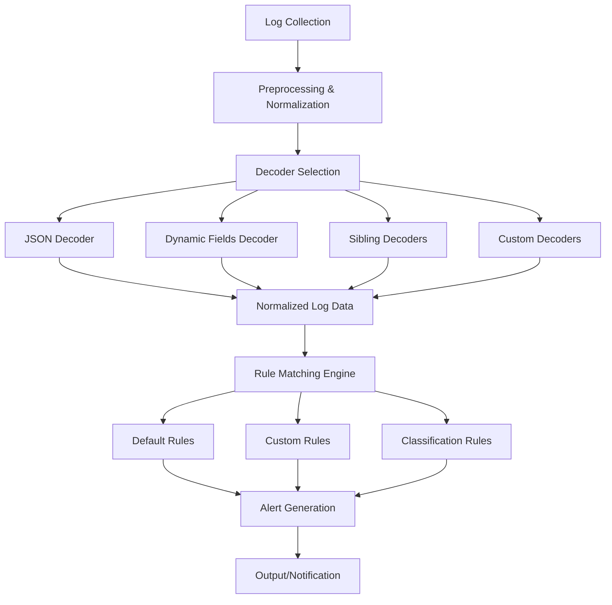
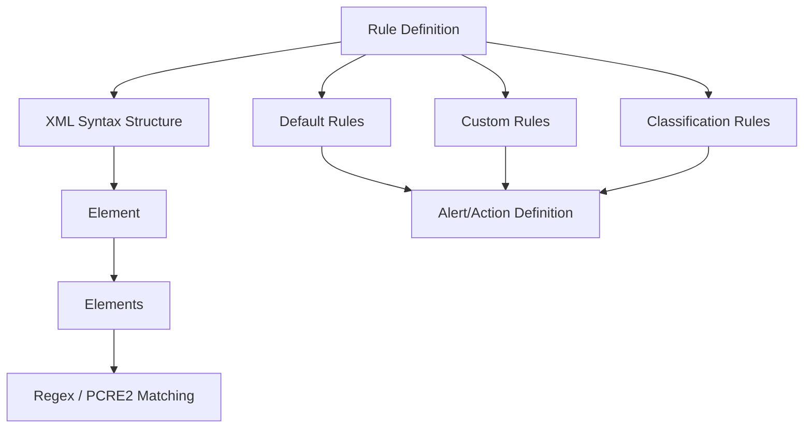
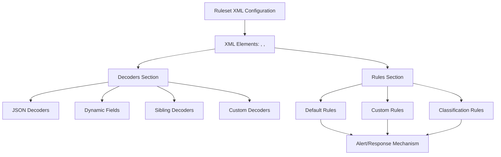
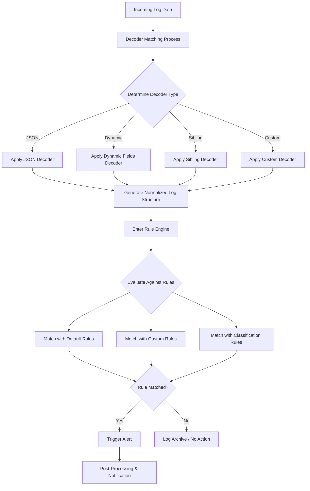

# Understanding Wazuh Data Analysis and Rule Engine

Wazuh's ability to detect security incidents relies on its sophisticated data analysis capabilities and flexible rule engine. This article provides a technical deep dive into how Wazuh processes logs, applies decoders, and matches events against defined rules to generate meaningful security alerts.

## 1. Data Analysis in Wazuh

The data analysis process in Wazuh follows a structured flow from raw log collection to alert generation. The diagram below illustrates the complete process:



**Explanation:**

1. **Log Collection & Preprocessing:** Logs from various sources are collected and preprocessed.
2. **Decoder Selection:** Depending on the log format, Wazuh selects the appropriate decoder—whether it's a JSON decoder, one that handles dynamic fields, sibling decoders for related log events, or custom decoders defined by the user.
3. **Normalized Data:** Once decoded, logs become normalized and are passed to the rule matching engine.
4. **Rule Matching:** The engine evaluates the log data against different types of rules (default, custom, and classification).
5. **Alert Generation:** Matching rules trigger alerts which then flow to the output and notification subsystems.

Wazuh's decoder selection mechanism is particularly powerful, as it can automatically determine the appropriate decoder for each log format, ensuring that all log data is properly parsed and normalized before rule evaluation.

## 2. Rules Architecture

Rules in Wazuh follow a hierarchical structure and are defined using XML syntax. The following diagram illustrates the relationships between different rule types and their implementation:



**Explanation:**

1. **Rule Definition:** Rules in Wazuh are defined using XML.
2. **Types of Rules:**
   - **Default Rules:** Predefined by Wazuh for common events.
   - **Custom Rules:** User-defined rules that extend or override defaults.
   - **Classification Rules:** Group rules contextually to enhance event correlation.
3. **XML Structure:** Rules are structured under a `<rules>` element with multiple `<rule>` child elements.
4. **Matching Logic:** Each rule uses regex or PCRE2 patterns to match specific log events, ultimately triggering defined alerts or actions.

Rule definitions include attributes such as ID, level (severity), and description, as well as criteria for matching log events. The flexibility of XML-based rules allows security teams to fine-tune their detection capabilities to match their specific requirements.

## 3. Ruleset Configuration

The Wazuh ruleset encompasses both decoders and rules in a unified XML configuration framework. The following diagram shows how these components interact:



**Explanation:**

1. **Ruleset Configuration:** The Wazuh ruleset is defined in an XML file that includes separate sections for decoders and rules.
2. **Decoders Section:**
   - Contains various decoder types such as JSON decoders, dynamic fields, sibling decoders, and custom decoders.
3. **Rules Section:**
   - Hosts the default, custom, and classification rules which determine how incoming log data is processed.
4. **Integration:**
   - The combined XML elements create a cohesive ruleset that governs the alert/response mechanism of the system.

The ruleset configuration is stored in `/var/ossec/etc/ossec.conf` with additional rules and decoders in the `/var/ossec/ruleset` directory. Administrators can extend the default ruleset by adding custom rules in `/var/ossec/etc/rules` and custom decoders in `/var/ossec/etc/decoders`.

## 4. Rule Engine Execution Flow

The rule engine is the heart of Wazuh's analysis capabilities. The following diagram provides a detailed view of the execution flow from raw log ingestion to alert generation:



**Explanation:**

1. **Log Data Ingestion:** Raw logs are received and sent to the decoder matching process.
2. **Decoder Matching:**
   - A decision point determines which decoder to apply (JSON, dynamic, sibling, or custom) based on the log's format and content.
3. **Normalization:**
   - Decoders process the log and output a normalized structure.
4. **Rule Evaluation:**
   - The normalized data enters the rule engine, where it is evaluated against various rules (default, custom, classification).
   - The matching process may involve complex regex or PCRE2 patterns as defined in the XML configuration.
5. **Alert Handling:**
   - If a rule match is found, an alert is triggered and then further processed for notifications; if no match is found, the log may be archived or ignored.

The rule engine's ability to process high volumes of logs in real-time depends on efficient decoder selection and rule evaluation algorithms. Wazuh optimizes this process by using fast pattern matching techniques and hierarchical rule evaluation to minimize processing overhead.

## Implementation Example: Creating Custom Rules

To illustrate how the rule engine works in practice, let's look at a simple example of creating a custom rule to detect failed SSH login attempts:

```xml
<rule id="100001" level="5">
  <if_sid>5710</if_sid>
  <match>^Failed password for root from</match>
  <description>Failed SSH login attempt for root user</description>
</rule>

<rule id="100002" level="10" frequency="5" timeframe="120">
  <if_matched_sid>100001</if_matched_sid>
  <same_source_ip />
  <description>Multiple failed SSH login attempts from same source (possible brute force)</description>
</rule>
```

In this example:

- Rule 100001 is triggered when a failed password attempt for the root user is detected
- Rule 100002 correlates multiple occurrences (5 within 120 seconds) from the same source IP, indicating a potential brute force attack

When log data containing "Failed password for root from" is processed, the rule engine will match it against rule 100001, generating a level 5 alert. If this occurs 5 times within 2 minutes from the same IP, rule 100002 will trigger a higher severity (level 10) alert.

## Conclusion

Wazuh's data analysis and rule engine form the foundation of its security monitoring capabilities. The flexible decoder system normalizes logs from diverse sources, while the rule engine provides powerful pattern matching and correlation features that enable security teams to detect and respond to threats effectively.

Understanding the flow of data through the Wazuh analysis pipeline—from log collection to alert generation—helps administrators optimize their security monitoring setup and develop custom rules tailored to their specific security requirements.

For organizations seeking to enhance their security posture, mastering Wazuh's rule engine and decoder system is essential for creating a robust, customized security monitoring solution that can adapt to evolving threats.
