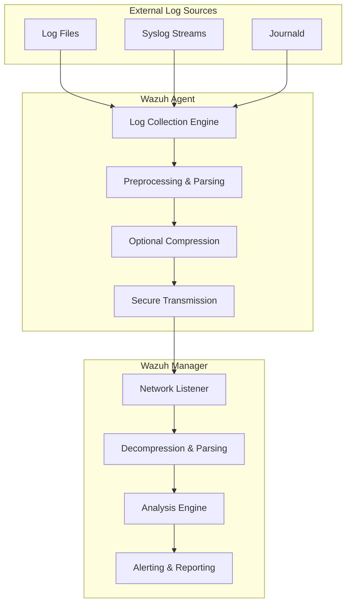
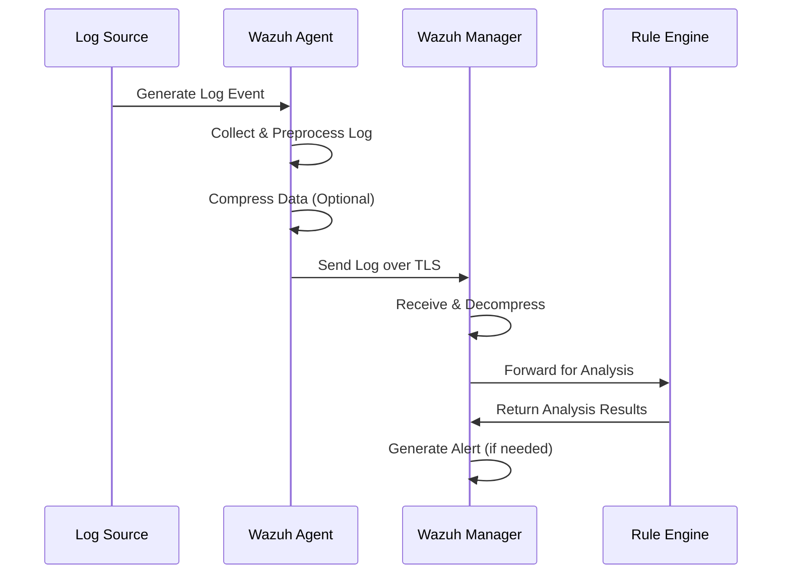
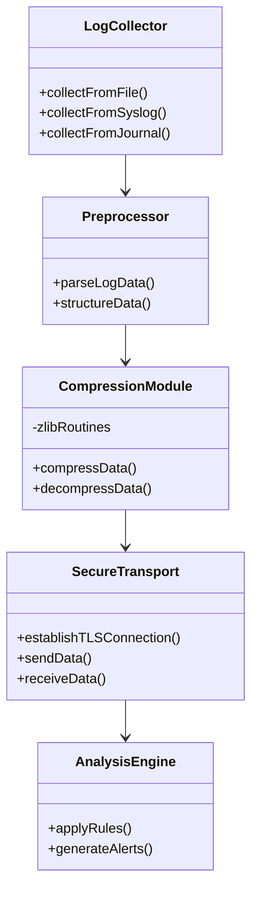

# Wazuh Log Collection and Transmission: An In-Depth Technical Guide

## Overview of the Log Collection and Transmission Process

Wazuh is designed to ingest logs from multiple sources, including:

- **Log Files:** Monitored continuously for changes.
- **Syslog:** Capturing network syslog data.
- **Journald:** Integrating with systemd's journal.

These various inputs are handled by the agent, which uses modular components to read, preprocess, and (optionally) compress the data before securely forwarding it to the manager. At the manager end, the logs are received, decompressed if needed, parsed, and analyzed.

## How Logs Are Processed and Sent

### 1. Collection at the Agent

- **Log Data Collection Engine:**
  The agent continuously monitors log files, syslog streams, and journald outputs using dedicated modules. Each module handles its source type through tailored configuration parameters (see [Monitoring Log Files](https://documentation.wazuh.com/current/user-manual/capabilities/log-data-collection/monitoring-log-files.html), [Syslog](https://documentation.wazuh.com/current/user-manual/capabilities/log-data-collection/syslog.html), and [Journald](https://documentation.wazuh.com/current/user-manual/capabilities/log-data-collection/journald.html)).

- **Preprocessing and Parsing:**
  Once data is collected, it is preprocessed and parsed. This step ensures that logs are structured, enriched, and validated before further processing.

### 2. Optional Compression

- **Compression for Efficiency:**
  To reduce network overhead and improve performance, the agent can compress log payloads. In the codebase (as seen in the Wazuh GitHub repository v4.11.0), compression routines are integrated at the agent level. Although the exact file names might vary, these routines typically use standard libraries (e.g., zlib) for compressing data streams.

- **Benefits:**
  Compression decreases the amount of data transmitted over the network while maintaining data integrity. It is particularly valuable in environments with high log volume or constrained bandwidth.

### 3. Secure Transmission

- **Transport Layer:**
  The agent forwards the (compressed) log data over a secure channel, usually employing TLS. This ensures confidentiality and integrity as logs traverse potentially untrusted networks.

- **Multiple-Socket Outputs:**
  Wazuh's architecture supports multiple-socket outputs, meaning the agent can simultaneously use several transmission channels (TCP/UDP, with TLS when needed) to reach the manager reliably ([Multiple Socket Outputs](https://documentation.wazuh.com/current/user-manual/capabilities/log-data-collection/multiple-socket-outputs.html)).

### 4. Reception and Processing at the Manager

- **Receiving the Data:**
  The manager runs a network listener that accepts incoming connections from agents. Once a connection is established, it receives the log data.

- **Decompression and Parsing:**
  If the logs were compressed, the manager uses a complementary decompression routine (again typically using libraries like zlib) to restore the original data before parsing it.

- **Log Analysis and Alerting:**
  Finally, the manager applies its log analysis engine—using configuration rules defined in the documentation ([Configuration](https://documentation.wazuh.com/current/user-manual/capabilities/log-data-collection/configuration.html) and [Log Data Analysis](https://documentation.wazuh.com/current/user-manual/capabilities/log-data-collection/log-data-analysis.html))—to detect anomalies, generate alerts, and drive reporting.

## Architecture Diagrams

### End-to-End Log Transmission Process



_Figure 1: End-to-end log collection and transmission process._

### Runtime Interaction Sequence



_Figure 2: Step-by-step sequence of log handling from agent to manager._

### Code-Level Structure



_Figure 3: Codebase modules involved in log processing and transmission in Wazuh._

## Code-Level Insights and Libraries

### Agent-Side Implementation

- **Compression Implementation:**
  In the Wazuh codebase (v4.11.0), the agent includes modules that integrate with standard compression libraries (typically zlib) to reduce the data size. Functions related to compression can be found within the agent's log processing modules. These functions generally call standard routines (such as `compress()` and `uncompress()`) to handle the payload before transmission.

- **Network Communication:**
  The agent's secure transmission is built upon robust socket programming, using TLS libraries to ensure data is encrypted in transit. The code also manages multiple-socket outputs to enhance fault tolerance and load distribution.

### Manager-Side Implementation

- **Decompression and Processing:**
  Upon receiving data, the manager's code contains logic to detect whether the incoming payload is compressed. If so, it applies the corresponding decompression routines. This is seamlessly integrated with its log parsing and analysis pipeline.

- **Modular Architecture:**
  Both agent and manager components are designed modularly. This allows for clear separation of concerns: log collection, optional compression, transmission, and analysis. Such a design is visible in the repository structure and the way each module is developed and maintained.

For more detailed code-level insights, you can review the source files in the [Wazuh GitHub repository v4.11.0](https://github.com/wazuh/wazuh/tree/v4.11.0). Searching for keywords like "compress", "zlib", or "socket" in the repository can reveal the exact implementation details.

## Code Examples

### Agent-Side Processing

Here's a simplified example of how the agent might handle log collection and transmission:

```c
#include <stdio.h>
#include <stdlib.h>
#include <string.h>
#include <zlib.h>
#include "tls_socket.h"  // Hypothetical TLS wrapper

// Compresses the log data using zlib
int compress_data(const char *input, size_t input_size, char *output, size_t *output_size) {
    return compress((Bytef *)output, output_size, (const Bytef *)input, input_size);
}

// Sends a log message from the agent to the manager
void send_log(const char* log_message) {
    char compressed_data[1024];
    size_t compressed_size = sizeof(compressed_data);

    // Compress the log message (if compression is enabled)
    if (compress_data(log_message, strlen(log_message), compressed_data, &compressed_size) != Z_OK) {
        fprintf(stderr, "Compression error\n");
        return;
    }

    // Connect to the manager via TLS
    TLS_Socket *socket = tls_connect("manager_address", 1514);
    if (socket == NULL) {
        fprintf(stderr, "Connection error\n");
        return;
    }

    // Send the compressed log data over the secure connection
    tls_send(socket, compressed_data, compressed_size);
    tls_close(socket);
}
```

### Manager-Side Processing

And here's how the manager might receive and process the logs:

```c
#include <stdio.h>
#include <stdlib.h>
#include <string.h>
#include <zlib.h>
#include "tls_socket.h"  // Hypothetical TLS wrapper

// Decompresses the received data using zlib
int decompress_data(const char *input, size_t input_size, char *output, size_t *output_size) {
    return uncompress((Bytef *)output, output_size, (const Bytef *)input, input_size);
}

// Receives and processes a log message on the manager
void receive_log() {
    // Listen on a specific port for incoming TLS connections
    TLS_Socket *socket = tls_listen(1514);
    if (socket == NULL) {
        fprintf(stderr, "Listener error\n");
        return;
    }

    char buffer[1024];
    int bytes_received = tls_receive(socket, buffer, sizeof(buffer));
    tls_close(socket);

    // Decompress the log data if it was compressed
    char decompressed_data[2048];
    size_t decompressed_size = sizeof(decompressed_data);
    if (decompress_data(buffer, bytes_received, decompressed_data, &decompressed_size) != Z_OK) {
        fprintf(stderr, "Decompression error\n");
        return;
    }

    // Pass the decompressed data to the log parser/analysis module
    parse_log(decompressed_data, decompressed_size);
}
```

## Conclusion

Wazuh's log collection and transmission process is robust and optimized for both performance and security. By integrating optional compression (using libraries such as zlib) and employing secure transmission channels (via TLS), Wazuh ensures that even high volumes of log data are handled efficiently. The modular architecture and multiple-socket outputs further enhance its reliability, while the manager's comprehensive analysis pipeline ensures that incoming logs are properly processed and actionable alerts are generated.

This technical deep-dive provides a detailed view of the internal mechanisms that power Wazuh's log collection capabilities, from the initial data ingestion to the final analysis and alerting stages.

## Performance Optimization Recommendations

1. **Enable Compression**: For environments with high log volumes or limited bandwidth, ensure compression is enabled.
2. **Tune Buffer Sizes**: Adjust buffer sizes in the agent configuration based on your log volume and network conditions.
3. **Multiple Managers**: Consider setting up multiple managers for load distribution in large deployments.
4. **Optimize Log Collection**: Configure appropriate intervals and file patterns to minimize unnecessary processing.
5. **Regular Maintenance**: Keep both agents and manager components updated to benefit from performance improvements in newer versions.

By understanding and optimizing these mechanisms, Wazuh administrators can ensure efficient log collection and analysis across their infrastructure.
