## Table of contents

## Executive Summary

UTMStack's proprietary correlation engine was built from scratch to analyze data before ingestion and maximize real-time correlation, resulting in extremely fast threat detection and response times. The engine processes over 128,000 correlation rules and operates as a unified SIEM/XDR platform with real-time threat intelligence integration.

### Key Security Advantages:

- **Pre-ingestion Analysis**: Correlates threats before data storage, reducing attack dwell time
- **Real-time Processing**: Immediate threat detection without indexing delays
- **Threat Intelligence Integration**: Automated IOC correlation from multiple feeds
- **Memory-based Cache**: High-speed rule processing for time-sensitive alerts
- **Defensive Architecture**: Containerized microservices with strong authentication

## Architecture Overview

### Core Components Deep Dive

#### 1. Rule Processing Engine

The correlation engine supports two primary processing modes:

**Cache-Based Processing**
- **Purpose**: High-speed analysis for time-sensitive rules (≤1 hour timeframe)
- **Storage**: In-memory cache for rapid access
- **Iteration**: Multi-stage rule evaluation with state persistence
- **Performance**: Optimized for real-time threat detection

**Search-Based Processing**
- **Purpose**: Complex analysis requiring historical data (>1 hour timeframe)
- **Storage**: Direct OpenSearch/Elasticsearch queries
- **Flexibility**: Complex JSON queries with advanced filtering
- **Use Case**: Long-term pattern analysis and forensic investigation

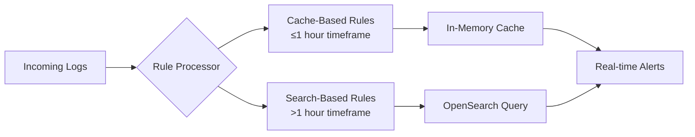

#### 2. Rule Structure and Components

UTMStack correlation rules are written in YAML format with three main components: threat documentation, logic/frequency blocks, and alert information blocks.

**Rule Metadata Structure**

```yaml
name: "Rule Name"                    # Alert identifier
severity: "High|Medium|Low"          # Risk classification
description: "Attack description"    # Detailed explanation
solution: "Remediation steps"        # Response guidance
category: "Attack category"          # MITRE ATT&CK alignment
tactic: "Attack tactic"             # Threat actor methodology
reference: ["URL1", "URL2"]         # Additional resources
dataTypes: ["log_type"]             # Applicable log sources
frequency: 30                       # Check interval (seconds)
```

**Processing Logic Blocks**

Cache-Based Rules:

```yaml
cache:
  - allOf:                          # AND logic - all conditions must match
      - field: "log.field.path"
        operator: "=="
        value: "expected_value"
    minCount: 5                     # Minimum event threshold
    timeLapse: 300                  # Time window (seconds)
    save:                           # Field preservation for next iteration
      - field: "source.ip"
        alias: "SourceIP"
```

Search-Based Rules:

```yaml
search:
  - query: '{
      "size": 500,
      "query": {
        "bool": {
          "must": [{"match": {"field": "value"}}],
          "filter": [{"range": {"@timestamp": {"gte": "now-5m"}}}]
        }
      }
    }'
    minCount: 3
    save:
      - field: "destination.ip"
        alias: "DestinationIP"
```

#### 3. Operator Types and Security Implications

The correlation engine supports multiple comparison operators with specific security use cases:

| Operator | Type | Security Use Case |
|----------|------|-------------------|
| == | Exact match | Specific value detection |
| != | Not equal | Anomaly detection |
| < > <= >= | Numeric comparison | Threshold analysis |
| contain | Substring search | Pattern matching |
| not contain | Exclusion | Whitelist filtering |
| regexp | Regular expression | Complex pattern detection |
| in | List membership | Multiple value matching |
| not in | List exclusion | Blacklist implementation |
| exist | Field presence | Schema validation |
| not exist | Field absence | Missing data detection |
| in cidr | IP range matching | Network analysis |

**Security-Critical Operators:**
- **in cidr**: Network-based threat detection (lateral movement, reconnaissance)
- **regexp**: Advanced pattern matching for obfuscated attacks
- **contains**: Payload analysis and signature detection
- **exist/not exist**: Field presence anomaly detection

#### 4. Multi-Stage Correlation Processing

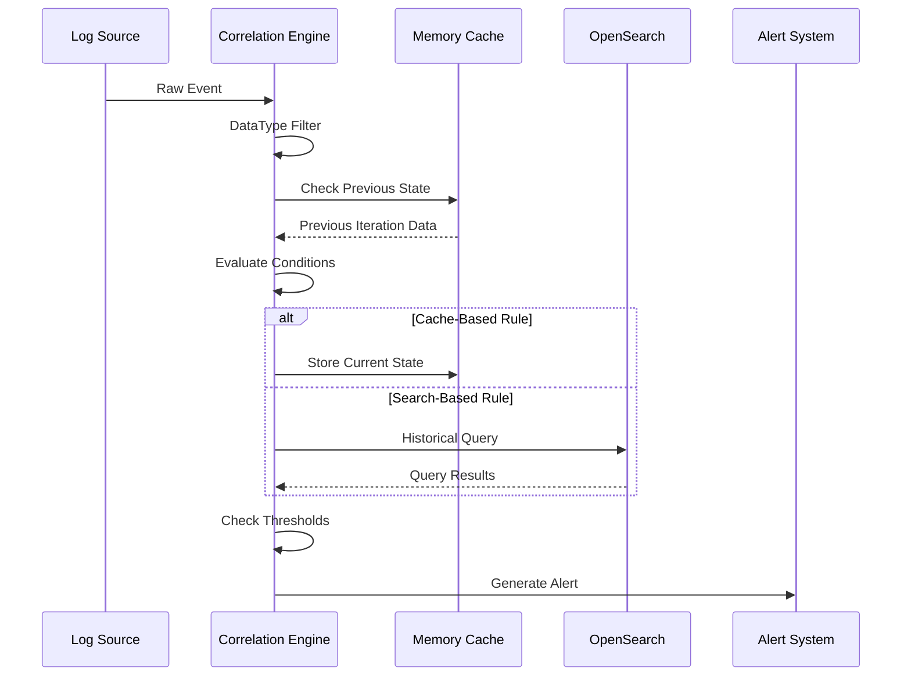

## Data Flow and Processing Pipeline

### 1. Log Ingestion and Normalization

UTMStack employs Logstash to parse logs from various sources like firewalls, AWS, Office 365, etc. These logs are then processed through input, filter, and output plugins and sent to the UTMStack correlation engine.

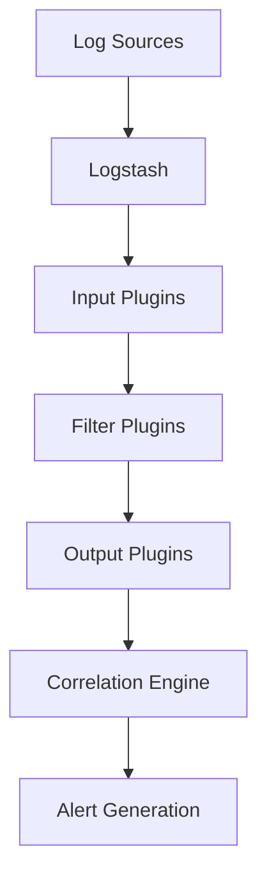

### 2. Real-time Correlation Process

**Phase 1: Event Classification**
- DataType filtering based on rule applicability
- Field extraction and normalization
- Timestamp validation and parsing

**Phase 2: Rule Evaluation**
- Cache lookup for existing correlation state
- Multi-condition evaluation (allOf/oneOf logic)
- Threshold counting and time window validation

**Phase 3: Alert Generation**
- Alias resolution for alert fields
- GeoIP enrichment for network indicators
- Severity assignment and categorization

### 3. Cache Management and Performance

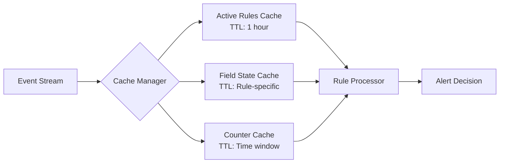

## Threat Intelligence Integration

### 1. IOC Correlation Engine

All logs the system receives are aggregated and correlated for indicators of compromise (IOCs) using several open threat intelligence feeds. This feature is enabled by default, and there is no need for custom correlation rules or configurations.

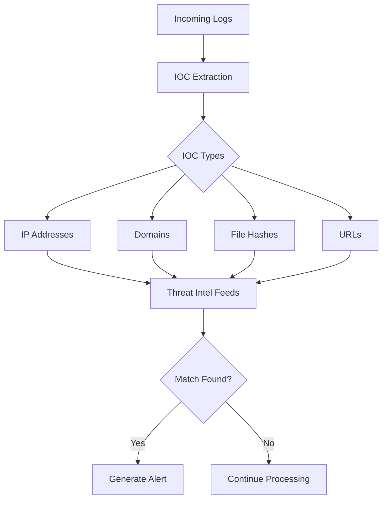

### 2. Automated Threat Detection Rules

The system includes built-in rules for:
- **IP-based Threats**: Blacklisted IP correlation
- **Domain Intelligence**: Malicious domain detection
- **Hash-based Detection**: Known malware signatures
- **Behavioral Analysis**: Anomalous activity patterns

## Security Architecture and Threat Modeling

### 1. Attack Surface Analysis

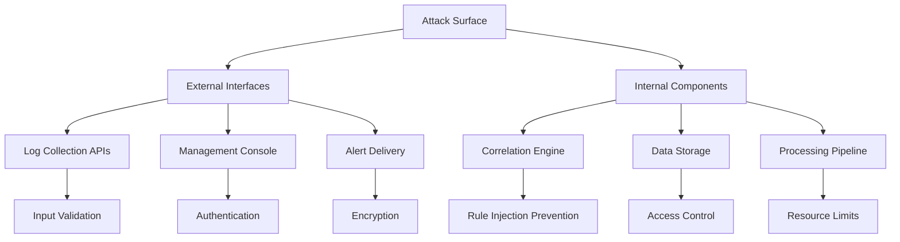

### 2. Defensive Security Measures

All data in transit between agents and UTMStack servers is encrypted using TLS. UTMStack services are isolated by containers and microservices with strong authentication. Connections to the UTMStack server are authenticated with a +24 characters unique key.

**Key Security Features:**
- **Transport Security**: End-to-end TLS encryption
- **Authentication**: 24+ character unique connection keys
- **Isolation**: Containerized microservice architecture
- **Input Validation**: Comprehensive log sanitization
- **Access Control**: Role-based permission system

### 3. Threat Detection Capabilities

**Advanced Persistent Threat (APT) Detection:**
- Multi-stage attack correlation
- Long-term behavioral analysis
- Attribution through TTPs mapping

**Insider Threat Detection:**
- Privilege escalation monitoring
- Abnormal access pattern recognition
- Data exfiltration indicators

**Infrastructure Security:**
- Network reconnaissance detection
- Lateral movement identification
- Command and control communication

## Performance and Scalability

### 1. Processing Architecture

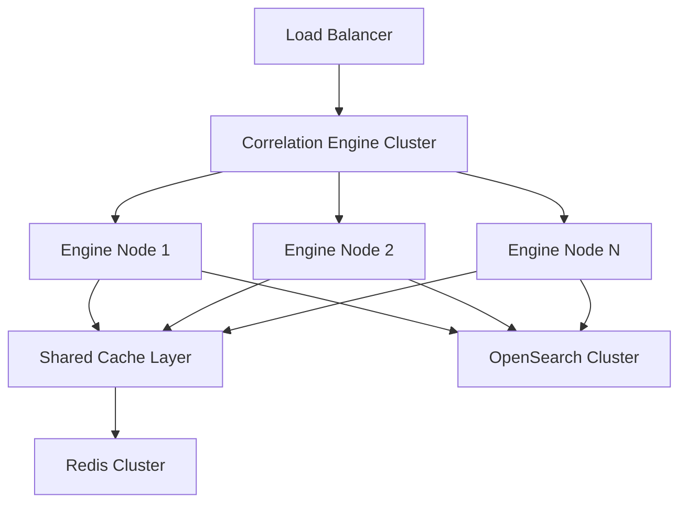

### 2. Scalability Considerations

**Horizontal Scaling:**
- Distributed cache architecture
- Multi-node rule processing
- Load-balanced log ingestion

**Performance Optimization:**
- In-memory correlation cache
- Optimized rule evaluation order
- Efficient field indexing

## Rule Development and Management

### 1. Custom Rule Creation Process

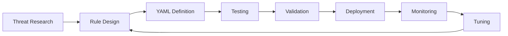

### 2. Rule Categories and Use Cases

**Authentication & Access Control:**
- Failed login attempts correlation
- Privilege escalation detection
- Account compromise indicators

**Network Security:**
- Port scanning identification
- DDoS attack detection
- Malicious traffic analysis

**Endpoint Security:**
- Malware execution correlation
- Process injection detection
- Registry modification tracking

**Data Protection:**
- Data exfiltration patterns
- Unauthorized access attempts
- Sensitive file monitoring

## Integration and API Architecture

### 1. External System Integration

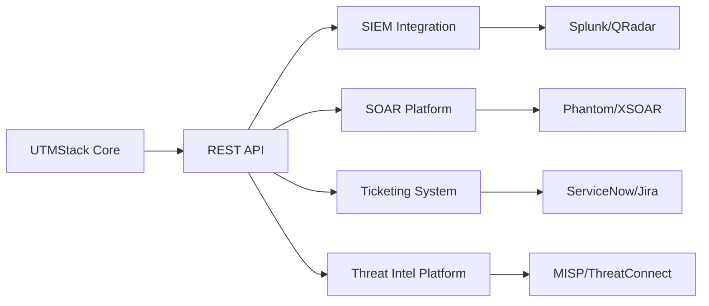

### 2. API Security and Authentication

**Authentication Methods:**
- API key-based authentication
- JWT token validation
- Role-based access control

**Data Protection:**
- Request/response encryption
- Rate limiting and throttling
- Input sanitization and validation

## Compliance and Regulatory Framework

### 1. Supported Compliance Standards

UTMStack automates compliance controls and evidence tracking for GDPR, GLBA, HIPAA, SOC 2 and CMMC, with specific reporting capabilities for:

- **HIPAA**: Healthcare data protection monitoring
- **PCI-DSS**: Payment card industry security
- **SOC 2**: Service organization controls
- **GDPR**: Data privacy regulation compliance
- **CMMC**: Cybersecurity maturity model certification

### 2. Audit Trail and Evidence Collection

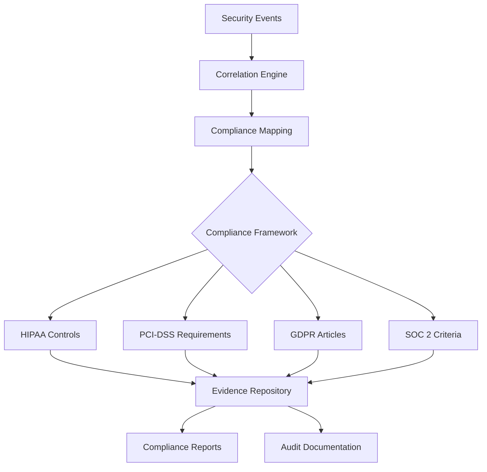

## Advanced Features and AI Integration

### 1. Machine Learning Components

The threat detection engine is composed of rule-based correlation systems, scanners, and AI-powered machine learning algorithms that enable the system to learn from its environment.

**AI-Powered Capabilities:**
- **Behavioral Analytics**: Anomaly detection using baseline learning
- **Threat Hunting**: Automated IOC discovery and correlation
- **False Positive Reduction**: ML-based alert filtering
- **Predictive Analysis**: Threat trend identification

### 2. Advanced Correlation Techniques

```yaml
# Example: Multi-Stage Attack Detection
name: "APT Campaign Detection"
severity: "Critical"
description: "Detects multi-stage APT campaign activity"

cache:
  # Stage 1: Initial Compromise
  - allOf:
      - field: "event.action"
        operator: "contain"
        value: "exploit"
    minCount: 1
    timeLapse: 3600
    save:
      - field: "source.ip"
        alias: "AttackerIP"
        
  # Stage 2: Lateral Movement
  - allOf:
      - field: "event.category"
        operator: "=="
        value: "network"
      - field: "source.ip"
        operator: "=="
        value: "$AttackerIP"
    minCount: 5
    timeLapse: 7200
    save:
      - field: "destination.ip"
        alias: "TargetSystems"
        
  # Stage 3: Data Exfiltration
  - allOf:
      - field: "network.bytes"
        operator: ">"
        value: 1000000
      - field: "source.ip"
        operator: "in"
        value: "$TargetSystems"
    minCount: 1
    timeLapse: 3600
```

## Operational Procedures and Best Practices

### 1. Deployment Strategy

**Security-by-Design Principles:**
- Minimal attack surface configuration
- Defense-in-depth architecture
- Continuous security validation
- Threat model-driven development

### 2. Monitoring and Maintenance

**Performance Monitoring:**
- Rule processing metrics
- Cache hit ratios
- Alert generation rates
- System resource utilization

**Security Monitoring:**
- Failed authentication attempts
- Unusual system behavior
- Configuration changes
- Access pattern anomalies

### 3. Incident Response Integration

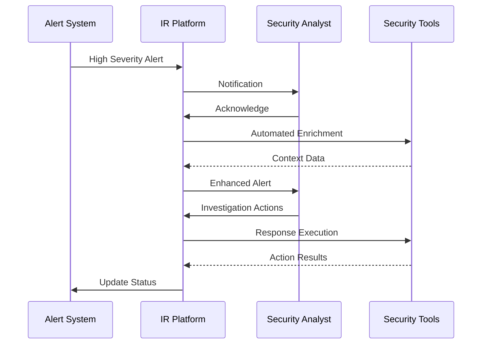

## Conclusion and Security Recommendations

The UTMStack correlation engine represents a comprehensive approach to real-time threat detection and response. Its pre-ingestion analysis capability, combined with extensive rule coverage and threat intelligence integration, provides significant security advantages for XDR/OXDR platform development.

### Key Recommendations for Security Architects:

1. **Implement Cache-Based Rules** for high-priority, time-sensitive threats
2. **Leverage Threat Intelligence** integration for automated IOC correlation
3. **Design Multi-Stage Rules** for complex attack pattern detection
4. **Utilize Field Aliasing** for consistent alert formatting and response automation
5. **Monitor Performance Metrics** to ensure optimal correlation engine performance
6. **Implement Custom Rules** aligned with organization-specific threat models

### Advanced Security Considerations:

- Regular rule validation and false positive analysis
- Continuous threat intelligence feed updates
- Performance tuning for high-volume environments
- Integration with automated response systems
- Compliance reporting and audit trail maintenance

This documentation provides the foundation for understanding and implementing UTMStack's correlation engine in enterprise security architectures, with particular emphasis on defensive programming practices and security-by-design principles essential for robust XDR/OXDR platform development.

## UTMStack OpenSearch Connector - Architecture & Functionality

### Overview

The UTMStack OpenSearch Connector acts as a crucial bridge that facilitates seamless communication between UTMStack's SIEM/XDR platform and OpenSearch clusters, abstracting complex HTTP/JSON operations into intuitive Java methods and data structures.

### Core Architecture Diagram

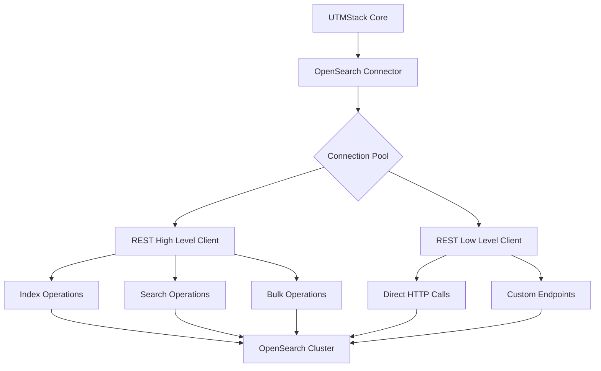

### Detailed Component Interaction Flow

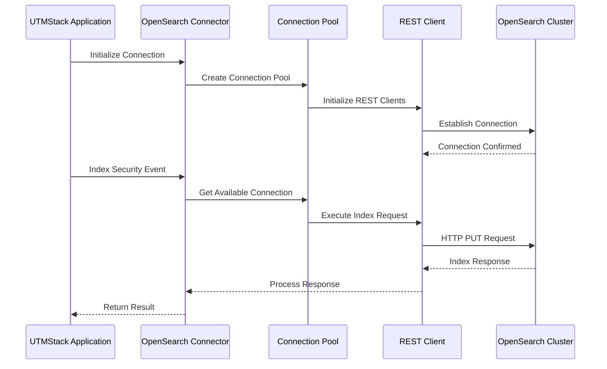

### Key Functionality Breakdown

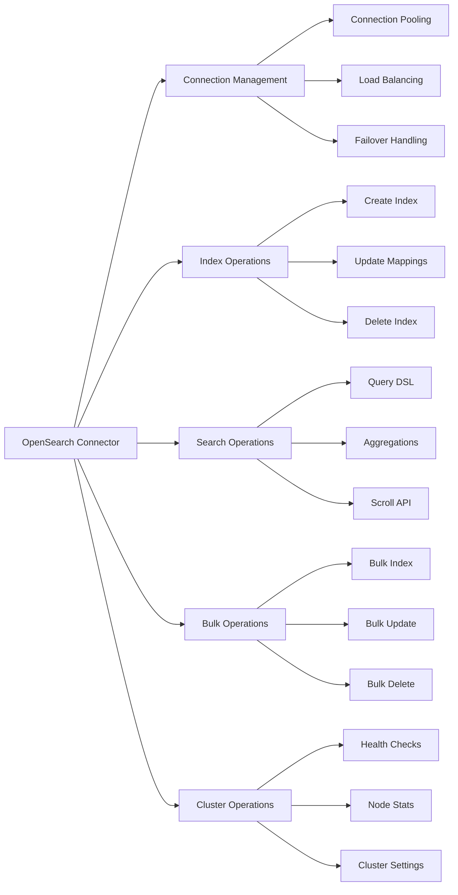

### Security Operations Integration

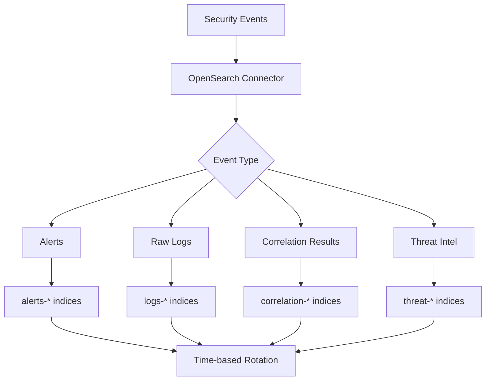

### Data Flow & Processing Pipeline

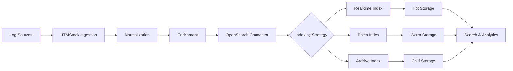

### Technical Implementation Details

```java
// Connector initialization example
public class UTMStackOpenSearchConnector {
    private final RestHighLevelClient client;
    private final ConnectionPool pool;
    private final RetryPolicy retryPolicy;
    
    public UTMStackOpenSearchConnector(OpenSearchConfig config) {
        this.pool = new ConnectionPool(config.getMaxConnections());
        this.client = buildClient(config);
        this.retryPolicy = new ExponentialBackoffRetry(3, 1000);
    }
    
    // Index security event with automatic retry
    public IndexResponse indexSecurityEvent(SecurityEvent event) {
        return retryPolicy.execute(() -> {
            IndexRequest request = new IndexRequest("security-events")
                .id(event.getId())
                .source(event.toJson(), XContentType.JSON);
            
            return client.index(request, RequestOptions.DEFAULT);
        });
    }
    
    // Bulk index for high-throughput scenarios
    public BulkResponse bulkIndexEvents(List<SecurityEvent> events) {
        BulkRequest bulkRequest = new BulkRequest();
        
        events.forEach(event -> {
            bulkRequest.add(new IndexRequest("security-events")
                .id(event.getId())
                .source(event.toJson(), XContentType.JSON));
        });
        
        return client.bulk(bulkRequest, RequestOptions.DEFAULT);
    }
}
```

### Performance & Scalability Features

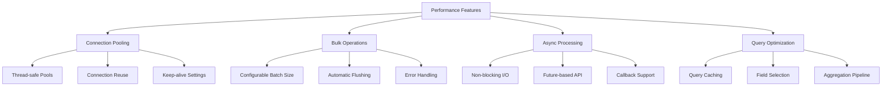

### Security & Authentication Flow

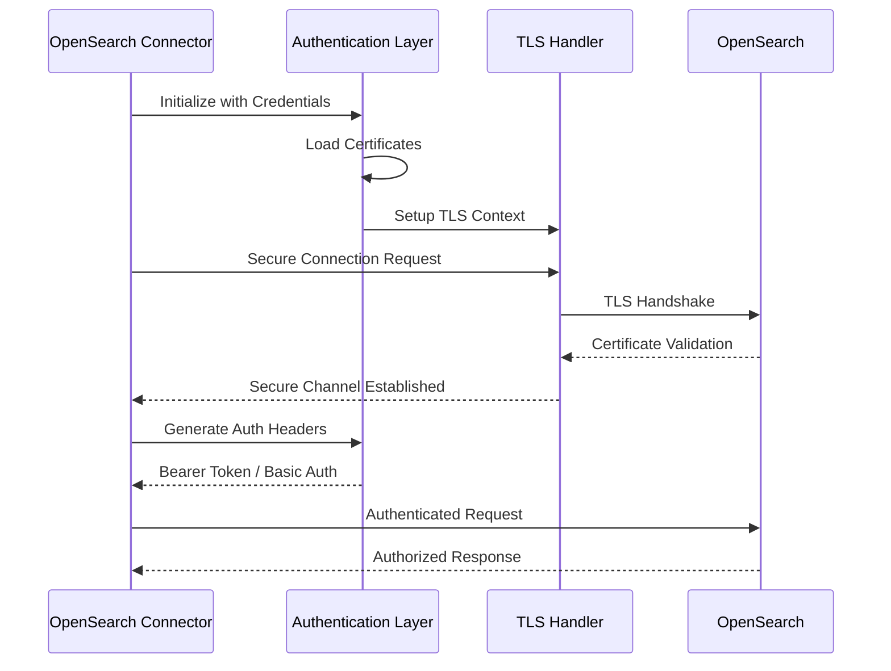

### Key Benefits & Security Advantages

#### 🔒 Security Benefits

- **Encryption in Transit**: All communications use TLS/SSL
- **Authentication Integration**: Support for multiple auth methods
- **Role-based Access Control**: Fine-grained permission system
- **Audit Trail**: Complete operation logging for compliance

#### ⚡ Performance Benefits

- **Connection Pooling**: Efficient resource utilization
- **Bulk Operations**: High-throughput data processing
- **Async Processing**: Non-blocking operations
- **Query Optimization**: Intelligent query building

#### 🛡️ Reliability Features

- **Circuit Breaker Pattern**: Prevents cascade failures
- **Automatic Retry Logic**: Handles transient failures
- **Health Monitoring**: Continuous cluster health checks
- **Failover Support**: Seamless cluster failover

#### 📊 SIEM-Specific Advantages

- **Real-time Indexing**: Immediate log availability for correlation
- **Time-based Indices**: Efficient log retention and archival
- **Complex Query Support**: Advanced threat hunting capabilities
- **Aggregation Processing**: Statistical analysis for anomaly detection

### Integration Points in UTMStack

The OpenSearch Connector serves as the foundation for UTMStack's core security operations:

1. **Log Ingestion Pipeline**: Real-time indexing of security events
2. **Correlation Engine**: Historical data queries for pattern matching
3. **Alert Storage**: Persistent alert and incident management
4. **Compliance Reporting**: Long-term data retention and reporting
5. **Threat Intelligence**: IOC storage and correlation
6. **Dashboard Analytics**: Real-time metrics and visualization
7. **Forensic Analysis**: Historical data investigation and analysis

This connector is essential for UTMStack's XDR capabilities, enabling seamless integration between the platform's security logic and the underlying search and analytics engine.