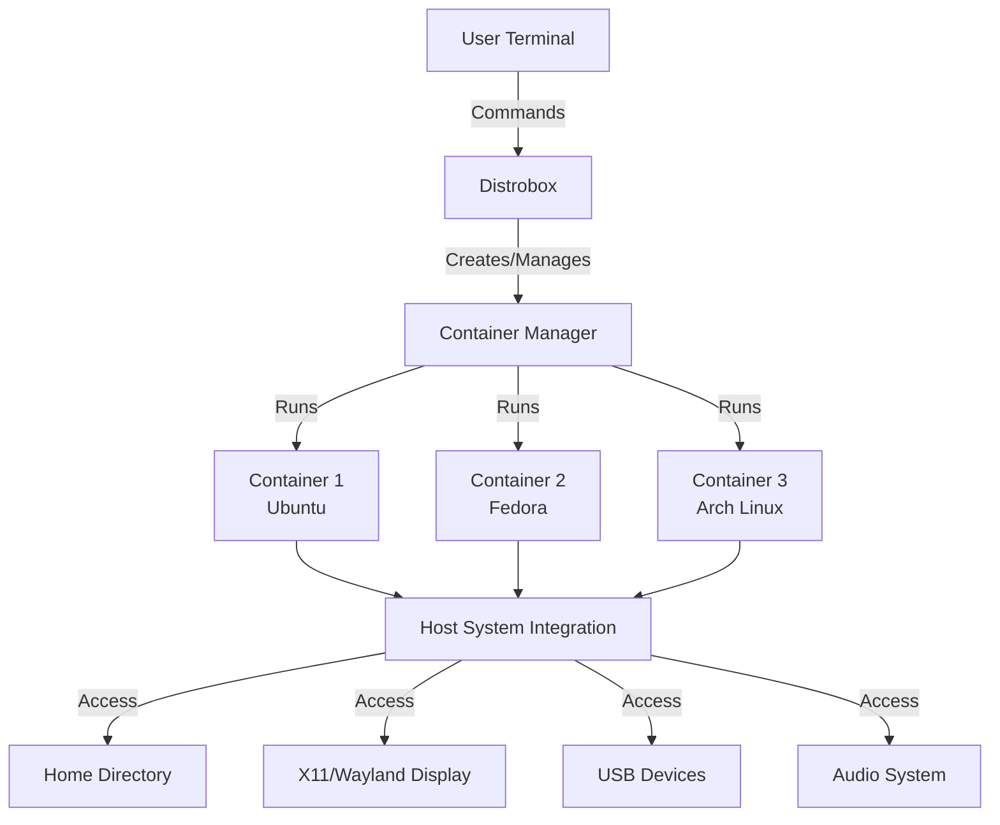

# Distrobox: Running Any Linux Distribution as a Container

Distrobox is a powerful tool that enables using any Linux distribution inside your terminal through containers (powered by podman, docker, or lilipod). Unlike traditional containerization approaches that focus on isolation, Distrobox prioritizes integration with the host system, allowing you to work with different distributions while maintaining seamless access to your files and devices.



## Why Use Distrobox?

Distrobox solves several common challenges for Linux users:

1. **Access to different package ecosystems** without changing your base distribution
2. **Development across distributions** to ensure compatibility
3. **Testing software on multiple distributions** without dual-booting or VMs
4. **Running newer software versions** than what's available in your distribution
5. **Isolating specific workloads** from your base system

The key advantage is that it maintains full access to your home directory and system resources while providing distribution flexibility.

## Security Considerations

Before diving into usage, it's important to understand Distrobox's security model:

| Aspect                        | Details                                                         |
| ----------------------------- | --------------------------------------------------------------- |
| **Integration vs. Isolation** | Distrobox prioritizes integration over isolation                |
| **File System Access**        | Container has full access to home directory and mounted volumes |
| **Root Access**               | Root in rootful containers can modify the host system           |
| **Authentication**            | Password protection for rootful containers                      |
| **Recommended Mode**          | Use rootless podman/lilipod for better security                 |

### Security Best Practices

- **Avoid rootful containers** when possible
- **Use podman in rootless mode** for enhanced security
- **Be cautious with volume mounts** and access permissions
- **Consider network isolation** requirements
- **Regularly update container images**
- **Use minimal base images** to reduce attack surface
- **Apply the principle of least privilege** when configuring containers

## Getting Started with Distrobox

### Basic Container Management

Creating and entering a container is straightforward:

```bash
# Create a basic Ubuntu container
distrobox create --name ubuntu-container

# Enter the container
distrobox enter ubuntu-container

# List your containers
distrobox list

# Stop a container
distrobox stop ubuntu-container

# Remove a container
distrobox rm ubuntu-container
```

### Creating Containers with Specific Distributions

You can specify any distribution supported by your container engine:

```bash
# Create a Fedora container
distrobox create --name fedora --image fedora:latest

# Create a Debian container
distrobox create --name debian --image debian:11

# Create an Arch Linux container
distrobox create --name arch --image archlinux:latest
```

### Working with System Initialization

For containers that need systemd or another init system:

```bash
# Create container with systemd
distrobox create --name systemd-container --init \
    --image debian:latest \
    --additional-packages "systemd libpam-systemd pipewire-audio-client-libraries"
```

## Advanced Features

Distrobox offers powerful features that extend its functionality beyond basic container usage.

### Exporting Applications to Host

One of the most powerful features is the ability to export applications from containers to your host system:

```bash
# Export an application (creates a desktop entry on the host)
distrobox-export --app firefox

# Export a binary to the host's PATH
distrobox-export --bin /usr/local/bin/custom-tool
```

This creates wrapper scripts on your host that transparently run the application from inside the container.

### Executing Host Commands from Container

You can run host commands from within the container:

```bash
# Within the container
distrobox-host-exec hostnamectl
```

### Custom Container Configuration

Customize your container setup for specific needs:

```bash
# Create with custom home directory
distrobox create --name dev --home ~/.dev-home

# Mount additional volumes
distrobox create --name data-container --volume /data:/container-data

# Use a different default shell
distrobox create --name zsh-container \
    --additional-packages zsh \
    --init-hooks "chsh -s /usr/bin/zsh"
```

## Configuration Files

Distrobox reads configuration from several locations in order of precedence:

1. `${HOME}/.distroboxrc`
2. `${HOME}/.config/distrobox/distrobox.conf`
3. `/etc/distrobox/distrobox.conf`
4. `/usr/etc/distrobox/distrobox.conf`
5. `/usr/share/distrobox/distrobox.conf`

Example configuration:

```ini
container_always_pull="1"
container_generate_entry=0
container_manager="podman"
container_image_default="registry.opensuse.org/opensuse/toolbox:latest"
container_manager_additional_flags="--security-opt=no-new-privileges"
container_additional_volumes="/secure:/secure:ro"
```

You can also use environment variables to override settings:

```bash
DBX_CONTAINER_MANAGER="podman" distrobox create -n test
```

## Common Use Cases

### Development Environment

Create isolated development environments with specific toolchains:

```bash
# Create a container for Node.js development
distrobox create --name node-dev \
    --image fedora:latest \
    --additional-packages "nodejs npm gcc g++ git"

# Create a container for Python development
distrobox create --name python-dev \
    --image ubuntu:22.04 \
    --additional-packages "python3 python3-pip python3-venv"
```

### Distribution-Specific Tools

Access tools that are easier to install on certain distributions:

```bash
# Create an Arch container for AUR packages
distrobox create --name arch-aur \
    --image archlinux:latest \
    --additional-packages "base-devel git"

# Enter and install AUR packages
distrobox enter arch-aur
git clone https://aur.archlinux.org/yay.git
cd yay && makepkg -si
```

### GUI Application Access

Run GUI applications from other distributions:

```bash
# Create a container with graphics applications
distrobox create --name graphics \
    --image ubuntu:22.04 \
    --additional-packages "gimp inkscape blender"

# Export applications to host
distrobox enter graphics -- distrobox-export --app gimp
distrobox enter graphics -- distrobox-export --app inkscape
```

### Legacy Software Environment

Create containers for running older software with specific dependencies:

```bash
# Create container with older library versions
distrobox create --name legacy \
    --image centos:7 \
    --additional-packages "compat-openssl10 libpng12"
```

## Advanced Configurations

### GPU Acceleration

Enable GPU support for containers:

```bash
# NVIDIA GPU support
distrobox create --name nvidia-container \
    --nvidia \
    --additional-packages "nvidia-driver nvidia-cuda-toolkit"

# AMD GPU support
distrobox create --name amd-container \
    --additional-packages "mesa-vulkan-drivers vulkan-tools"
```

### Resource Limits

Apply resource constraints:

```bash
# Memory limits
distrobox create --name memory-limited \
    --additional-flags "--memory=2g --memory-swap=4g"

# CPU limits
distrobox create --name cpu-limited \
    --additional-flags "--cpus=2 --cpu-shares=512"
```

### Network Configuration

Customize network settings:

```bash
# Host network mode
distrobox create --name host-net \
    --additional-flags "--network=host"

# Port forwarding
distrobox create --name web-server \
    --additional-flags "-p 8080:80 -p 443:443"
```

## Integration with Host Systems

Distrobox integrates with the host system in multiple ways:

| Host Resource  | Container Access              |
| -------------- | ----------------------------- |
| Home Directory | Full read/write access        |
| X11/Wayland    | Seamless display integration  |
| Audio          | Host audio system access      |
| USB Devices    | Access to host USB devices    |
| GPUs           | Hardware acceleration support |
| Network        | Host network connectivity     |
| SSH Agent      | SSH key forwarding            |

This integration makes the container experience nearly indistinguishable from running applications directly on the host.

## Backup and Migration

Backup and restore your containers:

```bash
# Backup container
distrobox stop mycontainer
podman export mycontainer > mycontainer_backup.tar

# Restore container
cat mycontainer_backup.tar | podman import - mycontainer-restored
```

## Troubleshooting

Common issues and their resolutions:

### Display Access Problems

If GUI applications fail to display:

```bash
# Check if X11 socket is properly mounted
distrobox enter container-name -- ls -la /tmp/.X11-unix/

# Run with explicit display variable
distrobox enter container-name -- DISPLAY=$DISPLAY application-name
```

### Container Initialization Failures

For issues starting containers:

```bash
# Check container status
distrobox list --verbose

# View container logs
podman logs container-name

# Debug container creation
distrobox create --verbose --name test-container
```

### Resource Limitations

For performance issues:

```bash
# Monitor container resources
podman stats container-name

# Check container processes
distrobox enter container-name -- top
```

## Automation with Distrobox Assemble

For managing multiple containers declaratively, use the `distrobox-assemble` command with a YAML configuration:

```yaml
# distrobox.yml
boxes:
  - name: dev
    image: fedora:latest
    additional_packages:
      - git
      - vim
      - nodejs
    init: true
    volumes:
      - /data:/data:rw

  - name: secure
    image: alpine:latest
    additional_flags:
      - "--security-opt=no-new-privileges:true"
    init: false
```

Then run:

```bash
distrobox-assemble create --file distrobox.yml
```

## Conclusion

Distrobox stands as a revolutionary tool in the Linux ecosystem, empowering users to seamlessly break free from distribution boundaries and harness the power of containerization without sacrificing integration. Whether you're a developer seeking bleeding-edge tools on a stable base system, a system administrator managing multiple environments, or a power user wanting to explore different distributions, Distrobox offers a secure, flexible, and user-friendly solution.

The key advantages of Distrobox include:

1. **Seamless integration** with your host system
2. **Access to any distribution's package ecosystem**
3. **Simple command-line interface** for managing containers
4. **Desktop integration** capabilities
5. **Application and binary export** to host

By understanding the security model and following best practices, you can use Distrobox to significantly enhance your Linux workflow while maintaining a stable base system.

## Resources

- [Distrobox GitHub Repository](https://github.com/89luca89/distrobox)
- [Official Documentation](https://distrobox.privatedns.org/)
- [Container Security Resources](https://podman.io/blogs/2018/10/10/podman-compared-to-cri-o.html)
