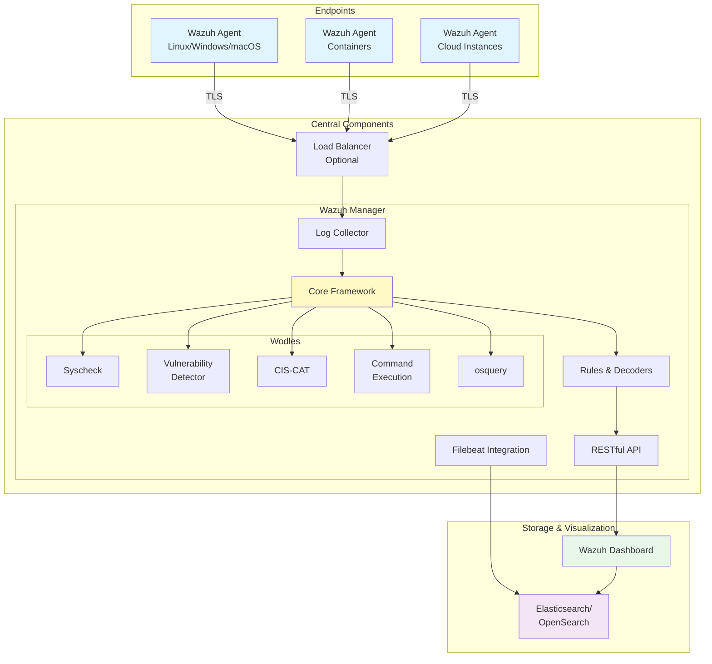
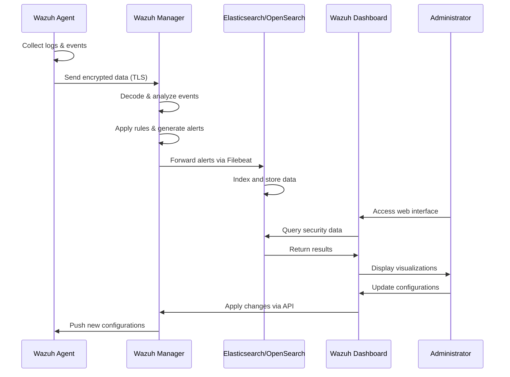
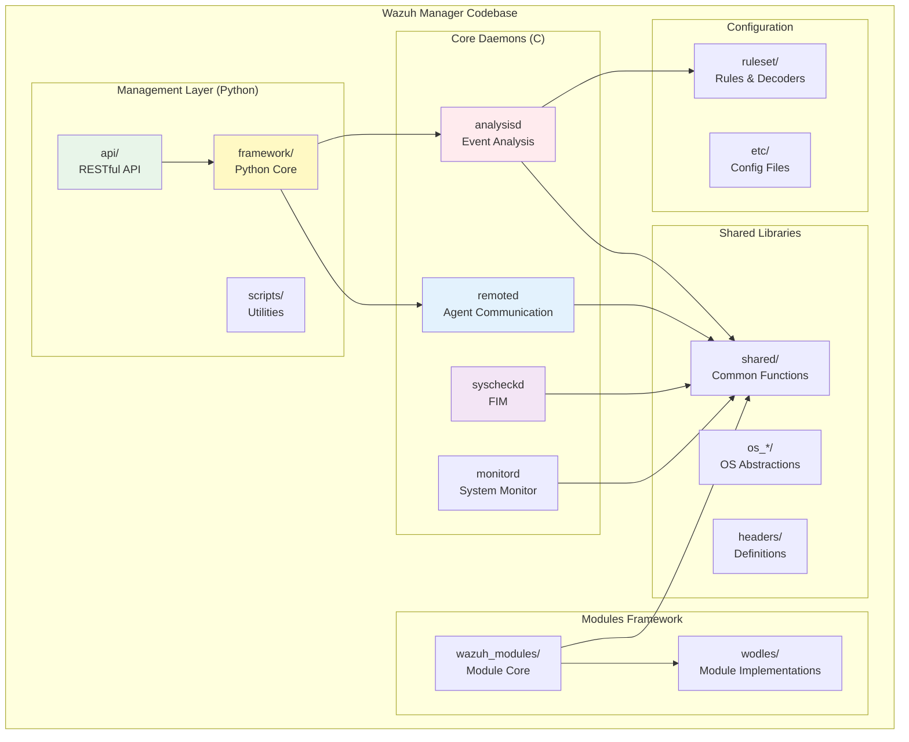
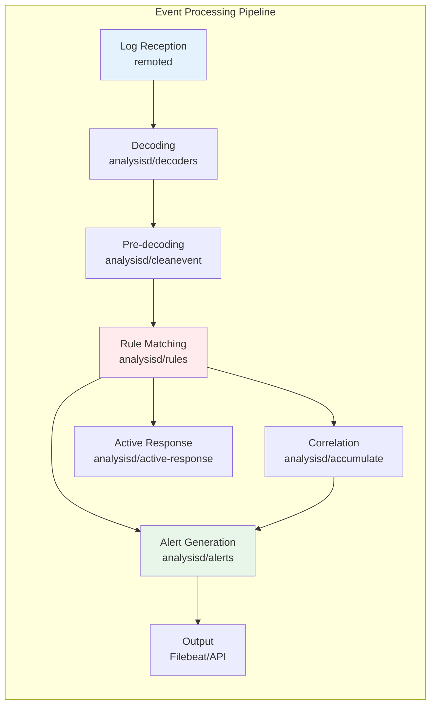

## Table of Contents

## Introduction

This document provides a comprehensive overview of the Wazuh security platform (v4.11.2), including its high-level architecture, component relationships, data flows, codebase organization, and security considerations. Wazuh is an open-source security monitoring solution that provides threat detection, integrity monitoring, incident response, and compliance capabilities.

## System Architecture

The Wazuh security monitoring platform consists of several interconnected components that work together to provide comprehensive security monitoring capabilities:



## Component Descriptions

### External Components

#### Wazuh Agent
- **Purpose**: Lightweight security monitor deployed on endpoints (servers, workstations, containers)
- **Functions**: 
  - Collects system logs, application logs, and security events
  - Performs file integrity monitoring and security configuration assessment
  - Executes active response actions
  - Communicates with the Wazuh Manager using an encrypted channel (TLS)

#### Load Balancer (Optional)
- **Purpose**: Distributes agent connections across multiple Wazuh Managers
- **Benefits**: Provides high availability and scalability for large-scale deployments
- **Implementation**: Typically uses HAProxy, Nginx, or cloud-based load balancers

#### Wazuh Dashboard
- **Purpose**: Web-based user interface for visualization and management
- **Features**:
  - Real-time alert visualization
  - Compliance dashboards
  - Agent management interface
  - Rule and decoder configuration
- **Technology**: Built on OpenSearch Dashboards or modified Kibana

#### Indexer/Storage
- **Purpose**: Elasticsearch or OpenSearch for storing and indexing security events
- **Capabilities**:
  - Fast search across large volumes of security data
  - Historical analysis and trending
  - Data retention policies
  - Integration with visualization tools

### Central Components (Wazuh Manager)

#### Log Collector
- **Function**: Receives and decodes logs from agents
- **Processing**: Initial parsing and normalization of events
- **Output**: Prepares events for processing by the core framework

#### Core Framework
- **Role**: Central event processing engine
- **Features**:
  - Event pipeline management
  - Module coordination
  - Common utilities and libraries
  - Memory and resource management

#### Rules & Decoders
- **Decoders**: Extract relevant fields from raw logs
- **Rules**: Match patterns to identify security events
- **Format**: XML-based configuration files
- **Customization**: Supports custom rules for specific security use cases

#### Dynamic Modules ("Wodles")
Specialized security modules that extend functionality:

- **Syscheck**: File integrity monitoring (FIM)
- **Vulnerability Detector**: CVE scanning and vulnerability assessment
- **CIS-CAT**: Compliance assessment against CIS benchmarks
- **Command Execution**: Active response and remediation actions
- **osquery**: Advanced endpoint queries using Facebook's osquery

#### RESTful API
- **Purpose**: Provides programmatic access to the Wazuh Manager
- **Functions**:
  - Agent management (registration, status, configuration)
  - Rule and decoder management
  - Alert queries and statistics
  - System configuration
- **Security**: Token-based authentication, HTTPS encryption

#### Filebeat Integration
- **Purpose**: Forwards alerts to the indexer (Elasticsearch/OpenSearch)
- **Features**:
  - Reliable delivery with acknowledgments
  - Data buffering during indexer outages
  - Lightweight resource usage

## Security Data Flow

The security data flow in Wazuh follows this sequence:



1. **Data Collection**: Agents collect logs and security events from endpoints
2. **Secure Transport**: Data is sent to the Manager using TLS encryption
3. **Event Processing**: The Manager processes events through its analysis pipeline
4. **Alert Generation**: Matching events trigger alerts based on rule definitions
5. **Data Indexing**: Alerts and events are stored in Elasticsearch/OpenSearch
6. **Visualization**: The Dashboard queries and displays security information
7. **Management**: Configuration changes flow from Dashboard through API to Agents

## Deployment Models

### Small Deployment

For small environments (< 50 agents):
- Single Wazuh Manager server
- Elasticsearch/OpenSearch on the same server
- Wazuh Dashboard co-located
- Suitable for testing and small production environments

### Distributed Deployment

For large environments (> 100 agents):
- Multiple Wazuh Managers in cluster mode
- Dedicated Elasticsearch/OpenSearch cluster
- Load balancer for agent connections
- Separate Dashboard servers
- High availability configuration

## Wazuh Codebase Architecture

### Codebase Organization

The Wazuh codebase is organized into several major directories:

```
wazuh/
├── src/                    # Core C codebase
│   ├── analysisd/         # Event analysis daemon
│   ├── remoted/           # Remote daemon (agent communication)
│   ├── syscheckd/         # File integrity monitoring
│   ├── wazuh_modules/     # Wazuh modules framework
│   ├── shared/            # Common libraries
│   ├── headers/           # Shared header files
│   ├── monitord/          # Monitoring daemon
│   └── os_*/              # OS-specific libraries
├── framework/             # Python framework
│   ├── core/              # Core Python libraries
│   ├── wazuh/             # Main Wazuh Python package
│   └── scripts/           # Utility scripts
├── api/                   # RESTful API
│   ├── framework/         # API framework code
│   └── scripts/           # API scripts
├── ruleset/               # Rules and decoders
│   ├── rules/             # XML rule definitions
│   ├── decoders/          # XML decoder definitions
│   └── lists/             # CDB list files
├── wodles/                # Wazuh modules
│   ├── aws/               # AWS integration
│   ├── azure/             # Azure integration
│   ├── gcp/               # GCP integration
│   ├── docker/            # Docker monitoring
│   └── oscap/             # OpenSCAP integration
├── integrations/          # External integrations
│   ├── virustotal/        # VirusTotal integration
│   ├── pagerduty/         # PagerDuty integration
│   └── slack/             # Slack notifications
└── tests/                 # Test suite
```

### Manager Component Architecture



### Event Processing Workflow



### Core Components Detailed

#### Analysisd (Event Analysis Engine)

Key source files:
- `analysisd/analysisd.c` - Main daemon initialization
- `analysisd/decoder.c` - Log message decoding logic
- `analysisd/rules.c` - Rule matching engine
- `analysisd/eventinfo.c` - Event information structure
- `analysisd/accumulate.c` - Event correlation
- `analysisd/alerts.c` - Alert generation and formatting
- `analysisd/lists.c` - CDB list handling

#### Remoted (Agent Communication)

Key source files:
- `remoted/remoted.c` - Main daemon initialization
- `remoted/manager.c` - Agent management
- `remoted/secure.c` - Secure communication
- `remoted/sendmsg.c` - Message sending to agents
- `remoted/netbuffer.c` - Network buffer management

#### Wazuh Modules Framework

Key source files:
- `wazuh_modules/wmodules.c` - Main module initialization
- `wazuh_modules/wm_control.c` - Module control interface
- `wazuh_modules/wm_threadpool.c` - Thread pool implementation
- Individual modules in `wodles/` directory

## Security Considerations

### Authentication & Authorization
- **Agent Authentication**: TLS client certificates for agent-manager authentication
- **User Authentication**: Strong authentication for dashboard users
- **API Security**: Token-based authentication with role-based access control
- **Key Management**: Secure storage and rotation of authentication keys

### Encryption
- **Transport Security**: TLS 1.2+ for all communications
- **Certificate Management**: Proper certificate rotation and validation
- **Data at Rest**: Encryption for sensitive data in the indexer
- **Key Storage**: Hardware security modules (HSM) for production environments

### Integrity Verification
- **Binary Integrity**: Verify agent binary signatures
- **Configuration Signing**: Digital signatures for configurations
- **Rule Updates**: Checksums for ruleset updates
- **Secure Boot**: Where supported by the platform

### Network Security
- **Network Segmentation**: Separate management and monitoring networks
- **Firewall Rules**: Restrict communication to necessary ports
- **VPN Integration**: Support for remote agents over VPN
- **Traffic Analysis**: Monitor for anomalous communication patterns

### Regular Updates
- **Component Updates**: Keep all components current
- **Security Patches**: Apply patches within defined SLAs
- **Rule Updates**: Regular updates to detection rules
- **Threat Intelligence**: Integration with threat feeds

## Integration Points

Wazuh provides several integration points for extending its capabilities:

### RESTful API
- Custom management tools and automation
- Integration with ticketing systems
- Automated response workflows
- Custom dashboards and reporting

### Custom Rules and Decoders
- Organization-specific detection logic
- Proprietary log format parsing
- Business logic security rules
- Compliance-specific checks

### Alert Integration
- SIEM platforms
- SOAR (Security Orchestration, Automation, and Response)
- Ticketing systems (ServiceNow, Jira)
- Communication platforms (Slack, Teams)

### Custom Modules (Wodles)
- Cloud provider integrations
- Custom vulnerability scanners
- Specialized compliance checks
- Third-party security tools

## Performance Optimization

### Manager Optimization
- **Rule Optimization**: Organize rules by frequency and complexity
- **Decoder Efficiency**: Use parent-child decoder relationships
- **Memory Management**: Configure appropriate memory limits
- **Thread Tuning**: Adjust worker threads based on load

### Storage Optimization
- **Index Management**: Implement index lifecycle policies
- **Data Retention**: Define retention based on compliance needs
- **Shard Strategy**: Optimize shard count and size
- **Query Performance**: Use appropriate field mappings

### Network Optimization
- **Compression**: Enable compression for agent communication
- **Batch Processing**: Configure appropriate batch sizes
- **Connection Pooling**: Optimize connection pool settings
- **Geographic Distribution**: Deploy regional managers

## Troubleshooting Guide

### Common Issues

#### Agent Connection Problems
- Verify network connectivity
- Check firewall rules
- Validate certificates
- Review agent logs

#### High Resource Usage
- Check rule complexity
- Review decoder efficiency
- Analyze event volumes
- Optimize configurations

#### Alert Delays
- Monitor queue sizes
- Check processing backlogs
- Verify indexer performance
- Review rule priorities

### Diagnostic Tools
- `wazuh-control`: Service management
- `agent_control`: Agent status and management
- `wazuh-logtest`: Rule and decoder testing
- `cluster_control`: Cluster status monitoring

## Best Practices

### Deployment
1. Start with a pilot deployment
2. Document your architecture
3. Implement proper change management
4. Plan for growth and scalability

### Configuration
1. Use configuration management tools
2. Version control for rules and decoders
3. Test changes in non-production first
4. Document custom configurations

### Monitoring
1. Monitor Wazuh component health
2. Track resource utilization trends
3. Set up alerting for critical issues
4. Regular performance reviews

### Security
1. Regular security assessments
2. Penetration testing
3. Compliance audits
4. Incident response procedures

## Conclusion

Wazuh provides a comprehensive security monitoring solution with a modular, scalable architecture. Its design supports everything from small single-server deployments to large distributed clusters. The codebase is well-organized with clear separation between core components, modules, and management layers.

By understanding both the high-level architecture and the underlying codebase structure, organizations can effectively deploy, customize, and maintain Wazuh as a core component of their security strategy. The platform's extensibility through APIs, custom rules, and modules makes it adaptable to various security requirements and environments.

This architecture overview is based on Wazuh v4.11.2. For the most current information and detailed implementation guides, please refer to the [official Wazuh documentation](https://documentation.wazuh.com/).