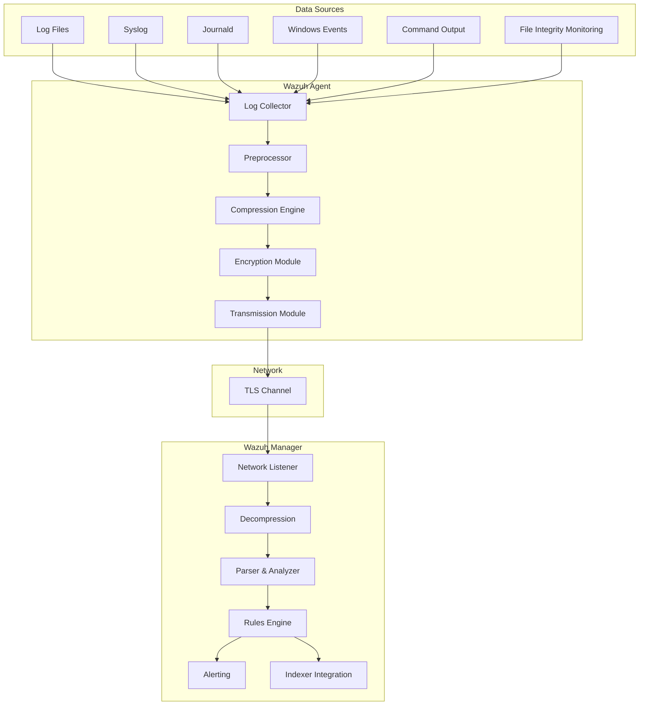
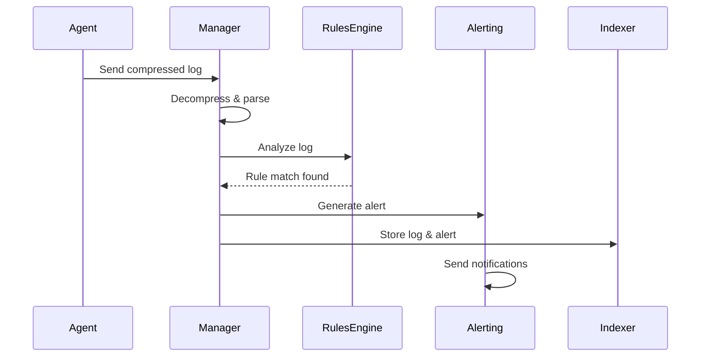

# Wazuh Log Collection and Transmission: Complete Architecture Guide

This comprehensive guide explores Wazuh's sophisticated log collection and transmission architecture, detailing how logs flow from various sources through the agent to the manager for security analysis and alerting.

## Overview of the Log Collection and Transmission Process

Wazuh is designed to ingest logs from multiple sources, providing comprehensive security monitoring across enterprise environments. The system handles various input types including:

- **Log Files**: Monitored continuously for changes
- **Syslog**: Capturing network syslog data
- **Journald**: Integrating with systemd's journal
- **Windows Event Logs**: Real-time Windows security events
- **Command Output**: Periodic command execution monitoring
- **FIM (File Integrity Monitoring)**: Real-time file change detection

These various inputs are handled by the agent, which uses modular components to read, preprocess, and optionally compress the data before securely forwarding it to the manager.

## Architecture Overview



## How Logs Are Processed and Sent

### 1. Collection at the Agent

#### Log Data Collection Engine

The agent continuously monitors log files, syslog streams, and journald outputs using dedicated modules. Each module handles its source type through tailored configuration parameters:

**File Monitoring Module:**
```xml
<ossec_config>
  <localfile>
    <log_format>syslog</log_format>
    <location>/var/log/auth.log</location>
  </localfile>
  
  <localfile>
    <log_format>apache</log_format>
    <location>/var/log/apache2/access.log</location>
  </localfile>
</ossec_config>
```

**Syslog Module:**
```xml
<ossec_config>
  <remote>
    <connection>syslog</connection>
    <port>514</port>
    <protocol>udp</protocol>
    <allowed-ips>192.168.1.0/24</allowed-ips>
  </remote>
</ossec_config>
```

#### Preprocessing and Parsing

Once data is collected, it is preprocessed and parsed. This step ensures that logs are structured, enriched, and validated before further processing:

```c
// Simplified C code representation of log preprocessing
typedef struct {
    char *raw_log;
    char *source;
    time_t timestamp;
    char *hostname;
    int severity;
    char *parsed_fields[MAX_FIELDS];
} log_entry_t;

int preprocess_log(log_entry_t *entry) {
    // Extract timestamp
    parse_timestamp(entry->raw_log, &entry->timestamp);
    
    // Extract hostname
    extract_hostname(entry->raw_log, entry->hostname);
    
    // Parse structured fields
    parse_fields(entry->raw_log, entry->parsed_fields);
    
    // Validate and sanitize
    return validate_log_entry(entry);
}
```

### 2. Optional Compression

#### Compression for Efficiency

To reduce network overhead and improve performance, the agent can compress log payloads using standard compression libraries:

```c
#include <zlib.h>

typedef struct {
    unsigned char *data;
    size_t size;
    size_t compressed_size;
    int compression_level;
} compression_buffer_t;

// Compression function using zlib
int compress_log_data(const char *input, size_t input_size, 
                      char *output, size_t *output_size) {
    
    uLongf compressed_size = *output_size;
    int result = compress2((Bytef *)output, &compressed_size,
                          (const Bytef *)input, input_size,
                          Z_DEFAULT_COMPRESSION);
    
    if (result == Z_OK) {
        *output_size = compressed_size;
        return 0; // Success
    }
    
    return -1; // Error
}

// Example usage in agent
void send_compressed_log(const char* log_message) {
    char compressed_data[MAX_COMPRESSED_SIZE];
    size_t compressed_size = sizeof(compressed_data);
    
    if (compress_log_data(log_message, strlen(log_message), 
                         compressed_data, &compressed_size) == 0) {
        
        // Add compression header
        compression_header_t header = {
            .magic = COMPRESSION_MAGIC,
            .algorithm = ZLIB_COMPRESSION,
            .original_size = strlen(log_message),
            .compressed_size = compressed_size
        };
        
        // Send header + compressed data
        send_secure_data(&header, sizeof(header));
        send_secure_data(compressed_data, compressed_size);
    }
}
```

#### Benefits of Compression

1. **Bandwidth Reduction**: Up to 70-80% reduction in network traffic
2. **Faster Transmission**: Less data to transmit over WAN connections
3. **Cost Savings**: Reduced bandwidth costs for cloud deployments
4. **Scalability**: Support for more agents with same network infrastructure

### 3. Secure Transmission

#### Transport Layer Security

The agent forwards the (compressed) log data over a secure channel using TLS encryption:

```c
#include <openssl/ssl.h>
#include <openssl/err.h>

typedef struct {
    SSL_CTX *ctx;
    SSL *ssl;
    int socket_fd;
    char *server_cert;
    char *client_cert;
    char *client_key;
} secure_connection_t;

// Establish secure connection to manager
secure_connection_t* establish_secure_connection(const char *server_address, int port) {
    secure_connection_t *conn = malloc(sizeof(secure_connection_t));
    
    // Initialize SSL context
    conn->ctx = SSL_CTX_new(TLSv1_2_client_method());
    
    // Load certificates
    SSL_CTX_use_certificate_file(conn->ctx, conn->client_cert, SSL_FILETYPE_PEM);
    SSL_CTX_use_PrivateKey_file(conn->ctx, conn->client_key, SSL_FILETYPE_PEM);
    
    // Create socket and connect
    conn->socket_fd = create_socket_connection(server_address, port);
    
    // Create SSL connection
    conn->ssl = SSL_new(conn->ctx);
    SSL_set_fd(conn->ssl, conn->socket_fd);
    
    if (SSL_connect(conn->ssl) != 1) {
        // Handle connection error
        cleanup_connection(conn);
        return NULL;
    }
    
    return conn;
}

// Send encrypted log data
int send_encrypted_log(secure_connection_t *conn, const void *data, size_t size) {
    return SSL_write(conn->ssl, data, size);
}
```

#### Multiple-Socket Outputs

Wazuh's architecture supports multiple-socket outputs for enhanced reliability:

```c
typedef struct {
    secure_connection_t *primary;
    secure_connection_t *secondary;
    secure_connection_t *backup;
    int active_connection;
} multi_socket_manager_t;

int send_with_failover(multi_socket_manager_t *manager, const void *data, size_t size) {
    secure_connection_t *connections[] = {
        manager->primary,
        manager->secondary, 
        manager->backup
    };
    
    for (int i = 0; i < 3; i++) {
        if (connections[i] && send_encrypted_log(connections[i], data, size) > 0) {
            manager->active_connection = i;
            return 1; // Success
        }
    }
    
    return 0; // All connections failed
}
```

### 4. Reception and Processing at the Manager

#### Receiving the Data

The manager runs a network listener that accepts incoming connections from agents:

```c
#include <pthread.h>

typedef struct {
    int port;
    SSL_CTX *ssl_ctx;
    pthread_t listener_thread;
    agent_pool_t *agent_pool;
} network_listener_t;

void* connection_handler(void *arg) {
    connection_context_t *ctx = (connection_context_t *)arg;
    
    char buffer[MAX_BUFFER_SIZE];
    int bytes_received;
    
    while ((bytes_received = SSL_read(ctx->ssl, buffer, sizeof(buffer))) > 0) {
        // Process received data
        process_agent_data(ctx->agent_id, buffer, bytes_received);
    }
    
    cleanup_connection(ctx);
    return NULL;
}

// Main listener function
void start_network_listener(network_listener_t *listener) {
    int server_socket = create_server_socket(listener->port);
    
    while (1) {
        int client_socket = accept(server_socket, NULL, NULL);
        
        // Create SSL connection
        SSL *ssl = SSL_new(listener->ssl_ctx);
        SSL_set_fd(ssl, client_socket);
        
        if (SSL_accept(ssl) == 1) {
            // Authenticate agent
            char agent_id[MAX_AGENT_ID];
            if (authenticate_agent(ssl, agent_id)) {
                // Create connection context
                connection_context_t *ctx = create_connection_context(ssl, agent_id);
                
                // Spawn handler thread
                pthread_create(&ctx->thread, NULL, connection_handler, ctx);
            }
        }
    }
}
```

#### Decompression and Parsing

If logs were compressed, the manager uses complementary decompression routines:

```c
// Decompression function using zlib
int decompress_log_data(const char *input, size_t input_size, 
                       char *output, size_t *output_size) {
    
    uLongf decompressed_size = *output_size;
    int result = uncompress((Bytef *)output, &decompressed_size,
                           (const Bytef *)input, input_size);
    
    if (result == Z_OK) {
        *output_size = decompressed_size;
        return 0; // Success
    }
    
    return -1; // Error
}

// Process incoming agent data
void process_agent_data(const char *agent_id, const char *data, size_t size) {
    // Check if data is compressed
    compression_header_t *header = (compression_header_t *)data;
    
    if (header->magic == COMPRESSION_MAGIC) {
        // Decompress data
        char *decompressed_data = malloc(header->original_size);
        size_t decompressed_size = header->original_size;
        
        if (decompress_log_data(data + sizeof(compression_header_t),
                               header->compressed_size,
                               decompressed_data,
                               &decompressed_size) == 0) {
            
            // Parse decompressed log
            parse_and_analyze_log(agent_id, decompressed_data, decompressed_size);
        }
        
        free(decompressed_data);
    } else {
        // Process uncompressed data
        parse_and_analyze_log(agent_id, data, size);
    }
}
```

#### Log Analysis and Alerting

The manager applies its log analysis engine using configuration rules:

```c
typedef struct {
    int rule_id;
    char *pattern;
    int severity;
    char *description;
    regex_t compiled_regex;
} analysis_rule_t;

typedef struct {
    analysis_rule_t *rules;
    int rule_count;
    hash_table_t *rule_cache;
} rules_engine_t;

// Analyze log against rules
alert_t* analyze_log_entry(rules_engine_t *engine, log_entry_t *log) {
    for (int i = 0; i < engine->rule_count; i++) {
        analysis_rule_t *rule = &engine->rules[i];
        
        if (regexec(&rule->compiled_regex, log->raw_log, 0, NULL, 0) == 0) {
            // Rule matched - create alert
            alert_t *alert = create_alert(rule, log);
            
            // Enrich alert with additional context
            enrich_alert(alert, log);
            
            return alert;
        }
    }
    
    return NULL; // No rules matched
}

// Main log processing function
void parse_and_analyze_log(const char *agent_id, const char *log_data, size_t size) {
    log_entry_t *log = parse_log_entry(log_data, size);
    
    if (log) {
        // Add agent context
        strcpy(log->agent_id, agent_id);
        
        // Analyze against rules
        alert_t *alert = analyze_log_entry(&global_rules_engine, log);
        
        if (alert) {
            // Forward alert to output modules
            forward_alert(alert);
            
            // Store in database/indexer
            store_alert(alert);
        }
        
        // Always store raw log for forensics
        store_raw_log(log);
        
        free_log_entry(log);
    }
}
```

## Advanced Features

### 1. Real-time Analysis Pipeline



### 2. Log Correlation and Intelligence

```c
typedef struct correlation_context {
    hash_table_t *event_cache;
    time_window_t *time_windows;
    correlation_rule_t *rules;
    int rule_count;
} correlation_context_t;

// Advanced correlation analysis
alert_t* correlate_events(correlation_context_t *ctx, log_entry_t *new_log) {
    // Check for related events in time window
    event_list_t *related_events = find_related_events(ctx->event_cache, new_log);
    
    if (related_events->count > 0) {
        // Apply correlation rules
        for (int i = 0; i < ctx->rule_count; i++) {
            correlation_rule_t *rule = &ctx->rules[i];
            
            if (evaluate_correlation_rule(rule, related_events, new_log)) {
                // Create correlation alert
                return create_correlation_alert(rule, related_events, new_log);
            }
        }
    }
    
    // Cache this event for future correlation
    cache_event(ctx->event_cache, new_log);
    
    return NULL;
}
```

### 3. Performance Optimization

```c
// Lock-free queue for high-throughput log processing
typedef struct {
    atomic_uint head;
    atomic_uint tail;
    log_entry_t *buffer[QUEUE_SIZE];
    uint32_t mask;
} lockfree_queue_t;

// Multi-threaded log processor
typedef struct {
    lockfree_queue_t *input_queue;
    pthread_t *worker_threads;
    int worker_count;
    rules_engine_t *rules_engine;
} log_processor_t;

void* log_worker_thread(void *arg) {
    log_processor_t *processor = (log_processor_t *)arg;
    log_entry_t *log;
    
    while (1) {
        // Non-blocking dequeue
        if (dequeue(processor->input_queue, &log)) {
            // Process log entry
            alert_t *alert = analyze_log_entry(processor->rules_engine, log);
            
            if (alert) {
                forward_alert(alert);
            }
            
            free_log_entry(log);
        } else {
            // No work available, yield CPU
            sched_yield();
        }
    }
    
    return NULL;
}
```

## Configuration Examples

### Agent Configuration

```xml
<ossec_config>
  <client>
    <server>
      <address>wazuh-manager.company.com</address>
      <port>1514</port>
      <protocol>tcp</protocol>
    </server>
    <config-profile>centos, centos7</config-profile>
    <notify_time>10</notify_time>
    <time-reconnect>60</time-reconnect>
    <auto_restart>yes</auto_restart>
    <crypto_method>aes</crypto_method>
  </client>

  <client_buffer>
    <disabled>no</disabled>
    <queue_size>5000</queue_size>
    <events_per_second>500</events_per_second>
  </client_buffer>

  <!-- Log file monitoring -->
  <localfile>
    <log_format>syslog</log_format>
    <location>/var/log/auth.log</location>
  </localfile>

  <localfile>
    <log_format>syslog</log_format>
    <location>/var/log/syslog</location>
  </localfile>

  <localfile>
    <log_format>apache</log_format>
    <location>/var/log/apache2/access.log</location>
  </localfile>

  <!-- Command monitoring -->
  <localfile>
    <log_format>command</log_format>
    <command>df -P</command>
    <alias>df -P</alias>
    <frequency>360</frequency>
  </localfile>

  <!-- File integrity monitoring -->
  <syscheck>
    <directories>/etc,/usr/bin,/usr/sbin</directories>
    <directories>/bin,/sbin,/boot</directories>
    <ignore>/etc/mtab</ignore>
    <ignore>/etc/hosts.deny</ignore>
    <ignore>/etc/mail/statistics</ignore>
    <ignore>/etc/random-seed</ignore>
    <frequency>79200</frequency>
  </syscheck>
</ossec_config>
```

### Manager Configuration

```xml
<ossec_config>
  <global>
    <jsonout_output>yes</jsonout_output>
    <alerts_log>yes</alerts_log>
    <logall>no</logall>
    <logall_json>no</logall_json>
    <email_notification>yes</email_notification>
    <smtp_server>smtp.company.com</smtp_server>
    <email_from>wazuh@company.com</email_from>
    <email_to>security@company.com</email_to>
    <hostname>wazuh-manager</hostname>
    <queue_size>131072</queue_size>
  </global>

  <remote>
    <connection>secure</connection>
    <port>1514</port>
    <protocol>tcp</protocol>
    <queue_size>16384</queue_size>
  </remote>

  <analysisd>
    <memory_size>8192</memory_size>
    <log_fw>yes</log_fw>
    <pre_match>yes</pre_match>
  </analysisd>

  <!-- Compression settings -->
  <logging>
    <log_format>plain</log_format>
  </logging>

  <!-- Integration with indexer -->
  <integration>
    <name>opensearch</name>
    <level>3</level>
    <alert_format>json</alert_format>
    <api_url>https://wazuh-indexer:9200</api_url>
    <api_user>admin</api_user>
    <api_pass>SecurePassword123!</api_pass>
  </integration>
</ossec_config>
```

## Performance Metrics and Monitoring

### Key Performance Indicators

```bash
#!/bin/bash
# Wazuh performance monitoring script

# Agent metrics
echo "=== Agent Performance ==="
echo "Events per second: $(wazuh-logtest -q | grep 'Events processed' | tail -1)"
echo "Queue utilization: $(cat /var/ossec/var/run/ossec-agent.stats | grep queue)"

# Manager metrics  
echo "=== Manager Performance ==="
echo "Alerts per second: $(cat /var/ossec/logs/alerts/alerts.log | tail -100 | wc -l)"
echo "Analysis queue: $(cat /var/ossec/var/run/ossec-analysisd.stats | grep queue)"
echo "Remote queue: $(cat /var/ossec/var/run/ossec-remoted.stats | grep queue)"

# Compression metrics
echo "=== Compression Performance ==="
echo "Compression ratio: $(cat /var/ossec/logs/ossec.log | grep 'compression' | tail -1)"
echo "Network bytes saved: $(cat /var/ossec/var/run/compression.stats 2>/dev/null || echo 'N/A')"
```

## Summary

Wazuh's log collection and transmission process provides:

1. **Comprehensive Data Ingestion**: Support for multiple log sources and formats
2. **Efficient Compression**: Significant bandwidth reduction using zlib compression
3. **Secure Transmission**: TLS-encrypted communication with certificate-based authentication
4. **Robust Processing**: Multi-threaded analysis with real-time correlation
5. **High Availability**: Multiple-socket outputs and failover mechanisms
6. **Scalable Architecture**: Lock-free queues and parallel processing for high throughput

The modular architecture ensures that each component can be optimized independently while maintaining overall system reliability and performance. The optional compression significantly reduces network overhead, making Wazuh suitable for large-scale deployments across WAN connections.

This end-to-end process enables organizations to collect, transmit, and analyze security events in real-time, providing comprehensive visibility into their security posture while maintaining high performance and reliability standards.