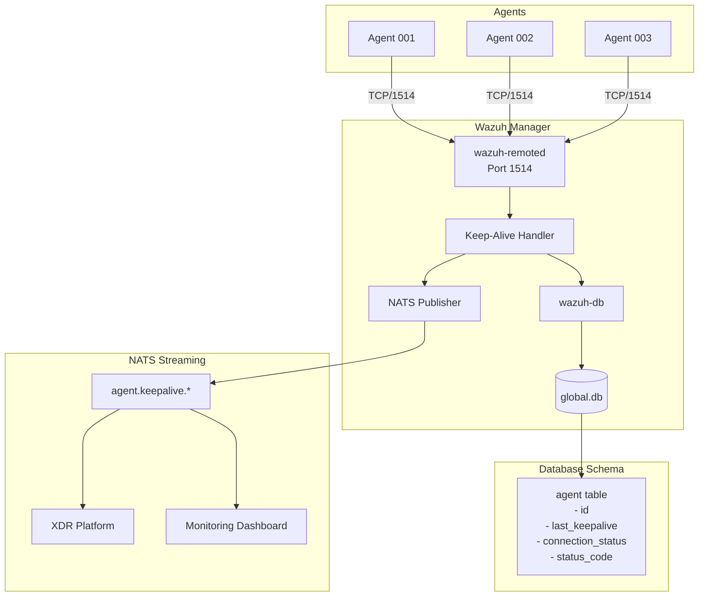

## Table of contents

## 1. Primary Daemon: wazuh-remoted

The `wazuh-remoted` daemon is the core component responsible for agent communication and keep-alive management. It maintains persistent connections with agents and handles the bidirectional keep-alive mechanism using the `handle_agent_connection()` and `wdb_update_agent_keepalive()` functions.

**Location**: The remoted daemon operates under the wazuh user within the chroot environment at `/var/ossec`, managing all agent communication on port 1514/TCP by default.

## 2. Keep-Alive Storage - Database Layer

**Main Database**: Keep-alive timestamps and agent connection states are stored in `/var/ossec/queue/db/global.db` (SQLite database) within the agent table.

**Key Tables**:

- **agent table**: Stores `last_keepalive`, `connection_status`, and `status_code` fields
- **belongs table**: Maps agents to groups for bulk keep-alive operations
- Individual agent databases at `/var/ossec/queue/db/{AGENT_ID}.db` contain sync status and module-specific keep-alive data

## 3. Key Configuration Files

**Manager Configuration**: Keep-alive settings are configured in `/var/ossec/etc/ossec.conf` under the `<remote>` section:

```xml
<remote>
  <connection>secure</connection>
  <port>1514</port>
  <protocol>tcp</protocol>
  <manager_keepalive>
    <enabled>yes</enabled>
    <interval>60</interval>
    <timeout>180</timeout>
  </manager_keepalive>
</remote>
```

**NATS Integration**: XDR/OXDR platform connectivity configured in the `<nats>` section for real-time keep-alive event publishing.

## 4. Keep-Alive Mechanisms

**Connection Status States**: Manager tracks agents through multiple keep-alive states:

- **AGENT_CS_ACTIVE**: Agent responding to keep-alive requests
- **AGENT_CS_DISCONNECTED**: No response within timeout period
- **AGENT_CS_PENDING**: Waiting for keep-alive acknowledgment
- **AGENT_CS_UNKNOWN**: Initial state or connection error

**Status Verification Tools**:

- `/var/ossec/bin/agent_control -l` displays agent keep-alive status
- `/var/ossec/bin/agent_control -i <AGENT_ID>` shows last keep-alive timestamp
- `/var/ossec/bin/wazuh-db` provides database-level keep-alive queries
- Keep-alive events published to NATS subjects for XDR platform consumption

## 5. Source Code Structure

Based on the daemon architecture and functionality, the key source components for keep-alive management are located in:

- `src/remoted/remoted.c` - Main remote daemon with keep-alive logic
- `src/remoted/keepalive_scheduler.c` - Manager-side keep-alive scheduling (new component)
- `src/wazuh_db/wdb.c` - Database operations for keep-alive timestamps
- `src/nats_integration/keepalive_events.c` - NATS publishing for XDR integration (new component)
- `src/config/remote-config.c` - Keep-alive configuration parsing
- `src/shared/agent_status.h` - Shared definitions for agent status constants

## Architecture Diagram



## Agent Status Management Components

### 1. Primary Daemon: wazuh-remoted

The `wazuh-remoted` daemon is the core server-side component that manages agent communication and status. It handles the agent keepalive mechanism and updates agent status using the `wdb_update_agent_keepalive(agent_id, AGENT_CS_ACTIVE, ...)` function.

**Location**: The remoted daemon runs by default as the wazuh user and is chrooted to `/var/ossec`.

### 2. Agent Status Storage - Database Layer

**Main Database**: Agent status information is stored in `/var/ossec/queue/db/global.db` (SQLite database)

**Individual Agent Databases**: Each agent also has its own SQLite database at `/var/ossec/queue/db/{AGENT_ID}.db` for inventory and module-specific data. These contain tables like `metadata`, `sync_info`, `scan_info`, etc.

### 3. Key Configuration Files

**Agent Keys**: Agent authentication keys are stored in `/var/ossec/etc/client.keys`. When agents are removed, they can be marked as removed in this file or purged entirely based on configuration.

**Connection Configuration**: The manager's connection service is configured in `/var/ossec/etc/ossec.conf` under the `<remote>` section, typically listening on port 1514/TCP for secure agent connections.

### 4. Agent Status Mechanisms

**Connection Status**: Agents report their status through multiple states:

- **pending**: Waiting for acknowledgment from manager
- **disconnected**: No acknowledgment in last 60 seconds
- **connected**: Acknowledged connection established

**Status Verification Tools**:

- `/var/ossec/bin/agent_control -l` lists all agents and their status
- `/var/ossec/bin/agent_control -i <AGENT_ID>` shows specific agent status
- Agent state is also tracked in `/var/ossec/var/run/wazuh-agentd.state` on the agent side

### 5. Security Architecture Perspective

From a threat modeling standpoint (aligning with your XDR/OXDR focus), the agent status management involves several critical security components:

- **Authentication**: Client keys provide mutual authentication between agents and manager
- **Encryption**: Communication uses AES encryption (128-bit blocks, 256-bit keys) by default
- **State Management**: The remoted daemon maintains persistent connection state to detect agent compromises or network issues
- **Database Integrity**: The wazuh-db daemon manages database synchronization and includes vacuum operations for maintenance

### 6. Source Code Structure

While I couldn't directly access the v4.12.0 source tree, based on the error messages and daemon references, the key source components are likely in:

- `src/remoted/` - Remote daemon handling agent connections
- `src/wazuh_db/` - Database management components
- `src/shared/` - Shared libraries for agent communication

The agent status is primarily managed through the remoted daemon with persistent storage in SQLite databases under `/var/ossec/queue/db/`, providing both real-time connection tracking and historical agent state information for your security automation workflows.
