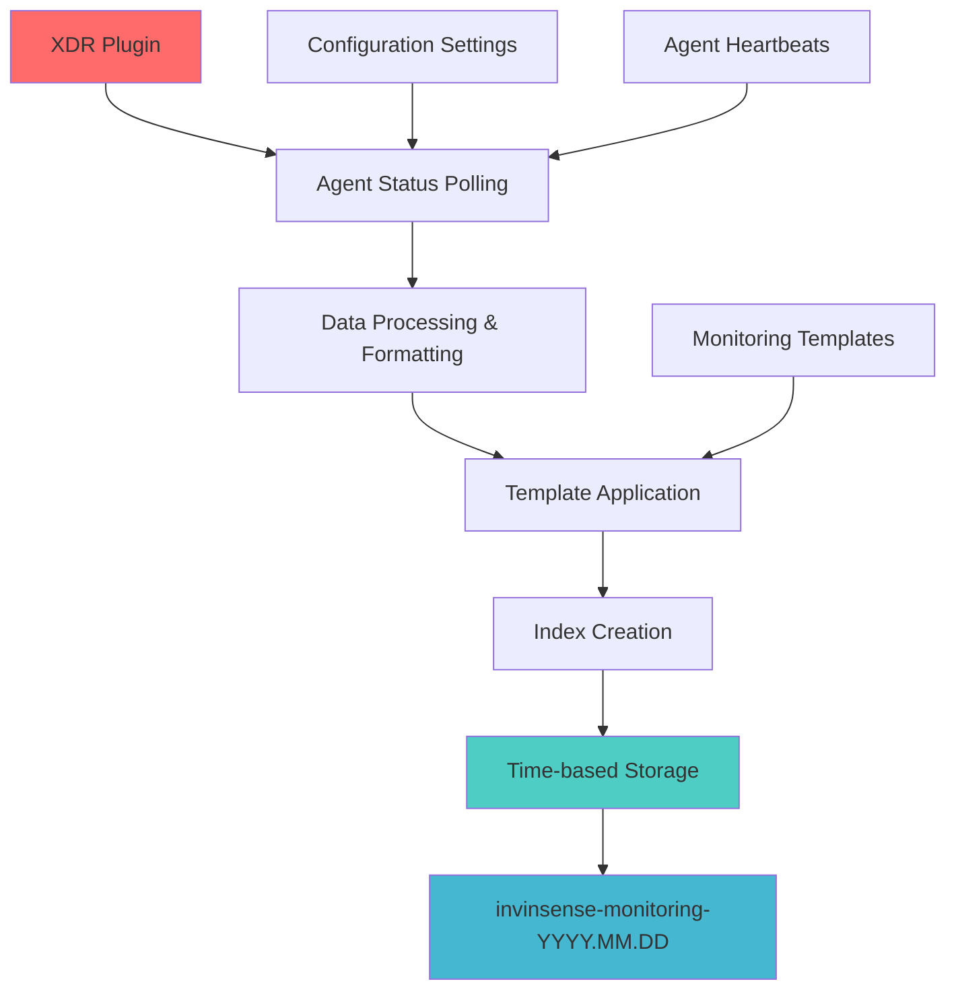
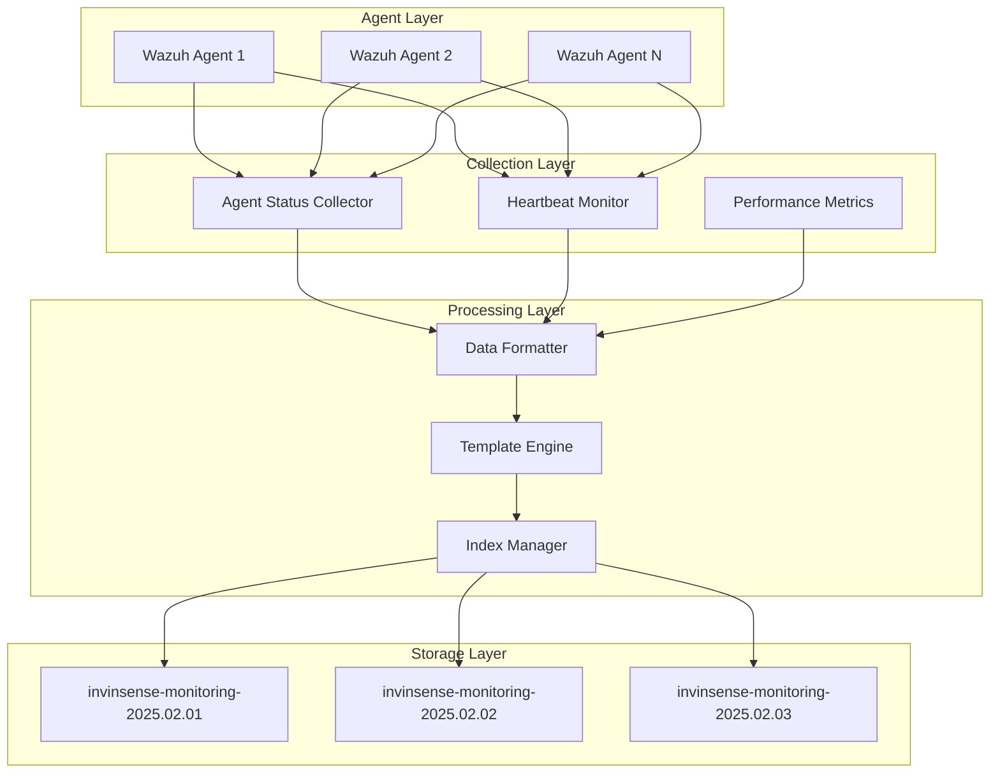

# Wazuh Monitoring Index Patterns

This guide provides comprehensive documentation for Wazuh monitoring index patterns, focusing on the invinsense-monitoring indices and their role in XDR (Extended Detection and Response) data management. Understanding these patterns is crucial for effective security monitoring and incident response.

## Table of Contents

## Understanding Monitoring Index Patterns

The monitoring indices (`invinsense-monitoring-*`) are generated through a systematic process that ensures comprehensive agent status tracking and security event monitoring. These indices form the backbone of the XDR platform's observability capabilities.

### Index Generation Process



The process involves several key stages:

1. **Source Generation**: Wazuh agents report their status periodically
2. **Processing Pipeline**: Data is formatted according to index templates
3. **Index Creation**: Time-based indices are created following naming conventions
4. **Storage Configuration**: Data is stored with appropriate retention policies

## Core Index Constants

The system uses several critical constants that define the monitoring infrastructure:

### Index Type Definitions

```javascript
// Core monitoring constants
export const WAZUH_INDEX_TYPE_MONITORING = "monitoring";
export const WAZUH_MONITORING_PREFIX = "invinsense-monitoring-";
export const WAZUH_MONITORING_PATTERN = "invinsense-monitoring-*";
export const WAZUH_MONITORING_TEMPLATE_NAME = "wazuh-agent";
```

### Index Naming Convention

The monitoring indices follow a strict naming pattern:

- **Pattern**: `invinsense-monitoring-YYYY.MM.DD`
- **Example**: `invinsense-monitoring-2025.02.02`
- **Rotation**: Daily by default (configurable)

## Index Architecture

### Data Flow Architecture



### Index Template Structure

```json
{
  "index_patterns": ["invinsense-monitoring-*"],
  "template": {
    "settings": {
      "number_of_shards": 1,
      "number_of_replicas": 1,
      "index.refresh_interval": "5s",
      "index.max_result_window": 10000
    },
    "mappings": {
      "properties": {
        "@timestamp": {
          "type": "date",
          "format": "strict_date_optional_time||epoch_millis"
        },
        "agent": {
          "properties": {
            "id": {
              "type": "keyword"
            },
            "name": {
              "type": "keyword"
            },
            "ip": {
              "type": "ip"
            },
            "status": {
              "type": "keyword"
            },
            "version": {
              "type": "keyword"
            },
            "os": {
              "properties": {
                "name": {
                  "type": "keyword"
                },
                "platform": {
                  "type": "keyword"
                },
                "version": {
                  "type": "keyword"
                }
              }
            }
          }
        },
        "monitoring": {
          "properties": {
            "status": {
              "type": "keyword"
            },
            "last_heartbeat": {
              "type": "date"
            },
            "uptime": {
              "type": "long"
            },
            "cpu_usage": {
              "type": "float"
            },
            "memory_usage": {
              "type": "float"
            },
            "disk_usage": {
              "type": "float"
            }
          }
        }
      }
    }
  }
}
```

## Configuration Management

### Index Settings Configuration

```yaml
# Monitoring index configuration
monitoring:
  indices:
    prefix: "invinsense-monitoring-"
    pattern: "invinsense-monitoring-*"
    rotation: "daily" # daily, weekly, monthly
    retention: "30d" # 30 days retention

  settings:
    shards: 1
    replicas: 1
    refresh_interval: "5s"
    max_result_window: 10000

  collection:
    interval: "15m" # Agent status collection interval
    timeout: "30s" # Collection timeout
    batch_size: 1000 # Documents per batch
```

### Template Management

```bash
#!/bin/bash

# Monitoring index template management script
TEMPLATE_NAME="wazuh-agent-monitoring"
TEMPLATE_PATTERN="invinsense-monitoring-*"

# Create monitoring template
create_monitoring_template() {
    curl -X PUT "localhost:9200/_index_template/${TEMPLATE_NAME}" \
         -H "Content-Type: application/json" \
         -d '{
           "index_patterns": ["'${TEMPLATE_PATTERN}'"],
           "template": {
             "settings": {
               "number_of_shards": 1,
               "number_of_replicas": 1,
               "index.refresh_interval": "5s"
             },
             "mappings": {
               "properties": {
                 "@timestamp": {"type": "date"},
                 "agent": {
                   "properties": {
                     "id": {"type": "keyword"},
                     "name": {"type": "keyword"},
                     "status": {"type": "keyword"}
                   }
                 }
               }
             }
           }
         }'
}

# Verify template
verify_template() {
    curl -X GET "localhost:9200/_index_template/${TEMPLATE_NAME}"
}

# Execute functions
create_monitoring_template
verify_template
```

## Data Collection Process

### Agent Status Collection

The XDR plugin periodically polls agent status data through the following process:

```javascript
// Agent status collection implementation
class AgentStatusCollector {
  constructor(config) {
    this.interval = config.interval || 900000; // 15 minutes
    this.indexPrefix = config.indexPrefix || "invinsense-monitoring-";
    this.batchSize = config.batchSize || 1000;
  }

  async collectAgentStatus() {
    try {
      // Fetch agent status from Wazuh API
      const agents = await this.wazuhAPI.getAgents();

      // Process and format data
      const monitoringData = this.formatMonitoringData(agents);

      // Create index with timestamp
      const indexName = this.generateIndexName();

      // Bulk insert data
      await this.bulkInsert(indexName, monitoringData);

      console.log(`Collected status for ${agents.length} agents`);
    } catch (error) {
      console.error("Agent status collection failed:", error);
    }
  }

  generateIndexName() {
    const now = new Date();
    const dateStr = now.toISOString().split("T")[0].replace(/-/g, ".");
    return `${this.indexPrefix}${dateStr}`;
  }

  formatMonitoringData(agents) {
    return agents.map(agent => ({
      "@timestamp": new Date().toISOString(),
      agent: {
        id: agent.id,
        name: agent.name,
        ip: agent.ip,
        status: agent.status,
        version: agent.version,
        os: {
          name: agent.os?.name,
          platform: agent.os?.platform,
          version: agent.os?.version,
        },
      },
      monitoring: {
        status: this.determineMonitoringStatus(agent),
        last_heartbeat: agent.lastKeepAlive,
        uptime: agent.uptime || 0,
      },
    }));
  }

  determineMonitoringStatus(agent) {
    const statuses = ["active", "disconnected", "pending", "never_connected"];
    return statuses.includes(agent.status) ? agent.status : "unknown";
  }
}
```

### Scheduling and Automation

```javascript
// Scheduler service for monitoring data collection
class MonitoringScheduler {
  constructor(collector, config) {
    this.collector = collector;
    this.interval = config.interval || 900000; // 15 minutes
    this.isRunning = false;
  }

  start() {
    if (this.isRunning) return;

    this.isRunning = true;
    console.log("Starting monitoring data collection...");

    // Initial collection
    this.collector.collectAgentStatus();

    // Schedule periodic collection
    this.intervalId = setInterval(() => {
      this.collector.collectAgentStatus();
    }, this.interval);
  }

  stop() {
    if (!this.isRunning) return;

    this.isRunning = false;
    clearInterval(this.intervalId);
    console.log("Stopped monitoring data collection");
  }
}
```

## Index Lifecycle Management

### Retention Policies

```json
{
  "policy": {
    "phases": {
      "hot": {
        "actions": {
          "rollover": {
            "max_size": "5GB",
            "max_age": "1d",
            "max_docs": 1000000
          }
        }
      },
      "warm": {
        "min_age": "1d",
        "actions": {
          "allocate": {
            "number_of_replicas": 0
          }
        }
      },
      "cold": {
        "min_age": "7d",
        "actions": {
          "allocate": {
            "number_of_replicas": 0
          }
        }
      },
      "delete": {
        "min_age": "30d"
      }
    }
  }
}
```

### Index Management Script

```bash
#!/bin/bash

# Index lifecycle management for monitoring indices
MONITORING_PATTERN="invinsense-monitoring-*"
RETENTION_DAYS=30

# Function to delete old indices
cleanup_old_indices() {
    local cutoff_date=$(date -d "${RETENTION_DAYS} days ago" +%Y.%m.%d)

    echo "Cleaning up indices older than ${cutoff_date}"

    # Get list of indices matching pattern
    indices=$(curl -s "localhost:9200/_cat/indices/${MONITORING_PATTERN}?h=index" | grep "invinsense-monitoring")

    for index in $indices; do
        # Extract date from index name
        index_date=$(echo $index | sed 's/invinsense-monitoring-//')

        # Compare dates
        if [[ "$index_date" < "$cutoff_date" ]]; then
            echo "Deleting old index: $index"
            curl -X DELETE "localhost:9200/$index"
        fi
    done
}

# Function to optimize indices
optimize_indices() {
    echo "Optimizing monitoring indices..."

    # Force merge old indices
    curl -X POST "localhost:9200/${MONITORING_PATTERN}/_forcemerge?max_num_segments=1"

    # Update replica settings for old indices
    local week_ago=$(date -d "7 days ago" +%Y.%m.%d)

    curl -X PUT "localhost:9200/invinsense-monitoring-*/_settings" \
         -H "Content-Type: application/json" \
         -d '{
           "index": {
             "number_of_replicas": 0
           }
         }'
}

# Main execution
main() {
    echo "Starting index lifecycle management..."
    cleanup_old_indices
    optimize_indices
    echo "Index lifecycle management completed"
}

# Run if executed directly
if [[ "${BASH_SOURCE[0]}" == "${0}" ]]; then
    main "$@"
fi
```

## Monitoring and Analytics

### Index Health Monitoring

```bash
#!/bin/bash

# Monitoring index health check script
check_monitoring_indices() {
    echo "=== Monitoring Index Health Check ==="

    # Check cluster health
    cluster_health=$(curl -s "localhost:9200/_cluster/health" | jq -r '.status')
    echo "Cluster Health: $cluster_health"

    # Check monitoring indices count
    index_count=$(curl -s "localhost:9200/_cat/indices/invinsense-monitoring-*?h=index" | wc -l)
    echo "Monitoring Indices Count: $index_count"

    # Check today's index
    today=$(date +%Y.%m.%d)
    today_index="invinsense-monitoring-$today"

    index_exists=$(curl -s -o /dev/null -w "%{http_code}" "localhost:9200/$today_index")
    if [[ "$index_exists" == "200" ]]; then
        echo "✅ Today's index ($today_index) exists"

        # Get document count
        doc_count=$(curl -s "localhost:9200/$today_index/_count" | jq -r '.count')
        echo "  Documents: $doc_count"

        # Get index size
        index_size=$(curl -s "localhost:9200/_cat/indices/$today_index?h=store.size")
        echo "  Size: $index_size"
    else
        echo "❌ Today's index ($today_index) not found"
    fi

    # Check for any yellow or red indices
    unhealthy=$(curl -s "localhost:9200/_cat/indices/invinsense-monitoring-*?h=index,health" | grep -v green)
    if [[ -n "$unhealthy" ]]; then
        echo "⚠️ Unhealthy indices found:"
        echo "$unhealthy"
    else
        echo "✅ All monitoring indices are healthy"
    fi
}

# Agent status analytics
analyze_agent_status() {
    echo "=== Agent Status Analytics ==="

    # Get latest agent status distribution
    status_distribution=$(curl -s "localhost:9200/invinsense-monitoring-*/_search" \
        -H "Content-Type: application/json" \
        -d '{
          "size": 0,
          "query": {
            "range": {
              "@timestamp": {
                "gte": "now-1h"
              }
            }
          },
          "aggs": {
            "status_distribution": {
              "terms": {
                "field": "agent.status"
              }
            }
          }
        }' | jq -r '.aggregations.status_distribution.buckets[] | "\(.key): \(.doc_count)"')

    echo "Agent Status Distribution (last hour):"
    echo "$status_distribution"
}

# Run checks
check_monitoring_indices
echo ""
analyze_agent_status
```

### Performance Metrics

```javascript
// Performance monitoring for index operations
class IndexPerformanceMonitor {
  constructor(opensearchClient) {
    this.client = opensearchClient;
    this.metricsIndex = "monitoring-performance-metrics";
  }

  async collectIndexMetrics() {
    const metrics = {
      timestamp: new Date().toISOString(),
      cluster: await this.getClusterMetrics(),
      indices: await this.getIndexMetrics(),
      operations: await this.getOperationMetrics(),
    };

    await this.storeMetrics(metrics);
    return metrics;
  }

  async getClusterMetrics() {
    const health = await this.client.cluster.health();
    const stats = await this.client.cluster.stats();

    return {
      status: health.body.status,
      active_shards: health.body.active_shards,
      node_count: health.body.number_of_nodes,
      data_nodes: health.body.number_of_data_nodes,
      storage_used: stats.body.indices.store.size_in_bytes,
    };
  }

  async getIndexMetrics() {
    const indices = await this.client.cat.indices({
      index: "invinsense-monitoring-*",
      format: "json",
    });

    return indices.body.map(index => ({
      name: index.index,
      docs_count: parseInt(index["docs.count"]),
      store_size: index["store.size"],
      health: index.health,
      status: index.status,
    }));
  }

  async getOperationMetrics() {
    const stats = await this.client.indices.stats({
      index: "invinsense-monitoring-*",
    });

    const allStats = stats.body._all.total;

    return {
      indexing_rate: allStats.indexing.index_total,
      search_rate: allStats.search.query_total,
      refresh_rate: allStats.refresh.total,
      merge_rate: allStats.merges.total,
    };
  }

  async storeMetrics(metrics) {
    await this.client.index({
      index: this.metricsIndex,
      body: metrics,
    });
  }
}
```

## Query Optimization

### Common Query Patterns

```javascript
// Optimized queries for monitoring data
class MonitoringQueries {
  constructor(opensearchClient) {
    this.client = opensearchClient;
    this.indexPattern = "invinsense-monitoring-*";
  }

  // Get agent status distribution
  async getAgentStatusDistribution(timeRange = "1h") {
    return await this.client.search({
      index: this.indexPattern,
      body: {
        size: 0,
        query: {
          range: {
            "@timestamp": {
              gte: `now-${timeRange}`,
            },
          },
        },
        aggs: {
          status_distribution: {
            terms: {
              field: "agent.status",
              size: 10,
            },
          },
          status_over_time: {
            date_histogram: {
              field: "@timestamp",
              fixed_interval: "5m",
            },
            aggs: {
              status_breakdown: {
                terms: {
                  field: "agent.status",
                },
              },
            },
          },
        },
      },
    });
  }

  // Get disconnected agents
  async getDisconnectedAgents(timeRange = "1h") {
    return await this.client.search({
      index: this.indexPattern,
      body: {
        query: {
          bool: {
            must: [
              {
                term: {
                  "agent.status": "disconnected",
                },
              },
              {
                range: {
                  "@timestamp": {
                    gte: `now-${timeRange}`,
                  },
                },
              },
            ],
          },
        },
        sort: [
          {
            "@timestamp": {
              order: "desc",
            },
          },
        ],
        _source: [
          "agent.id",
          "agent.name",
          "agent.ip",
          "monitoring.last_heartbeat",
          "@timestamp",
        ],
      },
    });
  }

  // Get agent performance metrics
  async getAgentPerformanceMetrics(agentId, timeRange = "24h") {
    return await this.client.search({
      index: this.indexPattern,
      body: {
        query: {
          bool: {
            must: [
              {
                term: {
                  "agent.id": agentId,
                },
              },
              {
                range: {
                  "@timestamp": {
                    gte: `now-${timeRange}`,
                  },
                },
              },
            ],
          },
        },
        sort: [
          {
            "@timestamp": {
              order: "asc",
            },
          },
        ],
        _source: [
          "@timestamp",
          "monitoring.cpu_usage",
          "monitoring.memory_usage",
          "monitoring.disk_usage",
          "monitoring.uptime",
        ],
      },
    });
  }
}
```

### Index Optimization

```bash
#!/bin/bash

# Index optimization script for monitoring indices
optimize_monitoring_indices() {
    echo "Starting optimization of monitoring indices..."

    # Get list of indices older than 1 day
    old_indices=$(curl -s "localhost:9200/_cat/indices/invinsense-monitoring-*?h=index,creation.date.string" | \
                  awk -v cutoff="$(date -d '1 day ago' '+%Y-%m-%d')" '$2 < cutoff {print $1}')

    for index in $old_indices; do
        echo "Optimizing index: $index"

        # Force merge to reduce segments
        curl -X POST "localhost:9200/$index/_forcemerge?max_num_segments=1" \
             -H "Content-Type: application/json"

        # Reduce replica count for old indices
        curl -X PUT "localhost:9200/$index/_settings" \
             -H "Content-Type: application/json" \
             -d '{
               "index": {
                 "number_of_replicas": 0,
                 "refresh_interval": "30s"
               }
             }'
    done

    echo "Index optimization completed"
}

# Shard allocation optimization
optimize_shard_allocation() {
    echo "Optimizing shard allocation..."

    # Enable allocation for specific node types
    curl -X PUT "localhost:9200/_cluster/settings" \
         -H "Content-Type: application/json" \
         -d '{
           "persistent": {
             "cluster.routing.allocation.node_concurrent_recoveries": 2,
             "cluster.routing.allocation.cluster_concurrent_rebalance": 2,
             "indices.recovery.max_bytes_per_sec": "100mb"
           }
         }'
}

# Run optimizations
optimize_monitoring_indices
optimize_shard_allocation
```

## Security Considerations

### Access Control

```yaml
# Role-based access control for monitoring indices
monitoring_reader:
  cluster_permissions: []
  index_permissions:
    - index_patterns:
        - "invinsense-monitoring-*"
      allowed_actions:
        - "indices:data/read/search*"
        - "indices:data/read/get*"
        - "indices:admin/mappings/get"
        - "indices:monitor/stats"

monitoring_writer:
  cluster_permissions:
    - "cluster:admin/ingest/pipeline/get"
    - "cluster:admin/ingest/pipeline/simulate"
  index_permissions:
    - index_patterns:
        - "invinsense-monitoring-*"
      allowed_actions:
        - "indices:data/write/index"
        - "indices:data/write/bulk"
        - "indices:admin/create"
        - "indices:admin/mapping/put"

monitoring_admin:
  cluster_permissions:
    - "cluster:monitor/*"
    - "cluster:admin/indices/template/*"
  index_permissions:
    - index_patterns:
        - "invinsense-monitoring-*"
      allowed_actions:
        - "*"
```

### Data Encryption

```bash
#!/bin/bash

# Enable encryption for monitoring indices
enable_monitoring_encryption() {
    # Create encrypted index template
    curl -X PUT "localhost:9200/_index_template/invinsense-monitoring-encrypted" \
         -H "Content-Type: application/json" \
         -d '{
           "index_patterns": ["invinsense-monitoring-*"],
           "template": {
             "settings": {
               "index": {
                 "codec": "best_compression",
                 "encryption": {
                   "enabled": true,
                   "key_id": "monitoring_key"
                 }
               }
             }
           }
         }'

    echo "Encryption enabled for monitoring indices"
}

# Setup field-level security
setup_field_security() {
    curl -X PUT "localhost:9200/_plugins/_security/api/roles/monitoring_masked" \
         -H "Content-Type: application/json" \
         -d '{
           "index_permissions": [{
             "index_patterns": ["invinsense-monitoring-*"],
             "allowed_actions": ["indices:data/read/search"],
             "field_level_security": {
               "grant": ["agent.id", "agent.name", "agent.status", "@timestamp"],
               "except": ["agent.ip", "monitoring.detailed_metrics"]
             }
           }]
         }'
}

enable_monitoring_encryption
setup_field_security
```

## Troubleshooting

### Common Issues

#### Index Creation Failures

```bash
# Diagnostic script for index creation issues
diagnose_index_creation() {
    echo "=== Index Creation Diagnostics ==="

    # Check cluster status
    cluster_status=$(curl -s "localhost:9200/_cluster/health" | jq -r '.status')
    echo "Cluster Status: $cluster_status"

    # Check template existence
    template_exists=$(curl -s -o /dev/null -w "%{http_code}" \
                     "localhost:9200/_index_template/wazuh-agent")

    if [[ "$template_exists" == "200" ]]; then
        echo "✅ Monitoring template exists"
    else
        echo "❌ Monitoring template not found"
        echo "Creating template..."
        # Template creation logic here
    fi

    # Check disk space
    disk_usage=$(curl -s "localhost:9200/_cat/allocation?h=disk.used_percent" | \
                awk '{print $1}' | sort -nr | head -1)
    echo "Max Disk Usage: ${disk_usage}%"

    if [[ "${disk_usage%.*}" -gt 85 ]]; then
        echo "⚠️ High disk usage detected"
    fi

    # Check for failed shards
    failed_shards=$(curl -s "localhost:9200/_cluster/health" | jq -r '.unassigned_shards')
    if [[ "$failed_shards" -gt 0 ]]; then
        echo "⚠️ Unassigned shards: $failed_shards"
    fi
}
```

#### Performance Issues

```bash
# Performance troubleshooting for monitoring indices
troubleshoot_performance() {
    echo "=== Performance Troubleshooting ==="

    # Check search latency
    search_latency=$(curl -s "localhost:9200/_nodes/stats/indices/search" | \
                    jq -r '.nodes[].indices.search.query_time_in_millis')
    echo "Search Latency: ${search_latency}ms"

    # Check indexing rate
    indexing_rate=$(curl -s "localhost:9200/_cat/indices/invinsense-monitoring-*?h=indexing.index_total")
    echo "Indexing Rate: $indexing_rate docs"

    # Check segment count
    segment_info=$(curl -s "localhost:9200/_cat/segments/invinsense-monitoring-*?h=index,segments.count")
    echo "Segment Information:"
    echo "$segment_info"

    # Recommend optimizations
    high_segment_indices=$(echo "$segment_info" | awk '$2 > 50 {print $1}')
    if [[ -n "$high_segment_indices" ]]; then
        echo "⚠️ Indices with high segment count:"
        echo "$high_segment_indices"
        echo "Recommendation: Run force merge on these indices"
    fi
}
```

## Best Practices

### Index Management

1. **Naming Convention**: Maintain consistent index naming with date patterns
2. **Template Management**: Use index templates for consistent settings
3. **Lifecycle Policies**: Implement proper ILM for cost optimization
4. **Monitoring**: Regular health checks and performance monitoring

### Data Collection

1. **Batch Processing**: Collect and index data in batches for efficiency
2. **Error Handling**: Implement robust error handling and retry mechanisms
3. **Rate Limiting**: Prevent overwhelming the cluster with too many requests
4. **Data Validation**: Validate data before indexing to prevent corruption

### Security

1. **Access Control**: Implement role-based access control
2. **Encryption**: Use encryption for sensitive monitoring data
3. **Audit Logging**: Track access to monitoring indices
4. **Data Masking**: Mask sensitive fields in monitoring data

## Conclusion

The Wazuh monitoring index patterns provide a robust foundation for XDR data management and security monitoring. Understanding these patterns, their generation process, and management strategies is crucial for maintaining effective security operations.

Key benefits of this architecture:

- **Scalable Data Collection**: Handle large volumes of agent status data
- **Time-based Organization**: Efficient data organization and retrieval
- **Performance Optimization**: Optimized for both storage and query performance
- **Security Integration**: Built-in security controls and access management
- **Operational Excellence**: Comprehensive monitoring and troubleshooting capabilities

By following the practices and configurations outlined in this guide, organizations can maintain robust monitoring capabilities while ensuring optimal performance and security.
