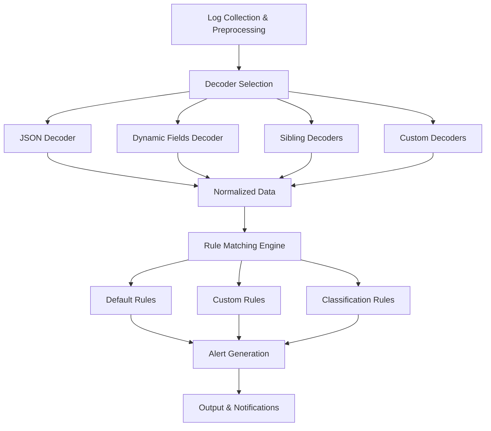

# Wazuh Snapshot Migration Guide: Data Analysis, Rule Engine, and Windows Monitoring

This comprehensive guide covers Wazuh's data analysis workflow, rule engine architecture, snapshot migration procedures, and Windows monitoring capabilities using WMI and Icinga. Understanding these components is crucial for effective SIEM deployment and management.

## Table of Contents

- [Wazuh Data Analysis Workflow](#wazuh-data-analysis-workflow)
- [Rule Engine Architecture](#rule-engine-architecture)
- [Snapshot Migration Procedures](#snapshot-migration-procedures)
- [Windows Monitoring with WMI](#windows-monitoring-with-wmi)
- [Icinga Integration](#icinga-integration)
- [Remote Windows Management](#remote-windows-management)
- [Advanced Querying Techniques](#advanced-querying-techniques)

## Wazuh Data Analysis Workflow

### Complete Data Flow Architecture

The Wazuh data analysis process follows a structured pipeline from log collection to alert generation:



### Log Collection and Preprocessing

The first stage involves gathering logs from various sources:

**Agent Log Collection**:

```xml
<!-- ossec.conf on agent -->
<localfile>
  <log_format>json</log_format>
  <location>/var/log/application.log</location>
</localfile>

<localfile>
  <log_format>syslog</log_format>
  <location>/var/log/syslog</location>
</localfile>

<localfile>
  <log_format>eventlog</log_format>
  <location>Security</location>
</localfile>
```

**Log Forwarding and Aggregation**:

```xml
<!-- Manager configuration -->
<global>
  <logall>yes</logall>
  <logall_json>yes</logall_json>
  <integrity_checking>yes</integrity_checking>
</global>

<remote>
  <connection>syslog</connection>
  <port>514</port>
  <protocol>udp</protocol>
</remote>
```

### Decoder Selection and Processing

Wazuh uses multiple decoder types to handle different log formats:

#### JSON Decoder Configuration

```xml
<decoder name="json">
  <program_name>^json_decoder$</program_name>
  <plugin_decoder>JSON_Decoder</plugin_decoder>
</decoder>

<decoder name="application-json">
  <parent>json</parent>
  <program_name>^application$</program_name>
  <json_null_field>null</json_null_field>
  <json_array_structure>array</json_array_structure>
</decoder>
```

#### Dynamic Fields Decoder

```xml
<decoder name="dynamic-fields">
  <program_name>^dynamic$</program_name>
  <regex offset="after_parent">^(\S+)\s+(\S+)\s+(.+)$</regex>
  <order>field1,field2,extra_data</order>
</decoder>

<decoder name="dynamic-fields-child">
  <parent>dynamic-fields</parent>
  <regex>^(\w+)=(\S+)</regex>
  <order>key,value</order>
</decoder>
```

#### Sibling Decoders for Related Events

```xml
<decoder name="login-attempt">
  <program_name>^ssh$</program_name>
  <regex>^(\w+)\s+(\d+)\s+(\S+)\s+(.+)$</regex>
  <order>status,pid,user,srcip</order>
</decoder>

<decoder name="login-success">
  <parent>login-attempt</parent>
  <regex>Accepted</regex>
  <fts>name,user,srcip</fts>
</decoder>

<decoder name="login-failure">
  <parent>login-attempt</parent>
  <regex>Failed</regex>
  <fts>name,user,srcip</fts>
</decoder>
```

## Rule Engine Architecture

### Rule Definition Structure

Wazuh rules are defined in XML format with specific matching criteria:

```xml
<group name="security,authentication">
  <!-- Default Rules -->
  <rule id="5500" level="3">
    <if_sid>5400</if_sid>
    <match>^authentication success</match>
    <description>User authentication success.</description>
    <group>authentication_success,</group>
  </rule>

  <!-- Custom Rules -->
  <rule id="100001" level="7">
    <if_sid>5400</if_sid>
    <match>^authentication failure</match>
    <same_source_ip />
    <frequency>5</frequency>
    <timeframe>300</timeframe>
    <description>Multiple authentication failures from same source.</description>
    <group>authentication_failures,multiple_failures,</group>
  </rule>

  <!-- Classification Rules -->
  <rule id="100002" level="10">
    <if_matched_sid>100001</if_matched_sid>
    <same_source_ip />
    <frequency>3</frequency>
    <timeframe>600</timeframe>
    <description>Persistent authentication attacks detected.</description>
    <group>authentication_attack,brute_force,</group>
  </rule>
</group>
```

### Rule Types and Hierarchy

#### Default Rules

```xml
<!-- System default rules -->
<rule id="1001" level="1">
  <category>ids</category>
  <decoded_as>sshd</decoded_as>
  <description>SSH messages grouped.</description>
</rule>

<rule id="5700" level="8">
  <if_sid>5500</if_sid>
  <match>^Failed|^error|^bad|^invalid</match>
  <description>SSH authentication failure.</description>
  <group>authentication_failed,</group>
</rule>
```

#### Custom Rules with Advanced Logic

```xml
<rule id="100100" level="12">
  <if_sid>5700</if_sid>
  <srcip>!^192.168.</srcip>
  <same_source_ip />
  <frequency>10</frequency>
  <timeframe>240</timeframe>
  <description>SSH brute force attack from external source.</description>
  <group>attack,brute_force,</group>
  <options>no_email_alert</options>
</rule>
```

#### Classification Rules for Event Correlation

```xml
<rule id="100200" level="15">
  <if_matched_sid>100100</if_matched_sid>
  <same_source_ip />
  <description>Critical: Coordinated attack detected.</description>
  <group>attack,coordinated,critical,</group>
</rule>
```

### Complete Ruleset Configuration

A comprehensive ruleset configuration combines decoders and rules:

```xml
<?xml version="1.0" encoding="UTF-8"?>
<root>
  <!-- Decoders Section -->
  <decoder_section>
    <decoder name="json">
      <program_name>^json_app$</program_name>
      <plugin_decoder>JSON_Decoder</plugin_decoder>
    </decoder>

    <decoder name="dynamic-fields">
      <program_name>^app$</program_name>
      <regex>^(\S+)\s+(\S+)\s+(.+)$</regex>
      <order>timestamp,level,message</order>
    </decoder>

    <decoder name="sibling-auth">
      <program_name>^auth$</program_name>
      <regex>^(\w+)\s+(\S+)\s+(\S+)$</regex>
      <order>action,user,result</order>
    </decoder>

    <decoder name="custom-app">
      <program_name>^myapp$</program_name>
      <regex>^Event:\s+(\w+)\s+User:\s+(\S+)\s+IP:\s+(\S+)$</regex>
      <order>event_type,username,client_ip</order>
    </decoder>
  </decoder_section>

  <!-- Rules Section -->
  <rules_section>
    <!-- Default Rules -->
    <rule id="1000" level="0">
      <description>Generic rule for application events.</description>
    </rule>

    <rule id="1001" level="3">
      <if_sid>1000</if_sid>
      <program_name>^myapp$</program_name>
      <description>MyApp events.</description>
    </rule>

    <!-- Custom Rules -->
    <rule id="100001" level="7">
      <if_sid>1001</if_sid>
      <field name="event_type">^login_failure$</field>
      <description>Application login failure.</description>
      <group>authentication_failed,</group>
    </rule>

    <rule id="100002" level="10">
      <if_matched_sid>100001</if_matched_sid>
      <same_field>client_ip</same_field>
      <frequency>5</frequency>
      <timeframe>300</timeframe>
      <description>Multiple login failures from same IP.</description>
      <group>brute_force,authentication_attack,</group>
    </rule>

    <!-- Classification Rules -->
    <rule id="100003" level="12">
      <if_matched_sid>100002</if_matched_sid>
      <same_field>client_ip</same_field>
      <frequency>3</frequency>
      <timeframe>600</timeframe>
      <description>Persistent brute force attack detected.</description>
      <group>attack,persistent,critical,</group>
    </rule>
  </rules_section>
</root>
```

## Snapshot Migration Procedures

### Migration Strategy Overview

When migrating Wazuh data between clusters or performing system upgrades:

```bash
#!/bin/bash
# Wazuh Migration Script

SOURCE_MANAGER="192.168.1.100"
TARGET_MANAGER="192.168.1.200"
MIGRATION_DATE=$(date +%Y%m%d_%H%M%S)

# Phase 1: Pre-migration Assessment
echo "=== Phase 1: Assessment ==="
ssh root@$SOURCE_MANAGER "
  wazuh-control status
  du -sh /var/ossec/
  df -h /var/ossec/
"

# Phase 2: Create Snapshot
echo "=== Phase 2: Creating Snapshot ==="
ssh root@$SOURCE_MANAGER "
  /var/ossec/bin/wazuh-control stop
  tar -czf /tmp/wazuh-backup-$MIGRATION_DATE.tar.gz \
    -C /var/ossec/ \
    etc/ logs/ queue/ var/ ruleset/
  /var/ossec/bin/wazuh-control start
"

# Phase 3: Transfer Data
echo "=== Phase 3: Data Transfer ==="
scp root@$SOURCE_MANAGER:/tmp/wazuh-backup-$MIGRATION_DATE.tar.gz \
    /tmp/wazuh-backup-$MIGRATION_DATE.tar.gz

scp /tmp/wazuh-backup-$MIGRATION_DATE.tar.gz \
    root@$TARGET_MANAGER:/tmp/

# Phase 4: Restore on Target
echo "=== Phase 4: Restore ==="
ssh root@$TARGET_MANAGER "
  /var/ossec/bin/wazuh-control stop
  cd /var/ossec/
  tar -xzf /tmp/wazuh-backup-$MIGRATION_DATE.tar.gz
  chown -R wazuh:wazuh /var/ossec/
  /var/ossec/bin/wazuh-control start
"

# Phase 5: Validation
echo "=== Phase 5: Validation ==="
ssh root@$TARGET_MANAGER "
  /var/ossec/bin/wazuh-control status
  tail -f /var/ossec/logs/ossec.log
"
```

### Agent Re-registration Script

```bash
#!/bin/bash
# Agent re-registration for new manager

NEW_MANAGER_IP="192.168.1.200"
AGENT_CONFIG="/var/ossec/etc/ossec.conf"

# Backup current configuration
cp $AGENT_CONFIG ${AGENT_CONFIG}.backup

# Update manager IP
sed -i "s/<address>.*<\/address>/<address>$NEW_MANAGER_IP<\/address>/" $AGENT_CONFIG

# Remove agent key
rm -f /var/ossec/etc/client.keys

# Restart agent
systemctl restart wazuh-agent

# Check connection
tail -f /var/ossec/logs/ossec.log | grep -i "connected\|error"
```

## Windows Monitoring with WMI

### WMI Configuration for Remote Monitoring

#### Windows Target Configuration

Enable WMI remote access on target Windows systems:

```powershell
# Enable WMI through Windows Firewall
netsh advfirewall firewall set rule group="Windows Management Instrumentation (WMI)" new enable=yes

# Configure DCOM permissions
powershell -Command "Set-ItemProperty -Path 'HKLM:\SOFTWARE\Microsoft\Ole' -Name 'EnableDCOM' -Value 'Y'"

# Disable Remote UAC filtering
reg add HKLM\SOFTWARE\Microsoft\Windows\CurrentVersion\Policies\System /v LocalAccountTokenFilterPolicy /t REG_DWORD /d 1 /f

# Restart WMI service
net stop winmgmt
net start winmgmt
```

#### Linux WMI Client Setup

Install and configure WMI tools on Linux monitoring server:

```bash
# Install dependencies
sudo yum install -y gcc python3-devel libffi-devel openssl-devel

# Install Python WMI libraries
pip3 install wmi-client-wrapper pywinrm

# Test WMI connectivity
python3 << EOF
import wmi
c = wmi.WMI(computer="192.168.1.27", user="Administrator", password="Password123")
for process in c.Win32_Process():
    print(f"PID: {process.ProcessId}, Name: {process.Name}")
EOF
```

### Advanced WMI Queries

#### System Information Queries

```python
#!/usr/bin/env python3
import wmi
import json
from datetime import datetime

class WindowsMonitor:
    def __init__(self, host, username, password):
        self.connection = wmi.WMI(
            computer=host,
            user=username,
            password=password
        )

    def get_system_info(self):
        """Get comprehensive system information"""
        try:
            # Operating System Details
            os_info = []
            for os in self.connection.Win32_OperatingSystem():
                os_info.append({
                    "caption": os.Caption,
                    "version": os.Version,
                    "build_number": os.BuildNumber,
                    "total_memory": int(os.TotalVisibleMemorySize) * 1024,
                    "free_memory": int(os.FreePhysicalMemory) * 1024,
                    "last_boot": os.LastBootUpTime
                })

            # CPU Information
            cpu_info = []
            for cpu in self.connection.Win32_Processor():
                cpu_info.append({
                    "name": cpu.Name,
                    "cores": cpu.NumberOfCores,
                    "logical_processors": cpu.NumberOfLogicalProcessors,
                    "load_percentage": cpu.LoadPercentage
                })

            # Disk Information
            disk_info = []
            for disk in self.connection.Win32_LogicalDisk():
                if disk.Size:
                    disk_info.append({
                        "drive": disk.Caption,
                        "filesystem": disk.FileSystem,
                        "size": int(disk.Size),
                        "free_space": int(disk.FreeSpace),
                        "used_percentage": round((1 - int(disk.FreeSpace) / int(disk.Size)) * 100, 2)
                    })

            return {
                "timestamp": datetime.now().isoformat(),
                "operating_system": os_info,
                "processors": cpu_info,
                "disks": disk_info
            }

        except Exception as e:
            return {"error": str(e)}

    def get_running_processes(self):
        """Get list of running processes"""
        processes = []
        try:
            for process in self.connection.Win32_Process():
                processes.append({
                    "process_id": process.ProcessId,
                    "name": process.Name,
                    "executable_path": process.ExecutablePath,
                    "command_line": process.CommandLine,
                    "working_set_size": process.WorkingSetSize
                })
            return {
                "timestamp": datetime.now().isoformat(),
                "processes": processes
            }
        except Exception as e:
            return {"error": str(e)}

    def get_security_events(self, hours=24):
        """Get Windows Security Event Log entries"""
        events = []
        try:
            query = f"""
            SELECT * FROM Win32_NTLogEvent
            WHERE Logfile = 'Security'
            AND TimeGenerated > '{(datetime.now() - timedelta(hours=hours)).strftime("%Y%m%d%H%M%S")}.000000+000'
            """

            for event in self.connection.query(query):
                events.append({
                    "event_id": event.EventCode,
                    "time_generated": event.TimeGenerated,
                    "source_name": event.SourceName,
                    "message": event.Message,
                    "user": event.User,
                    "computer_name": event.ComputerName
                })

            return {
                "timestamp": datetime.now().isoformat(),
                "events": events
            }
        except Exception as e:
            return {"error": str(e)}

# Usage example
if __name__ == "__main__":
    monitor = WindowsMonitor("192.168.1.27", "Administrator", "Password123")

    # Get system information
    system_info = monitor.get_system_info()
    print(json.dumps(system_info, indent=2))

    # Get running processes
    processes = monitor.get_running_processes()
    print(json.dumps(processes, indent=2))
```

### Go-based WMI Monitoring

Using the go-msrpc library for efficient WMI queries:

```go
package main

import (
    "context"
    "encoding/json"
    "fmt"
    "log"
    "time"

    "github.com/oiweiwei/go-msrpc/msrpc/dcom/wmi"
    "github.com/oiweiwei/go-msrpc/msrpc/dcom"
)

type WindowsMetrics struct {
    Timestamp time.Time `json:"timestamp"`
    Processes []Process `json:"processes"`
    System    SystemInfo `json:"system"`
}

type Process struct {
    ProcessID      uint32 `json:"process_id"`
    Name          string `json:"name"`
    ExecutablePath string `json:"executable_path"`
}

type SystemInfo struct {
    Caption        string `json:"caption"`
    Version        string `json:"version"`
    TotalMemory    uint64 `json:"total_memory"`
    FreeMemory     uint64 `json:"free_memory"`
}

func main() {
    config := &dcom.Config{
        Username: "Administrator",
        Password: "Password123",
        Domain:   "WORKGROUP",
        Server:   "192.168.1.27",
    }

    ctx := context.Background()

    // Connect to WMI
    conn, err := wmi.NewConnection(ctx, config)
    if err != nil {
        log.Fatal(err)
    }
    defer conn.Close()

    // Query running processes
    processQuery := "SELECT ProcessId, Name, ExecutablePath FROM Win32_Process"
    processResult, err := conn.Query(ctx, processQuery)
    if err != nil {
        log.Fatal(err)
    }

    var processes []Process
    for processResult.Next() {
        var p Process
        if err := processResult.Scan(&p.ProcessID, &p.Name, &p.ExecutablePath); err != nil {
            continue
        }
        processes = append(processes, p)
    }

    // Query system information
    systemQuery := "SELECT Caption, Version, TotalVisibleMemorySize, FreePhysicalMemory FROM Win32_OperatingSystem"
    systemResult, err := conn.Query(ctx, systemQuery)
    if err != nil {
        log.Fatal(err)
    }

    var system SystemInfo
    if systemResult.Next() {
        systemResult.Scan(&system.Caption, &system.Version, &system.TotalMemory, &system.FreeMemory)
    }

    // Create metrics object
    metrics := WindowsMetrics{
        Timestamp: time.Now(),
        Processes: processes,
        System:    system,
    }

    // Output as JSON
    output, _ := json.MarshalIndent(metrics, "", "  ")
    fmt.Println(string(output))
}
```

## Icinga Integration

### Installing Check WMI Plus on Linux

Comprehensive installation for agentless Windows monitoring:

```bash
#!/bin/bash
# Check WMI Plus Installation Script

# Install dependencies
sudo apt-get update
sudo apt-get install -y libconfig-inifiles-perl libdatetime-perl \
    libscalar-list-utils-perl libnumber-format-perl libjson-perl \
    libgetopt-long-descriptive-perl

# Download and install Check WMI Plus
cd /tmp
wget https://github.com/willixix/WMI-Plus/releases/latest/download/check_wmi_plus.tar.gz
tar -xzf check_wmi_plus.tar.gz

# Install plugin
sudo cp check_wmi_plus/check_wmi_plus.pl /usr/local/bin/
sudo cp -r check_wmi_plus/etc /etc/check_wmi_plus
sudo chmod +x /usr/local/bin/check_wmi_plus.pl

# Configure plugin paths
sudo sed -i 's|/usr/lib/nagios/plugins|/usr/local/lib/nagios/plugins|g' /usr/local/bin/check_wmi_plus.pl

# Test installation
/usr/local/bin/check_wmi_plus.pl -d -d | head -25
```

### Icinga Configuration for Windows Monitoring

#### Command Definitions

```ini
# /etc/icinga2/conf.d/commands.conf

object CheckCommand "check_wmi" {
    import "plugin-check-command"
    command = [ PluginDir + "/check_wmi_plus.pl" ]
    arguments = {
        "-H" = {
            value = "$host.address$"
            description = "Target host address"
        }
        "-u" = {
            value = "$wmi_username$"
            description = "WMI username"
        }
        "-p" = {
            value = "$wmi_password$"
            description = "WMI password"
        }
        "-m" = {
            value = "$check_mode$"
            description = "WMI check mode"
        }
        "-w" = {
            value = "$wmi_warn$"
            description = "Warning threshold"
        }
        "-c" = {
            value = "$wmi_crit$"
            description = "Critical threshold"
        }
        "-a" = {
            value = "$wmi_arg1$"
            description = "First argument"
        }
        "-o" = {
            value = "$wmi_arg2$"
            description = "Second argument"
        }
    }
}
```

#### Service Templates

```ini
# Windows service template
template Service "windows-service" {
    import "generic-service"
    check_command = "check_wmi"
    check_interval = 5m
    retry_interval = 1m
    vars.wmi_username = "monitoring"
    vars.wmi_password = "MonitoringPass123"
}
```

#### Service Definitions

```ini
# CPU Utilization Check
apply Service "CPU Utilization" {
    import "windows-service"
    vars.check_mode = "checkcpu"
    vars.wmi_warn = "80"
    vars.wmi_crit = "90"
    assign where host.vars.os == "Windows"
}

# Memory Usage Check
apply Service "Memory Usage" {
    import "windows-service"
    vars.check_mode = "checkmem"
    vars.wmi_warn = "85"
    vars.wmi_crit = "95"
    assign where host.vars.os == "Windows"
}

# Disk Space Check
apply Service "Disk Space C:" {
    import "windows-service"
    vars.check_mode = "checkvolsize"
    vars.wmi_arg1 = "C:"
    vars.wmi_warn = "80"
    vars.wmi_crit = "90"
    assign where host.vars.os == "Windows"
}

# Windows Services Check
apply Service "Critical Services" {
    import "windows-service"
    vars.check_mode = "checkservice"
    vars.wmi_arg1 = "Spooler,BITS,Themes"
    assign where host.vars.os == "Windows"
}

# Event Log Monitoring
apply Service "Event Log - System" {
    import "windows-service"
    vars.check_mode = "checkeventlog"
    vars.wmi_arg1 = "system"
    vars.wmi_arg2 = "2"  # Hours to check
    vars.wmi_warn = "5"   # Warning events
    vars.wmi_crit = "10"  # Critical events
    assign where host.vars.os == "Windows"
}
```

#### Host Configuration

```ini
object Host "windows-server-01" {
    import "generic-host"
    address = "192.168.1.27"
    vars.os = "Windows"
    vars.wmi_username = "monitoring"
    vars.wmi_password = "MonitoringPass123"
}
```

## Remote Windows Management

### Advanced WinExe Usage

Execute commands remotely on Windows systems:

```bash
#!/bin/bash
# Windows Remote Management Script

TARGET_HOST="192.168.1.27"
USERNAME="Administrator"
PASSWORD="Password123"
CREDENTIALS="$USERNAME%$PASSWORD"

# System Information Gathering
echo "=== System Information ==="
winexe -U "$CREDENTIALS" //$TARGET_HOST "systeminfo"

# Process Monitoring
echo "=== Running Processes ==="
winexe -U "$CREDENTIALS" //$TARGET_HOST "tasklist /fo csv"

# Service Status
echo "=== Service Status ==="
winexe -U "$CREDENTIALS" //$TARGET_HOST "sc query type= service state= all"

# Network Configuration
echo "=== Network Configuration ==="
winexe -U "$CREDENTIALS" //$TARGET_HOST "ipconfig /all"

# Event Log Analysis
echo "=== Recent Security Events ==="
winexe -U "$CREDENTIALS" //$TARGET_HOST "wevtutil qe Security /c:10 /rd:true /f:text"

# Performance Counters
echo "=== Performance Metrics ==="
winexe -U "$CREDENTIALS" //$TARGET_HOST "typeperf \"\\Processor(_Total)\\% Processor Time\" \"\\Memory\\Available MBytes\" -sc 1"

# Registry Queries
echo "=== Registry Information ==="
winexe -U "$CREDENTIALS" //$TARGET_HOST "reg query HKLM\\SOFTWARE\\Microsoft\\Windows\\CurrentVersion /v ProductName"

# File System Information
echo "=== Disk Usage ==="
winexe -U "$CREDENTIALS" //$TARGET_HOST "dir C:\\ /-c"

# Windows Updates
echo "=== Installed Updates ==="
winexe -U "$CREDENTIALS" //$TARGET_HOST "wmic qfe list brief"

# Security Configuration
echo "=== Security Policies ==="
winexe -U "$CREDENTIALS" //$TARGET_HOST "secedit /export /cfg C:\\temp\\secpol.inf && type C:\\temp\\secpol.inf"
```

### PowerShell Remote Execution

```bash
# Execute PowerShell commands remotely
winexe -U "$CREDENTIALS" //$TARGET_HOST "powershell -Command \"Get-Process | Sort-Object CPU -Descending | Select-Object -First 10 | Format-Table -AutoSize\""

# Get Windows features
winexe -U "$CREDENTIALS" //$TARGET_HOST "powershell -Command \"Get-WindowsFeature | Where-Object {\\$_.InstallState -eq 'Installed'} | Select-Object Name,InstallState\""

# Check Windows Defender status
winexe -U "$CREDENTIALS" //$TARGET_HOST "powershell -Command \"Get-MpComputerStatus | Select-Object AntivirusEnabled,RealTimeProtectionEnabled,IoavProtectionEnabled\""
```

## Advanced Querying Techniques

### Complex WQL Queries

Advanced Windows Management Instrumentation Query Language examples:

```sql
-- Monitor process creation events
SELECT * FROM Win32_ProcessStartTrace

-- Query processes with high CPU usage
SELECT ProcessId, Name, PercentProcessorTime
FROM Win32_PerfRawData_PerfProc_Process
WHERE Name <> '_Total'
AND Name <> 'Idle'

-- Check for specific security events
SELECT * FROM Win32_NTLogEvent
WHERE Logfile = 'Security'
AND EventCode IN (4624, 4625, 4648, 4720, 4722, 4724, 4725, 4726, 4728, 4732, 4756)
AND TimeGenerated > '20250128000000.000000+000'

-- Monitor file system changes
SELECT * FROM Win32_VolumeChangeEvent

-- Query installed software
SELECT Name, Version, InstallDate
FROM Win32_Product
WHERE Name LIKE '%Microsoft%'

-- Check network connections
SELECT LocalAddress, LocalPort, RemoteAddress, RemotePort, State
FROM Win32_PerfRawData_Tcpip_NetworkInterface

-- Monitor service status changes
SELECT * FROM Win32_ServiceControlEvent

-- Query system performance
SELECT Name, Frequency, LoadPercentage, NumberOfCores, NumberOfLogicalProcessors
FROM Win32_Processor

-- Check disk performance
SELECT Name, DiskReadBytesPerSec, DiskWriteBytesPerSec, CurrentDiskQueueLength
FROM Win32_PerfRawData_PerfDisk_PhysicalDisk
WHERE Name <> '_Total'

-- Monitor memory usage
SELECT TotalVisibleMemorySize, FreePhysicalMemory, TotalVirtualMemorySize, FreeVirtualMemory
FROM Win32_OperatingSystem
```

### Automated Monitoring Script

```python
#!/usr/bin/env python3
"""
Comprehensive Windows monitoring with Wazuh integration
"""

import json
import wmi
import time
import logging
import argparse
from datetime import datetime, timedelta
from pathlib import Path

class WazuhWindowsMonitor:
    def __init__(self, host, username, password, output_dir="/var/ossec/logs/wmi"):
        self.host = host
        self.username = username
        self.password = password
        self.output_dir = Path(output_dir)
        self.output_dir.mkdir(parents=True, exist_ok=True)

        # Setup logging
        logging.basicConfig(
            level=logging.INFO,
            format='%(asctime)s - %(levelname)s - %(message)s',
            handlers=[
                logging.FileHandler(self.output_dir / 'wmi_monitor.log'),
                logging.StreamHandler()
            ]
        )
        self.logger = logging.getLogger(__name__)

        try:
            self.connection = wmi.WMI(
                computer=host,
                user=username,
                password=password
            )
            self.logger.info(f"Connected to {host}")
        except Exception as e:
            self.logger.error(f"Failed to connect to {host}: {e}")
            raise

    def collect_metrics(self):
        """Collect comprehensive Windows metrics"""
        metrics = {
            "timestamp": datetime.now().isoformat(),
            "host": self.host,
            "wazuh_integration": True
        }

        try:
            # System Information
            metrics["system"] = self._get_system_info()

            # Process Information
            metrics["processes"] = self._get_process_info()

            # Service Status
            metrics["services"] = self._get_service_status()

            # Security Events
            metrics["security_events"] = self._get_security_events()

            # Performance Metrics
            metrics["performance"] = self._get_performance_metrics()

            # Network Information
            metrics["network"] = self._get_network_info()

            return metrics

        except Exception as e:
            self.logger.error(f"Error collecting metrics: {e}")
            return {"error": str(e), "timestamp": datetime.now().isoformat()}

    def _get_system_info(self):
        """Get system information"""
        try:
            os_info = self.connection.Win32_OperatingSystem()[0]
            computer_info = self.connection.Win32_ComputerSystem()[0]

            return {
                "os_name": os_info.Caption,
                "os_version": os_info.Version,
                "build_number": os_info.BuildNumber,
                "computer_name": computer_info.Name,
                "domain": computer_info.Domain,
                "total_memory": int(os_info.TotalVisibleMemorySize) * 1024,
                "free_memory": int(os_info.FreePhysicalMemory) * 1024,
                "uptime": os_info.LastBootUpTime
            }
        except Exception as e:
            self.logger.error(f"Error getting system info: {e}")
            return {"error": str(e)}

    def _get_process_info(self):
        """Get running process information"""
        try:
            processes = []
            for process in self.connection.Win32_Process():
                processes.append({
                    "pid": process.ProcessId,
                    "name": process.Name,
                    "executable": process.ExecutablePath,
                    "command_line": process.CommandLine
                })
            return processes[:50]  # Limit to top 50 processes
        except Exception as e:
            self.logger.error(f"Error getting process info: {e}")
            return {"error": str(e)}

    def _get_service_status(self):
        """Get Windows service status"""
        try:
            services = []
            critical_services = [
                "Spooler", "BITS", "Themes", "Dhcp", "Dnscache",
                "EventLog", "PlugPlay", "RpcSs", "Schedule", "W32Time"
            ]

            for service in self.connection.Win32_Service():
                if service.Name in critical_services:
                    services.append({
                        "name": service.Name,
                        "display_name": service.DisplayName,
                        "state": service.State,
                        "start_mode": service.StartMode,
                        "status": service.Status
                    })
            return services
        except Exception as e:
            self.logger.error(f"Error getting service status: {e}")
            return {"error": str(e)}

    def _get_security_events(self, hours=1):
        """Get recent security events"""
        try:
            events = []
            cutoff_time = (datetime.now() - timedelta(hours=hours)).strftime("%Y%m%d%H%M%S")

            query = f"""
            SELECT EventCode, TimeGenerated, SourceName, Message, User
            FROM Win32_NTLogEvent
            WHERE Logfile = 'Security'
            AND EventCode IN (4624, 4625, 4648, 4720, 4722)
            AND TimeGenerated > '{cutoff_time}.000000+000'
            """

            for event in self.connection.query(query):
                events.append({
                    "event_id": event.EventCode,
                    "time": event.TimeGenerated,
                    "source": event.SourceName,
                    "user": event.User,
                    "message": event.Message[:200] if event.Message else None
                })

            return events[:20]  # Limit to last 20 events
        except Exception as e:
            self.logger.error(f"Error getting security events: {e}")
            return {"error": str(e)}

    def _get_performance_metrics(self):
        """Get system performance metrics"""
        try:
            # CPU Information
            cpu_info = self.connection.Win32_Processor()[0]

            # Memory Information
            os_info = self.connection.Win32_OperatingSystem()[0]

            # Disk Information
            disks = []
            for disk in self.connection.Win32_LogicalDisk():
                if disk.Size:
                    disks.append({
                        "drive": disk.Caption,
                        "total_size": int(disk.Size),
                        "free_space": int(disk.FreeSpace),
                        "used_percent": round((1 - int(disk.FreeSpace) / int(disk.Size)) * 100, 2)
                    })

            return {
                "cpu_cores": cpu_info.NumberOfCores,
                "cpu_logical_processors": cpu_info.NumberOfLogicalProcessors,
                "memory_total": int(os_info.TotalVisibleMemorySize) * 1024,
                "memory_free": int(os_info.FreePhysicalMemory) * 1024,
                "memory_used_percent": round((1 - int(os_info.FreePhysicalMemory) / int(os_info.TotalVisibleMemorySize)) * 100, 2),
                "disks": disks
            }
        except Exception as e:
            self.logger.error(f"Error getting performance metrics: {e}")
            return {"error": str(e)}

    def _get_network_info(self):
        """Get network configuration"""
        try:
            adapters = []
            for adapter in self.connection.Win32_NetworkAdapterConfiguration():
                if adapter.IPAddress:
                    adapters.append({
                        "description": adapter.Description,
                        "ip_addresses": adapter.IPAddress,
                        "subnet_masks": adapter.IPSubnet,
                        "default_gateways": adapter.DefaultIPGateway,
                        "dns_servers": adapter.DNSServerSearchOrder,
                        "dhcp_enabled": adapter.DHCPEnabled
                    })
            return adapters
        except Exception as e:
            self.logger.error(f"Error getting network info: {e}")
            return {"error": str(e)}

    def generate_wazuh_log(self, metrics):
        """Generate Wazuh-compatible log entry"""
        log_entry = {
            "wazuh": {
                "agent": {
                    "name": self.host,
                    "ip": self.host
                }
            },
            "windows": metrics,
            "@timestamp": datetime.now().isoformat()
        }

        # Write to Wazuh log format
        log_file = self.output_dir / f"windows_wmi_{datetime.now().strftime('%Y%m%d')}.json"
        with open(log_file, 'a') as f:
            f.write(json.dumps(log_entry) + '\n')

        return log_entry

    def run_monitoring(self, interval=300):
        """Run continuous monitoring"""
        self.logger.info(f"Starting monitoring for {self.host} with {interval}s interval")

        while True:
            try:
                metrics = self.collect_metrics()
                log_entry = self.generate_wazuh_log(metrics)

                # Print summary
                if "system" in metrics:
                    self.logger.info(
                        f"Metrics collected - Memory: {metrics['performance']['memory_used_percent']:.1f}% "
                        f"Processes: {len(metrics['processes'])} "
                        f"Security Events: {len(metrics['security_events'])}"
                    )

                time.sleep(interval)

            except KeyboardInterrupt:
                self.logger.info("Monitoring stopped by user")
                break
            except Exception as e:
                self.logger.error(f"Monitoring error: {e}")
                time.sleep(60)  # Wait before retrying

def main():
    parser = argparse.ArgumentParser(description='Wazuh Windows WMI Monitor')
    parser.add_argument('--host', required=True, help='Target Windows host')
    parser.add_argument('--username', required=True, help='Windows username')
    parser.add_argument('--password', required=True, help='Windows password')
    parser.add_argument('--interval', type=int, default=300, help='Monitoring interval in seconds')
    parser.add_argument('--output-dir', default='/var/ossec/logs/wmi', help='Output directory')
    parser.add_argument('--one-shot', action='store_true', help='Run once and exit')

    args = parser.parse_args()

    monitor = WazuhWindowsMonitor(
        host=args.host,
        username=args.username,
        password=args.password,
        output_dir=args.output_dir
    )

    if args.one_shot:
        metrics = monitor.collect_metrics()
        log_entry = monitor.generate_wazuh_log(metrics)
        print(json.dumps(log_entry, indent=2))
    else:
        monitor.run_monitoring(args.interval)

if __name__ == "__main__":
    main()
```

## Conclusion

This comprehensive guide covers the essential aspects of Wazuh data analysis, rule engine configuration, snapshot migration, and Windows monitoring integration. The combination of these technologies provides a robust security monitoring solution with:

- **Complete data flow visibility** from log collection to alert generation
- **Flexible rule engine** supporting default, custom, and classification rules
- **Reliable migration procedures** for system upgrades and data transfer
- **Comprehensive Windows monitoring** using WMI and remote management tools
- **Seamless integration** with monitoring platforms like Icinga

For production deployments, ensure proper security configurations, regular backups, and comprehensive monitoring of all components. Regular testing of migration procedures and monitoring capabilities helps maintain system reliability and security effectiveness.

Remember to adapt configurations to your specific environment requirements and security policies.
