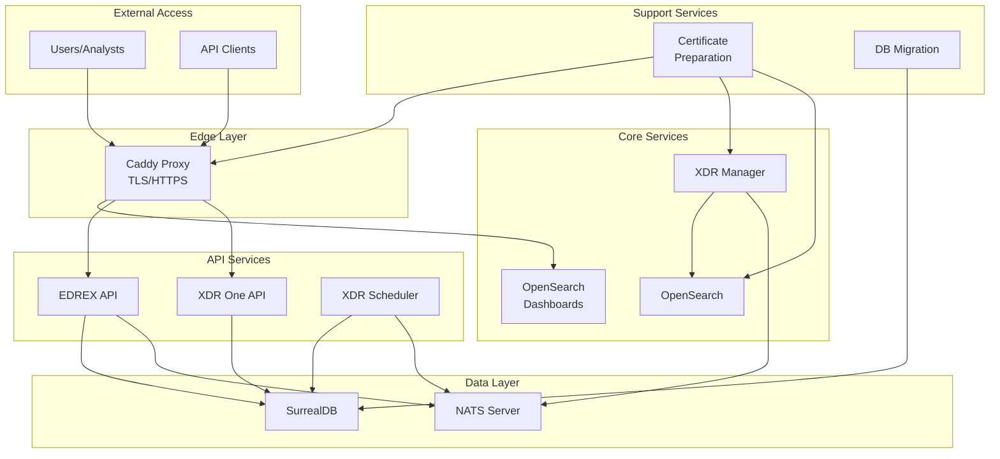

# XDR Security Platform: Architecture and Deployment Guide

This comprehensive documentation details the architecture, deployment, and configuration of the Extended Detection and Response (XDR) security platform. The platform integrates multiple security components to provide advanced threat detection, monitoring, and response capabilities.

## Table of Contents

1. [Architecture Overview](#architecture-overview)
2. [Component Breakdown](#component-breakdown)
3. [Data Flow and Workflow](#data-flow-and-workflow)
4. [Deployment Instructions](#deployment-instructions)
5. [Security Considerations](#security-considerations)
6. [Configuration Details](#configuration-details)
7. [Troubleshooting](#troubleshooting)

## Architecture Overview

The XDR platform is built using a microservices architecture with Docker containers, allowing for scalability, high availability, and easy deployment. The platform integrates the following major components:

- **XDR Manager**: Core security monitoring and management component
- **OpenSearch**: Search and analytics engine for log data
- **OpenSearch Dashboards**: Visualization interface with security dashboards
- **EDREX API**: Endpoint Detection and Response extension API
- **SurrealDB**: Database for storing security events and configurations
- **NATS Server**: Message broker for inter-service communication
- **Caddy**: Reverse proxy for secure web access and TLS termination

## Component Breakdown

### 1. XDR Manager (xdr.manager)

- **Purpose**: Core security monitoring engine
- **Functions**:
  - Collects and analyzes security logs
  - Detects security threats and anomalies
  - Manages security agents/endpoints
  - Forwards data to OpenSearch for indexing
- **Ports**:
  - 1514, 1515: Log collection
  - 514/udp: Syslog input
  - 55000: API communications

### 2. OpenSearch (opensearch)

- **Purpose**: Advanced search and analytics engine (fork of Elasticsearch)
- **Functions**:
  - Indexes and stores security data
  - Enables powerful search capabilities
  - Supports analytics queries on security data
- **Ports**:
  - 9200: REST API
  - 9600: Performance analyzer

### 3. OpenSearch Dashboards (opensearch-dashboards)

- **Purpose**: Visualization and management interface
- **Functions**:
  - Provides security dashboards and visualizations
  - Offers user interface for security analytics
  - Supports security incident investigation
- **Ports**:
  - 5601: Web interface

### 4. Caddy (caddy)

- **Purpose**: Reverse proxy and web server
- **Functions**:
  - Provides TLS termination
  - Implements security headers
  - Routes traffic to appropriate services
  - Handles HTTP to HTTPS redirections
- **Ports**:
  - 80: HTTP (redirects to HTTPS)
  - 443: HTTPS (main web access)
  - 9443: API access
  - 6001: EDREX API access

### 5. Certificate Preparation (cert-prep)

- **Purpose**: Sets up TLS certificates
- **Functions**:
  - Prepares certificates for secure communications
  - Distributes certificates to required services

### 6. EDREX API (edrex-api)

- **Purpose**: Endpoint Detection and Response Extension API
- **Functions**:
  - Provides programmatic access to EDR capabilities
  - Interfaces with SurrealDB for data storage
  - Connects to NATS for event handling
- **Ports**:
  - 6001: API endpoint

### 7. XDR One API (xdr-one-api)

- **Purpose**: Unified API for XDR platform access
- **Functions**:
  - Offers centralized API access to XDR capabilities
  - Interfaces with SurrealDB for data storage
- **Ports**:
  - 5001: API endpoint

### 8. SurrealDB (surrealdb)

- **Purpose**: Database for the XDR platform
- **Functions**:
  - Stores configuration data
  - Records security events and alerts
  - Maintains system state
- **Ports**:
  - 8000: Database access

### 9. NATS Server (nats-server)

- **Purpose**: Message broker for inter-service communication
- **Functions**:
  - Enables publish/subscribe messaging pattern
  - Facilitates event-driven architecture
  - Allows asynchronous communication between services
- **Ports**:
  - 4222: Client connections
  - 6222: Route connections
  - 8222: HTTP monitoring

### 10. XDR Scheduler (xdr-scheduler)

- **Purpose**: Scheduled task execution for XDR platform
- **Functions**:
  - Runs periodic security checks
  - Performs scheduled maintenance tasks
  - Executes automated responses
- **Ports**:
  - 7001: API access

### 11. DB Migration (db-migration)

- **Purpose**: Database schema management
- **Functions**:
  - Initializes database schema
  - Handles database upgrades and migrations

## Data Flow and Workflow

### Security Event Processing

1. **Collection**: Security logs and events are collected by the XDR Manager

   - From network devices, servers, endpoints, and security tools
   - Over various protocols (Syslog, TCP, UDP, etc.)

2. **Processing**: XDR Manager processes the incoming data

   - Normalizes data format
   - Enriches data with additional context
   - Applies initial correlation rules

3. **Indexing**: Processed data is forwarded to OpenSearch

   - Structured for efficient searching
   - Indexed with relevant metadata
   - Made available for real-time queries

4. **Analysis**: Multiple analysis pipelines process the data

   - Rule-based detection identifies known patterns
   - Anomaly detection identifies unusual behavior
   - Threat intelligence correlation adds context

5. **Visualization**: Results presented in OpenSearch Dashboards

   - Security dashboards show current threats
   - Historical trends and patterns displayed
   - Drill-down capability for incident investigation

6. **Response**: Automated or manual responses executed
   - XDR Scheduler can trigger automated responses
   - APIs enable integration with other security tools
   - Manual investigation tools provided through dashboards

### API Workflow

1. External requests reach Caddy reverse proxy
2. Caddy authenticates and routes to appropriate API service
3. API services process requests and interact with databases
4. Responses return through the same path

## Architecture Diagram



## Deployment Instructions

### Prerequisites

- Docker and Docker Compose installed
- Minimum 8GB RAM, 4 CPU cores, 100GB storage
- Domain name with DNS configured to point to your server
- Cloudflare API token for DNS verification (if using Cloudflare)

### Deployment Steps

1. **Clone the Repository**

   ```bash
   git clone https://github.com/your-org/xdr-platform.git
   cd xdr-platform
   ```

2. **Configure Environment**

   - Update domain names and credentials in the configuration files
   - Ensure proper permissions on certificate directories

   ```bash
   mkdir -p config/xdr_indexer_ssl_certs
   chmod 755 config/xdr_indexer_ssl_certs
   ```

3. **Generate or Import Certificates**

   - Place your certificates in the appropriate directories, or
   - Configure Caddy to automatically obtain certificates

4. **Start the Platform**

   ```bash
   docker-compose up -d
   ```

5. **Verify Deployment**

   - Check container status: `docker-compose ps`
   - Verify OpenSearch is running: `curl -k https://localhost:9200`
   - Access OpenSearch Dashboards: `https://your-domain.com`

6. **Initialize Database**
   - The DB Migration container will handle this automatically
   - Verify completion: `docker logs db-migration`

## Security Considerations

### Network Security

- All services restricted to the internal Docker network except exposed ports
- TLS encryption for all communications
- Strong security headers configured in Caddy
- HTTP to HTTPS redirection enforced

### Authentication and Access Control

- API authentication required for all endpoints
- OpenSearch security plugin enabled
- Strong credentials for all services (note: sample credentials in the config file should be changed)

### Data Protection

- All data at rest stored in Docker volumes
- All data in transit encrypted with TLS
- Certificate authority chain maintained securely

### Hardening Recommendations

1. Change all default passwords before production deployment
2. Use secrets management for sensitive credentials
3. Implement network security groups to restrict access
4. Regular security updates for all containers
5. Backup and recovery strategy for all volumes

## Configuration Details

### Caddy Configuration

The Caddy server acts as a secure gateway to the platform with the following configuration:

```caddyfile
# Global settings
{
    email anubhavg@infopercept.com
    admin localhost:2019
    servers {
        protocols h2 h1
    }
    # Force ZeroSSL as the primary issuer since Let's Encrypt has rate-limited us
    acme_ca https://acme.zerossl.com/v2/DV90
    # Use DNS challenge as primary method for certificate issuance
    acme_dns cloudflare {env.CLOUDFLARE_API_TOKEN}
}

# Main site (OpenSearch Dashboards)
xdr.invinsense.dev {
    # Security headers
    header {
        Strict-Transport-Security "max-age=31536000; includeSubDomains; preload"
        X-Content-Type-Options "nosniff"
        X-XSS-Protection "1; mode=block"
        X-Frame-Options "SAMEORIGIN"
        -Server
    }
    # Reverse proxy to OpenSearch Dashboards
    reverse_proxy opensearch-dashboards:5601 {
        transport http {
            tls
            tls_server_name opensearch-dashboards
            tls_insecure_skip_verify
        }
    }
    # Enable compression
    encode gzip
}
```

### Network Configuration

The platform uses an isolated Docker network with a defined subnet:

```yaml
networks:
  xdr-network:
    driver: bridge
    ipam:
      config:
        - subnet: 172.25.0.0/24
```

### Volume Configuration

Persistent data is stored in Docker volumes:

```yaml
volumes:
  xdr_api_configuration:
  xdr_etc:
  xdr_logs:
  xdr_queue:
  xdr_var_multigroups:
  xdr_integrations:
  xdr_active_response:
  xdr_agentless:
  xdr_wodles:
  filebeat_etc:
  filebeat_var:
  opensearch-data:
  certs:
  opensearch-dashboards-config:
  caddy_data:
  caddy_config:
  mydata:
```

## Troubleshooting

### Common Issues and Solutions

1. **Container fails to start**

   - Check logs: `docker logs <container_name>`
   - Verify volume permissions
   - Ensure no port conflicts

2. **OpenSearch not accessible**

   - Check if the container is running: `docker-compose ps opensearch`
   - Verify memory limits: OpenSearch requires adequate memory allocation
   - Check OpenSearch logs: `docker logs opensearch`

3. **Certificate issues**

   - Verify certificate files exist in the correct locations
   - Check certificate permissions
   - Ensure certificate chain is complete

4. **API access problems**

   - Verify API credentials
   - Check network connectivity
   - Ensure proper port forwarding

5. **Database connection issues**
   - Verify SurrealDB is running: `docker-compose ps surrealdb`
   - Check connection strings in services
   - Ensure database has been properly initialized

## Resources and References

- [OpenSearch Documentation](https://opensearch.org/docs/)
- [SurrealDB Documentation](https://surrealdb.com/docs)
- [Caddy Server Documentation](https://caddyserver.com/docs/)
- [Docker Compose Documentation](https://docs.docker.com/compose/)
- [NATS Server Documentation](https://docs.nats.io/)
