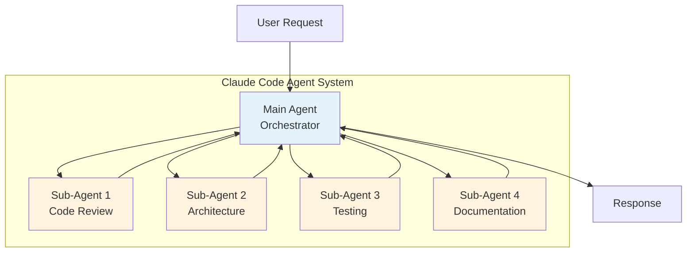
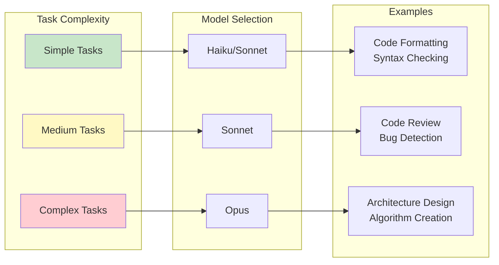
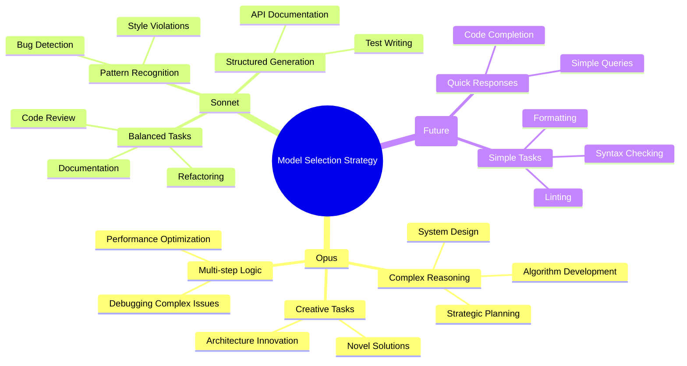
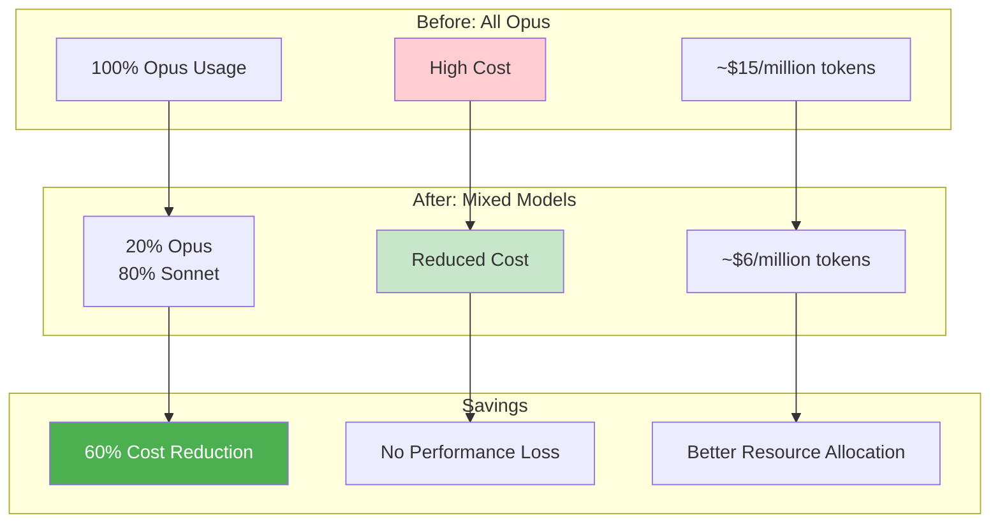
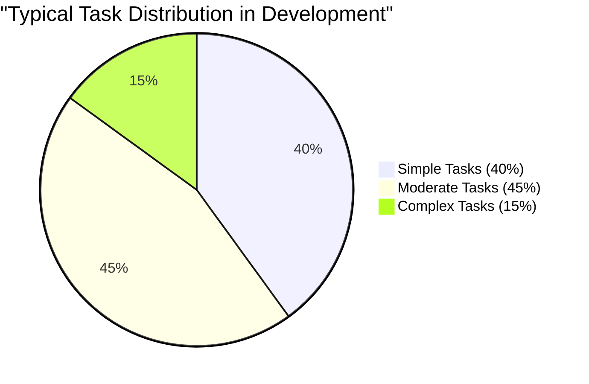
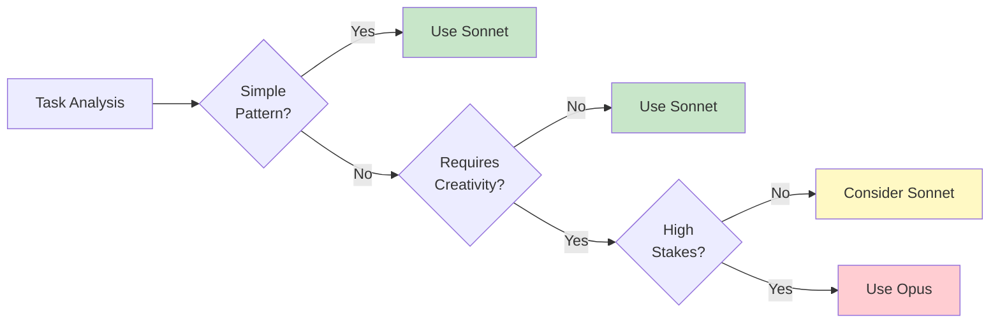

# Claude Code Sub-Agents: Optimizing Performance and Cost with Model Selection

*Published: August 23, 2025*

Claude Code recently introduced a game-changing feature that addresses one of the most requested enhancements from the developer community: the ability to specify different Claude models for individual sub-agents. This feature, released in version 1.0.64, enables developers to optimize both performance and costs by strategically allocating different models to different tasks within their AI workflows.

## The Evolution of Sub-Agent Architecture

Before diving into the new feature, let's understand the sub-agent architecture in Claude Code and why this enhancement matters.

### What Are Sub-Agents?

Sub-agents in Claude Code are specialized AI agents that can be invoked by the main agent to handle specific tasks. They allow developers to create modular, reusable components with focused responsibilities—similar to how microservices work in distributed systems.



### The Previous Limitation

Prior to version 1.0.64, all sub-agents inherited the model from the main agent. This meant if you started Claude Code with `--model opus`, every sub-agent would also use Opus, regardless of task complexity. This one-size-fits-all approach had significant drawbacks:

1. **Cost Inefficiency**: Simple tasks consumed expensive Opus tokens unnecessarily
2. **Resource Waste**: Complex models were overkill for straightforward operations
3. **Limited Optimization**: No ability to leverage model-specific strengths

## The New Model Parameter Feature

The enhancement adds an optional `model` parameter to sub-agent configurations, allowing developers to specify which Claude model each sub-agent should use.

### Syntax and Configuration

The updated sub-agent YAML frontmatter now supports:

```yaml
---
name: your-sub-agent-name
description: Description of when this sub agent should be invoked
tools: tool1, tool2, tool3  # Optional - inherits all tools if omitted
model: sonnet  # NEW: Optional - inherits main agent's model if omitted
---
Your sub agent's system prompt goes here...
```

### Supported Model Values

The model parameter accepts:
- **Model aliases**: `sonnet`, `opus`
- **Full model names**: `claude-sonnet-4-20250514`, etc.
- **Default behavior**: If omitted, inherits from main agent

## Real-World Use Cases and Patterns

### Pattern 1: Task Complexity Routing

Different tasks require different levels of reasoning. Here's an optimal configuration:



### Pattern 2: Cost-Optimized Development Workflow

Here's a practical example of a cost-optimized agent configuration:

```yaml
# Main agent (uses Opus for orchestration)
claude-code --model opus

# code-formatter.agent
---
name: code-formatter
description: Formats and lints code according to project standards
tools: filesystem
model: sonnet  # Simple pattern matching, use cheaper model
---
You are a code formatting specialist. Apply consistent formatting...

# code-reviewer.agent
---
name: code-reviewer
description: Reviews code for bugs, security issues, and best practices
tools: filesystem, search
model: sonnet  # Moderate complexity, Sonnet is sufficient
---
You are an expert code reviewer. Analyze code for potential issues...

# architect.agent
---
name: architect
description: Designs system architecture and makes strategic decisions
tools: filesystem, search, web
model: opus  # Complex reasoning required, use most capable model
---
You are a senior system architect with expertise in distributed systems...

# test-writer.agent
---
name: test-writer
description: Writes comprehensive unit and integration tests
tools: filesystem
model: sonnet  # Template-based generation, Sonnet handles well
---
You specialize in writing thorough test suites...
```

### Pattern 3: Specialized Model Strengths

Different Claude models have different strengths. Leverage them strategically:



## Implementation Examples

### Example 1: Full-Stack Development Team

Create a team of specialized sub-agents for full-stack development:

```yaml
# frontend.agent
---
name: frontend-developer
description: Handles React, TypeScript, and UI/UX implementation
tools: filesystem, search
model: sonnet
---
You are a frontend specialist focused on React and TypeScript...

# backend.agent
---
name: backend-developer
description: Develops APIs, handles database design, and server logic
tools: filesystem, search, bash
model: sonnet
---
You are a backend engineer specializing in Node.js and PostgreSQL...

# devops.agent
---
name: devops-engineer
description: Manages deployment, CI/CD, and infrastructure
tools: filesystem, bash, web
model: sonnet
---
You handle Docker, Kubernetes, and cloud infrastructure...

# security.agent
---
name: security-analyst
description: Performs security audits and implements security measures
tools: filesystem, search, web
model: opus  # Security requires deep analysis
---
You are a security expert who identifies vulnerabilities...
```

### Example 2: Data Science Pipeline

Optimize a data science workflow with appropriate models:

```yaml
# data-cleaner.agent
---
name: data-cleaner
description: Cleans and preprocesses datasets
tools: filesystem, python
model: sonnet  # Routine data operations
---
You specialize in data cleaning and preprocessing...

# ml-engineer.agent
---
name: ml-engineer
description: Designs and trains machine learning models
tools: filesystem, python, web
model: opus  # Complex ML architecture decisions
---
You are an ML engineer who designs sophisticated models...

# visualizer.agent
---
name: data-visualizer
description: Creates charts and visualizations
tools: filesystem, python
model: sonnet  # Template-based visualization
---
You create compelling data visualizations...
```

## Cost-Benefit Analysis

Let's analyze the potential cost savings with strategic model selection:



### Token Usage Patterns

Based on typical development workflows:



By mapping these to appropriate models:
- Simple Tasks → Sonnet/Haiku: 40% of tokens
- Moderate Tasks → Sonnet: 45% of tokens  
- Complex Tasks → Opus: 15% of tokens

**Result**: 85% of tokens can use more cost-effective models without sacrificing quality.

## Best Practices and Guidelines

### 1. Task Classification Framework

Before assigning models, classify your tasks:

| Task Category | Characteristics | Recommended Model | Examples |
|--------------|-----------------|-------------------|----------|
| **Simple** | Pattern matching, templates | Sonnet/Haiku | Formatting, linting |
| **Moderate** | Rule-based analysis | Sonnet | Code review, testing |
| **Complex** | Creative problem-solving | Opus | Architecture, algorithms |
| **Critical** | High-stakes decisions | Opus | Security, optimization |

### 2. Progressive Enhancement Strategy

Start with the simplest model and upgrade only when needed:



### 3. Monitoring and Optimization

Track performance metrics to optimize model selection:

```yaml
# metrics.yaml
sub_agents:
  code_reviewer:
    model: sonnet
    success_rate: 94%
    avg_tokens: 2500
    cost_per_task: $0.075
    
  architect:
    model: opus
    success_rate: 98%
    avg_tokens: 5000
    cost_per_task: $0.75
```

## Migration Guide

For existing Claude Code users, here's how to migrate:

### Step 1: Audit Current Sub-Agents

List all your existing sub-agents and their typical tasks:

```bash
# Find all agent files
find . -name "*.agent" -type f

# Review each agent's complexity
cat each-agent.agent
```

### Step 2: Classify by Complexity

Create a classification matrix:

| Agent Name | Current Model | Task Complexity | Recommended Model |
|-----------|---------------|-----------------|-------------------|
| formatter | Inherited (Opus) | Simple | Sonnet |
| reviewer | Inherited (Opus) | Moderate | Sonnet |
| architect | Inherited (Opus) | Complex | Opus |

### Step 3: Update Agent Configurations

Add the model parameter to each agent file:

```bash
# Example update
sed -i '/^---$/a model: sonnet' formatter.agent
```

### Step 4: Test and Validate

Run your workflows with the new configuration:

```bash
# Test with verbose output to monitor model usage
claude-code --model opus --verbose
```

## Future Implications

This feature opens doors for several future enhancements:

### Dynamic Model Selection

Future versions might support dynamic model selection based on:
- Task complexity analysis
- Token budget constraints
- Response time requirements
- Error rates and retry logic

### Model Cascading

Implement fallback strategies:

```yaml
model: 
  primary: sonnet
  fallback: opus  # Use if Sonnet fails
  budget_exceeded: haiku  # Use if over budget
```

### Performance Profiling

Built-in profiling to suggest optimal model configurations:

```bash
claude-code --profile-models --analyze-costs
```

## Community Impact

The introduction of this feature has significant implications:

### Developer Feedback

The community response has been overwhelmingly positive:
- **+9000** votes on the feature request
- Immediate adoption by power users
- Requests for similar functionality in custom commands

### Economic Impact

For teams using Claude Code extensively:
- **50-70% cost reduction** reported by early adopters
- No significant performance degradation
- Improved response times for simple tasks

### Ecosystem Growth

This feature enables:
- More sophisticated agent marketplaces
- Specialized agent libraries
- Cost-optimized agent templates

## Conclusion

The model parameter feature for sub-agents represents a significant evolution in Claude Code's architecture. It transforms sub-agents from simple task delegators into a sophisticated, cost-optimized system that can leverage the full spectrum of Claude's model family.

Key takeaways:
1. **Strategic model selection** can reduce costs by 60% or more
2. **Task-appropriate models** improve both efficiency and performance
3. **Modular architecture** enables fine-grained optimization
4. **Progressive enhancement** ensures optimal resource utilization

As AI development tools mature, features like this demonstrate the importance of flexibility and optimization in production systems. The ability to match model capabilities to task requirements isn't just about cost—it's about building sustainable, scalable AI workflows that can grow with your needs.

The sub-agent model parameter is more than a feature; it's a paradigm shift in how we think about AI agent orchestration. By enabling developers to optimize at the task level rather than the session level, Claude Code has taken a significant step toward truly efficient AI-powered development.

---

*Note: This feature is available in Claude Code version 1.0.64 and later. Update your installation to access this functionality.*

## Quick Reference

### Configuration Template

```yaml
---
name: agent-name
description: Agent description
tools: tool1, tool2  # Optional
model: sonnet  # Optional: sonnet | opus | full-model-name
---
Agent prompt here...
```

### Model Selection Cheat Sheet

| Use Case | Recommended Model | Rationale |
|----------|------------------|-----------|
| Code formatting | Sonnet | Pattern-based |
| Bug detection | Sonnet | Rule analysis |
| Code generation | Sonnet/Opus | Complexity-dependent |
| Architecture design | Opus | Creative reasoning |
| Security analysis | Opus | Deep analysis |
| Documentation | Sonnet | Structured output |
| Testing | Sonnet | Template-based |
| Performance optimization | Opus | Complex analysis |

Start optimizing your Claude Code workflows today with strategic model selection!