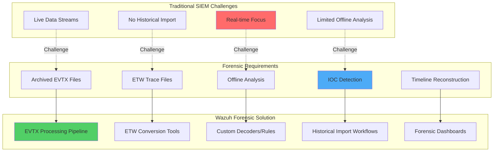
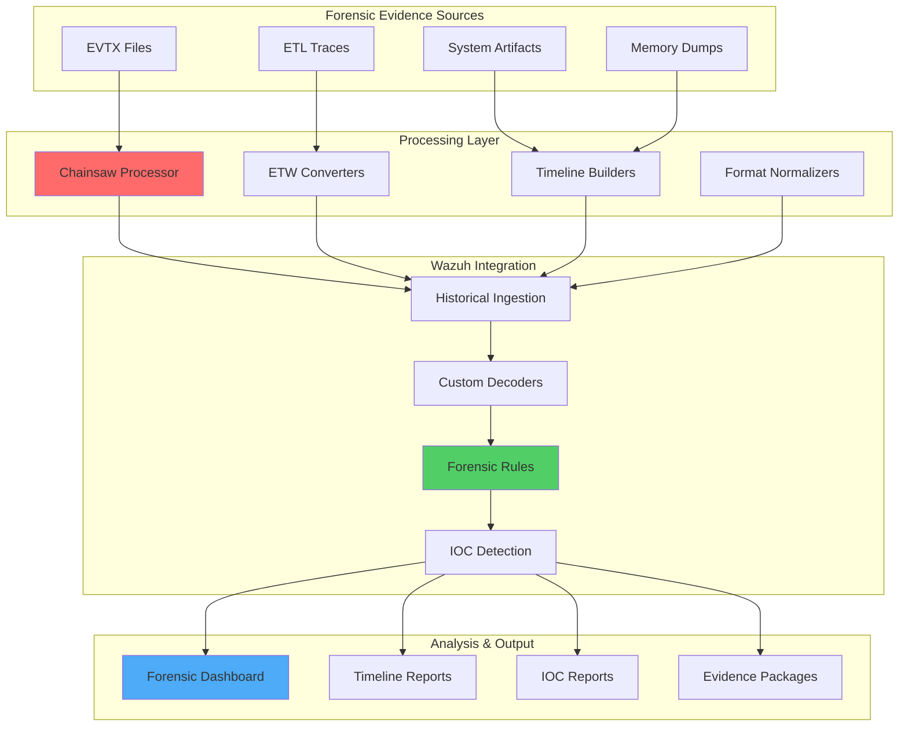

# Analyzing Historical ETW and Windows Event Logs with Wazuh for Digital Forensics

## Introduction

Digital forensics and incident response often require analyzing historical log data from compromised systems. While Wazuh excels at real-time monitoring, forensic investigations frequently involve analyzing archived Windows Event Logs (EVTX files) and ETW traces collected from previously compromised systems.

This comprehensive guide provides production-ready methods to:

- 📂 **Process Historical EVTX Files**: Import and analyze archived Windows Event Logs
- 🔍 **ETW Trace Analysis**: Extract insights from historical ETW traces  
- 🕵️ **IOC Detection**: Identify indicators of compromise in historical data
- ⏰ **Timeline Reconstruction**: Build attack timelines from log artifacts
- 📊 **Forensic Reporting**: Generate comprehensive incident reports
- 🔄 **Integration Workflows**: Seamlessly incorporate into existing DFIR processes

## Understanding Historical Log Analysis Challenges

### Traditional SIEM Limitations



### Key Challenges

| Challenge | Impact | Solution |
|-----------|---------|----------|
| **File Format Compatibility** | EVTX not natively supported | Conversion to supported formats |
| **Volume Processing** | Large historical datasets | Parallel processing pipelines |
| **Context Preservation** | Loss of temporal relationships | Timeline-aware analysis |
| **IOC Detection** | Manual correlation required | Automated rule-based detection |
| **Reporting** | Fragmented evidence | Unified forensic dashboards |

## Architecture Overview

### Complete Forensic Analysis Pipeline



## Method 1: EVTX Analysis with Chainsaw Integration

### Phase 1: Chainsaw Installation and Configuration

Chainsaw is a powerful tool for EVTX analysis that can output in formats compatible with Wazuh.

**Installation**:

```powershell
# Download latest Chainsaw release
$version = "v2.7.0"
$url = "https://github.com/WithSecureLabs/chainsaw/releases/download/$version/chainsaw_x86_64-pc-windows-msvc.exe"
Invoke-WebRequest -Uri $url -OutFile "C:\Tools\chainsaw.exe"

# Download Sigma rules for detection
git clone https://github.com/SigmaHQ/sigma.git C:\Tools\sigma-rules

# Download EVTX samples for testing
git clone https://github.com/sbousseaden/EVTX-ATTACK-SAMPLES.git C:\Tools\evtx-samples
```

**Linux Installation**:

```bash
# Download Chainsaw for Linux
wget https://github.com/WithSecureLabs/chainsaw/releases/download/v2.7.0/chainsaw_x86_64-unknown-linux-gnu -O /usr/local/bin/chainsaw
chmod +x /usr/local/bin/chainsaw

# Download Sigma rules
git clone https://github.com/SigmaHQ/sigma.git /opt/sigma-rules

# Download EVTX samples
git clone https://github.com/sbousseaden/EVTX-ATTACK-SAMPLES.git /opt/evtx-samples
```

### Phase 2: Advanced Chainsaw Analysis Pipeline

**Comprehensive EVTX Analysis Script**:

```python
#!/usr/bin/env python3
# evtx_forensic_analyzer.py - Advanced EVTX analysis for Wazuh integration

import json
import subprocess
import os
import argparse
import logging
from datetime import datetime
from pathlib import Path
from concurrent.futures import ThreadPoolExecutor
import csv

class EVTXForensicAnalyzer:
    def __init__(self, chainsaw_path, sigma_rules_path, output_dir):
        self.chainsaw_path = chainsaw_path
        self.sigma_rules_path = sigma_rules_path
        self.output_dir = Path(output_dir)
        self.setup_logging()
        
        # Ensure output directory exists
        self.output_dir.mkdir(parents=True, exist_ok=True)
    
    def setup_logging(self):
        """Setup logging configuration"""
        logging.basicConfig(
            level=logging.INFO,
            format='%(asctime)s - %(levelname)s - %(message)s',
            handlers=[
                logging.FileHandler(self.output_dir / 'forensic_analysis.log'),
                logging.StreamHandler()
            ]
        )
        self.logger = logging.getLogger(__name__)
    
    def run_chainsaw_analysis(self, evtx_path, analysis_type="hunt"):
        """Run Chainsaw analysis on EVTX files"""
        
        evtx_file = Path(evtx_path)
        if not evtx_file.exists():
            self.logger.error(f"EVTX file not found: {evtx_path}")
            return None
        
        # Prepare output file
        output_file = self.output_dir / f"{evtx_file.stem}_{analysis_type}.json"
        
        try:
            if analysis_type == "hunt":
                # Hunt for suspicious activities using Sigma rules
                cmd = [
                    self.chainsaw_path, "hunt",
                    str(evtx_file),
                    "--rules", self.sigma_rules_path,
                    "--json",
                    "--output", str(output_file)
                ]
            
            elif analysis_type == "search":
                # Search for specific IOCs
                cmd = [
                    self.chainsaw_path, "search",
                    str(evtx_file),
                    "--json",
                    "--output", str(output_file)
                ]
            
            elif analysis_type == "dump":
                # Dump all events in structured format
                cmd = [
                    self.chainsaw_path, "dump",
                    str(evtx_file),
                    "--json",
                    "--output", str(output_file)
                ]
            
            self.logger.info(f"Running Chainsaw {analysis_type} analysis on {evtx_file.name}")
            
            result = subprocess.run(
                cmd,
                capture_output=True,
                text=True,
                timeout=3600  # 1 hour timeout
            )
            
            if result.returncode == 0:
                self.logger.info(f"Successfully completed {analysis_type} analysis: {output_file}")
                return output_file
            else:
                self.logger.error(f"Chainsaw failed: {result.stderr}")
                return None
                
        except subprocess.TimeoutExpired:
            self.logger.error(f"Chainsaw analysis timed out for {evtx_file.name}")
            return None
        except Exception as e:
            self.logger.error(f"Error running Chainsaw analysis: {str(e)}")
            return None
    
    def convert_to_wazuh_format(self, chainsaw_output_file):
        """Convert Chainsaw output to Wazuh-compatible format"""
        
        if not chainsaw_output_file or not Path(chainsaw_output_file).exists():
            return None
        
        wazuh_output_file = chainsaw_output_file.with_suffix('.wazuh.json')
        
        try:
            with open(chainsaw_output_file, 'r', encoding='utf-8') as infile, \
                 open(wazuh_output_file, 'w', encoding='utf-8') as outfile:
                
                for line in infile:
                    try:
                        chainsaw_event = json.loads(line.strip())
                        wazuh_event = self.transform_chainsaw_event(chainsaw_event)
                        
                        if wazuh_event:
                            json.dump(wazuh_event, outfile, separators=(',', ':'))
                            outfile.write('\n')
                    
                    except json.JSONDecodeError:
                        continue
                    except Exception as e:
                        self.logger.warning(f"Error transforming event: {str(e)}")
                        continue
            
            self.logger.info(f"Converted to Wazuh format: {wazuh_output_file}")
            return wazuh_output_file
            
        except Exception as e:
            self.logger.error(f"Error converting to Wazuh format: {str(e)}")
            return None
    
    def transform_chainsaw_event(self, chainsaw_event):
        """Transform Chainsaw event to Wazuh format"""
        
        try:
            # Base Wazuh event structure
            wazuh_event = {
                "timestamp": datetime.now().isoformat(),
                "agent": {
                    "name": "forensic-analysis",
                    "id": "000"
                },
                "manager": {
                    "name": "wazuh-manager"
                },
                "rule": {},
                "data": {}
            }
            
            # Extract Chainsaw detection information
            if "detections" in chainsaw_event:
                detection = chainsaw_event["detections"][0] if chainsaw_event["detections"] else {}
                
                wazuh_event["rule"] = {
                    "description": detection.get("title", "Chainsaw Detection"),
                    "level": self.map_severity_to_level(detection.get("level", "medium")),
                    "id": detection.get("id", "100000"),
                    "groups": ["chainsaw", "forensic", detection.get("status", "")]
                }
                
                # Add MITRE ATT&CK information
                if "tags" in detection:
                    attack_tags = [tag for tag in detection["tags"] if tag.startswith("attack.")]
                    if attack_tags:
                        wazuh_event["rule"]["mitre"] = {
                            "tactic": [tag.replace("attack.", "") for tag in attack_tags]
                        }
            
            # Extract Windows event data
            if "Event" in chainsaw_event:
                event_data = chainsaw_event["Event"]
                
                wazuh_event["data"]["win"] = {
                    "eventdata": {},
                    "system": {}
                }
                
                # System information
                if "System" in event_data:
                    system = event_data["System"]
                    wazuh_event["data"]["win"]["system"] = {
                        "eventID": str(system.get("EventID", "")),
                        "computer": system.get("Computer", ""),
                        "channel": system.get("Channel", ""),
                        "level": system.get("Level", ""),
                        "processID": str(system.get("Execution", {}).get("ProcessID", "")),
                        "threadID": str(system.get("Execution", {}).get("ThreadID", "")),
                        "providerName": system.get("Provider", {}).get("Name", "")
                    }
                    
                    # Preserve original timestamp
                    if "TimeCreated" in system:
                        wazuh_event["timestamp"] = system["TimeCreated"].get("SystemTime", "")
                
                # Event data
                if "EventData" in event_data:
                    event_data_dict = event_data["EventData"]
                    if isinstance(event_data_dict, dict):
                        wazuh_event["data"]["win"]["eventdata"] = event_data_dict
            
            # Add forensic metadata
            wazuh_event["data"]["forensic"] = {
                "analysis_tool": "chainsaw",
                "analysis_time": datetime.now().isoformat(),
                "original_source": chainsaw_event.get("source", "unknown")
            }
            
            return wazuh_event
            
        except Exception as e:
            self.logger.error(f"Error transforming event: {str(e)}")
            return None
    
    def map_severity_to_level(self, chainsaw_level):
        """Map Chainsaw severity to Wazuh level"""
        mapping = {
            "low": 3,
            "medium": 6,
            "high": 9,
            "critical": 12
        }
        return mapping.get(chainsaw_level.lower(), 6)
    
    def process_multiple_evtx_files(self, evtx_directory, max_workers=4):
        """Process multiple EVTX files in parallel"""
        
        evtx_files = list(Path(evtx_directory).glob("*.evtx"))
        
        if not evtx_files:
            self.logger.warning(f"No EVTX files found in {evtx_directory}")
            return []
        
        self.logger.info(f"Processing {len(evtx_files)} EVTX files")
        
        results = []
        with ThreadPoolExecutor(max_workers=max_workers) as executor:
            futures = []
            
            for evtx_file in evtx_files:
                # Submit multiple analysis types
                for analysis_type in ["hunt", "dump"]:
                    future = executor.submit(self.run_chainsaw_analysis, str(evtx_file), analysis_type)
                    futures.append((future, evtx_file, analysis_type))
            
            # Collect results
            for future, evtx_file, analysis_type in futures:
                try:
                    result = future.result(timeout=3600)
                    if result:
                        # Convert to Wazuh format
                        wazuh_file = self.convert_to_wazuh_format(result)
                        if wazuh_file:
                            results.append({
                                "evtx_file": str(evtx_file),
                                "analysis_type": analysis_type,
                                "wazuh_output": str(wazuh_file)
                            })
                except Exception as e:
                    self.logger.error(f"Error processing {evtx_file} ({analysis_type}): {str(e)}")
        
        return results
    
    def generate_forensic_summary(self, results):
        """Generate forensic analysis summary"""
        
        summary = {
            "analysis_timestamp": datetime.now().isoformat(),
            "total_files_processed": len(set(r["evtx_file"] for r in results)),
            "analysis_types": list(set(r["analysis_type"] for r in results)),
            "output_files": len(results),
            "key_findings": [],
            "recommendations": []
        }
        
        # Analyze results for key findings
        for result in results:
            if result["analysis_type"] == "hunt":
                # Count detections in hunt results
                try:
                    with open(result["wazuh_output"], 'r') as f:
                        detection_count = sum(1 for line in f)
                    
                    if detection_count > 0:
                        summary["key_findings"].append({
                            "file": Path(result["evtx_file"]).name,
                            "detections": detection_count,
                            "type": "sigma_detections"
                        })
                
                except Exception:
                    pass
        
        # Add recommendations
        if summary["key_findings"]:
            summary["recommendations"].extend([
                "Review high-severity detections first",
                "Correlate findings with timeline analysis",
                "Investigate process execution chains",
                "Check for lateral movement indicators"
            ])
        
        # Save summary
        summary_file = self.output_dir / "forensic_summary.json"
        with open(summary_file, 'w') as f:
            json.dump(summary, f, indent=2)
        
        self.logger.info(f"Forensic summary saved: {summary_file}")
        return summary

def main():
    parser = argparse.ArgumentParser(description="EVTX Forensic Analyzer for Wazuh")
    parser.add_argument("--evtx-dir", required=True, help="Directory containing EVTX files")
    parser.add_argument("--chainsaw", default="chainsaw", help="Path to Chainsaw executable")
    parser.add_argument("--sigma-rules", default="/opt/sigma-rules", help="Path to Sigma rules directory")
    parser.add_argument("--output", default="./forensic_output", help="Output directory")
    parser.add_argument("--workers", type=int, default=4, help="Number of parallel workers")
    
    args = parser.parse_args()
    
    analyzer = EVTXForensicAnalyzer(
        chainsaw_path=args.chainsaw,
        sigma_rules_path=args.sigma_rules,
        output_dir=args.output
    )
    
    # Process all EVTX files
    results = analyzer.process_multiple_evtx_files(args.evtx_dir, args.workers)
    
    # Generate summary
    summary = analyzer.generate_forensic_summary(results)
    
    print(f"\nForensic Analysis Complete!")
    print(f"Files processed: {summary['total_files_processed']}")
    print(f"Output files: {summary['output_files']}")
    print(f"Key findings: {len(summary['key_findings'])}")

if __name__ == "__main__":
    main()
```

### Phase 3: Wazuh Integration Configuration

**Forensic Log Collection Configuration**:

```xml
<!-- /var/ossec/etc/ossec.conf on Wazuh Manager -->
<ossec_config>
  <!-- Monitor forensic analysis output -->
  <localfile>
    <location>/var/forensic/chainsaw/*.wazuh.json</location>
    <log_format>json</log_format>
  </localfile>
  
  <!-- Monitor forensic summaries -->
  <localfile>
    <location>/var/forensic/summaries/*.json</location>
    <log_format>json</log_format>
  </localfile>
</ossec_config>
```

**Advanced Forensic Decoders**:

```xml
<!-- /var/ossec/etc/decoders/local_decoder.xml -->

<!-- Chainsaw Forensic Decoder -->
<decoder name="chainsaw-forensic">
  <prematch>"analysis_tool":"chainsaw"</prematch>
</decoder>

<decoder name="chainsaw-detection">
  <parent>chainsaw-forensic</parent>
  <regex>"title":"([^"]+)".*"level":"([^"]+)"</regex>
  <order>detection_title, severity_level</order>
</decoder>

<!-- Windows Forensic Event Decoder -->
<decoder name="windows-forensic-event">
  <parent>chainsaw-forensic</parent>
  <regex>"eventID":"(\d+)".*"computer":"([^"]+)"</regex>
  <order>event_id, computer_name</order>
</decoder>

<!-- MITRE ATT&CK Decoder -->
<decoder name="mitre-attack">
  <parent>chainsaw-forensic</parent>
  <regex>"tactic":\["([^"]+)"\]</regex>
  <order>mitre_tactic</order>
</decoder>

<!-- Process Activity Decoder -->
<decoder name="process-activity">
  <parent>chainsaw-forensic</parent>
  <regex>"ProcessName":"([^"]+)".*"CommandLine":"([^"]+)"</regex>
  <order>process_name, command_line</order>
</decoder>

<!-- Network Activity Decoder -->
<decoder name="network-forensic">
  <parent>chainsaw-forensic</parent>
  <regex>"DestinationIp":"([^"]+)".*"DestinationPort":"([^"]+)"</regex>
  <order>dest_ip, dest_port</order>
</decoder>

<!-- Authentication Events Decoder -->
<decoder name="auth-forensic">
  <parent>chainsaw-forensic</parent>
  <regex>"TargetUserName":"([^"]+)".*"LogonType":"([^"]+)"</regex>
  <order>target_user, logon_type</order>
</decoder>
```

**Comprehensive Forensic Detection Rules**:

```xml
<!-- /var/ossec/etc/rules/local_rules.xml -->

<group name="forensic,chainsaw,">
  <!-- Base Forensic Rules -->
  <rule id="300000" level="0">
    <decoded_as>chainsaw-forensic</decoded_as>
    <description>Chainsaw forensic analysis events</description>
    <group>forensic,</group>
  </rule>

  <!-- High-Severity Detections -->
  <rule id="300001" level="12">
    <if_sid>300000</if_sid>
    <field name="severity_level">high|critical</field>
    <description>High-severity forensic detection: $(detection_title)</description>
    <group>high_severity,critical_finding,</group>
  </rule>

  <!-- MITRE ATT&CK Techniques -->
  <rule id="300010" level="8">
    <if_sid>300000</if_sid>
    <field name="mitre_tactic">execution|persistence|privilege_escalation</field>
    <description>MITRE ATT&CK technique detected: $(mitre_tactic) - $(detection_title)</description>
    <group>mitre_attack,$(mitre_tactic),</group>
  </rule>

  <!-- Process Execution Analysis -->
  <rule id="300020" level="6">
    <if_sid>300000</if_sid>
    <field name="process_name">powershell.exe|cmd.exe|rundll32.exe</field>
    <description>Suspicious process execution: $(process_name)</description>
    <group>process_execution,suspicious_process,</group>
  </rule>

  <rule id="300021" level="9">
    <if_sid>300020</if_sid>
    <field name="command_line" type="pcre2">-enc|-encoded|bypass|unrestricted|downloadstring</field>
    <description>Malicious PowerShell execution: $(command_line)</description>
    <group>powershell_attack,malicious_command,</group>
  </rule>

  <!-- Authentication Analysis -->
  <rule id="300030" level="5">
    <if_sid>300000</if_sid>
    <field name="event_id">4624</field>
    <description>Successful logon: $(target_user) - Type $(logon_type)</description>
    <group>authentication,successful_logon,</group>
  </rule>

  <rule id="300031" level="8">
    <if_sid>300000</if_sid>
    <field name="event_id">4625</field>
    <description>Failed logon attempt: $(target_user)</description>
    <group>authentication,failed_logon,</group>
  </rule>

  <rule id="300032" level="10" frequency="5" timeframe="300">
    <if_sid>300031</if_sid>
    <same_field>target_user</same_field>
    <description>Multiple failed logon attempts: $(target_user)</description>
    <group>brute_force,authentication_attack,</group>
  </rule>

  <!-- Network Connection Analysis -->
  <rule id="300040" level="4">
    <if_sid>300000</if_sid>
    <field name="event_id">5156</field>
    <description>Network connection allowed: $(dest_ip):$(dest_port)</description>
    <group>network_connection,allowed_connection,</group>
  </rule>

  <rule id="300041" level="7">
    <if_sid>300040</if_sid>
    <field name="dest_port">22|23|135|139|445|3389</field>
    <description>Connection to administrative port: $(dest_ip):$(dest_port)</description>
    <group>admin_port,lateral_movement,</group>
  </rule>

  <!-- File System Activity -->
  <rule id="300050" level="4">
    <if_sid>300000</if_sid>
    <field name="event_id">4656|4658|4663</field>
    <description>File system access: $(process_name)</description>
    <group>file_access,</group>
  </rule>

  <rule id="300051" level="8">
    <if_sid>300050</if_sid>
    <match>\.exe|\.dll|\.bat|\.ps1|\.vbs</match>
    <description>Executable file access: $(process_name)</description>
    <group>executable_access,potential_malware,</group>
  </rule>

  <!-- Registry Modification -->
  <rule id="300060" level="6">
    <if_sid>300000</if_sid>
    <field name="event_id">4657</field>
    <description>Registry value modified</description>
    <group>registry_modification,</group>
  </rule>

  <rule id="300061" level="9">
    <if_sid>300060</if_sid>
    <match>\\Run\\|\\RunOnce\\|\\Image File Execution Options\\</match>
    <description>Critical registry key modified: persistence mechanism</description>
    <group>persistence,registry_persistence,</group>
  </rule>

  <!-- Correlation Rules -->
  <rule id="300100" level="12">
    <if_matched_sid>300021</if_matched_sid>
    <if_matched_sid>300041</if_matched_sid>
    <same_field>computer_name</same_field>
    <timeframe>600</timeframe>
    <description>Malicious PowerShell followed by network connection</description>
    <group>correlation,multi_stage_attack,</group>
  </rule>

  <rule id="300101" level="13">
    <if_matched_sid>300032</if_matched_sid>
    <if_matched_sid>300030</if_matched_sid>
    <same_field>target_user</same_field>
    <timeframe>300</timeframe>
    <description>Successful logon after multiple failed attempts</description>
    <group>correlation,successful_brute_force,</group>
  </rule>

  <!-- Timeline Analysis -->
  <rule id="300200" level="0">
    <if_sid>300000</if_sid>
    <description>Timeline event: $(detection_title) at $(timestamp)</description>
    <group>timeline,forensic_timeline,</group>
  </rule>
</group>
```

## Method 2: ETW Trace Analysis

### Phase 1: ETW Trace Processing

**ETW Forensic Processor**:

```python
#!/usr/bin/env python3
# etw_forensic_processor.py - Process historical ETW traces

import json
import subprocess
import xml.etree.ElementTree as ET
from pathlib import Path
import logging
from datetime import datetime

class ETWForensicProcessor:
    def __init__(self, output_dir):
        self.output_dir = Path(output_dir)
        self.output_dir.mkdir(parents=True, exist_ok=True)
        self.setup_logging()
    
    def setup_logging(self):
        """Setup logging configuration"""
        logging.basicConfig(
            level=logging.INFO,
            format='%(asctime)s - %(levelname)s - %(message)s',
            handlers=[
                logging.FileHandler(self.output_dir / 'etw_forensic.log'),
                logging.StreamHandler()
            ]
        )
        self.logger = logging.getLogger(__name__)
    
    def process_etl_file(self, etl_file_path):
        """Process ETL file and convert to Wazuh format"""
        
        etl_path = Path(etl_file_path)
        if not etl_path.exists():
            self.logger.error(f"ETL file not found: {etl_file_path}")
            return None
        
        # Convert ETL to XML using tracerpt
        xml_output = self.output_dir / f"{etl_path.stem}.xml"
        csv_output = self.output_dir / f"{etl_path.stem}.csv"
        
        try:
            # Run tracerpt to convert ETL to XML and CSV
            cmd = [
                "tracerpt", str(etl_path),
                "-o", str(xml_output),
                "-of", "XML",
                "-report", str(csv_output),
                "-summary", str(self.output_dir / f"{etl_path.stem}_summary.txt")
            ]
            
            result = subprocess.run(cmd, capture_output=True, text=True, timeout=1800)
            
            if result.returncode == 0:
                self.logger.info(f"Successfully converted {etl_path.name} to XML")
                return self.parse_etw_xml(xml_output)
            else:
                self.logger.error(f"tracerpt failed: {result.stderr}")
                return None
                
        except subprocess.TimeoutExpired:
            self.logger.error(f"ETL processing timed out: {etl_path.name}")
            return None
        except Exception as e:
            self.logger.error(f"Error processing ETL file: {str(e)}")
            return None
    
    def parse_etw_xml(self, xml_file_path):
        """Parse ETW XML and convert to Wazuh events"""
        
        wazuh_events = []
        
        try:
            tree = ET.parse(xml_file_path)
            root = tree.getroot()
            
            for event in root.findall('.//Event'):
                wazuh_event = self.convert_etw_event_to_wazuh(event)
                if wazuh_event:
                    wazuh_events.append(wazuh_event)
            
            # Save Wazuh events
            wazuh_output = xml_file_path.with_suffix('.wazuh.json')
            with open(wazuh_output, 'w') as f:
                for event in wazuh_events:
                    json.dump(event, f, separators=(',', ':'))
                    f.write('\n')
            
            self.logger.info(f"Converted {len(wazuh_events)} ETW events to Wazuh format")
            return wazuh_output
            
        except Exception as e:
            self.logger.error(f"Error parsing ETW XML: {str(e)}")
            return None
    
    def convert_etw_event_to_wazuh(self, etw_event):
        """Convert ETW event to Wazuh format"""
        
        try:
            # Base Wazuh event structure
            wazuh_event = {
                "timestamp": datetime.now().isoformat(),
                "agent": {"name": "etw-forensic", "id": "000"},
                "data": {"etw": {}}
            }
            
            # Extract system information
            system = etw_event.find('.//System')
            if system is not None:
                provider = system.find('.//Provider')
                if provider is not None:
                    wazuh_event["data"]["etw"]["provider_name"] = provider.get('Name', '')
                    wazuh_event["data"]["etw"]["provider_guid"] = provider.get('Guid', '')
                
                # Event details
                event_id = system.find('.//EventID')
                if event_id is not None:
                    wazuh_event["data"]["etw"]["event_id"] = event_id.text
                
                level = system.find('.//Level')
                if level is not None:
                    wazuh_event["data"]["etw"]["level"] = level.text
                
                # Timestamp
                time_created = system.find('.//TimeCreated')
                if time_created is not None:
                    wazuh_event["timestamp"] = time_created.get('SystemTime', '')
                
                # Process information
                execution = system.find('.//Execution')
                if execution is not None:
                    wazuh_event["data"]["etw"]["process_id"] = execution.get('ProcessID', '')
                    wazuh_event["data"]["etw"]["thread_id"] = execution.get('ThreadID', '')
            
            # Extract event data
            event_data = etw_event.find('.//EventData')
            if event_data is not None:
                data_fields = {}
                for data in event_data.findall('.//Data'):
                    name = data.get('Name')
                    value = data.text
                    if name and value:
                        data_fields[name] = value
                
                if data_fields:
                    wazuh_event["data"]["etw"]["event_data"] = data_fields
            
            # Add forensic metadata
            wazuh_event["data"]["etw"]["forensic_analysis"] = {
                "analysis_tool": "tracerpt",
                "analysis_time": datetime.now().isoformat(),
                "data_source": "etw_trace"
            }
            
            return wazuh_event
            
        except Exception as e:
            self.logger.error(f"Error converting ETW event: {str(e)}")
            return None

def main():
    import argparse
    
    parser = argparse.ArgumentParser(description="ETW Forensic Processor")
    parser.add_argument("--etl-file", required=True, help="Path to ETL file")
    parser.add_argument("--output", default="./etw_forensic_output", help="Output directory")
    
    args = parser.parse_args()
    
    processor = ETWForensicProcessor(args.output)
    result = processor.process_etl_file(args.etl_file)
    
    if result:
        print(f"ETW forensic analysis completed: {result}")
    else:
        print("ETW forensic analysis failed")

if __name__ == "__main__":
    main()
```

## Method 3: Timeline Reconstruction

### Advanced Timeline Analysis

**Timeline Builder**:

```python
#!/usr/bin/env python3
# timeline_builder.py - Build forensic timelines from Wazuh events

import json
import pandas as pd
from datetime import datetime, timedelta
import plotly.graph_objects as go
import plotly.express as px
from pathlib import Path

class ForensicTimelineBuilder:
    def __init__(self, wazuh_events_file, output_dir):
        self.events_file = Path(wazuh_events_file)
        self.output_dir = Path(output_dir)
        self.output_dir.mkdir(parents=True, exist_ok=True)
        self.events_df = None
    
    def load_events(self):
        """Load Wazuh forensic events"""
        
        events = []
        try:
            with open(self.events_file, 'r') as f:
                for line in f:
                    event = json.loads(line.strip())
                    events.append(event)
            
            self.events_df = pd.DataFrame(events)
            self.events_df['timestamp'] = pd.to_datetime(self.events_df['timestamp'])
            
            print(f"Loaded {len(events)} forensic events")
            return True
            
        except Exception as e:
            print(f"Error loading events: {str(e)}")
            return False
    
    def build_attack_timeline(self):
        """Build attack timeline with key events"""
        
        if self.events_df is None or self.events_df.empty:
            print("No events loaded")
            return None
        
        # Define key event types for timeline
        key_events = {
            "Authentication": ["successful_logon", "failed_logon", "brute_force"],
            "Process Execution": ["process_execution", "powershell_attack"],
            "Network Activity": ["network_connection", "lateral_movement"],
            "File System": ["file_access", "executable_access"],
            "Persistence": ["registry_persistence", "persistence"],
            "Privilege Escalation": ["privilege_escalation"],
            "Defense Evasion": ["defense_evasion"]
        }
        
        timeline_events = []
        
        for index, event in self.events_df.iterrows():
            # Extract relevant information
            timestamp = event['timestamp']
            description = event.get('rule', {}).get('description', 'Unknown event')
            level = event.get('rule', {}).get('level', 0)
            groups = event.get('rule', {}).get('groups', [])
            
            # Categorize event
            category = "Other"
            for cat, group_list in key_events.items():
                if any(group in groups for group in group_list):
                    category = cat
                    break
            
            timeline_events.append({
                'timestamp': timestamp,
                'description': description,
                'category': category,
                'level': level,
                'groups': ', '.join(groups) if isinstance(groups, list) else str(groups)
            })
        
        timeline_df = pd.DataFrame(timeline_events)
        timeline_df = timeline_df.sort_values('timestamp')
        
        # Save timeline as CSV
        timeline_file = self.output_dir / "attack_timeline.csv"
        timeline_df.to_csv(timeline_file, index=False)
        
        print(f"Attack timeline saved: {timeline_file}")
        return timeline_df
    
    def create_interactive_timeline(self, timeline_df):
        """Create interactive timeline visualization"""
        
        if timeline_df is None or timeline_df.empty:
            return None
        
        # Create timeline chart
        fig = px.scatter(
            timeline_df,
            x='timestamp',
            y='category',
            color='level',
            size='level',
            hover_data=['description', 'groups'],
            title="Forensic Attack Timeline",
            color_continuous_scale="Reds"
        )
        
        fig.update_layout(
            xaxis_title="Time",
            yaxis_title="Event Category",
            height=600,
            hovermode='closest'
        )
        
        # Save interactive timeline
        timeline_html = self.output_dir / "interactive_timeline.html"
        fig.write_html(str(timeline_html))
        
        print(f"Interactive timeline saved: {timeline_html}")
        return timeline_html
    
    def generate_timeline_report(self, timeline_df):
        """Generate comprehensive timeline report"""
        
        if timeline_df is None or timeline_df.empty:
            return None
        
        # Calculate timeline statistics
        stats = {
            "total_events": len(timeline_df),
            "time_range": {
                "start": timeline_df['timestamp'].min().isoformat(),
                "end": timeline_df['timestamp'].max().isoformat(),
                "duration_hours": (timeline_df['timestamp'].max() - timeline_df['timestamp'].min()).total_seconds() / 3600
            },
            "event_categories": timeline_df['category'].value_counts().to_dict(),
            "severity_distribution": timeline_df['level'].value_counts().to_dict(),
            "critical_events": timeline_df[timeline_df['level'] >= 10].to_dict('records'),
            "attack_phases": []
        }
        
        # Identify attack phases
        high_severity_events = timeline_df[timeline_df['level'] >= 8].sort_values('timestamp')
        
        if not high_severity_events.empty:
            phases = []
            current_phase = []
            last_timestamp = None
            
            for _, event in high_severity_events.iterrows():
                if last_timestamp is None or (event['timestamp'] - last_timestamp).total_seconds() <= 3600:  # Within 1 hour
                    current_phase.append({
                        "timestamp": event['timestamp'].isoformat(),
                        "description": event['description'],
                        "category": event['category']
                    })
                else:
                    if current_phase:
                        phases.append({
                            "phase": len(phases) + 1,
                            "start_time": current_phase[0]['timestamp'],
                            "end_time": current_phase[-1]['timestamp'],
                            "events": current_phase
                        })
                    current_phase = [{
                        "timestamp": event['timestamp'].isoformat(),
                        "description": event['description'],
                        "category": event['category']
                    }]
                
                last_timestamp = event['timestamp']
            
            # Add final phase
            if current_phase:
                phases.append({
                    "phase": len(phases) + 1,
                    "start_time": current_phase[0]['timestamp'],
                    "end_time": current_phase[-1]['timestamp'],
                    "events": current_phase
                })
            
            stats["attack_phases"] = phases
        
        # Save report
        report_file = self.output_dir / "timeline_report.json"
        with open(report_file, 'w') as f:
            json.dump(stats, f, indent=2, default=str)
        
        print(f"Timeline report saved: {report_file}")
        return stats

def main():
    import argparse
    
    parser = argparse.ArgumentParser(description="Forensic Timeline Builder")
    parser.add_argument("--events", required=True, help="Wazuh forensic events file")
    parser.add_argument("--output", default="./timeline_output", help="Output directory")
    
    args = parser.parse_args()
    
    builder = ForensicTimelineBuilder(args.events, args.output)
    
    if builder.load_events():
        timeline_df = builder.build_attack_timeline()
        if timeline_df is not None:
            builder.create_interactive_timeline(timeline_df)
            builder.generate_timeline_report(timeline_df)
            print("Timeline analysis completed successfully")
    else:
        print("Failed to load events")

if __name__ == "__main__":
    main()
```

## Complete Forensic Workflow

### Phase 1: Automated Forensic Pipeline

**Master Forensic Analysis Script**:

```bash
#!/bin/bash
# forensic_pipeline.sh - Complete forensic analysis pipeline

set -e

# Configuration
EVIDENCE_DIR="$1"
OUTPUT_DIR="$2"
CHAINSAW_PATH="/usr/local/bin/chainsaw"
SIGMA_RULES_PATH="/opt/sigma-rules"

# Validate inputs
if [ -z "$EVIDENCE_DIR" ] || [ -z "$OUTPUT_DIR" ]; then
    echo "Usage: $0 <evidence_directory> <output_directory>"
    echo "Example: $0 /forensic_evidence /forensic_analysis"
    exit 1
fi

if [ ! -d "$EVIDENCE_DIR" ]; then
    echo "Error: Evidence directory not found: $EVIDENCE_DIR"
    exit 1
fi

# Create output structure
mkdir -p "$OUTPUT_DIR"/{evtx,etw,timeline,reports}

echo "Starting forensic analysis pipeline..."
echo "Evidence directory: $EVIDENCE_DIR"
echo "Output directory: $OUTPUT_DIR"

# Phase 1: Process EVTX files
echo "Phase 1: Processing EVTX files..."
EVTX_FILES=$(find "$EVIDENCE_DIR" -name "*.evtx" -type f | wc -l)

if [ "$EVTX_FILES" -gt 0 ]; then
    echo "Found $EVTX_FILES EVTX files"
    
    python3 evtx_forensic_analyzer.py \
        --evtx-dir "$EVIDENCE_DIR" \
        --chainsaw "$CHAINSAW_PATH" \
        --sigma-rules "$SIGMA_RULES_PATH" \
        --output "$OUTPUT_DIR/evtx" \
        --workers 4
    
    echo "EVTX processing completed"
else
    echo "No EVTX files found"
fi

# Phase 2: Process ETW traces
echo "Phase 2: Processing ETW traces..."
ETL_FILES=$(find "$EVIDENCE_DIR" -name "*.etl" -type f | wc -l)

if [ "$ETL_FILES" -gt 0 ]; then
    echo "Found $ETL_FILES ETL files"
    
    for etl_file in $(find "$EVIDENCE_DIR" -name "*.etl" -type f); do
        echo "Processing: $(basename "$etl_file")"
        
        python3 etw_forensic_processor.py \
            --etl-file "$etl_file" \
            --output "$OUTPUT_DIR/etw"
    done
    
    echo "ETW processing completed"
else
    echo "No ETL files found"
fi

# Phase 3: Consolidate events for timeline
echo "Phase 3: Building timeline..."
WAZUH_EVENTS="$OUTPUT_DIR/timeline/consolidated_events.json"

# Consolidate all Wazuh-formatted events
cat "$OUTPUT_DIR"/evtx/*.wazuh.json "$OUTPUT_DIR"/etw/*.wazuh.json 2>/dev/null > "$WAZUH_EVENTS" || touch "$WAZUH_EVENTS"

if [ -s "$WAZUH_EVENTS" ]; then
    python3 timeline_builder.py \
        --events "$WAZUH_EVENTS" \
        --output "$OUTPUT_DIR/timeline"
    
    echo "Timeline analysis completed"
else
    echo "No events available for timeline analysis"
fi

# Phase 4: Generate comprehensive report
echo "Phase 4: Generating forensic report..."

python3 -c "
import json
import os
from pathlib import Path
from datetime import datetime

# Collect all analysis results
output_dir = Path('$OUTPUT_DIR')
report = {
    'analysis_timestamp': datetime.now().isoformat(),
    'evidence_directory': '$EVIDENCE_DIR',
    'analysis_summary': {
        'evtx_files_processed': 0,
        'etl_files_processed': 0,
        'total_events_analyzed': 0,
        'critical_findings': 0,
        'timeline_events': 0
    },
    'key_findings': [],
    'recommendations': [],
    'files_generated': []
}

# Count processed files
evtx_dir = output_dir / 'evtx'
if evtx_dir.exists():
    report['analysis_summary']['evtx_files_processed'] = len(list(evtx_dir.glob('*.evtx')))

etw_dir = output_dir / 'etw'
if etw_dir.exists():
    report['analysis_summary']['etl_files_processed'] = len(list(etw_dir.glob('*.etl')))

# Load forensic summary if available
summary_file = evtx_dir / 'forensic_summary.json' if evtx_dir.exists() else None
if summary_file and summary_file.exists():
    with open(summary_file) as f:
        evtx_summary = json.load(f)
        report['key_findings'].extend(evtx_summary.get('key_findings', []))

# Load timeline report if available
timeline_dir = output_dir / 'timeline'
timeline_report_file = timeline_dir / 'timeline_report.json' if timeline_dir.exists() else None
if timeline_report_file and timeline_report_file.exists():
    with open(timeline_report_file) as f:
        timeline_report = json.load(f)
        report['analysis_summary']['timeline_events'] = timeline_report.get('total_events', 0)
        report['analysis_summary']['critical_findings'] = len(timeline_report.get('critical_events', []))

# Add recommendations
report['recommendations'] = [
    'Review all critical findings immediately',
    'Correlate timeline events with network logs',
    'Investigate process execution chains',
    'Check for lateral movement indicators',
    'Validate findings with additional evidence sources',
    'Document all findings for legal proceedings'
]

# List generated files
for root, dirs, files in os.walk(output_dir):
    for file in files:
        file_path = os.path.join(root, file)
        relative_path = os.path.relpath(file_path, output_dir)
        report['files_generated'].append(relative_path)

# Save master report
report_file = output_dir / 'reports' / 'master_forensic_report.json'
with open(report_file, 'w') as f:
    json.dump(report, f, indent=2, default=str)

print(f'Master forensic report saved: {report_file}')
print(f'Total files analyzed: {report[\"analysis_summary\"][\"evtx_files_processed\"] + report[\"analysis_summary\"][\"etl_files_processed\"]}')
print(f'Critical findings: {report[\"analysis_summary\"][\"critical_findings\"]}')
print(f'Output files generated: {len(report[\"files_generated\"])}')
"

echo ""
echo "Forensic Analysis Pipeline Completed!"
echo "Results saved to: $OUTPUT_DIR"
echo ""
echo "Key files generated:"
echo "- EVTX Analysis: $OUTPUT_DIR/evtx/"
echo "- ETW Analysis: $OUTPUT_DIR/etw/"
echo "- Timeline: $OUTPUT_DIR/timeline/"
echo "- Reports: $OUTPUT_DIR/reports/"
echo ""
echo "Next steps:"
echo "1. Review master_forensic_report.json"
echo "2. Examine interactive_timeline.html"
echo "3. Import Wazuh events into SIEM for further analysis"
```

### Phase 2: Wazuh Dashboard Integration

**Forensic Dashboard Configuration**:

```json
{
  "version": "7.14.0",
  "objects": [
    {
      "id": "forensic-analysis-dashboard",
      "type": "dashboard",
      "attributes": {
        "title": "Forensic Analysis Dashboard",
        "panels": [
          {
            "id": "critical-findings-timeline",
            "type": "visualization",
            "gridData": {
              "x": 0,
              "y": 0,
              "w": 48,
              "h": 15
            }
          },
          {
            "id": "attack-techniques-matrix",
            "type": "visualization", 
            "gridData": {
              "x": 0,
              "y": 15,
              "w": 24,
              "h": 20
            }
          },
          {
            "id": "forensic-evidence-summary",
            "type": "visualization",
            "gridData": {
              "x": 24,
              "y": 15,
              "w": 24,
              "h": 20
            }
          }
        ]
      }
    }
  ]
}
```

## Conclusion

Analyzing historical Windows Event Logs and ETW traces with Wazuh provides powerful capabilities for digital forensics and incident response. By implementing the comprehensive workflows outlined in this guide, security teams can:

- 🔍 **Uncover Hidden Threats**: Analyze archived logs to discover previously undetected attacks
- ⏰ **Reconstruct Attack Timelines**: Build detailed chronologies of security incidents  
- 📊 **Generate Actionable Intelligence**: Transform raw log data into structured threat intelligence
- 🎯 **Improve Detection Capabilities**: Enhance real-time monitoring based on forensic findings
- 📈 **Support Legal Proceedings**: Provide comprehensive evidence documentation

This approach bridges the gap between traditional forensic tools and modern SIEM capabilities, enabling organizations to leverage Wazuh's powerful analytics engine for both real-time monitoring and historical analysis.

## Key Takeaways

1. **Use Chainsaw for EVTX Processing**: Most effective tool for Windows Event Log analysis
2. **Implement Parallel Processing**: Handle large datasets efficiently with concurrent analysis
3. **Focus on Timeline Reconstruction**: Temporal correlation reveals attack patterns
4. **Integrate with Existing Workflows**: Seamlessly incorporate into DFIR processes
5. **Document Everything**: Maintain comprehensive audit trails for legal requirements

## Resources

- [Chainsaw GitHub Repository](https://github.com/WithSecureLabs/chainsaw)
- [Sigma Rules Repository](https://github.com/SigmaHQ/sigma)
- [EVTX Attack Samples](https://github.com/sbousseaden/EVTX-ATTACK-SAMPLES)
- [Wazuh Forensic Integration Guide](https://documentation.wazuh.com/current/user-manual/capabilities/)

---

*Transform your forensic investigations with advanced log analysis capabilities! 🔍📊*