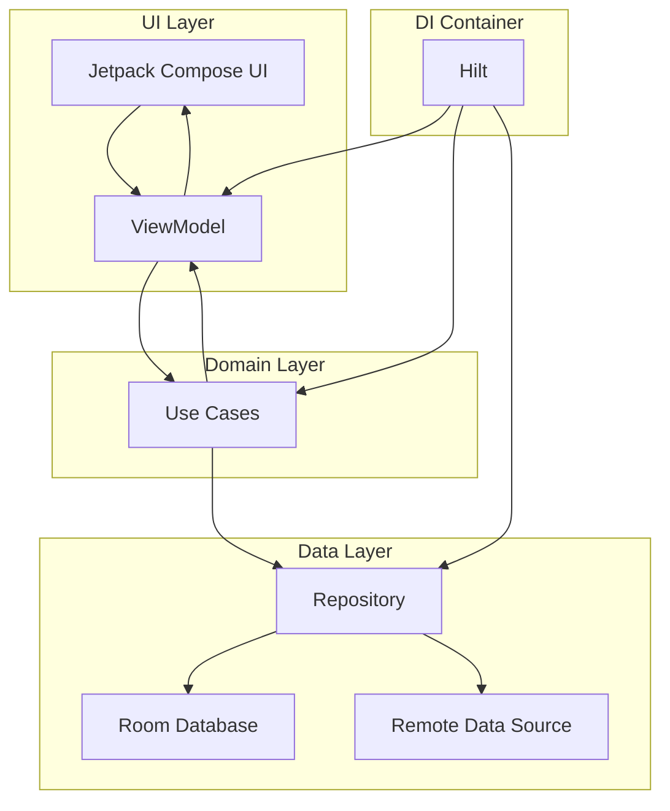
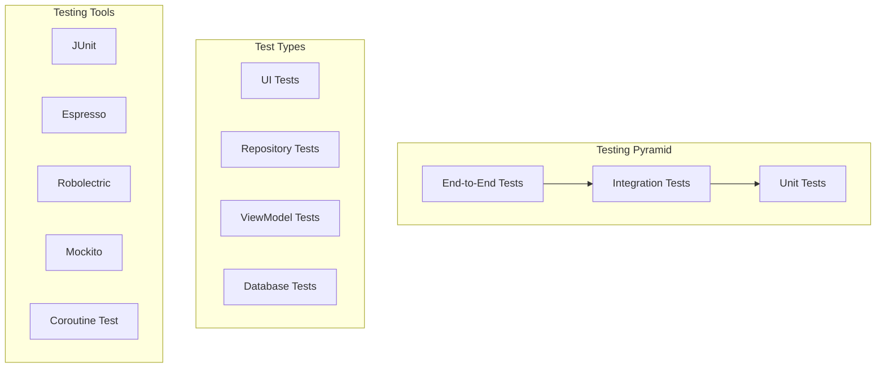

# Android Architecture Samples: Complete Guide to Modern App Development

## Introduction

Google's Android Architecture Samples repository stands as the definitive reference for building robust, testable, and maintainable Android applications. This comprehensive guide explores the architectural patterns, modern technologies, and best practices demonstrated in this essential resource for Android developers.

## Repository Overview

The Android Architecture Samples focuses on a deceptively simple TODO application that showcases sophisticated architectural decisions. The principle: "Simple enough to understand quickly, but complex enough to showcase important design decisions and testing strategies."

### Key Objectives

- **Educational Resource**: Demonstrate modern Android development patterns
- **Best Practices**: Showcase architectural design decisions
- **Testing Excellence**: Comprehensive testing strategies
- **Real-World Application**: Practical implementation examples

## Architecture Foundation

### MVVM Pattern Implementation

The repository implements a clean MVVM (Model-View-ViewModel) architecture with clear separation of concerns:



### Single Activity Architecture

Modern Android development embraces single-activity architecture with Navigation Compose:

```kotlin
// MainActivity.kt - Single Activity Implementation
@AndroidEntryPoint
class MainActivity : ComponentActivity() {
    override fun onCreate(savedInstanceState: Bundle?) {
        super.onCreate(savedInstanceState)
        
        setContent {
            TodoTheme {
                val navController = rememberNavController()
                TodoNavHost(navController = navController)
            }
        }
    }
}

// Navigation Setup
@Composable
fun TodoNavHost(navController: NavHostController) {
    NavHost(
        navController = navController,
        startDestination = "tasks"
    ) {
        composable("tasks") {
            TasksScreen(
                onTaskClick = { taskId ->
                    navController.navigate("task_detail/$taskId")
                },
                onAddTask = {
                    navController.navigate("add_task")
                }
            )
        }
        
        composable(
            "task_detail/{taskId}",
            arguments = listOf(navArgument("taskId") { type = NavType.StringType })
        ) { backStackEntry ->
            val taskId = backStackEntry.arguments?.getString("taskId")
            TaskDetailScreen(
                taskId = taskId,
                onBack = { navController.popBackStack() }
            )
        }
        
        composable("add_task") {
            AddEditTaskScreen(
                onTaskSave = { navController.popBackStack() },
                onBack = { navController.popBackStack() }
            )
        }
    }
}
```

## Technology Stack Deep Dive

### Jetpack Compose UI Implementation

The project demonstrates modern declarative UI with Jetpack Compose:

```kotlin
// TasksScreen.kt - Compose UI Implementation
@Composable
fun TasksScreen(
    onTaskClick: (String) -> Unit,
    onAddTask: () -> Unit,
    modifier: Modifier = Modifier,
    viewModel: TasksViewModel = hiltViewModel()
) {
    val uiState by viewModel.uiState.collectAsStateWithLifecycle()
    
    TasksContent(
        loading = uiState.isLoading,
        tasks = uiState.items,
        currentFilteringLabel = uiState.filteringUiInfo.currentFilteringLabel,
        noTasksLabel = uiState.filteringUiInfo.noTasksLabel,
        noTasksIconRes = uiState.filteringUiInfo.noTaskIconRes,
        onRefresh = viewModel::refresh,
        onTaskClick = onTaskClick,
        onTaskCheckedChange = viewModel::completeTask,
        onAddTask = onAddTask,
        modifier = modifier
    )
}

@Composable
private fun TasksContent(
    loading: Boolean,
    tasks: List<Task>,
    currentFilteringLabel: String,
    noTasksLabel: String,
    @DrawableRes noTasksIconRes: Int,
    onRefresh: () -> Unit,
    onTaskClick: (String) -> Unit,
    onTaskCheckedChange: (Task, Boolean) -> Unit,
    onAddTask: () -> Unit,
    modifier: Modifier = Modifier
) {
    LoadingContent(
        loading = loading,
        empty = tasks.isEmpty() && !loading,
        emptyContent = {
            TasksEmptyContent(
                noTasksLabel = noTasksLabel,
                noTasksIconRes = noTasksIconRes,
                modifier = Modifier.fillMaxSize()
            )
        },
        onRefresh = onRefresh,
        modifier = modifier
    ) {
        LazyColumn {
            items(tasks) { task ->
                TaskItem(
                    task = task,
                    onTaskClick = onTaskClick,
                    onCheckedChange = { onTaskCheckedChange(task, it) }
                )
            }
        }
    }
}
```

### ViewModel with State Management

Modern state management using StateFlow and reactive programming:

```kotlin
// TasksViewModel.kt - Reactive State Management
@HiltViewModel
class TasksViewModel @Inject constructor(
    private val tasksRepository: TasksRepository,
    private val savedStateHandle: SavedStateHandle
) : ViewModel() {

    private val _savedFilterType = savedStateHandle.getStateFlow(
        TASKS_FILTER_SAVED_STATE_KEY, 
        TasksFilterType.ALL_TASKS
    )

    private val _filterUiInfo = _savedFilterType.map { getFilterUiInfo(it) }
        .stateIn(
            scope = viewModelScope,
            started = SharingStarted.WhileSubscribed(5000),
            initialValue = getFilterUiInfo(TasksFilterType.ALL_TASKS)
        )

    private val _userMessage: MutableStateFlow<String?> = MutableStateFlow(null)
    val userMessage: StateFlow<String?> = _userMessage.asStateFlow()

    private val _isLoading = MutableStateFlow(false)
    val isLoading: StateFlow<Boolean> = _isLoading.asStateFlow()

    val uiState: StateFlow<TasksUiState> = combine(
        _filterUiInfo, 
        _isLoading, 
        _userMessage
    ) { filterUiInfo, isLoading, userMessage ->
        TasksUiState(
            items = filterTasks(tasksRepository.getTasksStream(), filterUiInfo.currentFiltering),
            isLoading = isLoading,
            filteringUiInfo = filterUiInfo,
            userMessage = userMessage
        )
    }.stateIn(
        scope = viewModelScope,
        started = SharingStarted.WhileSubscribed(5000),
        initialValue = TasksUiState(isLoading = true)
    )

    fun refresh() {
        _isLoading.value = true
        viewModelScope.launch {
            tasksRepository.refresh()
            _isLoading.value = false
        }
    }

    fun clearCompletedTasks() {
        viewModelScope.launch {
            tasksRepository.clearCompletedTasks()
            showSnackbarMessage("Completed tasks cleared")
        }
    }

    fun completeTask(task: Task, completed: Boolean) {
        viewModelScope.launch {
            if (completed) {
                tasksRepository.completeTask(task.id)
                showSnackbarMessage("Task marked as complete")
            } else {
                tasksRepository.activateTask(task.id)
                showSnackbarMessage("Task marked as active")
            }
        }
    }

    private fun showSnackbarMessage(message: String) {
        _userMessage.value = message
    }

    fun snackbarMessageShown() {
        _userMessage.value = null
    }
}

data class TasksUiState(
    val items: List<Task> = emptyList(),
    val isLoading: Boolean = false,
    val filteringUiInfo: FilteringUiInfo = FilteringUiInfo(),
    val userMessage: String? = null
)
```

### Repository Pattern Implementation

Clean data layer with repository pattern:

```kotlin
// TasksRepository.kt - Repository Interface
interface TasksRepository {
    fun getTasksStream(): Flow<List<Task>>
    fun getTaskStream(taskId: String): Flow<Task?>
    suspend fun getTasks(forceUpdate: Boolean = false): List<Task>
    suspend fun getTask(taskId: String, forceUpdate: Boolean = false): Task?
    suspend fun refresh()
    suspend fun refreshTask(taskId: String)
    suspend fun saveTask(task: Task)
    suspend fun completeTask(taskId: String)
    suspend fun completeTask(task: Task)
    suspend fun activateTask(taskId: String)
    suspend fun activateTask(task: Task)
    suspend fun clearCompletedTasks()
    suspend fun deleteAllTasks()
    suspend fun deleteTask(taskId: String)
}

// DefaultTasksRepository.kt - Repository Implementation
@Singleton
class DefaultTasksRepository @Inject constructor(
    private val localDataSource: TasksDataSource,
    private val remoteDataSource: TasksDataSource,
    @IoDispatcher private val dispatcher: CoroutineDispatcher
) : TasksRepository {

    override fun getTasksStream(): Flow<List<Task>> {
        return localDataSource.getTasksStream()
    }

    override fun getTaskStream(taskId: String): Flow<Task?> {
        return localDataSource.getTaskStream(taskId)
    }

    override suspend fun getTasks(forceUpdate: Boolean): List<Task> {
        if (forceUpdate) {
            try {
                updateTasksFromRemoteDataSource()
            } catch (ex: Exception) {
                Timber.w(ex, "Remote data source fetch failed")
            }
        }
        return localDataSource.getTasks()
    }

    override suspend fun refresh() {
        updateTasksFromRemoteDataSource()
    }

    override suspend fun saveTask(task: Task) {
        coroutineScope {
            launch { remoteDataSource.saveTask(task) }
            launch { localDataSource.saveTask(task) }
        }
    }

    override suspend fun completeTask(taskId: String) {
        coroutineScope {
            launch { remoteDataSource.completeTask(taskId) }
            launch { localDataSource.completeTask(taskId) }
        }
    }

    private suspend fun updateTasksFromRemoteDataSource() {
        withContext(dispatcher) {
            val remoteTasks = remoteDataSource.getTasks()
            localDataSource.deleteAllTasks()
            localDataSource.saveTasks(remoteTasks)
        }
    }
}
```

### Room Database Integration

Local data persistence with Room:

```kotlin
// Task.kt - Entity Model
@Entity(tableName = "tasks")
data class Task(
    @PrimaryKey val id: String = UUID.randomUUID().toString(),
    @ColumnInfo(name = "title") var title: String = "",
    @ColumnInfo(name = "description") var description: String = "",
    @ColumnInfo(name = "completed") var isCompleted: Boolean = false
) {
    val titleForList: String
        get() = if (title.isNotEmpty()) title else description

    val isActive
        get() = !isCompleted

    val isEmpty
        get() = title.isEmpty() || description.isEmpty()
}

// TaskDao.kt - Data Access Object
@Dao
interface TaskDao {
    @Query("SELECT * FROM tasks")
    fun observeAll(): Flow<List<Task>>

    @Query("SELECT * FROM tasks WHERE id = :taskId")
    fun observeById(taskId: String): Flow<Task?>

    @Query("SELECT * FROM tasks")
    suspend fun getAll(): List<Task>

    @Query("SELECT * FROM tasks WHERE id = :taskId")
    suspend fun getById(taskId: String): Task?

    @Insert(onConflict = OnConflictStrategy.REPLACE)
    suspend fun insert(task: Task)

    @Insert(onConflict = OnConflictStrategy.REPLACE)
    suspend fun insertAll(tasks: List<Task>)

    @Update
    suspend fun update(task: Task): Int

    @Query("UPDATE tasks SET completed = :completed WHERE id = :taskId")
    suspend fun updateCompleted(taskId: String, completed: Boolean)

    @Query("DELETE FROM tasks WHERE id = :taskId")
    suspend fun deleteById(taskId: String): Int

    @Query("DELETE FROM tasks")
    suspend fun deleteAll()

    @Query("DELETE FROM tasks WHERE completed = 1")
    suspend fun deleteCompleted(): Int
}

// ToDoDatabase.kt - Room Database
@Database(
    entities = [Task::class],
    version = 1,
    exportSchema = false
)
@TypeConverters(DateConverter::class)
abstract class ToDoDatabase : RoomDatabase() {
    abstract fun taskDao(): TaskDao
}
```

### Hilt Dependency Injection

Modern dependency injection with Hilt:

```kotlin
// DatabaseModule.kt - Hilt Database Module
@Module
@InstallIn(SingletonComponent::class)
object DatabaseModule {

    @Singleton
    @Provides
    fun provideDatabase(@ApplicationContext context: Context): ToDoDatabase {
        return Room.databaseBuilder(
            context.applicationContext,
            ToDoDatabase::class.java,
            "Tasks.db"
        ).build()
    }

    @Provides
    fun provideTaskDao(database: ToDoDatabase): TaskDao = database.taskDao()
}

// DataSourceModule.kt - Data Source Module
@Module
@InstallIn(SingletonComponent::class)
abstract class DataSourceModule {

    @Singleton
    @Binds
    @Local
    abstract fun bindLocalDataSource(dataSource: TasksLocalDataSource): TasksDataSource

    @Singleton
    @Binds
    @Remote
    abstract fun bindRemoteDataSource(dataSource: TasksRemoteDataSource): TasksDataSource
}

// RepositoryModule.kt - Repository Module
@Module
@InstallIn(SingletonComponent::class)
abstract class RepositoryModule {

    @Singleton
    @Binds
    abstract fun bindTasksRepository(repository: DefaultTasksRepository): TasksRepository
}

// Qualifiers.kt - Hilt Qualifiers
@Qualifier
@Retention(AnnotationRetention.RUNTIME)
annotation class Remote

@Qualifier
@Retention(AnnotationRetention.RUNTIME)
annotation class Local

@Qualifier
@Retention(AnnotationRetention.RUNTIME)
annotation class IoDispatcher

@Qualifier
@Retention(AnnotationRetention.RUNTIME)
annotation class MainDispatcher

@Qualifier
@Retention(AnnotationRetention.RUNTIME)
annotation class DefaultDispatcher
```

## Testing Architecture

### Comprehensive Testing Strategy

The repository demonstrates a three-tiered testing approach:



### Unit Testing Implementation

```kotlin
// TasksViewModelTest.kt - ViewModel Unit Tests
@ExperimentalCoroutinesApi
@RunWith(JUnit4::class)
class TasksViewModelTest {

    @get:Rule
    var mainCoroutineRule = MainCoroutineRule()

    @get:Rule
    var instantExecutorRule = InstantTaskExecutorRule()

    // Subject under test
    private lateinit var tasksViewModel: TasksViewModel

    // Use a fake repository to be injected into the viewmodel
    private lateinit var tasksRepository: FakeTasksRepository

    @Before
    fun setupViewModel() {
        tasksRepository = FakeTasksRepository()
        val task1 = Task("Title1", "Description1")
        val task2 = Task("Title2", "Description2", true)
        val task3 = Task("Title3", "Description3", true)
        tasksRepository.addTasks(task1, task2, task3)

        tasksViewModel = TasksViewModel(tasksRepository, SavedStateHandle())
    }

    @Test
    fun loadAllTasksFromRepository_loadingTogglesAndDataLoaded() = runTest {
        // Pause dispatcher so we can verify initial values
        mainCoroutineRule.dispatcher.scheduler.apply {
            pauseDispatcher()
            
            // When loading of tasks is requested
            tasksViewModel.refresh()

            // Then progress indicator is shown
            assertTrue(tasksViewModel.uiState.value.isLoading)

            // Execute pending coroutines actions
            runCurrent()

            // Then progress indicator is hidden
            assertFalse(tasksViewModel.uiState.value.isLoading)
        }
    }

    @Test
    fun loadTasks_error() = runTest {
        // Make the repository return errors
        tasksRepository.setReturnError(true)

        // Load tasks
        tasksViewModel.refresh()

        // Then progress indicator is hidden and error message is shown
        assertFalse(tasksViewModel.uiState.value.isLoading)
        assertEquals("Error loading tasks", tasksViewModel.userMessage.value)
    }

    @Test
    fun completeTask_dataAndSnackbarUpdated() = runTest {
        // With a repository that has an active task
        val task = Task("Title", "Description")
        tasksRepository.addTasks(task)

        // Complete task
        tasksViewModel.completeTask(task, true)

        // Verify the task is completed
        assertTrue(tasksRepository.tasksServiceData[task.id]?.isCompleted ?: false)

        // And snackbar message is updated
        assertEquals("Task marked as complete", tasksViewModel.userMessage.value)
    }
}
```

### Repository Testing

```kotlin
// DefaultTasksRepositoryTest.kt - Repository Tests
@ExperimentalCoroutinesApi
@RunWith(AndroidJUnit4::class)
@SmallTest
class DefaultTasksRepositoryTest {

    private val task1 = Task("Title1", "Description1")
    private val task2 = Task("Title2", "Description2")
    private val task3 = Task("Title3", "Description3")
    private val remoteTasks = listOf(task1, task2).sortedBy { it.id }
    private val localTasks = listOf(task3).sortedBy { it.id }
    private val newTasks = listOf(task3).sortedBy { it.id }

    private lateinit var localDataSource: TasksDataSource
    private lateinit var remoteDataSource: TasksDataSource

    // Class under test
    private lateinit var tasksRepository: DefaultTasksRepository

    @get:Rule
    var mainCoroutineRule = MainCoroutineRule()

    @Before
    fun createRepository() {
        localDataSource = FakeDataSource(localTasks.toMutableList())
        remoteDataSource = FakeDataSource(remoteTasks.toMutableList())
        
        // Get a reference to the class under test
        tasksRepository = DefaultTasksRepository(
            localDataSource, remoteDataSource, Dispatchers.Main
        )
    }

    @Test
    fun getTasks_requestsAllTasksFromRemoteDataSource() = runTest {
        // When tasks are requested from the tasks repository
        val tasks = tasksRepository.getTasks(true)

        // Then tasks are loaded from the remote data source
        assertEquals(remoteTasks.sortedBy { it.id }, tasks.sortedBy { it.id })
    }

    @Test
    fun getTasks_WithDirtyCache_tasksAreRetrievedFromRemote() = runTest {
        // When calling getTasks in the repository with dirty cache
        val tasks = tasksRepository.getTasks(true)

        // And the remote data source has data
        assertEquals(remoteTasks.sortedBy { it.id }, tasks.sortedBy { it.id })
    }

    @Test
    fun getTasks_WithCleanCache_tasksAreRetrievedFromLocal() = runTest {
        // When calling getTasks in the repository without forcing an update
        val tasks = tasksRepository.getTasks(false)

        // Then the local data source is queried
        assertEquals(localTasks.sortedBy { it.id }, tasks.sortedBy { it.id })
    }

    @Test
    fun saveTask_savesToLocalAndRemote() = runTest {
        // When a task is saved to the tasks repository
        val newTask = Task("New Title", "New Description")
        tasksRepository.saveTask(newTask)

        // Then the remote and local data sources are called
        assertThat(remoteDataSource.getTasks(), hasItem(newTask))
        assertThat(localDataSource.getTasks(), hasItem(newTask))
    }

    @Test
    fun completeTask_completesTaskToServiceAPIUpdatesCache() = runTest {
        // Save a task
        tasksRepository.saveTask(task1)

        // Mark the task as complete
        tasksRepository.completeTask(task1.id)

        // Verify the task is completed in both data sources
        assertThat(tasksRepository.getTask(task1.id, false)?.isCompleted, `is`(true))
    }
}
```

### UI Testing with Compose

```kotlin
// TasksScreenTest.kt - Compose UI Tests
@RunWith(AndroidJUnit4::class)
@MediumTest
@ExperimentalCoroutinesApi
class TasksScreenTest {

    @get:Rule
    val composeTestRule = createAndroidComposeRule<ComponentActivity>()

    @get:Rule
    var hiltRule = HiltAndroidRule(this)

    @BindValue @JvmField
    val repository: TasksRepository = FakeTasksRepository()

    @Before
    fun init() {
        hiltRule.inject()
    }

    @Test
    fun displayTask_whenRepositoryHasData() {
        // Set up repository with test data
        (repository as FakeTasksRepository).addTasks(
            Task("TITLE1", "DESCRIPTION1"),
            Task("TITLE2", "DESCRIPTION2", isCompleted = true),
        )

        // Start up the screen under test
        composeTestRule.setContent {
            TodoTheme {
                TasksScreen(
                    onTaskClick = { },
                    onAddTask = { }
                )
            }
        }

        // Verify tasks are displayed on screen
        composeTestRule.onNodeWithText("TITLE1").assertIsDisplayed()
        composeTestRule.onNodeWithText("DESCRIPTION1").assertIsDisplayed()
        composeTestRule.onNodeWithText("TITLE2").assertIsDisplayed()
        composeTestRule.onNodeWithText("DESCRIPTION2").assertIsDisplayed()
    }

    @Test
    fun displayCompletedTask() {
        // Set up repository with completed task
        (repository as FakeTasksRepository).addTasks(
            Task("TITLE1", "DESCRIPTION1", isCompleted = true)
        )

        composeTestRule.setContent {
            TodoTheme {
                TasksScreen(
                    onTaskClick = { },
                    onAddTask = { }
                )
            }
        }

        // Check that the task is marked as completed
        composeTestRule.onNodeWithText("TITLE1").assertIsDisplayed()
        composeTestRule
            .onNodeWithContentDescription("Mark as incomplete")
            .assertIsDisplayed()
    }

    @Test
    fun clickAddTaskButton_navigateToAddEditScreen() {
        // Set up navigation callback
        val navController = TestNavHostController(
            LocalContext.current
        )
        navController.navigatorProvider.addNavigator(ComposeNavigator())

        composeTestRule.setContent {
            TodoTheme {
                CompositionLocalProvider(LocalNavController provides navController) {
                    TasksScreen(
                        onTaskClick = { },
                        onAddTask = { navController.navigate("add_task") }
                    )
                }
            }
        }

        // Click add task FAB
        composeTestRule.onNodeWithContentDescription("Add task").performClick()

        // Verify navigation occurred
        assertEquals("add_task", navController.currentBackStackEntry?.destination?.route)
    }
}
```

## Advanced Architectural Patterns

### Use Cases Implementation

Clean architecture with use cases for complex business logic:

```kotlin
// GetTasksUseCase.kt - Domain Use Case
class GetTasksUseCase @Inject constructor(
    private val tasksRepository: TasksRepository
) {
    operator fun invoke(filterType: TasksFilterType): Flow<List<Task>> {
        return tasksRepository.getTasksStream().map { tasks ->
            filterTasks(tasks, filterType)
        }
    }

    private fun filterTasks(tasks: List<Task>, filterType: TasksFilterType): List<Task> {
        return when (filterType) {
            TasksFilterType.ALL_TASKS -> tasks
            TasksFilterType.ACTIVE_TASKS -> tasks.filter { it.isActive }
            TasksFilterType.COMPLETED_TASKS -> tasks.filter { it.isCompleted }
        }
    }
}

// CompleteTaskUseCase.kt - Business Logic Use Case
class CompleteTaskUseCase @Inject constructor(
    private val tasksRepository: TasksRepository
) {
    suspend operator fun invoke(taskId: String): Result<Unit> {
        return try {
            tasksRepository.completeTask(taskId)
            Result.Success(Unit)
        } catch (e: Exception) {
            Result.Error(e)
        }
    }
}
```

### State Management Patterns

Advanced state management with sealed classes:

```kotlin
// UiState.kt - UI State Management
sealed class UiState<out T> {
    object Loading : UiState<Nothing>()
    data class Success<T>(val data: T) : UiState<T>()
    data class Error(val exception: Throwable) : UiState<Nothing>()
}

// Resource.kt - Resource Wrapper
sealed class Resource<T>(
    val data: T? = null,
    val message: String? = null
) {
    class Success<T>(data: T) : Resource<T>(data)
    class Error<T>(message: String, data: T? = null) : Resource<T>(data, message)
    class Loading<T>(data: T? = null) : Resource<T>(data)
}

// TasksUiState.kt - Feature-Specific UI State
data class TasksUiState(
    val tasks: List<Task> = emptyList(),
    val isLoading: Boolean = false,
    val userMessage: String? = null,
    val isTaskSaved: Boolean = false,
    val isTaskDeleted: Boolean = false,
    val filteringUiInfo: FilteringUiInfo = FilteringUiInfo()
)

// ViewModel with State Management
@HiltViewModel
class TasksViewModel @Inject constructor(
    private val getTasksUseCase: GetTasksUseCase,
    private val completeTaskUseCase: CompleteTaskUseCase,
    private val deleteTaskUseCase: DeleteTaskUseCase,
    savedStateHandle: SavedStateHandle
) : ViewModel() {

    private val _uiState = MutableStateFlow(TasksUiState(isLoading = true))
    val uiState: StateFlow<TasksUiState> = _uiState.asStateFlow()

    init {
        loadTasks()
    }

    private fun loadTasks() {
        viewModelScope.launch {
            getTasksUseCase(TasksFilterType.ALL_TASKS)
                .catch { exception ->
                    _uiState.value = _uiState.value.copy(
                        isLoading = false,
                        userMessage = "Error loading tasks: ${exception.message}"
                    )
                }
                .collect { tasks ->
                    _uiState.value = _uiState.value.copy(
                        tasks = tasks,
                        isLoading = false
                    )
                }
        }
    }
}
```

### Error Handling Strategy

Comprehensive error handling across layers:

```kotlin
// Result.kt - Result Wrapper
sealed class Result<out T> {
    data class Success<T>(val data: T) : Result<T>()
    data class Error(val exception: Throwable) : Result<Nothing>()

    inline fun <R> map(transform: (value: T) -> R): Result<R> {
        return when (this) {
            is Success -> Success(transform(data))
            is Error -> Error(exception)
        }
    }

    inline fun onSuccess(action: (value: T) -> Unit): Result<T> {
        if (this is Success) action(data)
        return this
    }

    inline fun onError(action: (exception: Throwable) -> Unit): Result<T> {
        if (this is Error) action(exception)
        return this
    }
}

// Repository Error Handling
class DefaultTasksRepository @Inject constructor(
    private val localDataSource: TasksDataSource,
    private val remoteDataSource: TasksDataSource
) : TasksRepository {

    override suspend fun getTasks(forceUpdate: Boolean): Result<List<Task>> {
        return try {
            if (forceUpdate) {
                val remoteResult = remoteDataSource.getTasks()
                when (remoteResult) {
                    is Result.Success -> {
                        localDataSource.deleteAllTasks()
                        localDataSource.saveTasks(remoteResult.data)
                        Result.Success(remoteResult.data)
                    }
                    is Result.Error -> {
                        // Fall back to local data
                        localDataSource.getTasks()
                    }
                }
            } else {
                localDataSource.getTasks()
            }
        } catch (e: Exception) {
            Result.Error(e)
        }
    }
}

// ViewModel Error Handling
@HiltViewModel
class TasksViewModel @Inject constructor(
    private val tasksRepository: TasksRepository
) : ViewModel() {

    private val _errorMessage = MutableLiveData<String>()
    val errorMessage: LiveData<String> = _errorMessage

    fun loadTasks() {
        viewModelScope.launch {
            tasksRepository.getTasks()
                .onSuccess { tasks ->
                    // Update UI with tasks
                }
                .onError { exception ->
                    _errorMessage.value = when (exception) {
                        is NetworkException -> "Network error. Please check your connection."
                        is DatabaseException -> "Local database error."
                        else -> "An unexpected error occurred."
                    }
                }
        }
    }
}
```

## Performance Optimization

### Memory Management

Efficient memory usage with lifecycle-aware components:

```kotlin
// LifecycleAwareViewModel.kt - Memory Efficient ViewModel
@HiltViewModel
class TasksViewModel @Inject constructor(
    private val tasksRepository: TasksRepository
) : ViewModel() {

    private val _tasks = MutableLiveData<List<Task>>()
    val tasks: LiveData<List<Task>> = _tasks

    // Use StateFlow for better memory management
    private val _uiState = MutableStateFlow(TasksUiState())
    val uiState: StateFlow<TasksUiState> = _uiState
        .stateIn(
            scope = viewModelScope,
            started = SharingStarted.WhileSubscribed(5000), // Stop after 5 seconds
            initialValue = TasksUiState()
        )

    override fun onCleared() {
        super.onCleared()
        // Clean up resources
        viewModelScope.cancel()
    }
}

// Efficient Data Loading
class TasksRepository {
    fun getTasksStream(): Flow<List<Task>> {
        return tasksDao.observeAll()
            .distinctUntilChanged() // Avoid unnecessary emissions
            .flowOn(Dispatchers.IO) // Background thread
    }
}
```

### Database Optimization

Room database performance optimizations:

```kotlin
// Optimized Dao with Indices
@Entity(
    tableName = "tasks",
    indices = [
        Index(value = ["completed"], name = "index_tasks_completed"),
        Index(value = ["title"], name = "index_tasks_title")
    ]
)
data class Task(
    @PrimaryKey val id: String = UUID.randomUUID().toString(),
    @ColumnInfo(name = "title") var title: String = "",
    @ColumnInfo(name = "description") var description: String = "",
    @ColumnInfo(name = "completed") var isCompleted: Boolean = false,
    @ColumnInfo(name = "created_date") val createdDate: Long = System.currentTimeMillis()
)

@Dao
interface TaskDao {
    // Optimized queries with indices
    @Query("SELECT * FROM tasks WHERE completed = :completed ORDER BY created_date DESC")
    fun getTasksByStatus(completed: Boolean): Flow<List<Task>>

    @Query("SELECT * FROM tasks WHERE title LIKE '%' || :query || '%' OR description LIKE '%' || :query || '%'")
    suspend fun searchTasks(query: String): List<Task>

    // Batch operations for better performance
    @Insert(onConflict = OnConflictStrategy.REPLACE)
    suspend fun insertAll(tasks: List<Task>)

    @Transaction
    suspend fun updateTasksTransaction(tasks: List<Task>) {
        deleteAll()
        insertAll(tasks)
    }
}
```

### Compose Performance

Jetpack Compose performance optimization:

```kotlin
// Optimized Composables with remember and derivedStateOf
@Composable
fun TasksScreen(
    viewModel: TasksViewModel = hiltViewModel()
) {
    val uiState by viewModel.uiState.collectAsStateWithLifecycle()
    
    // Remember expensive computations
    val filteredTasks = remember(uiState.tasks, uiState.filter) {
        uiState.tasks.filter { task ->
            when (uiState.filter) {
                TasksFilterType.ACTIVE_TASKS -> !task.isCompleted
                TasksFilterType.COMPLETED_TASKS -> task.isCompleted
                TasksFilterType.ALL_TASKS -> true
            }
        }
    }
    
    LazyColumn(
        modifier = Modifier.fillMaxSize(),
        contentPadding = PaddingValues(16.dp)
    ) {
        items(
            items = filteredTasks,
            key = { task -> task.id } // Provide stable keys
        ) { task ->
            TaskItem(
                task = task,
                onTaskClick = viewModel::selectTask,
                onTaskComplete = viewModel::completeTask
            )
        }
    }
}

// Stable data classes for better recomposition
@Stable
data class TaskUiState(
    val id: String,
    val title: String,
    val description: String,
    val isCompleted: Boolean
)

// Optimized item composable
@Composable
fun TaskItem(
    task: Task,
    onTaskClick: (String) -> Unit,
    onTaskComplete: (String, Boolean) -> Unit,
    modifier: Modifier = Modifier
) {
    // Use remember for callbacks to avoid recomposition
    val onClickCallback = remember(task.id) {
        { onTaskClick(task.id) }
    }
    
    val onCompleteCallback = remember(task.id) {
        { completed: Boolean -> onTaskComplete(task.id, completed) }
    }
    
    Card(
        modifier = modifier
            .fillMaxWidth()
            .clickable { onClickCallback() },
        elevation = CardDefaults.cardElevation(defaultElevation = 4.dp)
    ) {
        TaskContent(
            title = task.title,
            description = task.description,
            isCompleted = task.isCompleted,
            onComplete = onCompleteCallback
        )
    }
}
```

## Migration Patterns

### From MVP to MVVM

Migration strategy from MVP to MVVM architecture:

```kotlin
// Legacy MVP Pattern
interface TasksContract {
    interface View {
        fun showTasks(tasks: List<Task>)
        fun showLoading(show: Boolean)
        fun showError(message: String)
    }
    
    interface Presenter {
        fun loadTasks()
        fun completeTask(taskId: String)
    }
}

// Migrated MVVM Pattern
@HiltViewModel
class TasksViewModel @Inject constructor(
    private val tasksRepository: TasksRepository
) : ViewModel() {

    private val _uiState = MutableStateFlow(TasksUiState())
    val uiState: StateFlow<TasksUiState> = _uiState

    fun loadTasks() {
        viewModelScope.launch {
            _uiState.value = _uiState.value.copy(isLoading = true)
            
            try {
                val tasks = tasksRepository.getTasks()
                _uiState.value = _uiState.value.copy(
                    tasks = tasks,
                    isLoading = false
                )
            } catch (e: Exception) {
                _uiState.value = _uiState.value.copy(
                    isLoading = false,
                    errorMessage = e.message
                )
            }
        }
    }
}
```

### From Views to Compose

Migration from traditional Views to Jetpack Compose:

```kotlin
// Legacy XML Layout
/*
<LinearLayout
    android:layout_width="match_parent"
    android:layout_height="match_parent"
    android:orientation="vertical">
    
    <RecyclerView
        android:id="@+id/recycler_view_tasks"
        android:layout_width="match_parent"
        android:layout_height="0dp"
        android:layout_weight="1" />
        
    <ProgressBar
        android:id="@+id/progress_bar"
        android:layout_width="wrap_content"
        android:layout_height="wrap_content"
        android:layout_gravity="center" />
        
</LinearLayout>
*/

// Migrated Compose Implementation
@Composable
fun TasksScreen(
    viewModel: TasksViewModel = hiltViewModel()
) {
    val uiState by viewModel.uiState.collectAsStateWithLifecycle()
    
    Column(
        modifier = Modifier.fillMaxSize()
    ) {
        if (uiState.isLoading) {
            Box(
                modifier = Modifier.fillMaxSize(),
                contentAlignment = Alignment.Center
            ) {
                CircularProgressIndicator()
            }
        } else {
            LazyColumn(
                modifier = Modifier.weight(1f)
            ) {
                items(uiState.tasks) { task ->
                    TaskItem(
                        task = task,
                        onTaskClick = { /* handle click */ }
                    )
                }
            }
        }
    }
}
```

## Best Practices Summary

### Architecture Guidelines

1. **Single Responsibility**: Each class has one reason to change
2. **Dependency Inversion**: Depend on abstractions, not concretions
3. **Separation of Concerns**: Clear layer boundaries
4. **Testability**: All components easily testable in isolation

### Code Organization

```kotlin
// Recommended Package Structure
com.example.todoapp/
├── data/
│   ├── local/
│   │   ├── TaskDao.kt
│   │   ├── ToDoDatabase.kt
│   │   └── TasksLocalDataSource.kt
│   ├── remote/
│   │   └── TasksRemoteDataSource.kt
│   └── DefaultTasksRepository.kt
├── di/
│   ├── DatabaseModule.kt
│   ├── RepositoryModule.kt
│   └── NetworkModule.kt
├── domain/
│   ├── model/
│   │   └── Task.kt
│   ├── repository/
│   │   └── TasksRepository.kt
│   └── usecase/
│       ├── GetTasksUseCase.kt
│       └── CompleteTaskUseCase.kt
└── ui/
    ├── tasks/
    │   ├── TasksScreen.kt
    │   ├── TasksViewModel.kt
    │   └── TasksUiState.kt
    ├── addedittask/
    └── theme/
```

### Performance Best Practices

1. **Use StateFlow over LiveData** for better performance
2. **Implement proper lifecycle awareness** with WhileSubscribed
3. **Optimize Compose recomposition** with stable keys and remember
4. **Use background dispatchers** for heavy operations
5. **Implement proper error handling** at all layers

## Conclusion

The Android Architecture Samples repository provides a comprehensive blueprint for modern Android development. By implementing MVVM architecture with Jetpack Compose, Hilt dependency injection, Room database, and comprehensive testing strategies, it demonstrates how to build maintainable, scalable, and testable Android applications.

Key takeaways:
- **Modern Stack**: Jetpack Compose + MVVM + Hilt + Room
- **Testing Excellence**: Comprehensive unit, integration, and UI tests
- **Performance Optimization**: Memory management and efficient data loading
- **Best Practices**: Clean architecture, separation of concerns, and dependency inversion
- **Real-World Implementation**: Practical examples ready for production use

The repository serves as both an educational resource and a production-ready template for building robust Android applications that follow Google's recommended architectural patterns and best practices.

## Resources

- [Android Architecture Samples Repository](https://github.com/android/architecture-samples)
- [Android Architecture Guide](https://developer.android.com/topic/architecture)
- [Jetpack Compose Documentation](https://developer.android.com/jetpack/compose)
- [Modern Android Development](https://developer.android.com/modern-android-development)
- [Android Testing Guide](https://developer.android.com/training/testing)