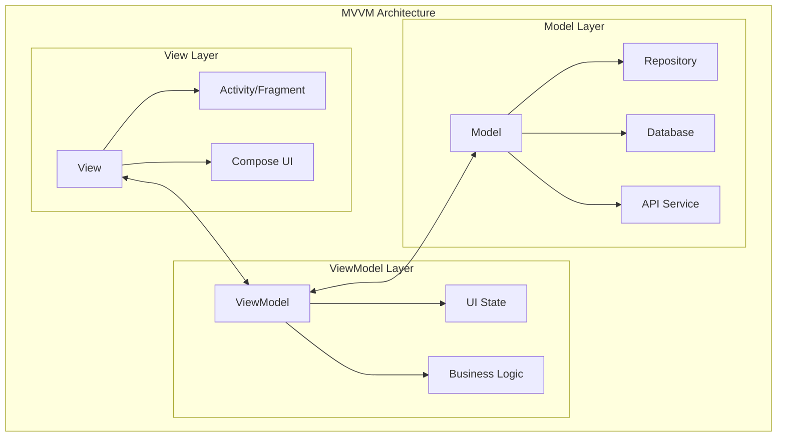

# Android MVVM Implementation Guide: Building Scalable Apps

## Introduction

Model-View-ViewModel (MVVM) has become the de facto standard for Android application architecture. This comprehensive guide explores implementing MVVM using Android's Architecture Components, modern state management techniques, and best practices derived from Google's official samples.

## Understanding MVVM Architecture

### Core Components

MVVM separates application logic into three distinct layers:



### Benefits of MVVM

- **Separation of Concerns**: Clear responsibility boundaries
- **Testability**: Easy unit testing of business logic
- **Lifecycle Awareness**: Automatic lifecycle management
- **Data Binding**: Reactive UI updates
- **Configuration Survival**: Survives configuration changes

## Setting Up MVVM Foundation

### Project Dependencies

```kotlin
// build.gradle (Module: app)
dependencies {
    // Core AndroidX libraries
    implementation "androidx.core:core-ktx:1.12.0"
    implementation "androidx.lifecycle:lifecycle-runtime-ktx:2.7.0"
    
    // ViewModel and LiveData
    implementation "androidx.lifecycle:lifecycle-viewmodel-ktx:2.7.0"
    implementation "androidx.lifecycle:lifecycle-livedata-ktx:2.7.0"
    
    // Fragment and Activity
    implementation "androidx.fragment:fragment-ktx:1.6.2"
    implementation "androidx.activity:activity-ktx:1.8.2"
    
    // Data Binding
    implementation "androidx.databinding:databinding-runtime:8.2.0"
    
    // Navigation
    implementation "androidx.navigation:navigation-fragment-ktx:2.7.5"
    implementation "androidx.navigation:navigation-ui-ktx:2.7.5"
    
    // Room Database
    implementation "androidx.room:room-runtime:2.6.1"
    implementation "androidx.room:room-ktx:2.6.1"
    kapt "androidx.room:room-compiler:2.6.1"
    
    // Coroutines
    implementation "org.jetbrains.kotlinx:kotlinx-coroutines-android:1.7.3"
    
    // Hilt Dependency Injection
    implementation "com.google.dagger:hilt-android:2.48.1"
    kapt "com.google.dagger:hilt-compiler:2.48.1"
    
    // Testing
    testImplementation "junit:junit:4.13.2"
    testImplementation "org.mockito:mockito-core:5.7.0"
    testImplementation "androidx.arch.core:core-testing:2.2.0"
    testImplementation "org.jetbrains.kotlinx:kotlinx-coroutines-test:1.7.3"
}

android {
    buildFeatures {
        dataBinding = true
        viewBinding = true
    }
}
```

### Base Classes

```kotlin
// BaseViewModel.kt - Foundation ViewModel
abstract class BaseViewModel : ViewModel() {
    
    protected val _isLoading = MutableLiveData<Boolean>()
    val isLoading: LiveData<Boolean> = _isLoading
    
    protected val _error = MutableLiveData<String?>()
    val error: LiveData<String?> = _error
    
    protected fun handleError(throwable: Throwable) {
        _error.value = when (throwable) {
            is IOException -> "Network error. Please check your connection."
            is HttpException -> "Server error: ${throwable.message}"
            else -> "An unexpected error occurred: ${throwable.message}"
        }
    }
    
    protected fun clearError() {
        _error.value = null
    }
    
    protected fun setLoading(loading: Boolean) {
        _isLoading.value = loading
    }
}

// BaseFragment.kt - Foundation Fragment
abstract class BaseFragment<VB : ViewDataBinding, VM : BaseViewModel> : Fragment() {
    
    protected lateinit var binding: VB
    protected abstract val viewModel: VM
    
    protected abstract fun getLayoutId(): Int
    protected abstract fun initializeViews()
    protected abstract fun observeViewModel()
    
    override fun onCreateView(
        inflater: LayoutInflater,
        container: ViewGroup?,
        savedInstanceState: Bundle?
    ): View? {
        binding = DataBindingUtil.inflate(inflater, getLayoutId(), container, false)
        binding.lifecycleOwner = viewLifecycleOwner
        return binding.root
    }
    
    override fun onViewCreated(view: View, savedInstanceState: Bundle?) {
        super.onViewCreated(view, savedInstanceState)
        initializeViews()
        observeViewModel()
        setupErrorHandling()
    }
    
    private fun setupErrorHandling() {
        viewModel.error.observe(viewLifecycleOwner) { error ->
            error?.let {
                showError(it)
                viewModel.clearError()
            }
        }
        
        viewModel.isLoading.observe(viewLifecycleOwner) { isLoading ->
            showLoading(isLoading)
        }
    }
    
    protected open fun showError(message: String) {
        Snackbar.make(binding.root, message, Snackbar.LENGTH_LONG).show()
    }
    
    protected open fun showLoading(show: Boolean) {
        // Override in subclasses to show/hide loading indicator
    }
}
```

## Model Layer Implementation

### Data Models

```kotlin
// Task.kt - Domain Model
@Parcelize
data class Task(
    val id: String = UUID.randomUUID().toString(),
    val title: String,
    val description: String,
    val isCompleted: Boolean = false,
    val priority: TaskPriority = TaskPriority.NORMAL,
    val dueDate: LocalDateTime? = null,
    val createdAt: LocalDateTime = LocalDateTime.now(),
    val updatedAt: LocalDateTime = LocalDateTime.now()
) : Parcelable {
    
    val isActive: Boolean
        get() = !isCompleted
    
    val isOverdue: Boolean
        get() = dueDate?.isBefore(LocalDateTime.now()) == true && !isCompleted
}

enum class TaskPriority(val displayName: String) {
    LOW("Low"),
    NORMAL("Normal"),
    HIGH("High"),
    URGENT("Urgent")
}

// TaskEntity.kt - Database Entity
@Entity(
    tableName = "tasks",
    indices = [
        Index(value = ["completed"], name = "index_tasks_completed"),
        Index(value = ["priority"], name = "index_tasks_priority"),
        Index(value = ["due_date"], name = "index_tasks_due_date")
    ]
)
data class TaskEntity(
    @PrimaryKey val id: String,
    @ColumnInfo(name = "title") val title: String,
    @ColumnInfo(name = "description") val description: String,
    @ColumnInfo(name = "completed") val isCompleted: Boolean,
    @ColumnInfo(name = "priority") val priority: TaskPriority,
    @ColumnInfo(name = "due_date") val dueDate: LocalDateTime?,
    @ColumnInfo(name = "created_at") val createdAt: LocalDateTime,
    @ColumnInfo(name = "updated_at") val updatedAt: LocalDateTime
)

// Extension functions for mapping
fun TaskEntity.toDomainModel(): Task = Task(
    id = id,
    title = title,
    description = description,
    isCompleted = isCompleted,
    priority = priority,
    dueDate = dueDate,
    createdAt = createdAt,
    updatedAt = updatedAt
)

fun Task.toEntity(): TaskEntity = TaskEntity(
    id = id,
    title = title,
    description = description,
    isCompleted = isCompleted,
    priority = priority,
    dueDate = dueDate,
    createdAt = createdAt,
    updatedAt = updatedAt
)
```

### Data Access Layer

```kotlin
// TaskDao.kt - Room Data Access Object
@Dao
interface TaskDao {
    
    @Query("SELECT * FROM tasks ORDER BY created_at DESC")
    fun getAllTasks(): Flow<List<TaskEntity>>
    
    @Query("SELECT * FROM tasks WHERE completed = 0 ORDER BY priority DESC, due_date ASC")
    fun getActiveTasks(): Flow<List<TaskEntity>>
    
    @Query("SELECT * FROM tasks WHERE completed = 1 ORDER BY updated_at DESC")
    fun getCompletedTasks(): Flow<List<TaskEntity>>
    
    @Query("SELECT * FROM tasks WHERE id = :taskId")
    fun getTaskById(taskId: String): Flow<TaskEntity?>
    
    @Query("SELECT * FROM tasks WHERE due_date <= :date AND completed = 0")
    suspend fun getOverdueTasks(date: LocalDateTime): List<TaskEntity>
    
    @Query("SELECT * FROM tasks WHERE title LIKE '%' || :query || '%' OR description LIKE '%' || :query || '%'")
    fun searchTasks(query: String): Flow<List<TaskEntity>>
    
    @Insert(onConflict = OnConflictStrategy.REPLACE)
    suspend fun insertTask(task: TaskEntity)
    
    @Insert(onConflict = OnConflictStrategy.REPLACE)
    suspend fun insertTasks(tasks: List<TaskEntity>)
    
    @Update
    suspend fun updateTask(task: TaskEntity)
    
    @Delete
    suspend fun deleteTask(task: TaskEntity)
    
    @Query("DELETE FROM tasks WHERE id = :taskId")
    suspend fun deleteTaskById(taskId: String)
    
    @Query("DELETE FROM tasks WHERE completed = 1")
    suspend fun deleteCompletedTasks()
    
    @Query("UPDATE tasks SET completed = :completed, updated_at = :updatedAt WHERE id = :taskId")
    suspend fun updateTaskCompletion(taskId: String, completed: Boolean, updatedAt: LocalDateTime)
    
    @Transaction
    suspend fun updateTaskWithTimestamp(task: TaskEntity) {
        val updatedTask = task.copy(updatedAt = LocalDateTime.now())
        updateTask(updatedTask)
    }
}

// AppDatabase.kt - Room Database
@Database(
    entities = [TaskEntity::class],
    version = 1,
    exportSchema = false
)
@TypeConverters(DateConverters::class)
abstract class AppDatabase : RoomDatabase() {
    abstract fun taskDao(): TaskDao
}

// DateConverters.kt - Type Converters
class DateConverters {
    @TypeConverter
    fun fromTimestamp(value: Long?): LocalDateTime? {
        return value?.let { LocalDateTime.ofEpochSecond(it, 0, ZoneOffset.UTC) }
    }

    @TypeConverter
    fun dateToTimestamp(date: LocalDateTime?): Long? {
        return date?.toEpochSecond(ZoneOffset.UTC)
    }

    @TypeConverter
    fun fromPriority(priority: TaskPriority): String = priority.name

    @TypeConverter
    fun toPriority(priority: String): TaskPriority = TaskPriority.valueOf(priority)
}
```

### Repository Implementation

```kotlin
// TasksRepository.kt - Repository Interface
interface TasksRepository {
    fun getAllTasks(): Flow<List<Task>>
    fun getActiveTasks(): Flow<List<Task>>
    fun getCompletedTasks(): Flow<List<Task>>
    fun getTaskById(taskId: String): Flow<Task?>
    fun searchTasks(query: String): Flow<List<Task>>
    suspend fun getOverdueTasks(): List<Task>
    suspend fun saveTask(task: Task)
    suspend fun updateTask(task: Task)
    suspend fun deleteTask(taskId: String)
    suspend fun completeTask(taskId: String)
    suspend fun deleteCompletedTasks()
    suspend fun refreshTasks()
}

// DefaultTasksRepository.kt - Repository Implementation
@Singleton
class DefaultTasksRepository @Inject constructor(
    private val localDataSource: TaskDao,
    private val remoteDataSource: TasksRemoteDataSource?,
    @IoDispatcher private val dispatcher: CoroutineDispatcher
) : TasksRepository {

    override fun getAllTasks(): Flow<List<Task>> {
        return localDataSource.getAllTasks()
            .map { entities -> entities.map { it.toDomainModel() } }
            .flowOn(dispatcher)
    }

    override fun getActiveTasks(): Flow<List<Task>> {
        return localDataSource.getActiveTasks()
            .map { entities -> entities.map { it.toDomainModel() } }
            .flowOn(dispatcher)
    }

    override fun getCompletedTasks(): Flow<List<Task>> {
        return localDataSource.getCompletedTasks()
            .map { entities -> entities.map { it.toDomainModel() } }
            .flowOn(dispatcher)
    }

    override fun getTaskById(taskId: String): Flow<Task?> {
        return localDataSource.getTaskById(taskId)
            .map { entity -> entity?.toDomainModel() }
            .flowOn(dispatcher)
    }

    override fun searchTasks(query: String): Flow<List<Task>> {
        return localDataSource.searchTasks(query)
            .map { entities -> entities.map { it.toDomainModel() } }
            .flowOn(dispatcher)
    }

    override suspend fun getOverdueTasks(): List<Task> {
        return withContext(dispatcher) {
            localDataSource.getOverdueTasks(LocalDateTime.now())
                .map { it.toDomainModel() }
        }
    }

    override suspend fun saveTask(task: Task) {
        withContext(dispatcher) {
            try {
                val entity = task.toEntity()
                localDataSource.insertTask(entity)
                
                // Sync with remote if available
                remoteDataSource?.saveTask(task)
            } catch (e: Exception) {
                throw TaskRepositoryException("Failed to save task", e)
            }
        }
    }

    override suspend fun updateTask(task: Task) {
        withContext(dispatcher) {
            try {
                val entity = task.copy(updatedAt = LocalDateTime.now()).toEntity()
                localDataSource.updateTask(entity)
                
                // Sync with remote if available
                remoteDataSource?.updateTask(task)
            } catch (e: Exception) {
                throw TaskRepositoryException("Failed to update task", e)
            }
        }
    }

    override suspend fun deleteTask(taskId: String) {
        withContext(dispatcher) {
            try {
                localDataSource.deleteTaskById(taskId)
                remoteDataSource?.deleteTask(taskId)
            } catch (e: Exception) {
                throw TaskRepositoryException("Failed to delete task", e)
            }
        }
    }

    override suspend fun completeTask(taskId: String) {
        withContext(dispatcher) {
            try {
                localDataSource.updateTaskCompletion(
                    taskId = taskId,
                    completed = true,
                    updatedAt = LocalDateTime.now()
                )
                remoteDataSource?.completeTask(taskId)
            } catch (e: Exception) {
                throw TaskRepositoryException("Failed to complete task", e)
            }
        }
    }

    override suspend fun deleteCompletedTasks() {
        withContext(dispatcher) {
            try {
                localDataSource.deleteCompletedTasks()
                remoteDataSource?.deleteCompletedTasks()
            } catch (e: Exception) {
                throw TaskRepositoryException("Failed to delete completed tasks", e)
            }
        }
    }

    override suspend fun refreshTasks() {
        withContext(dispatcher) {
            try {
                remoteDataSource?.let { remote ->
                    val remoteTasks = remote.getAllTasks()
                    val entities = remoteTasks.map { it.toEntity() }
                    localDataSource.insertTasks(entities)
                }
            } catch (e: Exception) {
                // Fail silently for refresh - local data still available
                Timber.w(e, "Failed to refresh tasks from remote")
            }
        }
    }
}

// Custom Exception
class TaskRepositoryException(message: String, cause: Throwable? = null) : Exception(message, cause)
```

## ViewModel Implementation

### UI State Management

```kotlin
// TasksUiState.kt - UI State Classes
data class TasksUiState(
    val tasks: List<Task> = emptyList(),
    val isLoading: Boolean = false,
    val isEmpty: Boolean = false,
    val errorMessage: String? = null,
    val filter: TaskFilter = TaskFilter.ALL,
    val searchQuery: String = "",
    val selectedTask: Task? = null
) {
    val filteredTasks: List<Task>
        get() = when (filter) {
            TaskFilter.ALL -> tasks
            TaskFilter.ACTIVE -> tasks.filter { !it.isCompleted }
            TaskFilter.COMPLETED -> tasks.filter { it.isCompleted }
            TaskFilter.OVERDUE -> tasks.filter { it.isOverdue }
            TaskFilter.HIGH_PRIORITY -> tasks.filter { it.priority == TaskPriority.HIGH || it.priority == TaskPriority.URGENT }
        }.let { filtered ->
            if (searchQuery.isBlank()) filtered
            else filtered.filter {
                it.title.contains(searchQuery, ignoreCase = true) ||
                it.description.contains(searchQuery, ignoreCase = true)
            }
        }
}

enum class TaskFilter(val displayName: String) {
    ALL("All Tasks"),
    ACTIVE("Active"),
    COMPLETED("Completed"),
    OVERDUE("Overdue"),
    HIGH_PRIORITY("High Priority")
}

// UI Events
sealed class TasksUiEvent {
    object LoadTasks : TasksUiEvent()
    object RefreshTasks : TasksUiEvent()
    data class SearchTasks(val query: String) : TasksUiEvent()
    data class FilterTasks(val filter: TaskFilter) : TasksUiEvent()
    data class CompleteTask(val taskId: String) : TasksUiEvent()
    data class DeleteTask(val taskId: String) : TasksUiEvent()
    data class SelectTask(val task: Task) : TasksUiEvent()
    object ClearSelection : TasksUiEvent()
    object DeleteCompletedTasks : TasksUiEvent()
    object DismissError : TasksUiEvent()
}
```

### ViewModel Implementation

```kotlin
// TasksViewModel.kt - Feature ViewModel
@HiltViewModel
class TasksViewModel @Inject constructor(
    private val tasksRepository: TasksRepository,
    private val analyticsTracker: AnalyticsTracker,
    @IoDispatcher private val dispatcher: CoroutineDispatcher
) : ViewModel() {

    private val _uiState = MutableStateFlow(TasksUiState(isLoading = true))
    val uiState: StateFlow<TasksUiState> = _uiState.asStateFlow()

    // For backward compatibility with Views
    val tasks: LiveData<List<Task>> = uiState
        .map { it.filteredTasks }
        .asLiveData()

    val isLoading: LiveData<Boolean> = uiState
        .map { it.isLoading }
        .asLiveData()

    val isEmpty: LiveData<Boolean> = uiState
        .map { it.isEmpty }
        .asLiveData()

    init {
        loadTasks()
        startPeriodicRefresh()
    }

    fun handleEvent(event: TasksUiEvent) {
        when (event) {
            is TasksUiEvent.LoadTasks -> loadTasks()
            is TasksUiEvent.RefreshTasks -> refreshTasks()
            is TasksUiEvent.SearchTasks -> searchTasks(event.query)
            is TasksUiEvent.FilterTasks -> filterTasks(event.filter)
            is TasksUiEvent.CompleteTask -> completeTask(event.taskId)
            is TasksUiEvent.DeleteTask -> deleteTask(event.taskId)
            is TasksUiEvent.SelectTask -> selectTask(event.task)
            is TasksUiEvent.ClearSelection -> clearSelection()
            is TasksUiEvent.DeleteCompletedTasks -> deleteCompletedTasks()
            is TasksUiEvent.DismissError -> dismissError()
        }
    }

    private fun loadTasks() {
        viewModelScope.launch {
            try {
                _uiState.update { it.copy(isLoading = true, errorMessage = null) }

                tasksRepository.getAllTasks()
                    .catch { throwable ->
                        _uiState.update {
                            it.copy(
                                isLoading = false,
                                errorMessage = "Failed to load tasks: ${throwable.message}"
                            )
                        }
                        analyticsTracker.trackError("load_tasks_failed", throwable)
                    }
                    .collect { taskList ->
                        _uiState.update {
                            it.copy(
                                tasks = taskList,
                                isLoading = false,
                                isEmpty = taskList.isEmpty(),
                                errorMessage = null
                            )
                        }
                        analyticsTracker.trackEvent("tasks_loaded", mapOf("count" to taskList.size))
                    }
            } catch (e: Exception) {
                handleError(e)
            }
        }
    }

    private fun refreshTasks() {
        viewModelScope.launch(dispatcher) {
            try {
                _uiState.update { it.copy(isLoading = true) }
                tasksRepository.refreshTasks()
                analyticsTracker.trackEvent("tasks_refreshed")
            } catch (e: Exception) {
                handleError(e)
            }
        }
    }

    private fun searchTasks(query: String) {
        _uiState.update { it.copy(searchQuery = query) }
        analyticsTracker.trackEvent("tasks_searched", mapOf("query_length" to query.length))
    }

    private fun filterTasks(filter: TaskFilter) {
        _uiState.update { it.copy(filter = filter) }
        analyticsTracker.trackEvent("tasks_filtered", mapOf("filter" to filter.name))
    }

    private fun completeTask(taskId: String) {
        viewModelScope.launch(dispatcher) {
            try {
                tasksRepository.completeTask(taskId)
                showTemporaryMessage("Task completed")
                analyticsTracker.trackEvent("task_completed")
            } catch (e: Exception) {
                handleError(e)
            }
        }
    }

    private fun deleteTask(taskId: String) {
        viewModelScope.launch(dispatcher) {
            try {
                tasksRepository.deleteTask(taskId)
                showTemporaryMessage("Task deleted")
                analyticsTracker.trackEvent("task_deleted")
            } catch (e: Exception) {
                handleError(e)
            }
        }
    }

    private fun selectTask(task: Task) {
        _uiState.update { it.copy(selectedTask = task) }
    }

    private fun clearSelection() {
        _uiState.update { it.copy(selectedTask = null) }
    }

    private fun deleteCompletedTasks() {
        viewModelScope.launch(dispatcher) {
            try {
                tasksRepository.deleteCompletedTasks()
                showTemporaryMessage("Completed tasks deleted")
                analyticsTracker.trackEvent("completed_tasks_deleted")
            } catch (e: Exception) {
                handleError(e)
            }
        }
    }

    private fun dismissError() {
        _uiState.update { it.copy(errorMessage = null) }
    }

    private fun handleError(throwable: Throwable) {
        val errorMessage = when (throwable) {
            is IOException -> "Network error. Please check your connection."
            is TaskRepositoryException -> throwable.message ?: "Repository error occurred"
            else -> "An unexpected error occurred"
        }

        _uiState.update {
            it.copy(
                isLoading = false,
                errorMessage = errorMessage
            )
        }

        analyticsTracker.trackError("tasks_error", throwable)
    }

    private fun showTemporaryMessage(message: String) {
        _uiState.update { it.copy(errorMessage = message) }
        
        // Clear message after delay
        viewModelScope.launch {
            delay(3000)
            _uiState.update { currentState ->
                if (currentState.errorMessage == message) {
                    currentState.copy(errorMessage = null)
                } else {
                    currentState
                }
            }
        }
    }

    private fun startPeriodicRefresh() {
        viewModelScope.launch {
            while (true) {
                delay(TimeUnit.MINUTES.toMillis(5)) // Refresh every 5 minutes
                if (uiState.value.tasks.isNotEmpty()) {
                    refreshTasks()
                }
            }
        }
    }

    // Convenience methods for View layer
    fun refresh() = handleEvent(TasksUiEvent.RefreshTasks)
    fun search(query: String) = handleEvent(TasksUiEvent.SearchTasks(query))
    fun filter(filter: TaskFilter) = handleEvent(TasksUiEvent.FilterTasks(filter))
    fun completeTask(taskId: String) = handleEvent(TasksUiEvent.CompleteTask(taskId))
    fun deleteTask(taskId: String) = handleEvent(TasksUiEvent.DeleteTask(taskId))
}
```

### Specialized ViewModels

```kotlin
// TaskDetailViewModel.kt - Detail Screen ViewModel
@HiltViewModel
class TaskDetailViewModel @Inject constructor(
    private val tasksRepository: TasksRepository,
    private val savedStateHandle: SavedStateHandle
) : BaseViewModel() {

    private val taskId: String = savedStateHandle.get<String>("taskId") 
        ?: throw IllegalArgumentException("TaskId is required")

    private val _task = MutableLiveData<Task?>()
    val task: LiveData<Task?> = _task

    private val _isEditing = MutableLiveData(false)
    val isEditing: LiveData<Boolean> = _isEditing

    // Two-way data binding fields
    val title = MutableLiveData<String>()
    val description = MutableLiveData<String>()
    val priority = MutableLiveData<TaskPriority>()
    val dueDate = MutableLiveData<LocalDateTime?>()

    init {
        loadTask()
        setupFieldObservers()
    }

    private fun loadTask() {
        viewModelScope.launch {
            try {
                setLoading(true)
                tasksRepository.getTaskById(taskId)
                    .catch { throwable -> handleError(throwable) }
                    .collect { task ->
                        _task.value = task
                        task?.let { populateFields(it) }
                        setLoading(false)
                    }
            } catch (e: Exception) {
                handleError(e)
                setLoading(false)
            }
        }
    }

    private fun populateFields(task: Task) {
        title.value = task.title
        description.value = task.description
        priority.value = task.priority
        dueDate.value = task.dueDate
    }

    private fun setupFieldObservers() {
        // Enable editing mode when fields are modified
        val observer = Observer<Any> { _isEditing.value = true }
        
        title.observeForever(observer)
        description.observeForever(observer)
        priority.observeForever(observer)
        dueDate.observeForever(observer)
    }

    fun saveTask() {
        val currentTask = _task.value ?: return
        val updatedTask = currentTask.copy(
            title = title.value ?: "",
            description = description.value ?: "",
            priority = priority.value ?: TaskPriority.NORMAL,
            dueDate = dueDate.value,
            updatedAt = LocalDateTime.now()
        )

        viewModelScope.launch {
            try {
                setLoading(true)
                tasksRepository.updateTask(updatedTask)
                _isEditing.value = false
                setLoading(false)
            } catch (e: Exception) {
                handleError(e)
                setLoading(false)
            }
        }
    }

    fun discardChanges() {
        _task.value?.let { populateFields(it) }
        _isEditing.value = false
    }

    fun toggleComplete() {
        viewModelScope.launch {
            try {
                tasksRepository.completeTask(taskId)
            } catch (e: Exception) {
                handleError(e)
            }
        }
    }
}

// AddTaskViewModel.kt - Add Task ViewModel
@HiltViewModel
class AddTaskViewModel @Inject constructor(
    private val tasksRepository: TasksRepository
) : BaseViewModel() {

    // Two-way data binding fields
    val title = MutableLiveData<String>()
    val description = MutableLiveData<String>()
    val priority = MutableLiveData(TaskPriority.NORMAL)
    val dueDate = MutableLiveData<LocalDateTime?>()

    // Validation
    private val _titleError = MutableLiveData<String?>()
    val titleError: LiveData<String?> = _titleError

    private val _isSaveEnabled = MediatorLiveData<Boolean>().apply {
        addSource(title) { updateSaveEnabled() }
        addSource(description) { updateSaveEnabled() }
    }
    val isSaveEnabled: LiveData<Boolean> = _isSaveEnabled

    private fun updateSaveEnabled() {
        val titleValid = !title.value.isNullOrBlank()
        val descriptionValid = !description.value.isNullOrBlank()
        _isSaveEnabled.value = titleValid && descriptionValid
    }

    fun saveTask(): LiveData<Boolean> {
        val result = MutableLiveData<Boolean>()
        
        if (!validateInput()) {
            result.value = false
            return result
        }

        val task = Task(
            title = title.value!!,
            description = description.value!!,
            priority = priority.value ?: TaskPriority.NORMAL,
            dueDate = dueDate.value
        )

        viewModelScope.launch {
            try {
                setLoading(true)
                tasksRepository.saveTask(task)
                setLoading(false)
                result.postValue(true)
            } catch (e: Exception) {
                handleError(e)
                setLoading(false)
                result.postValue(false)
            }
        }

        return result
    }

    private fun validateInput(): Boolean {
        var isValid = true

        if (title.value.isNullOrBlank()) {
            _titleError.value = "Title is required"
            isValid = false
        } else {
            _titleError.value = null
        }

        return isValid
    }

    fun clearForm() {
        title.value = ""
        description.value = ""
        priority.value = TaskPriority.NORMAL
        dueDate.value = null
        _titleError.value = null
    }
}
```

## View Layer Implementation

### Fragment with Data Binding

```kotlin
// TasksFragment.kt - Main Tasks Screen
@AndroidEntryPoint
class TasksFragment : BaseFragment<FragmentTasksBinding, TasksViewModel>() {

    override val viewModel: TasksViewModel by viewModels()
    private lateinit var tasksAdapter: TasksAdapter

    override fun getLayoutId(): Int = R.layout.fragment_tasks

    override fun initializeViews() {
        setupRecyclerView()
        setupSwipeRefresh()
        setupFab()
        setupSearchView()
        setupFilterChips()
    }

    override fun observeViewModel() {
        // Observe UI state with StateFlow
        viewLifecycleOwner.lifecycleScope.launch {
            viewModel.uiState.collect { uiState ->
                updateUI(uiState)
            }
        }

        // Observe tasks with LiveData (for compatibility)
        viewModel.tasks.observe(viewLifecycleOwner) { tasks ->
            tasksAdapter.submitList(tasks)
            updateEmptyState(tasks.isEmpty())
        }

        viewModel.isLoading.observe(viewLifecycleOwner) { isLoading ->
            binding.swipeRefresh.isRefreshing = isLoading
        }
    }

    private fun setupRecyclerView() {
        tasksAdapter = TasksAdapter(
            onTaskClick = { task ->
                findNavController().navigate(
                    TasksFragmentDirections.actionTasksToTaskDetail(task.id)
                )
            },
            onTaskComplete = { task ->
                viewModel.completeTask(task.id)
            },
            onTaskDelete = { task ->
                showDeleteConfirmation(task)
            }
        )

        binding.recyclerViewTasks.apply {
            adapter = tasksAdapter
            layoutManager = LinearLayoutManager(context)
            
            // Add item decoration
            addItemDecoration(DividerItemDecoration(context, DividerItemDecoration.VERTICAL))
            
            // Setup item animations
            itemAnimator = DefaultItemAnimator().apply {
                addDuration = 300
                removeDuration = 300
            }
        }
    }

    private fun setupSwipeRefresh() {
        binding.swipeRefresh.setOnRefreshListener {
            viewModel.refresh()
        }
    }

    private fun setupFab() {
        binding.fabAddTask.setOnClickListener {
            findNavController().navigate(
                TasksFragmentDirections.actionTasksToAddTask()
            )
        }
    }

    private fun setupSearchView() {
        binding.searchView.setOnQueryTextListener(object : SearchView.OnQueryTextListener {
            override fun onQueryTextSubmit(query: String?): Boolean {
                query?.let { viewModel.search(it) }
                return true
            }

            override fun onQueryTextChange(newText: String?): Boolean {
                newText?.let { viewModel.search(it) }
                return true
            }
        })
    }

    private fun setupFilterChips() {
        binding.chipGroupFilters.setOnCheckedStateChangeListener { _, checkedIds ->
            val filter = when (checkedIds.firstOrNull()) {
                R.id.chip_all -> TaskFilter.ALL
                R.id.chip_active -> TaskFilter.ACTIVE
                R.id.chip_completed -> TaskFilter.COMPLETED
                R.id.chip_overdue -> TaskFilter.OVERDUE
                R.id.chip_high_priority -> TaskFilter.HIGH_PRIORITY
                else -> TaskFilter.ALL
            }
            viewModel.filter(filter)
        }
    }

    private fun updateUI(uiState: TasksUiState) {
        binding.apply {
            // Update loading state
            swipeRefresh.isRefreshing = uiState.isLoading
            
            // Update empty state
            updateEmptyState(uiState.isEmpty)
            
            // Update search query
            if (searchView.query.toString() != uiState.searchQuery) {
                searchView.setQuery(uiState.searchQuery, false)
            }
            
            // Update filter chips
            updateFilterChips(uiState.filter)
            
            // Handle errors
            uiState.errorMessage?.let { error ->
                showError(error)
                viewModel.handleEvent(TasksUiEvent.DismissError)
            }
        }
    }

    private fun updateEmptyState(isEmpty: Boolean) {
        binding.groupEmptyState.isVisible = isEmpty
        binding.recyclerViewTasks.isVisible = !isEmpty
    }

    private fun updateFilterChips(filter: TaskFilter) {
        val chipId = when (filter) {
            TaskFilter.ALL -> R.id.chip_all
            TaskFilter.ACTIVE -> R.id.chip_active
            TaskFilter.COMPLETED -> R.id.chip_completed
            TaskFilter.OVERDUE -> R.id.chip_overdue
            TaskFilter.HIGH_PRIORITY -> R.id.chip_high_priority
        }
        binding.chipGroupFilters.check(chipId)
    }

    private fun showDeleteConfirmation(task: Task) {
        AlertDialog.Builder(requireContext())
            .setTitle("Delete Task")
            .setMessage("Are you sure you want to delete '${task.title}'?")
            .setPositiveButton("Delete") { _, _ ->
                viewModel.deleteTask(task.id)
            }
            .setNegativeButton("Cancel", null)
            .show()
    }

    override fun onCreateOptionsMenu(menu: Menu, inflater: MenuInflater) {
        inflater.inflate(R.menu.menu_tasks, menu)
        super.onCreateOptionsMenu(menu, inflater)
    }

    override fun onOptionsItemSelected(item: MenuItem): Boolean {
        return when (item.itemId) {
            R.id.action_delete_completed -> {
                viewModel.handleEvent(TasksUiEvent.DeleteCompletedTasks)
                true
            }
            R.id.action_refresh -> {
                viewModel.refresh()
                true
            }
            else -> super.onOptionsItemSelected(item)
        }
    }
}
```

### RecyclerView Adapter

```kotlin
// TasksAdapter.kt - RecyclerView Adapter with Data Binding
class TasksAdapter(
    private val onTaskClick: (Task) -> Unit,
    private val onTaskComplete: (Task) -> Unit,
    private val onTaskDelete: (Task) -> Unit
) : ListAdapter<Task, TasksAdapter.TaskViewHolder>(TaskDiffCallback()) {

    override fun onCreateViewHolder(parent: ViewGroup, viewType: Int): TaskViewHolder {
        val binding = ItemTaskBinding.inflate(
            LayoutInflater.from(parent.context),
            parent,
            false
        )
        return TaskViewHolder(binding)
    }

    override fun onBindViewHolder(holder: TaskViewHolder, position: Int) {
        holder.bind(getItem(position))
    }

    inner class TaskViewHolder(
        private val binding: ItemTaskBinding
    ) : RecyclerView.ViewHolder(binding.root) {

        fun bind(task: Task) {
            binding.apply {
                // Set data binding variables
                this.task = task
                
                // Set click listeners
                root.setOnClickListener { onTaskClick(task) }
                
                checkboxCompleted.setOnCheckedChangeListener { _, isChecked ->
                    if (isChecked != task.isCompleted) {
                        onTaskComplete(task)
                    }
                }
                
                buttonDelete.setOnClickListener { onTaskDelete(task) }
                
                // Custom binding logic
                updatePriorityIndicator(task.priority)
                updateDueDateStatus(task.dueDate, task.isCompleted)
                
                // Execute pending bindings
                executePendingBindings()
            }
        }

        private fun updatePriorityIndicator(priority: TaskPriority) {
            val color = when (priority) {
                TaskPriority.LOW -> R.color.priority_low
                TaskPriority.NORMAL -> R.color.priority_normal
                TaskPriority.HIGH -> R.color.priority_high
                TaskPriority.URGENT -> R.color.priority_urgent
            }
            
            binding.viewPriorityIndicator.setBackgroundColor(
                ContextCompat.getColor(binding.root.context, color)
            )
        }

        private fun updateDueDateStatus(dueDate: LocalDateTime?, isCompleted: Boolean) {
            binding.textDueDate.apply {
                when {
                    dueDate == null -> {
                        isVisible = false
                    }
                    isCompleted -> {
                        isVisible = true
                        text = "Completed"
                        setTextColor(ContextCompat.getColor(context, R.color.text_success))
                    }
                    dueDate.isBefore(LocalDateTime.now()) -> {
                        isVisible = true
                        text = "Overdue"
                        setTextColor(ContextCompat.getColor(context, R.color.text_error))
                    }
                    else -> {
                        isVisible = true
                        text = formatDueDate(dueDate)
                        setTextColor(ContextCompat.getColor(context, R.color.text_secondary))
                    }
                }
            }
        }

        private fun formatDueDate(dueDate: LocalDateTime): String {
            val now = LocalDateTime.now()
            return when {
                dueDate.toLocalDate() == now.toLocalDate() -> "Today"
                dueDate.toLocalDate() == now.toLocalDate().plusDays(1) -> "Tomorrow"
                dueDate.isBefore(now.plusDays(7)) -> dueDate.format(DateTimeFormatter.ofPattern("EEE"))
                else -> dueDate.format(DateTimeFormatter.ofPattern("MMM dd"))
            }
        }
    }

    class TaskDiffCallback : DiffUtil.ItemCallback<Task>() {
        override fun areItemsTheSame(oldItem: Task, newItem: Task): Boolean {
            return oldItem.id == newItem.id
        }

        override fun areContentsTheSame(oldItem: Task, newItem: Task): Boolean {
            return oldItem == newItem
        }
    }
}
```

### Data Binding Layouts

```xml
<!-- fragment_tasks.xml -->
<layout xmlns:android="http://schemas.android.com/apk/res/android"
    xmlns:app="http://schemas.android.com/apk/res-auto"
    xmlns:tools="http://schemas.android.com/tools">

    <data>
        <variable
            name="viewModel"
            type="com.example.tasks.ui.tasks.TasksViewModel" />
    </data>

    <androidx.coordinatorlayout.widget.CoordinatorLayout
        android:layout_width="match_parent"
        android:layout_height="match_parent">

        <com.google.android.material.appbar.AppBarLayout
            android:layout_width="match_parent"
            android:layout_height="wrap_content">

            <com.google.android.material.appbar.MaterialToolbar
                android:id="@+id/toolbar"
                android:layout_width="match_parent"
                android:layout_height="?attr/actionBarSize"
                app:title="Tasks" />

            <androidx.appcompat.widget.SearchView
                android:id="@+id/search_view"
                android:layout_width="match_parent"
                android:layout_height="wrap_content"
                android:layout_margin="8dp"
                app:queryHint="Search tasks..." />

            <com.google.android.material.chip.ChipGroup
                android:id="@+id/chip_group_filters"
                android:layout_width="match_parent"
                android:layout_height="wrap_content"
                android:layout_marginHorizontal="8dp"
                app:selectionRequired="true"
                app:singleSelection="true">

                <com.google.android.material.chip.Chip
                    android:id="@+id/chip_all"
                    style="@style/Widget.Material3.Chip.Filter"
                    android:layout_width="wrap_content"
                    android:layout_height="wrap_content"
                    android:checked="true"
                    android:text="All" />

                <com.google.android.material.chip.Chip
                    android:id="@+id/chip_active"
                    style="@style/Widget.Material3.Chip.Filter"
                    android:layout_width="wrap_content"
                    android:layout_height="wrap_content"
                    android:text="Active" />

                <com.google.android.material.chip.Chip
                    android:id="@+id/chip_completed"
                    style="@style/Widget.Material3.Chip.Filter"
                    android:layout_width="wrap_content"
                    android:layout_height="wrap_content"
                    android:text="Completed" />

                <com.google.android.material.chip.Chip
                    android:id="@+id/chip_overdue"
                    style="@style/Widget.Material3.Chip.Filter"
                    android:layout_width="wrap_content"
                    android:layout_height="wrap_content"
                    android:text="Overdue" />

                <com.google.android.material.chip.Chip
                    android:id="@+id/chip_high_priority"
                    style="@style/Widget.Material3.Chip.Filter"
                    android:layout_width="wrap_content"
                    android:layout_height="wrap_content"
                    android:text="High Priority" />

            </com.google.android.material.chip.ChipGroup>

        </com.google.android.material.appbar.AppBarLayout>

        <androidx.swiperefreshlayout.widget.SwipeRefreshLayout
            android:id="@+id/swipe_refresh"
            android:layout_width="match_parent"
            android:layout_height="match_parent"
            app:layout_behavior="@string/appbar_scrolling_view_behavior">

            <androidx.recyclerview.widget.RecyclerView
                android:id="@+id/recycler_view_tasks"
                android:layout_width="match_parent"
                android:layout_height="match_parent"
                android:clipToPadding="false"
                android:paddingBottom="88dp"
                tools:listitem="@layout/item_task" />

        </androidx.swiperefreshlayout.widget.SwipeRefreshLayout>

        <!-- Empty State -->
        <androidx.constraintlayout.widget.Group
            android:id="@+id/group_empty_state"
            android:layout_width="wrap_content"
            android:layout_height="wrap_content"
            android:visibility="gone"
            app:constraint_referenced_ids="image_empty,text_empty_title,text_empty_subtitle"
            tools:visibility="visible" />

        <ImageView
            android:id="@+id/image_empty"
            android:layout_width="120dp"
            android:layout_height="120dp"
            android:layout_gravity="center"
            android:layout_marginBottom="32dp"
            android:alpha="0.6"
            android:src="@drawable/ic_tasks_empty"
            app:tint="?attr/colorOnSurfaceVariant" />

        <TextView
            android:id="@+id/text_empty_title"
            android:layout_width="wrap_content"
            android:layout_height="wrap_content"
            android:layout_gravity="center"
            android:text="No tasks yet"
            android:textAppearance="?attr/textAppearanceHeadlineMedium" />

        <TextView
            android:id="@+id/text_empty_subtitle"
            android:layout_width="wrap_content"
            android:layout_height="wrap_content"
            android:layout_gravity="center"
            android:layout_marginTop="8dp"
            android:text="Tap the + button to add your first task"
            android:textAppearance="?attr/textAppearanceBodyMedium"
            android:textColor="?attr/colorOnSurfaceVariant" />

        <com.google.android.material.floatingactionbutton.FloatingActionButton
            android:id="@+id/fab_add_task"
            android:layout_width="wrap_content"
            android:layout_height="wrap_content"
            android:layout_gravity="bottom|end"
            android:layout_margin="16dp"
            android:contentDescription="Add task"
            app:srcCompat="@drawable/ic_add" />

    </androidx.coordinatorlayout.widget.CoordinatorLayout>

</layout>
```

```xml
<!-- item_task.xml -->
<layout xmlns:android="http://schemas.android.com/apk/res/android"
    xmlns:app="http://schemas.android.com/apk/res-auto"
    xmlns:tools="http://schemas.android.com/tools">

    <data>
        <variable
            name="task"
            type="com.example.tasks.data.model.Task" />
    </data>

    <com.google.android.material.card.MaterialCardView
        android:layout_width="match_parent"
        android:layout_height="wrap_content"
        android:layout_margin="8dp"
        app:cardCornerRadius="8dp"
        app:cardElevation="2dp"
        app:strokeWidth="0dp">

        <androidx.constraintlayout.widget.ConstraintLayout
            android:layout_width="match_parent"
            android:layout_height="wrap_content"
            android:padding="16dp">

            <View
                android:id="@+id/view_priority_indicator"
                android:layout_width="4dp"
                android:layout_height="0dp"
                android:layout_marginEnd="12dp"
                android:background="@color/priority_normal"
                app:layout_constraintBottom_toBottomOf="parent"
                app:layout_constraintStart_toStartOf="parent"
                app:layout_constraintTop_toTopOf="parent" />

            <CheckBox
                android:id="@+id/checkbox_completed"
                android:layout_width="wrap_content"
                android:layout_height="wrap_content"
                android:checked="@{task.completed}"
                app:layout_constraintStart_toEndOf="@id/view_priority_indicator"
                app:layout_constraintTop_toTopOf="parent" />

            <TextView
                android:id="@+id/text_title"
                android:layout_width="0dp"
                android:layout_height="wrap_content"
                android:layout_marginStart="8dp"
                android:layout_marginEnd="8dp"
                android:text="@{task.title}"
                android:textAppearance="?attr/textAppearanceBodyLarge"
                android:textStyle="@{task.completed ? `italic` : `normal`}"
                app:layout_constraintEnd_toStartOf="@id/button_delete"
                app:layout_constraintStart_toEndOf="@id/checkbox_completed"
                app:layout_constraintTop_toTopOf="@id/checkbox_completed"
                app:strikeThrough="@{task.completed}"
                tools:text="Sample Task Title" />

            <TextView
                android:id="@+id/text_description"
                android:layout_width="0dp"
                android:layout_height="wrap_content"
                android:layout_marginStart="8dp"
                android:layout_marginTop="4dp"
                android:layout_marginEnd="8dp"
                android:text="@{task.description}"
                android:textAppearance="?attr/textAppearanceBodyMedium"
                android:textColor="?attr/colorOnSurfaceVariant"
                android:visibility="@{task.description.empty ? View.GONE : View.VISIBLE}"
                app:layout_constraintEnd_toStartOf="@id/button_delete"
                app:layout_constraintStart_toEndOf="@id/checkbox_completed"
                app:layout_constraintTop_toBottomOf="@id/text_title"
                tools:text="Sample task description" />

            <TextView
                android:id="@+id/text_due_date"
                android:layout_width="wrap_content"
                android:layout_height="wrap_content"
                android:layout_marginStart="8dp"
                android:layout_marginTop="4dp"
                android:textAppearance="?attr/textAppearanceBodySmall"
                android:visibility="gone"
                app:layout_constraintStart_toEndOf="@id/checkbox_completed"
                app:layout_constraintTop_toBottomOf="@id/text_description"
                tools:text="Due Today"
                tools:visibility="visible" />

            <ImageButton
                android:id="@+id/button_delete"
                android:layout_width="wrap_content"
                android:layout_height="wrap_content"
                android:background="?attr/selectableItemBackgroundBorderless"
                android:contentDescription="Delete task"
                android:padding="8dp"
                android:src="@drawable/ic_delete"
                app:layout_constraintEnd_toEndOf="parent"
                app:layout_constraintTop_toTopOf="parent"
                app:tint="?attr/colorError" />

        </androidx.constraintlayout.widget.ConstraintLayout>

    </com.google.android.material.card.MaterialCardView>

</layout>
```

## Testing MVVM Implementation

### ViewModel Testing

```kotlin
// TasksViewModelTest.kt - Comprehensive ViewModel Tests
@ExperimentalCoroutinesApi
class TasksViewModelTest {

    @get:Rule
    var mainCoroutineRule = MainCoroutineRule()

    @get:Rule
    var instantExecutorRule = InstantTaskExecutorRule()

    // Test doubles
    private lateinit var tasksRepository: FakeTasksRepository
    private lateinit var analyticsTracker: FakeAnalyticsTracker
    
    // Subject under test
    private lateinit var viewModel: TasksViewModel

    @Before
    fun setupViewModel() {
        tasksRepository = FakeTasksRepository()
        analyticsTracker = FakeAnalyticsTracker()
        
        viewModel = TasksViewModel(
            tasksRepository = tasksRepository,
            analyticsTracker = analyticsTracker,
            dispatcher = mainCoroutineRule.dispatcher
        )
    }

    @Test
    fun `loadTasks - success - updates ui state correctly`() = runTest {
        // Given
        val tasks = listOf(
            Task("1", "Task 1", "Description 1"),
            Task("2", "Task 2", "Description 2", isCompleted = true)
        )
        tasksRepository.addTasks(tasks)

        // When
        viewModel.handleEvent(TasksUiEvent.LoadTasks)

        // Then
        val uiState = viewModel.uiState.value
        assertEquals(tasks, uiState.tasks)
        assertFalse(uiState.isLoading)
        assertNull(uiState.errorMessage)
        assertFalse(uiState.isEmpty)
    }

    @Test
    fun `loadTasks - error - shows error message`() = runTest {
        // Given
        tasksRepository.setShouldReturnError(true)

        // When
        viewModel.handleEvent(TasksUiEvent.LoadTasks)

        // Then
        val uiState = viewModel.uiState.value
        assertTrue(uiState.tasks.isEmpty())
        assertFalse(uiState.isLoading)
        assertNotNull(uiState.errorMessage)
        assertTrue(uiState.isEmpty)
    }

    @Test
    fun `filterTasks - active - shows only active tasks`() = runTest {
        // Given
        val tasks = listOf(
            Task("1", "Active Task", "Description", isCompleted = false),
            Task("2", "Completed Task", "Description", isCompleted = true)
        )
        tasksRepository.addTasks(tasks)
        viewModel.handleEvent(TasksUiEvent.LoadTasks)

        // When
        viewModel.handleEvent(TasksUiEvent.FilterTasks(TaskFilter.ACTIVE))

        // Then
        val uiState = viewModel.uiState.value
        assertEquals(TaskFilter.ACTIVE, uiState.filter)
        assertEquals(1, uiState.filteredTasks.size)
        assertFalse(uiState.filteredTasks[0].isCompleted)
    }

    @Test
    fun `searchTasks - updates search query and filters results`() = runTest {
        // Given
        val tasks = listOf(
            Task("1", "Important Task", "Urgent description"),
            Task("2", "Regular Task", "Normal description")
        )
        tasksRepository.addTasks(tasks)
        viewModel.handleEvent(TasksUiEvent.LoadTasks)

        // When
        viewModel.handleEvent(TasksUiEvent.SearchTasks("Important"))

        // Then
        val uiState = viewModel.uiState.value
        assertEquals("Important", uiState.searchQuery)
        assertEquals(1, uiState.filteredTasks.size)
        assertTrue(uiState.filteredTasks[0].title.contains("Important"))
    }

    @Test
    fun `completeTask - success - tracks analytics event`() = runTest {
        // Given
        val task = Task("1", "Task", "Description")
        tasksRepository.addTasks(listOf(task))

        // When
        viewModel.handleEvent(TasksUiEvent.CompleteTask(task.id))

        // Then
        verify(analyticsTracker).trackEvent("task_completed")
        assertTrue(tasksRepository.isTaskCompleted(task.id))
    }
}

// FakeTasksRepository.kt - Test Double
class FakeTasksRepository : TasksRepository {
    private val tasksData = mutableMapOf<String, Task>()
    private var shouldReturnError = false

    fun addTasks(tasks: List<Task>) {
        tasks.forEach { tasksData[it.id] = it }
    }

    fun setShouldReturnError(value: Boolean) {
        shouldReturnError = value
    }

    fun isTaskCompleted(taskId: String): Boolean {
        return tasksData[taskId]?.isCompleted ?: false
    }

    override fun getAllTasks(): Flow<List<Task>> = flow {
        if (shouldReturnError) {
            throw IOException("Network error")
        }
        emit(tasksData.values.toList())
    }

    override suspend fun completeTask(taskId: String) {
        if (shouldReturnError) {
            throw IOException("Network error")
        }
        tasksData[taskId] = tasksData[taskId]?.copy(isCompleted = true)
            ?: throw TaskRepositoryException("Task not found")
    }

    // Implement other methods...
}
```

### Integration Testing

```kotlin
// TasksRepositoryTest.kt - Integration Tests
@ExperimentalCoroutinesApi
@RunWith(AndroidJUnit4::class)
class TasksRepositoryTest {

    @get:Rule
    var mainCoroutineRule = MainCoroutineRule()

    private lateinit var database: AppDatabase
    private lateinit var taskDao: TaskDao
    private lateinit var repository: DefaultTasksRepository
    private lateinit var remoteDataSource: FakeTasksRemoteDataSource

    @Before
    fun createDb() {
        val context = ApplicationProvider.getApplicationContext<Context>()
        database = Room.inMemoryDatabaseBuilder(context, AppDatabase::class.java)
            .allowMainThreadQueries()
            .build()
        taskDao = database.taskDao()
        remoteDataSource = FakeTasksRemoteDataSource()
        
        repository = DefaultTasksRepository(
            localDataSource = taskDao,
            remoteDataSource = remoteDataSource,
            dispatcher = mainCoroutineRule.dispatcher
        )
    }

    @After
    fun closeDb() {
        database.close()
    }

    @Test
    fun saveTask_savesToLocalAndRemote() = runTest {
        // Given
        val task = Task("1", "Test Task", "Description")

        // When
        repository.saveTask(task)

        // Then
        val localTasks = repository.getAllTasks().first()
        val remoteTasks = remoteDataSource.getAllTasks()
        
        assertTrue(localTasks.contains(task))
        assertTrue(remoteTasks.contains(task))
    }

    @Test
    fun getAllTasks_returnsLocalTasksWhenRemoteUnavailable() = runTest {
        // Given
        val localTask = Task("1", "Local Task", "Description")
        taskDao.insertTask(localTask.toEntity())
        remoteDataSource.setReturnError(true)

        // When
        val tasks = repository.getAllTasks().first()

        // Then
        assertEquals(1, tasks.size)
        assertEquals(localTask, tasks[0])
    }
}
```

## Migration Strategies

### From MVP to MVVM

```kotlin
// Before: MVP Pattern
interface TasksContract {
    interface View {
        fun showTasks(tasks: List<Task>)
        fun showLoadingIndicator(show: Boolean)
        fun showError(message: String)
    }
    
    interface Presenter {
        fun loadTasks()
        fun addTask(task: Task)
        fun completeTask(taskId: String)
    }
}

class TasksPresenter(
    private val view: TasksContract.View,
    private val repository: TasksRepository
) : TasksContract.Presenter {
    
    fun loadTasks() {
        view.showLoadingIndicator(true)
        // Manual lifecycle management and error handling
        repository.getAllTasks { result ->
            view.showLoadingIndicator(false)
            when (result) {
                is Success -> view.showTasks(result.data)
                is Error -> view.showError(result.message)
            }
        }
    }
}

// After: MVVM Pattern
@HiltViewModel
class TasksViewModel @Inject constructor(
    private val repository: TasksRepository
) : ViewModel() {
    
    private val _uiState = MutableStateFlow(TasksUiState())
    val uiState: StateFlow<TasksUiState> = _uiState
    
    fun loadTasks() {
        viewModelScope.launch {
            _uiState.update { it.copy(isLoading = true) }
            
            repository.getAllTasks()
                .catch { throwable ->
                    _uiState.update { 
                        it.copy(isLoading = false, errorMessage = throwable.message)
                    }
                }
                .collect { tasks ->
                    _uiState.update {
                        it.copy(tasks = tasks, isLoading = false)
                    }
                }
        }
    }
}
```

### From Views to Compose

```kotlin
// Migration from View-based to Compose MVVM
@Composable
fun TasksScreen(
    viewModel: TasksViewModel = hiltViewModel()
) {
    val uiState by viewModel.uiState.collectAsStateWithLifecycle()
    
    LaunchedEffect(Unit) {
        viewModel.handleEvent(TasksUiEvent.LoadTasks)
    }
    
    TasksContent(
        uiState = uiState,
        onEvent = viewModel::handleEvent
    )
}

@Composable
private fun TasksContent(
    uiState: TasksUiState,
    onEvent: (TasksUiEvent) -> Unit
) {
    Column {
        TasksSearchBar(
            query = uiState.searchQuery,
            onQueryChange = { onEvent(TasksUiEvent.SearchTasks(it)) }
        )
        
        TasksFilterChips(
            selectedFilter = uiState.filter,
            onFilterSelected = { onEvent(TasksUiEvent.FilterTasks(it)) }
        )
        
        LazyColumn {
            items(uiState.filteredTasks) { task ->
                TaskItem(
                    task = task,
                    onComplete = { onEvent(TasksUiEvent.CompleteTask(task.id)) },
                    onDelete = { onEvent(TasksUiEvent.DeleteTask(task.id)) }
                )
            }
        }
    }
}
```

## Best Practices Summary

### MVVM Implementation Guidelines

1. **Single Responsibility**: Each ViewModel should handle one feature
2. **Reactive Programming**: Use StateFlow/LiveData for reactive UI
3. **Lifecycle Awareness**: Leverage ViewModelScope for coroutines
4. **Error Handling**: Centralized error handling in base classes
5. **Testing**: Comprehensive unit tests for ViewModels
6. **State Management**: Immutable UI state with clear state updates

### Performance Optimization

1. **StateFlow vs LiveData**: Use StateFlow for better performance
2. **Background Threading**: Use appropriate dispatchers
3. **Memory Management**: Proper cleanup in ViewModels
4. **Data Binding**: Efficient UI updates with data binding
5. **Caching**: Implement proper caching strategies

### Code Organization

```
app/
├── data/
│   ├── local/
│   ├── remote/
│   └── repository/
├── domain/
│   ├── model/
│   └── usecase/
├── ui/
│   ├── base/
│   ├── tasks/
│   └── addtask/
└── di/
```

## Conclusion

MVVM architecture provides a robust foundation for Android applications, offering clear separation of concerns, excellent testability, and strong lifecycle management. By following the patterns demonstrated in Google's Architecture Samples and implementing comprehensive testing strategies, developers can build maintainable, scalable Android applications that stand the test of time.

Key takeaways:
- **Clear Architecture**: Proper separation between View, ViewModel, and Model
- **Modern Tools**: Leverage StateFlow, Coroutines, and Data Binding
- **Testing Excellence**: Comprehensive unit and integration tests
- **Performance**: Efficient state management and lifecycle awareness
- **Scalability**: Patterns that support application growth and team collaboration