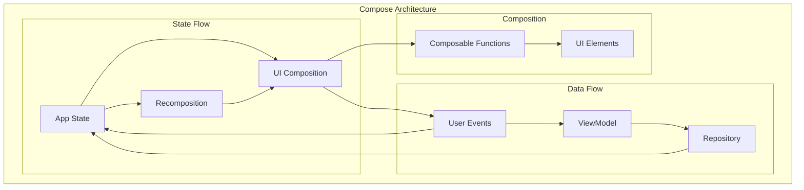

# Jetpack Compose Architecture Best Practices: Building Scalable UI

## Introduction

Jetpack Compose revolutionizes Android UI development with its declarative approach, but with great power comes the need for proper architectural patterns. This comprehensive guide explores best practices for building scalable, maintainable, and performant Compose applications based on Google's official recommendations and real-world implementations.

## Compose Architecture Fundamentals

### Declarative UI Principles



### Core Principles

1. **State Flows Down**: Data flows down the composition hierarchy
2. **Events Flow Up**: User interactions bubble up as events
3. **Single Source of Truth**: Each piece of state has one authoritative source
4. **Unidirectional Data Flow**: Data flows in one direction for predictability

## State Management Architecture

### State Categories

```kotlin
// StateTypes.kt - Different types of state in Compose
sealed class ComposeState {
    // UI state that survives recomposition but not process death
    data class RememberState<T>(val value: T)
    
    // State that survives process death
    data class SavedInstanceState<T>(val value: T)
    
    // State that persists across app sessions
    data class PersistentState<T>(val value: T)
    
    // Derived state computed from other state
    data class DerivedState<T>(val computation: () -> T)
}

// Example implementations
@Composable
fun StateExamples() {
    // Remember state - survives recomposition
    var counter by remember { mutableIntStateOf(0) }
    
    // Saved instance state - survives process death
    var text by rememberSaveable { mutableStateOf("") }
    
    // Derived state - computed from other state
    val isCounterEven by remember { derivedStateOf { counter % 2 == 0 } }
    
    // State from ViewModel - business logic state
    val viewModel: MyViewModel = hiltViewModel()
    val uiState by viewModel.uiState.collectAsStateWithLifecycle()
}
```

### ViewModel State Management

```kotlin
// TasksUiState.kt - Comprehensive UI State Management
@Immutable
data class TasksUiState(
    val tasks: List<Task> = emptyList(),
    val isLoading: Boolean = false,
    val errorMessage: String? = null,
    val searchQuery: String = "",
    val selectedFilter: TaskFilter = TaskFilter.ALL,
    val selectedTasks: Set<String> = emptySet(),
    val isMultiSelectMode: Boolean = false
) {
    val filteredTasks: List<Task>
        get() = tasks.filter { task ->
            val matchesFilter = when (selectedFilter) {
                TaskFilter.ALL -> true
                TaskFilter.ACTIVE -> !task.isCompleted
                TaskFilter.COMPLETED -> task.isCompleted
                TaskFilter.OVERDUE -> task.isOverdue
            }
            
            val matchesSearch = searchQuery.isEmpty() || 
                task.title.contains(searchQuery, ignoreCase = true) ||
                task.description.contains(searchQuery, ignoreCase = true)
            
            matchesFilter && matchesSearch
        }
    
    val hasSelectedTasks: Boolean
        get() = selectedTasks.isNotEmpty()
    
    val selectedTasksCount: Int
        get() = selectedTasks.size
}

// UI Events - Sealed class for type-safe event handling
sealed interface TasksUiEvent {
    data object LoadTasks : TasksUiEvent
    data object RefreshTasks : TasksUiEvent
    data class SearchTasks(val query: String) : TasksUiEvent
    data class FilterTasks(val filter: TaskFilter) : TasksUiEvent
    data class SelectTask(val taskId: String) : TasksUiEvent
    data class ToggleTaskCompletion(val taskId: String) : TasksUiEvent
    data class DeleteTasks(val taskIds: Set<String>) : TasksUiEvent
    data object ClearSelection : TasksUiEvent
    data object EnterMultiSelectMode : TasksUiEvent
    data object ExitMultiSelectMode : TasksUiEvent
    data object DismissError : TasksUiEvent
}
```

### Advanced ViewModel Implementation

```kotlin
// TasksViewModel.kt - Production-ready ViewModel
@HiltViewModel
class TasksViewModel @Inject constructor(
    private val tasksRepository: TasksRepository,
    private val preferencesRepository: PreferencesRepository,
    private val analyticsTracker: AnalyticsTracker,
    @IoDispatcher private val ioDispatcher: CoroutineDispatcher,
    savedStateHandle: SavedStateHandle
) : ViewModel() {

    // Private mutable state
    private val _uiState = MutableStateFlow(TasksUiState(isLoading = true))
    
    // Public immutable state
    val uiState: StateFlow<TasksUiState> = _uiState
        .stateIn(
            scope = viewModelScope,
            started = SharingStarted.WhileSubscribed(5_000),
            initialValue = TasksUiState(isLoading = true)
        )

    // Navigation events - single-shot events
    private val _navigationEvent = Channel<TasksNavigationEvent>(Channel.BUFFERED)
    val navigationEvent = _navigationEvent.receiveAsFlow()

    // Snackbar messages - single-shot events
    private val _snackbarMessage = Channel<String>(Channel.BUFFERED)
    val snackbarMessage = _snackbarMessage.receiveAsFlow()

    // Search query with debouncing
    private val searchQuery = MutableStateFlow("")

    init {
        initializeState()
        observeSearchQuery()
        loadInitialData()
    }

    private fun initializeState() {
        // Restore saved state if available
        val savedFilter = savedStateHandle.get<String>("selected_filter")?.let { 
            TaskFilter.valueOf(it) 
        } ?: TaskFilter.ALL
        
        _uiState.update { it.copy(selectedFilter = savedFilter) }
        
        // Save state on changes
        viewModelScope.launch {
            uiState.map { it.selectedFilter.name }.collect { filter ->
                savedStateHandle["selected_filter"] = filter
            }
        }
    }

    private fun observeSearchQuery() {
        viewModelScope.launch {
            searchQuery
                .debounce(300) // Debounce search input
                .distinctUntilChanged()
                .collect { query ->
                    _uiState.update { it.copy(searchQuery = query) }
                    analyticsTracker.trackEvent("search_tasks", mapOf("query_length" to query.length))
                }
        }
    }

    private fun loadInitialData() {
        viewModelScope.launch {
            try {
                // Combine multiple data sources
                combine(
                    tasksRepository.getAllTasks(),
                    preferencesRepository.getUserPreferences()
                ) { tasks, preferences ->
                    tasks to preferences
                }.catch { throwable ->
                    handleError(throwable)
                }.collect { (tasks, preferences) ->
                    _uiState.update { currentState ->
                        currentState.copy(
                            tasks = tasks,
                            isLoading = false,
                            errorMessage = null,
                            selectedFilter = preferences.defaultFilter
                        )
                    }
                }
            } catch (e: Exception) {
                handleError(e)
            }
        }
    }

    fun handleEvent(event: TasksUiEvent) {
        when (event) {
            is TasksUiEvent.LoadTasks -> loadTasks()
            is TasksUiEvent.RefreshTasks -> refreshTasks()
            is TasksUiEvent.SearchTasks -> updateSearchQuery(event.query)
            is TasksUiEvent.FilterTasks -> updateFilter(event.filter)
            is TasksUiEvent.SelectTask -> toggleTaskSelection(event.taskId)
            is TasksUiEvent.ToggleTaskCompletion -> toggleTaskCompletion(event.taskId)
            is TasksUiEvent.DeleteTasks -> deleteTasks(event.taskIds)
            is TasksUiEvent.ClearSelection -> clearSelection()
            is TasksUiEvent.EnterMultiSelectMode -> enterMultiSelectMode()
            is TasksUiEvent.ExitMultiSelectMode -> exitMultiSelectMode()
            is TasksUiEvent.DismissError -> dismissError()
        }
    }

    private fun updateSearchQuery(query: String) {
        searchQuery.value = query
    }

    private fun updateFilter(filter: TaskFilter) {
        _uiState.update { it.copy(selectedFilter = filter) }
        
        // Save preference
        viewModelScope.launch(ioDispatcher) {
            preferencesRepository.updateDefaultFilter(filter)
        }
        
        analyticsTracker.trackEvent("filter_tasks", mapOf("filter" to filter.name))
    }

    private fun toggleTaskSelection(taskId: String) {
        _uiState.update { currentState ->
            val newSelection = if (taskId in currentState.selectedTasks) {
                currentState.selectedTasks - taskId
            } else {
                currentState.selectedTasks + taskId
            }
            
            currentState.copy(
                selectedTasks = newSelection,
                isMultiSelectMode = newSelection.isNotEmpty()
            )
        }
    }

    private fun toggleTaskCompletion(taskId: String) {
        viewModelScope.launch(ioDispatcher) {
            try {
                val currentState = _uiState.value
                val task = currentState.tasks.find { it.id == taskId } ?: return@launch
                
                if (task.isCompleted) {
                    tasksRepository.activateTask(taskId)
                    showSnackbar("Task marked as active")
                } else {
                    tasksRepository.completeTask(taskId)
                    showSnackbar("Task completed")
                }
                
                analyticsTracker.trackEvent("toggle_task_completion", mapOf(
                    "task_id" to taskId,
                    "completed" to !task.isCompleted
                ))
            } catch (e: Exception) {
                handleError(e)
            }
        }
    }

    private fun deleteTasks(taskIds: Set<String>) {
        viewModelScope.launch(ioDispatcher) {
            try {
                tasksRepository.deleteTasks(taskIds.toList())
                _uiState.update { it.copy(selectedTasks = emptySet(), isMultiSelectMode = false) }
                
                val message = if (taskIds.size == 1) {
                    "Task deleted"
                } else {
                    "${taskIds.size} tasks deleted"
                }
                showSnackbar(message)
                
                analyticsTracker.trackEvent("delete_tasks", mapOf("count" to taskIds.size))
            } catch (e: Exception) {
                handleError(e)
            }
        }
    }

    private fun handleError(throwable: Throwable) {
        val errorMessage = when (throwable) {
            is IOException -> "Network error. Please check your connection."
            is HttpException -> "Server error. Please try again later."
            else -> "An unexpected error occurred."
        }

        _uiState.update {
            it.copy(
                isLoading = false,
                errorMessage = errorMessage
            )
        }

        analyticsTracker.trackError("tasks_error", throwable)
    }

    private suspend fun showSnackbar(message: String) {
        _snackbarMessage.send(message)
    }

    private fun dismissError() {
        _uiState.update { it.copy(errorMessage = null) }
    }

    // Additional helper methods...
}
```

## Composable Architecture Patterns

### Screen-Level Composables

```kotlin
// TasksScreen.kt - Screen-level Composable
@OptIn(ExperimentalMaterial3Api::class)
@Composable
fun TasksScreen(
    onNavigateToAddTask: () -> Unit,
    onNavigateToTaskDetail: (String) -> Unit,
    modifier: Modifier = Modifier,
    viewModel: TasksViewModel = hiltViewModel()
) {
    // Collect state
    val uiState by viewModel.uiState.collectAsStateWithLifecycle()
    
    // Handle navigation events
    LaunchedEffect(viewModel) {
        viewModel.navigationEvent.collect { event ->
            when (event) {
                is TasksNavigationEvent.NavigateToDetail -> 
                    onNavigateToTaskDetail(event.taskId)
                is TasksNavigationEvent.NavigateToAdd -> 
                    onNavigateToAddTask()
            }
        }
    }
    
    // Handle snackbar messages
    val snackbarHostState = remember { SnackbarHostState() }
    LaunchedEffect(viewModel) {
        viewModel.snackbarMessage.collect { message ->
            snackbarHostState.showSnackbar(message)
        }
    }
    
    // Handle system back press in multi-select mode
    BackHandler(enabled = uiState.isMultiSelectMode) {
        viewModel.handleEvent(TasksUiEvent.ExitMultiSelectMode)
    }

    Scaffold(
        topBar = {
            TasksTopBar(
                title = "Tasks",
                isMultiSelectMode = uiState.isMultiSelectMode,
                selectedCount = uiState.selectedTasksCount,
                onExitMultiSelect = { 
                    viewModel.handleEvent(TasksUiEvent.ExitMultiSelectMode) 
                },
                onDeleteSelected = {
                    viewModel.handleEvent(TasksUiEvent.DeleteTasks(uiState.selectedTasks))
                }
            )
        },
        floatingActionButton = {
            if (!uiState.isMultiSelectMode) {
                FloatingActionButton(
                    onClick = onNavigateToAddTask,
                    modifier = Modifier.testTag("fab_add_task")
                ) {
                    Icon(Icons.Default.Add, contentDescription = "Add task")
                }
            }
        },
        snackbarHost = { SnackbarHost(snackbarHostState) },
        modifier = modifier
    ) { paddingValues ->
        TasksContent(
            uiState = uiState,
            onEvent = viewModel::handleEvent,
            onTaskClick = { taskId ->
                if (uiState.isMultiSelectMode) {
                    viewModel.handleEvent(TasksUiEvent.SelectTask(taskId))
                } else {
                    onNavigateToTaskDetail(taskId)
                }
            },
            onTaskLongClick = { taskId ->
                if (!uiState.isMultiSelectMode) {
                    viewModel.handleEvent(TasksUiEvent.EnterMultiSelectMode)
                    viewModel.handleEvent(TasksUiEvent.SelectTask(taskId))
                }
            },
            modifier = Modifier
                .fillMaxSize()
                .padding(paddingValues)
        )
    }
}
```

### Content Composables

```kotlin
// TasksContent.kt - Content-level Composable
@Composable
internal fun TasksContent(
    uiState: TasksUiState,
    onEvent: (TasksUiEvent) -> Unit,
    onTaskClick: (String) -> Unit,
    onTaskLongClick: (String) -> Unit,
    modifier: Modifier = Modifier
) {
    Column(modifier = modifier) {
        // Search and Filter Section
        TasksSearchAndFilter(
            searchQuery = uiState.searchQuery,
            selectedFilter = uiState.selectedFilter,
            onSearchQueryChange = { query ->
                onEvent(TasksUiEvent.SearchTasks(query))
            },
            onFilterChange = { filter ->
                onEvent(TasksUiEvent.FilterTasks(filter))
            },
            modifier = Modifier
                .fillMaxWidth()
                .padding(16.dp)
        )
        
        // Tasks List
        Box(modifier = Modifier.weight(1f)) {
            when {
                uiState.isLoading -> {
                    TasksLoadingContent(
                        modifier = Modifier.fillMaxSize()
                    )
                }
                
                uiState.errorMessage != null -> {
                    TasksErrorContent(
                        message = uiState.errorMessage,
                        onRetry = { onEvent(TasksUiEvent.LoadTasks) },
                        onDismiss = { onEvent(TasksUiEvent.DismissError) },
                        modifier = Modifier.fillMaxSize()
                    )
                }
                
                uiState.filteredTasks.isEmpty() -> {
                    TasksEmptyContent(
                        filter = uiState.selectedFilter,
                        searchQuery = uiState.searchQuery,
                        modifier = Modifier.fillMaxSize()
                    )
                }
                
                else -> {
                    TasksList(
                        tasks = uiState.filteredTasks,
                        selectedTasks = uiState.selectedTasks,
                        isMultiSelectMode = uiState.isMultiSelectMode,
                        onTaskClick = onTaskClick,
                        onTaskLongClick = onTaskLongClick,
                        onTaskToggle = { taskId ->
                            onEvent(TasksUiEvent.ToggleTaskCompletion(taskId))
                        },
                        modifier = Modifier.fillMaxSize()
                    )
                }
            }
        }
    }
}
```

### Reusable UI Components

```kotlin
// TaskItem.kt - Reusable Task Item Component
@OptIn(ExperimentalFoundationApi::class)
@Composable
fun TaskItem(
    task: Task,
    isSelected: Boolean,
    isMultiSelectMode: Boolean,
    onTaskClick: () -> Unit,
    onTaskLongClick: () -> Unit,
    onTaskToggle: () -> Unit,
    modifier: Modifier = Modifier
) {
    // Animation values
    val elevation by animateDpAsState(
        targetValue = if (isSelected) 8.dp else 2.dp,
        label = "card_elevation"
    )
    
    val backgroundColor by animateColorAsState(
        targetValue = if (isSelected) {
            MaterialTheme.colorScheme.primaryContainer
        } else {
            MaterialTheme.colorScheme.surface
        },
        label = "background_color"
    )

    Card(
        onClick = onTaskClick,
        modifier = modifier
            .fillMaxWidth()
            .padding(horizontal = 16.dp, vertical = 4.dp)
            .combinedClickable(
                onClick = onTaskClick,
                onLongClick = onTaskLongClick
            )
            .testTag("task_item_${task.id}"),
        colors = CardDefaults.cardColors(containerColor = backgroundColor),
        elevation = CardDefaults.cardElevation(defaultElevation = elevation)
    ) {
        Row(
            modifier = Modifier
                .fillMaxWidth()
                .padding(16.dp),
            verticalAlignment = Alignment.CenterVertically
        ) {
            // Multi-select indicator or completion checkbox
            if (isMultiSelectMode) {
                Checkbox(
                    checked = isSelected,
                    onCheckedChange = { onTaskClick() },
                    modifier = Modifier.padding(end = 12.dp)
                )
            } else {
                Checkbox(
                    checked = task.isCompleted,
                    onCheckedChange = { onTaskToggle() },
                    modifier = Modifier.padding(end = 12.dp)
                )
            }
            
            // Priority indicator
            TaskPriorityIndicator(
                priority = task.priority,
                modifier = Modifier.padding(end = 8.dp)
            )
            
            // Task content
            Column(
                modifier = Modifier.weight(1f)
            ) {
                Text(
                    text = task.title,
                    style = MaterialTheme.typography.bodyLarge,
                    textDecoration = if (task.isCompleted) {
                        TextDecoration.LineThrough
                    } else {
                        TextDecoration.None
                    },
                    color = if (task.isCompleted) {
                        MaterialTheme.colorScheme.onSurfaceVariant
                    } else {
                        MaterialTheme.colorScheme.onSurface
                    }
                )
                
                if (task.description.isNotEmpty()) {
                    Text(
                        text = task.description,
                        style = MaterialTheme.typography.bodyMedium,
                        color = MaterialTheme.colorScheme.onSurfaceVariant,
                        maxLines = 2,
                        overflow = TextOverflow.Ellipsis,
                        modifier = Modifier.padding(top = 4.dp)
                    )
                }
                
                // Due date indicator
                task.dueDate?.let { dueDate ->
                    TaskDueDateChip(
                        dueDate = dueDate,
                        isCompleted = task.isCompleted,
                        modifier = Modifier.padding(top = 8.dp)
                    )
                }
            }
            
            // Task status indicator
            TaskStatusIndicator(
                task = task,
                modifier = Modifier.padding(start = 8.dp)
            )
        }
    }
}

@Composable
private fun TaskPriorityIndicator(
    priority: TaskPriority,
    modifier: Modifier = Modifier
) {
    val color = when (priority) {
        TaskPriority.LOW -> MaterialTheme.colorScheme.outline
        TaskPriority.NORMAL -> MaterialTheme.colorScheme.primary
        TaskPriority.HIGH -> MaterialTheme.colorScheme.error
        TaskPriority.URGENT -> MaterialTheme.colorScheme.error
    }
    
    Box(
        modifier = modifier
            .size(12.dp)
            .background(
                color = color,
                shape = CircleShape
            )
    )
}

@Composable
private fun TaskDueDateChip(
    dueDate: LocalDateTime,
    isCompleted: Boolean,
    modifier: Modifier = Modifier
) {
    val now = LocalDateTime.now()
    val isOverdue = dueDate.isBefore(now) && !isCompleted
    
    val chipColor = when {
        isCompleted -> MaterialTheme.colorScheme.outline
        isOverdue -> MaterialTheme.colorScheme.error
        dueDate.isBefore(now.plusDays(1)) -> MaterialTheme.colorScheme.tertiary
        else -> MaterialTheme.colorScheme.outline
    }
    
    val text = when {
        isCompleted -> "Completed"
        isOverdue -> "Overdue"
        dueDate.toLocalDate() == now.toLocalDate() -> "Due Today"
        dueDate.toLocalDate() == now.toLocalDate().plusDays(1) -> "Due Tomorrow"
        else -> "Due ${dueDate.format(DateTimeFormatter.ofPattern("MMM dd"))}"
    }
    
    Surface(
        modifier = modifier,
        shape = RoundedCornerShape(12.dp),
        color = chipColor.copy(alpha = 0.1f),
        border = BorderStroke(1.dp, chipColor.copy(alpha = 0.3f))
    ) {
        Text(
            text = text,
            style = MaterialTheme.typography.labelSmall,
            color = chipColor,
            modifier = Modifier.padding(horizontal = 8.dp, vertical = 4.dp)
        )
    }
}
```

## Navigation Architecture

### Navigation Setup

```kotlin
// NavigationGraph.kt - Type-safe Navigation with Compose
@Serializable
object TasksRoute

@Serializable
data class TaskDetailRoute(val taskId: String)

@Serializable
object AddTaskRoute

@Composable
fun TasksNavigationGraph(
    navController: NavHostController,
    modifier: Modifier = Modifier
) {
    NavHost(
        navController = navController,
        startDestination = TasksRoute,
        modifier = modifier
    ) {
        composable<TasksRoute> {
            TasksScreen(
                onNavigateToAddTask = {
                    navController.navigate(AddTaskRoute)
                },
                onNavigateToTaskDetail = { taskId ->
                    navController.navigate(TaskDetailRoute(taskId))
                }
            )
        }
        
        composable<TaskDetailRoute> { backStackEntry ->
            val args = backStackEntry.toRoute<TaskDetailRoute>()
            TaskDetailScreen(
                taskId = args.taskId,
                onNavigateBack = {
                    navController.popBackStack()
                }
            )
        }
        
        composable<AddTaskRoute> {
            AddTaskScreen(
                onNavigateBack = {
                    navController.popBackStack()
                },
                onTaskSaved = { taskId ->
                    navController.navigate(TaskDetailRoute(taskId)) {
                        popUpTo<AddTaskRoute> { inclusive = true }
                    }
                }
            )
        }
    }
}
```

### Navigation ViewModel Integration

```kotlin
// NavigationViewModel.kt - Centralized Navigation State
@HiltViewModel
class NavigationViewModel @Inject constructor() : ViewModel() {
    
    private val _navigationEvent = Channel<NavigationEvent>(Channel.BUFFERED)
    val navigationEvent = _navigationEvent.receiveAsFlow()
    
    fun navigateToTaskDetail(taskId: String) {
        viewModelScope.launch {
            _navigationEvent.send(NavigationEvent.NavigateToTaskDetail(taskId))
        }
    }
    
    fun navigateToAddTask() {
        viewModelScope.launch {
            _navigationEvent.send(NavigationEvent.NavigateToAddTask)
        }
    }
    
    fun navigateBack() {
        viewModelScope.launch {
            _navigationEvent.send(NavigationEvent.NavigateBack)
        }
    }
}

sealed interface NavigationEvent {
    data class NavigateToTaskDetail(val taskId: String) : NavigationEvent
    data object NavigateToAddTask : NavigationEvent
    data object NavigateBack : NavigationEvent
}
```

## Performance Optimization

### Recomposition Optimization

```kotlin
// PerformanceOptimizedComposables.kt - Optimized Composables
@Composable
fun OptimizedTasksList(
    tasks: List<Task>,
    onTaskClick: (String) -> Unit,
    onTaskToggle: (String) -> Unit,
    modifier: Modifier = Modifier
) {
    // Stable key for LazyColumn items
    LazyColumn(
        modifier = modifier,
        verticalArrangement = Arrangement.spacedBy(8.dp),
        contentPadding = PaddingValues(16.dp)
    ) {
        items(
            items = tasks,
            key = { task -> task.id }, // Stable key for better performance
            contentType = { "task_item" } // Content type for recycling
        ) { task ->
            // Use remember to avoid recreating lambdas
            val onClickCallback = remember(task.id) {
                { onTaskClick(task.id) }
            }
            val onToggleCallback = remember(task.id) {
                { onTaskToggle(task.id) }
            }
            
            TaskItem(
                task = task,
                onClick = onClickCallback,
                onToggle = onToggleCallback
            )
        }
    }
}

// Stable data classes to prevent unnecessary recompositions
@Stable
data class TaskUi(
    val id: String,
    val title: String,
    val description: String,
    val isCompleted: Boolean,
    val priority: TaskPriority,
    val dueDate: LocalDateTime?
)

// Convert domain model to UI model
fun Task.toUi(): TaskUi = TaskUi(
    id = id,
    title = title,
    description = description,
    isCompleted = isCompleted,
    priority = priority,
    dueDate = dueDate
)

// Immutable collections for better performance
@Composable
fun TasksWithImmutableList(
    tasks: ImmutableList<Task>,
    modifier: Modifier = Modifier
) {
    // ImmutableList prevents unnecessary recompositions
    LazyColumn(modifier = modifier) {
        items(
            count = tasks.size,
            key = { index -> tasks[index].id }
        ) { index ->
            val task = tasks[index]
            TaskItem(task = task)
        }
    }
}
```

### Memory Management

```kotlin
// MemoryOptimizedComposables.kt - Memory-conscious implementations
@Composable
fun TasksWithPaging(
    pagingTasks: LazyPagingItems<Task>,
    modifier: Modifier = Modifier
) {
    LazyColumn(modifier = modifier) {
        items(
            count = pagingTasks.itemCount,
            key = pagingTasks.itemKey { it.id }
        ) { index ->
            val task = pagingTasks[index]
            if (task != null) {
                TaskItem(task = task)
            } else {
                TaskItemPlaceholder()
            }
        }
        
        // Handle loading states
        when (val loadState = pagingTasks.loadState.append) {
            is LoadState.Loading -> {
                item {
                    LoadingItem()
                }
            }
            is LoadState.Error -> {
                item {
                    ErrorItem(
                        message = loadState.error.message ?: "Unknown error",
                        onRetry = { pagingTasks.retry() }
                    )
                }
            }
            else -> {}
        }
    }
}

// Disposable effects for cleanup
@Composable
fun TasksWithDisposableEffects(
    viewModel: TasksViewModel,
    modifier: Modifier = Modifier
) {
    val lifecycleOwner = LocalLifecycleOwner.current
    
    DisposableEffect(lifecycleOwner) {
        val observer = LifecycleEventObserver { _, event ->
            when (event) {
                Lifecycle.Event.ON_START -> {
                    viewModel.onScreenVisible()
                }
                Lifecycle.Event.ON_STOP -> {
                    viewModel.onScreenHidden()
                }
                else -> {}
            }
        }
        
        lifecycleOwner.lifecycle.addObserver(observer)
        
        onDispose {
            lifecycleOwner.lifecycle.removeObserver(observer)
            viewModel.cleanup()
        }
    }
    
    // Rest of composable...
}
```

### Animation Performance

```kotlin
// AnimationOptimization.kt - Performant animations
@Composable
fun AnimatedTaskItem(
    task: Task,
    modifier: Modifier = Modifier
) {
    // Use remember for animation specs to avoid recreation
    val animationSpec = remember {
        spring<Dp>(
            dampingRatio = Spring.DampingRatioMediumBouncy,
            stiffness = Spring.StiffnessLow
        )
    }
    
    // Animate multiple properties together
    val animatedValues = updateTransition(
        targetState = task.isCompleted,
        label = "task_completion"
    )
    
    val alpha by animatedValues.animateFloat(
        transitionSpec = { tween(300) },
        label = "alpha"
    ) { completed ->
        if (completed) 0.6f else 1.0f
    }
    
    val scale by animatedValues.animateFloat(
        transitionSpec = { animationSpec },
        label = "scale"
    ) { completed ->
        if (completed) 0.95f else 1.0f
    }
    
    Card(
        modifier = modifier
            .fillMaxWidth()
            .graphicsLayer {
                this.alpha = alpha
                scaleX = scale
                scaleY = scale
            }
    ) {
        // Task content...
    }
}

// Shared element transitions
@Composable
fun TasksWithSharedElements(
    tasks: List<Task>,
    onTaskClick: (Task) -> Unit,
    modifier: Modifier = Modifier
) {
    LazyColumn(modifier = modifier) {
        items(
            items = tasks,
            key = { it.id }
        ) { task ->
            SharedTransitionScope {
                Card(
                    onClick = { onTaskClick(task) },
                    modifier = Modifier
                        .fillMaxWidth()
                        .sharedElement(
                            state = rememberSharedContentState(key = "task-${task.id}"),
                            animatedVisibilityScope = this@SharedTransitionScope
                        )
                ) {
                    TaskContent(task = task)
                }
            }
        }
    }
}
```

## Testing Architecture

### UI Testing with Compose

```kotlin
// TasksScreenTest.kt - Comprehensive UI tests
@RunWith(AndroidJUnit4::class)
@HiltAndroidTest
class TasksScreenTest {

    @get:Rule(order = 0)
    val hiltRule = HiltAndroidRule(this)

    @get:Rule(order = 1)
    val composeTestRule = createAndroidComposeRule<ComponentActivity>()

    @BindValue
    @JvmField
    val tasksRepository: TasksRepository = mockk(relaxed = true)

    private lateinit var navController: TestNavHostController

    @Before
    fun setup() {
        hiltRule.inject()
        
        navController = TestNavHostController(
            ApplicationProvider.getApplicationContext()
        )
        navController.navigatorProvider.addNavigator(ComposeNavigator())
    }

    @Test
    fun tasksScreen_displaysTasksCorrectly() {
        // Given
        val tasks = listOf(
            Task("1", "Task 1", "Description 1"),
            Task("2", "Task 2", "Description 2", isCompleted = true)
        )
        every { tasksRepository.getAllTasks() } returns flowOf(tasks)

        // When
        composeTestRule.setContent {
            TasksTheme {
                CompositionLocalProvider(LocalNavController provides navController) {
                    TasksScreen(
                        onNavigateToAddTask = {},
                        onNavigateToTaskDetail = {}
                    )
                }
            }
        }

        // Then
        composeTestRule.onNodeWithText("Task 1").assertIsDisplayed()
        composeTestRule.onNodeWithText("Task 2").assertIsDisplayed()
        composeTestRule.onNodeWithText("Description 1").assertIsDisplayed()
        
        // Check that completed task has correct styling
        composeTestRule.onAllNodesWithTag("task_item_2")
            .onFirst()
            .assertExists()
    }

    @Test
    fun tasksScreen_searchFunctionality_filtersTasksCorrectly() {
        // Given
        val tasks = listOf(
            Task("1", "Important Task", "Urgent description"),
            Task("2", "Regular Task", "Normal description")
        )
        every { tasksRepository.getAllTasks() } returns flowOf(tasks)

        composeTestRule.setContent {
            TasksTheme {
                TasksScreen(
                    onNavigateToAddTask = {},
                    onNavigateToTaskDetail = {}
                )
            }
        }

        // When - Search for "Important"
        composeTestRule.onNodeWithTag("search_field").performTextInput("Important")

        // Then - Only matching task should be visible
        composeTestRule.onNodeWithText("Important Task").assertIsDisplayed()
        composeTestRule.onNodeWithText("Regular Task").assertDoesNotExist()
    }

    @Test
    fun tasksScreen_multiSelectMode_worksCorrectly() {
        // Given
        val tasks = listOf(
            Task("1", "Task 1", "Description 1"),
            Task("2", "Task 2", "Description 2")
        )
        every { tasksRepository.getAllTasks() } returns flowOf(tasks)

        composeTestRule.setContent {
            TasksTheme {
                TasksScreen(
                    onNavigateToAddTask = {},
                    onNavigateToTaskDetail = {}
                )
            }
        }

        // When - Long press on first task
        composeTestRule.onNodeWithTag("task_item_1").performTouchInput {
            longClick()
        }

        // Then - Multi-select mode should be active
        composeTestRule.onNodeWithText("1 selected").assertIsDisplayed()
        composeTestRule.onNodeWithContentDescription("Delete selected").assertIsDisplayed()

        // When - Click second task
        composeTestRule.onNodeWithTag("task_item_2").performClick()

        // Then - Both tasks should be selected
        composeTestRule.onNodeWithText("2 selected").assertIsDisplayed()
    }

    @Test
    fun tasksScreen_fabClick_navigatesToAddTask() {
        // Given
        every { tasksRepository.getAllTasks() } returns flowOf(emptyList())

        var navigatedToAddTask = false
        composeTestRule.setContent {
            TasksTheme {
                TasksScreen(
                    onNavigateToAddTask = { navigatedToAddTask = true },
                    onNavigateToTaskDetail = {}
                )
            }
        }

        // When
        composeTestRule.onNodeWithTag("fab_add_task").performClick()

        // Then
        assertTrue(navigatedToAddTask)
    }

    @Test
    fun tasksScreen_emptyState_displaysCorrectly() {
        // Given
        every { tasksRepository.getAllTasks() } returns flowOf(emptyList())

        composeTestRule.setContent {
            TasksTheme {
                TasksScreen(
                    onNavigateToAddTask = {},
                    onNavigateToTaskDetail = {}
                )
            }
        }

        // Then
        composeTestRule.onNodeWithText("No tasks yet").assertIsDisplayed()
        composeTestRule.onNodeWithText("Tap the + button to add your first task")
            .assertIsDisplayed()
    }

    @Test
    fun tasksScreen_errorState_displaysCorrectly() {
        // Given
        every { tasksRepository.getAllTasks() } returns flow {
            throw IOException("Network error")
        }

        composeTestRule.setContent {
            TasksTheme {
                TasksScreen(
                    onNavigateToAddTask = {},
                    onNavigateToTaskDetail = {}
                )
            }
        }

        // Then
        composeTestRule.onNodeWithText("Network error. Please check your connection.")
            .assertIsDisplayed()
        composeTestRule.onNodeWithText("Retry").assertIsDisplayed()
    }
}
```

### Unit Testing Composables

```kotlin
// TaskItemTest.kt - Unit testing individual composables
@RunWith(RobolectricTestRunner::class)
class TaskItemTest {

    @get:Rule
    val composeTestRule = createComposeRule()

    @Test
    fun taskItem_completedTask_hasCorrectStyling() {
        // Given
        val completedTask = Task(
            id = "1",
            title = "Completed Task",
            description = "This is done",
            isCompleted = true
        )

        // When
        composeTestRule.setContent {
            TasksTheme {
                TaskItem(
                    task = completedTask,
                    isSelected = false,
                    isMultiSelectMode = false,
                    onTaskClick = {},
                    onTaskLongClick = {},
                    onTaskToggle = {}
                )
            }
        }

        // Then
        val taskTitle = composeTestRule.onNodeWithText("Completed Task")
        taskTitle.assertIsDisplayed()
        
        // Check if checkbox is checked
        composeTestRule.onNode(hasTestTag("task_checkbox_1") and isToggleable())
            .assertIsOn()
    }

    @Test
    fun taskItem_highPriorityTask_showsCorrectIndicator() {
        // Given
        val highPriorityTask = Task(
            id = "1",
            title = "Urgent Task",
            description = "Very important",
            priority = TaskPriority.HIGH
        )

        // When
        composeTestRule.setContent {
            TasksTheme {
                TaskItem(
                    task = highPriorityTask,
                    isSelected = false,
                    isMultiSelectMode = false,
                    onTaskClick = {},
                    onTaskLongClick = {},
                    onTaskToggle = {}
                )
            }
        }

        // Then
        composeTestRule.onNodeWithTag("priority_indicator_HIGH")
            .assertIsDisplayed()
    }

    @Test
    fun taskItem_dueToday_showsCorrectChip() {
        // Given
        val dueTodayTask = Task(
            id = "1",
            title = "Due Today Task",
            description = "Deadline approaching",
            dueDate = LocalDateTime.now().plusHours(2)
        )

        // When
        composeTestRule.setContent {
            TasksTheme {
                TaskItem(
                    task = dueTodayTask,
                    isSelected = false,
                    isMultiSelectMode = false,
                    onTaskClick = {},
                    onTaskLongClick = {},
                    onTaskToggle = {}
                )
            }
        }

        // Then
        composeTestRule.onNodeWithText("Due Today").assertIsDisplayed()
    }
}
```

## Advanced Patterns

### Custom Compose Modifiers

```kotlin
// CustomModifiers.kt - Reusable custom modifiers
fun Modifier.shimmerEffect(): Modifier = composed {
    var size by remember { mutableStateOf(IntSize.Zero) }
    val transition = rememberInfiniteTransition(label = "shimmer")
    val startOffsetX by transition.animateFloat(
        initialValue = -2 * size.width.toFloat(),
        targetValue = 2 * size.width.toFloat(),
        animationSpec = infiniteRepeatable(
            animation = tween(1000)
        ),
        label = "shimmer_offset"
    )

    background(
        brush = Brush.linearGradient(
            colors = listOf(
                Color(0xFFB0B0B0),
                Color(0xFFC0C0C0),
                Color(0xFFB0B0B0),
            ),
            start = Offset(startOffsetX, 0f),
            end = Offset(startOffsetX + size.width.toFloat(), size.height.toFloat())
        )
    )
        .onGloballyPositioned { size = it.size }
}

fun Modifier.pulsate(
    enabled: Boolean = true,
    duration: Int = 1000
): Modifier = composed {
    if (!enabled) return@composed this
    
    val infiniteTransition = rememberInfiniteTransition(label = "pulsate")
    val alpha by infiniteTransition.animateFloat(
        initialValue = 1f,
        targetValue = 0.3f,
        animationSpec = infiniteRepeatable(
            animation = tween(duration),
            repeatMode = RepeatMode.Reverse
        ),
        label = "pulsate_alpha"
    )
    
    graphicsLayer { this.alpha = alpha }
}

fun Modifier.swipeToDelete(
    onDelete: () -> Unit,
    deleteThreshold: Dp = 120.dp
): Modifier = composed {
    val density = LocalDensity.current
    val thresholdPx = with(density) { deleteThreshold.toPx() }
    var offsetX by remember { mutableFloatStateOf(0f) }
    val animatedOffsetX by animateFloatAsState(
        targetValue = offsetX,
        label = "swipe_offset"
    )

    pointerInput(Unit) {
        detectHorizontalDragGestures(
            onDragEnd = {
                if (offsetX < -thresholdPx) {
                    onDelete()
                }
                offsetX = 0f
            }
        ) { _, dragAmount ->
            offsetX = (offsetX + dragAmount).coerceAtMost(0f)
        }
    }
        .offset { IntOffset(animatedOffsetX.roundToInt(), 0) }
}
```

### State Hoisting Patterns

```kotlin
// StateHoistingPatterns.kt - Proper state hoisting examples
@Composable
fun TasksFilterSection(
    selectedFilter: TaskFilter,
    onFilterChange: (TaskFilter) -> Unit,
    modifier: Modifier = Modifier
) {
    // State is hoisted - this composable doesn't own the state
    Row(
        modifier = modifier.horizontalScroll(rememberScrollState()),
        horizontalArrangement = Arrangement.spacedBy(8.dp)
    ) {
        TaskFilter.values().forEach { filter ->
            FilterChip(
                selected = filter == selectedFilter,
                onClick = { onFilterChange(filter) },
                label = { Text(filter.displayName) }
            )
        }
    }
}

// Stateful wrapper that can own the state if needed
@Composable
fun StatefulTasksFilterSection(
    initialFilter: TaskFilter = TaskFilter.ALL,
    onFilterChange: ((TaskFilter) -> Unit)? = null,
    modifier: Modifier = Modifier
) {
    var selectedFilter by remember(initialFilter) { mutableStateOf(initialFilter) }
    
    TasksFilterSection(
        selectedFilter = selectedFilter,
        onFilterChange = { filter ->
            selectedFilter = filter
            onFilterChange?.invoke(filter)
        },
        modifier = modifier
    )
}
```

## Best Practices Summary

### Architecture Guidelines

1. **Unidirectional Data Flow**: Data flows down, events flow up
2. **State Hoisting**: Hoist state to the lowest common ancestor
3. **Single Source of Truth**: Each piece of state has one owner
4. **Immutable State**: Use immutable data classes for UI state
5. **Side Effect Management**: Use LaunchedEffect and other effect APIs properly

### Performance Best Practices

1. **Avoid Unnecessary Recompositions**: Use `Stable` and `Immutable` annotations
2. **Stable Keys**: Always provide stable keys for lists
3. **Remember Lambdas**: Use `remember` to avoid recreating lambdas
4. **Lazy Loading**: Implement pagination for large datasets
5. **Animation Optimization**: Use shared animation specs

### Testing Strategy

1. **Test Pyramid**: More unit tests, fewer UI tests
2. **Test Composables**: Test individual composables in isolation
3. **Mock Dependencies**: Use test doubles for external dependencies
4. **State Testing**: Test state changes and side effects
5. **Accessibility Testing**: Include accessibility in your test suite

## Conclusion

Jetpack Compose provides powerful tools for building modern Android UIs, but success depends on following proper architectural patterns. By implementing proper state management, optimizing for performance, and maintaining comprehensive tests, developers can build scalable and maintainable Compose applications.

Key takeaways:
- **Modern Architecture**: Declarative UI with reactive state management
- **Performance Focus**: Optimized recomposition and memory usage  
- **Testing Excellence**: Comprehensive testing strategy for UI and logic
- **Best Practices**: Proven patterns from Google's recommendations
- **Scalability**: Architecture that supports team collaboration and app growth