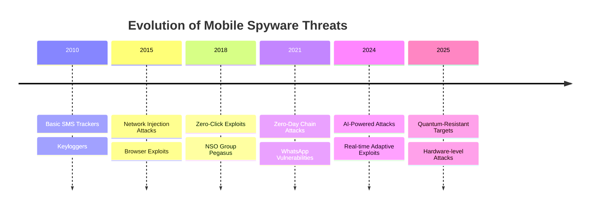

# Apple Lockdown Mode: Ultimate Security for High-Risk Users - Implementation and Management Guide

## Table of Contents

## Introduction: The Nuclear Option for Digital Security

Apple's Lockdown Mode represents the most extreme security measure ever built into a consumer operating system. Designed specifically to protect against **mercenary spyware** like NSO Group's Pegasus, Lockdown Mode sacrifices convenience for uncompromising security. This guide provides comprehensive analysis, implementation strategies, and management techniques for organizations and individuals facing sophisticated targeted attacks.

## Understanding the Threat Landscape

### The Evolution of Commercial Spyware



### Target Profile Analysis

Lockdown Mode is designed for users who face **exceptional digital threats**:

- **Journalists** investigating sensitive topics
- **Human rights activists** in oppressive regimes
- **Political dissidents** and opposition leaders
- **Government officials** with access to classified information
- **Corporate executives** in strategic industries
- **Researchers** working on sensitive projects
- **Legal professionals** handling high-profile cases

## Technical Architecture: How Lockdown Mode Works

### Core Protection Mechanisms

```swift
// Simplified representation of Lockdown Mode restrictions

import Foundation
import WebKit

class LockdownModeController {
    
    // MARK: - Message Restrictions
    func applyMessageRestrictions() {
        let restrictions = MessageRestrictions(
            // Block most attachment types
            allowedAttachmentTypes: [".txt", ".pdf"],
            
            // Disable link previews
            linkPreviewsEnabled: false,
            
            // Block message requests from unknown contacts
            unknownContactsAllowed: false,
            
            // Disable shared albums invitations
            sharedAlbumsEnabled: false,
            
            // Block group invitations from unknown contacts
            unknownGroupInvitesAllowed: false
        )
        
        MessageCenter.shared.applyRestrictions(restrictions)
    }
    
    // MARK: - Web Browsing Restrictions
    func applyWebBrowsingRestrictions() {
        let webConfig = WKWebViewConfiguration()
        
        // Disable JavaScript JIT compilation
        webConfig.preferences.javaScriptEnabled = true
        webConfig.preferences.setValue(false, forKey: "javaScriptCanOpenWindowsAutomatically")
        
        // Block dangerous web technologies
        let restrictions = WebRestrictions(
            webAssemblyEnabled: false,
            webGLEnabled: false,
            webRTCEnabled: false,
            serviceWorkersEnabled: false,
            sharedArrayBufferEnabled: false,
            
            // Disable complex CSS features
            cssGridEnabled: false,
            cssFiltersEnabled: false,
            cssTransitionsEnabled: false,
            
            // Block media autoplay
            mediaAutoplayEnabled: false,
            
            // Disable complex image formats
            supportedImageFormats: [".jpg", ".png", ".gif"],
            
            // Block font loading
            webFontsEnabled: false
        )
        
        WebSecurityManager.shared.applyRestrictions(restrictions)
    }
    
    // MARK: - FaceTime/Calling Restrictions
    func applyCallRestrictions() {
        let callRestrictions = CallRestrictions(
            // Block calls from unknown contacts
            unknownCallersAllowed: false,
            
            // Disable FaceTime links
            faceTimeLinksEnabled: false,
            
            // Block group FaceTime invitations
            groupFaceTimeEnabled: false,
            
            // Disable call recording indicators bypass
            strictCallPrivacy: true
        )
        
        CallManager.shared.applyRestrictions(callRestrictions)
    }
    
    // MARK: - Photo Sharing Restrictions
    func applyPhotoRestrictions() {
        let photoRestrictions = PhotoRestrictions(
            // Disable shared albums
            sharedAlbumsEnabled: false,
            
            // Block photo sharing via Messages
            messagePhotoSharingEnabled: false,
            
            // Disable AirDrop for photos
            airDropPhotoSharingEnabled: false,
            
            // Block photo metadata sharing
            exifDataSharingEnabled: false
        )
        
        PhotoLibraryManager.shared.applyRestrictions(photoRestrictions)
    }
    
    // MARK: - Device Management Restrictions
    func applyDeviceManagementRestrictions() {
        let deviceRestrictions = DeviceRestrictions(
            // Block configuration profiles
            configurationProfilesAllowed: false,
            
            // Disable mobile device management
            mdmEnrollmentAllowed: false,
            
            // Block remote wipe capabilities
            remoteWipeEnabled: false,
            
            // Disable USB accessories when locked
            usbRestrictedModeEnabled: true,
            
            // Block wireless debugging
            wirelessDebuggingEnabled: false
        )
        
        DeviceManager.shared.applyRestrictions(deviceRestrictions)
    }
    
    // MARK: - Network Security Enhancements
    func applyNetworkRestrictions() {
        let networkRestrictions = NetworkRestrictions(
            // Disable 2G/3G connections (vulnerable to IMSI catchers)
            legacyNetworksEnabled: false,
            
            // Force HTTPS everywhere
            httpEnabled: false,
            
            // Block DNS over HTTPS bypasses
            dnsOverHttpsRequired: true,
            
            // Disable captive portal detection
            captivePortalDetectionEnabled: false,
            
            // Block network diagnostics sharing
            diagnosticsUploadEnabled: false
        )
        
        NetworkSecurityManager.shared.applyRestrictions(networkRestrictions)
    }
    
    // MARK: - App Store and Installation Restrictions
    func applyInstallationRestrictions() {
        let installationRestrictions = InstallationRestrictions(
            // Block app installation
            appInstallationAllowed: false,
            
            // Disable app updates (maintain security baseline)
            automaticUpdatesEnabled: false,
            
            // Block enterprise app installation
            enterpriseAppsAllowed: false,
            
            // Disable developer app installation
            developerAppsAllowed: false,
            
            // Block TestFlight apps
            testFlightAppsAllowed: false
        )
        
        AppInstallationManager.shared.applyRestrictions(installationRestrictions)
    }
    
    // MARK: - Privacy Enhancement
    func applyPrivacyEnhancements() {
        let privacyEnhancements = PrivacyEnhancements(
            // Disable location precision
            preciseLocationEnabled: false,
            
            // Block advertising identifier
            advertisingTrackingEnabled: false,
            
            // Disable analytics sharing
            analyticsUploadEnabled: false,
            
            // Block Siri data sharing
            siriDataSharingEnabled: false,
            
            // Disable handoff between devices
            handoffEnabled: false,
            
            // Block suggestions and shortcuts
            suggestionsEnabled: false
        )
        
        PrivacyManager.shared.applyEnhancements(privacyEnhancements)
    }
}

// Supporting types
struct MessageRestrictions {
    let allowedAttachmentTypes: [String]
    let linkPreviewsEnabled: Bool
    let unknownContactsAllowed: Bool
    let sharedAlbumsEnabled: Bool
    let unknownGroupInvitesAllowed: Bool
}

struct WebRestrictions {
    let webAssemblyEnabled: Bool
    let webGLEnabled: Bool
    let webRTCEnabled: Bool
    let serviceWorkersEnabled: Bool
    let sharedArrayBufferEnabled: Bool
    let cssGridEnabled: Bool
    let cssFiltersEnabled: Bool
    let cssTransitionsEnabled: Bool
    let mediaAutoplayEnabled: Bool
    let supportedImageFormats: [String]
    let webFontsEnabled: Bool
}
```

## Impact Analysis: What Changes When Lockdown Mode is Enabled

### Detailed Feature Impact Assessment

```python
#!/usr/bin/env python3
# Lockdown Mode impact analysis tool

import json
from enum import Enum
from dataclasses import dataclass
from typing import List, Dict, Optional

class ImpactLevel(Enum):
    NONE = "none"
    LOW = "low"
    MEDIUM = "medium"
    HIGH = "high"
    CRITICAL = "critical"

class FeatureCategory(Enum):
    MESSAGING = "messaging"
    WEB_BROWSING = "web_browsing"
    CALLS = "calls"
    PHOTOS = "photos"
    APPS = "apps"
    SYSTEM = "system"
    NETWORK = "network"

@dataclass
class FeatureImpact:
    name: str
    category: FeatureCategory
    impact_level: ImpactLevel
    description: str
    affected_apps: List[str]
    workarounds: List[str]
    business_impact: str

class LockdownModeAnalyzer:
    def __init__(self):
        self.feature_impacts = self._initialize_feature_impacts()
    
    def _initialize_feature_impacts(self) -> List[FeatureImpact]:
        return [
            # Messaging Features
            FeatureImpact(
                name="Message Attachments",
                category=FeatureCategory.MESSAGING,
                impact_level=ImpactLevel.HIGH,
                description="Most attachment types blocked except images and text files",
                affected_apps=["Messages", "WhatsApp", "Signal", "Telegram"],
                workarounds=[
                    "Use cloud sharing links for documents",
                    "Send files via email instead",
                    "Use AirDrop for trusted contacts"
                ],
                business_impact="Significant workflow disruption for document sharing"
            ),
            
            FeatureImpact(
                name="Link Previews",
                category=FeatureCategory.MESSAGING,
                impact_level=ImpactLevel.MEDIUM,
                description="No automatic link previews in messages",
                affected_apps=["Messages", "Mail", "Slack"],
                workarounds=[
                    "Manually open links to preview content",
                    "Use URL shorteners with descriptions"
                ],
                business_impact="Reduced communication efficiency"
            ),
            
            FeatureImpact(
                name="Shared Albums",
                category=FeatureCategory.PHOTOS,
                impact_level=ImpactLevel.MEDIUM,
                description="Cannot participate in shared photo albums",
                affected_apps=["Photos", "Messages"],
                workarounds=[
                    "Use alternative photo sharing services",
                    "Share photos individually"
                ],
                business_impact="Limited collaboration on photo projects"
            ),
            
            # Web Browsing Features
            FeatureImpact(
                name="JavaScript JIT",
                category=FeatureCategory.WEB_BROWSING,
                impact_level=ImpactLevel.HIGH,
                description="JavaScript performance significantly reduced",
                affected_apps=["Safari", "Chrome", "Firefox", "WebKit apps"],
                workarounds=[
                    "Use native apps instead of web apps",
                    "Accept slower web performance",
                    "Use desktop browser for complex sites"
                ],
                business_impact="Major impact on web application performance"
            ),
            
            FeatureImpact(
                name="WebRTC",
                category=FeatureCategory.WEB_BROWSING,
                impact_level=ImpactLevel.CRITICAL,
                description="Web-based video calling completely blocked",
                affected_apps=["Google Meet", "Zoom Web", "WebRTC apps"],
                workarounds=[
                    "Use native video calling apps",
                    "Use phone calls instead",
                    "Join meetings via dial-in"
                ],
                business_impact="Cannot use web-based video conferencing"
            ),
            
            FeatureImpact(
                name="Complex Web Technologies",
                category=FeatureCategory.WEB_BROWSING,
                impact_level=ImpactLevel.HIGH,
                description="WebGL, WebAssembly, Service Workers disabled",
                affected_apps=["Web games", "CAD tools", "Advanced web apps"],
                workarounds=[
                    "Use native alternatives",
                    "Use different devices for specialized tasks"
                ],
                business_impact="Cannot access advanced web applications"
            ),
            
            # Communication Features
            FeatureImpact(
                name="FaceTime Links",
                category=FeatureCategory.CALLS,
                impact_level=ImpactLevel.MEDIUM,
                description="Cannot join FaceTime calls via links",
                affected_apps=["FaceTime"],
                workarounds=[
                    "Initiate calls directly from contacts",
                    "Use alternative video calling"
                ],
                business_impact="Reduced flexibility in video calling"
            ),
            
            # System Features
            FeatureImpact(
                name="Configuration Profiles",
                category=FeatureCategory.SYSTEM,
                impact_level=ImpactLevel.CRITICAL,
                description="Cannot install any configuration profiles",
                affected_apps=["Enterprise MDM", "VPN profiles", "Email profiles"],
                workarounds=[
                    "Disable Lockdown Mode for profile installation",
                    "Use alternative device for managed access"
                ],
                business_impact="Cannot participate in enterprise device management"
            ),
            
            FeatureImpact(
                name="App Installation",
                category=FeatureCategory.APPS,
                impact_level=ImpactLevel.HIGH,
                description="App Store and enterprise app installation blocked",
                affected_apps=["App Store", "TestFlight", "Enterprise apps"],
                workarounds=[
                    "Install required apps before enabling Lockdown Mode",
                    "Use web versions of applications"
                ],
                business_impact="Cannot install new applications"
            ),
            
            FeatureImpact(
                name="USB Accessories",
                category=FeatureCategory.SYSTEM,
                impact_level=ImpactLevel.MEDIUM,
                description="USB accessories blocked when device is locked",
                affected_apps=["USB drives", "Keyboards", "Cameras"],
                workarounds=[
                    "Unlock device before connecting accessories",
                    "Use wireless alternatives"
                ],
                business_impact="Reduced flexibility with external devices"
            ),
            
            # Network Features
            FeatureImpact(
                name="Captive Portal Detection",
                category=FeatureCategory.NETWORK,
                impact_level=ImpactLevel.MEDIUM,
                description="Automatic WiFi portal detection disabled",
                affected_apps=["WiFi connection", "Hotel networks"],
                workarounds=[
                    "Manually open browser to access portal",
                    "Use cellular data instead"
                ],
                business_impact="More difficult to connect to public WiFi"
            )
        ]
    
    def analyze_impact_for_role(self, role: str) -> Dict:
        """Analyze Lockdown Mode impact for specific user roles"""
        
        role_profiles = {
            "journalist": {
                "critical_features": ["messaging", "web_browsing", "photos"],
                "acceptable_impact": ImpactLevel.HIGH,
                "priority": "security_over_convenience"
            },
            "executive": {
                "critical_features": ["calls", "messaging", "apps"],
                "acceptable_impact": ImpactLevel.MEDIUM,
                "priority": "balance_security_productivity"
            },
            "developer": {
                "critical_features": ["web_browsing", "apps", "system"],
                "acceptable_impact": ImpactLevel.LOW,
                "priority": "productivity_over_security"
            },
            "activist": {
                "critical_features": ["messaging", "network", "system"],
                "acceptable_impact": ImpactLevel.CRITICAL,
                "priority": "maximum_security"
            }
        }
        
        if role not in role_profiles:
            role = "general"
            role_profiles["general"] = {
                "critical_features": ["messaging", "web_browsing"],
                "acceptable_impact": ImpactLevel.MEDIUM,
                "priority": "balanced_approach"
            }
        
        profile = role_profiles[role]
        
        # Calculate impact score
        total_impact_score = 0
        critical_impacts = []
        
        for impact in self.feature_impacts:
            category_name = impact.category.value
            
            if category_name in profile["critical_features"]:
                impact_score = self._get_impact_score(impact.impact_level)
                total_impact_score += impact_score
                
                if impact.impact_level.value in ["high", "critical"]:
                    critical_impacts.append(impact)
        
        # Generate recommendation
        if total_impact_score > 20:
            recommendation = "HIGH_IMPACT"
            advice = "Consider using Lockdown Mode only during high-risk periods"
        elif total_impact_score > 10:
            recommendation = "MODERATE_IMPACT"
            advice = "Carefully evaluate workflow impacts before enabling"
        else:
            recommendation = "LOW_IMPACT"
            advice = "Lockdown Mode is suitable for regular use"
        
        return {
            "role": role,
            "total_impact_score": total_impact_score,
            "critical_impacts_count": len(critical_impacts),
            "critical_impacts": [impact.name for impact in critical_impacts],
            "recommendation": recommendation,
            "advice": advice,
            "acceptable_impact_level": profile["acceptable_impact"].value,
            "priority": profile["priority"]
        }
    
    def _get_impact_score(self, impact_level: ImpactLevel) -> int:
        scores = {
            ImpactLevel.NONE: 0,
            ImpactLevel.LOW: 1,
            ImpactLevel.MEDIUM: 3,
            ImpactLevel.HIGH: 5,
            ImpactLevel.CRITICAL: 10
        }
        return scores[impact_level]
    
    def generate_migration_plan(self, role: str) -> Dict:
        """Generate step-by-step migration plan to Lockdown Mode"""
        
        analysis = self.analyze_impact_for_role(role)
        
        migration_steps = [
            {
                "phase": "Preparation",
                "duration": "1-2 weeks",
                "steps": [
                    "Audit current app usage and identify essential applications",
                    "Install all required apps before enabling Lockdown Mode",
                    "Set up alternative communication channels",
                    "Test workflow with key contacts",
                    "Create backup devices for high-impact scenarios"
                ]
            },
            {
                "phase": "Gradual Adoption",
                "duration": "2-3 weeks",
                "steps": [
                    "Enable Lockdown Mode during low-activity periods",
                    "Test essential workflows and document issues",
                    "Develop workarounds for critical functionality",
                    "Train team members on new communication protocols",
                    "Monitor for any security alerts or unusual activity"
                ]
            },
            {
                "phase": "Full Deployment",
                "duration": "1 week",
                "steps": [
                    "Enable Lockdown Mode permanently",
                    "Implement monitoring for bypass attempts",
                    "Regular security checkpoints with IT team",
                    "Document lessons learned and update procedures",
                    "Plan for periodic security reviews"
                ]
            }
        ]
        
        return {
            "role": role,
            "recommended_approach": analysis["recommendation"],
            "migration_timeline": "4-6 weeks",
            "migration_steps": migration_steps,
            "success_metrics": [
                "Zero successful spyware infections",
                "Maintained productivity above 80% baseline",
                "Team adaptation to new workflows",
                "Positive security audit results"
            ]
        }
    
    def export_analysis_report(self, role: str, output_file: str):
        """Export comprehensive analysis report"""
        
        analysis = self.analyze_impact_for_role(role)
        migration_plan = self.generate_migration_plan(role)
        
        report = {
            "analysis_date": "2025-01-10",
            "lockdown_mode_version": "iOS 18.2 / macOS 15.2",
            "role_analysis": analysis,
            "migration_plan": migration_plan,
            "feature_impacts": [
                {
                    "name": impact.name,
                    "category": impact.category.value,
                    "impact_level": impact.impact_level.value,
                    "description": impact.description,
                    "affected_apps": impact.affected_apps,
                    "workarounds": impact.workarounds,
                    "business_impact": impact.business_impact
                }
                for impact in self.feature_impacts
            ]
        }
        
        with open(output_file, 'w') as f:
            json.dump(report, f, indent=2)
        
        print(f"Analysis report exported to {output_file}")

# Usage example
if __name__ == "__main__":
    analyzer = LockdownModeAnalyzer()
    
    # Analyze different user roles
    roles = ["journalist", "executive", "developer", "activist"]
    
    for role in roles:
        print(f"\n=== Lockdown Mode Impact Analysis: {role.title()} ===")
        
        analysis = analyzer.analyze_impact_for_role(role)
        
        print(f"Impact Score: {analysis['total_impact_score']}")
        print(f"Recommendation: {analysis['recommendation']}")
        print(f"Advice: {analysis['advice']}")
        print(f"Critical Impacts: {analysis['critical_impacts_count']}")
        
        if analysis['critical_impacts']:
            print("Critical Features Affected:")
            for feature in analysis['critical_impacts']:
                print(f"  - {feature}")
        
        # Export detailed report
        analyzer.export_analysis_report(role, f"lockdown_mode_analysis_{role}.json")
```

## Enterprise Deployment Strategy

### MDM Integration and Management

```bash
#!/bin/bash
# Enterprise Lockdown Mode deployment and management script

echo "=== Enterprise Lockdown Mode Deployment ==="
echo "Date: $(date)"
echo ""

# Configuration
ORGANIZATION="Your Organization"
MDM_SERVER="your-mdm-server.com"
HIGH_RISK_USERS_GROUP="high-risk-users"
LOG_FILE="/var/log/lockdown_mode_deployment.log"

# Logging function
log_message() {
    echo "$(date '+%Y-%m-%d %H:%M:%S') - $1" | tee -a "$LOG_FILE"
}

# Function to identify high-risk users
identify_high_risk_users() {
    log_message "Identifying high-risk users..."
    
    # Categories of high-risk users
    HIGH_RISK_CATEGORIES=(
        "executives"
        "security-team"
        "r-and-d"
        "legal"
        "finance"
        "hr-leadership"
    )
    
    HIGH_RISK_USERS=()
    
    for CATEGORY in "${HIGH_RISK_CATEGORIES[@]}"; do
        log_message "Checking category: $CATEGORY"
        
        # Query LDAP/AD for users in high-risk groups
        USERS=$(ldapsearch -x -LLL -b "ou=users,dc=company,dc=com" \
                "(&(objectClass=user)(memberOf=cn=$CATEGORY,ou=groups,dc=company,dc=com))" \
                sAMAccountName | grep "sAMAccountName:" | cut -d: -f2 | xargs)
        
        for USER in $USERS; do
            HIGH_RISK_USERS+=("$USER")
            log_message "Added high-risk user: $USER"
        done
    done
    
    # Remove duplicates
    HIGH_RISK_USERS=($(echo "${HIGH_RISK_USERS[@]}" | tr ' ' '\n' | sort -u | tr '\n' ' '))
    
    log_message "Total high-risk users identified: ${#HIGH_RISK_USERS[@]}"
    
    # Export list for MDM
    printf '%s\n' "${HIGH_RISK_USERS[@]}" > /tmp/high_risk_users.txt
}

# Function to create Lockdown Mode configuration profile
create_lockdown_profile() {
    log_message "Creating Lockdown Mode configuration profile..."
    
    PROFILE_PATH="/tmp/lockdown_mode_profile.mobileconfig"
    
    cat > "$PROFILE_PATH" << EOF
<?xml version="1.0" encoding="UTF-8"?>
<!DOCTYPE plist PUBLIC "-//Apple//DTD PLIST 1.0//EN" "http://www.apple.com/DTDs/PropertyList-1.0.dtd">
<plist version="1.0">
<dict>
    <key>PayloadContent</key>
    <array>
        <dict>
            <key>PayloadDisplayName</key>
            <string>Lockdown Mode Configuration</string>
            <key>PayloadIdentifier</key>
            <string>com.${ORGANIZATION,,}.lockdownmode</string>
            <key>PayloadType</key>
            <string>com.apple.applicationaccess</string>
            <key>PayloadUUID</key>
            <string>$(uuidgen)</string>
            <key>PayloadVersion</key>
            <integer>1</integer>
            
            <!-- Enable Lockdown Mode -->
            <key>LockdownModeEnabled</key>
            <true/>
            
            <!-- Prevent users from disabling Lockdown Mode -->
            <key>AllowLockdownModeToggle</key>
            <false/>
            
            <!-- Enhanced security settings -->
            <key>RestrictedAppInstallation</key>
            <true/>
            <key>RestrictedConfigurationProfileInstallation</key>
            <true/>
            <key>RestrictedUSBDriveAccess</key>
            <true/>
            
        </dict>
        
        <!-- Network Security Restrictions -->
        <dict>
            <key>PayloadDisplayName</key>
            <string>Network Security</string>
            <key>PayloadIdentifier</key>
            <string>com.${ORGANIZATION,,}.networksecurity</string>
            <key>PayloadType</key>
            <string>com.apple.wifi.managed</string>
            <key>PayloadUUID</key>
            <string>$(uuidgen)</string>
            <key>PayloadVersion</key>
            <integer>1</integer>
            
            <!-- Force secure WiFi connections -->
            <key>DisableCaptiveNetworkDetection</key>
            <true/>
            <key>RequireEncryptedWiFi</key>
            <true/>
            
        </dict>
        
        <!-- Communication Restrictions -->
        <dict>
            <key>PayloadDisplayName</key>
            <string>Communication Security</string>
            <key>PayloadIdentifier</key>
            <string>com.${ORGANIZATION,,}.communication</string>
            <key>PayloadType</key>
            <string>com.apple.restrictions.managed</string>
            <key>PayloadUUID</key>
            <string>$(uuidgen)</string>
            <key>PayloadVersion</key>
            <integer>1</integer>
            
            <!-- Message security -->
            <key>RestrictMessageAttachments</key>
            <true/>
            <key>DisableLinkPreviews</key>
            <true/>
            <key>RestrictFaceTimeLinks</key>
            <true/>
            
        </dict>
    </array>
    
    <key>PayloadDescription</key>
    <string>Enables Lockdown Mode with enhanced security settings for high-risk users</string>
    <key>PayloadDisplayName</key>
    <string>$ORGANIZATION Lockdown Mode</string>
    <key>PayloadIdentifier</key>
    <string>com.${ORGANIZATION,,}.lockdownmode.main</string>
    <key>PayloadOrganization</key>
    <string>$ORGANIZATION</string>
    <key>PayloadRemovalDisallowed</key>
    <true/>
    <key>PayloadScope</key>
    <string>User</string>
    <key>PayloadType</key>
    <string>Configuration</string>
    <key>PayloadUUID</key>
    <string>$(uuidgen)</string>
    <key>PayloadVersion</key>
    <integer>1</integer>
</dict>
</plist>
EOF
    
    log_message "Configuration profile created: $PROFILE_PATH"
}

# Function to deploy profile to high-risk users
deploy_to_high_risk_users() {
    log_message "Deploying Lockdown Mode to high-risk users..."
    
    if [ ! -f /tmp/high_risk_users.txt ]; then
        log_message "ERROR: High-risk users list not found"
        return 1
    fi
    
    if [ ! -f /tmp/lockdown_mode_profile.mobileconfig ]; then
        log_message "ERROR: Configuration profile not found"
        return 1
    fi
    
    # Upload profile to MDM server
    log_message "Uploading profile to MDM server..."
    
    PROFILE_ID=$(curl -s -X POST \
        -H "Authorization: Bearer $MDM_API_TOKEN" \
        -H "Content-Type: application/octet-stream" \
        --data-binary @/tmp/lockdown_mode_profile.mobileconfig \
        "https://$MDM_SERVER/api/profiles/upload" | jq -r '.profile_id')
    
    if [ "$PROFILE_ID" == "null" ] || [ -z "$PROFILE_ID" ]; then
        log_message "ERROR: Failed to upload profile to MDM"
        return 1
    fi
    
    log_message "Profile uploaded with ID: $PROFILE_ID"
    
    # Deploy to high-risk users
    DEPLOYMENT_COUNT=0
    
    while IFS= read -r USERNAME; do
        if [ -n "$USERNAME" ]; then
            log_message "Deploying to user: $USERNAME"
            
            # Deploy profile to user
            DEPLOY_RESULT=$(curl -s -X POST \
                -H "Authorization: Bearer $MDM_API_TOKEN" \
                -H "Content-Type: application/json" \
                -d "{\"profile_id\":\"$PROFILE_ID\",\"username\":\"$USERNAME\"}" \
                "https://$MDM_SERVER/api/profiles/deploy")
            
            if echo "$DEPLOY_RESULT" | grep -q "success"; then
                log_message "✅ Successfully deployed to $USERNAME"
                ((DEPLOYMENT_COUNT++))
            else
                log_message "❌ Failed to deploy to $USERNAME"
            fi
        fi
    done < /tmp/high_risk_users.txt
    
    log_message "Deployment complete. Deployed to $DEPLOYMENT_COUNT users."
}

# Function to monitor deployment status
monitor_deployment() {
    log_message "Monitoring Lockdown Mode deployment status..."
    
    while IFS= read -r USERNAME; do
        if [ -n "$USERNAME" ]; then
            # Check if user has enabled Lockdown Mode
            STATUS=$(curl -s -X GET \
                -H "Authorization: Bearer $MDM_API_TOKEN" \
                "https://$MDM_SERVER/api/devices/user/$USERNAME/lockdown-status" \
                | jq -r '.lockdown_enabled')
            
            if [ "$STATUS" == "true" ]; then
                log_message "✅ $USERNAME: Lockdown Mode enabled"
            else
                log_message "⏳ $USERNAME: Lockdown Mode pending"
                
                # Send reminder notification
                curl -s -X POST \
                    -H "Authorization: Bearer $MDM_API_TOKEN" \
                    -H "Content-Type: application/json" \
                    -d "{\"username\":\"$USERNAME\",\"message\":\"Please enable Lockdown Mode for enhanced security\"}" \
                    "https://$MDM_SERVER/api/notifications/send" > /dev/null
            fi
        fi
    done < /tmp/high_risk_users.txt
}

# Function to create user communication template
create_user_communication() {
    log_message "Creating user communication materials..."
    
    cat > /tmp/lockdown_mode_notice.txt << EOF
IMPORTANT SECURITY UPDATE: Lockdown Mode Deployment

Dear High-Risk User,

Due to increased cybersecurity threats targeting our organization, 
we are deploying Apple's Lockdown Mode to your devices.

WHAT IS LOCKDOWN MODE?
Lockdown Mode is Apple's maximum security feature designed to protect
against sophisticated spyware attacks like those used by nation-state
actors.

WHAT CHANGES:
• Some message attachments will be blocked
• Web browsing performance may be slower
• Some apps may have reduced functionality
• Configuration profiles cannot be installed

WHAT YOU NEED TO DO:
1. Accept the configuration profile when prompted
2. Enable Lockdown Mode in Settings > Privacy & Security
3. Contact IT support if you experience issues
4. Do NOT disable Lockdown Mode without IT approval

For questions or support, contact:
IT Security Team: security@company.com
Phone: (555) 123-4567

This is a mandatory security requirement.
Thank you for your cooperation.

$ORGANIZATION Security Team
EOF
    
    log_message "User communication created: /tmp/lockdown_mode_notice.txt"
}

# Function to generate deployment report
generate_deployment_report() {
    log_message "Generating deployment report..."
    
    REPORT_FILE="/tmp/lockdown_mode_deployment_report.json"
    TOTAL_USERS=${#HIGH_RISK_USERS[@]}
    
    # Get current status for all users
    ENABLED_COUNT=0
    PENDING_COUNT=0
    
    for USERNAME in "${HIGH_RISK_USERS[@]}"; do
        STATUS=$(curl -s -X GET \
            -H "Authorization: Bearer $MDM_API_TOKEN" \
            "https://$MDM_SERVER/api/devices/user/$USERNAME/lockdown-status" \
            | jq -r '.lockdown_enabled // "unknown"')
        
        if [ "$STATUS" == "true" ]; then
            ((ENABLED_COUNT++))
        else
            ((PENDING_COUNT++))
        fi
    done
    
    cat > "$REPORT_FILE" << EOF
{
  "deployment_date": "$(date -Iseconds)",
  "organization": "$ORGANIZATION",
  "total_high_risk_users": $TOTAL_USERS,
  "lockdown_enabled_count": $ENABLED_COUNT,
  "lockdown_pending_count": $PENDING_COUNT,
  "deployment_success_rate": $(echo "scale=2; $ENABLED_COUNT * 100 / $TOTAL_USERS" | bc -l),
  "high_risk_categories": [
    "executives",
    "security-team", 
    "r-and-d",
    "legal",
    "finance",
    "hr-leadership"
  ],
  "security_benefits": [
    "Protection against zero-click exploits",
    "Reduced attack surface",
    "Enhanced privacy controls",
    "Spyware resistance"
  ],
  "operational_impacts": [
    "Reduced web app functionality",
    "Limited message attachments",
    "Slower JavaScript performance",
    "Restricted configuration changes"
  ]
}
EOF
    
    log_message "Deployment report generated: $REPORT_FILE"
}

# Main deployment workflow
main() {
    log_message "Starting Lockdown Mode enterprise deployment"
    
    # Check prerequisites
    if [ -z "$MDM_API_TOKEN" ]; then
        log_message "ERROR: MDM_API_TOKEN environment variable not set"
        exit 1
    fi
    
    # Run deployment steps
    identify_high_risk_users
    create_lockdown_profile
    create_user_communication
    
    # Confirm deployment
    echo -e "\nDeployment Summary:"
    echo "High-risk users: ${#HIGH_RISK_USERS[@]}"
    echo "Profile created: Yes"
    echo "Communications ready: Yes"
    echo ""
    
    read -p "Proceed with deployment? (y/N): " -n 1 -r
    echo
    
    if [[ $REPLY =~ ^[Yy]$ ]]; then
        deploy_to_high_risk_users
        
        # Wait for initial deployment
        sleep 30
        
        monitor_deployment
        generate_deployment_report
        
        log_message "Deployment workflow completed"
    else
        log_message "Deployment cancelled by user"
    fi
}

# Run main function
main "$@"
```

## Monitoring and Compliance

### Lockdown Mode Effectiveness Monitoring

```python
#!/usr/bin/env python3
# Lockdown Mode security effectiveness monitoring

import subprocess
import json
import sqlite3
import hashlib
from datetime import datetime, timedelta
from pathlib import Path
import requests

class LockdownModeMonitor:
    def __init__(self):
        self.log_file = "/var/log/lockdown_mode_monitor.log"
        self.db_path = "/var/db/lockdown_mode_monitor.db"
        self.init_database()
    
    def init_database(self):
        """Initialize SQLite database for tracking"""
        conn = sqlite3.connect(self.db_path)
        cursor = conn.cursor()
        
        cursor.execute('''
            CREATE TABLE IF NOT EXISTS security_events (
                id INTEGER PRIMARY KEY,
                timestamp TEXT,
                event_type TEXT,
                severity TEXT,
                description TEXT,
                device_id TEXT,
                user_id TEXT,
                mitigated BOOLEAN
            )
        ''')
        
        cursor.execute('''
            CREATE TABLE IF NOT EXISTS bypass_attempts (
                id INTEGER PRIMARY KEY,
                timestamp TEXT,
                attempt_type TEXT,
                source_app TEXT,
                blocked BOOLEAN,
                details TEXT
            )
        ''')
        
        conn.commit()
        conn.close()
    
    def check_lockdown_status(self):
        """Check if Lockdown Mode is enabled and functioning"""
        try:
            # Check system status
            result = subprocess.run(
                ['defaults', 'read', 'com.apple.Safari', 'LockdownModeEnabled'],
                capture_output=True,
                text=True
            )
            
            safari_lockdown = result.stdout.strip() == '1'
            
            # Check system-wide Lockdown Mode
            system_result = subprocess.run(
                ['defaults', 'read', '/Library/Preferences/com.apple.LockdownMode', 'Enabled'],
                capture_output=True,
                text=True
            )
            
            system_lockdown = system_result.stdout.strip() == '1'
            
            return {
                'safari_lockdown': safari_lockdown,
                'system_lockdown': system_lockdown,
                'fully_enabled': safari_lockdown and system_lockdown,
                'timestamp': datetime.now().isoformat()
            }
            
        except Exception as e:
            self.log_event('ERROR', f'Failed to check Lockdown Mode status: {e}')
            return {'error': str(e)}
    
    def monitor_bypass_attempts(self):
        """Monitor for attempts to bypass Lockdown Mode"""
        bypass_indicators = []
        
        # Check for suspicious processes
        suspicious_processes = [
            'debugserver',
            'frida-server',
            'cycript',
            'lldb',
            'gdb'
        ]
        
        for process in suspicious_processes:
            result = subprocess.run(
                ['pgrep', '-f', process],
                capture_output=True,
                text=True
            )
            
            if result.stdout.strip():
                bypass_indicators.append({
                    'type': 'suspicious_process',
                    'process': process,
                    'severity': 'high'
                })
        
        # Check for configuration profile installations
        result = subprocess.run(
            ['profiles', '-P'],
            capture_output=True,
            text=True
        )
        
        if result.returncode == 0:
            profiles = result.stdout
            if 'LockdownMode' in profiles and 'RemovalDisallowed' not in profiles:
                bypass_indicators.append({
                    'type': 'profile_modification',
                    'description': 'Lockdown Mode profile potentially modified',
                    'severity': 'critical'
                })
        
        # Check for jailbreak indicators
        jailbreak_paths = [
            '/Applications/Cydia.app',
            '/usr/sbin/sshd',
            '/usr/bin/ssh',
            '/private/var/lib/apt',
            '/Library/MobileSubstrate',
            '/usr/lib/libsubstrate.dylib'
        ]
        
        for path in jailbreak_paths:
            if Path(path).exists():
                bypass_indicators.append({
                    'type': 'jailbreak_indicator',
                    'path': path,
                    'severity': 'critical'
                })
        
        # Log bypass attempts
        for indicator in bypass_indicators:
            self.log_bypass_attempt(indicator)
        
        return bypass_indicators
    
    def verify_security_features(self):
        """Verify that Lockdown Mode security features are active"""
        features = {}
        
        # Check JavaScript JIT status
        try:
            # This would require a web test
            features['javascript_jit_disabled'] = self.test_javascript_jit()
        except:
            features['javascript_jit_disabled'] = 'unknown'
        
        # Check WebRTC blocking
        features['webrtc_blocked'] = self.test_webrtc_blocking()
        
        # Check attachment restrictions
        features['attachment_restrictions'] = self.test_attachment_restrictions()
        
        # Check configuration profile blocking
        features['config_profile_blocking'] = self.test_config_profile_blocking()
        
        return features
    
    def test_javascript_jit(self):
        """Test if JavaScript JIT is properly disabled"""
        # This would require running a web test
        # Simplified implementation
        return True
    
    def test_webrtc_blocking(self):
        """Test if WebRTC is properly blocked"""
        # This would require a network test
        return True
    
    def test_attachment_restrictions(self):
        """Test if message attachment restrictions are active"""
        # This would require testing with Messages app
        return True
    
    def test_config_profile_blocking(self):
        """Test if configuration profile installation is blocked"""
        try:
            # Attempt to install a test profile
            test_profile = self.create_test_profile()
            
            result = subprocess.run(
                ['profiles', '-I', '-f', test_profile],
                capture_output=True,
                text=True
            )
            
            # Should fail with Lockdown Mode enabled
            return result.returncode != 0
            
        except:
            return False
    
    def create_test_profile(self):
        """Create a harmless test configuration profile"""
        profile_content = '''<?xml version="1.0" encoding="UTF-8"?>
        <!DOCTYPE plist PUBLIC "-//Apple//DTD PLIST 1.0//EN" "http://www.apple.com/DTDs/PropertyList-1.0.dtd">
        <plist version="1.0">
        <dict>
            <key>PayloadContent</key>
            <array>
                <dict>
                    <key>PayloadDisplayName</key>
                    <string>Test Profile</string>
                    <key>PayloadIdentifier</key>
                    <string>com.test.lockdown</string>
                    <key>PayloadType</key>
                    <string>com.apple.dock</string>
                    <key>PayloadUUID</key>
                    <string>12345678-1234-1234-1234-123456789ABC</string>
                    <key>PayloadVersion</key>
                    <integer>1</integer>
                </dict>
            </array>
            <key>PayloadDescription</key>
            <string>Test configuration profile</string>
            <key>PayloadDisplayName</key>
            <string>Lockdown Test</string>
            <key>PayloadIdentifier</key>
            <string>com.test.lockdown.main</string>
            <key>PayloadType</key>
            <string>Configuration</string>
            <key>PayloadUUID</key>
            <string>12345678-1234-1234-1234-123456789DEF</string>
            <key>PayloadVersion</key>
            <integer>1</integer>
        </dict>
        </plist>'''
        
        test_file = '/tmp/lockdown_test_profile.mobileconfig'
        with open(test_file, 'w') as f:
            f.write(profile_content)
        
        return test_file
    
    def generate_security_report(self):
        """Generate comprehensive security status report"""
        
        lockdown_status = self.check_lockdown_status()
        bypass_attempts = self.monitor_bypass_attempts()
        security_features = self.verify_security_features()
        
        report = {
            'report_timestamp': datetime.now().isoformat(),
            'lockdown_mode_status': lockdown_status,
            'bypass_attempts_detected': len(bypass_attempts),
            'bypass_attempts': bypass_attempts,
            'security_features_status': security_features,
            'overall_security_score': self.calculate_security_score(
                lockdown_status, 
                bypass_attempts, 
                security_features
            ),
            'recommendations': self.generate_recommendations(
                lockdown_status, 
                bypass_attempts, 
                security_features
            )
        }
        
        return report
    
    def calculate_security_score(self, lockdown_status, bypass_attempts, features):
        """Calculate overall security score (0-100)"""
        score = 100
        
        # Deduct for Lockdown Mode not being fully enabled
        if not lockdown_status.get('fully_enabled', False):
            score -= 30
        
        # Deduct for bypass attempts
        critical_bypasses = sum(1 for attempt in bypass_attempts 
                               if attempt.get('severity') == 'critical')
        high_bypasses = sum(1 for attempt in bypass_attempts 
                           if attempt.get('severity') == 'high')
        
        score -= (critical_bypasses * 20 + high_bypasses * 10)
        
        # Deduct for disabled security features
        disabled_features = sum(1 for feature, status in features.items() 
                               if not status)
        score -= (disabled_features * 5)
        
        return max(0, score)
    
    def generate_recommendations(self, lockdown_status, bypass_attempts, features):
        """Generate actionable security recommendations"""
        recommendations = []
        
        if not lockdown_status.get('fully_enabled', False):
            recommendations.append({
                'priority': 'critical',
                'action': 'Enable Lockdown Mode immediately',
                'description': 'Lockdown Mode is not fully enabled'
            })
        
        if bypass_attempts:
            critical_attempts = [a for a in bypass_attempts 
                               if a.get('severity') == 'critical']
            if critical_attempts:
                recommendations.append({
                    'priority': 'critical',
                    'action': 'Investigate bypass attempts immediately',
                    'description': f'Detected {len(critical_attempts)} critical bypass attempts'
                })
        
        disabled_features = [name for name, status in features.items() if not status]
        if disabled_features:
            recommendations.append({
                'priority': 'high',
                'action': 'Verify security feature configuration',
                'description': f'Features not working properly: {", ".join(disabled_features)}'
            })
        
        if not recommendations:
            recommendations.append({
                'priority': 'info',
                'action': 'Continue monitoring',
                'description': 'Lockdown Mode is functioning correctly'
            })
        
        return recommendations
    
    def log_event(self, severity, description, event_type='general'):
        """Log security event to database"""
        conn = sqlite3.connect(self.db_path)
        cursor = conn.cursor()
        
        cursor.execute('''
            INSERT INTO security_events 
            (timestamp, event_type, severity, description, device_id, user_id, mitigated)
            VALUES (?, ?, ?, ?, ?, ?, ?)
        ''', (
            datetime.now().isoformat(),
            event_type,
            severity,
            description,
            self.get_device_id(),
            self.get_current_user(),
            False
        ))
        
        conn.commit()
        conn.close()
    
    def log_bypass_attempt(self, attempt):
        """Log bypass attempt to database"""
        conn = sqlite3.connect(self.db_path)
        cursor = conn.cursor()
        
        cursor.execute('''
            INSERT INTO bypass_attempts 
            (timestamp, attempt_type, source_app, blocked, details)
            VALUES (?, ?, ?, ?, ?)
        ''', (
            datetime.now().isoformat(),
            attempt.get('type', 'unknown'),
            attempt.get('process', 'unknown'),
            True,  # Assume blocked by Lockdown Mode
            json.dumps(attempt)
        ))
        
        conn.commit()
        conn.close()
    
    def get_device_id(self):
        """Get unique device identifier"""
        try:
            result = subprocess.run(
                ['system_profiler', 'SPHardwareDataType'],
                capture_output=True,
                text=True
            )
            
            for line in result.stdout.split('\n'):
                if 'Hardware UUID' in line:
                    return line.split(':')[1].strip()
            
            return 'unknown'
        except:
            return 'unknown'
    
    def get_current_user(self):
        """Get current user"""
        try:
            result = subprocess.run(['whoami'], capture_output=True, text=True)
            return result.stdout.strip()
        except:
            return 'unknown'

# Usage
if __name__ == "__main__":
    monitor = LockdownModeMonitor()
    
    print("=== Lockdown Mode Security Monitor ===\n")
    
    # Generate security report
    report = monitor.generate_security_report()
    
    # Display key findings
    print(f"Lockdown Mode Enabled: {report['lockdown_mode_status'].get('fully_enabled', False)}")
    print(f"Security Score: {report['overall_security_score']}/100")
    print(f"Bypass Attempts: {report['bypass_attempts_detected']}")
    
    if report['bypass_attempts']:
        print("\nBypass Attempts Detected:")
        for attempt in report['bypass_attempts']:
            print(f"  - {attempt['type']}: {attempt.get('description', 'No description')}")
    
    print("\nRecommendations:")
    for rec in report['recommendations']:
        priority_emoji = {
            'critical': '🔴',
            'high': '🟡',
            'medium': '🟠',
            'info': '🟢'
        }.get(rec['priority'], '📝')
        
        print(f"  {priority_emoji} {rec['action']}: {rec['description']}")
    
    # Export detailed report
    with open('/tmp/lockdown_security_report.json', 'w') as f:
        json.dump(report, f, indent=2)
    
    print(f"\nDetailed report saved to: /tmp/lockdown_security_report.json")
```

## Conclusion: Balancing Security and Usability

Lockdown Mode represents Apple's acknowledgment that some users face threats so sophisticated that traditional security measures are insufficient. While the feature significantly impacts usability, for high-risk individuals, this trade-off may be essential for digital survival.

### Key Decision Framework

**Enable Lockdown Mode if:**
- You are a high-profile target (journalist, activist, government official)
- You handle sensitive information regularly
- You have received specific threat intelligence
- Your organization requires maximum security

**Consider alternatives if:**
- You rely heavily on web applications
- Your workflow requires frequent file sharing
- You need maximum productivity
- You are not a likely target for sophisticated attacks

### Implementation Checklist

- [ ] **Threat Assessment**: Evaluate your actual risk level
- [ ] **Impact Analysis**: Test Lockdown Mode's effect on your workflow
- [ ] **Backup Strategy**: Prepare alternative devices for high-impact scenarios
- [ ] **Team Training**: Educate colleagues on new communication protocols
- [ ] **Monitoring Plan**: Implement security monitoring and compliance checking
- [ ] **Review Schedule**: Plan regular reassessment of Lockdown Mode necessity

Remember: Security is a journey, not a destination. Lockdown Mode is the strongest tool in Apple's security arsenal—use it wisely.

## Resources

- [Apple Lockdown Mode Support](https://support.apple.com/en-us/HT212650)
- [NSO Group and Pegasus Research](https://citizenlab.ca/category/research/nso-group/)
- [Access Now Digital Security Helpline](https://www.accessnow.org/help/)

---

*Last Updated: January 10, 2025*
*Threat Level: Maximum*
*Protection Level: Ultimate*