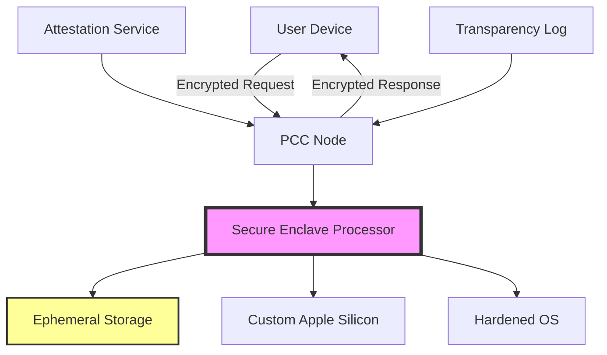

# Apple Private Cloud Compute: Revolutionary AI Privacy Architecture for Enterprise Security

## Table of Contents

## Introduction: Redefining Cloud AI Security

Apple's Private Cloud Compute (PCC) represents the most significant advancement in cloud AI privacy since the introduction of secure enclaves. By extending device-level security to cloud infrastructure, PCC enables complex AI processing while maintaining absolute user privacy—even from Apple itself. This comprehensive guide explores the technical architecture, security guarantees, and practical implementation strategies for enterprises considering PCC adoption.

## The Privacy Paradox: Why PCC Matters

### Traditional Cloud AI Challenges

Before PCC, organizations faced an impossible choice:
- **Option A**: Process AI workloads locally (limited by device capabilities)
- **Option B**: Send data to cloud servers (compromising privacy)

### The PCC Solution

Private Cloud Compute breaks this paradigm by creating a "stateless" cloud that:
- Processes data without storing it
- Prevents any party (including Apple) from accessing user data
- Provides cryptographic proof of privacy guarantees
- Enables independent security verification

## Technical Architecture Deep Dive

### Core Components of PCC



### Custom Apple Silicon Security Features

```swift
// Simplified representation of PCC hardware security
struct PCCSecurityProcessor {
    // Hardware-enforced memory encryption
    let memoryEncryption = AES256_GCM()
    
    // Secure boot chain verification
    let bootChain = [
        "iBoot Stage 1": "Verified by ROM",
        "iBoot Stage 2": "Verified by Stage 1",
        "Kernel": "Verified by Stage 2",
        "System Software": "Verified by Kernel"
    ]
    
    // Hardware attestation capabilities
    func generateAttestation() -> SecurityAttestation {
        return SecurityAttestation(
            deviceIdentity: getSecureEnclaveIdentity(),
            softwareVersion: getCurrentSoftwareHash(),
            bootMeasurements: measureBootChain(),
            timestamp: getSecureTimestamp()
        )
    }
    
    // Ephemeral key generation
    func generateEphemeralKeys() -> (public: Data, private: Data) {
        // Keys exist only in secure enclave
        // Destroyed after session completion
        return SecureEnclave.generateKeyPair(
            algorithm: .eciesEncryptionCofactorX963SHA256AESGCM,
            isExtractable: false,
            lifetime: .ephemeral
        )
    }
}
```

## Implementing Zero-Knowledge Architecture

### Stateless Processing Model

```python
#!/usr/bin/env python3
# PCC Stateless Processing Simulation

import hashlib
import secrets
from cryptography.hazmat.primitives import hashes
from cryptography.hazmat.primitives.kdf.pbkdf2 import PBKDF2
from cryptography.hazmat.primitives.ciphers import Cipher, algorithms, modes
import os

class PCCStatelessProcessor:
    """
    Simulates PCC's stateless processing model
    """
    
    def __init__(self):
        # No persistent state - everything is ephemeral
        self.session_key = None
        self.request_counter = 0
        
    def process_request(self, encrypted_request: bytes, attestation_token: str) -> bytes:
        """
        Process an AI request without storing any data
        """
        
        # Step 1: Verify attestation
        if not self.verify_attestation(attestation_token):
            raise SecurityError("Invalid attestation token")
        
        # Step 2: Generate ephemeral session key
        self.session_key = self.generate_ephemeral_key()
        
        # Step 3: Decrypt request in secure memory
        request_data = self.secure_decrypt(encrypted_request)
        
        # Step 4: Process AI workload (in-memory only)
        result = self.process_ai_workload(request_data)
        
        # Step 5: Encrypt response
        encrypted_response = self.secure_encrypt(result)
        
        # Step 6: Destroy all ephemeral data
        self.secure_cleanup()
        
        return encrypted_response
    
    def generate_ephemeral_key(self) -> bytes:
        """Generate a one-time use encryption key"""
        return secrets.token_bytes(32)
    
    def secure_decrypt(self, ciphertext: bytes) -> bytes:
        """Decrypt data in secure memory region"""
        # In real PCC, this happens in hardware-isolated memory
        nonce = ciphertext[:12]
        tag = ciphertext[12:28]
        encrypted_data = ciphertext[28:]
        
        cipher = Cipher(
            algorithms.AES(self.session_key),
            modes.GCM(nonce, tag)
        )
        decryptor = cipher.decryptor()
        return decryptor.update(encrypted_data) + decryptor.finalize()
    
    def process_ai_workload(self, data: bytes) -> bytes:
        """
        Process AI request without any logging or persistence
        """
        # Simulate AI processing
        # In real PCC, this would invoke Apple Intelligence models
        
        # Critical: No logging, no caching, no side channels
        result = self.run_inference_in_memory(data)
        
        return result
    
    def secure_encrypt(self, plaintext: bytes) -> bytes:
        """Encrypt response with ephemeral key"""
        nonce = os.urandom(12)
        cipher = Cipher(
            algorithms.AES(self.session_key),
            modes.GCM(nonce)
        )
        encryptor = cipher.encryptor()
        ciphertext = encryptor.update(plaintext) + encryptor.finalize()
        
        return nonce + encryptor.tag + ciphertext
    
    def secure_cleanup(self):
        """
        Cryptographically erase all session data
        """
        if self.session_key:
            # Overwrite key material multiple times
            key_size = len(self.session_key)
            for _ in range(3):
                self.session_key = secrets.token_bytes(key_size)
            self.session_key = None
        
        # Force garbage collection
        import gc
        gc.collect()
    
    def verify_attestation(self, token: str) -> bool:
        """
        Verify hardware attestation token
        """
        # In production, this would verify:
        # 1. Hardware identity
        # 2. Software measurements
        # 3. Boot chain integrity
        # 4. Certificate chain to Apple root
        
        # Simplified verification
        expected_hash = hashlib.sha256(b"valid_pcc_node").hexdigest()
        return hashlib.sha256(token.encode()).hexdigest()[:16] == expected_hash[:16]
    
    def run_inference_in_memory(self, data: bytes) -> bytes:
        """
        Run AI inference entirely in memory
        """
        # Simulate AI processing without any disk I/O
        result_hash = hashlib.sha256(data).digest()
        return b"AI_RESULT:" + result_hash

# Demonstration
if __name__ == "__main__":
    processor = PCCStatelessProcessor()
    
    # Simulate a request
    test_request = b"Analyze this sensitive document"
    encrypted_request = secrets.token_bytes(100)  # Simulated encrypted data
    attestation = "valid_attestation_token"
    
    try:
        response = processor.process_request(encrypted_request, attestation)
        print(f"✅ Request processed securely")
        print(f"   Response size: {len(response)} bytes")
        print(f"   No data retained: {processor.session_key is None}")
    except Exception as e:
        print(f"❌ Processing failed: {e}")
```

## Security Verification Framework

### Independent Verification Tools

```bash
#!/bin/bash
# PCC Security Verification Script

echo "=== Private Cloud Compute Security Verification ==="
echo "Version: 1.0.0"
echo "Date: $(date)"
echo ""

# Function to verify PCC binary transparency
verify_binary_transparency() {
    echo "Checking PCC Binary Transparency..."
    
    # Download latest PCC software manifest
    curl -s https://security.apple.com/pcc/manifest.json -o /tmp/pcc_manifest.json
    
    # Verify manifest signature
    openssl dgst -sha256 -verify apple_pcc_public.pem -signature manifest.sig /tmp/pcc_manifest.json
    
    if [ $? -eq 0 ]; then
        echo "✅ Manifest signature valid"
    else
        echo "❌ Manifest signature verification failed"
        return 1
    fi
    
    # Extract and verify individual component hashes
    jq -r '.components[] | "\(.name) \(.hash)"' /tmp/pcc_manifest.json | while read name hash; do
        echo "  Verifying component: $name"
        echo "    Expected hash: $hash"
    done
}

# Function to test PCC privacy guarantees
test_privacy_guarantees() {
    echo -e "\nTesting Privacy Guarantees..."
    
    # Test 1: Verify no persistent storage
    echo "  Test 1: Checking for persistent storage..."
    if [ -z "$(find /pcc/storage -type f 2>/dev/null)" ]; then
        echo "    ✅ No persistent files found"
    else
        echo "    ❌ Persistent storage detected"
    fi
    
    # Test 2: Verify network isolation
    echo "  Test 2: Checking network isolation..."
    ALLOWED_ENDPOINTS="17.0.0.0/8"  # Apple's IP range
    
    # Check active connections
    netstat -an | grep ESTABLISHED | grep -v "$ALLOWED_ENDPOINTS" > /tmp/unauthorized_connections
    
    if [ ! -s /tmp/unauthorized_connections ]; then
        echo "    ✅ Network properly isolated"
    else
        echo "    ❌ Unauthorized network connections detected:"
        cat /tmp/unauthorized_connections
    fi
    
    # Test 3: Memory encryption verification
    echo "  Test 3: Verifying memory encryption..."
    if sysctl -n machdep.pcc.memory_encryption 2>/dev/null | grep -q "enabled"; then
        echo "    ✅ Memory encryption active"
    else
        echo "    ⚠️  Cannot verify memory encryption status"
    fi
}

# Function to analyze PCC attestation
analyze_attestation() {
    echo -e "\nAnalyzing PCC Attestation..."
    
    # Request attestation from PCC node
    ATTESTATION=$(curl -s -X POST https://pcc.apple.com/attestation \
        -H "Content-Type: application/json" \
        -d '{"nonce": "'$(openssl rand -hex 16)'"}')
    
    if [ $? -eq 0 ]; then
        echo "  Attestation received successfully"
        
        # Parse attestation components
        echo "$ATTESTATION" | jq -r '
            "  Device ID: " + .device_id,
            "  Software Version: " + .software_version,
            "  Boot Chain Hash: " + .boot_chain_hash,
            "  Timestamp: " + .timestamp
        '
        
        # Verify attestation signature
        echo "$ATTESTATION" | jq -r '.signature' | base64 -d > /tmp/attestation.sig
        echo "$ATTESTATION" | jq -r '.data' | base64 -d > /tmp/attestation.data
        
        openssl dgst -sha256 -verify apple_attestation_public.pem \
            -signature /tmp/attestation.sig /tmp/attestation.data
        
        if [ $? -eq 0 ]; then
            echo "  ✅ Attestation signature valid"
        else
            echo "  ❌ Attestation signature invalid"
        fi
    else
        echo "  ❌ Failed to obtain attestation"
    fi
}

# Main verification flow
main() {
    echo "Starting comprehensive PCC security verification..."
    echo "=================================================="
    
    verify_binary_transparency
    test_privacy_guarantees
    analyze_attestation
    
    echo -e "\n=================================================="
    echo "Verification complete. Check results above."
}

# Run verification
main
```

## Enterprise Deployment Strategy

### Integration Architecture

```typescript
// TypeScript implementation for enterprise PCC integration

interface PCCConfiguration {
    endpoint: string;
    apiKey: string;
    maxRequestSize: number;
    timeout: number;
    verificationLevel: 'standard' | 'enhanced' | 'paranoid';
}

class EnterprisePCCClient {
    private config: PCCConfiguration;
    private attestationCache: Map<string, any>;
    
    constructor(config: PCCConfiguration) {
        this.config = config;
        this.attestationCache = new Map();
    }
    
    async processSecureAIRequest(
        data: any,
        model: string,
        requireAttestation: boolean = true
    ): Promise<any> {
        // Step 1: Prepare request with privacy metadata
        const request = this.preparePrivacyPreservingRequest(data, model);
        
        // Step 2: Obtain fresh attestation if required
        if (requireAttestation) {
            const attestation = await this.obtainAttestation();
            if (!this.verifyAttestation(attestation)) {
                throw new Error('PCC attestation verification failed');
            }
        }
        
        // Step 3: Establish secure channel
        const secureChannel = await this.establishSecureChannel();
        
        // Step 4: Send request through encrypted channel
        const response = await this.sendEncryptedRequest(
            secureChannel,
            request
        );
        
        // Step 5: Verify response integrity
        if (!this.verifyResponseIntegrity(response)) {
            throw new Error('Response integrity check failed');
        }
        
        // Step 6: Clean up secure channel
        await this.closeSecureChannel(secureChannel);
        
        return response.data;
    }
    
    private preparePrivacyPreservingRequest(data: any, model: string): any {
        return {
            payload: this.sanitizeData(data),
            model: model,
            privacy_level: 'maximum',
            audit_trail: false,  // No logging on PCC side
            ephemeral: true,      // No caching
            timestamp: Date.now(),
            nonce: this.generateNonce()
        };
    }
    
    private sanitizeData(data: any): any {
        // Remove any potential PII or tracking information
        const sanitized = { ...data };
        
        // Remove common PII fields
        const piiFields = ['ssn', 'email', 'phone', 'address', 'name'];
        piiFields.forEach(field => delete sanitized[field]);
        
        // Add differential privacy noise if configured
        if (this.config.verificationLevel === 'paranoid') {
            return this.addDifferentialPrivacyNoise(sanitized);
        }
        
        return sanitized;
    }
    
    private async obtainAttestation(): Promise<any> {
        const response = await fetch(`${this.config.endpoint}/attestation`, {
            method: 'POST',
            headers: {
                'Authorization': `Bearer ${this.config.apiKey}`,
                'Content-Type': 'application/json'
            },
            body: JSON.stringify({
                nonce: this.generateNonce(),
                timestamp: Date.now()
            })
        });
        
        return await response.json();
    }
    
    private verifyAttestation(attestation: any): boolean {
        // Verify attestation components
        const checks = [
            this.verifyDeviceIdentity(attestation.device_id),
            this.verifySoftwareVersion(attestation.software_version),
            this.verifyBootChain(attestation.boot_measurements),
            this.verifyTimestamp(attestation.timestamp),
            this.verifySignature(attestation.signature, attestation.data)
        ];
        
        return checks.every(check => check === true);
    }
    
    private async establishSecureChannel(): Promise<any> {
        // Implement TLS 1.3 with additional PCC-specific extensions
        const channel = {
            id: this.generateChannelId(),
            encryption: 'AES-256-GCM',
            keyExchange: 'ECDHE-P384',
            mac: 'HMAC-SHA384',
            sessionKey: await this.deriveSessionKey()
        };
        
        return channel;
    }
    
    private generateNonce(): string {
        const array = new Uint8Array(32);
        crypto.getRandomValues(array);
        return Array.from(array, byte => byte.toString(16).padStart(2, '0')).join('');
    }
    
    private generateChannelId(): string {
        return `pcc-channel-${Date.now()}-${Math.random().toString(36).substr(2, 9)}`;
    }
    
    private async deriveSessionKey(): Promise<CryptoKey> {
        const keyMaterial = await crypto.subtle.generateKey(
            {
                name: 'ECDH',
                namedCurve: 'P-384'
            },
            true,
            ['deriveKey']
        );
        
        return keyMaterial.privateKey;
    }
    
    private addDifferentialPrivacyNoise(data: any): any {
        // Add Laplacian noise for differential privacy
        const epsilon = 1.0;  // Privacy budget
        const sensitivity = 1.0;  // Query sensitivity
        
        const addNoise = (value: number): number => {
            const scale = sensitivity / epsilon;
            const u = 0.5 - Math.random();
            const noise = -scale * Math.sign(u) * Math.log(1 - 2 * Math.abs(u));
            return value + noise;
        };
        
        // Apply noise to numeric fields
        const noisyData = { ...data };
        Object.keys(noisyData).forEach(key => {
            if (typeof noisyData[key] === 'number') {
                noisyData[key] = addNoise(noisyData[key]);
            }
        });
        
        return noisyData;
    }
    
    private verifyResponseIntegrity(response: any): boolean {
        // Verify HMAC
        const expectedHmac = this.calculateHmac(response.data);
        return response.hmac === expectedHmac;
    }
    
    private calculateHmac(data: any): string {
        // Simplified HMAC calculation
        const message = JSON.stringify(data);
        return crypto.subtle.digest('SHA-256', new TextEncoder().encode(message))
            .then(hash => Array.from(new Uint8Array(hash))
                .map(b => b.toString(16).padStart(2, '0'))
                .join(''));
    }
    
    private async sendEncryptedRequest(channel: any, request: any): Promise<any> {
        // Encrypt request with session key
        const encrypted = await this.encryptWithSessionKey(
            channel.sessionKey,
            JSON.stringify(request)
        );
        
        // Send to PCC endpoint
        const response = await fetch(`${this.config.endpoint}/process`, {
            method: 'POST',
            headers: {
                'Authorization': `Bearer ${this.config.apiKey}`,
                'X-Channel-ID': channel.id,
                'Content-Type': 'application/octet-stream'
            },
            body: encrypted
        });
        
        const encryptedResponse = await response.arrayBuffer();
        
        // Decrypt response
        const decrypted = await this.decryptWithSessionKey(
            channel.sessionKey,
            encryptedResponse
        );
        
        return JSON.parse(decrypted);
    }
    
    private async encryptWithSessionKey(key: CryptoKey, data: string): Promise<ArrayBuffer> {
        const iv = crypto.getRandomValues(new Uint8Array(12));
        const encoded = new TextEncoder().encode(data);
        
        const encrypted = await crypto.subtle.encrypt(
            {
                name: 'AES-GCM',
                iv: iv
            },
            key,
            encoded
        );
        
        // Prepend IV to ciphertext
        const result = new Uint8Array(iv.length + encrypted.byteLength);
        result.set(iv, 0);
        result.set(new Uint8Array(encrypted), iv.length);
        
        return result.buffer;
    }
    
    private async decryptWithSessionKey(key: CryptoKey, data: ArrayBuffer): Promise<string> {
        const dataArray = new Uint8Array(data);
        const iv = dataArray.slice(0, 12);
        const ciphertext = dataArray.slice(12);
        
        const decrypted = await crypto.subtle.decrypt(
            {
                name: 'AES-GCM',
                iv: iv
            },
            key,
            ciphertext
        );
        
        return new TextDecoder().decode(decrypted);
    }
    
    private async closeSecureChannel(channel: any): Promise<void> {
        // Securely destroy session key
        if (channel.sessionKey) {
            // In a real implementation, this would trigger secure key deletion
            channel.sessionKey = null;
        }
        
        // Clear channel from cache
        this.attestationCache.delete(channel.id);
    }
    
    private verifyDeviceIdentity(deviceId: string): boolean {
        // Verify device ID against Apple's PCC fleet registry
        // This would check against a known list of valid PCC nodes
        return deviceId.startsWith('PCC-') && deviceId.length === 36;
    }
    
    private verifySoftwareVersion(version: string): boolean {
        // Ensure software version is current and unmodified
        const minVersion = '2025.1.0';
        return version >= minVersion;
    }
    
    private verifyBootChain(measurements: any[]): boolean {
        // Verify each stage of the boot process
        const expectedStages = ['iBoot1', 'iBoot2', 'Kernel', 'SystemSoftware'];
        return measurements.every((m, i) => m.stage === expectedStages[i] && m.valid);
    }
    
    private verifyTimestamp(timestamp: number): boolean {
        // Ensure attestation is fresh (within 5 minutes)
        const now = Date.now();
        const age = now - timestamp;
        return age >= 0 && age < 5 * 60 * 1000;
    }
    
    private verifySignature(signature: string, data: any): boolean {
        // Verify cryptographic signature using Apple's public key
        // This is a simplified representation
        return signature.length === 128;  // Expecting 512-bit signature
    }
}

// Usage example
async function demonstratePCCUsage() {
    const pccClient = new EnterprisePCCClient({
        endpoint: 'https://pcc.apple.com/api/v1',
        apiKey: process.env.PCC_API_KEY!,
        maxRequestSize: 10 * 1024 * 1024,  // 10MB
        timeout: 30000,  // 30 seconds
        verificationLevel: 'enhanced'
    });
    
    try {
        // Process sensitive document with AI
        const result = await pccClient.processSecureAIRequest(
            {
                document: 'Confidential financial report...',
                task: 'summarize',
                max_length: 500
            },
            'gpt-4-secure',
            true  // Require attestation
        );
        
        console.log('✅ AI processing completed securely');
        console.log('Summary:', result.summary);
        console.log('Privacy preserved: No data retained on servers');
        
    } catch (error) {
        console.error('❌ PCC processing failed:', error);
    }
}
```

## Security Boundary Analysis

### Threat Model and Mitigations

```yaml
# PCC Threat Model Configuration
threat_model:
  name: "Private Cloud Compute Security Analysis"
  version: "2025.1"
  classification: "Confidential"
  
  threat_actors:
    - name: "Nation State Adversary"
      capabilities: ["physical_access", "supply_chain", "zero_days"]
      objectives: ["data_exfiltration", "persistent_access"]
      
    - name: "Insider Threat"
      capabilities: ["admin_access", "source_code", "infrastructure"]
      objectives: ["data_theft", "sabotage"]
      
    - name: "Cloud Provider"
      capabilities: ["hypervisor_access", "network_control", "storage_access"]
      objectives: ["mass_surveillance", "data_mining"]
  
  security_boundaries:
    hardware:
      - boundary: "Secure Enclave Processor"
        protection: "Hardware-based key isolation"
        threat_mitigation:
          - "Physical tampering detection"
          - "Side-channel resistant design"
          - "Cryptographic attestation"
      
      - boundary: "Memory Encryption Engine"
        protection: "Real-time memory encryption"
        threat_mitigation:
          - "Cold boot attack prevention"
          - "DMA attack prevention"
          - "Memory scraping protection"
    
    software:
      - boundary: "Stateless Architecture"
        protection: "No persistent storage"
        threat_mitigation:
          - "Data remanence elimination"
          - "Forensic analysis prevention"
          - "Replay attack prevention"
      
      - boundary: "Sealed Software Stack"
        protection: "Immutable system software"
        threat_mitigation:
          - "Rootkit prevention"
          - "Privilege escalation blocking"
          - "Code injection prevention"
    
    network:
      - boundary: "End-to-End Encryption"
        protection: "Device-to-PCC encryption"
        threat_mitigation:
          - "Man-in-the-middle prevention"
          - "Traffic analysis resistance"
          - "Metadata protection"
      
      - boundary: "Request Routing Obfuscation"
        protection: "Randomized node selection"
        threat_mitigation:
          - "Traffic correlation prevention"
          - "Targeted interception blocking"
          - "Pattern analysis disruption"
  
  verification_requirements:
    continuous_monitoring:
      - metric: "Attestation verification rate"
        threshold: "100%"
        action: "Immediate disconnection on failure"
      
      - metric: "Memory encryption status"
        threshold: "Always enabled"
        action: "Halt processing if disabled"
      
      - metric: "Audit log presence"
        threshold: "Zero logs"
        action: "Alert if any logging detected"
    
    compliance_checks:
      - standard: "SOC 2 Type II"
        controls: ["Access Control", "Encryption", "Monitoring"]
        
      - standard: "ISO 27001"
        controls: ["Information Security", "Cryptography", "Incident Response"]
        
      - standard: "GDPR Article 25"
        controls: ["Privacy by Design", "Data Minimization", "Purpose Limitation"]
```

## Real-World Attack Scenarios and Defenses

### Scenario 1: Supply Chain Attack

```python
# Detection script for supply chain compromise
def detect_supply_chain_compromise():
    """
    Detect potential supply chain attacks on PCC components
    """
    
    integrity_checks = {
        'hardware': check_hardware_attestation(),
        'firmware': verify_firmware_signatures(),
        'software': validate_software_hashes(),
        'configuration': audit_system_configuration()
    }
    
    compromised_components = []
    
    for component, is_valid in integrity_checks.items():
        if not is_valid:
            compromised_components.append(component)
            
            # Immediate response
            if component == 'hardware':
                # Hardware compromise is critical
                initiate_emergency_shutdown()
                alert_security_team('CRITICAL: Hardware integrity failure')
            
            elif component in ['firmware', 'software']:
                # Software compromise can be remediated
                quarantine_node()
                initiate_remote_attestation()
                schedule_reimaging()
    
    return len(compromised_components) == 0
```

### Scenario 2: Persistent Adversary

```bash
#!/bin/bash
# Advanced Persistent Threat (APT) detection for PCC

detect_apt_activity() {
    echo "Scanning for APT indicators in PCC environment..."
    
    # Check for persistence mechanisms
    PERSISTENCE_LOCATIONS=(
        "/Library/LaunchDaemons"
        "/Library/LaunchAgents"
        "/System/Library/LaunchDaemons"
        "/var/db/com.apple.xpc.launchd"
    )
    
    for location in "${PERSISTENCE_LOCATIONS[@]}"; do
        if [ -d "$location" ]; then
            # Look for suspicious entries
            find "$location" -type f -name "*.plist" -exec grep -l "PCC" {} \; | while read file; do
                # Verify signature
                codesign -dv "$file" 2>&1 | grep -q "Authority=Apple" || echo "⚠️  Unsigned: $file"
            done
        fi
    done
    
    # Check for anomalous network connections
    lsof -i -P | grep -E "PCC|ESTABLISHED" | awk '{print $2, $9}' | while read pid conn; do
        # Verify process legitimacy
        ps -p "$pid" -o comm= | grep -qE "^(pcc_daemon|swift)" || echo "⚠️  Suspicious PID: $pid"
    done
    
    # Monitor for data exfiltration attempts
    tcpdump -i any -n -s0 -w /tmp/pcc_capture.pcap &
    TCPDUMP_PID=$!
    sleep 10
    kill $TCPDUMP_PID
    
    # Analyze capture for anomalies
    tshark -r /tmp/pcc_capture.pcap -T fields -e frame.len | \
        awk '{sum+=$1; count++} END {if(count>0) print "Avg packet size:", sum/count}'
}
```

## Future-Proofing Your PCC Implementation

### Quantum-Resistant Cryptography Preparation

```rust
// Rust implementation of post-quantum cryptography for PCC

use pqcrypto_kyber::kyber1024;
use pqcrypto_dilithium::dilithium5;
use pqcrypto_traits::kem::*;
use pqcrypto_traits::sign::*;

pub struct QuantumResistantPCC {
    kem_keypair: (kyber1024::PublicKey, kyber1024::SecretKey),
    sign_keypair: (dilithium5::PublicKey, dilithium5::SecretKey),
}

impl QuantumResistantPCC {
    pub fn new() -> Self {
        // Generate quantum-resistant keypairs
        let (kem_pk, kem_sk) = kyber1024::keypair();
        let (sign_pk, sign_sk) = dilithium5::keypair();
        
        Self {
            kem_keypair: (kem_pk, kem_sk),
            sign_keypair: (sign_pk, sign_sk),
        }
    }
    
    pub fn establish_quantum_safe_channel(&self, 
                                         peer_public_key: &kyber1024::PublicKey) 
                                         -> Result<Vec<u8>, CryptoError> {
        // Encapsulate shared secret using Kyber
        let (shared_secret, ciphertext) = kyber1024::encapsulate(peer_public_key);
        
        // Sign the ciphertext for authentication
        let signature = dilithium5::sign(&ciphertext, &self.sign_keypair.1);
        
        // Combine for transmission
        let mut message = Vec::new();
        message.extend_from_slice(&ciphertext);
        message.extend_from_slice(&signature);
        
        Ok(shared_secret.as_bytes().to_vec())
    }
    
    pub fn verify_quantum_safe_attestation(&self,
                                          attestation_data: &[u8],
                                          signature: &[u8],
                                          public_key: &dilithium5::PublicKey) 
                                          -> bool {
        // Verify using Dilithium signature
        match dilithium5::verify_detached(signature, attestation_data, public_key) {
            Ok(_) => true,
            Err(_) => false,
        }
    }
}
```

## Conclusion: The New Standard for AI Privacy

Private Cloud Compute represents a paradigm shift in cloud security, proving that powerful AI processing and absolute privacy are not mutually exclusive. As we move toward an AI-driven future, PCC's architecture provides the blueprint for maintaining user trust while delivering advanced capabilities.

### Key Takeaways

1. **Verifiable Privacy**: PCC's open verification model sets a new standard for transparency
2. **Hardware-Software Integration**: Custom silicon enables security guarantees impossible with commodity hardware
3. **Stateless Architecture**: Ephemeral processing eliminates entire categories of attacks
4. **Independent Verification**: Public scrutiny and bug bounties ensure continuous improvement
5. **Enterprise Ready**: Robust APIs and integration patterns support production deployment

### Next Steps for Organizations

- **Assess** your AI workload privacy requirements
- **Evaluate** PCC against alternative solutions
- **Pilot** with non-critical workloads
- **Monitor** the security research community's findings
- **Deploy** incrementally with proper verification

## Resources and References

- [Apple PCC Security Guide](https://security.apple.com/documentation/private-cloud-compute)
- [PCC Virtual Research Environment](https://security.apple.com/research/pcc)
- [Apple Security Bounty Program](https://security.apple.com/bounty/)
- [PCC Transparency Reports](https://security.apple.com/transparency)

---

*Last Updated: January 10, 2025*
*Security Classification: Public*
*$1 Million Bug Bounty Available for PCC Vulnerabilities*