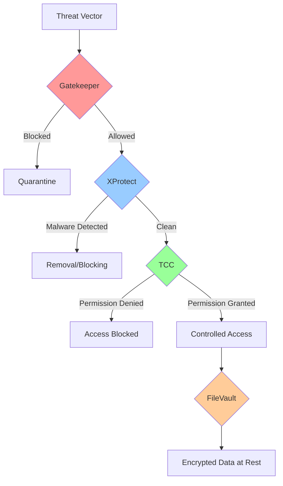

# macOS Security Architecture Deep Dive: Mastering Gatekeeper, XProtect, TCC, and FileVault

## Table of Contents

## Introduction: The Multi-Layered macOS Security Model

macOS employs a sophisticated, multi-layered security architecture that has evolved over two decades. Unlike traditional antivirus-dependent systems, macOS integrates security at every level—from hardware to applications. This comprehensive guide explores the four pillars of macOS security: **Gatekeeper**, **XProtect**, **TCC (Transparency, Consent, and Control)**, and **FileVault**, providing practical implementation strategies and defensive techniques.

## The Security Kill Chain: How macOS Stops Threats



## Part 1: Gatekeeper - The First Line of Defense

### Understanding Gatekeeper's Architecture

Gatekeeper is macOS's application firewall, designed to ensure only trusted software runs on your Mac. It operates through three key mechanisms:

1. **Code Signing Verification**
2. **Notarization Checking**
3. **Quarantine Attribute Management**

### Gatekeeper Implementation Details

```swift
// Swift implementation to check Gatekeeper status and manage app verification

import Foundation
import Security

class GatekeeperManager {
    
    // MARK: - Check Gatekeeper Status
    static func getGatekeeperStatus() -> GatekeeperLevel {
        let process = Process()
        process.launchPath = "/usr/bin/spctl"
        process.arguments = ["--status"]
        
        let pipe = Pipe()
        process.standardOutput = pipe
        process.launch()
        process.waitUntilExit()
        
        let data = pipe.fileHandleForReading.readDataToEndOfFile()
        let output = String(data: data, encoding: .utf8) ?? ""
        
        if output.contains("assessments enabled") {
            return .enabled
        } else {
            return .disabled
        }
    }
    
    // MARK: - Verify Application Signature
    static func verifyAppSignature(at path: String) -> SignatureVerification {
        let url = URL(fileURLWithPath: path)
        
        var staticCode: SecStaticCode?
        let createResult = SecStaticCodeCreateWithPath(
            url as CFURL,
            SecCSFlags(rawValue: 0),
            &staticCode
        )
        
        guard createResult == errSecSuccess,
              let code = staticCode else {
            return SignatureVerification(
                isValid: false,
                error: "Failed to create static code object"
            )
        }
        
        // Check basic validity
        let basicCheckResult = SecStaticCodeCheckValidity(
            code,
            SecCSFlags(rawValue: kSecCSBasicValidateOnly),
            nil
        )
        
        // Check for notarization
        let notarizationCheckResult = SecStaticCodeCheckValidity(
            code,
            SecCSFlags(rawValue: kSecCSBasicValidateOnly | kSecCSCheckNestedCode),
            nil
        )
        
        // Get signing information
        var signingInfo: CFDictionary?
        let infoResult = SecCodeCopySigningInformation(
            code,
            SecCSFlags(rawValue: kSecCSSigningInformation),
            &signingInfo
        )
        
        var details = SignatureDetails()
        
        if infoResult == errSecSuccess,
           let info = signingInfo as? [String: Any] {
            
            // Extract certificate chain
            if let certificates = info[kSecCodeInfoCertificates as String] as? [SecCertificate] {
                details.certificateChain = certificates.map { cert in
                    var commonName: CFString?
                    SecCertificateCopyCommonName(cert, &commonName)
                    return (commonName as String?) ?? "Unknown"
                }
            }
            
            // Extract team identifier
            details.teamIdentifier = info[kSecCodeInfoTeamIdentifier as String] as? String
            
            // Check if app is from App Store
            details.isAppStore = info[kSecCodeInfoPList as String] != nil
            
            // Check entitlements
            if let entitlements = info[kSecCodeInfoEntitlements as String] as? [String: Any] {
                details.entitlements = entitlements
                
                // Check for hardened runtime
                details.hasHardenedRuntime = entitlements["com.apple.security.cs.allow-jit"] != nil
            }
        }
        
        return SignatureVerification(
            isValid: basicCheckResult == errSecSuccess,
            isNotarized: notarizationCheckResult == errSecSuccess,
            details: details
        )
    }
    
    // MARK: - Manage Quarantine Attributes
    static func checkQuarantineStatus(for path: String) -> QuarantineInfo? {
        let url = URL(fileURLWithPath: path)
        
        do {
            let resourceValues = try url.resourceValues(forKeys: [
                .quarantinePropertiesKey
            ])
            
            if let quarantineProperties = resourceValues.quarantineProperties {
                return QuarantineInfo(
                    agentName: quarantineProperties[kLSQuarantineAgentNameKey as String] as? String,
                    agentBundleIdentifier: quarantineProperties[kLSQuarantineAgentBundleIdentifierKey as String] as? String,
                    timeStamp: quarantineProperties[kLSQuarantineTimeStampKey as String] as? Date,
                    dataURL: quarantineProperties[kLSQuarantineDataURLKey as String] as? String,
                    type: quarantineProperties[kLSQuarantineTypeKey as String] as? String
                )
            }
        } catch {
            print("Error checking quarantine: \(error)")
        }
        
        return nil
    }
    
    static func removeQuarantine(from path: String) throws {
        let process = Process()
        process.launchPath = "/usr/bin/xattr"
        process.arguments = ["-d", "com.apple.quarantine", path]
        
        process.launch()
        process.waitUntilExit()
        
        if process.terminationStatus != 0 {
            throw GatekeeperError.quarantineRemovalFailed
        }
    }
    
    // MARK: - Advanced Gatekeeper Bypass Detection
    static func detectBypassAttempts() -> [BypassIndicator] {
        var indicators: [BypassIndicator] = []
        
        // Check for disabled Gatekeeper
        if getGatekeeperStatus() == .disabled {
            indicators.append(BypassIndicator(
                type: .gatekeeperDisabled,
                severity: .critical,
                description: "Gatekeeper is disabled system-wide"
            ))
        }
        
        // Check for Developer Tools that bypass Gatekeeper
        let developerToolPaths = [
            "/usr/bin/gcc",
            "/usr/bin/clang",
            "/usr/bin/python",
            "/usr/bin/ruby",
            "/usr/bin/perl"
        ]
        
        for toolPath in developerToolPaths {
            if FileManager.default.fileExists(atPath: toolPath) {
                // Check if tool has been modified
                if let attributes = try? FileManager.default.attributesOfItem(atPath: toolPath),
                   let modDate = attributes[.modificationDate] as? Date {
                    
                    // Check if modified recently (potential bypass attempt)
                    if Date().timeIntervalSince(modDate) < 86400 { // 24 hours
                        indicators.append(BypassIndicator(
                            type: .modifiedDeveloperTool,
                            severity: .medium,
                            description: "Developer tool recently modified: \(toolPath)"
                        ))
                    }
                }
            }
        }
        
        // Check for suspicious launch agents/daemons
        let launchPaths = [
            "/Library/LaunchAgents",
            "/Library/LaunchDaemons",
            "~/Library/LaunchAgents"
        ]
        
        for launchPath in launchPaths {
            let expandedPath = NSString(string: launchPath).expandingTildeInPath
            
            if let contents = try? FileManager.default.contentsOfDirectory(atPath: expandedPath) {
                for file in contents {
                    let fullPath = "\(expandedPath)/\(file)"
                    
                    // Check if plist is properly signed
                    let verification = verifyAppSignature(at: fullPath)
                    if !verification.isValid {
                        indicators.append(BypassIndicator(
                            type: .unsignedLaunchItem,
                            severity: .high,
                            description: "Unsigned launch item: \(file)"
                        ))
                    }
                }
            }
        }
        
        return indicators
    }
}

// MARK: - Supporting Types
enum GatekeeperLevel {
    case enabled
    case disabled
    case partial
}

struct SignatureVerification {
    let isValid: Bool
    let isNotarized: Bool
    var details: SignatureDetails?
    var error: String?
}

struct SignatureDetails {
    var certificateChain: [String] = []
    var teamIdentifier: String?
    var isAppStore: Bool = false
    var entitlements: [String: Any] = [:]
    var hasHardenedRuntime: Bool = false
}

struct QuarantineInfo {
    let agentName: String?
    let agentBundleIdentifier: String?
    let timeStamp: Date?
    let dataURL: String?
    let type: String?
}

struct BypassIndicator {
    enum IndicatorType {
        case gatekeeperDisabled
        case modifiedDeveloperTool
        case unsignedLaunchItem
        case suspiciousDownload
    }
    
    enum Severity {
        case low, medium, high, critical
    }
    
    let type: IndicatorType
    let severity: Severity
    let description: String
}

enum GatekeeperError: Error {
    case quarantineRemovalFailed
    case verificationFailed
}
```

### Gatekeeper Bypass Techniques and Mitigations

```bash
#!/bin/bash
# Advanced Gatekeeper monitoring and hardening script

echo "=== Gatekeeper Security Audit ==="
echo "Date: $(date)"
echo ""

# Function to check Gatekeeper status
check_gatekeeper_status() {
    echo "Checking Gatekeeper status..."
    
    STATUS=$(spctl --status 2>&1)
    if [[ "$STATUS" == *"assessments enabled"* ]]; then
        echo "✅ Gatekeeper is enabled"
    else
        echo "❌ WARNING: Gatekeeper is disabled!"
        echo "   Enable with: sudo spctl --master-enable"
    fi
    
    # Check Gatekeeper settings
    echo -e "\nGatekeeper settings:"
    spctl --status --verbose
}

# Function to audit unsigned applications
audit_unsigned_apps() {
    echo -e "\nScanning for unsigned applications..."
    
    # Common application directories
    APP_DIRS=(
        "/Applications"
        "/Applications/Utilities"
        "$HOME/Applications"
        "/usr/local/bin"
    )
    
    UNSIGNED_COUNT=0
    
    for DIR in "${APP_DIRS[@]}"; do
        if [ -d "$DIR" ]; then
            echo "  Checking $DIR..."
            
            # Find all .app bundles and binaries
            find "$DIR" -maxdepth 2 \( -name "*.app" -o -type f -perm +111 \) 2>/dev/null | while read -r APP; do
                # Check code signature
                if ! codesign -dv "$APP" &>/dev/null; then
                    echo "    ⚠️  Unsigned: $(basename "$APP")"
                    ((UNSIGNED_COUNT++))
                fi
            done
        fi
    done
    
    if [ $UNSIGNED_COUNT -eq 0 ]; then
        echo "  ✅ No unsigned applications found"
    else
        echo "  ⚠️  Found $UNSIGNED_COUNT unsigned applications"
    fi
}

# Function to check for Gatekeeper bypasses
check_bypass_techniques() {
    echo -e "\nChecking for known bypass techniques..."
    
    # Check for right-click open bypass attempts
    echo "  Checking for quarantine bypass attempts..."
    
    # Look for recently modified files without quarantine
    RECENT_FILES=$(find ~/Downloads -type f -mtime -1 2>/dev/null)
    
    for FILE in $RECENT_FILES; do
        if ! xattr -p com.apple.quarantine "$FILE" &>/dev/null; then
            echo "    ⚠️  File without quarantine: $(basename "$FILE")"
        fi
    done
    
    # Check for curl/wget downloads (bypass quarantine)
    echo "  Checking shell history for direct downloads..."
    
    HISTORY_FILES=(
        "$HOME/.bash_history"
        "$HOME/.zsh_history"
    )
    
    for HIST_FILE in "${HISTORY_FILES[@]}"; do
        if [ -f "$HIST_FILE" ]; then
            if grep -q -E "(curl|wget).*\.(dmg|pkg|app|zip)" "$HIST_FILE" 2>/dev/null; then
                echo "    ⚠️  Found direct download commands in history"
            fi
        fi
    done
    
    # Check for Developer ID abuse
    echo "  Checking for Developer ID certificates..."
    security find-identity -p codesigning | grep -E "Developer ID" | while read -r LINE; do
        echo "    📝 $LINE"
    done
}

# Function to harden Gatekeeper
harden_gatekeeper() {
    echo -e "\nHardening Gatekeeper settings..."
    
    # Enable Gatekeeper if disabled
    sudo spctl --master-enable
    
    # Reset Gatekeeper database
    echo "  Resetting Gatekeeper database..."
    sudo spctl --reset-default
    
    # Add strict rules
    echo "  Adding strict assessment rules..."
    
    # Require notarization for all apps
    sudo spctl --add --label "Notarized Only" --priority 1 --type execute --requirement "notarized"
    
    # Block specific unsigned paths
    BLOCK_PATHS=(
        "/tmp"
        "/var/tmp"
        "$HOME/Downloads"
    )
    
    for PATH in "${BLOCK_PATHS[@]}"; do
        sudo spctl --add --path "$PATH" --type execute --requirement "never"
    done
    
    echo "✅ Gatekeeper hardening complete"
}

# Main execution
check_gatekeeper_status
audit_unsigned_apps
check_bypass_techniques

echo -e "\n=== Recommendations ==="
echo "1. Keep Gatekeeper enabled at all times"
echo "2. Only install notarized applications"
echo "3. Verify developer certificates before installation"
echo "4. Monitor quarantine attributes on downloaded files"
echo "5. Regular audit unsigned applications"

# Optional: Apply hardening
read -p "Apply Gatekeeper hardening? (y/n): " -n 1 -r
echo
if [[ $REPLY =~ ^[Yy]$ ]]; then
    harden_gatekeeper
fi
```

## Part 2: XProtect - Real-Time Malware Detection

### XProtect Architecture and YARA Rules

```python
#!/usr/bin/env python3
# XProtect analysis and monitoring tool

import plistlib
import hashlib
import os
import re
import subprocess
import json
from datetime import datetime
from pathlib import Path

class XProtectAnalyzer:
    def __init__(self):
        self.xprotect_path = "/System/Library/CoreServices/XProtect.app"
        self.xprotect_bundle_path = f"{self.xprotect_path}/Contents/Resources"
        self.yara_rules_path = f"{self.xprotect_bundle_path}/XProtect.yara"
        self.plist_path = f"{self.xprotect_bundle_path}/XProtect.plist"
        self.remediator_path = "/Library/Apple/System/Library/CoreServices/XProtect.app"
        
    def get_xprotect_version(self):
        """Get current XProtect version and last update time"""
        try:
            # Read version from Info.plist
            info_plist_path = f"{self.xprotect_path}/Contents/Info.plist"
            with open(info_plist_path, 'rb') as f:
                plist = plistlib.load(f)
                
            version = plist.get('CFBundleShortVersionString', 'Unknown')
            
            # Get modification time
            stat = os.stat(self.xprotect_path)
            last_update = datetime.fromtimestamp(stat.st_mtime)
            
            return {
                'version': version,
                'last_update': last_update.isoformat(),
                'bundle_identifier': plist.get('CFBundleIdentifier', 'Unknown')
            }
        except Exception as e:
            return {'error': str(e)}
    
    def parse_yara_rules(self):
        """Parse and analyze XProtect YARA rules"""
        rules = []
        
        try:
            with open(self.yara_rules_path, 'r') as f:
                content = f.read()
            
            # Extract rule definitions
            rule_pattern = r'rule\s+(\w+)\s*{([^}]+)}'
            matches = re.findall(rule_pattern, content, re.DOTALL)
            
            for rule_name, rule_body in matches:
                # Extract metadata
                meta_pattern = r'meta:\s*([^strings:|condition:]+)'
                meta_match = re.search(meta_pattern, rule_body)
                metadata = {}
                
                if meta_match:
                    meta_lines = meta_match.group(1).strip().split('\n')
                    for line in meta_lines:
                        if '=' in line:
                            key, value = line.split('=', 1)
                            metadata[key.strip()] = value.strip().strip('"')
                
                # Extract strings
                strings_pattern = r'strings:\s*([^condition:]+)'
                strings_match = re.search(strings_pattern, rule_body)
                strings = []
                
                if strings_match:
                    string_lines = strings_match.group(1).strip().split('\n')
                    for line in string_lines:
                        if '=' in line:
                            strings.append(line.strip())
                
                # Extract condition
                condition_pattern = r'condition:\s*(.+)'
                condition_match = re.search(condition_pattern, rule_body)
                condition = condition_match.group(1).strip() if condition_match else ""
                
                rules.append({
                    'name': rule_name,
                    'metadata': metadata,
                    'strings_count': len(strings),
                    'condition': condition,
                    'category': self.categorize_rule(rule_name, metadata)
                })
                
        except Exception as e:
            print(f"Error parsing YARA rules: {e}")
        
        return rules
    
    def categorize_rule(self, rule_name, metadata):
        """Categorize malware based on rule name and metadata"""
        categories = {
            'adware': ['adware', 'ad', 'pup'],
            'trojan': ['trojan', 'backdoor', 'rat'],
            'ransomware': ['ransom', 'encrypt', 'lock'],
            'miner': ['miner', 'coin', 'crypto'],
            'spyware': ['spy', 'keylog', 'stealer'],
            'rootkit': ['rootkit', 'kernel', 'hide']
        }
        
        rule_lower = rule_name.lower()
        description = metadata.get('description', '').lower()
        
        for category, keywords in categories.items():
            for keyword in keywords:
                if keyword in rule_lower or keyword in description:
                    return category
        
        return 'generic'
    
    def scan_file(self, file_path):
        """Scan a file using XProtect engine"""
        try:
            # Use codesign to check for malware
            result = subprocess.run(
                ['codesign', '--verify', '--deep', '--strict', file_path],
                capture_output=True,
                text=True
            )
            
            if result.returncode != 0:
                return {
                    'file': file_path,
                    'status': 'suspicious',
                    'details': result.stderr
                }
            
            # Check with spctl for Gatekeeper assessment
            spctl_result = subprocess.run(
                ['spctl', '-a', '-t', 'execute', file_path],
                capture_output=True,
                text=True
            )
            
            if spctl_result.returncode != 0:
                return {
                    'file': file_path,
                    'status': 'blocked',
                    'details': spctl_result.stderr
                }
            
            return {
                'file': file_path,
                'status': 'clean',
                'details': 'File passed XProtect checks'
            }
            
        except Exception as e:
            return {
                'file': file_path,
                'status': 'error',
                'details': str(e)
            }
    
    def get_malware_definitions(self):
        """Extract malware definitions from XProtect plist"""
        definitions = []
        
        try:
            with open(self.plist_path, 'rb') as f:
                plist = plistlib.load(f)
            
            for key, value in plist.items():
                if isinstance(value, dict):
                    definition = {
                        'identifier': key,
                        'matches': []
                    }
                    
                    # Extract matching criteria
                    if 'Matches' in value:
                        for match in value['Matches']:
                            match_info = {
                                'type': match.get('MatchType', 'unknown'),
                                'identity': match.get('Identity', ''),
                                'file_path': match.get('MatchFile', {}).get('Path', ''),
                                'sha1': match.get('MatchFile', {}).get('SHA1', '')
                            }
                            definition['matches'].append(match_info)
                    
                    definitions.append(definition)
                    
        except Exception as e:
            print(f"Error reading malware definitions: {e}")
        
        return definitions
    
    def monitor_xprotect_updates(self):
        """Monitor XProtect update activity"""
        try:
            # Check software update history
            result = subprocess.run(
                ['softwareupdate', '--history'],
                capture_output=True,
                text=True
            )
            
            updates = []
            for line in result.stdout.split('\n'):
                if 'XProtect' in line or 'MRT' in line:
                    updates.append(line.strip())
            
            return updates
            
        except Exception as e:
            return [f"Error monitoring updates: {e}"]
    
    def get_remediator_scripts(self):
        """List XProtect Remediator scripts"""
        scripts = []
        remediator_bundle = "/Library/Apple/System/Library/CoreServices/MRT.app"
        
        if os.path.exists(remediator_bundle):
            scripts_dir = f"{remediator_bundle}/Contents/Resources"
            
            for item in os.listdir(scripts_dir):
                if item.endswith('.bundle'):
                    script_path = os.path.join(scripts_dir, item)
                    scripts.append({
                        'name': item,
                        'path': script_path,
                        'size': os.path.getsize(script_path),
                        'modified': datetime.fromtimestamp(
                            os.path.getmtime(script_path)
                        ).isoformat()
                    })
        
        return scripts
    
    def generate_report(self):
        """Generate comprehensive XProtect security report"""
        report = {
            'timestamp': datetime.now().isoformat(),
            'xprotect_version': self.get_xprotect_version(),
            'yara_rules_count': len(self.parse_yara_rules()),
            'yara_rules_categories': self.analyze_rule_categories(),
            'malware_definitions_count': len(self.get_malware_definitions()),
            'remediator_scripts': len(self.get_remediator_scripts()),
            'recent_updates': self.monitor_xprotect_updates()[-5:],
            'recommendations': self.generate_recommendations()
        }
        
        return report
    
    def analyze_rule_categories(self):
        """Analyze distribution of YARA rule categories"""
        rules = self.parse_yara_rules()
        categories = {}
        
        for rule in rules:
            category = rule['category']
            categories[category] = categories.get(category, 0) + 1
        
        return categories
    
    def generate_recommendations(self):
        """Generate security recommendations based on analysis"""
        recommendations = []
        
        # Check version age
        version_info = self.get_xprotect_version()
        if 'last_update' in version_info:
            last_update = datetime.fromisoformat(version_info['last_update'])
            days_old = (datetime.now() - last_update).days
            
            if days_old > 7:
                recommendations.append(
                    f"XProtect hasn't been updated in {days_old} days. Check for updates."
                )
        
        # Check rule coverage
        categories = self.analyze_rule_categories()
        if 'ransomware' not in categories or categories.get('ransomware', 0) < 5:
            recommendations.append(
                "Limited ransomware detection rules. Consider additional protection."
            )
        
        # Check remediator presence
        if not self.get_remediator_scripts():
            recommendations.append(
                "XProtect Remediator not found. Reinstall macOS security updates."
            )
        
        if not recommendations:
            recommendations.append("XProtect configuration appears optimal.")
        
        return recommendations

# Usage
if __name__ == "__main__":
    analyzer = XProtectAnalyzer()
    
    print("=== XProtect Security Analysis ===\n")
    
    # Generate and display report
    report = analyzer.generate_report()
    
    print(f"XProtect Version: {report['xprotect_version'].get('version', 'Unknown')}")
    print(f"Last Updated: {report['xprotect_version'].get('last_update', 'Unknown')}")
    print(f"\nYARA Rules: {report['yara_rules_count']}")
    print(f"Malware Definitions: {report['malware_definitions_count']}")
    print(f"Remediator Scripts: {report['remediator_scripts']}")
    
    print("\nRule Categories:")
    for category, count in report['yara_rules_categories'].items():
        print(f"  - {category}: {count}")
    
    print("\nRecent Updates:")
    for update in report['recent_updates']:
        print(f"  - {update}")
    
    print("\nRecommendations:")
    for rec in report['recommendations']:
        print(f"  ⚠️  {rec}")
    
    # Optional: Scan specific file
    if len(os.sys.argv) > 1:
        file_to_scan = os.sys.argv[1]
        print(f"\nScanning file: {file_to_scan}")
        scan_result = analyzer.scan_file(file_to_scan)
        print(f"  Status: {scan_result['status']}")
        print(f"  Details: {scan_result['details']}")
```

## Part 3: TCC (Transparency, Consent, and Control)

### TCC Database Management and Monitoring

```swift
// Advanced TCC management and monitoring implementation

import Foundation
import SQLite3

class TCCManager {
    
    private let tccDatabasePath = "/Library/Application Support/com.apple.TCC/TCC.db"
    private let userTCCPath = "\(NSHomeDirectory())/Library/Application Support/com.apple.TCC/TCC.db"
    
    // MARK: - TCC Service Types
    enum TCCService: String, CaseIterable {
        case calendar = "kTCCServiceCalendar"
        case camera = "kTCCServiceCamera"
        case microphone = "kTCCServiceMicrophone"
        case photos = "kTCCServicePhotos"
        case reminders = "kTCCServiceReminders"
        case contacts = "kTCCServiceContactsFull"
        case location = "kTCCServiceLocation"
        case screenCapture = "kTCCServiceScreenCapture"
        case automation = "kTCCServiceAppleEvents"
        case accessibility = "kTCCServiceAccessibility"
        case fullDiskAccess = "kTCCServiceSystemPolicyAllFiles"
        case filesAndFolders = "kTCCServiceSystemPolicyDocumentsFolder"
        case developerTools = "kTCCServiceDeveloperTools"
        
        var displayName: String {
            switch self {
            case .calendar: return "Calendar"
            case .camera: return "Camera"
            case .microphone: return "Microphone"
            case .photos: return "Photos"
            case .reminders: return "Reminders"
            case .contacts: return "Contacts"
            case .location: return "Location Services"
            case .screenCapture: return "Screen Recording"
            case .automation: return "Automation"
            case .accessibility: return "Accessibility"
            case .fullDiskAccess: return "Full Disk Access"
            case .filesAndFolders: return "Files and Folders"
            case .developerTools: return "Developer Tools"
            }
        }
        
        var riskLevel: RiskLevel {
            switch self {
            case .fullDiskAccess, .accessibility, .screenCapture:
                return .critical
            case .camera, .microphone, .automation:
                return .high
            case .location, .contacts, .photos:
                return .medium
            case .calendar, .reminders, .filesAndFolders, .developerTools:
                return .low
            }
        }
    }
    
    enum RiskLevel {
        case low, medium, high, critical
        
        var color: String {
            switch self {
            case .low: return "🟢"
            case .medium: return "🟡"
            case .high: return "🟠"
            case .critical: return "🔴"
            }
        }
    }
    
    // MARK: - Query TCC Permissions
    func queryTCCPermissions() -> [TCCPermission] {
        var permissions: [TCCPermission] = []
        
        // Connect to TCC database (requires root or Full Disk Access)
        var db: OpaquePointer?
        
        let dbPath = FileManager.default.fileExists(atPath: userTCCPath) ? userTCCPath : tccDatabasePath
        
        guard sqlite3_open_v2(dbPath, &db, SQLITE_OPEN_READONLY, nil) == SQLITE_OK else {
            print("Unable to open TCC database")
            return permissions
        }
        
        defer { sqlite3_close(db) }
        
        let query = """
            SELECT service, client, client_type, auth_value, auth_reason, 
                   auth_version, indirect_object_identifier, last_modified
            FROM access
            WHERE auth_value > 0
            ORDER BY service, client
        """
        
        var statement: OpaquePointer?
        
        guard sqlite3_prepare_v2(db, query, -1, &statement, nil) == SQLITE_OK else {
            print("Failed to prepare query")
            return permissions
        }
        
        defer { sqlite3_finalize(statement) }
        
        while sqlite3_step(statement) == SQLITE_ROW {
            let service = String(cString: sqlite3_column_text(statement, 0))
            let client = String(cString: sqlite3_column_text(statement, 1))
            let clientType = sqlite3_column_int(statement, 2)
            let authValue = sqlite3_column_int(statement, 3)
            let authReason = sqlite3_column_int(statement, 4)
            let lastModified = sqlite3_column_double(statement, 7)
            
            let permission = TCCPermission(
                service: service,
                client: client,
                clientType: ClientType(rawValue: Int(clientType)) ?? .bundle,
                authorized: authValue > 0,
                authReason: AuthReason(rawValue: Int(authReason)) ?? .userSet,
                lastModified: Date(timeIntervalSince1970: lastModified)
            )
            
            permissions.append(permission)
        }
        
        return permissions
    }
    
    // MARK: - Audit TCC Permissions
    func auditPermissions() -> TCCAuditReport {
        let permissions = queryTCCPermissions()
        var report = TCCAuditReport()
        
        // Analyze permissions by service
        for service in TCCService.allCases {
            let servicePermissions = permissions.filter { $0.service == service.rawValue }
            
            if !servicePermissions.isEmpty {
                let analysis = analyzeServicePermissions(
                    service: service,
                    permissions: servicePermissions
                )
                report.serviceAnalysis[service] = analysis
            }
        }
        
        // Find suspicious permissions
        report.suspiciousPermissions = findSuspiciousPermissions(permissions)
        
        // Generate risk score
        report.overallRiskScore = calculateRiskScore(permissions)
        
        // Generate recommendations
        report.recommendations = generateRecommendations(report)
        
        return report
    }
    
    private func analyzeServicePermissions(
        service: TCCService,
        permissions: [TCCPermission]
    ) -> ServiceAnalysis {
        var analysis = ServiceAnalysis(service: service)
        
        analysis.totalApps = permissions.count
        analysis.riskLevel = service.riskLevel
        
        // Check for suspicious patterns
        for permission in permissions {
            // Check for CLI tools with sensitive permissions
            if permission.clientType == .absolutePath &&
               service.riskLevel == .critical {
                analysis.suspiciousApps.append(permission.client)
            }
            
            // Check for recently added permissions
            let daysSinceAdded = Date().timeIntervalSince(permission.lastModified) / 86400
            if daysSinceAdded < 1 {
                analysis.recentlyAdded.append(permission.client)
            }
            
            // Check for unknown or unsigned apps
            if !isKnownApp(permission.client) && !isSigned(permission.client) {
                analysis.unknownApps.append(permission.client)
            }
        }
        
        return analysis
    }
    
    private func findSuspiciousPermissions(_ permissions: [TCCPermission]) -> [SuspiciousPermission] {
        var suspicious: [SuspiciousPermission] = []
        
        for permission in permissions {
            var reasons: [String] = []
            
            // Check for absolute paths (potential malware)
            if permission.clientType == .absolutePath {
                reasons.append("Absolute path client (not an app bundle)")
            }
            
            // Check for sensitive service access
            if let service = TCCService(rawValue: permission.service),
               service.riskLevel == .critical {
                reasons.append("Access to critical service: \(service.displayName)")
            }
            
            // Check for system paths
            if permission.client.hasPrefix("/usr/") ||
               permission.client.hasPrefix("/System/") {
                reasons.append("System path modification")
            }
            
            // Check for hidden files
            if permission.client.contains("/.") {
                reasons.append("Hidden file or directory")
            }
            
            if !reasons.isEmpty {
                suspicious.append(SuspiciousPermission(
                    permission: permission,
                    reasons: reasons
                ))
            }
        }
        
        return suspicious
    }
    
    private func calculateRiskScore(_ permissions: [TCCPermission]) -> Int {
        var score = 0
        
        for permission in permissions {
            if let service = TCCService(rawValue: permission.service) {
                switch service.riskLevel {
                case .critical:
                    score += 10
                case .high:
                    score += 5
                case .medium:
                    score += 2
                case .low:
                    score += 1
                }
            }
            
            // Additional risk factors
            if permission.clientType == .absolutePath {
                score += 3
            }
            
            if permission.authReason == .systemSet {
                score += 2
            }
        }
        
        return min(score, 100) // Cap at 100
    }
    
    private func generateRecommendations(_ report: TCCAuditReport) -> [String] {
        var recommendations: [String] = []
        
        // High risk score
        if report.overallRiskScore > 70 {
            recommendations.append("⚠️ High risk score detected. Review and revoke unnecessary permissions.")
        }
        
        // Critical service access
        for (service, analysis) in report.serviceAnalysis {
            if service.riskLevel == .critical && analysis.totalApps > 3 {
                recommendations.append("🔴 Multiple apps have \(service.displayName) access. Review necessity.")
            }
        }
        
        // Suspicious permissions
        if !report.suspiciousPermissions.isEmpty {
            recommendations.append("🚨 Suspicious permissions detected. Investigate listed applications.")
        }
        
        // Unknown apps
        let unknownCount = report.serviceAnalysis.values
            .flatMap { $0.unknownApps }
            .count
        
        if unknownCount > 0 {
            recommendations.append("❓ \(unknownCount) unknown applications have TCC permissions.")
        }
        
        if recommendations.isEmpty {
            recommendations.append("✅ TCC permissions appear normal.")
        }
        
        return recommendations
    }
    
    private func isKnownApp(_ client: String) -> Bool {
        // Check against known app bundles
        let knownApps = [
            "com.apple.",
            "com.microsoft.",
            "com.google.",
            "com.adobe.",
            "com.mozilla."
        ]
        
        return knownApps.contains { client.hasPrefix($0) }
    }
    
    private func isSigned(_ client: String) -> Bool {
        // Check if app is properly signed
        let process = Process()
        process.launchPath = "/usr/bin/codesign"
        process.arguments = ["-dv", client]
        
        let pipe = Pipe()
        process.standardError = pipe
        process.launch()
        process.waitUntilExit()
        
        return process.terminationStatus == 0
    }
}

// MARK: - Supporting Types
struct TCCPermission {
    let service: String
    let client: String
    let clientType: ClientType
    let authorized: Bool
    let authReason: AuthReason
    let lastModified: Date
}

enum ClientType: Int {
    case bundle = 0
    case absolutePath = 1
}

enum AuthReason: Int {
    case userSet = 1
    case systemSet = 2
    case servicePolicy = 3
    case mdmPolicy = 4
}

struct TCCAuditReport {
    var serviceAnalysis: [TCCManager.TCCService: ServiceAnalysis] = [:]
    var suspiciousPermissions: [SuspiciousPermission] = []
    var overallRiskScore: Int = 0
    var recommendations: [String] = []
}

struct ServiceAnalysis {
    let service: TCCManager.TCCService
    var totalApps: Int = 0
    var riskLevel: TCCManager.RiskLevel
    var suspiciousApps: [String] = []
    var recentlyAdded: [String] = []
    var unknownApps: [String] = []
    
    init(service: TCCManager.TCCService) {
        self.service = service
        self.riskLevel = service.riskLevel
    }
}

struct SuspiciousPermission {
    let permission: TCCPermission
    let reasons: [String]
}
```

## Part 4: FileVault - Full Disk Encryption

### FileVault Management and Recovery

```bash
#!/bin/bash
# Comprehensive FileVault management and security script

echo "=== FileVault Security Management ==="
echo "Date: $(date)"
echo "Host: $(hostname)"
echo ""

# Function to check FileVault status
check_filevault_status() {
    echo "Checking FileVault status..."
    
    STATUS=$(fdesetup status)
    echo "  $STATUS"
    
    if [[ "$STATUS" == *"FileVault is On"* ]]; then
        echo "  ✅ FileVault is enabled"
        
        # Get encryption progress
        if [[ "$STATUS" == *"Encryption in progress"* ]]; then
            PROGRESS=$(diskutil apfs list | grep "Encryption Progress")
            echo "  ⏳ $PROGRESS"
        fi
        
        # Check recovery key
        echo -e "\n  Recovery Key Status:"
        if sudo fdesetup validaterecovery &>/dev/null; then
            echo "    ✅ Personal recovery key is valid"
        else
            echo "    ❌ Personal recovery key validation failed"
        fi
        
        # List authorized users
        echo -e "\n  Authorized Users:"
        sudo fdesetup list | while read LINE; do
            echo "    - $LINE"
        done
        
    else
        echo "  ❌ FileVault is disabled"
        echo "  ⚠️  Your disk is not encrypted!"
    fi
}

# Function to enable FileVault
enable_filevault() {
    echo -e "\nEnabling FileVault..."
    
    # Check if already enabled
    if fdesetup status | grep -q "FileVault is On"; then
        echo "  FileVault is already enabled"
        return 0
    fi
    
    # Create configuration plist
    cat > /tmp/filevault_config.plist << EOF
<?xml version="1.0" encoding="UTF-8"?>
<!DOCTYPE plist PUBLIC "-//Apple//DTD PLIST 1.0//EN" "http://www.apple.com/DTDs/PropertyList-1.0.dtd">
<plist version="1.0">
<dict>
    <key>Username</key>
    <string>$USER</string>
    <key>Password</key>
    <string>PROMPT</string>
    <key>UseRecoveryKey</key>
    <true/>
</dict>
</plist>
EOF
    
    # Enable FileVault
    echo "  Enabling FileVault (you will be prompted for your password)..."
    RESULT=$(sudo fdesetup enable -inputplist < /tmp/filevault_config.plist)
    
    # Extract and save recovery key
    RECOVERY_KEY=$(echo "$RESULT" | grep -A1 "Recovery key" | tail -1)
    
    if [ -n "$RECOVERY_KEY" ]; then
        echo "  ✅ FileVault enabled successfully"
        echo ""
        echo "  ⚠️  IMPORTANT: Save your recovery key in a secure location:"
        echo "  $RECOVERY_KEY"
        echo ""
        echo "  This key is required if you forget your password!"
        
        # Optionally escrow to MDM or secure storage
        # escrow_recovery_key "$RECOVERY_KEY"
    else
        echo "  ❌ Failed to enable FileVault"
    fi
    
    # Clean up
    rm -f /tmp/filevault_config.plist
}

# Function to rotate recovery key
rotate_recovery_key() {
    echo -e "\nRotating FileVault recovery key..."
    
    if ! fdesetup status | grep -q "FileVault is On"; then
        echo "  ❌ FileVault is not enabled"
        return 1
    fi
    
    # Generate new recovery key
    echo "  Generating new recovery key (authentication required)..."
    RESULT=$(sudo fdesetup changerecovery -personal)
    
    NEW_KEY=$(echo "$RESULT" | grep -A1 "New recovery key" | tail -1)
    
    if [ -n "$NEW_KEY" ]; then
        echo "  ✅ Recovery key rotated successfully"
        echo "  New recovery key: $NEW_KEY"
        echo "  ⚠️  Update your secure storage with this new key"
    else
        echo "  ❌ Failed to rotate recovery key"
    fi
}

# Function to add user to FileVault
add_filevault_user() {
    local USERNAME=$1
    
    if [ -z "$USERNAME" ]; then
        echo "Usage: add_filevault_user <username>"
        return 1
    fi
    
    echo -e "\nAdding user '$USERNAME' to FileVault..."
    
    # Check if user exists
    if ! id "$USERNAME" &>/dev/null; then
        echo "  ❌ User '$USERNAME' does not exist"
        return 1
    fi
    
    # Add user to FileVault
    sudo fdesetup add -usertoadd "$USERNAME"
    
    if [ $? -eq 0 ]; then
        echo "  ✅ User added successfully"
    else
        echo "  ❌ Failed to add user"
    fi
}

# Function to remove user from FileVault
remove_filevault_user() {
    local USERNAME=$1
    
    if [ -z "$USERNAME" ]; then
        echo "Usage: remove_filevault_user <username>"
        return 1
    fi
    
    echo -e "\nRemoving user '$USERNAME' from FileVault..."
    
    sudo fdesetup remove -user "$USERNAME"
    
    if [ $? -eq 0 ]; then
        echo "  ✅ User removed successfully"
    else
        echo "  ❌ Failed to remove user"
    fi
}

# Function to verify disk encryption
verify_encryption() {
    echo -e "\nVerifying disk encryption..."
    
    # List all volumes
    diskutil list | grep "APFS Volume" | while read -r LINE; do
        VOLUME=$(echo "$LINE" | awk '{print $NF}')
        
        # Check encryption status
        INFO=$(diskutil apfs list | grep -A10 "$VOLUME")
        
        if echo "$INFO" | grep -q "FileVault:.*Yes"; then
            echo "  ✅ $VOLUME is encrypted"
        else
            echo "  ❌ $VOLUME is NOT encrypted"
        fi
    done
    
    # Check Core Storage volumes (older Macs)
    if diskutil cs list &>/dev/null; then
        echo -e "\n  Core Storage Volumes:"
        diskutil cs list | grep "Encryption Type" | while read -r LINE; do
            echo "    $LINE"
        done
    fi
}

# Function to backup FileVault recovery key
backup_recovery_key() {
    echo -e "\nBacking up FileVault recovery key..."
    
    # This requires institutional recovery key or MDM
    if [ -f "/Library/Keychains/FileVaultMaster.keychain" ]; then
        echo "  Institutional recovery key found"
        
        # Backup to secure location
        BACKUP_DIR="$HOME/.filevault_backup"
        mkdir -p "$BACKUP_DIR"
        chmod 700 "$BACKUP_DIR"
        
        # Export recovery information
        sudo fdesetup validaterecovery > "$BACKUP_DIR/recovery_validation.txt" 2>&1
        chmod 600 "$BACKUP_DIR/recovery_validation.txt"
        
        echo "  ✅ Recovery information backed up to $BACKUP_DIR"
    else
        echo "  ⚠️  No institutional recovery key found"
        echo "  Personal recovery keys cannot be extracted after creation"
    fi
}

# Function to monitor FileVault performance
monitor_performance() {
    echo -e "\nMonitoring FileVault performance..."
    
    # Check I/O statistics
    echo "  Disk I/O Statistics:"
    iostat -d -c 3 disk0 | tail -n 1
    
    # Check encryption overhead
    echo -e "\n  Encryption Overhead Test:"
    
    # Create test file
    TEST_FILE="/tmp/filevault_test_$$"
    DD_OUTPUT=$(dd if=/dev/urandom of="$TEST_FILE" bs=1m count=100 2>&1)
    WRITE_SPEED=$(echo "$DD_OUTPUT" | grep -oE '[0-9.]+ MB/s' | head -1)
    
    echo "    Write speed: $WRITE_SPEED"
    
    # Read test
    DD_OUTPUT=$(dd if="$TEST_FILE" of=/dev/null bs=1m 2>&1)
    READ_SPEED=$(echo "$DD_OUTPUT" | grep -oE '[0-9.]+ MB/s' | head -1)
    
    echo "    Read speed: $READ_SPEED"
    
    # Clean up
    rm -f "$TEST_FILE"
}

# Main menu
show_menu() {
    echo -e "\n=== FileVault Management Menu ==="
    echo "1. Check FileVault status"
    echo "2. Enable FileVault"
    echo "3. Rotate recovery key"
    echo "4. Add user to FileVault"
    echo "5. Remove user from FileVault"
    echo "6. Verify disk encryption"
    echo "7. Backup recovery information"
    echo "8. Monitor performance"
    echo "9. Exit"
    echo ""
    read -p "Select option: " OPTION
    
    case $OPTION in
        1) check_filevault_status ;;
        2) enable_filevault ;;
        3) rotate_recovery_key ;;
        4) read -p "Enter username: " USERNAME
           add_filevault_user "$USERNAME" ;;
        5) read -p "Enter username: " USERNAME
           remove_filevault_user "$USERNAME" ;;
        6) verify_encryption ;;
        7) backup_recovery_key ;;
        8) monitor_performance ;;
        9) exit 0 ;;
        *) echo "Invalid option" ;;
    esac
}

# Run initial check
check_filevault_status

# Show menu if interactive
if [ -t 0 ]; then
    while true; do
        show_menu
    done
fi
```

## Conclusion: Defense in Depth

macOS security is not about any single feature—it's about the synergistic interaction of multiple layers. Each component serves a specific purpose:

- **Gatekeeper**: Prevents malicious software from running
- **XProtect**: Detects and removes known malware
- **TCC**: Controls access to sensitive data
- **FileVault**: Protects data at rest

Together, they create a comprehensive security architecture that adapts to evolving threats while maintaining usability.

### Key Recommendations

1. **Never disable security features** for convenience
2. **Regular audit** TCC permissions and remove unnecessary access
3. **Keep systems updated** for latest security definitions
4. **Enable FileVault** on all devices containing sensitive data
5. **Monitor security logs** for anomalous behavior
6. **Implement additional controls** for high-risk environments

## Resources

- [Apple Platform Security Guide](https://support.apple.com/guide/security/welcome/web)
- [macOS Security Compliance Project](https://github.com/usnistgov/macos_security)
- [Objective-See Security Tools](https://objective-see.com/products.html)

---

*Last Updated: January 10, 2025*
*Security Level: Enterprise*