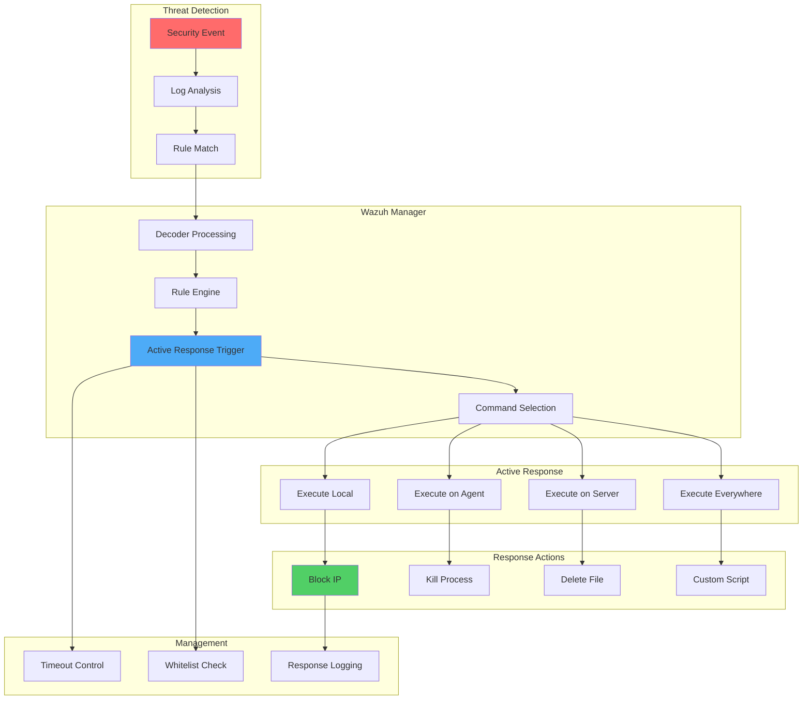

# Blocking Attacks with Active Response in Wazuh

## Introduction

> **Note**: Wazuh v4.2.0 includes breaking changes in Active Response. Check the [official documentation](https://documentation.wazuh.com/current/user-manual/capabilities/active-response/index.html) for the latest updates.

Active Response is one of Wazuh's most powerful features, allowing automatic execution of scripts or commands in response to specific alerts. This capability enables organizations to immediately block attacks, remediate vulnerabilities, and maintain security posture without manual intervention.

Active Response enables:

- 🛡️ **Automatic Attack Blocking**: Stop threats in real-time
- ⚡ **Immediate Remediation**: Execute defensive actions instantly
- 🔧 **Custom Responses**: Create tailored security responses
- 📊 **Reduced Response Time**: Minimize window of exposure
- 🔄 **Automated Security**: Implement self-healing security measures

## Understanding Active Response

### Architecture Overview



### Key Components

1. **Commands**: Define what action to execute
2. **Active Response Configuration**: Specify when and where to execute
3. **Scripts**: Implement the actual response logic
4. **Timeouts**: Automatic reversal of actions
5. **Whitelists**: Prevent blocking critical systems

## Implementation Guide

### Prerequisites

- **Wazuh Manager**: Version 1.1+ installed and running
- **Wazuh Agents**: Deployed on systems to protect
- **Firewall**: iptables, pf, or Windows Firewall
- **Permissions**: Root/Administrator access

### Use Case: Blocking SSH Brute Force Attacks

We'll implement active response to automatically block IPs attempting SSH brute force attacks.

#### Step 1: Define the Command

Add to `/var/ossec/etc/ossec.conf` on the Wazuh Manager:

```xml
<ossec_config>
  <command>
    <name>firewall-drop</name>
    <executable>firewall-drop</executable>
    <timeout_allowed>yes</timeout_allowed>
  </command>
</ossec_config>
```

For Wazuh 4.2.0+:

```xml
<ossec_config>
  <command>
    <name>firewall-drop</name>
    <executable>firewall-drop</executable>
    <timeout_allowed>yes</timeout_allowed>
  </command>
</ossec_config>
```

#### Step 2: Configure Active Response

Add to `/var/ossec/etc/ossec.conf`:

```xml
<ossec_config>
  <active-response>
    <command>firewall-drop</command>
    <location>local</location>
    <rules_id>5712</rules_id>
    <timeout>1800</timeout>
  </active-response>
</ossec_config>
```

Configuration explained:
- **command**: References the command defined earlier
- **location**: Where to execute (local, server, defined-agent, all)
- **rules_id**: Trigger on rule 5712 (SSH brute force)
- **timeout**: Block for 1800 seconds (30 minutes)

#### Step 3: Understanding the Firewall Drop Script

The `firewall-drop` script (located at `/var/ossec/active-response/bin/firewall-drop`) handles multiple firewall types:

```bash
#!/bin/sh
# Firewall-drop response script

ACTION=$1
USER=$2
IP=$3
ALERTID=$4
RULEID=$5

LOCAL=$(dirname $0);
cd $LOCAL
cd ../
PWD=$(pwd)

# Lock file
LOCK="${PWD}/fw-drop"
LOCK_PID="${LOCK}/pid"

# Getting alert time
ALERTTIME=$(echo "$ALERTID" | cut -d  "." -f 1)

# Checking for an IP
if [ "x${IP}" = "x" ]; then
    echo "$0: Missing IP"
    exit 1;
fi

# Blocking IP
if [ "x${ACTION}" != "xadd" -a "x${ACTION}" != "xdelete" ]; then
    echo "$0: Invalid action: ${ACTION}"
    exit 1;
fi

# We should block only IPs that are valid
if echo "${IP}" | grep -E "^[0-9]{1,3}\.[0-9]{1,3}\.[0-9]{1,3}\.[0-9]{1,3}$" > /dev/null 2>&1; then
    # Detect firewall type and block
    if which iptables > /dev/null 2>&1; then
        if [ "x${ACTION}" = "xadd" ]; then
            iptables -I INPUT -s ${IP} -j DROP
        else
            iptables -D INPUT -s ${IP} -j DROP
        fi
    elif which firewall-cmd > /dev/null 2>&1; then
        if [ "x${ACTION}" = "xadd" ]; then
            firewall-cmd --direct --add-rule ipv4 filter INPUT 0 -s ${IP} -j DROP
        else
            firewall-cmd --direct --remove-rule ipv4 filter INPUT 0 -s ${IP} -j DROP
        fi
    elif which pf > /dev/null 2>&1; then
        # BSD pf firewall
        if [ "x${ACTION}" = "xadd" ]; then
            echo "block in quick from ${IP} to any" | pfctl -a wazuh -f -
        else
            pfctl -a wazuh -F rules
        fi
    fi
fi

exit 0;
```

#### Step 4: Configure Whitelisting

Prevent blocking critical IPs by adding to `/var/ossec/etc/ossec.conf`:

```xml
<ossec_config>
  <global>
    <white_list>127.0.0.1</white_list>
    <white_list>^localhost.localdomain$</white_list>
    <white_list>10.0.0.0/8</white_list>
    <white_list>192.168.0.0/16</white_list>
    <!-- Add your management IPs -->
    <white_list>203.0.113.10</white_list>
  </global>
</ossec_config>
```

#### Step 5: Restart Wazuh Manager

```bash
systemctl restart wazuh-manager
```

## Testing Active Response

### Simulate SSH Brute Force Attack

From an attacker machine (10.0.0.6), attempt multiple failed SSH logins:

```bash
# Check connectivity before attack
ping 10.0.0.5
# PING 10.0.0.5 (10.0.0.5) 56(84) bytes of data.
# 64 bytes from 10.0.0.5: icmp_seq=1 ttl=64 time=0.602 ms

# Simulate brute force
for i in {1..10}; do
    ssh invalid@10.0.0.5
done
```

### Monitor Alert Generation

Check Wazuh alerts:

```bash
tail -f /var/ossec/logs/alerts/alerts.log
```

Expected output:
```
** Alert 1461258591.68247: mail - syslog,sshd,authentication_failures,pci_dss_11.4,pci_dss_10.2.4,pci_dss_10.2.5,
2016 Apr 21 17:09:51 (LinAgent) 10.0.0.5->/var/log/auth.log
Rule: 5712 (level 10) -> 'SSHD brute force trying to get access to the system.'
Src IP: 10.0.0.6
Apr 21 17:09:49 LinAgent sshd[1336]: Invalid user ec2-user from 10.0.0.6
Apr 21 17:09:46 LinAgent sshd[1334]: Invalid user ec2-user from 10.0.0.6
...
```

### Verify IP Blocking

From the attacker machine:

```bash
# Try to ping after being blocked
ping 10.0.0.5
# PING 10.0.0.5 (10.0.0.5) 56(84) bytes of data.
# ^C
# --- 10.0.0.5 ping statistics ---
# 12 packets transmitted, 0 received, 100% packet loss, time 11000ms
```

## Advanced Active Response Configurations

### 1. Multiple Response Actions

```xml
<ossec_config>
  <!-- Block and notify -->
  <active-response>
    <command>firewall-drop</command>
    <location>local</location>
    <rules_id>5712</rules_id>
    <timeout>3600</timeout>
  </active-response>
  
  <active-response>
    <command>mail-notify</command>
    <location>server</location>
    <rules_id>5712</rules_id>
  </active-response>

  <!-- Kill malicious processes -->
  <active-response>
    <command>kill-process</command>
    <location>local</location>
    <rules_id>100200</rules_id>
  </active-response>
</ossec_config>
```

### 2. Repeated Offenders

Configure increasing block times for repeat offenders:

```xml
<ossec_config>
  <active-response>
    <command>firewall-drop</command>
    <location>local</location>
    <rules_id>5712</rules_id>
    <timeout>1800</timeout>
    <repeated_offenders>3600,7200,86400</repeated_offenders>
  </active-response>
</ossec_config>
```

- First offense: 30 minutes (1800 seconds)
- Second offense: 1 hour (3600 seconds)
- Third offense: 2 hours (7200 seconds)
- Fourth+ offense: 24 hours (86400 seconds)

### 3. Custom Response Scripts

#### Example: Quarantine Infected Files

Create `/var/ossec/active-response/bin/file-quarantine`:

```bash
#!/bin/bash
# file-quarantine - Move malicious files to quarantine

ACTION=$1
USER=$2
IP=$3
ALERTID=$4
RULEID=$5
FILENAME=$6

QUARANTINE_DIR="/var/ossec/quarantine"
LOG_FILE="/var/ossec/logs/active-responses.log"

# Create quarantine directory if not exists
mkdir -p "$QUARANTINE_DIR"

# Function to log actions
log_action() {
    echo "$(date): $1" >> "$LOG_FILE"
}

if [ "$ACTION" = "add" ]; then
    if [ -f "$FILENAME" ]; then
        # Generate unique quarantine name
        TIMESTAMP=$(date +%Y%m%d_%H%M%S)
        BASENAME=$(basename "$FILENAME")
        QUARANTINE_FILE="$QUARANTINE_DIR/${TIMESTAMP}_${ALERTID}_${BASENAME}"
        
        # Move file to quarantine
        mv "$FILENAME" "$QUARANTINE_FILE"
        chmod 000 "$QUARANTINE_FILE"
        
        # Create metadata file
        cat > "${QUARANTINE_FILE}.info" << EOF
Original Path: $FILENAME
Alert ID: $ALERTID
Rule ID: $RULEID
Quarantine Time: $(date)
User: $USER
Source IP: $IP
EOF
        
        log_action "Quarantined file: $FILENAME -> $QUARANTINE_FILE"
    else
        log_action "File not found: $FILENAME"
    fi
elif [ "$ACTION" = "delete" ]; then
    # Restore file from quarantine
    QUARANTINE_FILE=$(find "$QUARANTINE_DIR" -name "*_${ALERTID}_*" -type f ! -name "*.info" | head -1)
    
    if [ -n "$QUARANTINE_FILE" ] && [ -f "${QUARANTINE_FILE}.info" ]; then
        ORIGINAL_PATH=$(grep "Original Path:" "${QUARANTINE_FILE}.info" | cut -d: -f2- | xargs)
        
        if [ -n "$ORIGINAL_PATH" ]; then
            mv "$QUARANTINE_FILE" "$ORIGINAL_PATH"
            rm -f "${QUARANTINE_FILE}.info"
            log_action "Restored file: $QUARANTINE_FILE -> $ORIGINAL_PATH"
        fi
    fi
fi

exit 0
```

Configure the command:

```xml
<command>
  <name>file-quarantine</name>
  <executable>file-quarantine</executable>
  <timeout_allowed>yes</timeout_allowed>
</command>

<active-response>
  <command>file-quarantine</command>
  <location>local</location>
  <rules_id>554</rules_id> <!-- File modified -->
</active-response>
```

#### Example: Network Isolation

Create `/var/ossec/active-response/bin/network-isolate`:

```python
#!/usr/bin/env python3
# network-isolate - Isolate compromised hosts

import sys
import subprocess
import json
import logging
from datetime import datetime

# Setup logging
logging.basicConfig(
    filename='/var/ossec/logs/network-isolation.log',
    level=logging.INFO,
    format='%(asctime)s - %(levelname)s - %(message)s'
)

def isolate_host(action, ip):
    """Isolate or restore network access for a host"""
    
    if action == "add":
        # Create isolation rules
        rules = [
            # Block all incoming except from management network
            f"iptables -I INPUT -s {ip} -j DROP",
            f"iptables -I INPUT -s 10.0.1.0/24 -d {ip} -j ACCEPT",
            
            # Block all outgoing except to DNS and management
            f"iptables -I OUTPUT -d {ip} -j DROP",
            f"iptables -I OUTPUT -s {ip} -d 10.0.1.0/24 -j ACCEPT",
            f"iptables -I OUTPUT -s {ip} -p udp --dport 53 -j ACCEPT",
            
            # Log isolation
            f"iptables -I INPUT -s {ip} -j LOG --log-prefix 'ISOLATED:{ip} '",
            f"iptables -I OUTPUT -d {ip} -j LOG --log-prefix 'ISOLATED:{ip} '"
        ]
        
        for rule in rules:
            subprocess.run(rule.split(), capture_output=True)
        
        logging.info(f"Isolated host: {ip}")
        
        # Notify SOC
        notify_soc("Host Isolated", f"Host {ip} has been isolated due to security alert")
        
    elif action == "delete":
        # Remove isolation rules
        rules = [
            f"iptables -D INPUT -s {ip} -j DROP",
            f"iptables -D OUTPUT -d {ip} -j DROP",
            f"iptables -D INPUT -s {ip} -j LOG --log-prefix 'ISOLATED:{ip} '",
            f"iptables -D OUTPUT -d {ip} -j LOG --log-prefix 'ISOLATED:{ip} '"
        ]
        
        for rule in rules:
            try:
                subprocess.run(rule.split(), capture_output=True)
            except:
                pass
        
        logging.info(f"Restored network access for: {ip}")

def notify_soc(subject, message):
    """Send notification to SOC team"""
    
    webhook_url = "https://hooks.slack.com/services/YOUR/WEBHOOK/URL"
    
    payload = {
        "text": subject,
        "attachments": [{
            "color": "danger",
            "fields": [{
                "title": "Alert",
                "value": message,
                "short": False
            }, {
                "title": "Time",
                "value": datetime.now().strftime("%Y-%m-%d %H:%M:%S"),
                "short": True
            }]
        }]
    }
    
    try:
        subprocess.run([
            "curl", "-X", "POST",
            "-H", "Content-Type: application/json",
            "-d", json.dumps(payload),
            webhook_url
        ], capture_output=True)
    except:
        pass

if __name__ == "__main__":
    if len(sys.argv) < 4:
        sys.exit(1)
    
    action = sys.argv[1]
    ip = sys.argv[3]
    
    if action in ["add", "delete"] and ip:
        isolate_host(action, ip)
```

### 4. Monitoring Active Response

#### Enable Active Response Logging

Configure agents to log active response actions. Add to `/var/ossec/etc/shared/agent.conf`:

```xml
<agent_config>
  <localfile>
    <log_format>syslog</log_format>
    <location>/var/ossec/logs/active-responses.log</location>
  </localfile>
</agent_config>
```

Create the log file on each agent:

```bash
touch /var/ossec/logs/active-responses.log
chown ossec:ossec /var/ossec/logs/active-responses.log
```

#### Create Monitoring Rules

Add to `/var/ossec/etc/rules/local_rules.xml`:

```xml
<group name="active_response,">
  <!-- Active response executed -->
  <rule id="100300" level="3">
    <decoded_as>ar_log</decoded_as>
    <status>add</status>
    <description>Active response triggered: $(script) on $(srcip)</description>
    <group>active_response_trigger,</group>
  </rule>

  <!-- Active response timeout -->
  <rule id="100301" level="3">
    <decoded_as>ar_log</decoded_as>
    <status>delete</status>
    <description>Active response timeout: $(script) on $(srcip)</description>
    <group>active_response_timeout,</group>
  </rule>

  <!-- Active response error -->
  <rule id="100302" level="7">
    <decoded_as>ar_log</decoded_as>
    <status>error</status>
    <description>Active response error: $(script)</description>
    <group>active_response_error,</group>
  </rule>

  <!-- Multiple active responses -->
  <rule id="100303" level="9" frequency="10" timeframe="300">
    <if_matched_sid>100300</if_matched_sid>
    <same_source_ip />
    <description>Multiple active responses triggered for same IP</description>
    <group>active_response_multiple,</group>
  </rule>
</group>
```

## Best Practices

### 1. Testing Active Response

Always test active response in a controlled environment:

```bash
#!/bin/bash
# test-active-response.sh - Test active response configuration

# Test command execution
/var/ossec/bin/agent_control -b 192.168.1.100 -f firewall-drop -r 5712

# Check if IP was blocked
iptables -L INPUT -n | grep 192.168.1.100

# Test timeout
sleep 1805  # Wait for timeout + 5 seconds

# Verify IP was unblocked
iptables -L INPUT -n | grep 192.168.1.100
```

### 2. Gradual Implementation

```yaml
Implementation Phases:
  Phase 1 - Monitoring:
    - Deploy active response in alert-only mode
    - Log actions without executing
    - Analyze potential impact
    
  Phase 2 - Limited Deployment:
    - Enable on non-critical systems
    - Short timeout periods (300-600 seconds)
    - Monitor false positives
    
  Phase 3 - Production:
    - Enable on all systems
    - Appropriate timeout periods
    - Implement repeated offenders
    
  Phase 4 - Advanced:
    - Custom response scripts
    - Integration with other tools
    - Automated remediation
```

### 3. Whitelist Management

```python
#!/usr/bin/env python3
# manage-whitelist.py - Manage active response whitelist

import ipaddress
import yaml
import subprocess

class WhitelistManager:
    def __init__(self, config_file='/etc/ossec-whitelist.yaml'):
        self.config_file = config_file
        self.load_whitelist()
    
    def load_whitelist(self):
        """Load whitelist from YAML file"""
        with open(self.config_file, 'r') as f:
            self.whitelist = yaml.safe_load(f)
    
    def add_ip(self, ip, reason, expires=None):
        """Add IP to whitelist"""
        entry = {
            'ip': ip,
            'reason': reason,
            'added': datetime.now().isoformat(),
            'expires': expires
        }
        
        self.whitelist['ips'].append(entry)
        self.save_whitelist()
        self.update_ossec_config()
    
    def remove_expired(self):
        """Remove expired whitelist entries"""
        current_time = datetime.now()
        
        self.whitelist['ips'] = [
            entry for entry in self.whitelist['ips']
            if not entry.get('expires') or 
               datetime.fromisoformat(entry['expires']) > current_time
        ]
        
        self.save_whitelist()
        self.update_ossec_config()
    
    def update_ossec_config(self):
        """Update OSSEC configuration with whitelist"""
        
        # Generate whitelist XML
        whitelist_xml = ""
        for entry in self.whitelist['ips']:
            whitelist_xml += f"    <white_list>{entry['ip']}</white_list>\n"
        
        # Update ossec.conf
        # (Implementation depends on your config management approach)
        
        # Restart OSSEC
        subprocess.run(['systemctl', 'restart', 'wazuh-manager'])

# Example whitelist YAML format:
"""
ips:
  - ip: 10.0.0.10
    reason: Management server
    added: 2023-01-01T00:00:00
    
  - ip: 192.168.1.0/24
    reason: Internal network
    added: 2023-01-01T00:00:00
    
  - ip: 203.0.113.50
    reason: Temporary vendor access
    added: 2023-06-01T00:00:00
    expires: 2023-06-30T00:00:00
"""
```

## Advanced Use Cases

### 1. Ransomware Response

```xml
<!-- Detect and respond to ransomware -->
<rule id="100400" level="15">
  <if_group>syscheck</if_group>
  <match>\.encrypted|\.locked|\.crypto</match>
  <description>Possible ransomware activity detected</description>
</rule>

<command>
  <name>ransomware-response</name>
  <executable>ransomware-response.sh</executable>
  <timeout_allowed>no</timeout_allowed>
</command>

<active-response>
  <command>ransomware-response</command>
  <location>local</location>
  <rules_id>100400</rules_id>
</active-response>
```

Response script:

```bash
#!/bin/bash
# ransomware-response.sh - Emergency ransomware response

ACTION=$1
USER=$2
IP=$3
ALERTID=$4
RULEID=$5

if [ "$ACTION" = "add" ]; then
    # Isolate system
    iptables -I INPUT -j DROP
    iptables -I OUTPUT -j DROP
    
    # Allow only management access
    iptables -I INPUT -s 10.0.1.0/24 -j ACCEPT
    
    # Kill suspicious processes
    pkill -f ".encrypted|.locked|.crypto"
    
    # Disable scheduled tasks
    systemctl stop crond
    
    # Alert administrators
    echo "RANSOMWARE DETECTED on $(hostname)" | \
        mail -s "CRITICAL: Ransomware Alert" security@company.com
    
    # Initiate backup
    /usr/local/bin/emergency-backup.sh &
fi
```

### 2. Web Attack Mitigation

```xml
<!-- Block web application attacks -->
<rule id="100410" level="10" frequency="5" timeframe="60">
  <if_group>web|attack</if_group>
  <same_source_ip />
  <description>Multiple web application attacks from same IP</description>
</rule>

<command>
  <name>nginx-ban</name>
  <executable>nginx-ban.py</executable>
  <timeout_allowed>yes</timeout_allowed>
</command>

<active-response>
  <command>nginx-ban</command>
  <location>local</location>
  <rules_id>100410</rules_id>
  <timeout>3600</timeout>
</active-response>
```

Nginx ban script:

```python
#!/usr/bin/env python3
# nginx-ban.py - Ban IPs in Nginx

import sys
import os
import subprocess

NGINX_BLOCKED_CONF = "/etc/nginx/blocked_ips.conf"
NGINX_RELOAD_CMD = ["nginx", "-s", "reload"]

def add_block(ip):
    """Add IP to Nginx blocked list"""
    
    # Add deny rule
    with open(NGINX_BLOCKED_CONF, 'a') as f:
        f.write(f"deny {ip};\n")
    
    # Reload Nginx
    subprocess.run(NGINX_RELOAD_CMD)

def remove_block(ip):
    """Remove IP from Nginx blocked list"""
    
    # Read current blocks
    with open(NGINX_BLOCKED_CONF, 'r') as f:
        lines = f.readlines()
    
    # Remove the IP
    with open(NGINX_BLOCKED_CONF, 'w') as f:
        for line in lines:
            if f"deny {ip};" not in line:
                f.write(line)
    
    # Reload Nginx
    subprocess.run(NGINX_RELOAD_CMD)

if __name__ == "__main__":
    action = sys.argv[1]
    ip = sys.argv[3]
    
    if action == "add":
        add_block(ip)
    elif action == "delete":
        remove_block(ip)
```

### 3. Automated Vulnerability Remediation

```python
#!/usr/bin/env python3
# vulnerability-patch.py - Automated patching response

import sys
import subprocess
import logging
import json

class VulnerabilityPatcher:
    def __init__(self):
        self.patches = {
            '100500': self.patch_shellshock,
            '100501': self.patch_heartbleed,
            '100502': self.patch_log4j
        }
    
    def patch_shellshock(self):
        """Patch Shellshock vulnerability"""
        commands = [
            ["yum", "update", "-y", "bash"],
            ["apt-get", "update"],
            ["apt-get", "install", "-y", "bash"]
        ]
        
        for cmd in commands:
            try:
                subprocess.run(cmd, check=True)
                return True
            except:
                continue
        
        return False
    
    def patch_log4j(self):
        """Mitigate Log4j vulnerability"""
        
        # Set system property
        with open('/etc/environment', 'a') as f:
            f.write('\nLOG4J_FORMAT_MSG_NO_LOOKUPS=true\n')
        
        # Find and update log4j configurations
        result = subprocess.run(
            ["find", "/", "-name", "log4j*.properties"],
            capture_output=True,
            text=True
        )
        
        for config_file in result.stdout.strip().split('\n'):
            if config_file:
                # Add mitigation to config
                with open(config_file, 'a') as f:
                    f.write('\nlog4j2.formatMsgNoLookups=true\n')
        
        return True
    
    def execute_patch(self, rule_id):
        """Execute patch based on rule ID"""
        
        if rule_id in self.patches:
            logging.info(f"Executing patch for rule {rule_id}")
            
            success = self.patches[rule_id]()
            
            if success:
                logging.info(f"Successfully patched vulnerability {rule_id}")
                self.notify_success(rule_id)
            else:
                logging.error(f"Failed to patch vulnerability {rule_id}")
                self.notify_failure(rule_id)
        else:
            logging.warning(f"No patch available for rule {rule_id}")
    
    def notify_success(self, rule_id):
        """Notify successful patching"""
        message = f"Vulnerability {rule_id} successfully patched on {subprocess.run(['hostname'], capture_output=True, text=True).stdout.strip()}"
        subprocess.run(["mail", "-s", "Patch Success", "security@company.com"], input=message.encode())
    
    def notify_failure(self, rule_id):
        """Notify patching failure"""
        message = f"Failed to patch vulnerability {rule_id} on {subprocess.run(['hostname'], capture_output=True, text=True).stdout.strip()}"
        subprocess.run(["mail", "-s", "Patch Failure - Manual Intervention Required", "security@company.com"], input=message.encode())

if __name__ == "__main__":
    action = sys.argv[1]
    rule_id = sys.argv[5]
    
    if action == "add":
        patcher = VulnerabilityPatcher()
        patcher.execute_patch(rule_id)
```

## Monitoring and Metrics

### Active Response Dashboard

Create visualizations to monitor active response effectiveness:

```python
#!/usr/bin/env python3
# ar-metrics.py - Collect active response metrics

import json
import sqlite3
from datetime import datetime, timedelta
from collections import defaultdict

class ActiveResponseMetrics:
    def __init__(self, db_path='/var/ossec/stats/ar_metrics.db'):
        self.conn = sqlite3.connect(db_path)
        self.create_tables()
    
    def create_tables(self):
        """Create metrics tables"""
        
        self.conn.execute('''
            CREATE TABLE IF NOT EXISTS ar_executions (
                id INTEGER PRIMARY KEY,
                timestamp DATETIME,
                rule_id INTEGER,
                command TEXT,
                source_ip TEXT,
                action TEXT,
                status TEXT,
                error TEXT
            )
        ''')
        
        self.conn.execute('''
            CREATE TABLE IF NOT EXISTS ar_effectiveness (
                date DATE PRIMARY KEY,
                total_blocks INTEGER,
                repeat_offenders INTEGER,
                false_positives INTEGER,
                avg_block_duration REAL
            )
        ''')
    
    def log_execution(self, alert_data):
        """Log active response execution"""
        
        self.conn.execute('''
            INSERT INTO ar_executions 
            (timestamp, rule_id, command, source_ip, action, status)
            VALUES (?, ?, ?, ?, ?, ?)
        ''', (
            datetime.now(),
            alert_data['rule_id'],
            alert_data['command'],
            alert_data['source_ip'],
            alert_data['action'],
            'success'
        ))
        self.conn.commit()
    
    def calculate_effectiveness(self):
        """Calculate active response effectiveness metrics"""
        
        # Get data for last 24 hours
        yesterday = datetime.now() - timedelta(days=1)
        
        cursor = self.conn.execute('''
            SELECT 
                COUNT(*) as total,
                COUNT(DISTINCT source_ip) as unique_ips,
                AVG(CASE 
                    WHEN action = 'delete' THEN 
                        (julianday(timestamp) - julianday(
                            LAG(timestamp) OVER (PARTITION BY source_ip ORDER BY timestamp)
                        )) * 24 * 60
                    ELSE NULL
                END) as avg_block_minutes
            FROM ar_executions
            WHERE timestamp > ?
        ''', (yesterday,))
        
        metrics = cursor.fetchone()
        
        # Count repeat offenders
        cursor = self.conn.execute('''
            SELECT COUNT(*) 
            FROM (
                SELECT source_ip, COUNT(*) as count
                FROM ar_executions
                WHERE timestamp > ? AND action = 'add'
                GROUP BY source_ip
                HAVING count > 1
            )
        ''', (yesterday,))
        
        repeat_offenders = cursor.fetchone()[0]
        
        return {
            'total_blocks': metrics[0],
            'unique_ips': metrics[1],
            'repeat_offenders': repeat_offenders,
            'avg_block_duration': metrics[2] or 0,
            'effectiveness_rate': (metrics[1] - repeat_offenders) / metrics[1] * 100 if metrics[1] > 0 else 0
        }
    
    def generate_report(self):
        """Generate active response report"""
        
        metrics = self.calculate_effectiveness()
        
        report = f"""
Active Response Daily Report
============================
Date: {datetime.now().strftime('%Y-%m-%d')}

Summary Statistics:
- Total Blocks: {metrics['total_blocks']}
- Unique IPs Blocked: {metrics['unique_ips']}
- Repeat Offenders: {metrics['repeat_offenders']}
- Average Block Duration: {metrics['avg_block_duration']:.2f} minutes
- Effectiveness Rate: {metrics['effectiveness_rate']:.2f}%

Top Triggered Rules:
"""
        
        # Get top rules
        cursor = self.conn.execute('''
            SELECT rule_id, COUNT(*) as count
            FROM ar_executions
            WHERE timestamp > ? AND action = 'add'
            GROUP BY rule_id
            ORDER BY count DESC
            LIMIT 10
        ''', (datetime.now() - timedelta(days=1),))
        
        for row in cursor:
            report += f"  - Rule {row[0]}: {row[1]} times\n"
        
        return report

# Generate daily report
if __name__ == "__main__":
    metrics = ActiveResponseMetrics()
    print(metrics.generate_report())
```

## Troubleshooting

### Common Issues and Solutions

#### Issue 1: Active Response Not Triggering

```bash
# Check if active response is enabled
grep -A 10 "<active-response>" /var/ossec/etc/ossec.conf

# Verify rule is triggering
grep "rule:5712" /var/ossec/logs/alerts/alerts.log

# Check active response log
tail -f /var/ossec/logs/active-responses.log

# Test manual execution
/var/ossec/active-response/bin/firewall-drop add - 192.168.1.100 1234567.89 5712
```

#### Issue 2: IPs Not Being Blocked

```bash
# Check if script has execute permissions
ls -la /var/ossec/active-response/bin/firewall-drop

# Verify firewall commands
which iptables
iptables -L INPUT -n

# Check for whitelist
grep -A 10 "white_list" /var/ossec/etc/ossec.conf
```

#### Issue 3: Timeouts Not Working

```bash
# Check timeout queue
ls -la /var/ossec/var/run/

# Monitor timeout execution
tail -f /var/ossec/logs/ossec.log | grep -i timeout

# Verify ar_queue is running
ps aux | grep ar_queue
```

## Security Considerations

### 1. Preventing DoS via Active Response

```python
#!/usr/bin/env python3
# ar-rate-limit.py - Rate limit active response executions

import time
import json
from collections import defaultdict
from datetime import datetime, timedelta

class ActiveResponseRateLimit:
    def __init__(self, max_blocks_per_hour=100, max_per_ip=5):
        self.max_blocks_per_hour = max_blocks_per_hour
        self.max_per_ip = max_per_ip
        self.blocks = defaultdict(list)
        self.total_blocks = []
    
    def should_block(self, ip):
        """Check if IP should be blocked based on rate limits"""
        
        current_time = datetime.now()
        hour_ago = current_time - timedelta(hours=1)
        
        # Clean old entries
        self.total_blocks = [
            t for t in self.total_blocks if t > hour_ago
        ]
        self.blocks[ip] = [
            t for t in self.blocks[ip] if t > hour_ago
        ]
        
        # Check total rate limit
        if len(self.total_blocks) >= self.max_blocks_per_hour:
            return False, "Global rate limit exceeded"
        
        # Check per-IP rate limit
        if len(self.blocks[ip]) >= self.max_per_ip:
            return False, f"Per-IP rate limit exceeded for {ip}"
        
        # Allow block
        self.blocks[ip].append(current_time)
        self.total_blocks.append(current_time)
        
        return True, "OK"
```

### 2. Secure Script Execution

```bash
#!/bin/bash
# secure-ar-wrapper.sh - Secure wrapper for active response scripts

# Validate inputs
validate_ip() {
    local ip=$1
    if [[ ! $ip =~ ^[0-9]{1,3}\.[0-9]{1,3}\.[0-9]{1,3}\.[0-9]{1,3}$ ]]; then
        return 1
    fi
    return 0
}

validate_action() {
    local action=$1
    if [[ "$action" != "add" && "$action" != "delete" ]]; then
        return 1
    fi
    return 0
}

# Sanitize inputs
ACTION=$(echo "$1" | tr -cd '[:alnum:]')
IP=$(echo "$3" | tr -cd '[:digit:].')

# Validate
if ! validate_action "$ACTION"; then
    logger -t wazuh-ar "Invalid action: $1"
    exit 1
fi

if ! validate_ip "$IP"; then
    logger -t wazuh-ar "Invalid IP: $3"
    exit 1
fi

# Execute with restricted environment
env -i PATH=/usr/bin:/bin USER=ossec HOME=/var/ossec \
    /var/ossec/active-response/bin/firewall-drop "$ACTION" "$2" "$IP" "$4" "$5"
```

## Best Practices Summary

1. **Test Thoroughly**: Always test in non-production first
2. **Start Conservative**: Begin with short timeouts and monitoring
3. **Whitelist Critical Systems**: Prevent blocking essential services
4. **Monitor Effectiveness**: Track metrics and adjust configurations
5. **Document Everything**: Maintain clear documentation of all active responses
6. **Regular Reviews**: Periodically review and update rules
7. **Incident Response Integration**: Align with IR procedures
8. **Fail-Safe Mechanisms**: Implement emergency disable procedures

## Conclusion

Active Response transforms Wazuh from a detection system into an active defense platform. By automatically responding to threats, organizations can:

- 🛡️ **Reduce Response Time**: Block attacks within seconds
- ⚡ **Minimize Damage**: Stop threats before they spread
- 🔧 **Automate Security**: Reduce manual intervention needs
- 📊 **Improve Security Posture**: Consistent, rapid response
- 🚨 **24/7 Protection**: Automated response works around the clock

Remember that with great power comes great responsibility - always implement active response carefully with appropriate testing and safeguards.

## Key Takeaways

1. **Start Simple**: Begin with basic firewall blocking
2. **Test Extensively**: Verify behavior before production
3. **Monitor Impact**: Track false positives and effectiveness
4. **Iterate and Improve**: Continuously refine responses
5. **Document Actions**: Maintain audit trails

## Resources

- [Wazuh Active Response Documentation](https://documentation.wazuh.com/current/user-manual/capabilities/active-response/index.html)
- [Wazuh Rules Reference](https://documentation.wazuh.com/current/user-manual/ruleset/index.html)
- [OSSEC Active Response Scripts](https://github.com/ossec/ossec-hids/tree/master/active-response)
- [Security Response Best Practices](https://www.sans.org/white-papers/)

---

*Automate your security response with Wazuh Active Response! 🛡️⚡*