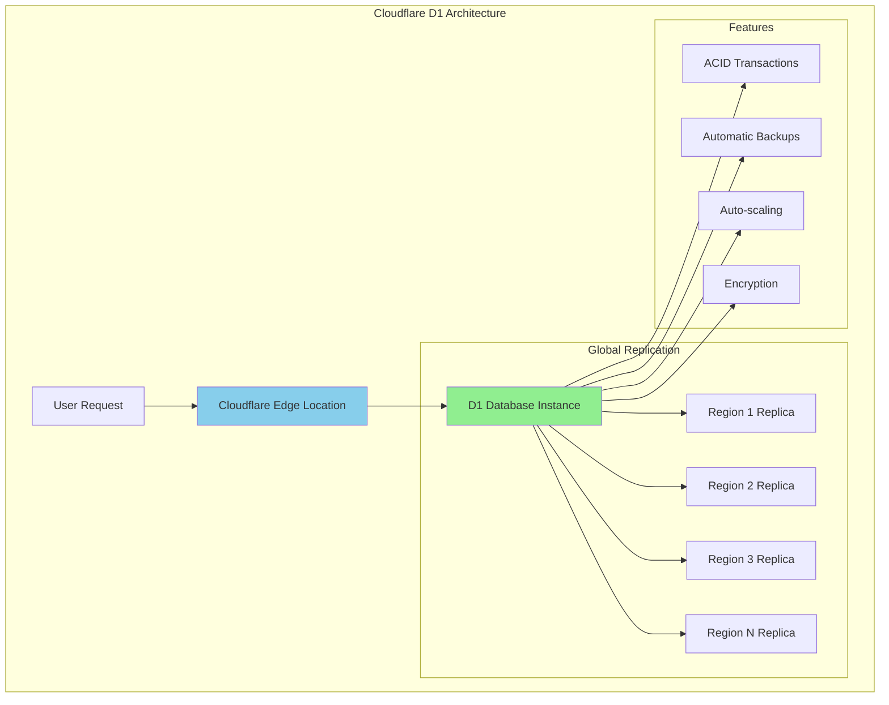

# Cloudflare D1: SQLite at the Edge for Global Applications

## Introduction

Cloudflare D1 is a globally distributed, serverless SQL database built on SQLite. It runs at the edge across **Cloudflare's 330+ locations**, providing ultra-low latency database access with automatic replication and no cold starts.

### Key Advantages

- ⚡ **Sub-10ms Queries**: Data stored close to users globally
- 🌍 **Global Distribution**: Automatic replication across edge locations
- 💰 **Serverless Pricing**: Pay only for what you use
- 🔧 **SQLite Compatible**: Familiar SQL interface and syntax
- 🚀 **Zero Cold Starts**: Always ready, no connection pooling needed
- 📈 **Auto-scaling**: Handles millions of operations seamlessly
- 🔄 **ACID Transactions**: Full transactional support
- 🛡️ **Built-in Security**: Automatic encryption at rest and in transit

### Architecture Overview



## Getting Started with D1

### 1. Create Database

```bash
# Install Wrangler CLI
npm install -g wrangler

# Create new D1 database
wrangler d1 create production-database

# List databases
wrangler d1 list

# Get database info
wrangler d1 info production-database
```

### 2. Configure wrangler.toml

```toml
# wrangler.toml
name = "my-d1-app"
main = "src/index.js"
compatibility_date = "2024-01-01"

[[d1_databases]]
binding = "DB"
database_name = "production-database"
database_id = "your-database-id"
migrations_dir = "migrations"

[env.staging]
[[env.staging.d1_databases]]
binding = "DB"
database_name = "staging-database" 
database_id = "staging-database-id"

[env.production]
[[env.production.d1_databases]]
binding = "DB"
database_name = "production-database"
database_id = "production-database-id"
```

### 3. Database Migrations

```sql
-- migrations/0001_initial_schema.sql
CREATE TABLE IF NOT EXISTS users (
    id INTEGER PRIMARY KEY AUTOINCREMENT,
    email TEXT UNIQUE NOT NULL,
    username TEXT UNIQUE NOT NULL,
    password_hash TEXT NOT NULL,
    first_name TEXT,
    last_name TEXT,
    avatar_url TEXT,
    email_verified BOOLEAN DEFAULT FALSE,
    created_at DATETIME DEFAULT CURRENT_TIMESTAMP,
    updated_at DATETIME DEFAULT CURRENT_TIMESTAMP,
    last_login DATETIME
);

CREATE INDEX idx_users_email ON users(email);
CREATE INDEX idx_users_username ON users(username);
CREATE INDEX idx_users_created_at ON users(created_at);

CREATE TABLE IF NOT EXISTS posts (
    id INTEGER PRIMARY KEY AUTOINCREMENT,
    user_id INTEGER NOT NULL,
    title TEXT NOT NULL,
    slug TEXT UNIQUE NOT NULL,
    content TEXT NOT NULL,
    excerpt TEXT,
    featured_image TEXT,
    status TEXT DEFAULT 'draft' CHECK(status IN ('draft', 'published', 'archived')),
    published_at DATETIME,
    created_at DATETIME DEFAULT CURRENT_TIMESTAMP,
    updated_at DATETIME DEFAULT CURRENT_TIMESTAMP,
    FOREIGN KEY (user_id) REFERENCES users(id) ON DELETE CASCADE
);

CREATE INDEX idx_posts_user_id ON posts(user_id);
CREATE INDEX idx_posts_slug ON posts(slug);
CREATE INDEX idx_posts_status ON posts(status);
CREATE INDEX idx_posts_published_at ON posts(published_at);

CREATE TABLE IF NOT EXISTS categories (
    id INTEGER PRIMARY KEY AUTOINCREMENT,
    name TEXT UNIQUE NOT NULL,
    slug TEXT UNIQUE NOT NULL,
    description TEXT,
    created_at DATETIME DEFAULT CURRENT_TIMESTAMP
);

CREATE TABLE IF NOT EXISTS post_categories (
    post_id INTEGER NOT NULL,
    category_id INTEGER NOT NULL,
    PRIMARY KEY (post_id, category_id),
    FOREIGN KEY (post_id) REFERENCES posts(id) ON DELETE CASCADE,
    FOREIGN KEY (category_id) REFERENCES categories(id) ON DELETE CASCADE
);

CREATE TABLE IF NOT EXISTS comments (
    id INTEGER PRIMARY KEY AUTOINCREMENT,
    post_id INTEGER NOT NULL,
    user_id INTEGER,
    author_name TEXT,
    author_email TEXT,
    content TEXT NOT NULL,
    status TEXT DEFAULT 'pending' CHECK(status IN ('pending', 'approved', 'spam')),
    parent_id INTEGER,
    created_at DATETIME DEFAULT CURRENT_TIMESTAMP,
    FOREIGN KEY (post_id) REFERENCES posts(id) ON DELETE CASCADE,
    FOREIGN KEY (user_id) REFERENCES users(id) ON DELETE SET NULL,
    FOREIGN KEY (parent_id) REFERENCES comments(id) ON DELETE CASCADE
);

CREATE INDEX idx_comments_post_id ON comments(post_id);
CREATE INDEX idx_comments_user_id ON comments(user_id);
CREATE INDEX idx_comments_status ON comments(status);
CREATE INDEX idx_comments_parent_id ON comments(parent_id);

-- Triggers for updated_at timestamps
CREATE TRIGGER users_updated_at 
    AFTER UPDATE ON users
    BEGIN
        UPDATE users SET updated_at = CURRENT_TIMESTAMP WHERE id = NEW.id;
    END;

CREATE TRIGGER posts_updated_at 
    AFTER UPDATE ON posts
    BEGIN
        UPDATE posts SET updated_at = CURRENT_TIMESTAMP WHERE id = NEW.id;
    END;
```

```sql
-- migrations/0002_add_analytics.sql
CREATE TABLE IF NOT EXISTS page_views (
    id INTEGER PRIMARY KEY AUTOINCREMENT,
    post_id INTEGER,
    visitor_id TEXT NOT NULL,
    ip_address TEXT,
    user_agent TEXT,
    referer TEXT,
    country TEXT,
    city TEXT,
    created_at DATETIME DEFAULT CURRENT_TIMESTAMP,
    FOREIGN KEY (post_id) REFERENCES posts(id) ON DELETE CASCADE
);

CREATE INDEX idx_page_views_post_id ON page_views(post_id);
CREATE INDEX idx_page_views_visitor_id ON page_views(visitor_id);
CREATE INDEX idx_page_views_created_at ON page_views(created_at);

CREATE TABLE IF NOT EXISTS analytics_summary (
    id INTEGER PRIMARY KEY AUTOINCREMENT,
    post_id INTEGER,
    date DATE NOT NULL,
    views INTEGER DEFAULT 0,
    unique_visitors INTEGER DEFAULT 0,
    bounce_rate REAL DEFAULT 0,
    avg_time_on_page INTEGER DEFAULT 0,
    FOREIGN KEY (post_id) REFERENCES posts(id) ON DELETE CASCADE
);

CREATE UNIQUE INDEX idx_analytics_summary_post_date ON analytics_summary(post_id, date);
```

```bash
# Apply migrations
wrangler d1 migrations apply production-database

# Apply to specific environment
wrangler d1 migrations apply production-database --env production

# Check migration status
wrangler d1 migrations list production-database
```

## Advanced Database Operations

### Database Service Layer

```javascript
// db/database.js - Comprehensive database service
export class DatabaseService {
  constructor(db) {
    this.db = db;
  }
  
  // User management
  async createUser(userData) {
    const stmt = this.db.prepare(`
      INSERT INTO users (email, username, password_hash, first_name, last_name)
      VALUES (?, ?, ?, ?, ?)
      RETURNING id, email, username, first_name, last_name, created_at
    `);
    
    try {
      const result = await stmt.bind(
        userData.email,
        userData.username,
        userData.password_hash,
        userData.first_name,
        userData.last_name
      ).first();
      
      return { success: true, user: result };
    } catch (error) {
      if (error.message.includes('UNIQUE constraint failed')) {
        return { 
          success: false, 
          error: 'User with this email or username already exists' 
        };
      }
      throw error;
    }
  }
  
  async getUserById(id) {
    const stmt = this.db.prepare(`
      SELECT id, email, username, first_name, last_name, avatar_url,
             email_verified, created_at, last_login
      FROM users WHERE id = ?
    `);
    
    return await stmt.bind(id).first();
  }
  
  async getUserByEmail(email) {
    const stmt = this.db.prepare(`
      SELECT id, email, username, password_hash, first_name, last_name,
             email_verified, created_at
      FROM users WHERE email = ? AND email_verified = TRUE
    `);
    
    return await stmt.bind(email).first();
  }
  
  async updateLastLogin(userId) {
    const stmt = this.db.prepare(`
      UPDATE users SET last_login = CURRENT_TIMESTAMP WHERE id = ?
    `);
    
    return await stmt.bind(userId).run();
  }
  
  // Post management
  async createPost(postData) {
    const stmt = this.db.prepare(`
      INSERT INTO posts (user_id, title, slug, content, excerpt, 
                        featured_image, status, published_at)
      VALUES (?, ?, ?, ?, ?, ?, ?, ?)
      RETURNING *
    `);
    
    const publishedAt = postData.status === 'published' ? 
      new Date().toISOString() : null;
    
    return await stmt.bind(
      postData.user_id,
      postData.title,
      postData.slug,
      postData.content,
      postData.excerpt,
      postData.featured_image,
      postData.status,
      publishedAt
    ).first();
  }
  
  async getPostBySlug(slug) {
    const stmt = this.db.prepare(`
      SELECT p.*, u.username, u.first_name, u.last_name, u.avatar_url
      FROM posts p
      JOIN users u ON p.user_id = u.id
      WHERE p.slug = ? AND p.status = 'published'
    `);
    
    return await stmt.bind(slug).first();
  }
  
  async getPublishedPosts(limit = 10, offset = 0) {
    const stmt = this.db.prepare(`
      SELECT p.id, p.title, p.slug, p.excerpt, p.featured_image,
             p.published_at, p.created_at,
             u.username, u.first_name, u.last_name, u.avatar_url,
             COUNT(c.id) as comment_count
      FROM posts p
      JOIN users u ON p.user_id = u.id
      LEFT JOIN comments c ON p.id = c.post_id AND c.status = 'approved'
      WHERE p.status = 'published'
      GROUP BY p.id
      ORDER BY p.published_at DESC
      LIMIT ? OFFSET ?
    `);
    
    return await stmt.bind(limit, offset).all();
  }
  
  async searchPosts(query, limit = 10) {
    const stmt = this.db.prepare(`
      SELECT p.id, p.title, p.slug, p.excerpt, p.published_at,
             u.username, u.first_name, u.last_name
      FROM posts p
      JOIN users u ON p.user_id = u.id
      WHERE p.status = 'published' 
        AND (p.title LIKE ? OR p.content LIKE ? OR p.excerpt LIKE ?)
      ORDER BY 
        CASE 
          WHEN p.title LIKE ? THEN 1 
          WHEN p.excerpt LIKE ? THEN 2 
          ELSE 3 
        END,
        p.published_at DESC
      LIMIT ?
    `);
    
    const searchTerm = `%${query}%`;
    return await stmt.bind(
      searchTerm, searchTerm, searchTerm, searchTerm, searchTerm, limit
    ).all();
  }
  
  // Category management
  async createCategory(name, slug, description) {
    const stmt = this.db.prepare(`
      INSERT INTO categories (name, slug, description)
      VALUES (?, ?, ?)
      RETURNING *
    `);
    
    return await stmt.bind(name, slug, description).first();
  }
  
  async assignPostToCategory(postId, categoryId) {
    const stmt = this.db.prepare(`
      INSERT OR IGNORE INTO post_categories (post_id, category_id)
      VALUES (?, ?)
    `);
    
    return await stmt.bind(postId, categoryId).run();
  }
  
  async getPostsByCategory(categorySlug, limit = 10, offset = 0) {
    const stmt = this.db.prepare(`
      SELECT p.id, p.title, p.slug, p.excerpt, p.featured_image,
             p.published_at, u.username, u.first_name, u.last_name
      FROM posts p
      JOIN users u ON p.user_id = u.id
      JOIN post_categories pc ON p.id = pc.post_id
      JOIN categories c ON pc.category_id = c.id
      WHERE c.slug = ? AND p.status = 'published'
      ORDER BY p.published_at DESC
      LIMIT ? OFFSET ?
    `);
    
    return await stmt.bind(categorySlug, limit, offset).all();
  }
  
  // Comment management
  async createComment(commentData) {
    const stmt = this.db.prepare(`
      INSERT INTO comments (post_id, user_id, author_name, author_email,
                           content, status, parent_id)
      VALUES (?, ?, ?, ?, ?, ?, ?)
      RETURNING *
    `);
    
    return await stmt.bind(
      commentData.post_id,
      commentData.user_id || null,
      commentData.author_name,
      commentData.author_email,
      commentData.content,
      commentData.status || 'pending',
      commentData.parent_id || null
    ).first();
  }
  
  async getCommentsByPost(postId) {
    const stmt = this.db.prepare(`
      SELECT c.*, u.username, u.first_name, u.last_name, u.avatar_url
      FROM comments c
      LEFT JOIN users u ON c.user_id = u.id
      WHERE c.post_id = ? AND c.status = 'approved'
      ORDER BY c.created_at ASC
    `);
    
    const comments = await stmt.bind(postId).all();
    return this.buildCommentTree(comments);
  }
  
  buildCommentTree(comments) {
    const commentMap = new Map();
    const rootComments = [];
    
    // First pass: create comment objects
    comments.forEach(comment => {
      comment.replies = [];
      commentMap.set(comment.id, comment);
    });
    
    // Second pass: build tree structure
    comments.forEach(comment => {
      if (comment.parent_id) {
        const parent = commentMap.get(comment.parent_id);
        if (parent) {
          parent.replies.push(comment);
        }
      } else {
        rootComments.push(comment);
      }
    });
    
    return rootComments;
  }
  
  // Analytics
  async recordPageView(postId, visitorData) {
    const stmt = this.db.prepare(`
      INSERT INTO page_views (post_id, visitor_id, ip_address, user_agent,
                             referer, country, city)
      VALUES (?, ?, ?, ?, ?, ?, ?)
    `);
    
    return await stmt.bind(
      postId,
      visitorData.visitor_id,
      visitorData.ip_address,
      visitorData.user_agent,
      visitorData.referer,
      visitorData.country,
      visitorData.city
    ).run();
  }
  
  async getPostAnalytics(postId, days = 30) {
    const stmt = this.db.prepare(`
      SELECT 
        COUNT(*) as total_views,
        COUNT(DISTINCT visitor_id) as unique_visitors,
        COUNT(DISTINCT DATE(created_at)) as days_with_views,
        COUNT(DISTINCT country) as countries_reached
      FROM page_views
      WHERE post_id = ? 
        AND created_at >= datetime('now', '-${days} days')
    `);
    
    return await stmt.bind(postId).first();
  }
  
  async getDailyAnalytics(days = 7) {
    const stmt = this.db.prepare(`
      SELECT 
        DATE(created_at) as date,
        COUNT(*) as views,
        COUNT(DISTINCT visitor_id) as unique_visitors,
        COUNT(DISTINCT post_id) as posts_viewed
      FROM page_views
      WHERE created_at >= datetime('now', '-${days} days')
      GROUP BY DATE(created_at)
      ORDER BY date DESC
    `);
    
    return await stmt.bind().all();
  }
  
  async getTopPosts(days = 30, limit = 10) {
    const stmt = this.db.prepare(`
      SELECT 
        p.id, p.title, p.slug,
        COUNT(pv.id) as views,
        COUNT(DISTINCT pv.visitor_id) as unique_visitors
      FROM posts p
      LEFT JOIN page_views pv ON p.id = pv.post_id 
        AND pv.created_at >= datetime('now', '-${days} days')
      WHERE p.status = 'published'
      GROUP BY p.id
      ORDER BY views DESC
      LIMIT ?
    `);
    
    return await stmt.bind(limit).all();
  }
  
  // Batch operations for better performance
  async batchInsert(tableName, records) {
    if (records.length === 0) return [];
    
    const columns = Object.keys(records[0]);
    const placeholders = columns.map(() => '?').join(', ');
    const columnNames = columns.join(', ');
    
    const stmt = this.db.prepare(`
      INSERT INTO ${tableName} (${columnNames})
      VALUES (${placeholders})
    `);
    
    const results = [];
    for (const record of records) {
      const values = columns.map(col => record[col]);
      const result = await stmt.bind(...values).run();
      results.push(result);
    }
    
    return results;
  }
  
  // Transaction support
  async withTransaction(callback) {
    return await this.db.batch([
      this.db.prepare('BEGIN'),
      ...(await callback(this.db)),
      this.db.prepare('COMMIT')
    ]).catch(async error => {
      await this.db.prepare('ROLLBACK').run();
      throw error;
    });
  }
}
```

## Workers Integration Examples

### Blog API with D1

```javascript
// src/api/blog-api.js - Complete blog API using D1
import { DatabaseService } from '../db/database.js';
import { authenticateUser, hashPassword, verifyPassword } from '../auth/auth.js';

export default {
  async fetch(request, env, ctx) {
    const db = new DatabaseService(env.DB);
    const url = new URL(request.url);
    const path = url.pathname;
    const method = request.method;
    
    // CORS headers
    const corsHeaders = {
      'Access-Control-Allow-Origin': '*',
      'Access-Control-Allow-Methods': 'GET, POST, PUT, DELETE, OPTIONS',
      'Access-Control-Allow-Headers': 'Content-Type, Authorization',
    };
    
    if (method === 'OPTIONS') {
      return new Response(null, { headers: corsHeaders });
    }
    
    try {
      let response;
      
      // Route handling
      if (path.startsWith('/api/auth/')) {
        response = await handleAuth(request, db, path.replace('/api/auth', ''));
      } else if (path.startsWith('/api/posts/')) {
        response = await handlePosts(request, db, path.replace('/api/posts', ''));
      } else if (path.startsWith('/api/categories/')) {
        response = await handleCategories(request, db, path.replace('/api/categories', ''));
      } else if (path.startsWith('/api/comments/')) {
        response = await handleComments(request, db, path.replace('/api/comments', ''));
      } else if (path.startsWith('/api/analytics/')) {
        response = await handleAnalytics(request, db, path.replace('/api/analytics', ''));
      } else {
        response = new Response('Not Found', { status: 404 });
      }
      
      // Add CORS headers to response
      Object.entries(corsHeaders).forEach(([key, value]) => {
        response.headers.set(key, value);
      });
      
      return response;
      
    } catch (error) {
      console.error('API Error:', error);
      return new Response(JSON.stringify({ 
        error: 'Internal Server Error',
        message: error.message 
      }), {
        status: 500,
        headers: { 'Content-Type': 'application/json', ...corsHeaders }
      });
    }
  }
};

async function handleAuth(request, db, path) {
  const method = request.method;
  
  if (path === '/register' && method === 'POST') {
    const { email, username, password, first_name, last_name } = await request.json();
    
    // Validate input
    if (!email || !username || !password) {
      return new Response(JSON.stringify({ 
        error: 'Missing required fields' 
      }), {
        status: 400,
        headers: { 'Content-Type': 'application/json' }
      });
    }
    
    // Hash password
    const password_hash = await hashPassword(password);
    
    // Create user
    const result = await db.createUser({
      email,
      username,
      password_hash,
      first_name,
      last_name
    });
    
    if (!result.success) {
      return new Response(JSON.stringify({ 
        error: result.error 
      }), {
        status: 400,
        headers: { 'Content-Type': 'application/json' }
      });
    }
    
    return new Response(JSON.stringify({ 
      success: true,
      user: result.user 
    }), {
      status: 201,
      headers: { 'Content-Type': 'application/json' }
    });
  }
  
  if (path === '/login' && method === 'POST') {
    const { email, password } = await request.json();
    
    // Get user
    const user = await db.getUserByEmail(email);
    if (!user) {
      return new Response(JSON.stringify({ 
        error: 'Invalid credentials' 
      }), {
        status: 401,
        headers: { 'Content-Type': 'application/json' }
      });
    }
    
    // Verify password
    const isValid = await verifyPassword(password, user.password_hash);
    if (!isValid) {
      return new Response(JSON.stringify({ 
        error: 'Invalid credentials' 
      }), {
        status: 401,
        headers: { 'Content-Type': 'application/json' }
      });
    }
    
    // Update last login
    await db.updateLastLogin(user.id);
    
    // Generate JWT token (implementation depends on your auth setup)
    const token = await generateJWT(user);
    
    return new Response(JSON.stringify({
      success: true,
      user: {
        id: user.id,
        email: user.email,
        username: user.username,
        first_name: user.first_name,
        last_name: user.last_name
      },
      token
    }), {
      headers: { 'Content-Type': 'application/json' }
    });
  }
  
  return new Response('Not Found', { status: 404 });
}

async function handlePosts(request, db, path) {
  const method = request.method;
  const url = new URL(request.url);
  
  if (path === '' && method === 'GET') {
    // Get published posts
    const limit = parseInt(url.searchParams.get('limit') || '10');
    const offset = parseInt(url.searchParams.get('offset') || '0');
    const search = url.searchParams.get('search');
    
    let posts;
    if (search) {
      posts = await db.searchPosts(search, limit);
    } else {
      posts = await db.getPublishedPosts(limit, offset);
    }
    
    return new Response(JSON.stringify(posts), {
      headers: { 'Content-Type': 'application/json' }
    });
  }
  
  if (path.startsWith('/') && method === 'GET') {
    // Get single post by slug
    const slug = path.slice(1);
    const post = await db.getPostBySlug(slug);
    
    if (!post) {
      return new Response(JSON.stringify({ 
        error: 'Post not found' 
      }), {
        status: 404,
        headers: { 'Content-Type': 'application/json' }
      });
    }
    
    // Record page view
    const visitorData = {
      visitor_id: request.headers.get('CF-Ray') || 'unknown',
      ip_address: request.headers.get('CF-Connecting-IP'),
      user_agent: request.headers.get('User-Agent'),
      referer: request.headers.get('Referer'),
      country: request.cf?.country,
      city: request.cf?.city
    };
    
    // Don't await to avoid blocking the response
    db.recordPageView(post.id, visitorData).catch(console.error);
    
    return new Response(JSON.stringify(post), {
      headers: { 'Content-Type': 'application/json' }
    });
  }
  
  if (path === '' && method === 'POST') {
    // Create new post (requires authentication)
    const user = await authenticateUser(request);
    if (!user) {
      return new Response(JSON.stringify({ 
        error: 'Unauthorized' 
      }), {
        status: 401,
        headers: { 'Content-Type': 'application/json' }
      });
    }
    
    const postData = await request.json();
    postData.user_id = user.id;
    
    const post = await db.createPost(postData);
    
    return new Response(JSON.stringify(post), {
      status: 201,
      headers: { 'Content-Type': 'application/json' }
    });
  }
  
  return new Response('Not Found', { status: 404 });
}

async function handleCategories(request, db, path) {
  const method = request.method;
  const url = new URL(request.url);
  
  if (path.startsWith('/') && path.includes('/posts') && method === 'GET') {
    // Get posts by category
    const slug = path.split('/')[1];
    const limit = parseInt(url.searchParams.get('limit') || '10');
    const offset = parseInt(url.searchParams.get('offset') || '0');
    
    const posts = await db.getPostsByCategory(slug, limit, offset);
    
    return new Response(JSON.stringify(posts), {
      headers: { 'Content-Type': 'application/json' }
    });
  }
  
  return new Response('Not Found', { status: 404 });
}

async function handleComments(request, db, path) {
  const method = request.method;
  
  if (path.startsWith('/post/') && method === 'GET') {
    // Get comments for post
    const postId = path.split('/')[2];
    const comments = await db.getCommentsByPost(parseInt(postId));
    
    return new Response(JSON.stringify(comments), {
      headers: { 'Content-Type': 'application/json' }
    });
  }
  
  if (path === '' && method === 'POST') {
    // Create comment
    const commentData = await request.json();
    const comment = await db.createComment(commentData);
    
    return new Response(JSON.stringify(comment), {
      status: 201,
      headers: { 'Content-Type': 'application/json' }
    });
  }
  
  return new Response('Not Found', { status: 404 });
}

async function handleAnalytics(request, db, path) {
  const method = request.method;
  const url = new URL(request.url);
  
  if (path === '/dashboard' && method === 'GET') {
    const days = parseInt(url.searchParams.get('days') || '7');
    
    const [dailyAnalytics, topPosts] = await Promise.all([
      db.getDailyAnalytics(days),
      db.getTopPosts(days, 10)
    ]);
    
    return new Response(JSON.stringify({
      daily_analytics: dailyAnalytics,
      top_posts: topPosts
    }), {
      headers: { 'Content-Type': 'application/json' }
    });
  }
  
  if (path.startsWith('/post/') && method === 'GET') {
    const postId = path.split('/')[2];
    const days = parseInt(url.searchParams.get('days') || '30');
    
    const analytics = await db.getPostAnalytics(parseInt(postId), days);
    
    return new Response(JSON.stringify(analytics), {
      headers: { 'Content-Type': 'application/json' }
    });
  }
  
  return new Response('Not Found', { status: 404 });
}

// Mock functions - implement based on your auth strategy
async function generateJWT(user) {
  // Implementation depends on your JWT library
  return 'mock-jwt-token';
}
```

### E-commerce Application

```javascript
// src/api/ecommerce.js - E-commerce API with D1
export class EcommerceService {
  constructor(db) {
    this.db = db;
  }
  
  // Product management
  async createProduct(productData) {
    const stmt = this.db.prepare(`
      INSERT INTO products (name, slug, description, price, sale_price,
                           sku, stock_quantity, manage_stock, status, 
                           category_id, featured_image)
      VALUES (?, ?, ?, ?, ?, ?, ?, ?, ?, ?, ?)
      RETURNING *
    `);
    
    return await stmt.bind(
      productData.name,
      productData.slug,
      productData.description,
      productData.price,
      productData.sale_price || null,
      productData.sku,
      productData.stock_quantity || 0,
      productData.manage_stock || false,
      productData.status || 'active',
      productData.category_id,
      productData.featured_image
    ).first();
  }
  
  async getProducts(filters = {}) {
    let query = `
      SELECT p.*, c.name as category_name, c.slug as category_slug
      FROM products p
      LEFT JOIN categories c ON p.category_id = c.id
      WHERE p.status = 'active'
    `;
    const params = [];
    
    if (filters.category_id) {
      query += ` AND p.category_id = ?`;
      params.push(filters.category_id);
    }
    
    if (filters.min_price) {
      query += ` AND p.price >= ?`;
      params.push(filters.min_price);
    }
    
    if (filters.max_price) {
      query += ` AND p.price <= ?`;
      params.push(filters.max_price);
    }
    
    if (filters.search) {
      query += ` AND (p.name LIKE ? OR p.description LIKE ?)`;
      params.push(`%${filters.search}%`, `%${filters.search}%`);
    }
    
    query += ` ORDER BY p.created_at DESC`;
    
    if (filters.limit) {
      query += ` LIMIT ?`;
      params.push(filters.limit);
      
      if (filters.offset) {
        query += ` OFFSET ?`;
        params.push(filters.offset);
      }
    }
    
    const stmt = this.db.prepare(query);
    return await stmt.bind(...params).all();
  }
  
  async getProductBySlug(slug) {
    const stmt = this.db.prepare(`
      SELECT p.*, c.name as category_name, c.slug as category_slug
      FROM products p
      LEFT JOIN categories c ON p.category_id = c.id
      WHERE p.slug = ? AND p.status = 'active'
    `);
    
    return await stmt.bind(slug).first();
  }
  
  // Cart management
  async addToCart(cartData) {
    // Check product availability
    const product = await this.getProductById(cartData.product_id);
    if (!product) {
      return { success: false, error: 'Product not found' };
    }
    
    if (product.manage_stock && product.stock_quantity < cartData.quantity) {
      return { success: false, error: 'Insufficient stock' };
    }
    
    // Add or update cart item
    const stmt = this.db.prepare(`
      INSERT INTO cart_items (session_id, user_id, product_id, quantity, price)
      VALUES (?, ?, ?, ?, ?)
      ON CONFLICT (session_id, product_id) 
      DO UPDATE SET 
        quantity = quantity + ?,
        updated_at = CURRENT_TIMESTAMP
      RETURNING *
    `);
    
    const price = product.sale_price || product.price;
    
    return await stmt.bind(
      cartData.session_id,
      cartData.user_id || null,
      cartData.product_id,
      cartData.quantity,
      price,
      cartData.quantity
    ).first();
  }
  
  async getCart(sessionId, userId = null) {
    const stmt = this.db.prepare(`
      SELECT ci.*, p.name, p.slug, p.featured_image, p.stock_quantity,
             (ci.quantity * ci.price) as line_total
      FROM cart_items ci
      JOIN products p ON ci.product_id = p.id
      WHERE ci.session_id = ? OR (ci.user_id = ? AND ci.user_id IS NOT NULL)
      ORDER BY ci.created_at DESC
    `);
    
    const items = await stmt.bind(sessionId, userId).all();
    
    const total = items.reduce((sum, item) => sum + item.line_total, 0);
    const item_count = items.reduce((sum, item) => sum + item.quantity, 0);
    
    return {
      items,
      total,
      item_count,
      formatted_total: this.formatPrice(total)
    };
  }
  
  async removeFromCart(sessionId, productId) {
    const stmt = this.db.prepare(`
      DELETE FROM cart_items 
      WHERE session_id = ? AND product_id = ?
    `);
    
    return await stmt.bind(sessionId, productId).run();
  }
  
  // Order management
  async createOrder(orderData) {
    return await this.db.batch([
      // Create order
      this.db.prepare(`
        INSERT INTO orders (user_id, email, status, total_amount, 
                          billing_address, shipping_address, payment_method)
        VALUES (?, ?, ?, ?, ?, ?, ?)
      `).bind(
        orderData.user_id,
        orderData.email,
        'pending',
        orderData.total_amount,
        JSON.stringify(orderData.billing_address),
        JSON.stringify(orderData.shipping_address),
        orderData.payment_method
      ),
      
      // Create order items
      ...orderData.items.map(item =>
        this.db.prepare(`
          INSERT INTO order_items (order_id, product_id, quantity, price, total)
          VALUES (last_insert_rowid(), ?, ?, ?, ?)
        `).bind(item.product_id, item.quantity, item.price, item.total)
      ),
      
      // Update product stock
      ...orderData.items.map(item =>
        this.db.prepare(`
          UPDATE products 
          SET stock_quantity = stock_quantity - ?
          WHERE id = ? AND manage_stock = TRUE
        `).bind(item.quantity, item.product_id)
      ),
      
      // Clear cart
      this.db.prepare(`
        DELETE FROM cart_items WHERE session_id = ?
      `).bind(orderData.session_id)
    ]);
  }
  
  async getOrderById(orderId) {
    const orderStmt = this.db.prepare(`
      SELECT * FROM orders WHERE id = ?
    `);
    
    const itemsStmt = this.db.prepare(`
      SELECT oi.*, p.name, p.slug
      FROM order_items oi
      JOIN products p ON oi.product_id = p.id
      WHERE oi.order_id = ?
    `);
    
    const [order, items] = await Promise.all([
      orderStmt.bind(orderId).first(),
      itemsStmt.bind(orderId).all()
    ]);
    
    if (!order) return null;
    
    return {
      ...order,
      items,
      billing_address: JSON.parse(order.billing_address),
      shipping_address: JSON.parse(order.shipping_address)
    };
  }
  
  // Inventory management
  async updateStock(productId, quantity, operation = 'set') {
    let stmt;
    
    if (operation === 'add') {
      stmt = this.db.prepare(`
        UPDATE products 
        SET stock_quantity = stock_quantity + ? 
        WHERE id = ?
        RETURNING stock_quantity
      `);
    } else if (operation === 'subtract') {
      stmt = this.db.prepare(`
        UPDATE products 
        SET stock_quantity = stock_quantity - ? 
        WHERE id = ?
        RETURNING stock_quantity
      `);
    } else {
      stmt = this.db.prepare(`
        UPDATE products 
        SET stock_quantity = ? 
        WHERE id = ?
        RETURNING stock_quantity
      `);
    }
    
    return await stmt.bind(quantity, productId).first();
  }
  
  async getLowStockProducts(threshold = 5) {
    const stmt = this.db.prepare(`
      SELECT id, name, sku, stock_quantity
      FROM products
      WHERE manage_stock = TRUE 
        AND stock_quantity <= ?
        AND status = 'active'
      ORDER BY stock_quantity ASC
    `);
    
    return await stmt.bind(threshold).all();
  }
  
  // Analytics
  async getSalesAnalytics(days = 30) {
    const stmt = this.db.prepare(`
      SELECT 
        DATE(created_at) as date,
        COUNT(*) as order_count,
        SUM(total_amount) as revenue,
        AVG(total_amount) as avg_order_value
      FROM orders
      WHERE status IN ('completed', 'processing')
        AND created_at >= datetime('now', '-${days} days')
      GROUP BY DATE(created_at)
      ORDER BY date DESC
    `);
    
    return await stmt.bind().all();
  }
  
  async getTopProducts(days = 30, limit = 10) {
    const stmt = this.db.prepare(`
      SELECT 
        p.id, p.name, p.slug,
        SUM(oi.quantity) as units_sold,
        SUM(oi.total) as revenue
      FROM order_items oi
      JOIN products p ON oi.product_id = p.id
      JOIN orders o ON oi.order_id = o.id
      WHERE o.status IN ('completed', 'processing')
        AND o.created_at >= datetime('now', '-${days} days')
      GROUP BY p.id
      ORDER BY units_sold DESC
      LIMIT ?
    `);
    
    return await stmt.bind(limit).all();
  }
  
  // Utility methods
  formatPrice(cents) {
    return (cents / 100).toFixed(2);
  }
  
  async getProductById(id) {
    const stmt = this.db.prepare(`
      SELECT * FROM products WHERE id = ?
    `);
    
    return await stmt.bind(id).first();
  }
}
```

## Performance Optimization

### Query Optimization Techniques

```javascript
// src/utils/query-optimizer.js - D1 query optimization
export class QueryOptimizer {
  constructor(db) {
    this.db = db;
    this.queryCache = new Map();
  }
  
  // Prepared statement caching
  prepareStatement(sql, cacheKey) {
    if (!this.queryCache.has(cacheKey)) {
      this.queryCache.set(cacheKey, this.db.prepare(sql));
    }
    return this.queryCache.get(cacheKey);
  }
  
  // Batch operations for bulk inserts
  async bulkInsert(tableName, records, batchSize = 100) {
    if (records.length === 0) return [];
    
    const columns = Object.keys(records[0]);
    const placeholders = columns.map(() => '?').join(', ');
    const columnNames = columns.join(', ');
    
    const stmt = this.prepareStatement(
      `INSERT INTO ${tableName} (${columnNames}) VALUES (${placeholders})`,
      `bulk_insert_${tableName}`
    );
    
    const results = [];
    
    // Process in batches
    for (let i = 0; i < records.length; i += batchSize) {
      const batch = records.slice(i, i + batchSize);
      const batchResults = [];
      
      for (const record of batch) {
        const values = columns.map(col => record[col]);
        batchResults.push(stmt.bind(...values));
      }
      
      // Execute batch
      const batchResult = await this.db.batch(batchResults);
      results.push(...batchResult);
    }
    
    return results;
  }
  
  // Optimized pagination with cursor-based approach
  async cursorPaginate(tableName, options = {}) {
    const {
      cursor,
      limit = 20,
      orderBy = 'id',
      orderDirection = 'DESC',
      where = '',
      params = []
    } = options;
    
    let query = `SELECT * FROM ${tableName}`;
    let queryParams = [...params];
    
    if (where) {
      query += ` WHERE ${where}`;
    }
    
    if (cursor) {
      const cursorCondition = orderDirection === 'DESC' 
        ? `${orderBy} < ?` 
        : `${orderBy} > ?`;
      
      query += where ? ` AND ${cursorCondition}` : ` WHERE ${cursorCondition}`;
      queryParams.push(cursor);
    }
    
    query += ` ORDER BY ${orderBy} ${orderDirection} LIMIT ?`;
    queryParams.push(limit + 1); // Get one extra to check for next page
    
    const stmt = this.prepareStatement(query, `cursor_${tableName}_${orderBy}_${orderDirection}`);
    const results = await stmt.bind(...queryParams).all();
    
    const hasNextPage = results.length > limit;
    if (hasNextPage) {
      results.pop(); // Remove the extra record
    }
    
    const nextCursor = hasNextPage ? results[results.length - 1][orderBy] : null;
    
    return {
      data: results,
      hasNextPage,
      nextCursor
    };
  }
  
  // Index usage analysis
  async analyzeQuery(sql, params = []) {
    const explainStmt = this.db.prepare(`EXPLAIN QUERY PLAN ${sql}`);
    const explanation = await explainStmt.bind(...params).all();
    
    const analysis = {
      usesIndex: false,
      scansTable: false,
      indexesUsed: [],
      recommendations: []
    };
    
    explanation.forEach(step => {
      const detail = step.detail.toLowerCase();
      
      if (detail.includes('using index')) {
        analysis.usesIndex = true;
        const indexMatch = detail.match(/using index ([^\s]+)/);
        if (indexMatch) {
          analysis.indexesUsed.push(indexMatch[1]);
        }
      }
      
      if (detail.includes('scan table')) {
        analysis.scansTable = true;
        analysis.recommendations.push('Consider adding an index for better performance');
      }
      
      if (detail.includes('temp b-tree')) {
        analysis.recommendations.push('Query uses temporary B-tree, consider optimizing ORDER BY or GROUP BY');
      }
    });
    
    return {
      explanation,
      analysis
    };
  }
  
  // Connection pooling simulation (D1 handles this automatically)
  async withRetry(operation, maxRetries = 3, delay = 100) {
    for (let i = 0; i < maxRetries; i++) {
      try {
        return await operation();
      } catch (error) {
        if (i === maxRetries - 1) throw error;
        
        // Exponential backoff
        await new Promise(resolve => setTimeout(resolve, delay * Math.pow(2, i)));
      }
    }
  }
  
  // Memory-efficient streaming for large result sets
  async *streamResults(sql, params = [], batchSize = 1000) {
    let offset = 0;
    
    while (true) {
      const batchSql = `${sql} LIMIT ? OFFSET ?`;
      const stmt = this.prepareStatement(batchSql, `stream_${btoa(sql)}`);
      
      const batch = await stmt.bind(...params, batchSize, offset).all();
      
      if (batch.length === 0) break;
      
      for (const row of batch) {
        yield row;
      }
      
      if (batch.length < batchSize) break;
      
      offset += batchSize;
    }
  }
  
  // Query result caching at application level
  async cachedQuery(cacheKey, sql, params = [], ttl = 300) {
    const cached = await this.getFromCache(cacheKey);
    if (cached && Date.now() - cached.timestamp < ttl * 1000) {
      return cached.data;
    }
    
    const stmt = this.prepareStatement(sql, `cached_${btoa(sql)}`);
    const result = await stmt.bind(...params).all();
    
    await this.setCache(cacheKey, {
      data: result,
      timestamp: Date.now()
    });
    
    return result;
  }
  
  // Cache implementation (using KV store or similar)
  async getFromCache(key) {
    // Implementation depends on your caching layer
    // Could use Cloudflare KV, R2, or in-memory cache
    return null;
  }
  
  async setCache(key, value) {
    // Implementation depends on your caching layer
  }
  
  // Database maintenance utilities
  async vacuum() {
    await this.db.prepare('VACUUM').run();
  }
  
  async analyze() {
    await this.db.prepare('ANALYZE').run();
  }
  
  async getTableInfo(tableName) {
    const stmt = this.db.prepare(`PRAGMA table_info(${tableName})`);
    return await stmt.all();
  }
  
  async getIndexes(tableName) {
    const stmt = this.db.prepare(`PRAGMA index_list(${tableName})`);
    return await stmt.all();
  }
  
  async getDatabaseSize() {
    const stmt = this.db.prepare('SELECT page_count * page_size as size FROM pragma_page_count(), pragma_page_size()');
    return await stmt.first();
  }
}

// Usage example
const optimizer = new QueryOptimizer(env.DB);

// Use prepared statements for repeated queries
const posts = await optimizer.prepareStatement(
  'SELECT * FROM posts WHERE status = ? ORDER BY created_at DESC LIMIT ?',
  'get_published_posts'
).bind('published', 10).all();

// Bulk insert optimization
await optimizer.bulkInsert('analytics_events', events, 500);

// Cursor-based pagination
const result = await optimizer.cursorPaginate('posts', {
  cursor: lastPostId,
  limit: 20,
  where: 'status = ?',
  params: ['published']
});
```

## Best Practices and Deployment

### Production Configuration

```javascript
// src/config/database-config.js - Production database configuration
export const DatabaseConfig = {
  // Connection settings
  connection: {
    timeout: 30000, // 30 seconds
    retries: 3,
    retryDelay: 1000
  },
  
  // Query optimization
  query: {
    defaultLimit: 50,
    maxLimit: 1000,
    cacheTTL: 300, // 5 minutes
    slowQueryThreshold: 1000 // 1 second
  },
  
  // Batch processing
  batch: {
    maxSize: 500,
    timeout: 10000
  },
  
  // Monitoring
  monitoring: {
    logSlowQueries: true,
    logErrors: true,
    trackMetrics: true
  }
};

export class ProductionDatabaseService {
  constructor(db, config = DatabaseConfig) {
    this.db = db;
    this.config = config;
    this.metrics = {
      queries: 0,
      errors: 0,
      slowQueries: 0,
      totalTime: 0
    };
  }
  
  async query(sql, params = [], options = {}) {
    const startTime = Date.now();
    this.metrics.queries++;
    
    try {
      const stmt = this.db.prepare(sql);
      const result = await this.withTimeout(
        stmt.bind(...params).all(),
        options.timeout || this.config.connection.timeout
      );
      
      const duration = Date.now() - startTime;
      this.metrics.totalTime += duration;
      
      if (duration > this.config.query.slowQueryThreshold) {
        this.metrics.slowQueries++;
        if (this.config.monitoring.logSlowQueries) {
          console.warn(`Slow query (${duration}ms):`, sql, params);
        }
      }
      
      return result;
      
    } catch (error) {
      this.metrics.errors++;
      if (this.config.monitoring.logErrors) {
        console.error('Database query error:', error, { sql, params });
      }
      throw error;
    }
  }
  
  async withTimeout(promise, timeout) {
    return Promise.race([
      promise,
      new Promise((_, reject) => 
        setTimeout(() => reject(new Error('Query timeout')), timeout)
      )
    ]);
  }
  
  getMetrics() {
    return {
      ...this.metrics,
      avgQueryTime: this.metrics.queries > 0 ? 
        this.metrics.totalTime / this.metrics.queries : 0
    };
  }
  
  async healthCheck() {
    try {
      await this.query('SELECT 1');
      return { status: 'healthy', timestamp: new Date().toISOString() };
    } catch (error) {
      return { 
        status: 'unhealthy', 
        error: error.message,
        timestamp: new Date().toISOString()
      };
    }
  }
}
```

## Monitoring and Analytics

### Database Metrics Dashboard

```javascript
// src/utils/database-metrics.js - Database performance monitoring
export class DatabaseMetrics {
  constructor(db, analyticsBinding) {
    this.db = db;
    this.analytics = analyticsBinding;
  }
  
  async recordQuery(sql, params, duration, success = true) {
    // Record in Analytics Engine
    await this.analytics.writeDataPoint({
      blobs: [
        sql.substring(0, 100), // First 100 chars of query
        success ? 'success' : 'error'
      ],
      doubles: [duration],
      indexes: [
        `query-type-${this.getQueryType(sql)}`,
        `success-${success}`
      ]
    });
  }
  
  async getDashboardMetrics(timeRange = '24h') {
    // In production, query from Analytics Engine
    // This is a simplified example
    return {
      totalQueries: await this.getTotalQueries(timeRange),
      avgQueryTime: await this.getAvgQueryTime(timeRange),
      errorRate: await this.getErrorRate(timeRange),
      slowQueries: await this.getSlowQueries(timeRange),
      topTables: await this.getTopTables(timeRange),
      databaseSize: await this.getDatabaseSize()
    };
  }
  
  getQueryType(sql) {
    const normalized = sql.trim().toUpperCase();
    if (normalized.startsWith('SELECT')) return 'SELECT';
    if (normalized.startsWith('INSERT')) return 'INSERT';
    if (normalized.startsWith('UPDATE')) return 'UPDATE';
    if (normalized.startsWith('DELETE')) return 'DELETE';
    return 'OTHER';
  }
  
  async generateReport() {
    const metrics = await this.getDashboardMetrics();
    
    return `
<!DOCTYPE html>
<html>
<head>
    <title>D1 Database Metrics</title>
    <style>
        body { font-family: Arial, sans-serif; margin: 20px; }
        .metric { background: #f5f5f5; padding: 15px; margin: 10px 0; border-radius: 5px; }
        .metric h3 { margin: 0 0 10px 0; color: #333; }
        .metric .value { font-size: 24px; font-weight: bold; color: #0066cc; }
        .grid { display: grid; grid-template-columns: repeat(auto-fit, minmax(300px, 1fr)); gap: 20px; }
    </style>
</head>
<body>
    <h1>🗄️ D1 Database Performance Dashboard</h1>
    
    <div class="grid">
        <div class="metric">
            <h3>Total Queries</h3>
            <div class="value">${metrics.totalQueries.toLocaleString()}</div>
        </div>
        
        <div class="metric">
            <h3>Average Query Time</h3>
            <div class="value">${metrics.avgQueryTime.toFixed(2)}ms</div>
        </div>
        
        <div class="metric">
            <h3>Error Rate</h3>
            <div class="value">${(metrics.errorRate * 100).toFixed(2)}%</div>
        </div>
        
        <div class="metric">
            <h3>Database Size</h3>
            <div class="value">${(metrics.databaseSize / 1024 / 1024).toFixed(2)} MB</div>
        </div>
    </div>
    
    <h2>Top Tables by Query Count</h2>
    <ul>
        ${metrics.topTables.map(table => 
          `<li><strong>${table.name}</strong>: ${table.queries} queries</li>`
        ).join('')}
    </ul>
    
    <p><em>Generated at ${new Date().toLocaleString()}</em></p>
</body>
</html>
    `;
  }
  
  // Mock implementations - replace with actual analytics queries
  async getTotalQueries(timeRange) { return Math.floor(Math.random() * 100000); }
  async getAvgQueryTime(timeRange) { return Math.random() * 50 + 5; }
  async getErrorRate(timeRange) { return Math.random() * 0.05; }
  async getSlowQueries(timeRange) { return Math.floor(Math.random() * 100); }
  async getTopTables(timeRange) {
    return [
      { name: 'posts', queries: 15000 },
      { name: 'users', queries: 8500 },
      { name: 'comments', queries: 6200 },
      { name: 'page_views', queries: 45000 }
    ];
  }
  async getDatabaseSize() {
    const result = await this.db.prepare('PRAGMA page_count').first();
    return result.page_count * 4096; // Assuming 4KB page size
  }
}
```

## Conclusion

Cloudflare D1 brings the power of SQL databases to the edge, offering:

✅ **Global Distribution**: SQLite databases replicated across 330+ locations
✅ **Zero Cold Starts**: Always-ready database connections
✅ **Familiar SQL**: Standard SQLite syntax and features
✅ **ACID Transactions**: Full transactional support
✅ **Automatic Scaling**: Handle millions of operations seamlessly
✅ **Cost Effective**: Pay only for operations, not idle time
✅ **Built-in Security**: Encryption at rest and in transit
✅ **Easy Migration**: Standard SQL migration patterns

Perfect for:
- Global web applications
- E-commerce platforms
- Content management systems
- Real-time analytics
- User-generated content
- Session management

Start building with D1 at [developers.cloudflare.com/d1](https://developers.cloudflare.com/d1/)

## Resources

- [D1 Documentation](https://developers.cloudflare.com/d1/)
- [SQL Reference](https://developers.cloudflare.com/d1/reference/sql-api/)
- [Migrations Guide](https://developers.cloudflare.com/d1/reference/migrations/)
- [Best Practices](https://developers.cloudflare.com/d1/best-practices/)
- [Pricing](https://developers.cloudflare.com/d1/platform/pricing/)