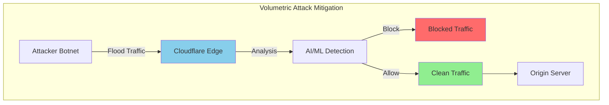

# Cloudflare DDoS Protection: Advanced Defense Against Modern Attacks

## Introduction

Cloudflare's DDoS protection is one of the largest networks globally, capable of mitigating attacks exceeding **1 Tbps**. With **330+ cities across 120+ countries**, Cloudflare automatically detects and blocks malicious traffic before it reaches your origin server.

### Attack Statistics (2024)

- **Largest DDoS attack**: 3.8 Tbps (Q1 2024)
- **Daily attacks blocked**: 140+ billion threats
- **Zero downtime**: Guaranteed availability during attacks
- **Sub-second detection**: Average mitigation time < 10 seconds
- **No traffic cap**: Unlimited DDoS protection

## DDoS Attack Types and Mitigation

### 1. Volumetric Attacks (Layer 3/4)



#### UDP Flood Protection

```javascript
// Advanced UDP flood detection in Workers
export default {
  async fetch(request, env, ctx) {
    const clientIP = request.headers.get('CF-Connecting-IP');
    const country = request.cf.country;
    
    // Check for suspicious patterns
    if (await detectUDPFlood(clientIP, env)) {
      return new Response('Blocked: Potential UDP flood', { 
        status: 429,
        headers: {
          'X-Block-Reason': 'UDP-Flood-Detection',
          'Retry-After': '300'
        }
      });
    }
    
    return fetch(request);
  }
};

async function detectUDPFlood(ip, env) {
  const key = `udp-flood:${ip}`;
  const requests = await env.KV.get(key);
  const count = requests ? parseInt(requests) : 0;
  
  // More than 1000 requests per minute from single IP
  if (count > 1000) {
    // Add to security list for extended blocking
    await env.KV.put(`blocked:${ip}`, 'udp-flood', { expirationTtl: 3600 });
    return true;
  }
  
  // Increment counter
  await env.KV.put(key, (count + 1).toString(), { expirationTtl: 60 });
  return false;
}
```

#### DNS Amplification Defense

```python
# DNS amplification attack detection
import asyncio
from datetime import datetime, timedelta

class DNSAmplificationDetector:
    def __init__(self, cf_api):
        self.cf_api = cf_api
        self.suspicious_patterns = {
            'query_types': ['ANY', 'TXT', 'RRSIG'],
            'query_sizes': range(512, 4096),  # Suspicious query sizes
            'response_ratios': 10  # Response 10x larger than query
        }
    
    async def analyze_dns_traffic(self, zone_id):
        """Analyze DNS queries for amplification patterns"""
        end_time = datetime.utcnow()
        start_time = end_time - timedelta(minutes=5)
        
        dns_analytics = await self.cf_api.get_dns_analytics(
            zone_id=zone_id,
            since=start_time.isoformat(),
            until=end_time.isoformat()
        )
        
        suspicious_sources = {}
        
        for query in dns_analytics['queries']:
            source_ip = query['source_ip']
            query_type = query['query_type']
            query_size = query['query_size']
            response_size = query['response_size']
            
            # Calculate amplification ratio
            amp_ratio = response_size / query_size if query_size > 0 else 0
            
            # Check for suspicious patterns
            if (query_type in self.suspicious_patterns['query_types'] or
                query_size in self.suspicious_patterns['query_sizes'] or
                amp_ratio > self.suspicious_patterns['response_ratios']):
                
                if source_ip not in suspicious_sources:
                    suspicious_sources[source_ip] = {
                        'queries': 0,
                        'total_amplification': 0,
                        'suspicious_types': set()
                    }
                
                suspicious_sources[source_ip]['queries'] += 1
                suspicious_sources[source_ip]['total_amplification'] += amp_ratio
                suspicious_sources[source_ip]['suspicious_types'].add(query_type)
        
        # Block IPs with high suspicion scores
        for ip, data in suspicious_sources.items():
            if data['queries'] > 50 or data['total_amplification'] > 500:
                await self.block_ip(ip, 'dns-amplification', zone_id)
        
        return suspicious_sources
    
    async def block_ip(self, ip, reason, zone_id):
        """Add IP to security rules"""
        rule = {
            "mode": "block",
            "configuration": {
                "target": "ip",
                "value": ip
            },
            "notes": f"Auto-blocked for {reason} at {datetime.utcnow().isoformat()}"
        }
        
        await self.cf_api.create_access_rule(zone_id, rule)
```

### 2. Protocol Attacks (Layer 3/4)

#### SYN Flood Protection

```python
# SYN flood detection and mitigation
class SYNFloodProtection:
    def __init__(self, cf_api, threshold=1000):
        self.cf_api = cf_api
        self.threshold = threshold
        self.syn_tracking = {}
    
    async def monitor_syn_packets(self, zone_id):
        """Monitor SYN packet rates"""
        # Get connection analytics from Cloudflare
        analytics = await self.cf_api.get_network_analytics(
            zone_id=zone_id,
            metrics=['syn_packets', 'connection_attempts'],
            time_window=60  # 1 minute
        )
        
        for data_point in analytics:
            source_ip = data_point['source_ip']
            syn_rate = data_point['syn_packets_per_second']
            
            if syn_rate > self.threshold:
                await self.implement_syn_cookies(source_ip, zone_id)
                
                # If still excessive, block
                if syn_rate > self.threshold * 5:
                    await self.block_ip_temporary(source_ip, 'syn-flood', zone_id)
    
    async def implement_syn_cookies(self, ip, zone_id):
        """Enable SYN cookies for specific IP"""
        firewall_rule = {
            "filter": {
                "expression": f'ip.src eq {ip}'
            },
            "action": "challenge",
            "products": ["ddos"],
            "description": f"SYN cookie challenge for {ip}"
        }
        
        await self.cf_api.create_firewall_rule(zone_id, firewall_rule)
    
    async def block_ip_temporary(self, ip, reason, zone_id, duration=300):
        """Temporarily block IP"""
        rule = {
            "mode": "block",
            "configuration": {
                "target": "ip",
                "value": ip
            },
            "notes": f"Temp block: {reason}",
            "timeout": duration
        }
        
        await self.cf_api.create_temporary_rule(zone_id, rule)
```

### 3. Application Layer Attacks (Layer 7)

#### HTTP Flood Protection

```javascript
// Advanced HTTP flood detection
export class HTTPFloodProtection {
  constructor(env) {
    this.env = env;
    this.rateLimits = {
      requests_per_minute: 300,
      requests_per_hour: 2000,
      burst_threshold: 50,
      suspicious_user_agents: [
        'curl', 'wget', 'python-requests', 'bot', 'crawler'
      ]
    };
  }
  
  async analyzeRequest(request) {
    const clientIP = request.headers.get('CF-Connecting-IP');
    const userAgent = request.headers.get('User-Agent') || '';
    const method = request.method;
    const url = new URL(request.url);
    const path = url.pathname;
    
    // Calculate request patterns
    const patterns = await this.calculatePatterns(clientIP, request);
    
    // Risk scoring
    let riskScore = 0;
    
    // High request rate
    if (patterns.requests_per_minute > this.rateLimits.requests_per_minute) {
      riskScore += 50;
    }
    
    // Burst detection
    if (patterns.burst_rate > this.rateLimits.burst_threshold) {
      riskScore += 30;
    }
    
    // Suspicious user agent
    if (this.rateLimits.suspicious_user_agents.some(ua => 
        userAgent.toLowerCase().includes(ua))) {
      riskScore += 20;
    }
    
    // Unusual request patterns
    if (patterns.unique_paths_ratio < 0.1) { // Hitting same endpoints
      riskScore += 25;
    }
    
    // Geographic anomalies
    if (patterns.country_switches > 3) {
      riskScore += 15;
    }
    
    return {
      riskScore,
      patterns,
      action: this.determineAction(riskScore)
    };
  }
  
  async calculatePatterns(ip, request) {
    const now = Date.now();
    const minute_window = 60 * 1000;
    const hour_window = 60 * 60 * 1000;
    
    // Get request history
    const history_key = `req_history:${ip}`;
    const history = JSON.parse(await this.env.KV.get(history_key) || '[]');
    
    // Filter recent requests
    const recent_requests = history.filter(req => now - req.timestamp < hour_window);
    const minute_requests = recent_requests.filter(req => now - req.timestamp < minute_window);
    
    // Add current request
    const current_request = {
      timestamp: now,
      path: new URL(request.url).pathname,
      method: request.method,
      user_agent: request.headers.get('User-Agent'),
      country: request.cf.country
    };
    
    recent_requests.push(current_request);
    
    // Store updated history (keep last 2000 requests)
    await this.env.KV.put(history_key, JSON.stringify(recent_requests.slice(-2000)), {
      expirationTtl: 7200 // 2 hours
    });
    
    // Calculate patterns
    const unique_paths = new Set(recent_requests.map(r => r.path)).size;
    const unique_countries = new Set(recent_requests.map(r => r.country)).size;
    
    // Burst detection (requests in last 10 seconds)
    const burst_window = 10 * 1000;
    const burst_requests = recent_requests.filter(req => now - req.timestamp < burst_window);
    
    return {
      requests_per_minute: minute_requests.length,
      requests_per_hour: recent_requests.length,
      unique_paths_ratio: unique_paths / recent_requests.length,
      country_switches: unique_countries,
      burst_rate: burst_requests.length,
      methods_used: new Set(recent_requests.map(r => r.method)).size,
      user_agent_consistency: this.calculateUAConsistency(recent_requests)
    };
  }
  
  calculateUAConsistency(requests) {
    const user_agents = requests.map(r => r.user_agent).filter(ua => ua);
    if (user_agents.length === 0) return 0;
    
    const unique_uas = new Set(user_agents);
    return unique_uas.size / user_agents.length;
  }
  
  determineAction(riskScore) {
    if (riskScore >= 80) {
      return 'block';
    } else if (riskScore >= 60) {
      return 'challenge';
    } else if (riskScore >= 40) {
      return 'rate_limit';
    } else if (riskScore >= 20) {
      return 'monitor';
    }
    return 'allow';
  }
}

// Usage in Worker
export default {
  async fetch(request, env, ctx) {
    const protection = new HTTPFloodProtection(env);
    const analysis = await protection.analyzeRequest(request);
    
    switch (analysis.action) {
      case 'block':
        return new Response('Blocked: Suspicious activity', {
          status: 403,
          headers: {
            'X-Block-Reason': 'HTTP-Flood',
            'X-Risk-Score': analysis.riskScore.toString()
          }
        });
        
      case 'challenge':
        return new Response('Please solve the challenge', {
          status: 429,
          headers: {
            'X-Challenge-Required': 'true',
            'CF-Challenge': 'javascript'
          }
        });
        
      case 'rate_limit':
        // Implement rate limiting
        return new Response('Rate limited', {
          status: 429,
          headers: {
            'Retry-After': '60',
            'X-Rate-Limit-Reason': 'Suspicious-Pattern'
          }
        });
        
      default:
        return fetch(request);
    }
  }
};
```

## Intelligent Rate Limiting

### Advanced Rate Limiting Rules

```yaml
# rate-limiting-rules.yaml
rules:
  - name: "API Endpoint Protection"
    expression: 'http.request.uri.path matches "^/api/"'
    rate_limit:
      threshold: 100
      period: 60
      action: block
      duration: 300
    
  - name: "Login Endpoint Protection"
    expression: 'http.request.uri.path eq "/login" and http.request.method eq "POST"'
    rate_limit:
      threshold: 5
      period: 60
      action: challenge
      duration: 600
    
  - name: "Search Rate Limiting"
    expression: 'http.request.uri.path contains "/search"'
    rate_limit:
      threshold: 20
      period: 60
      action: rate_limit
      duration: 60
    
  - name: "Admin Panel Protection"
    expression: 'http.request.uri.path matches "^/admin/"'
    rate_limit:
      threshold: 10
      period: 300
      action: block
      duration: 3600
      bypass:
        - whitelist_ip
        - known_admin_tokens
    
  - name: "File Upload Limiting"
    expression: 'http.request.method eq "POST" and http.request.uri.path contains "/upload"'
    rate_limit:
      threshold: 3
      period: 300
      action: challenge
      duration: 900
```

### Dynamic Rate Limiting Implementation

```javascript
// dynamic-rate-limiting.js - Adaptive rate limiting based on traffic patterns
export class DynamicRateLimiting {
  constructor(env) {
    this.env = env;
    this.baseLimits = {
      '/api/': { requests: 100, window: 60 },
      '/login': { requests: 5, window: 60 },
      '/search': { requests: 20, window: 60 },
      default: { requests: 300, window: 60 }
    };
  }
  
  async calculateDynamicLimit(path, clientIP, request) {
    const baseLimit = this.getBaseLimit(path);
    const trafficMetrics = await this.getTrafficMetrics();
    const clientTrust = await this.calculateClientTrust(clientIP);
    
    // Adjust based on global traffic
    let multiplier = 1;
    
    // During high traffic, reduce limits
    if (trafficMetrics.requests_per_second > 10000) {
      multiplier *= 0.5;
    } else if (trafficMetrics.requests_per_second > 5000) {
      multiplier *= 0.7;
    }
    
    // Adjust based on attack indicators
    if (trafficMetrics.attack_probability > 0.8) {
      multiplier *= 0.3;
    } else if (trafficMetrics.attack_probability > 0.5) {
      multiplier *= 0.6;
    }
    
    // Adjust based on client trust score
    if (clientTrust.score > 0.8) {
      multiplier *= 1.5; // Trusted clients get higher limits
    } else if (clientTrust.score < 0.3) {
      multiplier *= 0.4; // Untrusted clients get lower limits
    }
    
    // Geographic adjustments
    const country = request.cf.country;
    if (['CN', 'RU', 'KP'].includes(country)) {
      multiplier *= 0.6; // Higher risk countries
    }
    
    return {
      requests: Math.floor(baseLimit.requests * multiplier),
      window: baseLimit.window,
      multiplier,
      factors: {
        traffic: trafficMetrics.requests_per_second,
        attack_prob: trafficMetrics.attack_probability,
        client_trust: clientTrust.score,
        country
      }
    };
  }
  
  async getTrafficMetrics() {
    const metrics_key = 'global_traffic_metrics';
    const cached_metrics = await this.env.KV.get(metrics_key);
    
    if (cached_metrics) {
      return JSON.parse(cached_metrics);
    }
    
    // Calculate metrics from recent requests
    const requests = await this.getRecentRequests();
    const now = Date.now();
    const minute_ago = now - 60000;
    
    const recent_requests = requests.filter(r => r.timestamp > minute_ago);
    const requests_per_second = recent_requests.length / 60;
    
    // Calculate attack probability based on patterns
    const attack_indicators = {
      high_error_rate: this.calculateErrorRate(recent_requests) > 0.1,
      unusual_traffic_spike: requests_per_second > this.getBaselineRPS() * 5,
      suspicious_user_agents: this.countSuspiciousUAs(recent_requests) > recent_requests.length * 0.3,
      geographic_anomalies: this.detectGeoAnomalies(recent_requests)
    };
    
    const attack_probability = Object.values(attack_indicators).filter(Boolean).length / Object.keys(attack_indicators).length;
    
    const metrics = {
      requests_per_second,
      attack_probability,
      error_rate: this.calculateErrorRate(recent_requests),
      unique_ips: new Set(recent_requests.map(r => r.ip)).size
    };
    
    // Cache for 10 seconds
    await this.env.KV.put(metrics_key, JSON.stringify(metrics), { expirationTtl: 10 });
    
    return metrics;
  }
  
  async calculateClientTrust(ip) {
    const trust_key = `client_trust:${ip}`;
    const cached_trust = await this.env.KV.get(trust_key);
    
    if (cached_trust) {
      return JSON.parse(cached_trust);
    }
    
    const history = await this.getClientHistory(ip);
    let trust_score = 0.5; // Start neutral
    
    // Positive indicators
    if (history.successful_requests > 1000) trust_score += 0.1;
    if (history.error_rate < 0.05) trust_score += 0.1;
    if (history.days_active > 30) trust_score += 0.1;
    if (history.consistent_patterns) trust_score += 0.1;
    if (history.human_like_behavior) trust_score += 0.1;
    
    // Negative indicators
    if (history.security_violations > 0) trust_score -= 0.3;
    if (history.error_rate > 0.2) trust_score -= 0.2;
    if (history.suspicious_patterns > 5) trust_score -= 0.2;
    if (history.rapid_requests > 10) trust_score -= 0.1;
    
    trust_score = Math.max(0, Math.min(1, trust_score));
    
    const trust_data = {
      score: trust_score,
      last_updated: Date.now(),
      factors: history
    };
    
    // Cache for 5 minutes
    await this.env.KV.put(trust_key, JSON.stringify(trust_data), { expirationTtl: 300 });
    
    return trust_data;
  }
  
  getBaseLimit(path) {
    for (const [pattern, limit] of Object.entries(this.baseLimits)) {
      if (pattern === 'default') continue;
      if (path.startsWith(pattern) || path.includes(pattern)) {
        return limit;
      }
    }
    return this.baseLimits.default;
  }
  
  async enforceRateLimit(clientIP, path, limit) {
    const key = `rate_limit:${clientIP}:${path}`;
    const requests = await this.env.KV.get(key);
    const count = requests ? parseInt(requests) : 0;
    
    if (count >= limit.requests) {
      return {
        allowed: false,
        remaining: 0,
        reset: Date.now() + (limit.window * 1000),
        limit: limit.requests
      };
    }
    
    // Increment counter
    await this.env.KV.put(key, (count + 1).toString(), { 
      expirationTtl: limit.window 
    });
    
    return {
      allowed: true,
      remaining: limit.requests - count - 1,
      reset: Date.now() + (limit.window * 1000),
      limit: limit.requests
    };
  }
  
  calculateErrorRate(requests) {
    if (requests.length === 0) return 0;
    const errors = requests.filter(r => r.status >= 400).length;
    return errors / requests.length;
  }
  
  getBaselineRPS() {
    // Return baseline RPS based on historical data
    return 100; // Simplified
  }
  
  countSuspiciousUAs(requests) {
    const suspicious_patterns = ['bot', 'crawler', 'curl', 'wget', 'scanner'];
    return requests.filter(r => 
      suspicious_patterns.some(pattern => 
        r.user_agent?.toLowerCase().includes(pattern)
      )
    ).length;
  }
  
  detectGeoAnomalies(requests) {
    const countries = requests.map(r => r.country).filter(c => c);
    const unique_countries = new Set(countries);
    
    // Anomaly if traffic from too many countries in short time
    return unique_countries.size > 20;
  }
  
  async getRecentRequests() {
    // Simplified - in production, use analytics API
    return [];
  }
  
  async getClientHistory(ip) {
    // Simplified - return basic history structure
    return {
      successful_requests: 0,
      error_rate: 0,
      days_active: 0,
      consistent_patterns: false,
      human_like_behavior: false,
      security_violations: 0,
      suspicious_patterns: 0,
      rapid_requests: 0
    };
  }
}

// Worker implementation
export default {
  async fetch(request, env, ctx) {
    const rateLimiter = new DynamicRateLimiting(env);
    const url = new URL(request.url);
    const clientIP = request.headers.get('CF-Connecting-IP');
    
    const dynamicLimit = await rateLimiter.calculateDynamicLimit(
      url.pathname, 
      clientIP, 
      request
    );
    
    const rateLimitResult = await rateLimiter.enforceRateLimit(
      clientIP, 
      url.pathname, 
      dynamicLimit
    );
    
    if (!rateLimitResult.allowed) {
      return new Response('Rate limit exceeded', {
        status: 429,
        headers: {
          'X-RateLimit-Limit': dynamicLimit.requests.toString(),
          'X-RateLimit-Remaining': '0',
          'X-RateLimit-Reset': rateLimitResult.reset.toString(),
          'X-RateLimit-Multiplier': dynamicLimit.multiplier.toString(),
          'Retry-After': dynamicLimit.window.toString()
        }
      });
    }
    
    const response = await fetch(request);
    
    // Add rate limit headers to successful responses
    response.headers.set('X-RateLimit-Limit', dynamicLimit.requests.toString());
    response.headers.set('X-RateLimit-Remaining', rateLimitResult.remaining.toString());
    response.headers.set('X-RateLimit-Reset', rateLimitResult.reset.toString());
    
    return response;
  }
};
```

## Bot Management Integration

### Advanced Bot Detection

```javascript
// bot-detection.js - ML-powered bot detection
export class AdvancedBotDetection {
  constructor(env) {
    this.env = env;
    this.botSignatures = {
      user_agents: [
        'Googlebot', 'Bingbot', 'Slurp', 'facebookexternalhit',
        'Twitterbot', 'LinkedInBot', 'WhatsApp', 'SkypeUriPreview'
      ],
      malicious_patterns: [
        'nikto', 'sqlmap', 'nmap', 'masscan', 'zap', 'w3af'
      ],
      headless_indicators: [
        'HeadlessChrome', 'PhantomJS', 'SlimerJS', 'HtmlUnit'
      ]
    };
  }
  
  async detectBot(request) {
    const features = await this.extractFeatures(request);
    const botProbability = await this.calculateBotProbability(features);
    
    return {
      isBot: botProbability > 0.7,
      probability: botProbability,
      botType: this.identifyBotType(features),
      confidence: this.calculateConfidence(features),
      features
    };
  }
  
  async extractFeatures(request) {
    const userAgent = request.headers.get('User-Agent') || '';
    const acceptHeader = request.headers.get('Accept') || '';
    const acceptLanguage = request.headers.get('Accept-Language') || '';
    const acceptEncoding = request.headers.get('Accept-Encoding') || '';
    
    return {
      // User Agent features
      ua_length: userAgent.length,
      ua_entropy: this.calculateEntropy(userAgent),
      ua_known_bot: this.botSignatures.user_agents.some(bot => 
        userAgent.includes(bot)),
      ua_malicious: this.botSignatures.malicious_patterns.some(pattern => 
        userAgent.toLowerCase().includes(pattern)),
      ua_headless: this.botSignatures.headless_indicators.some(indicator => 
        userAgent.includes(indicator)),
      
      // Header features
      headers_count: request.headers.size,
      has_accept: !!acceptHeader,
      has_accept_language: !!acceptLanguage,
      has_accept_encoding: !!acceptEncoding,
      has_dnt: request.headers.has('DNT'),
      has_referer: request.headers.has('Referer'),
      
      // Request features
      method: request.method,
      has_body: request.method !== 'GET' && request.method !== 'HEAD',
      url_length: request.url.length,
      
      // Timing features (would need implementation)
      request_timing: await this.getRequestTiming(request),
      
      // Behavioral features
      session_consistency: await this.checkSessionConsistency(request),
      
      // TLS features (from CF object)
      tls_version: request.cf?.tlsVersion || '',
      tls_cipher: request.cf?.tlsCipher || '',
      
      // Geographic features
      country: request.cf?.country || '',
      asn: request.cf?.asn || '',
      
      // Custom headers
      cf_ray: request.headers.get('CF-RAY') || '',
      cf_ipcountry: request.headers.get('CF-IPCountry') || ''
    };
  }
  
  async calculateBotProbability(features) {
    let score = 0;
    let weights = 0;
    
    // Known bot patterns
    if (features.ua_known_bot) {
      score += 0.9 * 10; // Likely legitimate bot
      weights += 10;
    }
    
    if (features.ua_malicious) {
      score += 0.95 * 15; // Likely malicious bot
      weights += 15;
    }
    
    if (features.ua_headless) {
      score += 0.8 * 8; // Headless browser
      weights += 8;
    }
    
    // Header analysis
    if (!features.has_accept_language) {
      score += 0.6 * 3; // Missing common headers
      weights += 3;
    }
    
    if (!features.has_accept) {
      score += 0.7 * 4;
      weights += 4;
    }
    
    if (features.headers_count < 5) {
      score += 0.5 * 2; // Too few headers
      weights += 2;
    }
    
    // User agent entropy (too low = likely bot)
    if (features.ua_entropy < 3.0) {
      score += 0.6 * 3;
      weights += 3;
    }
    
    // Behavioral patterns
    if (!features.session_consistency) {
      score += 0.4 * 2;
      weights += 2;
    }
    
    // Request timing (too fast = likely bot)
    if (features.request_timing.avg_interval < 100) { // milliseconds
      score += 0.7 * 5;
      weights += 5;
    }
    
    return weights > 0 ? Math.min(1, score / weights) : 0;
  }
  
  identifyBotType(features) {
    if (features.ua_malicious) return 'malicious';
    if (features.ua_headless) return 'headless';
    if (features.ua_known_bot) return 'search_engine';
    
    // Heuristic classification
    if (features.request_timing.requests_per_minute > 60) {
      return 'scraper';
    }
    
    if (!features.has_accept_language && !features.has_referer) {
      return 'automated';
    }
    
    return 'unknown';
  }
  
  calculateConfidence(features) {
    let confidence = 0.5; // Base confidence
    
    // Strong indicators increase confidence
    if (features.ua_known_bot || features.ua_malicious) confidence += 0.3;
    if (features.ua_headless) confidence += 0.2;
    
    // Multiple weak indicators
    const weak_indicators = [
      !features.has_accept_language,
      !features.has_accept,
      features.headers_count < 5,
      features.ua_entropy < 3.0
    ].filter(Boolean).length;
    
    confidence += weak_indicators * 0.1;
    
    return Math.min(1, confidence);
  }
  
  calculateEntropy(str) {
    const freq = {};
    for (const char of str) {
      freq[char] = (freq[char] || 0) + 1;
    }
    
    let entropy = 0;
    const length = str.length;
    
    for (const count of Object.values(freq)) {
      const p = count / length;
      entropy -= p * Math.log2(p);
    }
    
    return entropy;
  }
  
  async getRequestTiming(request) {
    const ip = request.headers.get('CF-Connecting-IP');
    const timing_key = `timing:${ip}`;
    
    const now = Date.now();
    const history = JSON.parse(await this.env.KV.get(timing_key) || '[]');
    
    // Add current request
    history.push(now);
    
    // Keep last 100 requests
    const recent = history.slice(-100);
    await this.env.KV.put(timing_key, JSON.stringify(recent), { 
      expirationTtl: 3600 
    });
    
    if (recent.length < 2) {
      return { avg_interval: 0, requests_per_minute: 0 };
    }
    
    // Calculate intervals
    const intervals = [];
    for (let i = 1; i < recent.length; i++) {
      intervals.push(recent[i] - recent[i-1]);
    }
    
    const avg_interval = intervals.reduce((a, b) => a + b, 0) / intervals.length;
    const requests_in_last_minute = recent.filter(t => now - t < 60000).length;
    
    return {
      avg_interval,
      requests_per_minute: requests_in_last_minute
    };
  }
  
  async checkSessionConsistency(request) {
    // Simplified session consistency check
    // In practice, this would analyze multiple requests from same IP
    return true;
  }
}

// Integration with DDoS protection
export default {
  async fetch(request, env, ctx) {
    const botDetector = new AdvancedBotDetection(env);
    const detection = await botDetector.detectBot(request);
    
    if (detection.isBot) {
      // Log bot detection
      ctx.waitUntil(
        env.ANALYTICS.writeDataPoint({
          blobs: [
            detection.botType,
            request.headers.get('CF-Connecting-IP'),
            request.headers.get('User-Agent')
          ],
          doubles: [detection.probability],
          indexes: [`bot-${detection.botType}`]
        })
      );
      
      // Handle based on bot type
      switch (detection.botType) {
        case 'malicious':
          return new Response('Access denied', {
            status: 403,
            headers: {
              'X-Block-Reason': 'Malicious-Bot',
              'X-Bot-Probability': detection.probability.toString()
            }
          });
          
        case 'scraper':
          // Rate limit scrapers heavily
          return new Response('Rate limited', {
            status: 429,
            headers: {
              'Retry-After': '300',
              'X-Bot-Type': 'Scraper'
            }
          });
          
        case 'search_engine':
          // Allow but monitor search engines
          break;
          
        default:
          // Challenge unknown bots
          return new Response('Please verify you are human', {
            status: 429,
            headers: {
              'CF-Challenge': 'javascript'
            }
          });
      }
    }
    
    return fetch(request);
  }
};
```

## Analytics and Monitoring

### Real-time Attack Dashboard

```javascript
// attack-dashboard.js - Real-time DDoS attack monitoring
export class AttackDashboard {
  constructor(env) {
    this.env = env;
  }
  
  async generateDashboard() {
    const metrics = await this.collectMetrics();
    const dashboard = await this.createDashboardHTML(metrics);
    
    return new Response(dashboard, {
      headers: {
        'Content-Type': 'text/html',
        'Cache-Control': 'no-cache, no-store, must-revalidate'
      }
    });
  }
  
  async collectMetrics() {
    const now = Date.now();
    const hour_ago = now - (60 * 60 * 1000);
    
    // Collect various metrics
    const [
      requestMetrics,
      threatMetrics,
      geoMetrics,
      botMetrics
    ] = await Promise.all([
      this.getRequestMetrics(hour_ago, now),
      this.getThreatMetrics(hour_ago, now),
      this.getGeoMetrics(hour_ago, now),
      this.getBotMetrics(hour_ago, now)
    ]);
    
    return {
      timestamp: now,
      requests: requestMetrics,
      threats: threatMetrics,
      geography: geoMetrics,
      bots: botMetrics,
      summary: this.generateSummary(requestMetrics, threatMetrics)
    };
  }
  
  async getRequestMetrics(start, end) {
    // Simulate request metrics - in production, use Analytics API
    return {
      total_requests: 1500000,
      requests_per_second: 2500,
      bytes_served: 15000000000, // 15GB
      unique_visitors: 45000,
      status_codes: {
        '200': 1350000,
        '301': 75000,
        '404': 45000,
        '403': 15000,
        '429': 12000,
        '500': 3000
      },
      top_paths: [
        { path: '/', requests: 450000 },
        { path: '/api/data', requests: 235000 },
        { path: '/login', requests: 123000 },
        { path: '/search', requests: 98000 }
      ]
    };
  }
  
  async getThreatMetrics(start, end) {
    return {
      threats_blocked: 25000,
      attack_types: {
        'http_flood': 12000,
        'layer7_ddos': 8000,
        'malicious_bot': 3500,
        'sql_injection': 1200,
        'xss_attempt': 300
      },
      threat_sources: {
        'CN': 8500,
        'RU': 6200,
        'US': 3100,
        'BR': 2800,
        'IN': 2400,
        'Other': 2000
      },
      mitigation_methods: {
        'rate_limit': 15000,
        'block': 8000,
        'challenge': 2000
      }
    };
  }
  
  async getGeoMetrics(start, end) {
    return {
      top_countries: [
        { country: 'US', requests: 450000, threats: 1200 },
        { country: 'GB', requests: 180000, threats: 300 },
        { country: 'DE', requests: 150000, threats: 250 },
        { country: 'FR', requests: 120000, threats: 200 },
        { country: 'CA', requests: 100000, threats: 150 },
        { country: 'CN', requests: 90000, threats: 8500 },
        { country: 'RU', requests: 70000, threats: 6200 }
      ]
    };
  }
  
  async getBotMetrics(start, end) {
    return {
      bot_requests: 125000,
      bot_types: {
        'search_engine': 85000,
        'scraper': 25000,
        'malicious': 10000,
        'headless': 3500,
        'automated': 1500
      },
      bot_actions: {
        'allowed': 85000,
        'rate_limited': 25000,
        'blocked': 10000,
        'challenged': 5000
      }
    };
  }
  
  generateSummary(requests, threats) {
    const threat_percentage = ((threats.threats_blocked / requests.total_requests) * 100).toFixed(2);
    const attack_intensity = threats.threats_blocked > 50000 ? 'HIGH' : 
                           threats.threats_blocked > 10000 ? 'MEDIUM' : 'LOW';
    
    return {
      threat_percentage,
      attack_intensity,
      primary_threat: Object.keys(threats.attack_types)
        .reduce((a, b) => threats.attack_types[a] > threats.attack_types[b] ? a : b),
      top_threat_country: Object.keys(threats.threat_sources)
        .reduce((a, b) => threats.threat_sources[a] > threats.threat_sources[b] ? a : b)
    };
  }
  
  async createDashboardHTML(metrics) {
    return `
<!DOCTYPE html>
<html lang="en">
<head>
    <meta charset="UTF-8">
    <meta name="viewport" content="width=device-width, initial-scale=1.0">
    <title>DDoS Protection Dashboard</title>
    <style>
        * { margin: 0; padding: 0; box-sizing: border-box; }
        body { 
            font-family: 'Segoe UI', Tahoma, Geneva, Verdana, sans-serif; 
            background: #0f1419; 
            color: #ffffff; 
            line-height: 1.6;
        }
        .dashboard { 
            max-width: 1400px; 
            margin: 0 auto; 
            padding: 20px; 
        }
        .header { 
            text-align: center; 
            margin-bottom: 30px; 
            padding: 20px;
            background: linear-gradient(135deg, #667eea 0%, #764ba2 100%);
            border-radius: 10px;
        }
        .stats-grid { 
            display: grid; 
            grid-template-columns: repeat(auto-fit, minmax(280px, 1fr)); 
            gap: 20px; 
            margin-bottom: 30px; 
        }
        .stat-card { 
            background: #1a202c; 
            padding: 20px; 
            border-radius: 10px; 
            border-left: 4px solid #4299e1; 
        }
        .stat-card h3 { 
            color: #4299e1; 
            margin-bottom: 10px; 
        }
        .stat-number { 
            font-size: 2em; 
            font-weight: bold; 
            color: #ffffff; 
        }
        .threat-high { border-left-color: #e53e3e !important; }
        .threat-medium { border-left-color: #ed8936 !important; }
        .threat-low { border-left-color: #38a169 !important; }
        .charts-grid { 
            display: grid; 
            grid-template-columns: 1fr 1fr; 
            gap: 20px; 
            margin-bottom: 30px; 
        }
        .chart-container { 
            background: #1a202c; 
            padding: 20px; 
            border-radius: 10px; 
        }
        .table-container { 
            background: #1a202c; 
            padding: 20px; 
            border-radius: 10px; 
            overflow-x: auto; 
        }
        table { 
            width: 100%; 
            border-collapse: collapse; 
        }
        th, td { 
            padding: 12px; 
            text-align: left; 
            border-bottom: 1px solid #2d3748; 
        }
        th { 
            background: #2d3748; 
            color: #4299e1; 
        }
        .status-indicator { 
            display: inline-block; 
            width: 10px; 
            height: 10px; 
            border-radius: 50%; 
            margin-right: 10px; 
        }
        .status-active { background-color: #38a169; }
        .status-warning { background-color: #ed8936; }
        .status-critical { background-color: #e53e3e; }
        .refresh-timer { 
            position: fixed; 
            top: 20px; 
            right: 20px; 
            background: #1a202c; 
            padding: 10px 20px; 
            border-radius: 25px; 
            border: 1px solid #4299e1; 
        }
        @media (max-width: 768px) {
            .charts-grid { grid-template-columns: 1fr; }
            .dashboard { padding: 10px; }
        }
    </style>
</head>
<body>
    <div class="refresh-timer">
        Auto-refresh: <span id="timer">60</span>s
    </div>
    
    <div class="dashboard">
        <div class="header">
            <h1>🛡️ DDoS Protection Dashboard</h1>
            <p>Real-time threat monitoring and mitigation status</p>
            <p><small>Last updated: ${new Date(metrics.timestamp).toLocaleString()}</small></p>
        </div>
        
        <div class="stats-grid">
            <div class="stat-card">
                <h3>Total Requests</h3>
                <div class="stat-number">${metrics.requests.total_requests.toLocaleString()}</div>
                <p>${metrics.requests.requests_per_second.toLocaleString()} req/sec</p>
            </div>
            
            <div class="stat-card threat-${metrics.summary.attack_intensity.toLowerCase()}">
                <h3>Threats Blocked</h3>
                <div class="stat-number">${metrics.threats.threats_blocked.toLocaleString()}</div>
                <p>${metrics.summary.threat_percentage}% of traffic</p>
            </div>
            
            <div class="stat-card">
                <h3>Unique Visitors</h3>
                <div class="stat-number">${metrics.requests.unique_visitors.toLocaleString()}</div>
                <p>Last hour</p>
            </div>
            
            <div class="stat-card">
                <h3>Bot Requests</h3>
                <div class="stat-number">${metrics.bots.bot_requests.toLocaleString()}</div>
                <p>${Math.round((metrics.bots.bot_requests / metrics.requests.total_requests) * 100)}% of traffic</p>
            </div>
        </div>
        
        <div class="charts-grid">
            <div class="chart-container">
                <h3>🎯 Attack Types</h3>
                <table>
                    ${Object.entries(metrics.threats.attack_types)
                      .sort(([,a], [,b]) => b - a)
                      .map(([type, count]) => `
                        <tr>
                            <td>${type.replace(/_/g, ' ').toUpperCase()}</td>
                            <td style="text-align: right">${count.toLocaleString()}</td>
                        </tr>
                      `).join('')}
                </table>
            </div>
            
            <div class="chart-container">
                <h3>🌍 Threat Sources</h3>
                <table>
                    ${Object.entries(metrics.threats.threat_sources)
                      .sort(([,a], [,b]) => b - a)
                      .map(([country, count]) => `
                        <tr>
                            <td>${country}</td>
                            <td style="text-align: right">${count.toLocaleString()}</td>
                        </tr>
                      `).join('')}
                </table>
            </div>
        </div>
        
        <div class="table-container">
            <h3>🌐 Geographic Traffic Distribution</h3>
            <table>
                <thead>
                    <tr>
                        <th>Country</th>
                        <th>Legitimate Requests</th>
                        <th>Threats</th>
                        <th>Threat Ratio</th>
                        <th>Status</th>
                    </tr>
                </thead>
                <tbody>
                    ${metrics.geography.top_countries.map(country => {
                        const threat_ratio = (country.threats / country.requests * 100).toFixed(2);
                        const status_class = threat_ratio > 10 ? 'critical' : threat_ratio > 5 ? 'warning' : 'active';
                        return `
                        <tr>
                            <td>${country.country}</td>
                            <td>${country.requests.toLocaleString()}</td>
                            <td>${country.threats.toLocaleString()}</td>
                            <td>${threat_ratio}%</td>
                            <td>
                                <span class="status-indicator status-${status_class}"></span>
                                ${status_class.charAt(0).toUpperCase() + status_class.slice(1)}
                            </td>
                        </tr>
                        `;
                    }).join('')}
                </tbody>
            </table>
        </div>
    </div>
    
    <script>
        let countdown = 60;
        const timerElement = document.getElementById('timer');
        
        setInterval(() => {
            countdown--;
            timerElement.textContent = countdown;
            
            if (countdown <= 0) {
                location.reload();
            }
        }, 1000);
    </script>
</body>
</html>
    `;
  }
}

// Dashboard endpoint
export default {
  async fetch(request, env) {
    const url = new URL(request.url);
    
    if (url.pathname === '/dashboard') {
      const dashboard = new AttackDashboard(env);
      return dashboard.generateDashboard();
    }
    
    return new Response('Not found', { status: 404 });
  }
};
```

## Best Practices and Configuration

### Security Headers and WAF Rules

```yaml
# waf-rules.yaml - Comprehensive WAF configuration
security_rules:
  - name: "SQL Injection Protection"
    expression: |
      (http.request.body matches "(?i)(union|select|insert|delete|drop|create|alter|exec|script)" and 
       http.request.uri.path contains "search") or
      (http.request.uri.query contains "1=1" or 
       http.request.uri.query contains "' or " or
       http.request.uri.query contains "admin'--")
    action: block
    
  - name: "XSS Protection"
    expression: |
      http.request.uri.query contains "<script" or
      http.request.uri.query contains "javascript:" or
      http.request.body matches "(?i)<script[^>]*>.*?</script>"
    action: block
    
  - name: "Path Traversal Protection"
    expression: |
      http.request.uri.path contains "../" or
      http.request.uri.path contains "..\" or
      http.request.uri.path matches ".*\\.\\./.*"
    action: block
    
  - name: "Suspicious User Agents"
    expression: |
      http.request.headers["user-agent"] contains "sqlmap" or
      http.request.headers["user-agent"] contains "nikto" or
      http.request.headers["user-agent"] contains "nmap"
    action: block
    
  - name: "Rate Limit API Endpoints"
    expression: 'http.request.uri.path matches "^/api/"'
    rate_limit:
      threshold: 100
      period: 60
      action: challenge

security_headers:
  - name: "Content-Security-Policy"
    value: "default-src 'self'; script-src 'self' 'unsafe-inline'; style-src 'self' 'unsafe-inline'"
    
  - name: "X-Frame-Options"
    value: "DENY"
    
  - name: "X-Content-Type-Options"
    value: "nosniff"
    
  - name: "Referrer-Policy"
    value: "strict-origin-when-cross-origin"
    
  - name: "Permissions-Policy"
    value: "geolocation=(), microphone=(), camera=()"
```

## Conclusion

Cloudflare's DDoS protection offers comprehensive defense against modern threats:

✅ **Multi-layer Protection**: L3/L4 and L7 attack mitigation
✅ **Global Scale**: Absorb attacks up to 1 Tbps+
✅ **Intelligent Detection**: AI/ML-powered threat analysis
✅ **Zero Configuration**: Automatic protection out-of-the-box
✅ **Advanced Rate Limiting**: Granular control over traffic
✅ **Bot Management**: Distinguish between good and bad bots
✅ **Real-time Analytics**: Comprehensive attack visibility
✅ **No Performance Impact**: Protection without latency

Key features:
- Automatic DDoS mitigation
- Advanced rate limiting
- Bot management
- Real-time analytics
- Custom security rules
- API-driven configuration

Start protecting your applications today at [dash.cloudflare.com](https://dash.cloudflare.com)

## Resources

- [DDoS Protection Docs](https://developers.cloudflare.com/ddos-protection/)
- [Rate Limiting Guide](https://developers.cloudflare.com/waf/rate-limiting-rules/)
- [Bot Management](https://developers.cloudflare.com/bots/)
- [Security Analytics](https://developers.cloudflare.com/analytics/graphql-api/)
- [WAF Documentation](https://developers.cloudflare.com/waf/)