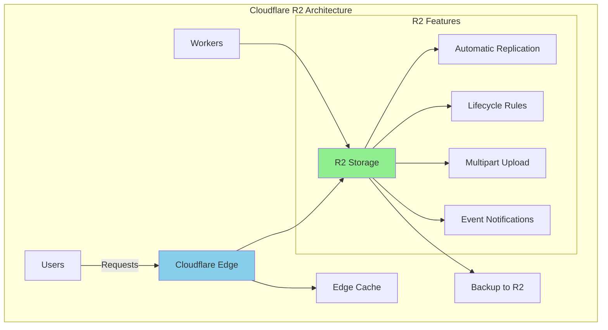

# Cloudflare R2 Storage: S3-Compatible Object Storage Without Egress Fees

## Introduction

Cloudflare R2 revolutionizes cloud storage by eliminating egress fees entirely. While AWS S3 charges $0.09 per GB for data transfer, R2 charges **$0** - potentially saving thousands of dollars monthly for data-intensive applications.

### Key Advantages Over S3

| Feature | Cloudflare R2 | AWS S3 | Savings |
|---------|--------------|---------|---------|
| Storage Cost | $0.015/GB/month | $0.023/GB/month | 35% cheaper |
| Egress Fees | **$0** | $0.09/GB | 100% savings |
| API Requests (Class A) | $4.50/million | $5.00/million | 10% cheaper |
| API Requests (Class B) | $0.36/million | $0.40/million | 10% cheaper |
| Minimum Storage Duration | None | 30-90 days | More flexible |
| Global Replication | Automatic | Extra cost | Included |

### Real Cost Example

For 10TB storage with 50TB monthly egress:
- **AWS S3**: $230 (storage) + $4,500 (egress) = **$4,730/month**
- **Cloudflare R2**: $150 (storage) + $0 (egress) = **$150/month**
- **Savings: $4,580/month (96.8%)**

## Architecture Overview



## Getting Started

### 1. Create R2 Bucket

```bash
# Install Wrangler CLI
npm install -g wrangler

# Authenticate
wrangler login

# Create bucket
wrangler r2 bucket create my-storage

# List buckets
wrangler r2 bucket list

# Get bucket info
wrangler r2 bucket info my-storage
```

### 2. Configure CORS

```json
// cors.json
[
  {
    "AllowedOrigins": ["https://example.com"],
    "AllowedMethods": ["GET", "PUT", "POST", "DELETE", "HEAD"],
    "AllowedHeaders": ["*"],
    "ExposeHeaders": ["ETag"],
    "MaxAgeSeconds": 3600
  }
]
```

```bash
# Apply CORS configuration
wrangler r2 bucket cors put my-storage --file cors.json
```

### 3. Set Lifecycle Rules

```json
// lifecycle.json
{
  "rules": [
    {
      "id": "delete-temp-files",
      "status": "Enabled",
      "filter": {
        "prefix": "temp/"
      },
      "expiration": {
        "days": 7
      }
    },
    {
      "id": "archive-old-logs",
      "status": "Enabled",
      "filter": {
        "prefix": "logs/"
      },
      "transitions": [
        {
          "storageClass": "GLACIER",
          "days": 30
        }
      ]
    }
  ]
}
```

## S3 to R2 Migration

### Automated Migration Tool

```python
# migrate_s3_to_r2.py
import boto3
from boto3.s3.transfer import TransferConfig
import concurrent.futures
import hashlib
import json
from datetime import datetime
import logging

class S3ToR2Migrator:
    def __init__(self, s3_config, r2_config):
        # S3 Client
        self.s3_client = boto3.client(
            's3',
            aws_access_key_id=s3_config['access_key'],
            aws_secret_access_key=s3_config['secret_key'],
            region_name=s3_config['region']
        )
        
        # R2 Client (S3-compatible)
        self.r2_client = boto3.client(
            's3',
            endpoint_url=f"https://{r2_config['account_id']}.r2.cloudflarestorage.com",
            aws_access_key_id=r2_config['access_key'],
            aws_secret_access_key=r2_config['secret_key'],
            region_name='auto'
        )
        
        self.s3_bucket = s3_config['bucket']
        self.r2_bucket = r2_config['bucket']
        self.migration_log = []
        
        # Configure multipart transfer
        self.transfer_config = TransferConfig(
            multipart_threshold=1024 * 25,  # 25MB
            max_concurrency=10,
            multipart_chunksize=1024 * 25,
            use_threads=True
        )
        
        logging.basicConfig(level=logging.INFO)
        self.logger = logging.getLogger(__name__)
    
    def list_s3_objects(self, prefix='', max_keys=1000):
        """List all objects in S3 bucket"""
        objects = []
        continuation_token = None
        
        while True:
            params = {
                'Bucket': self.s3_bucket,
                'MaxKeys': max_keys
            }
            
            if prefix:
                params['Prefix'] = prefix
            if continuation_token:
                params['ContinuationToken'] = continuation_token
            
            response = self.s3_client.list_objects_v2(**params)
            
            if 'Contents' in response:
                objects.extend(response['Contents'])
            
            if not response.get('IsTruncated'):
                break
            
            continuation_token = response.get('NextContinuationToken')
        
        return objects
    
    def calculate_checksum(self, bucket, key, client):
        """Calculate MD5 checksum for verification"""
        response = client.head_object(Bucket=bucket, Key=key)
        return response.get('ETag', '').strip('"')
    
    def migrate_object(self, obj):
        """Migrate single object from S3 to R2"""
        key = obj['Key']
        size = obj['Size']
        
        try:
            # Check if object already exists in R2
            try:
                r2_obj = self.r2_client.head_object(Bucket=self.r2_bucket, Key=key)
                r2_etag = r2_obj.get('ETag', '').strip('"')
                s3_etag = obj['ETag'].strip('"')
                
                if r2_etag == s3_etag:
                    self.logger.info(f"Skipping {key} - already exists with same checksum")
                    return {'status': 'skipped', 'key': key}
            except self.r2_client.exceptions.ClientError:
                pass  # Object doesn't exist in R2
            
            # Download from S3 and upload to R2
            self.logger.info(f"Migrating {key} ({size} bytes)")
            
            # For large files, use multipart copy
            if size > 5 * 1024 * 1024 * 1024:  # 5GB
                # Use server-side copy if possible
                copy_source = {'Bucket': self.s3_bucket, 'Key': key}
                self.r2_client.copy(
                    copy_source,
                    self.r2_bucket,
                    key,
                    Config=self.transfer_config
                )
            else:
                # Direct transfer for smaller files
                response = self.s3_client.get_object(Bucket=self.s3_bucket, Key=key)
                body = response['Body'].read()
                
                # Preserve metadata
                metadata = response.get('Metadata', {})
                content_type = response.get('ContentType', 'binary/octet-stream')
                
                self.r2_client.put_object(
                    Bucket=self.r2_bucket,
                    Key=key,
                    Body=body,
                    Metadata=metadata,
                    ContentType=content_type
                )
            
            # Verify migration
            s3_checksum = self.calculate_checksum(self.s3_bucket, key, self.s3_client)
            r2_checksum = self.calculate_checksum(self.r2_bucket, key, self.r2_client)
            
            if s3_checksum == r2_checksum:
                self.logger.info(f"Successfully migrated {key}")
                return {'status': 'success', 'key': key, 'size': size}
            else:
                self.logger.error(f"Checksum mismatch for {key}")
                return {'status': 'error', 'key': key, 'error': 'checksum_mismatch'}
                
        except Exception as e:
            self.logger.error(f"Error migrating {key}: {str(e)}")
            return {'status': 'error', 'key': key, 'error': str(e)}
    
    def migrate_bucket(self, prefix='', max_workers=10, dry_run=False):
        """Migrate entire bucket or prefix"""
        objects = self.list_s3_objects(prefix)
        total_objects = len(objects)
        total_size = sum(obj['Size'] for obj in objects)
        
        self.logger.info(f"Found {total_objects} objects ({total_size / 1024**3:.2f} GB) to migrate")
        
        if dry_run:
            return {
                'total_objects': total_objects,
                'total_size': total_size,
                'status': 'dry_run'
            }
        
        results = []
        with concurrent.futures.ThreadPoolExecutor(max_workers=max_workers) as executor:
            futures = [executor.submit(self.migrate_object, obj) for obj in objects]
            
            for future in concurrent.futures.as_completed(futures):
                result = future.result()
                results.append(result)
                self.migration_log.append({
                    'timestamp': datetime.utcnow().isoformat(),
                    **result
                })
        
        # Generate summary
        success_count = sum(1 for r in results if r['status'] == 'success')
        error_count = sum(1 for r in results if r['status'] == 'error')
        skipped_count = sum(1 for r in results if r['status'] == 'skipped')
        migrated_size = sum(r.get('size', 0) for r in results if r['status'] == 'success')
        
        summary = {
            'total_objects': total_objects,
            'successful': success_count,
            'errors': error_count,
            'skipped': skipped_count,
            'migrated_size': migrated_size,
            'migration_log': self.migration_log
        }
        
        # Save migration log
        with open(f'migration_log_{datetime.now().strftime("%Y%m%d_%H%M%S")}.json', 'w') as f:
            json.dump(summary, f, indent=2)
        
        return summary
    
    def verify_migration(self, sample_size=100):
        """Verify migration by comparing random samples"""
        s3_objects = self.list_s3_objects()
        r2_objects = self.list_r2_objects()
        
        s3_keys = {obj['Key']: obj['ETag'].strip('"') for obj in s3_objects}
        r2_keys = {obj['Key']: obj['ETag'].strip('"') for obj in r2_objects}
        
        missing_in_r2 = set(s3_keys.keys()) - set(r2_keys.keys())
        checksum_mismatches = []
        
        for key in s3_keys:
            if key in r2_keys and s3_keys[key] != r2_keys[key]:
                checksum_mismatches.append(key)
        
        return {
            'total_s3_objects': len(s3_keys),
            'total_r2_objects': len(r2_keys),
            'missing_in_r2': list(missing_in_r2),
            'checksum_mismatches': checksum_mismatches,
            'verification_status': 'passed' if not missing_in_r2 and not checksum_mismatches else 'failed'
        }
    
    def list_r2_objects(self, prefix='', max_keys=1000):
        """List all objects in R2 bucket"""
        objects = []
        continuation_token = None
        
        while True:
            params = {
                'Bucket': self.r2_bucket,
                'MaxKeys': max_keys
            }
            
            if prefix:
                params['Prefix'] = prefix
            if continuation_token:
                params['ContinuationToken'] = continuation_token
            
            response = self.r2_client.list_objects_v2(**params)
            
            if 'Contents' in response:
                objects.extend(response['Contents'])
            
            if not response.get('IsTruncated'):
                break
            
            continuation_token = response.get('NextContinuationToken')
        
        return objects

# Usage example
if __name__ == "__main__":
    s3_config = {
        'access_key': 'YOUR_AWS_ACCESS_KEY',
        'secret_key': 'YOUR_AWS_SECRET_KEY',
        'region': 'us-east-1',
        'bucket': 'my-s3-bucket'
    }
    
    r2_config = {
        'account_id': 'YOUR_CLOUDFLARE_ACCOUNT_ID',
        'access_key': 'YOUR_R2_ACCESS_KEY',
        'secret_key': 'YOUR_R2_SECRET_KEY',
        'bucket': 'my-r2-bucket'
    }
    
    migrator = S3ToR2Migrator(s3_config, r2_config)
    
    # Dry run first
    dry_run_result = migrator.migrate_bucket(dry_run=True)
    print(f"Dry run: {dry_run_result}")
    
    # Actual migration
    result = migrator.migrate_bucket(max_workers=20)
    print(f"Migration complete: {result}")
    
    # Verify
    verification = migrator.verify_migration()
    print(f"Verification: {verification}")
```

## Workers Integration

### Direct R2 Access from Workers

```javascript
// worker.js - R2 storage operations
export default {
  async fetch(request, env) {
    const url = new URL(request.url);
    const key = url.pathname.slice(1);
    
    switch (request.method) {
      case 'GET':
        return await handleGet(key, env);
      case 'PUT':
        return await handlePut(key, request, env);
      case 'DELETE':
        return await handleDelete(key, env);
      case 'HEAD':
        return await handleHead(key, env);
      default:
        return new Response('Method not allowed', { status: 405 });
    }
  }
};

async function handleGet(key, env) {
  // Handle listing if no key
  if (!key) {
    const list = await env.BUCKET.list();
    return Response.json({
      objects: list.objects.map(obj => ({
        key: obj.key,
        size: obj.size,
        etag: obj.etag,
        uploaded: obj.uploaded
      }))
    });
  }
  
  // Get object
  const object = await env.BUCKET.get(key);
  
  if (!object) {
    return new Response('Object not found', { status: 404 });
  }
  
  // Handle range requests for video streaming
  const range = request.headers.get('range');
  if (range) {
    return handleRangeRequest(object, range);
  }
  
  const headers = new Headers();
  object.writeHttpMetadata(headers);
  headers.set('etag', object.httpEtag);
  headers.set('cache-control', 'public, max-age=31536000');
  
  return new Response(object.body, { headers });
}

async function handlePut(key, request, env) {
  // Validate file size
  const contentLength = request.headers.get('content-length');
  if (contentLength && parseInt(contentLength) > 100 * 1024 * 1024) { // 100MB limit
    return new Response('File too large', { status: 413 });
  }
  
  // Extract metadata
  const metadata = {
    uploadedBy: request.headers.get('x-user-id') || 'anonymous',
    uploadedAt: new Date().toISOString(),
    contentType: request.headers.get('content-type') || 'application/octet-stream'
  };
  
  // Handle multipart uploads for large files
  if (contentLength && parseInt(contentLength) > 5 * 1024 * 1024) { // 5MB
    return await handleMultipartUpload(key, request, env, metadata);
  }
  
  // Direct upload for small files
  await env.BUCKET.put(key, request.body, {
    httpMetadata: request.headers,
    customMetadata: metadata
  });
  
  return new Response('Object uploaded', { 
    status: 201,
    headers: {
      'Location': `/${key}`
    }
  });
}

async function handleDelete(key, env) {
  await env.BUCKET.delete(key);
  return new Response('Object deleted', { status: 204 });
}

async function handleHead(key, env) {
  const object = await env.BUCKET.head(key);
  
  if (!object) {
    return new Response('Object not found', { status: 404 });
  }
  
  return new Response(null, {
    headers: {
      'content-length': object.size,
      'etag': object.httpEtag,
      'last-modified': object.uploaded.toUTCString()
    }
  });
}

async function handleRangeRequest(object, range) {
  const parts = range.replace(/bytes=/, '').split('-');
  const start = parseInt(parts[0], 10);
  const end = parts[1] ? parseInt(parts[1], 10) : object.size - 1;
  
  const headers = new Headers();
  headers.set('content-range', `bytes ${start}-${end}/${object.size}`);
  headers.set('accept-ranges', 'bytes');
  headers.set('content-length', end - start + 1);
  headers.set('content-type', object.httpMetadata.contentType || 'application/octet-stream');
  
  const slicedBody = object.body.slice(start, end + 1);
  
  return new Response(slicedBody, {
    status: 206,
    headers
  });
}

async function handleMultipartUpload(key, request, env, metadata) {
  const chunks = [];
  const reader = request.body.getReader();
  
  try {
    while (true) {
      const { done, value } = await reader.read();
      if (done) break;
      chunks.push(value);
    }
    
    const blob = new Blob(chunks);
    await env.BUCKET.put(key, blob, {
      httpMetadata: request.headers,
      customMetadata: metadata
    });
    
    return new Response('Multipart upload complete', { status: 201 });
  } catch (error) {
    return new Response(`Upload failed: ${error.message}`, { status: 500 });
  }
}
```

### Image Processing Pipeline

```javascript
// image-processor.js - Real-time image transformation with R2
export default {
  async fetch(request, env) {
    const url = new URL(request.url);
    const imageKey = url.searchParams.get('key');
    const width = parseInt(url.searchParams.get('w') || '0');
    const height = parseInt(url.searchParams.get('h') || '0');
    const quality = parseInt(url.searchParams.get('q') || '85');
    const format = url.searchParams.get('f') || 'auto';
    
    if (!imageKey) {
      return new Response('Missing image key', { status: 400 });
    }
    
    // Generate cache key
    const cacheKey = `${imageKey}-w${width}-h${height}-q${quality}-f${format}`;
    
    // Check if processed image exists in R2
    const cachedImage = await env.BUCKET.get(`processed/${cacheKey}`);
    if (cachedImage) {
      return new Response(cachedImage.body, {
        headers: {
          'content-type': cachedImage.httpMetadata.contentType,
          'cache-control': 'public, max-age=31536000',
          'x-cache': 'HIT'
        }
      });
    }
    
    // Get original image from R2
    const original = await env.BUCKET.get(`originals/${imageKey}`);
    if (!original) {
      return new Response('Image not found', { status: 404 });
    }
    
    // Process image using Cloudflare Image Resizing
    const processedResponse = await fetch(original.body, {
      cf: {
        image: {
          width: width || undefined,
          height: height || undefined,
          quality: quality,
          format: format === 'auto' ? undefined : format,
          fit: 'scale-down',
          metadata: 'none'
        }
      }
    });
    
    const processedImage = await processedResponse.arrayBuffer();
    
    // Store processed image in R2 for future requests
    await env.BUCKET.put(`processed/${cacheKey}`, processedImage, {
      httpMetadata: {
        contentType: processedResponse.headers.get('content-type')
      },
      customMetadata: {
        originalKey: imageKey,
        width: width.toString(),
        height: height.toString(),
        quality: quality.toString(),
        format: format,
        processedAt: new Date().toISOString()
      }
    });
    
    return new Response(processedImage, {
      headers: {
        'content-type': processedResponse.headers.get('content-type'),
        'cache-control': 'public, max-age=31536000',
        'x-cache': 'MISS'
      }
    });
  }
};
```

## Advanced Use Cases

### 1. Video Streaming Platform

```javascript
// video-streaming.js - HLS video streaming from R2
export default {
  async fetch(request, env) {
    const url = new URL(request.url);
    const path = url.pathname;
    
    // Handle manifest files
    if (path.endsWith('.m3u8')) {
      return await handleManifest(path, env);
    }
    
    // Handle video segments
    if (path.endsWith('.ts')) {
      return await handleSegment(path, env);
    }
    
    // Handle video upload
    if (path === '/upload' && request.method === 'POST') {
      return await handleVideoUpload(request, env);
    }
    
    return new Response('Not found', { status: 404 });
  }
};

async function handleManifest(path, env) {
  const manifest = await env.BUCKET.get(path);
  
  if (!manifest) {
    return new Response('Manifest not found', { status: 404 });
  }
  
  return new Response(manifest.body, {
    headers: {
      'content-type': 'application/vnd.apple.mpegurl',
      'cache-control': 'no-cache',
      'access-control-allow-origin': '*'
    }
  });
}

async function handleSegment(path, env) {
  const segment = await env.BUCKET.get(path);
  
  if (!segment) {
    return new Response('Segment not found', { status: 404 });
  }
  
  return new Response(segment.body, {
    headers: {
      'content-type': 'video/mp2t',
      'cache-control': 'public, max-age=31536000',
      'access-control-allow-origin': '*'
    }
  });
}

async function handleVideoUpload(request, env) {
  const formData = await request.formData();
  const file = formData.get('video');
  const videoId = crypto.randomUUID();
  
  if (!file) {
    return new Response('No video file provided', { status: 400 });
  }
  
  // Store original video
  await env.BUCKET.put(`videos/${videoId}/original.mp4`, file, {
    customMetadata: {
      uploadedAt: new Date().toISOString(),
      fileName: file.name,
      fileSize: file.size.toString()
    }
  });
  
  // Trigger transcoding job (via queue or external service)
  await env.QUEUE.send({
    videoId,
    action: 'transcode',
    formats: ['1080p', '720p', '480p'],
    generateHLS: true
  });
  
  return Response.json({
    videoId,
    status: 'processing',
    message: 'Video uploaded successfully and queued for processing'
  });
}
```

### 2. Backup and Archive System

```javascript
// backup-system.js - Automated backup to R2
class BackupSystem {
  constructor(env) {
    this.env = env;
    this.bucket = env.BACKUP_BUCKET;
  }
  
  async createBackup(data, metadata) {
    const backupId = crypto.randomUUID();
    const timestamp = new Date().toISOString();
    const key = `backups/${timestamp.split('T')[0]}/${backupId}.zip`;
    
    // Compress data
    const compressed = await this.compressData(data);
    
    // Encrypt backup
    const encrypted = await this.encryptData(compressed);
    
    // Store in R2 with metadata
    await this.bucket.put(key, encrypted, {
      customMetadata: {
        backupId,
        timestamp,
        ...metadata,
        checksum: await this.calculateChecksum(encrypted),
        encryption: 'AES-256-GCM'
      }
    });
    
    return {
      backupId,
      key,
      size: encrypted.byteLength,
      timestamp
    };
  }
  
  async restoreBackup(backupId) {
    // Find backup
    const list = await this.bucket.list({
      prefix: 'backups/'
    });
    
    const backup = list.objects.find(obj => 
      obj.customMetadata?.backupId === backupId
    );
    
    if (!backup) {
      throw new Error('Backup not found');
    }
    
    // Retrieve encrypted data
    const encrypted = await this.bucket.get(backup.key);
    
    // Verify checksum
    const checksum = await this.calculateChecksum(encrypted.body);
    if (checksum !== backup.customMetadata.checksum) {
      throw new Error('Backup integrity check failed');
    }
    
    // Decrypt
    const decrypted = await this.decryptData(encrypted.body);
    
    // Decompress
    const data = await this.decompressData(decrypted);
    
    return {
      data,
      metadata: backup.customMetadata,
      restoredAt: new Date().toISOString()
    };
  }
  
  async cleanupOldBackups(retentionDays = 30) {
    const cutoffDate = new Date();
    cutoffDate.setDate(cutoffDate.getDate() - retentionDays);
    
    const list = await this.bucket.list({
      prefix: 'backups/'
    });
    
    const toDelete = list.objects.filter(obj => {
      const uploadDate = new Date(obj.uploaded);
      return uploadDate < cutoffDate;
    });
    
    for (const obj of toDelete) {
      await this.bucket.delete(obj.key);
    }
    
    return {
      deleted: toDelete.length,
      retained: list.objects.length - toDelete.length
    };
  }
  
  async compressData(data) {
    const stream = new CompressionStream('gzip');
    const writer = stream.writable.getWriter();
    writer.write(data);
    writer.close();
    
    const compressed = await new Response(stream.readable).arrayBuffer();
    return compressed;
  }
  
  async decompressData(compressed) {
    const stream = new DecompressionStream('gzip');
    const writer = stream.writable.getWriter();
    writer.write(compressed);
    writer.close();
    
    const decompressed = await new Response(stream.readable).arrayBuffer();
    return decompressed;
  }
  
  async encryptData(data) {
    // Simplified encryption - use Web Crypto API in production
    const key = await crypto.subtle.importKey(
      'raw',
      new TextEncoder().encode(this.env.ENCRYPTION_KEY),
      { name: 'AES-GCM' },
      false,
      ['encrypt']
    );
    
    const iv = crypto.getRandomValues(new Uint8Array(12));
    const encrypted = await crypto.subtle.encrypt(
      { name: 'AES-GCM', iv },
      key,
      data
    );
    
    // Combine IV and encrypted data
    const combined = new Uint8Array(iv.length + encrypted.byteLength);
    combined.set(iv, 0);
    combined.set(new Uint8Array(encrypted), iv.length);
    
    return combined.buffer;
  }
  
  async decryptData(encrypted) {
    const data = new Uint8Array(encrypted);
    const iv = data.slice(0, 12);
    const ciphertext = data.slice(12);
    
    const key = await crypto.subtle.importKey(
      'raw',
      new TextEncoder().encode(this.env.ENCRYPTION_KEY),
      { name: 'AES-GCM' },
      false,
      ['decrypt']
    );
    
    const decrypted = await crypto.subtle.decrypt(
      { name: 'AES-GCM', iv },
      key,
      ciphertext
    );
    
    return decrypted;
  }
  
  async calculateChecksum(data) {
    const hashBuffer = await crypto.subtle.digest('SHA-256', data);
    const hashArray = Array.from(new Uint8Array(hashBuffer));
    return hashArray.map(b => b.toString(16).padStart(2, '0')).join('');
  }
}
```

### 3. CDN with Smart Caching

```javascript
// cdn-cache.js - Intelligent CDN with R2 backend
export default {
  async fetch(request, env, ctx) {
    const cache = caches.default;
    const url = new URL(request.url);
    
    // Create cache key
    const cacheKey = new Request(url.toString(), request);
    let response = await cache.match(cacheKey);
    
    if (!response) {
      // Parse path to get R2 key
      const key = url.pathname.slice(1);
      
      // Check R2
      const object = await env.BUCKET.get(key);
      
      if (!object) {
        // Try to fetch from origin
        const originUrl = `https://origin.example.com${url.pathname}`;
        response = await fetch(originUrl);
        
        if (response.ok) {
          // Store in R2 for future requests
          await env.BUCKET.put(key, response.body, {
            httpMetadata: response.headers
          });
          
          // Recreate response since body was consumed
          const object = await env.BUCKET.get(key);
          response = new Response(object.body, response);
        }
      } else {
        // Serve from R2
        const headers = new Headers();
        object.writeHttpMetadata(headers);
        headers.set('cache-control', getCacheControl(key));
        headers.set('cf-cache-status', 'MISS');
        
        response = new Response(object.body, { headers });
      }
      
      // Store in edge cache
      ctx.waitUntil(cache.put(cacheKey, response.clone()));
    } else {
      // Add cache hit header
      response = new Response(response.body, response);
      response.headers.set('cf-cache-status', 'HIT');
    }
    
    return response;
  }
};

function getCacheControl(key) {
  // Determine cache duration based on file type
  const ext = key.split('.').pop().toLowerCase();
  
  const cacheMap = {
    // Images - long cache
    'jpg': 'public, max-age=31536000, immutable',
    'jpeg': 'public, max-age=31536000, immutable',
    'png': 'public, max-age=31536000, immutable',
    'webp': 'public, max-age=31536000, immutable',
    'gif': 'public, max-age=31536000, immutable',
    
    // Videos - moderate cache
    'mp4': 'public, max-age=86400',
    'webm': 'public, max-age=86400',
    
    // Documents - short cache
    'html': 'public, max-age=3600',
    'css': 'public, max-age=86400',
    'js': 'public, max-age=86400',
    
    // Dynamic content - no cache
    'json': 'no-cache',
    'xml': 'no-cache'
  };
  
  return cacheMap[ext] || 'public, max-age=3600';
}
```

## Performance Optimization

### Multipart Upload Implementation

```javascript
// multipart-upload.js - Efficient large file uploads
class MultipartUploader {
  constructor(bucket, chunkSize = 5 * 1024 * 1024) { // 5MB chunks
    this.bucket = bucket;
    this.chunkSize = chunkSize;
  }
  
  async uploadLargeFile(key, file, onProgress) {
    const fileSize = file.size;
    const chunks = Math.ceil(fileSize / this.chunkSize);
    const uploadId = crypto.randomUUID();
    
    const parts = [];
    
    for (let i = 0; i < chunks; i++) {
      const start = i * this.chunkSize;
      const end = Math.min(start + this.chunkSize, fileSize);
      const chunk = file.slice(start, end);
      
      const partNumber = i + 1;
      const partKey = `${key}.${uploadId}.part${partNumber}`;
      
      // Upload chunk
      await this.bucket.put(partKey, chunk);
      
      parts.push({
        partNumber,
        key: partKey,
        size: end - start
      });
      
      // Report progress
      if (onProgress) {
        onProgress({
          uploaded: end,
          total: fileSize,
          percentage: Math.round((end / fileSize) * 100)
        });
      }
    }
    
    // Combine parts
    await this.combineParts(key, parts, uploadId);
    
    // Clean up part files
    await this.cleanupParts(parts);
    
    return {
      key,
      size: fileSize,
      parts: chunks,
      uploadId
    };
  }
  
  async combineParts(key, parts, uploadId) {
    const chunks = [];
    
    for (const part of parts) {
      const object = await this.bucket.get(part.key);
      chunks.push(await object.arrayBuffer());
    }
    
    const combined = new Blob(chunks);
    
    await this.bucket.put(key, combined, {
      customMetadata: {
        uploadId,
        parts: parts.length.toString(),
        uploadedAt: new Date().toISOString()
      }
    });
  }
  
  async cleanupParts(parts) {
    for (const part of parts) {
      await this.bucket.delete(part.key);
    }
  }
}
```

## Cost Calculator

```javascript
// cost-calculator.js - R2 vs S3 cost comparison tool
function calculateStorageCosts(storageGB, monthlyEgressGB, requestsClassA, requestsClassB) {
  // R2 Pricing
  const r2Costs = {
    storage: storageGB * 0.015,
    egress: 0, // Free!
    classA: (requestsClassA / 1000000) * 4.50,
    classB: (requestsClassB / 1000000) * 0.36,
    total: 0
  };
  r2Costs.total = r2Costs.storage + r2Costs.classA + r2Costs.classB;
  
  // S3 Standard Pricing (us-east-1)
  const s3Costs = {
    storage: storageGB * 0.023,
    egress: monthlyEgressGB * 0.09,
    classA: (requestsClassA / 1000000) * 5.00,
    classB: (requestsClassB / 1000000) * 0.40,
    total: 0
  };
  s3Costs.total = s3Costs.storage + s3Costs.egress + s3Costs.classA + s3Costs.classB;
  
  // Calculate savings
  const savings = {
    absolute: s3Costs.total - r2Costs.total,
    percentage: ((s3Costs.total - r2Costs.total) / s3Costs.total * 100).toFixed(2)
  };
  
  return {
    r2: r2Costs,
    s3: s3Costs,
    savings,
    breakEven: {
      months: 0, // R2 is immediately cheaper
      savingsPerYear: savings.absolute * 12
    }
  };
}

// Example calculation
const comparison = calculateStorageCosts(
  1000,    // 1TB storage
  5000,    // 5TB monthly egress
  1000000, // 1M Class A requests
  10000000 // 10M Class B requests
);

console.log(`
  Monthly Costs:
  - R2: $${comparison.r2.total.toFixed(2)}
  - S3: $${comparison.s3.total.toFixed(2)}
  - Savings: $${comparison.savings.absolute.toFixed(2)} (${comparison.savings.percentage}%)
  - Annual Savings: $${comparison.breakEven.savingsPerYear.toFixed(2)}
`);
```

## Conclusion

Cloudflare R2 represents a paradigm shift in object storage economics. By eliminating egress fees, it makes previously cost-prohibitive use cases viable:

✅ **Zero Egress Fees**: Unlimited data transfer at no cost
✅ **S3 Compatible**: Drop-in replacement with minimal code changes
✅ **Global Performance**: Automatic replication across Cloudflare's network
✅ **Workers Integration**: Native integration with edge computing
✅ **Simple Pricing**: Predictable costs without hidden fees
✅ **No Vendor Lock-in**: S3-compatible API ensures portability

Perfect for:
- Media streaming platforms
- Content delivery networks
- Backup and archive systems
- Data lakes and analytics
- SaaS applications with heavy data transfer

Start storing at [r2.cloudflarestorage.com](https://r2.cloudflarestorage.com)

## Resources

- [R2 Documentation](https://developers.cloudflare.com/r2/)
- [Pricing Calculator](https://www.cloudflare.com/products/r2/pricing-calculator/)
- [Migration Guide](https://developers.cloudflare.com/r2/migration/)
- [API Reference](https://developers.cloudflare.com/r2/api/)
- [Community Forum](https://community.cloudflare.com/c/developers/storage/)