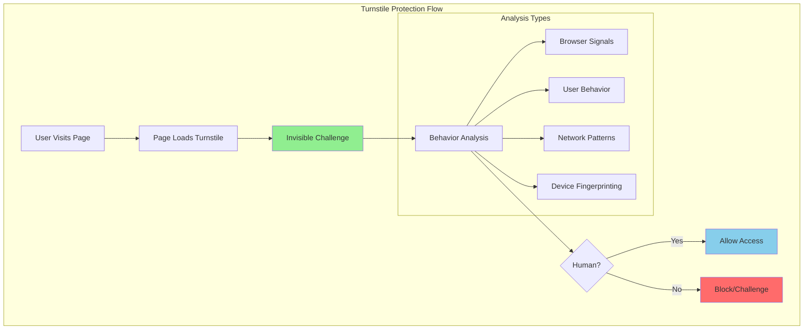

# Cloudflare Turnstile: Privacy-First CAPTCHA Alternative

## Introduction

Cloudflare Turnstile revolutionizes bot protection by eliminating the need for traditional CAPTCHAs. Instead of forcing users to solve puzzles, Turnstile runs **invisible challenges** that validate human behavior without compromising user experience or privacy.

### Problems with Traditional CAPTCHAs

- 👎 **Poor User Experience**: Frustrating puzzles and image selection
- 🔒 **Privacy Concerns**: Data collection and tracking
- ♿ **Accessibility Issues**: Difficult for users with disabilities
- 📱 **Mobile Unfriendly**: Poor experience on mobile devices
- 🚫 **High Abandonment**: Users leave rather than solve CAPTCHAs
- 💰 **Hidden Costs**: User data collection and monetization

### Turnstile Advantages

- ✅ **Invisible Protection**: No user interaction required
- 🛡️ **Privacy-First**: No data collection or tracking
- ♿ **Fully Accessible**: Works for all users
- 📱 **Mobile Optimized**: Seamless mobile experience
- 🚀 **Better Conversions**: No user abandonment
- 💰 **Completely Free**: No usage limits or costs

## How Turnstile Works

### Detection Mechanisms



### Signal Collection

Turnstile analyzes multiple signals to determine if a visitor is human:

1. **Browser Behavior**
   - Mouse movements and patterns
   - Keyboard interactions
   - Scroll patterns
   - Touch gestures (mobile)

2. **Device Characteristics**
   - Screen resolution and orientation
   - Browser capabilities
   - Installed plugins
   - Hardware specifications

3. **Network Analysis**
   - IP reputation
   - Connection patterns
   - Geographic consistency
   - Request timing

4. **Page Interaction**
   - Navigation patterns
   - Focus events
   - Form interactions
   - Link clicking behavior

## Implementation Guide

### Basic Integration

```html
<!-- HTML Implementation -->
<!DOCTYPE html>
<html lang="en">
<head>
    <meta charset="UTF-8">
    <meta name="viewport" content="width=device-width, initial-scale=1.0">
    <title>Contact Form with Turnstile</title>
    <script src="https://challenges.cloudflare.com/turnstile/v0/api.js" async defer></script>
</head>
<body>
    <form id="contact-form" action="/submit" method="POST">
        <div>
            <label for="name">Name:</label>
            <input type="text" id="name" name="name" required>
        </div>
        
        <div>
            <label for="email">Email:</label>
            <input type="email" id="email" name="email" required>
        </div>
        
        <div>
            <label for="message">Message:</label>
            <textarea id="message" name="message" rows="5" required></textarea>
        </div>
        
        <!-- Turnstile widget -->
        <div class="cf-turnstile" 
             data-sitekey="your-site-key"
             data-callback="onTurnstileSuccess"
             data-error-callback="onTurnstileError"
             data-expired-callback="onTurnstileExpired">
        </div>
        
        <button type="submit" id="submit-btn" disabled>Send Message</button>
    </form>

    <script>
        function onTurnstileSuccess(token) {
            // Enable submit button when Turnstile validates
            document.getElementById('submit-btn').disabled = false;
            console.log('Turnstile validation successful');
        }
        
        function onTurnstileError(error) {
            console.error('Turnstile error:', error);
            document.getElementById('submit-btn').disabled = true;
        }
        
        function onTurnstileExpired() {
            console.warn('Turnstile token expired');
            document.getElementById('submit-btn').disabled = true;
        }
    </script>
</body>
</html>
```

### Server-Side Verification

```javascript
// Node.js/Express server-side verification
const express = require('express');
const fetch = require('node-fetch');
const app = express();

app.use(express.json());
app.use(express.urlencoded({ extended: true }));

const TURNSTILE_SECRET_KEY = process.env.TURNSTILE_SECRET_KEY;

async function verifyTurnstile(token, remoteip = null) {
    const formData = new URLSearchParams();
    formData.append('secret', TURNSTILE_SECRET_KEY);
    formData.append('response', token);
    
    if (remoteip) {
        formData.append('remoteip', remoteip);
    }
    
    try {
        const response = await fetch('https://challenges.cloudflare.com/turnstile/v0/siteverify', {
            method: 'POST',
            headers: {
                'Content-Type': 'application/x-www-form-urlencoded',
            },
            body: formData
        });
        
        const result = await response.json();
        return result;
    } catch (error) {
        console.error('Turnstile verification error:', error);
        return { success: false, error: error.message };
    }
}

app.post('/submit', async (req, res) => {
    const { name, email, message, 'cf-turnstile-response': turnstileToken } = req.body;
    
    // Verify Turnstile token
    const verification = await verifyTurnstile(
        turnstileToken,
        req.ip || req.connection.remoteAddress
    );
    
    if (!verification.success) {
        return res.status(400).json({
            error: 'CAPTCHA verification failed',
            details: verification['error-codes'] || 'Unknown error'
        });
    }
    
    // Process form submission
    console.log('Form submitted:', { name, email, message });
    
    // Save to database, send email, etc.
    
    res.json({
        success: true,
        message: 'Form submitted successfully'
    });
});

app.listen(3000, () => {
    console.log('Server running on port 3000');
});
```

### React Integration

```jsx
// React component with Turnstile
import React, { useState, useEffect, useRef } from 'react';

const ContactForm = () => {
    const [formData, setFormData] = useState({
        name: '',
        email: '',
        message: ''
    });
    const [turnstileToken, setTurnstileToken] = useState(null);
    const [isSubmitting, setIsSubmitting] = useState(false);
    const turnstileRef = useRef(null);

    useEffect(() => {
        // Load Turnstile script
        const script = document.createElement('script');
        script.src = 'https://challenges.cloudflare.com/turnstile/v0/api.js';
        script.async = true;
        script.defer = true;
        script.onload = initializeTurnstile;
        document.head.appendChild(script);

        return () => {
            document.head.removeChild(script);
        };
    }, []);

    const initializeTurnstile = () => {
        if (window.turnstile && turnstileRef.current) {
            window.turnstile.render(turnstileRef.current, {
                sitekey: process.env.REACT_APP_TURNSTILE_SITE_KEY,
                callback: handleTurnstileSuccess,
                'error-callback': handleTurnstileError,
                'expired-callback': handleTurnstileExpired,
                theme: 'auto',
                size: 'normal'
            });
        }
    };

    const handleTurnstileSuccess = (token) => {
        setTurnstileToken(token);
        console.log('Turnstile validation successful');
    };

    const handleTurnstileError = (error) => {
        console.error('Turnstile error:', error);
        setTurnstileToken(null);
    };

    const handleTurnstileExpired = () => {
        console.warn('Turnstile token expired');
        setTurnstileToken(null);
    };

    const handleInputChange = (e) => {
        const { name, value } = e.target;
        setFormData(prev => ({
            ...prev,
            [name]: value
        }));
    };

    const handleSubmit = async (e) => {
        e.preventDefault();
        
        if (!turnstileToken) {
            alert('Please complete the security check');
            return;
        }

        setIsSubmitting(true);

        try {
            const response = await fetch('/api/submit', {
                method: 'POST',
                headers: {
                    'Content-Type': 'application/json',
                },
                body: JSON.stringify({
                    ...formData,
                    turnstileToken
                })
            });

            const result = await response.json();

            if (result.success) {
                alert('Form submitted successfully!');
                setFormData({ name: '', email: '', message: '' });
                setTurnstileToken(null);
                
                // Reset Turnstile
                if (window.turnstile) {
                    window.turnstile.reset();
                }
            } else {
                alert('Submission failed: ' + result.error);
            }
        } catch (error) {
            console.error('Submission error:', error);
            alert('An error occurred. Please try again.');
        } finally {
            setIsSubmitting(false);
        }
    };

    return (
        <form onSubmit={handleSubmit} className="contact-form">
            <div className="form-group">
                <label htmlFor="name">Name:</label>
                <input
                    type="text"
                    id="name"
                    name="name"
                    value={formData.name}
                    onChange={handleInputChange}
                    required
                />
            </div>

            <div className="form-group">
                <label htmlFor="email">Email:</label>
                <input
                    type="email"
                    id="email"
                    name="email"
                    value={formData.email}
                    onChange={handleInputChange}
                    required
                />
            </div>

            <div className="form-group">
                <label htmlFor="message">Message:</label>
                <textarea
                    id="message"
                    name="message"
                    rows="5"
                    value={formData.message}
                    onChange={handleInputChange}
                    required
                />
            </div>

            <div className="turnstile-container">
                <div ref={turnstileRef}></div>
            </div>

            <button 
                type="submit" 
                disabled={!turnstileToken || isSubmitting}
                className="submit-button"
            >
                {isSubmitting ? 'Submitting...' : 'Send Message'}
            </button>
        </form>
    );
};

export default ContactForm;
```

### Vue.js Integration

```vue
<!-- Vue.js component with Turnstile -->
<template>
  <form @submit.prevent="submitForm" class="contact-form">
    <div class="form-group">
      <label for="name">Name:</label>
      <input
        v-model="formData.name"
        type="text"
        id="name"
        name="name"
        required
      />
    </div>

    <div class="form-group">
      <label for="email">Email:</label>
      <input
        v-model="formData.email"
        type="email"
        id="email"
        name="email"
        required
      />
    </div>

    <div class="form-group">
      <label for="message">Message:</label>
      <textarea
        v-model="formData.message"
        id="message"
        name="message"
        rows="5"
        required
      />
    </div>

    <div class="turnstile-container">
      <div ref="turnstileContainer"></div>
    </div>

    <button 
      type="submit" 
      :disabled="!turnstileToken || isSubmitting"
      class="submit-button"
    >
      {{ isSubmitting ? 'Submitting...' : 'Send Message' }}
    </button>
  </form>
</template>

<script>
export default {
  name: 'ContactForm',
  data() {
    return {
      formData: {
        name: '',
        email: '',
        message: ''
      },
      turnstileToken: null,
      isSubmitting: false,
      turnstileWidgetId: null
    };
  },
  mounted() {
    this.loadTurnstile();
  },
  beforeDestroy() {
    if (this.turnstileWidgetId && window.turnstile) {
      window.turnstile.remove(this.turnstileWidgetId);
    }
  },
  methods: {
    loadTurnstile() {
      if (window.turnstile) {
        this.initializeTurnstile();
        return;
      }

      const script = document.createElement('script');
      script.src = 'https://challenges.cloudflare.com/turnstile/v0/api.js';
      script.async = true;
      script.defer = true;
      script.onload = this.initializeTurnstile;
      document.head.appendChild(script);
    },

    initializeTurnstile() {
      if (!window.turnstile || !this.$refs.turnstileContainer) return;

      this.turnstileWidgetId = window.turnstile.render(this.$refs.turnstileContainer, {
        sitekey: process.env.VUE_APP_TURNSTILE_SITE_KEY,
        callback: this.onTurnstileSuccess,
        'error-callback': this.onTurnstileError,
        'expired-callback': this.onTurnstileExpired,
        theme: 'auto'
      });
    },

    onTurnstileSuccess(token) {
      this.turnstileToken = token;
      console.log('Turnstile validation successful');
    },

    onTurnstileError(error) {
      console.error('Turnstile error:', error);
      this.turnstileToken = null;
    },

    onTurnstileExpired() {
      console.warn('Turnstile token expired');
      this.turnstileToken = null;
    },

    async submitForm() {
      if (!this.turnstileToken) {
        alert('Please complete the security check');
        return;
      }

      this.isSubmitting = true;

      try {
        const response = await fetch('/api/submit', {
          method: 'POST',
          headers: {
            'Content-Type': 'application/json',
          },
          body: JSON.stringify({
            ...this.formData,
            turnstileToken: this.turnstileToken
          })
        });

        const result = await response.json();

        if (result.success) {
          alert('Form submitted successfully!');
          this.resetForm();
        } else {
          alert('Submission failed: ' + result.error);
        }
      } catch (error) {
        console.error('Submission error:', error);
        alert('An error occurred. Please try again.');
      } finally {
        this.isSubmitting = false;
      }
    },

    resetForm() {
      this.formData = {
        name: '',
        email: '',
        message: ''
      };
      this.turnstileToken = null;
      
      if (window.turnstile && this.turnstileWidgetId) {
        window.turnstile.reset(this.turnstileWidgetId);
      }
    }
  }
};
</script>

<style scoped>
.contact-form {
  max-width: 500px;
  margin: 0 auto;
  padding: 20px;
}

.form-group {
  margin-bottom: 15px;
}

label {
  display: block;
  margin-bottom: 5px;
  font-weight: bold;
}

input, textarea {
  width: 100%;
  padding: 8px 12px;
  border: 1px solid #ddd;
  border-radius: 4px;
  font-size: 16px;
}

.turnstile-container {
  margin: 20px 0;
  display: flex;
  justify-content: center;
}

.submit-button {
  background-color: #0066cc;
  color: white;
  padding: 10px 20px;
  border: none;
  border-radius: 4px;
  font-size: 16px;
  cursor: pointer;
  width: 100%;
}

.submit-button:disabled {
  background-color: #ccc;
  cursor: not-allowed;
}

.submit-button:hover:not(:disabled) {
  background-color: #0052a3;
}
</style>
```

## Advanced Implementation Patterns

### Single Page Applications (SPAs)

```javascript
// Advanced SPA implementation with route-based challenges
class TurnstileManager {
    constructor(siteKey, options = {}) {
        this.siteKey = siteKey;
        this.widgets = new Map();
        this.tokens = new Map();
        this.options = {
            theme: 'auto',
            size: 'normal',
            ...options
        };
        
        this.loadScript();
    }
    
    loadScript() {
        if (window.turnstile) return Promise.resolve();
        
        return new Promise((resolve, reject) => {
            const script = document.createElement('script');
            script.src = 'https://challenges.cloudflare.com/turnstile/v0/api.js';
            script.async = true;
            script.defer = true;
            script.onload = resolve;
            script.onerror = reject;
            document.head.appendChild(script);
        });
    }
    
    async render(container, options = {}) {
        await this.loadScript();
        
        if (!window.turnstile) {
            throw new Error('Turnstile failed to load');
        }
        
        const config = {
            sitekey: this.siteKey,
            ...this.options,
            ...options,
            callback: (token) => this.onSuccess(container, token),
            'error-callback': (error) => this.onError(container, error),
            'expired-callback': () => this.onExpired(container)
        };
        
        const widgetId = window.turnstile.render(container, config);
        this.widgets.set(container, widgetId);
        
        return widgetId;
    }
    
    onSuccess(container, token) {
        this.tokens.set(container, token);
        
        if (this.options.callback) {
            this.options.callback(token);
        }
        
        // Emit custom event
        container.dispatchEvent(new CustomEvent('turnstile:success', {
            detail: { token }
        }));
    }
    
    onError(container, error) {
        this.tokens.delete(container);
        
        if (this.options['error-callback']) {
            this.options['error-callback'](error);
        }
        
        container.dispatchEvent(new CustomEvent('turnstile:error', {
            detail: { error }
        }));
    }
    
    onExpired(container) {
        this.tokens.delete(container);
        
        if (this.options['expired-callback']) {
            this.options['expired-callback']();
        }
        
        container.dispatchEvent(new CustomEvent('turnstile:expired'));
    }
    
    getToken(container) {
        return this.tokens.get(container);
    }
    
    reset(container) {
        const widgetId = this.widgets.get(container);
        if (widgetId && window.turnstile) {
            window.turnstile.reset(widgetId);
        }
        this.tokens.delete(container);
    }
    
    remove(container) {
        const widgetId = this.widgets.get(container);
        if (widgetId && window.turnstile) {
            window.turnstile.remove(widgetId);
        }
        this.widgets.delete(container);
        this.tokens.delete(container);
    }
    
    // Route-based challenge management
    setupRouteProtection(router, protectedRoutes) {
        router.beforeEach(async (to, from, next) => {
            if (protectedRoutes.includes(to.path)) {
                const challengeRequired = await this.shouldChallenge(to);
                
                if (challengeRequired && !this.hasValidToken(to.path)) {
                    // Redirect to challenge page
                    next({
                        path: '/challenge',
                        query: { returnTo: to.fullPath }
                    });
                } else {
                    next();
                }
            } else {
                next();
            }
        });
    }
    
    async shouldChallenge(route) {
        // Implement custom logic to determine if challenge is needed
        // Could be based on user behavior, IP reputation, etc.
        
        const riskScore = await this.assessRisk(route);
        return riskScore > 0.7;
    }
    
    async assessRisk(route) {
        // Mock risk assessment - implement actual logic
        return Math.random();
    }
    
    hasValidToken(route) {
        const storedToken = localStorage.getItem(`turnstile_token_${route}`);
        if (!storedToken) return false;
        
        try {
            const tokenData = JSON.parse(storedToken);
            const now = Date.now();
            
            // Check if token is still valid (5 minutes)
            return now - tokenData.timestamp < 300000;
        } catch (error) {
            return false;
        }
    }
}

// Usage in SPA
const turnstileManager = new TurnstileManager('your-site-key');

// For Vue Router
turnstileManager.setupRouteProtection(router, ['/admin', '/api', '/secure']);

// For React Router (custom hook)
export function useTurnstileProtection(requiredForRoute = false) {
    const [isProtected, setIsProtected] = useState(false);
    const [isValidating, setIsValidating] = useState(false);
    const location = useLocation();
    
    useEffect(() => {
        if (requiredForRoute) {
            validateRoute();
        }
    }, [location.pathname, requiredForRoute]);
    
    async function validateRoute() {
        setIsValidating(true);
        
        const challengeRequired = await turnstileManager.shouldChallenge({
            path: location.pathname
        });
        
        if (challengeRequired && !turnstileManager.hasValidToken(location.pathname)) {
            setIsProtected(false);
            // Redirect to challenge component
        } else {
            setIsProtected(true);
        }
        
        setIsValidating(false);
    }
    
    return { isProtected, isValidating };
}
```

### E-commerce Integration

```javascript
// E-commerce specific implementation
class EcommerceTurnstile {
    constructor(siteKey) {
        this.siteKey = siteKey;
        this.checkoutProtection = false;
        this.reviewProtection = false;
        this.accountProtection = false;
    }
    
    // Protect checkout process
    async protectCheckout(checkoutForm) {
        const container = document.createElement('div');
        container.className = 'turnstile-checkout';
        
        // Insert before submit button
        const submitButton = checkoutForm.querySelector('button[type="submit"]');
        submitButton.parentNode.insertBefore(container, submitButton);
        
        await this.renderWidget(container, {
            callback: (token) => {
                this.checkoutProtection = true;
                submitButton.disabled = false;
                
                // Add token to form
                const tokenInput = document.createElement('input');
                tokenInput.type = 'hidden';
                tokenInput.name = 'cf-turnstile-response';
                tokenInput.value = token;
                checkoutForm.appendChild(tokenInput);
            },
            'error-callback': () => {
                this.checkoutProtection = false;
                submitButton.disabled = true;
            }
        });
        
        // Initially disable submit
        submitButton.disabled = true;
    }
    
    // Protect product reviews
    async protectReviews(reviewForm) {
        const container = document.createElement('div');
        container.className = 'turnstile-review';
        
        const submitButton = reviewForm.querySelector('button[type="submit"]');
        submitButton.parentNode.insertBefore(container, submitButton);
        
        await this.renderWidget(container, {
            size: 'compact',
            theme: 'light',
            callback: (token) => {
                this.reviewProtection = true;
                
                // Add anti-spam score based on review content
                const reviewText = reviewForm.querySelector('textarea').value;
                const spamScore = this.calculateSpamScore(reviewText);
                
                const spamInput = document.createElement('input');
                spamInput.type = 'hidden';
                spamInput.name = 'spam-score';
                spamInput.value = spamScore;
                reviewForm.appendChild(spamInput);
                
                const tokenInput = document.createElement('input');
                tokenInput.type = 'hidden';
                tokenInput.name = 'cf-turnstile-response';
                tokenInput.value = token;
                reviewForm.appendChild(tokenInput);
            }
        });
    }
    
    // Account creation protection
    async protectRegistration(registrationForm) {
        const container = document.createElement('div');
        container.className = 'turnstile-registration';
        
        const submitButton = registrationForm.querySelector('button[type="submit"]');
        submitButton.parentNode.insertBefore(container, submitButton);
        
        await this.renderWidget(container, {
            callback: (token) => {
                this.accountProtection = true;
                
                // Additional validation
                const email = registrationForm.querySelector('input[type="email"]').value;
                if (this.isDisposableEmail(email)) {
                    alert('Please use a permanent email address');
                    return;
                }
                
                const tokenInput = document.createElement('input');
                tokenInput.type = 'hidden';
                tokenInput.name = 'cf-turnstile-response';
                tokenInput.value = token;
                registrationForm.appendChild(tokenInput);
            }
        });
    }
    
    calculateSpamScore(text) {
        let score = 0;
        
        // Check for spam indicators
        const spamPatterns = [
            /buy now/gi,
            /click here/gi,
            /amazing product/gi,
            /best price/gi,
            /limited time/gi
        ];
        
        spamPatterns.forEach(pattern => {
            if (pattern.test(text)) score += 0.2;
        });
        
        // Check for excessive caps
        const capsRatio = (text.match(/[A-Z]/g) || []).length / text.length;
        if (capsRatio > 0.3) score += 0.3;
        
        // Check for repeated characters
        if (/(.)\1{3,}/.test(text)) score += 0.2;
        
        return Math.min(score, 1.0);
    }
    
    isDisposableEmail(email) {
        const disposableDomains = [
            '10minutemail.com',
            'tempmail.org',
            'guerrillamail.com',
            'mailinator.com'
        ];
        
        const domain = email.split('@')[1]?.toLowerCase();
        return disposableDomains.includes(domain);
    }
    
    async renderWidget(container, options = {}) {
        // Reuse the render logic from TurnstileManager
        const script = document.querySelector('script[src*="turnstile"]');
        if (!script) {
            await this.loadScript();
        }
        
        return window.turnstile.render(container, {
            sitekey: this.siteKey,
            ...options
        });
    }
    
    loadScript() {
        return new Promise((resolve, reject) => {
            const script = document.createElement('script');
            script.src = 'https://challenges.cloudflare.com/turnstile/v0/api.js';
            script.async = true;
            script.defer = true;
            script.onload = resolve;
            script.onerror = reject;
            document.head.appendChild(script);
        });
    }
}

// Usage
const ecommerceTurnstile = new EcommerceTurnstile('your-site-key');

// Protect different forms
document.addEventListener('DOMContentLoaded', () => {
    const checkoutForm = document.getElementById('checkout-form');
    if (checkoutForm) {
        ecommerceTurnstile.protectCheckout(checkoutForm);
    }
    
    const reviewForm = document.getElementById('review-form');
    if (reviewForm) {
        ecommerceTurnstile.protectReviews(reviewForm);
    }
    
    const registrationForm = document.getElementById('registration-form');
    if (registrationForm) {
        ecommerceTurnstile.protectRegistration(registrationForm);
    }
});
```

## Advanced Server-Side Implementation

### Cloudflare Workers Integration

```javascript
// workers/turnstile-verifier.js - Turnstile verification at the edge
export default {
  async fetch(request, env) {
    const url = new URL(request.url);
    
    if (request.method === 'POST' && url.pathname === '/verify-turnstile') {
      return handleTurnstileVerification(request, env);
    }
    
    if (request.method === 'POST' && url.pathname === '/protected-form') {
      return handleProtectedForm(request, env);
    }
    
    return new Response('Not found', { status: 404 });
  }
};

async function handleTurnstileVerification(request, env) {
  const { token, remoteip } = await request.json();
  
  if (!token) {
    return new Response(JSON.stringify({
      success: false,
      error: 'Missing token'
    }), {
      status: 400,
      headers: { 'Content-Type': 'application/json' }
    });
  }
  
  const verification = await verifyTurnstileToken(token, env.TURNSTILE_SECRET_KEY, remoteip);
  
  if (verification.success) {
    // Store successful verification in KV for later use
    const verificationKey = `turnstile:${token}`;
    await env.VERIFICATIONS.put(verificationKey, JSON.stringify({
      verified: true,
      timestamp: Date.now(),
      remoteip: remoteip
    }), { expirationTtl: 300 }); // 5 minutes
  }
  
  return new Response(JSON.stringify(verification), {
    headers: { 'Content-Type': 'application/json' }
  });
}

async function handleProtectedForm(request, env) {
  const formData = await request.formData();
  const turnstileToken = formData.get('cf-turnstile-response');
  const remoteip = request.headers.get('CF-Connecting-IP');
  
  // Verify token
  const verification = await verifyTurnstileToken(turnstileToken, env.TURNSTILE_SECRET_KEY, remoteip);
  
  if (!verification.success) {
    return new Response(JSON.stringify({
      error: 'Security verification failed',
      details: verification['error-codes'] || []
    }), {
      status: 403,
      headers: { 'Content-Type': 'application/json' }
    });
  }
  
  // Additional security checks
  const securityCheck = await performSecurityChecks(request, formData, env);
  
  if (!securityCheck.passed) {
    return new Response(JSON.stringify({
      error: 'Security check failed',
      reason: securityCheck.reason
    }), {
      status: 403,
      headers: { 'Content-Type': 'application/json' }
    });
  }
  
  // Process form data
  const result = await processFormSubmission(formData, env);
  
  return new Response(JSON.stringify({
    success: true,
    message: 'Form submitted successfully',
    id: result.id
  }), {
    headers: { 'Content-Type': 'application/json' }
  });
}

async function verifyTurnstileToken(token, secretKey, remoteip) {
  const formData = new FormData();
  formData.append('secret', secretKey);
  formData.append('response', token);
  
  if (remoteip) {
    formData.append('remoteip', remoteip);
  }
  
  try {
    const response = await fetch('https://challenges.cloudflare.com/turnstile/v0/siteverify', {
      method: 'POST',
      body: formData
    });
    
    return await response.json();
  } catch (error) {
    console.error('Turnstile verification error:', error);
    return {
      success: false,
      'error-codes': ['network-error']
    };
  }
}

async function performSecurityChecks(request, formData, env) {
  const checks = {
    passed: true,
    reason: null
  };
  
  // Rate limiting check
  const clientIP = request.headers.get('CF-Connecting-IP');
  const rateLimitKey = `rate_limit:${clientIP}`;
  const currentCount = parseInt(await env.KV.get(rateLimitKey) || '0');
  
  if (currentCount > 10) { // 10 submissions per hour
    checks.passed = false;
    checks.reason = 'Rate limit exceeded';
    return checks;
  }
  
  await env.KV.put(rateLimitKey, (currentCount + 1).toString(), { expirationTtl: 3600 });
  
  // Content filtering
  const content = formData.get('message') || '';
  if (containsSpam(content)) {
    checks.passed = false;
    checks.reason = 'Content flagged as spam';
    return checks;
  }
  
  // Disposable email check
  const email = formData.get('email') || '';
  if (await isDisposableEmail(email, env)) {
    checks.passed = false;
    checks.reason = 'Disposable email not allowed';
    return checks;
  }
  
  return checks;
}

function containsSpam(content) {
  const spamPatterns = [
    /buy.*now/i,
    /click.*here/i,
    /free.*money/i,
    /make.*\$\d+/i,
    /viagra/i,
    /casino/i
  ];
  
  return spamPatterns.some(pattern => pattern.test(content));
}

async function isDisposableEmail(email, env) {
  if (!email.includes('@')) return false;
  
  const domain = email.split('@')[1].toLowerCase();
  const disposableKey = `disposable:${domain}`;
  
  // Check cache first
  const cached = await env.KV.get(disposableKey);
  if (cached !== null) {
    return cached === 'true';
  }
  
  // Check against disposable email service
  try {
    const response = await fetch(`https://api.disposable-email.com/check?domain=${domain}`);
    const result = await response.json();
    
    const isDisposable = result.disposable || false;
    
    // Cache result for 24 hours
    await env.KV.put(disposableKey, isDisposable.toString(), { expirationTtl: 86400 });
    
    return isDisposable;
  } catch (error) {
    console.error('Disposable email check failed:', error);
    return false; // Fail open
  }
}

async function processFormSubmission(formData, env) {
  // Convert FormData to regular object
  const data = {};
  for (const [key, value] of formData.entries()) {
    if (key !== 'cf-turnstile-response') {
      data[key] = value;
    }
  }
  
  // Add metadata
  data.submitted_at = new Date().toISOString();
  data.id = crypto.randomUUID();
  
  // Store in database (D1 example)
  try {
    const stmt = env.DB.prepare(`
      INSERT INTO form_submissions (id, name, email, message, submitted_at)
      VALUES (?, ?, ?, ?, ?)
    `);
    
    await stmt.bind(
      data.id,
      data.name,
      data.email,
      data.message,
      data.submitted_at
    ).run();
    
    // Send notification email
    await sendNotificationEmail(data, env);
    
    return { id: data.id };
    
  } catch (error) {
    console.error('Form processing error:', error);
    throw new Error('Failed to process form submission');
  }
}

async function sendNotificationEmail(data, env) {
  // Example using Cloudflare Email Workers or external service
  const emailData = {
    to: 'admin@example.com',
    from: 'noreply@example.com',
    subject: 'New form submission',
    html: `
      <h2>New Form Submission</h2>
      <p><strong>Name:</strong> ${data.name}</p>
      <p><strong>Email:</strong> ${data.email}</p>
      <p><strong>Message:</strong></p>
      <p>${data.message}</p>
      <p><strong>Submitted:</strong> ${data.submitted_at}</p>
    `
  };
  
  // Implementation depends on your email service
  // await env.EMAIL.send(emailData);
}
```

### Analytics and Monitoring

```javascript
// analytics/turnstile-analytics.js - Track Turnstile performance
export class TurnstileAnalytics {
  constructor(analyticsBinding) {
    this.analytics = analyticsBinding;
  }
  
  async trackChallenge(event, data = {}) {
    const timestamp = Date.now();
    
    await this.analytics.writeDataPoint({
      blobs: [
        event, // 'rendered', 'success', 'error', 'expired'
        data.userAgent || 'unknown',
        data.country || 'unknown',
        data.formType || 'unknown'
      ],
      doubles: [
        timestamp,
        data.loadTime || 0,
        data.solveTime || 0
      ],
      indexes: [
        `event-${event}`,
        `country-${data.country}`,
        `form-${data.formType}`
      ]
    });
  }
  
  async getDashboard(timeRange = '24h') {
    // Query analytics data
    const metrics = {
      totalChallenges: await this.getTotalChallenges(timeRange),
      successRate: await this.getSuccessRate(timeRange),
      avgLoadTime: await this.getAvgLoadTime(timeRange),
      topCountries: await this.getTopCountries(timeRange),
      formTypes: await this.getFormTypes(timeRange),
      errorTypes: await this.getErrorTypes(timeRange)
    };
    
    return this.generateDashboardHTML(metrics);
  }
  
  generateDashboardHTML(metrics) {
    return `
<!DOCTYPE html>
<html>
<head>
    <title>Turnstile Analytics Dashboard</title>
    <style>
        body { font-family: Arial, sans-serif; margin: 20px; background: #f5f5f5; }
        .container { max-width: 1200px; margin: 0 auto; }
        .metric-card { 
            background: white; 
            padding: 20px; 
            margin: 10px; 
            border-radius: 8px; 
            box-shadow: 0 2px 4px rgba(0,0,0,0.1); 
        }
        .metric-value { 
            font-size: 2em; 
            font-weight: bold; 
            color: #0066cc; 
        }
        .metric-grid { 
            display: grid; 
            grid-template-columns: repeat(auto-fit, minmax(250px, 1fr)); 
            gap: 20px; 
        }
        .chart { 
            background: white; 
            padding: 20px; 
            border-radius: 8px; 
            margin: 20px 0; 
        }
        h1 { text-align: center; color: #333; }
        h2 { color: #666; border-bottom: 2px solid #0066cc; padding-bottom: 5px; }
        .success { color: #28a745; }
        .warning { color: #ffc107; }
        .error { color: #dc3545; }
    </style>
</head>
<body>
    <div class="container">
        <h1>🔒 Turnstile Analytics Dashboard</h1>
        
        <div class="metric-grid">
            <div class="metric-card">
                <h3>Total Challenges</h3>
                <div class="metric-value">${metrics.totalChallenges.toLocaleString()}</div>
                <p>Last 24 hours</p>
            </div>
            
            <div class="metric-card">
                <h3>Success Rate</h3>
                <div class="metric-value success">${(metrics.successRate * 100).toFixed(1)}%</div>
                <p>Completed successfully</p>
            </div>
            
            <div class="metric-card">
                <h3>Average Load Time</h3>
                <div class="metric-value">${metrics.avgLoadTime.toFixed(0)}ms</div>
                <p>Challenge render time</p>
            </div>
            
            <div class="metric-card">
                <h3>Error Rate</h3>
                <div class="metric-value ${metrics.errorRate > 0.05 ? 'error' : 'success'}">
                    ${(metrics.errorRate * 100).toFixed(2)}%
                </div>
                <p>Failed challenges</p>
            </div>
        </div>
        
        <div class="chart">
            <h2>Top Countries</h2>
            <ul>
                ${metrics.topCountries.map(country => 
                  `<li><strong>${country.name}</strong>: ${country.count.toLocaleString()} (${country.percentage}%)</li>`
                ).join('')}
            </ul>
        </div>
        
        <div class="chart">
            <h2>Form Types</h2>
            <ul>
                ${metrics.formTypes.map(form => 
                  `<li><strong>${form.type}</strong>: ${form.count.toLocaleString()} challenges</li>`
                ).join('')}
            </ul>
        </div>
        
        <div class="chart">
            <h2>Error Analysis</h2>
            <ul>
                ${metrics.errorTypes.map(error => 
                  `<li><strong>${error.type}</strong>: ${error.count} occurrences</li>`
                ).join('')}
            </ul>
        </div>
        
        <p style="text-align: center; margin-top: 30px;">
            <em>Last updated: ${new Date().toLocaleString()}</em>
        </p>
    </div>
</body>
</html>
    `;
  }
  
  // Mock methods - implement with actual analytics queries
  async getTotalChallenges(timeRange) {
    return Math.floor(Math.random() * 50000) + 10000;
  }
  
  async getSuccessRate(timeRange) {
    return 0.95 + Math.random() * 0.04;
  }
  
  async getAvgLoadTime(timeRange) {
    return Math.random() * 200 + 100;
  }
  
  get errorRate() {
    return Math.random() * 0.02;
  }
  
  async getTopCountries(timeRange) {
    return [
      { name: 'United States', count: 15000, percentage: '35%' },
      { name: 'United Kingdom', count: 8000, percentage: '18%' },
      { name: 'Germany', count: 6000, percentage: '14%' },
      { name: 'France', count: 4500, percentage: '10%' },
      { name: 'Canada', count: 3500, percentage: '8%' }
    ];
  }
  
  async getFormTypes(timeRange) {
    return [
      { type: 'Contact Form', count: 18000 },
      { type: 'Registration', count: 12000 },
      { type: 'Login', count: 8000 },
      { type: 'Checkout', count: 6000 },
      { type: 'Comment', count: 4000 }
    ];
  }
  
  async getErrorTypes(timeRange) {
    return [
      { type: 'network-error', count: 45 },
      { type: 'timeout-or-duplicate', count: 23 },
      { type: 'internal-error', count: 12 },
      { type: 'invalid-input-response', count: 8 }
    ];
  }
}

// Usage in Workers
export default {
  async fetch(request, env) {
    const analytics = new TurnstileAnalytics(env.ANALYTICS);
    const url = new URL(request.url);
    
    if (url.pathname === '/turnstile-dashboard') {
      const dashboard = await analytics.getDashboard();
      return new Response(dashboard, {
        headers: { 'Content-Type': 'text/html' }
      });
    }
    
    if (url.pathname === '/track-challenge' && request.method === 'POST') {
      const { event, data } = await request.json();
      await analytics.trackChallenge(event, data);
      
      return new Response(JSON.stringify({ success: true }), {
        headers: { 'Content-Type': 'application/json' }
      });
    }
    
    return new Response('Not found', { status: 404 });
  }
};
```

## Best Practices and Tips

### Performance Optimization

```javascript
// Optimize Turnstile loading and performance
class TurnstileOptimizer {
  constructor() {
    this.loadStartTime = Date.now();
    this.observers = new Map();
  }
  
  // Lazy load Turnstile when needed
  lazyLoadTurnstile(triggerElement, options = {}) {
    if (window.turnstile) {
      this.initializeTurnstile(triggerElement, options);
      return;
    }
    
    // Use Intersection Observer for lazy loading
    const observer = new IntersectionObserver((entries) => {
      entries.forEach(entry => {
        if (entry.isIntersecting) {
          this.loadTurnstileScript().then(() => {
            this.initializeTurnstile(triggerElement, options);
          });
          observer.unobserve(entry.target);
        }
      });
    }, { threshold: 0.1 });
    
    observer.observe(triggerElement);
    this.observers.set(triggerElement, observer);
  }
  
  // Preload Turnstile on user interaction
  preloadOnInteraction() {
    const events = ['mousedown', 'touchstart', 'keydown', 'scroll'];
    
    const preload = () => {
      this.loadTurnstileScript();
      events.forEach(event => {
        document.removeEventListener(event, preload, { passive: true });
      });
    };
    
    events.forEach(event => {
      document.addEventListener(event, preload, { passive: true });
    });
  }
  
  // Resource hints for better performance
  addResourceHints() {
    // DNS prefetch
    const dnsPrefetch = document.createElement('link');
    dnsPrefetch.rel = 'dns-prefetch';
    dnsPrefetch.href = '//challenges.cloudflare.com';
    document.head.appendChild(dnsPrefetch);
    
    // Preconnect
    const preconnect = document.createElement('link');
    preconnect.rel = 'preconnect';
    preconnect.href = 'https://challenges.cloudflare.com';
    preconnect.crossOrigin = 'anonymous';
    document.head.appendChild(preconnect);
  }
  
  async loadTurnstileScript() {
    if (document.querySelector('script[src*="turnstile"]')) {
      return Promise.resolve();
    }
    
    return new Promise((resolve, reject) => {
      const script = document.createElement('script');
      script.src = 'https://challenges.cloudflare.com/turnstile/v0/api.js';
      script.async = true;
      script.defer = true;
      script.onload = () => {
        const loadTime = Date.now() - this.loadStartTime;
        console.log(`Turnstile loaded in ${loadTime}ms`);
        resolve();
      };
      script.onerror = reject;
      document.head.appendChild(script);
    });
  }
  
  initializeTurnstile(container, options) {
    if (!window.turnstile) return;
    
    const startTime = Date.now();
    
    window.turnstile.render(container, {
      ...options,
      callback: (token) => {
        const renderTime = Date.now() - startTime;
        console.log(`Turnstile rendered in ${renderTime}ms`);
        
        if (options.callback) {
          options.callback(token);
        }
      }
    });
  }
  
  // Clean up observers
  destroy() {
    this.observers.forEach((observer, element) => {
      observer.unobserve(element);
      observer.disconnect();
    });
    this.observers.clear();
  }
}

// Usage
const optimizer = new TurnstileOptimizer();

// Add resource hints early
optimizer.addResourceHints();

// Preload on first user interaction
optimizer.preloadOnInteraction();

// Lazy load when form is visible
document.addEventListener('DOMContentLoaded', () => {
  const form = document.getElementById('contact-form');
  const turnstileContainer = form.querySelector('.cf-turnstile');
  
  optimizer.lazyLoadTurnstile(turnstileContainer, {
    sitekey: 'your-site-key',
    callback: onTurnstileSuccess
  });
});
```

### Security Considerations

```yaml
# security-checklist.yaml
turnstile_security:
  client_side:
    - implement_csp_headers: true
    - validate_origin: true
    - use_nonce: true
    - sanitize_callbacks: true
    
  server_side:
    - verify_all_tokens: true
    - check_token_uniqueness: true
    - rate_limit_verifications: true
    - validate_request_origin: true
    - log_failed_attempts: true
    
  infrastructure:
    - use_https_only: true
    - secure_api_keys: true
    - monitor_error_rates: true
    - backup_verification: true
    
  compliance:
    - gdpr_compliance: true
    - ccpa_compliance: true
    - privacy_policy_updated: true
    - data_retention_policy: true
```

## Migration from reCAPTCHA

### Migration Helper

```javascript
// Migration from reCAPTCHA to Turnstile
class RecaptchaMigration {
  constructor(turnstileSiteKey) {
    this.turnstileSiteKey = turnstileSiteKey;
    this.migratedWidgets = new Set();
  }
  
  // Detect and replace reCAPTCHA widgets
  async migrateFromRecaptcha() {
    const recaptchaElements = document.querySelectorAll('.g-recaptcha');
    
    for (const element of recaptchaElements) {
      await this.replaceSingleWidget(element);
    }
    
    // Also handle programmatically rendered reCAPTCHAs
    this.interceptRecaptchaAPI();
  }
  
  async replaceSingleWidget(recaptchaElement) {
    if (this.migratedWidgets.has(recaptchaElement)) return;
    
    // Get reCAPTCHA configuration
    const sitekey = recaptchaElement.getAttribute('data-sitekey');
    const theme = recaptchaElement.getAttribute('data-theme') || 'light';
    const size = recaptchaElement.getAttribute('data-size') || 'normal';
    const callback = recaptchaElement.getAttribute('data-callback');
    const expiredCallback = recaptchaElement.getAttribute('data-expired-callback');
    const errorCallback = recaptchaElement.getAttribute('data-error-callback');
    
    // Create Turnstile replacement
    const turnstileElement = document.createElement('div');
    turnstileElement.className = 'cf-turnstile';
    turnstileElement.setAttribute('data-sitekey', this.turnstileSiteKey);
    turnstileElement.setAttribute('data-theme', theme);
    turnstileElement.setAttribute('data-size', size);
    
    if (callback) {
      turnstileElement.setAttribute('data-callback', this.createCallbackWrapper(callback));
    }
    if (expiredCallback) {
      turnstileElement.setAttribute('data-expired-callback', expiredCallback);
    }
    if (errorCallback) {
      turnstileElement.setAttribute('data-error-callback', errorCallback);
    }
    
    // Replace element
    recaptchaElement.parentNode.replaceChild(turnstileElement, recaptchaElement);
    this.migratedWidgets.add(turnstileElement);
    
    console.log('Migrated reCAPTCHA to Turnstile:', turnstileElement);
  }
  
  createCallbackWrapper(originalCallback) {
    return `${originalCallback}_turnstile_wrapper`;
  }
  
  interceptRecaptchaAPI() {
    // Create compatibility layer for existing reCAPTCHA code
    window.grecaptcha = {
      ready: (callback) => {
        // Load Turnstile instead
        this.loadTurnstile().then(callback);
      },
      
      render: (container, parameters) => {
        if (window.turnstile) {
          return window.turnstile.render(container, {
            sitekey: this.turnstileSiteKey,
            ...this.convertParameters(parameters)
          });
        }
      },
      
      reset: (widgetId) => {
        if (window.turnstile) {
          window.turnstile.reset(widgetId);
        }
      },
      
      getResponse: (widgetId) => {
        if (window.turnstile) {
          return window.turnstile.getResponse(widgetId);
        }
        return null;
      }
    };
  }
  
  convertParameters(recaptchaParams) {
    const turnstileParams = {
      sitekey: this.turnstileSiteKey
    };
    
    // Map reCAPTCHA parameters to Turnstile
    if (recaptchaParams.theme) turnstileParams.theme = recaptchaParams.theme;
    if (recaptchaParams.size) turnstileParams.size = recaptchaParams.size;
    if (recaptchaParams.callback) turnstileParams.callback = recaptchaParams.callback;
    if (recaptchaParams['expired-callback']) {
      turnstileParams['expired-callback'] = recaptchaParams['expired-callback'];
    }
    if (recaptchaParams['error-callback']) {
      turnstileParams['error-callback'] = recaptchaParams['error-callback'];
    }
    
    return turnstileParams;
  }
  
  async loadTurnstile() {
    if (window.turnstile) return Promise.resolve();
    
    return new Promise((resolve, reject) => {
      const script = document.createElement('script');
      script.src = 'https://challenges.cloudflare.com/turnstile/v0/api.js';
      script.async = true;
      script.defer = true;
      script.onload = resolve;
      script.onerror = reject;
      document.head.appendChild(script);
    });
  }
}

// Usage
const migration = new RecaptchaMigration('your-turnstile-site-key');

// Run migration when page loads
document.addEventListener('DOMContentLoaded', () => {
  migration.migrateFromRecaptcha();
});
```

## Conclusion

Cloudflare Turnstile represents the future of bot protection:

✅ **Privacy-First**: No data collection or user tracking
✅ **Invisible Protection**: No user interaction required  
✅ **Better UX**: No puzzles or image selection
✅ **Accessibility**: Works for all users including those with disabilities
✅ **Mobile Optimized**: Perfect mobile experience
✅ **Completely Free**: No usage limits or hidden costs
✅ **Easy Integration**: Drop-in replacement for existing CAPTCHAs
✅ **High Accuracy**: Advanced ML models detect bots effectively

Perfect for:
- Contact forms and lead generation
- User registration and login
- E-commerce checkout processes
- Comment systems and forums
- API endpoints and webhooks
- Any form requiring bot protection

Start protecting your forms today at [developers.cloudflare.com/turnstile](https://developers.cloudflare.com/turnstile/)

## Resources

- [Turnstile Documentation](https://developers.cloudflare.com/turnstile/)
- [Getting Started Guide](https://developers.cloudflare.com/turnstile/get-started/)
- [Client-side Rendering](https://developers.cloudflare.com/turnstile/get-started/client-side-rendering/)
- [Server-side Validation](https://developers.cloudflare.com/turnstile/get-started/server-side-validation/)
- [Migration Guide](https://developers.cloudflare.com/turnstile/migration/)
- [Best Practices](https://developers.cloudflare.com/turnstile/best-practices/)