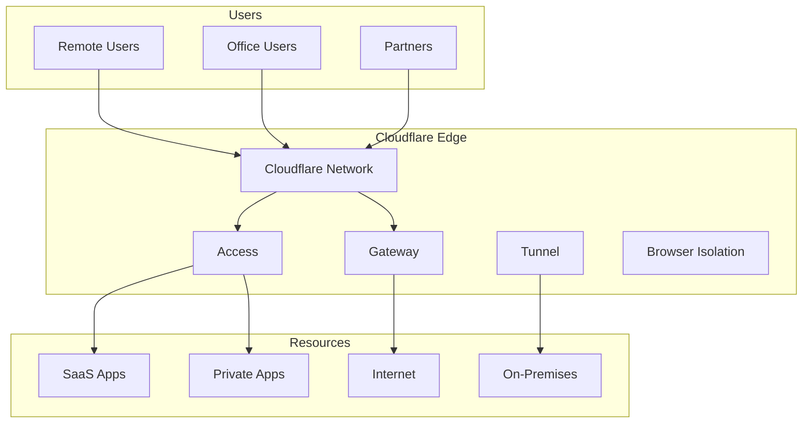

# Implementing Cloudflare Zero Trust: Complete Enterprise Security Guide

## Introduction

Traditional VPN-based network security is rapidly becoming obsolete. With the shift to hybrid work and cloud-first architectures, organizations need a modern approach to security that doesn't rely on network perimeters. Cloudflare Zero Trust provides a comprehensive SASE (Secure Access Service Edge) platform that combines ZTNA, SWG, CASB, and DLP capabilities.

This guide provides a complete implementation roadmap for deploying Cloudflare Zero Trust in enterprise environments, including real-world configurations, best practices, and advanced security patterns.

## Architecture Overview

### Core Components

Cloudflare Zero Trust consists of several integrated components:

1. **Cloudflare Access**: Identity-based access control for applications
2. **Cloudflare Gateway**: Secure web gateway and DNS filtering
3. **Cloudflare Tunnel**: Secure connectivity without exposed IPs
4. **WARP Client**: Device-based security enforcement
5. **Browser Isolation**: Remote browser execution
6. **Data Loss Prevention**: Content inspection and protection

### Network Architecture



## Phase 1: Initial Setup and Planning

### Prerequisites Assessment

Before implementation, evaluate your environment:

```yaml
# prerequisites-checklist.yaml
organization:
  users: 500-5000
  locations: 
    - headquarters
    - branch-offices
    - remote-workers
  
infrastructure:
  identity_provider: 
    - Azure AD
    - Okta
    - Google Workspace
  applications:
    - web-based: 50+
    - client-server: 20+
    - saas: 30+
  
compliance:
  requirements:
    - SOC2
    - ISO27001
    - GDPR
    - HIPAA
```

### Account Configuration

Start with Cloudflare Zero Trust dashboard setup:

```bash
# Initial setup commands
cf-cli login
cf-cli account create --type zero-trust
cf-cli organization setup --name "YourOrg"

# Configure team domain
cf-cli teams configure \
  --domain your-team.cloudflareaccess.com \
  --auth-domain login.yourcompany.com
```

## Phase 2: Identity Provider Integration

### Azure AD Configuration

Configure SAML integration with Azure AD:

```xml
<!-- azure-ad-saml-config.xml -->
<EntityDescriptor entityID="https://your-team.cloudflareaccess.com">
    <SPSSODescriptor AuthnRequestsSigned="false" 
                     WantAssertionsSigned="true"
                     protocolSupportEnumeration="urn:oasis:names:tc:SAML:2.0:protocol">
        <SingleLogoutService Binding="urn:oasis:names:tc:SAML:2.0:bindings:HTTP-POST"
                           Location="https://your-team.cloudflareaccess.com/cdn-cgi/access/slo"/>
        <AssertionConsumerService Binding="urn:oasis:names:tc:SAML:2.0:bindings:HTTP-POST"
                                Location="https://your-team.cloudflareaccess.com/cdn-cgi/access/callback"
                                index="1" isDefault="true"/>
    </SPSSODescriptor>
</EntityDescriptor>
```

### Okta Integration

Configure Okta OIDC integration:

```javascript
// okta-oidc-config.js
const oktaConfig = {
  issuer: 'https://yourcompany.okta.com/oauth2/default',
  clientId: 'your-client-id',
  clientSecret: process.env.OKTA_CLIENT_SECRET,
  redirectUri: 'https://your-team.cloudflareaccess.com/cdn-cgi/access/callback',
  scope: ['openid', 'profile', 'email', 'groups'],
  responseType: 'code',
  grantType: 'authorization_code',
  
  // Custom claims mapping
  claimsMapping: {
    email: 'email',
    name: 'name',
    groups: 'groups',
    department: 'department',
    manager: 'manager'
  }
};
```

## Phase 3: Cloudflare Access Deployment

### Application Protection

Protect internal applications with Access policies:

```typescript
// access-policy-configuration.ts
interface AccessPolicy {
  name: string;
  decision: 'allow' | 'deny' | 'bypass';
  includes: PolicyRule[];
  excludes?: PolicyRule[];
  requires?: PolicyRule[];
}

const internalAppPolicy: AccessPolicy = {
  name: "Internal Dashboard Access",
  decision: "allow",
  includes: [
    {
      type: "group",
      value: ["Engineering", "DevOps", "Security"]
    }
  ],
  requires: [
    {
      type: "device_posture",
      value: ["corporate_device", "compliant"]
    },
    {
      type: "geo",
      value: ["US", "UK", "IN"]
    }
  ],
  excludes: [
    {
      type: "ip",
      value: ["suspicious_ips_list"]
    }
  ]
};

// Apply policy via API
async function createAccessPolicy(policy: AccessPolicy) {
  const response = await fetch(
    `https://api.cloudflare.com/client/v4/accounts/${accountId}/access/apps/${appId}/policies`,
    {
      method: 'POST',
      headers: {
        'Authorization': `Bearer ${apiToken}`,
        'Content-Type': 'application/json'
      },
      body: JSON.stringify(policy)
    }
  );
  return response.json();
}
```

### Service Token Authentication

Implement service-to-service authentication:

```python
# service-token-auth.py
import requests
import jwt
from datetime import datetime, timedelta

class CloudflareServiceAuth:
    def __init__(self, client_id, client_secret, account_id):
        self.client_id = client_id
        self.client_secret = client_secret
        self.account_id = account_id
        self.base_url = f"https://api.cloudflare.com/client/v4/accounts/{account_id}"
        
    def generate_service_token(self, service_name, duration_hours=24):
        """Generate a service token for API access"""
        payload = {
            'service': service_name,
            'iat': datetime.utcnow(),
            'exp': datetime.utcnow() + timedelta(hours=duration_hours),
            'account_id': self.account_id
        }
        
        token = jwt.encode(
            payload,
            self.client_secret,
            algorithm='HS256'
        )
        
        return {
            'CF-Access-Client-Id': self.client_id,
            'CF-Access-Client-Secret': token
        }
    
    def validate_request(self, request_headers):
        """Validate incoming service requests"""
        client_id = request_headers.get('CF-Access-Client-Id')
        client_secret = request_headers.get('CF-Access-Client-Secret')
        
        if not client_id or not client_secret:
            return False
            
        try:
            payload = jwt.decode(
                client_secret,
                self.client_secret,
                algorithms=['HS256']
            )
            return payload['account_id'] == self.account_id
        except jwt.InvalidTokenError:
            return False
```

## Phase 4: Cloudflare Gateway Configuration

### DNS Filtering Policies

Implement comprehensive DNS security:

```yaml
# gateway-dns-policies.yaml
dns_policies:
  - name: "Block Malware Domains"
    priority: 1
    enabled: true
    action: block
    filters:
      - type: security_category
        value: 
          - malware
          - phishing
          - cryptomining
          - botnet
    
  - name: "Block Social Media"
    priority: 2
    enabled: true
    schedule: "business_hours"
    action: block
    filters:
      - type: content_category
        value:
          - social_networking
          - instant_messaging
    exclusions:
      - groups: ["Marketing", "HR"]
    
  - name: "Allow Security Tools"
    priority: 3
    enabled: true
    action: allow
    filters:
      - type: domain
        value:
          - "*.virustotal.com"
          - "*.malwarebytes.com"
          - "*.crowdstrike.com"
    
  - name: "DGA Detection"
    priority: 4
    enabled: true
    action: isolate
    filters:
      - type: dga_detection
        threshold: high
    notifications:
      - email: security@company.com
      - webhook: https://siem.company.com/webhook
```

### HTTP Inspection Rules

Configure L7 firewall rules:

```rust
// http-inspection-rules.rs
use serde::{Deserialize, Serialize};

#[derive(Debug, Serialize, Deserialize)]
struct HttpPolicy {
    name: String,
    enabled: bool,
    action: Action,
    filters: Vec<Filter>,
    data_loss_prevention: Option<DlpConfig>,
}

#[derive(Debug, Serialize, Deserialize)]
enum Action {
    Allow,
    Block,
    Isolate,
    Log,
    Challenge,
}

#[derive(Debug, Serialize, Deserialize)]
struct Filter {
    filter_type: FilterType,
    operator: Operator,
    value: String,
}

#[derive(Debug, Serialize, Deserialize)]
enum FilterType {
    Url,
    Domain,
    HttpMethod,
    HttpHeader,
    FileType,
    FileSize,
    ContentType,
}

impl HttpPolicy {
    fn create_file_upload_policy() -> Self {
        HttpPolicy {
            name: "Restrict File Uploads".to_string(),
            enabled: true,
            action: Action::Block,
            filters: vec![
                Filter {
                    filter_type: FilterType::HttpMethod,
                    operator: Operator::Equals,
                    value: "POST".to_string(),
                },
                Filter {
                    filter_type: FilterType::FileType,
                    operator: Operator::In,
                    value: "exe,dll,scr,bat,cmd,com".to_string(),
                },
            ],
            data_loss_prevention: Some(DlpConfig {
                enabled: true,
                profiles: vec!["credit_cards", "ssn", "api_keys"],
            }),
        }
    }
    
    fn create_shadow_it_detection() -> Self {
        HttpPolicy {
            name: "Detect Shadow IT".to_string(),
            enabled: true,
            action: Action::Log,
            filters: vec![
                Filter {
                    filter_type: FilterType::Domain,
                    operator: Operator::NotIn,
                    value: "approved_saas_list.txt".to_string(),
                },
                Filter {
                    filter_type: FilterType::ContentType,
                    operator: Operator::Contains,
                    value: "application".to_string(),
                },
            ],
            data_loss_prevention: None,
        }
    }
}
```

## Phase 5: WARP Client Deployment

### Windows Deployment via GPO

Deploy WARP client using Group Policy:

```powershell
# deploy-warp-gpo.ps1
[CmdletBinding()]
param(
    [Parameter(Mandatory=$true)]
    [string]$OrganizationId,
    
    [Parameter(Mandatory=$true)]
    [string]$AuthToken,
    
    [Parameter(Mandatory=$false)]
    [string]$GpoName = "Cloudflare WARP Deployment"
)

function Deploy-WARPClient {
    # Create GPO for WARP deployment
    $gpo = New-GPO -Name $GpoName -Comment "Deploys Cloudflare WARP client"
    
    # Configure WARP MSI deployment
    $warpMsi = "\\domain\sysvol\domain\software\Cloudflare_WARP.msi"
    
    # Create MST transform file with configuration
    $mstContent = @"
ORGANIZATION_ID=$OrganizationId
AUTH_TOKEN=$AuthToken
ENABLE_AUTOUPDATE=1
GATEWAY_UNIQUE_ID=auto
SERVICE_MODE=warp
SUPPORT_URL=https://helpdesk.company.com
"@
    
    $mstPath = "\\domain\sysvol\domain\software\WARP_Config.mst"
    $mstContent | Out-File -FilePath $mstPath
    
    # Add software installation policy
    Set-GPRegistryValue -Name $GpoName -Key "HKLM\Software\Policies\Cloudflare\WARP" `
        -ValueName "OrganizationID" -Type String -Value $OrganizationId
    
    # Configure automatic connection
    Set-GPRegistryValue -Name $GpoName -Key "HKLM\Software\Policies\Cloudflare\WARP" `
        -ValueName "AutoConnect" -Type DWord -Value 1
    
    # Set switch lock to prevent users from disabling
    Set-GPRegistryValue -Name $GpoName -Key "HKLM\Software\Policies\Cloudflare\WARP" `
        -ValueName "SwitchLocked" -Type DWord -Value 1
    
    # Link GPO to domain
    New-GPLink -Name $GpoName -Target "OU=Computers,DC=company,DC=com" -LinkEnabled Yes
    
    Write-Host "WARP deployment GPO created and linked successfully"
}

# Execute deployment
Deploy-WARPClient
```

### macOS Deployment via MDM

Deploy WARP using Jamf or other MDM:

```xml
<!-- warp-mdm-profile.mobileconfig -->
<?xml version="1.0" encoding="UTF-8"?>
<!DOCTYPE plist PUBLIC "-//Apple//DTD PLIST 1.0//EN" "http://www.apple.com/DTDs/PropertyList-1.0.dtd">
<plist version="1.0">
<dict>
    <key>PayloadContent</key>
    <array>
        <dict>
            <key>PayloadType</key>
            <string>com.cloudflare.warp</string>
            <key>PayloadVersion</key>
            <integer>1</integer>
            <key>PayloadIdentifier</key>
            <string>com.company.cloudflare.warp</string>
            <key>PayloadUUID</key>
            <string>A4B5C6D7-E8F9-4A5B-C6D7-E8F9A5B6C7D8</string>
            <key>PayloadDisplayName</key>
            <string>Cloudflare WARP Configuration</string>
            <key>organization_id</key>
            <string>YOUR_ORG_ID</string>
            <key>auth_token</key>
            <string>YOUR_AUTH_TOKEN</string>
            <key>auto_connect</key>
            <true/>
            <key>switch_locked</key>
            <true/>
            <key>service_mode</key>
            <string>warp</string>
            <key>support_url</key>
            <string>https://helpdesk.company.com</string>
        </dict>
    </array>
</dict>
</plist>
```

### Linux Deployment Script

Automated Linux deployment:

```bash
#!/bin/bash
# deploy-warp-linux.sh

set -euo pipefail

# Configuration
ORG_ID="${CLOUDFLARE_ORG_ID}"
AUTH_TOKEN="${CLOUDFLARE_AUTH_TOKEN}"
WARP_VERSION="2024.1.0"

# Color codes for output
RED='\033[0;31m'
GREEN='\033[0;32m'
YELLOW='\033[1;33m'
NC='\033[0m' # No Color

log_info() {
    echo -e "${GREEN}[INFO]${NC} $1"
}

log_error() {
    echo -e "${RED}[ERROR]${NC} $1"
}

log_warning() {
    echo -e "${YELLOW}[WARNING]${NC} $1"
}

# Detect Linux distribution
detect_distro() {
    if [ -f /etc/os-release ]; then
        . /etc/os-release
        OS=$ID
        VER=$VERSION_ID
    else
        log_error "Cannot detect Linux distribution"
        exit 1
    fi
}

# Install WARP client
install_warp() {
    detect_distro
    
    case $OS in
        ubuntu|debian)
            log_info "Installing WARP on Debian/Ubuntu"
            curl -fsSL https://pkg.cloudflareclient.com/pubkey.gpg | sudo gpg --yes --dearmor --output /usr/share/keyrings/cloudflare-warp-archive-keyring.gpg
            echo "deb [arch=amd64 signed-by=/usr/share/keyrings/cloudflare-warp-archive-keyring.gpg] https://pkg.cloudflareclient.com/ $(lsb_release -cs) main" | sudo tee /etc/apt/sources.list.d/cloudflare-client.list
            sudo apt-get update
            sudo apt-get install -y cloudflare-warp
            ;;
            
        rhel|centos|fedora|rocky|alma)
            log_info "Installing WARP on RHEL/CentOS/Fedora"
            sudo rpm -ivh https://pkg.cloudflareclient.com/cloudflare-release-el$(rpm -E %{rhel}).rpm
            sudo yum install -y cloudflare-warp
            ;;
            
        arch|manjaro)
            log_info "Installing WARP on Arch Linux"
            yay -S cloudflare-warp-bin --noconfirm
            ;;
            
        *)
            log_error "Unsupported distribution: $OS"
            exit 1
            ;;
    esac
}

# Configure WARP
configure_warp() {
    log_info "Configuring WARP client"
    
    # Register with organization
    warp-cli register --accept-tos
    warp-cli set-teams-auth-token "${AUTH_TOKEN}"
    
    # Configure settings
    warp-cli set-mode warp
    warp-cli set-families-mode full
    warp-cli set-custom-endpoint "${ORG_ID}.cloudflareclient.com:2408"
    
    # Enable always-on
    warp-cli set-always-on true
    
    # Start and enable service
    sudo systemctl enable --now warp-svc
    
    # Connect
    warp-cli connect
    
    # Verify connection
    sleep 5
    if warp-cli status | grep -q "Connected"; then
        log_info "WARP successfully connected"
    else
        log_error "WARP connection failed"
        exit 1
    fi
}

# Create systemd service for auto-reconnect
create_auto_reconnect_service() {
    log_info "Creating auto-reconnect service"
    
    cat << 'EOF' | sudo tee /etc/systemd/system/warp-reconnect.service
[Unit]
Description=Cloudflare WARP Auto-Reconnect
After=network-online.target
Wants=network-online.target

[Service]
Type=simple
ExecStart=/usr/local/bin/warp-reconnect.sh
Restart=always
RestartSec=30

[Install]
WantedBy=multi-user.target
EOF

    cat << 'EOF' | sudo tee /usr/local/bin/warp-reconnect.sh
#!/bin/bash
while true; do
    if ! warp-cli status | grep -q "Connected"; then
        warp-cli connect
    fi
    sleep 60
done
EOF

    sudo chmod +x /usr/local/bin/warp-reconnect.sh
    sudo systemctl daemon-reload
    sudo systemctl enable --now warp-reconnect.service
}

# Main execution
main() {
    log_info "Starting Cloudflare WARP deployment"
    
    # Check if running as root
    if [[ $EUID -eq 0 ]]; then
        log_error "This script should not be run as root"
        exit 1
    fi
    
    # Install WARP
    install_warp
    
    # Configure WARP
    configure_warp
    
    # Setup auto-reconnect
    create_auto_reconnect_service
    
    log_info "WARP deployment completed successfully"
}

main "$@"
```

## Phase 6: Device Posture Checks

### Comprehensive Device Trust

Implement device posture policies:

```typescript
// device-posture-policies.ts
interface DevicePostureRule {
  name: string;
  type: PostureType;
  schedule?: string;
  platforms: Platform[];
  checks: PostureCheck[];
  remediation?: RemediationAction;
}

enum PostureType {
  FILE = 'file',
  PROCESS = 'process',
  REGISTRY = 'registry',
  CERTIFICATE = 'certificate',
  OS_VERSION = 'os_version',
  DISK_ENCRYPTION = 'disk_encryption',
  FIREWALL = 'firewall',
  ANTIVIRUS = 'antivirus',
  PATCH_LEVEL = 'patch_level'
}

const enterprisePostureRules: DevicePostureRule[] = [
  {
    name: "Endpoint Protection",
    type: PostureType.PROCESS,
    platforms: [Platform.WINDOWS, Platform.MAC],
    checks: [
      {
        windows: {
          process: "CrowdStrike Windows Sensor",
          running: true
        },
        mac: {
          process: "com.crowdstrike.falcon",
          running: true
        }
      }
    ],
    remediation: {
      message: "CrowdStrike Falcon must be installed and running",
      url: "https://helpdesk.company.com/install-crowdstrike"
    }
  },
  {
    name: "Disk Encryption",
    type: PostureType.DISK_ENCRYPTION,
    platforms: [Platform.ALL],
    checks: [
      {
        windows: {
          bitlocker: true,
          min_version: "2.0"
        },
        mac: {
          filevault: true
        },
        linux: {
          luks: true
        }
      }
    ]
  },
  {
    name: "OS Security Patches",
    type: PostureType.PATCH_LEVEL,
    platforms: [Platform.ALL],
    checks: [
      {
        max_days_since_last_update: 30,
        critical_updates_required: true
      }
    ]
  },
  {
    name: "Corporate Certificate",
    type: PostureType.CERTIFICATE,
    platforms: [Platform.ALL],
    checks: [
      {
        certificate_authority: "CN=Company Root CA, O=Company Inc",
        valid: true,
        not_expired: true
      }
    ]
  }
];
```

## Phase 7: Cloudflare Tunnel Deployment

### Secure Application Exposure

Deploy Cloudflare Tunnel for zero-trust application access:

```yaml
# cloudflared-config.yaml
tunnel: your-tunnel-id
credentials-file: /etc/cloudflared/credentials.json

ingress:
  # Internal dashboard with device posture check
  - hostname: dashboard.company.com
    service: http://internal-dashboard:8080
    originRequest:
      noTLSVerify: false
      caPool: /etc/ssl/certs/company-ca.crt
      clientCert:
        cert: /etc/cloudflared/client.crt
        key: /etc/cloudflared/client.key
      connectTimeout: 30s
      tcpKeepAlive: 30s
      
  # API with mTLS
  - hostname: api.company.com
    service: https://api-gateway:443
    originRequest:
      http2Origin: true
      originServerName: api.internal.company.com
      
  # WebSocket application
  - hostname: realtime.company.com
    service: ws://websocket-server:8080
    originRequest:
      noTLSVerify: true
      
  # SSH bastion via browser
  - hostname: ssh.company.com
    service: ssh://bastion.internal:22
    
  # Catch-all rule
  - service: http_status:404
```

### High Availability Tunnel Setup

Deploy redundant tunnels with load balancing:

```bash
#!/bin/bash
# ha-tunnel-setup.sh

# Deploy primary tunnel
docker run -d \
  --name cloudflared-primary \
  --restart unless-stopped \
  -v /etc/cloudflared:/etc/cloudflared \
  cloudflare/cloudflared:latest \
  tunnel --config /etc/cloudflared/config-primary.yaml run

# Deploy secondary tunnel
docker run -d \
  --name cloudflared-secondary \
  --restart unless-stopped \
  -v /etc/cloudflared:/etc/cloudflared \
  cloudflare/cloudflared:latest \
  tunnel --config /etc/cloudflared/config-secondary.yaml run

# Health check monitoring
cat << 'EOF' > /usr/local/bin/tunnel-health-check.sh
#!/bin/bash
PRIMARY_STATUS=$(docker inspect cloudflared-primary --format='{{.State.Status}}')
SECONDARY_STATUS=$(docker inspect cloudflared-secondary --format='{{.State.Status}}')

if [[ "$PRIMARY_STATUS" != "running" ]]; then
    echo "Primary tunnel down, attempting restart"
    docker restart cloudflared-primary
    # Send alert
    curl -X POST https://alerts.company.com/webhook \
      -H "Content-Type: application/json" \
      -d '{"alert": "Cloudflare primary tunnel restarted"}'
fi

if [[ "$SECONDARY_STATUS" != "running" ]]; then
    echo "Secondary tunnel down, attempting restart"
    docker restart cloudflared-secondary
    # Send alert
    curl -X POST https://alerts.company.com/webhook \
      -H "Content-Type: application/json" \
      -d '{"alert": "Cloudflare secondary tunnel restarted"}'
fi
EOF

chmod +x /usr/local/bin/tunnel-health-check.sh

# Add to crontab
(crontab -l 2>/dev/null; echo "*/5 * * * * /usr/local/bin/tunnel-health-check.sh") | crontab -
```

## Phase 8: Browser Isolation

### Risky Site Isolation

Configure automatic browser isolation for risky sites:

```javascript
// browser-isolation-rules.js
const isolationPolicies = [
  {
    name: "Isolate Uncategorized Sites",
    enabled: true,
    action: "isolate",
    filters: {
      content_categories: ["uncategorized", "newly_registered_domains"],
      risk_score: {
        min: 70
      }
    },
    isolation_settings: {
      disable_copy_paste: false,
      disable_printing: true,
      disable_keyboard: false,
      disable_upload: true,
      disable_download: false
    }
  },
  {
    name: "Isolate External File Sharing",
    enabled: true,
    action: "isolate",
    filters: {
      domains: [
        "*.wetransfer.com",
        "*.dropbox.com",
        "*.box.com",
        "*.mega.nz"
      ]
    },
    isolation_settings: {
      disable_copy_paste: true,
      disable_upload: false,
      disable_download: false,
      log_keystrokes: true
    }
  },
  {
    name: "Isolate Personal Email",
    enabled: true,
    action: "isolate",
    filters: {
      domains: [
        "*.gmail.com",
        "*.yahoo.com",
        "*.outlook.com",
        "*.protonmail.com"
      ]
    },
    exclusions: {
      groups: ["HR", "Legal"]
    }
  }
];
```

## Phase 9: Data Loss Prevention

### DLP Profile Configuration

Implement comprehensive DLP policies:

```python
# dlp-configuration.py
from dataclasses import dataclass
from typing import List, Dict, Optional
from enum import Enum

class DLPAction(Enum):
    ALLOW = "allow"
    BLOCK = "block"
    LOG = "log"
    REDACT = "redact"
    ENCRYPT = "encrypt"

@dataclass
class DLPProfile:
    name: str
    enabled: bool
    patterns: List[Dict]
    action: DLPAction
    severity: str
    notification: Optional[Dict]

class DLPEngine:
    def __init__(self):
        self.profiles = []
        
    def create_credit_card_profile(self):
        return DLPProfile(
            name="Credit Card Protection",
            enabled=True,
            patterns=[
                {
                    "type": "regex",
                    "pattern": r"\b(?:4[0-9]{12}(?:[0-9]{3})?|5[1-5][0-9]{14}|3[47][0-9]{13}|3(?:0[0-5]|[68][0-9])[0-9]{11}|6(?:011|5[0-9]{2})[0-9]{12}|(?:2131|1800|35\d{3})\d{11})\b",
                    "validation": "luhn_check"
                }
            ],
            action=DLPAction.BLOCK,
            severity="critical",
            notification={
                "email": ["security@company.com", "compliance@company.com"],
                "siem": "https://siem.company.com/api/dlp-alert"
            }
        )
    
    def create_pii_profile(self):
        return DLPProfile(
            name="PII Protection",
            enabled=True,
            patterns=[
                {
                    "type": "regex",
                    "pattern": r"\b\d{3}-\d{2}-\d{4}\b",  # SSN
                    "context": ["ssn", "social security", "tax id"]
                },
                {
                    "type": "regex",
                    "pattern": r"\b[A-Z]{1,2}[0-9]{6}[A-Z]?\b",  # UK National Insurance
                    "context": ["ni number", "national insurance"]
                },
                {
                    "type": "keyword_proximity",
                    "keywords": ["passport", "license", "dl", "driver"],
                    "pattern": r"\b[A-Z0-9]{6,9}\b",
                    "distance": 10
                }
            ],
            action=DLPAction.REDACT,
            severity="high",
            notification={
                "email": ["privacy@company.com"],
                "webhook": "https://privacy.company.com/webhook"
            }
        )
    
    def create_source_code_profile(self):
        return DLPProfile(
            name="Source Code Protection",
            enabled=True,
            patterns=[
                {
                    "type": "file_fingerprint",
                    "extensions": [".py", ".js", ".ts", ".java", ".go", ".rs"],
                    "min_lines": 50
                },
                {
                    "type": "entropy",
                    "threshold": 4.5,
                    "min_length": 20,
                    "context": ["api", "key", "token", "secret", "password"]
                },
                {
                    "type": "regex",
                    "pattern": r"(?i)(api[_-]?key|api[_-]?secret|access[_-]?token|private[_-]?key|client[_-]?secret)[\s]*[:=][\s]*['\"]?([a-zA-Z0-9_\-]+)['\"]?",
                    "capture_group": 2
                }
            ],
            action=DLPAction.BLOCK,
            severity="critical",
            notification={
                "email": ["security@company.com", "engineering@company.com"],
                "slack": "#security-alerts"
            }
        )
```

## Phase 10: Analytics and Monitoring

### Security Analytics Dashboard

Implement comprehensive monitoring:

```typescript
// analytics-dashboard.ts
import { CloudflareAPI } from '@cloudflare/client';

class SecurityAnalytics {
  private api: CloudflareAPI;
  private metrics: Map<string, any>;
  
  constructor(apiToken: string, accountId: string) {
    this.api = new CloudflareAPI({ token: apiToken, accountId });
    this.metrics = new Map();
  }
  
  async collectSecurityMetrics(): Promise<SecurityMetrics> {
    const [
      accessLogs,
      gatewayLogs,
      dlpEvents,
      devicePosture,
      threatIntel
    ] = await Promise.all([
      this.getAccessLogs(),
      this.getGatewayLogs(),
      this.getDLPEvents(),
      this.getDevicePostureStatus(),
      this.getThreatIntelligence()
    ]);
    
    return {
      timestamp: new Date(),
      access: {
        total_requests: accessLogs.total,
        blocked_requests: accessLogs.blocked,
        unique_users: accessLogs.unique_users,
        failed_auth: accessLogs.failed_auth,
        top_applications: accessLogs.top_apps
      },
      gateway: {
        total_requests: gatewayLogs.total,
        blocked_domains: gatewayLogs.blocked,
        malware_detected: gatewayLogs.malware,
        categories_blocked: gatewayLogs.categories,
        isolated_sessions: gatewayLogs.isolated
      },
      dlp: {
        incidents: dlpEvents.total,
        critical: dlpEvents.critical,
        files_blocked: dlpEvents.files_blocked,
        data_exfiltration_attempts: dlpEvents.exfil_attempts
      },
      devices: {
        total: devicePosture.total,
        compliant: devicePosture.compliant,
        non_compliant: devicePosture.non_compliant,
        pending_remediation: devicePosture.pending
      },
      threats: {
        high_risk_users: threatIntel.users,
        suspicious_activities: threatIntel.activities,
        zero_day_blocks: threatIntel.zero_days
      }
    };
  }
  
  async generateExecutiveReport(): Promise<ExecutiveReport> {
    const metrics = await this.collectSecurityMetrics();
    
    return {
      executive_summary: {
        risk_score: this.calculateRiskScore(metrics),
        compliance_status: this.assessCompliance(metrics),
        roi_metrics: this.calculateROI(metrics),
        recommendations: this.generateRecommendations(metrics)
      },
      detailed_findings: {
        top_threats: this.identifyTopThreats(metrics),
        user_behavior: this.analyzeUserBehavior(metrics),
        security_posture: this.assessSecurityPosture(metrics)
      }
    };
  }
}
```

### Real-time Alerting

Configure alerting for security events:

```yaml
# alerting-rules.yaml
alerting_rules:
  - name: "Multiple Failed Authentications"
    condition:
      metric: failed_auth_attempts
      threshold: 5
      window: 5m
      group_by: user_email
    severity: high
    actions:
      - type: email
        recipients: ["security@company.com"]
      - type: slack
        channel: "#security-alerts"
      - type: pagerduty
        service_key: "${PAGERDUTY_KEY}"
    
  - name: "Data Exfiltration Attempt"
    condition:
      metric: data_upload_size
      threshold: 100MB
      window: 1h
      filters:
        - destination_category: ["file_sharing", "personal_storage"]
    severity: critical
    actions:
      - type: block_user
        duration: immediate
      - type: isolate_device
      - type: siem_event
        endpoint: "https://siem.company.com/api/critical"
    
  - name: "Malware Detection"
    condition:
      event: malware_detected
    severity: critical
    actions:
      - type: quarantine_device
      - type: disable_user
      - type: incident_response
        team: security_ops
```

## Phase 11: Integration with Security Stack

### SIEM Integration

Integrate with Splunk/Elastic/QRadar:

```python
# siem-integration.py
import asyncio
import aiohttp
from typing import List, Dict
import json

class CloudflareSIEMConnector:
    def __init__(self, cf_api_token: str, siem_config: Dict):
        self.cf_token = cf_api_token
        self.siem_config = siem_config
        self.session = None
        
    async def __aenter__(self):
        self.session = aiohttp.ClientSession()
        return self
        
    async def __aexit__(self, exc_type, exc_val, exc_tb):
        await self.session.close()
        
    async def stream_logs_to_siem(self):
        """Stream Cloudflare logs to SIEM in real-time"""
        async with self.session.ws_connect(
            'wss://api.cloudflare.com/client/v4/accounts/{}/stream'.format(
                self.siem_config['cf_account_id']
            ),
            headers={'Authorization': f'Bearer {self.cf_token}'}
        ) as ws:
            async for msg in ws:
                if msg.type == aiohttp.WSMsgType.TEXT:
                    log_data = json.loads(msg.data)
                    enriched_log = await self.enrich_log(log_data)
                    await self.send_to_siem(enriched_log)
                    
    async def enrich_log(self, log: Dict) -> Dict:
        """Enrich log with additional context"""
        enriched = log.copy()
        
        # Add GeoIP information
        if 'client_ip' in log:
            enriched['geo'] = await self.get_geoip(log['client_ip'])
            
        # Add user context
        if 'user_email' in log:
            enriched['user_context'] = await self.get_user_context(log['user_email'])
            
        # Add threat intelligence
        enriched['threat_intel'] = await self.check_threat_intel(log)
        
        return enriched
        
    async def send_to_siem(self, log: Dict):
        """Send enriched log to SIEM"""
        siem_endpoint = self.siem_config['endpoint']
        
        # Format for specific SIEM
        if self.siem_config['type'] == 'splunk':
            formatted_log = self.format_for_splunk(log)
            endpoint = f"{siem_endpoint}/services/collector/event"
            headers = {'Authorization': f"Splunk {self.siem_config['token']}"}
            
        elif self.siem_config['type'] == 'elastic':
            formatted_log = self.format_for_elastic(log)
            endpoint = f"{siem_endpoint}/_bulk"
            headers = {'Authorization': f"Bearer {self.siem_config['token']}"}
            
        await self.session.post(endpoint, json=formatted_log, headers=headers)
```

## Phase 12: Compliance and Reporting

### Compliance Automation

Automate compliance reporting:

```typescript
// compliance-automation.ts
class ComplianceReporter {
  private standards = ['SOC2', 'ISO27001', 'GDPR', 'HIPAA', 'PCI-DSS'];
  
  async generateComplianceReport(standard: string): Promise<ComplianceReport> {
    const controls = await this.getControlsForStandard(standard);
    const evidence = await this.collectEvidence(controls);
    
    return {
      standard,
      reportDate: new Date(),
      complianceScore: this.calculateComplianceScore(evidence),
      controls: controls.map(control => ({
        id: control.id,
        description: control.description,
        status: this.assessControlStatus(control, evidence),
        evidence: evidence[control.id],
        gaps: this.identifyGaps(control, evidence),
        recommendations: this.generateRemediation(control, evidence)
      })),
      executive_summary: this.generateExecutiveSummary(standard, evidence)
    };
  }
  
  private async collectEvidence(controls: Control[]): Promise<Evidence> {
    const evidence: Evidence = {};
    
    for (const control of controls) {
      evidence[control.id] = {
        access_logs: await this.getAccessLogsForControl(control),
        policy_configs: await this.getPolicyConfigs(control),
        device_compliance: await this.getDeviceCompliance(control),
        dlp_reports: await this.getDLPReports(control),
        user_activity: await this.getUserActivity(control)
      };
    }
    
    return evidence;
  }
}
```

## Best Practices and Recommendations

### Security Hardening

1. **Enable mTLS for all internal communications**
2. **Implement least privilege access policies**
3. **Regular security posture assessments**
4. **Automated compliance scanning**
5. **Continuous threat intelligence integration**

### Performance Optimization

1. **Use regional Cloudflare endpoints**
2. **Implement smart routing policies**
3. **Cache frequently accessed resources**
4. **Optimize tunnel configurations**
5. **Monitor and tune Gateway rules**

### Operational Excellence

1. **Implement GitOps for policy management**
2. **Automate user provisioning/deprovisioning**
3. **Regular disaster recovery testing**
4. **Comprehensive logging and monitoring**
5. **Incident response automation**

## Troubleshooting Guide

### Common Issues and Solutions

```bash
# Troubleshooting commands

# Check WARP connection status
warp-cli status
warp-cli account
warp-cli settings

# Debug Gateway policies
curl -H "CF-Access-Client-Id: ${CLIENT_ID}" \
     -H "CF-Access-Client-Secret: ${CLIENT_SECRET}" \
     https://api.cloudflare.com/client/v4/accounts/${ACCOUNT_ID}/gateway/rules

# Test Access policies
curl -I https://app.company.com
# Check response headers for CF-Access-* headers

# Verify Tunnel connectivity
cloudflared tunnel info ${TUNNEL_ID}
cloudflared tunnel run --diagnostics

# Check device posture
warp-cli posture

# Monitor real-time logs
tail -f /var/log/cloudflared.log
journalctl -u cloudflared -f
```

## Conclusion

Implementing Cloudflare Zero Trust provides a robust, scalable security architecture that eliminates traditional VPN dependencies while providing superior security controls. This guide covered enterprise deployment patterns, from initial setup through advanced integrations.

Key takeaways:
- Zero Trust is a journey, not a destination
- Start with high-value applications and expand gradually
- Automate everything possible for consistency
- Monitor continuously and adjust policies based on insights
- Regular training and documentation are essential

For ongoing updates and advanced configurations, refer to the Cloudflare Zero Trust documentation and join the community forums for peer insights and support.

---

*Last updated: January 10, 2025*
*Version: 2.0*
*Author: Anubhav Gain - Security Software Engineer*