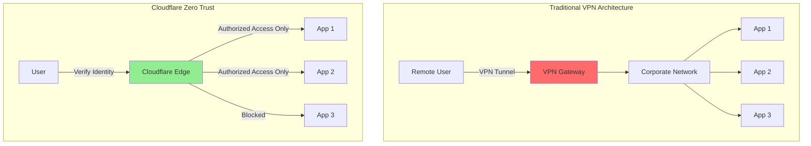

# Cloudflare Zero Trust: Building Modern Security Architecture Without VPNs

## Introduction

Cloudflare Zero Trust revolutionizes enterprise security by replacing traditional VPNs with a modern, cloud-native security perimeter. This comprehensive platform combines **ZTNA (Zero Trust Network Access)**, **SWG (Secure Web Gateway)**, **CASB (Cloud Access Security Broker)**, and **DLP (Data Loss Prevention)** into a unified solution.

### Traditional VPN vs Zero Trust



## Core Components

### 1. Cloudflare Access (ZTNA)
- Identity-based application access
- No VPN required
- Supports SAML, OIDC, OAuth providers
- Device posture checks

### 2. Cloudflare Gateway (SWG)
- DNS filtering
- HTTP/S inspection
- Network firewall
- Cloud malware scanning

### 3. Cloudflare CASB
- SaaS application security
- Shadow IT discovery
- API-driven integration
- Data protection policies

### 4. Cloudflare DLP
- Sensitive data detection
- Content inspection
- File type controls
- Custom detection patterns

## Getting Started

### Prerequisites

```bash
# Required accounts and tools
- Cloudflare account (Zero Trust plan)
- Domain added to Cloudflare
- WARP client for endpoints
- Identity provider (Okta, Azure AD, Google, etc.)
```

### Initial Setup

```bash
# 1. Enable Zero Trust in Cloudflare Dashboard
# Navigate to: Zero Trust → Settings

# 2. Configure team domain
# Example: yourcompany.cloudflareaccess.com

# 3. Install cloudflared for tunnels
wget https://github.com/cloudflare/cloudflared/releases/latest/download/cloudflared-linux-amd64
chmod +x cloudflared-linux-amd64
sudo mv cloudflared-linux-amd64 /usr/local/bin/cloudflared

# 4. Authenticate
cloudflared tunnel login
```

## Cloudflare Tunnels Configuration

### Creating Secure Tunnels

```bash
# Create tunnel
cloudflared tunnel create production-apps

# List tunnels
cloudflared tunnel list

# Create configuration file
cat > ~/.cloudflared/config.yml << EOF
tunnel: <TUNNEL_ID>
credentials-file: /home/user/.cloudflared/<TUNNEL_ID>.json

ingress:
  - hostname: app.example.com
    service: http://localhost:3000
  - hostname: api.example.com
    service: http://localhost:8080
  - hostname: admin.example.com
    service: ssh://localhost:22
  - service: http_status:404
EOF

# Run tunnel
cloudflared tunnel run production-apps
```

### Docker Deployment

```dockerfile
# Dockerfile for cloudflared
FROM cloudflare/cloudflared:latest
COPY config.yml /etc/cloudflared/config.yml
COPY tunnel-credentials.json /etc/cloudflared/creds.json
CMD ["tunnel", "--config", "/etc/cloudflared/config.yml", "run"]
```

```yaml
# docker-compose.yml
version: '3.8'
services:
  cloudflared:
    image: cloudflare/cloudflared:latest
    command: tunnel run
    environment:
      TUNNEL_TOKEN: ${TUNNEL_TOKEN}
    restart: unless-stopped
    networks:
      - internal
      
  webapp:
    image: nginx:latest
    networks:
      - internal
    expose:
      - "80"
      
networks:
  internal:
    driver: bridge
```

## Access Policies Implementation

### Application Access Rules

```javascript
// Access policy configuration via API
const axios = require('axios');

const CF_ACCOUNT_ID = process.env.CF_ACCOUNT_ID;
const CF_API_TOKEN = process.env.CF_API_TOKEN;

async function createAccessApplication() {
  const application = {
    name: "Internal Dashboard",
    domain: "dashboard.example.com",
    type: "self_hosted",
    session_duration: "24h",
    allowed_idps: ["azure-ad"],
    auto_redirect_to_identity: true,
    enable_binding_cookie: true,
    http_only_cookie_attribute: true,
    same_site_cookie_attribute: "lax",
    logo_url: "https://example.com/logo.png",
    app_launcher_visible: true,
    service_auth_401_redirect: true
  };
  
  const response = await axios.post(
    `https://api.cloudflare.com/client/v4/accounts/${CF_ACCOUNT_ID}/access/apps`,
    application,
    {
      headers: {
        'Authorization': `Bearer ${CF_API_TOKEN}`,
        'Content-Type': 'application/json'
      }
    }
  );
  
  return response.data.result;
}

async function createAccessPolicy(appId) {
  const policy = {
    name: "Engineering Team Access",
    decision: "allow",
    precedence: 1,
    include: [
      {
        group: {
          id: "engineering-group-id"
        }
      },
      {
        email_domain: {
          domain: "example.com"
        }
      }
    ],
    exclude: [
      {
        email: {
          email: "contractor@external.com"
        }
      }
    ],
    require: [
      {
        device_posture: {
          integration_uid: "device-trust-uid"
        }
      },
      {
        geo: {
          country_code: ["US", "GB", "DE"]
        }
      }
    ]
  };
  
  const response = await axios.post(
    `https://api.cloudflare.com/client/v4/accounts/${CF_ACCOUNT_ID}/access/apps/${appId}/policies`,
    policy,
    {
      headers: {
        'Authorization': `Bearer ${CF_API_TOKEN}`,
        'Content-Type': 'application/json'
      }
    }
  );
  
  return response.data.result;
}
```

### Service Token Authentication

```javascript
// Service-to-service authentication
const jwt = require('jsonwebtoken');
const axios = require('axios');

class CloudflareServiceAuth {
  constructor(clientId, clientSecret) {
    this.clientId = clientId;
    this.clientSecret = clientSecret;
    this.token = null;
    this.tokenExpiry = null;
  }
  
  async getToken() {
    if (this.token && this.tokenExpiry > Date.now()) {
      return this.token;
    }
    
    const response = await axios.post(
      'https://example.cloudflareaccess.com/cdn-cgi/access/get-identity',
      {},
      {
        headers: {
          'CF-Access-Client-Id': this.clientId,
          'CF-Access-Client-Secret': this.clientSecret
        }
      }
    );
    
    this.token = response.headers['cf-access-token'];
    const decoded = jwt.decode(this.token);
    this.tokenExpiry = decoded.exp * 1000;
    
    return this.token;
  }
  
  async makeAuthenticatedRequest(url, options = {}) {
    const token = await this.getToken();
    
    return axios({
      ...options,
      url,
      headers: {
        ...options.headers,
        'CF-Access-Token': token
      }
    });
  }
}

// Usage
const serviceAuth = new CloudflareServiceAuth(
  process.env.CF_SERVICE_CLIENT_ID,
  process.env.CF_SERVICE_CLIENT_SECRET
);

const response = await serviceAuth.makeAuthenticatedRequest(
  'https://api.example.com/data'
);
```

## Gateway Policies

### DNS Filtering Rules

```python
# Python script for managing Gateway DNS policies
import requests
import json

class CloudflareGateway:
    def __init__(self, account_id, api_token):
        self.account_id = account_id
        self.api_token = api_token
        self.base_url = f"https://api.cloudflare.com/client/v4/accounts/{account_id}"
        self.headers = {
            "Authorization": f"Bearer {api_token}",
            "Content-Type": "application/json"
        }
    
    def create_dns_policy(self, name, traffic, rule_settings):
        """Create DNS filtering policy"""
        policy = {
            "name": name,
            "description": f"DNS policy for {name}",
            "action": "block",
            "enabled": True,
            "traffic": traffic,
            "rule_settings": rule_settings,
            "precedence": 1
        }
        
        response = requests.post(
            f"{self.base_url}/gateway/rules",
            headers=self.headers,
            json=policy
        )
        return response.json()
    
    def block_categories(self):
        """Block malicious and inappropriate categories"""
        categories = [
            "security_threats",
            "malware",
            "phishing",
            "cryptomining",
            "botnet",
            "spam",
            "adult_content",
            "gambling"
        ]
        
        for category in categories:
            self.create_dns_policy(
                name=f"Block {category.replace('_', ' ').title()}",
                traffic=f"any(dns.content_categories[*] in {{{category}}})",
                rule_settings={
                    "block_page_enabled": True,
                    "block_reason": f"This site is blocked due to {category} policy"
                }
            )
    
    def create_allowlist(self, domains):
        """Create domain allowlist"""
        domain_list = " ".join([f'"{d}"' for d in domains])
        
        return self.create_dns_policy(
            name="Critical Services Allowlist",
            traffic=f"any(dns.fqdn in {{{domain_list}}})",
            rule_settings={
                "action": "allow",
                "precedence": 0  # Highest priority
            }
        )
    
    def create_custom_blocklist(self, domains):
        """Block specific domains"""
        domain_list = " ".join([f'"{d}"' for d in domains])
        
        return self.create_dns_policy(
            name="Custom Blocklist",
            traffic=f"any(dns.fqdn in {{{domain_list}}})",
            rule_settings={
                "action": "block",
                "block_page_enabled": True
            }
        )

# Usage
gateway = CloudflareGateway(
    account_id="your_account_id",
    api_token="your_api_token"
)

# Block malicious categories
gateway.block_categories()

# Allowlist critical services
gateway.create_allowlist([
    "update.microsoft.com",
    "update.adobe.com",
    "api.company.internal"
])

# Block specific domains
gateway.create_custom_blocklist([
    "malicious-site.com",
    "phishing-example.net"
])
```

### HTTP Inspection Policies

```yaml
# Gateway HTTP policies configuration
policies:
  - name: "Block File Uploads"
    enabled: true
    action: block
    filters:
      - http.request.method == "POST"
      - http.request.body.size > 10485760  # 10MB
    
  - name: "Inspect SSL Traffic"
    enabled: true
    action: isolate
    filters:
      - http.host in $suspicious_domains
      - ssl.cert.issuer !in $trusted_issuers
    
  - name: "Block Unauthorized Downloads"
    enabled: true
    action: block
    filters:
      - http.response.headers["content-type"] in ["application/x-executable", "application/x-msdownload"]
      - http.host !in $allowed_download_sites
    
  - name: "Data Loss Prevention"
    enabled: true
    action: block
    filters:
      - http.request.body.contains("SSN:")
      - http.request.body.regex("[0-9]{3}-[0-9]{2}-[0-9]{4}")
```

## WARP Client Deployment

### Windows Deployment via Group Policy

```powershell
# PowerShell script for WARP deployment
param(
    [string]$OrganizationKey,
    [string]$GatewayUniqueId,
    [string]$SupportEmail = "it@example.com"
)

# Download WARP installer
$installerUrl = "https://www.cloudflarewarp.com/Cloudflare_WARP_Release-x64.msi"
$installerPath = "$env:TEMP\CloudflareWARP.msi"

Invoke-WebRequest -Uri $installerUrl -OutFile $installerPath

# Install WARP with organization settings
$arguments = @(
    "/i"
    "`"$installerPath`""
    "/qn"
    "ORGANIZATION_KEY=$OrganizationKey"
    "GATEWAY_UNIQUE_ID=$GatewayUniqueId"
    "SUPPORT_EMAIL=$SupportEmail"
    "ENABLE_AUTOUPDATE=1"
    "AUTOUPDATE_CHANNEL=stable"
)

Start-Process msiexec.exe -ArgumentList $arguments -Wait

# Configure WARP settings
$warpConfig = @{
    organization = $OrganizationKey
    gateway_unique_id = $GatewayUniqueId
    service_mode = "warp"
    support_url = "https://help.example.com"
    auto_connect = 1
    switch_locked = $true
    default_mode = "warp"
    disabled_for_wifi = @()
    fallback_domains = @(
        "internal.example.com",
        "corp.example.com"
    )
}

$configJson = $warpConfig | ConvertTo-Json
Set-Content -Path "C:\ProgramData\Cloudflare\warp-config.json" -Value $configJson

# Create scheduled task for auto-connect
$action = New-ScheduledTaskAction -Execute "C:\Program Files\Cloudflare\Cloudflare WARP\warp-cli.exe" -Argument "connect"
$trigger = New-ScheduledTaskTrigger -AtLogOn
$principal = New-ScheduledTaskPrincipal -UserId "SYSTEM" -RunLevel Highest

Register-ScheduledTask -TaskName "CloudflareWARPAutoConnect" `
    -Action $action `
    -Trigger $trigger `
    -Principal $principal `
    -Description "Auto-connect Cloudflare WARP on system startup"
```

### macOS Deployment

```bash
#!/bin/bash
# macOS WARP deployment script

ORGANIZATION_KEY="your-org-key"
GATEWAY_UNIQUE_ID="your-gateway-id"

# Download and install WARP
curl -o ~/Downloads/Cloudflare_WARP.pkg https://www.cloudflarewarp.com/Cloudflare_WARP.pkg
sudo installer -pkg ~/Downloads/Cloudflare_WARP.pkg -target /

# Configure WARP
cat > /Library/Managed\ Preferences/com.cloudflare.warp.plist << EOF
<?xml version="1.0" encoding="UTF-8"?>
<!DOCTYPE plist PUBLIC "-//Apple//DTD PLIST 1.0//EN" "http://www.apple.com/DTDs/PropertyList-1.0.dtd">
<plist version="1.0">
<dict>
    <key>organization</key>
    <string>${ORGANIZATION_KEY}</string>
    <key>gateway_unique_id</key>
    <string>${GATEWAY_UNIQUE_ID}</string>
    <key>auto_connect</key>
    <integer>1</integer>
    <key>service_mode</key>
    <string>warp</string>
    <key>support_url</key>
    <string>https://help.example.com</string>
</dict>
</plist>
EOF

# Start WARP service
warp-cli register
warp-cli connect
warp-cli enable-always-on
```

### Linux Deployment

```bash
#!/bin/bash
# Linux WARP deployment script

# Add Cloudflare GPG key
curl -fsSL https://pkg.cloudflarewarp.com/pubkey.gpg | sudo gpg --yes --dearmor --output /usr/share/keyrings/cloudflare-warp-archive-keyring.gpg

# Add repository
echo "deb [arch=amd64 signed-by=/usr/share/keyrings/cloudflare-warp-archive-keyring.gpg] https://pkg.cloudflarewarp.com/ $(lsb_release -cs) main" | sudo tee /etc/apt/sources.list.d/cloudflare-client.list

# Install WARP
sudo apt update
sudo apt install cloudflare-warp -y

# Configure WARP
sudo warp-cli register --organization "$ORGANIZATION_KEY"
sudo warp-cli set-gateway-id "$GATEWAY_UNIQUE_ID"
sudo warp-cli set-mode warp
sudo warp-cli connect
sudo warp-cli enable-always-on

# Create systemd service
cat > /etc/systemd/system/warp-autoconnect.service << EOF
[Unit]
Description=Cloudflare WARP Auto-Connect
After=network.target

[Service]
Type=oneshot
ExecStart=/usr/bin/warp-cli connect
RemainAfterExit=yes

[Install]
WantedBy=multi-user.target
EOF

sudo systemctl enable warp-autoconnect.service
```

## Device Posture Checks

### Configuration Examples

```javascript
// Device posture integration
const devicePostureRules = [
  {
    name: "Require OS Updates",
    type: "os_version",
    operating_system: "windows",
    version: "10.0.19043",
    operator: ">="
  },
  {
    name: "Require Antivirus",
    type: "file",
    path: "C:\\Program Files\\Windows Defender\\MsMpEng.exe",
    exists: true
  },
  {
    name: "Require Disk Encryption",
    type: "disk_encryption",
    require_all_drives: true
  },
  {
    name: "Check Corporate Certificate",
    type: "client_certificate",
    certificate_id: "corp-cert-id",
    common_name: "*.corp.example.com"
  },
  {
    name: "Firewall Enabled",
    type: "firewall",
    enabled: true
  },
  {
    name: "Screen Lock Required",
    type: "screen_lock",
    enabled: true,
    lock_deadline: 300  // 5 minutes
  }
];

// Apply posture checks to access policy
async function enforceDevicePosture(appId, postureChecks) {
  const policy = {
    name: "Secure Device Access",
    decision: "allow",
    include: [
      {
        everyone: true
      }
    ],
    require: postureChecks.map(check => ({
      device_posture: {
        integration_uid: check.id
      }
    }))
  };
  
  // API call to create policy
  return createAccessPolicy(appId, policy);
}
```

### CrowdStrike Integration

```python
# Integrate CrowdStrike ZTA score
import requests
import hashlib

class CrowdStrikePosture:
    def __init__(self, client_id, client_secret, cf_account_id, cf_api_token):
        self.cs_client_id = client_id
        self.cs_client_secret = client_secret
        self.cf_account_id = cf_account_id
        self.cf_api_token = cf_api_token
        self.cs_token = None
    
    def get_crowdstrike_token(self):
        """Get CrowdStrike API token"""
        response = requests.post(
            "https://api.crowdstrike.com/oauth2/token",
            data={
                "client_id": self.cs_client_id,
                "client_secret": self.cs_client_secret
            }
        )
        self.cs_token = response.json()["access_token"]
    
    def get_device_score(self, device_id):
        """Get ZTA score for device"""
        headers = {"Authorization": f"Bearer {self.cs_token}"}
        response = requests.get(
            f"https://api.crowdstrike.com/devices/entities/devices/v1?ids={device_id}",
            headers=headers
        )
        return response.json()["resources"][0]["zta_score"]
    
    def create_posture_rule(self, min_score=75):
        """Create Cloudflare posture rule for CrowdStrike score"""
        rule = {
            "name": "CrowdStrike ZTA Score",
            "type": "external_evaluation",
            "interval": "5m",
            "provider": "crowdstrike",
            "config": {
                "min_score": min_score,
                "api_url": "https://api.crowdstrike.com",
                "client_id": self.cs_client_id
            }
        }
        
        headers = {
            "Authorization": f"Bearer {self.cf_api_token}",
            "Content-Type": "application/json"
        }
        
        response = requests.post(
            f"https://api.cloudflare.com/client/v4/accounts/{self.cf_account_id}/devices/posture",
            json=rule,
            headers=headers
        )
        
        return response.json()
```

## CASB Integration

### SaaS Security Policies

```javascript
// CASB configuration for Office 365 and Google Workspace
const casbPolicies = {
  office365: {
    name: "Office 365 Security",
    integration_type: "api",
    tenant_id: process.env.AZURE_TENANT_ID,
    client_id: process.env.AZURE_CLIENT_ID,
    client_secret: process.env.AZURE_CLIENT_SECRET,
    policies: [
      {
        name: "Block External Sharing",
        action: "block",
        conditions: {
          sharing_domain: { not_in: ["example.com"] }
        }
      },
      {
        name: "Require MFA for Admin",
        action: "require_mfa",
        conditions: {
          user_role: "admin",
          location: { not_in: ["office_network"] }
        }
      },
      {
        name: "Encrypt Sensitive Files",
        action: "encrypt",
        conditions: {
          file_classification: ["confidential", "restricted"]
        }
      }
    ]
  },
  
  google_workspace: {
    name: "Google Workspace Security",
    integration_type: "api",
    service_account: process.env.GOOGLE_SERVICE_ACCOUNT,
    policies: [
      {
        name: "Monitor Drive Activity",
        action: "log",
        conditions: {
          activity_type: ["download", "share", "delete"],
          file_size: { greater_than: "100MB" }
        }
      },
      {
        name: "Block Public Links",
        action: "block",
        conditions: {
          visibility: "public",
          file_type: ["spreadsheet", "document"]
        }
      }
    ]
  },
  
  slack: {
    name: "Slack DLP",
    integration_type: "inline",
    policies: [
      {
        name: "Detect PII",
        action: "redact",
        patterns: [
          "\\b[0-9]{3}-[0-9]{2}-[0-9]{4}\\b",  // SSN
          "\\b[0-9]{16}\\b",  // Credit card
          "\\b[A-Z]{2}[0-9]{6}\\b"  // Passport
        ]
      }
    ]
  }
};

// Apply CASB policies
async function configureCASB(policies) {
  const headers = {
    'Authorization': `Bearer ${process.env.CF_API_TOKEN}`,
    'Content-Type': 'application/json'
  };
  
  for (const [app, config] of Object.entries(policies)) {
    const response = await fetch(
      `https://api.cloudflare.com/client/v4/accounts/${CF_ACCOUNT_ID}/gateway/app_types`,
      {
        method: 'POST',
        headers,
        body: JSON.stringify(config)
      }
    );
    
    console.log(`CASB configured for ${app}:`, await response.json());
  }
}
```

## Data Loss Prevention (DLP)

### Custom DLP Profiles

```python
# DLP profile configuration
import re
import requests

class CloudflareDLP:
    def __init__(self, account_id, api_token):
        self.account_id = account_id
        self.api_token = api_token
        self.base_url = f"https://api.cloudflare.com/client/v4/accounts/{account_id}"
    
    def create_dlp_profile(self, name, entries):
        """Create custom DLP profile"""
        profile = {
            "name": name,
            "description": f"DLP profile for {name}",
            "type": "custom",
            "entries": entries
        }
        
        headers = {
            "Authorization": f"Bearer {self.api_token}",
            "Content-Type": "application/json"
        }
        
        response = requests.post(
            f"{self.base_url}/dlp/profiles",
            json=profile,
            headers=headers
        )
        
        return response.json()
    
    def create_pii_profile(self):
        """Create PII detection profile"""
        entries = [
            {
                "name": "US Social Security Number",
                "pattern": r"\b\d{3}-\d{2}-\d{4}\b",
                "enabled": True
            },
            {
                "name": "Credit Card Number",
                "pattern": r"\b\d{4}[\s-]?\d{4}[\s-]?\d{4}[\s-]?\d{4}\b",
                "enabled": True
            },
            {
                "name": "Email Address",
                "pattern": r"\b[A-Za-z0-9._%+-]+@[A-Za-z0-9.-]+\.[A-Z|a-z]{2,}\b",
                "enabled": True
            },
            {
                "name": "Phone Number",
                "pattern": r"\b\d{3}[-.]?\d{3}[-.]?\d{4}\b",
                "enabled": True
            },
            {
                "name": "Passport Number",
                "pattern": r"\b[A-Z]{1,2}\d{6,9}\b",
                "enabled": True
            },
            {
                "name": "Bank Account",
                "pattern": r"\b\d{8,17}\b",
                "enabled": True
            }
        ]
        
        return self.create_dlp_profile("PII Detection", entries)
    
    def create_source_code_profile(self):
        """Create source code detection profile"""
        entries = [
            {
                "name": "API Key",
                "pattern": r"(?i)(api[_\s]?key|apikey)[\s]*[:=][\s]*['\"]?[\w\-]+['\"]?",
                "enabled": True
            },
            {
                "name": "AWS Access Key",
                "pattern": r"AKIA[0-9A-Z]{16}",
                "enabled": True
            },
            {
                "name": "Private Key",
                "pattern": r"-----BEGIN (RSA|DSA|EC|OPENSSH) PRIVATE KEY-----",
                "enabled": True
            },
            {
                "name": "Database Connection String",
                "pattern": r"(?i)(mongodb|mysql|postgresql|redis):\/\/[^\\s]+",
                "enabled": True
            }
        ]
        
        return self.create_dlp_profile("Source Code Protection", entries)
    
    def apply_dlp_policy(self, profile_id, action="block"):
        """Apply DLP profile to Gateway policy"""
        policy = {
            "name": f"DLP Policy - {profile_id}",
            "enabled": True,
            "action": action,
            "filters": [f"dlp.profile.{profile_id}"],
            "precedence": 1,
            "rule_settings": {
                "block_page_enabled": True,
                "block_reason": "This content violates data protection policies"
            }
        }
        
        headers = {
            "Authorization": f"Bearer {self.api_token}",
            "Content-Type": "application/json"
        }
        
        response = requests.post(
            f"{self.base_url}/gateway/rules",
            json=policy,
            headers=headers
        )
        
        return response.json()

# Usage
dlp = CloudflareDLP(account_id="your_account_id", api_token="your_api_token")

# Create and apply PII protection
pii_profile = dlp.create_pii_profile()
dlp.apply_dlp_policy(pii_profile["result"]["id"], action="block")

# Create and apply source code protection
code_profile = dlp.create_source_code_profile()
dlp.apply_dlp_policy(code_profile["result"]["id"], action="log")
```

## Network Segmentation

### Split Tunneling Configuration

```yaml
# WARP client split tunnel configuration
split_tunnel:
  mode: "exclude"  # or "include"
  
  # Traffic to exclude from tunnel (goes direct)
  exclude:
    ipv4:
      - "192.168.0.0/16"
      - "172.16.0.0/12"
      - "10.0.0.0/8"
    ipv6:
      - "fc00::/7"
    domains:
      - "*.local"
      - "*.internal.company.com"
    applications:
      - "zoom.exe"
      - "teams.exe"
      - "webex.exe"
  
  # Traffic to include in tunnel (when mode is "include")
  include:
    ipv4:
      - "0.0.0.0/0"
    domains:
      - "*.company.com"
      - "*.saas-app.com"
```

## Risk Scoring and Analytics

### User Risk Score Implementation

```javascript
// Calculate and track user risk scores
class UserRiskScoring {
  constructor(cfApi) {
    this.cfApi = cfApi;
    this.riskFactors = {
      failed_logins: { weight: 10, threshold: 3 },
      unusual_location: { weight: 20, threshold: 1 },
      impossible_travel: { weight: 50, threshold: 1 },
      new_device: { weight: 15, threshold: 2 },
      malware_detected: { weight: 100, threshold: 1 },
      dlp_violations: { weight: 30, threshold: 2 },
      unusual_hours: { weight: 5, threshold: 5 },
      high_data_transfer: { weight: 25, threshold: 1 }
    };
  }
  
  async calculateUserRisk(userId, timeWindow = 86400000) { // 24 hours
    const events = await this.getUserEvents(userId, timeWindow);
    let riskScore = 0;
    const riskBreakdown = {};
    
    for (const [factor, config] of Object.entries(this.riskFactors)) {
      const count = events.filter(e => e.type === factor).length;
      if (count >= config.threshold) {
        const score = config.weight * (count / config.threshold);
        riskScore += score;
        riskBreakdown[factor] = {
          count,
          score,
          severity: this.getSeverity(score)
        };
      }
    }
    
    return {
      userId,
      riskScore,
      riskLevel: this.getRiskLevel(riskScore),
      breakdown: riskBreakdown,
      timestamp: new Date().toISOString(),
      recommendations: this.getRecommendations(riskScore, riskBreakdown)
    };
  }
  
  getRiskLevel(score) {
    if (score >= 100) return 'CRITICAL';
    if (score >= 75) return 'HIGH';
    if (score >= 50) return 'MEDIUM';
    if (score >= 25) return 'LOW';
    return 'MINIMAL';
  }
  
  getSeverity(score) {
    if (score >= 50) return 'critical';
    if (score >= 30) return 'high';
    if (score >= 15) return 'medium';
    return 'low';
  }
  
  getRecommendations(score, breakdown) {
    const recommendations = [];
    
    if (score >= 100) {
      recommendations.push('Immediate account suspension recommended');
      recommendations.push('Initiate security incident response');
    }
    
    if (breakdown.malware_detected) {
      recommendations.push('Isolate device and run full security scan');
    }
    
    if (breakdown.impossible_travel) {
      recommendations.push('Verify user identity through secondary channel');
    }
    
    if (breakdown.dlp_violations) {
      recommendations.push('Review data access logs and revoke unnecessary permissions');
    }
    
    return recommendations;
  }
  
  async getUserEvents(userId, timeWindow) {
    // Fetch events from Cloudflare logs
    const endTime = Date.now();
    const startTime = endTime - timeWindow;
    
    const query = {
      userId,
      timestamp: { $gte: startTime, $lte: endTime }
    };
    
    return await this.cfApi.getLogs(query);
  }
  
  async enforceRiskBasedAccess(userId) {
    const risk = await this.calculateUserRisk(userId);
    
    if (risk.riskLevel === 'CRITICAL') {
      await this.cfApi.blockUser(userId);
    } else if (risk.riskLevel === 'HIGH') {
      await this.cfApi.requireMFA(userId);
      await this.cfApi.limitAccess(userId, ['critical_apps']);
    } else if (risk.riskLevel === 'MEDIUM') {
      await this.cfApi.requireReauth(userId, 3600); // Re-auth every hour
    }
    
    return risk;
  }
}
```

## Monitoring and Alerts

### Real-time Alert Configuration

```python
# Configure real-time security alerts
import json
import requests
from datetime import datetime, timedelta

class SecurityAlerts:
    def __init__(self, cf_account_id, cf_api_token, webhook_url):
        self.account_id = cf_account_id
        self.api_token = cf_api_token
        self.webhook_url = webhook_url
    
    def create_alert_rule(self, name, conditions, severity="medium"):
        """Create security alert rule"""
        rule = {
            "name": name,
            "enabled": True,
            "alert_type": "real_time",
            "severity": severity,
            "conditions": conditions,
            "actions": [
                {
                    "type": "webhook",
                    "url": self.webhook_url
                },
                {
                    "type": "email",
                    "recipients": ["security@example.com"]
                }
            ]
        }
        
        headers = {
            "Authorization": f"Bearer {self.api_token}",
            "Content-Type": "application/json"
        }
        
        response = requests.post(
            f"https://api.cloudflare.com/client/v4/accounts/{self.account_id}/alerting/policies",
            json=rule,
            headers=headers
        )
        
        return response.json()
    
    def setup_critical_alerts(self):
        """Setup critical security alerts"""
        alerts = [
            {
                "name": "Multiple Failed Login Attempts",
                "conditions": {
                    "event_type": "login_failed",
                    "threshold": 5,
                    "time_window": 300  # 5 minutes
                },
                "severity": "high"
            },
            {
                "name": "Impossible Travel Detected",
                "conditions": {
                    "event_type": "impossible_travel",
                    "threshold": 1
                },
                "severity": "critical"
            },
            {
                "name": "Malware Detection",
                "conditions": {
                    "event_type": "malware_detected",
                    "threshold": 1
                },
                "severity": "critical"
            },
            {
                "name": "DLP Violation",
                "conditions": {
                    "event_type": "dlp_violation",
                    "threshold": 3,
                    "time_window": 3600  # 1 hour
                },
                "severity": "high"
            },
            {
                "name": "Privileged Account Activity",
                "conditions": {
                    "event_type": "admin_action",
                    "filters": {
                        "action": ["delete", "modify_policy", "export_data"]
                    }
                },
                "severity": "medium"
            },
            {
                "name": "Tunnel Health Degradation",
                "conditions": {
                    "event_type": "tunnel_health",
                    "threshold": 80,  # Below 80% health
                    "operator": "less_than"
                },
                "severity": "medium"
            }
        ]
        
        for alert in alerts:
            self.create_alert_rule(
                alert["name"],
                alert["conditions"],
                alert["severity"]
            )
    
    def send_alert(self, alert_data):
        """Send alert to webhook"""
        payload = {
            "timestamp": datetime.utcnow().isoformat(),
            "account_id": self.account_id,
            "alert": alert_data,
            "metadata": {
                "source": "cloudflare_zero_trust",
                "environment": "production"
            }
        }
        
        requests.post(self.webhook_url, json=payload)

# Usage
alerts = SecurityAlerts(
    cf_account_id="your_account_id",
    cf_api_token="your_api_token",
    webhook_url="https://hooks.slack.com/services/xxx"
)

alerts.setup_critical_alerts()
```

## Compliance and Reporting

### Automated Compliance Reports

```javascript
// Generate compliance reports for various standards
class ComplianceReporting {
  constructor(cfApi) {
    this.cfApi = cfApi;
    this.standards = {
      'SOC2': ['access_control', 'encryption', 'monitoring', 'incident_response'],
      'ISO27001': ['risk_assessment', 'access_management', 'cryptography', 'operations'],
      'HIPAA': ['access_controls', 'audit_logs', 'integrity', 'transmission_security'],
      'PCI-DSS': ['network_security', 'access_control', 'monitoring', 'testing'],
      'GDPR': ['data_protection', 'consent', 'breach_notification', 'privacy']
    };
  }
  
  async generateComplianceReport(standard, startDate, endDate) {
    const requirements = this.standards[standard];
    const report = {
      standard,
      period: { start: startDate, end: endDate },
      generated: new Date().toISOString(),
      compliance_score: 0,
      findings: [],
      recommendations: []
    };
    
    for (const requirement of requirements) {
      const result = await this.assessRequirement(requirement, startDate, endDate);
      report.findings.push(result);
      report.compliance_score += result.score;
    }
    
    report.compliance_score = Math.round(report.compliance_score / requirements.length);
    report.status = report.compliance_score >= 80 ? 'COMPLIANT' : 'NON_COMPLIANT';
    
    return report;
  }
  
  async assessRequirement(requirement, startDate, endDate) {
    const assessment = {
      requirement,
      status: 'unknown',
      score: 0,
      evidence: [],
      gaps: []
    };
    
    switch(requirement) {
      case 'access_control':
        assessment.evidence = await this.getAccessControlEvidence(startDate, endDate);
        assessment.score = assessment.evidence.mfa_enabled ? 50 : 0;
        assessment.score += assessment.evidence.zero_trust_enabled ? 50 : 0;
        break;
        
      case 'encryption':
        assessment.evidence = await this.getEncryptionEvidence();
        assessment.score = assessment.evidence.tls_enforced ? 33 : 0;
        assessment.score += assessment.evidence.data_encrypted_at_rest ? 33 : 0;
        assessment.score += assessment.evidence.encrypted_tunnels ? 34 : 0;
        break;
        
      case 'monitoring':
        assessment.evidence = await this.getMonitoringEvidence(startDate, endDate);
        assessment.score = assessment.evidence.logging_enabled ? 25 : 0;
        assessment.score += assessment.evidence.alerting_configured ? 25 : 0;
        assessment.score += assessment.evidence.siem_integrated ? 25 : 0;
        assessment.score += assessment.evidence.regular_reviews ? 25 : 0;
        break;
    }
    
    assessment.status = assessment.score >= 80 ? 'PASS' : 'FAIL';
    return assessment;
  }
  
  async exportReport(report, format = 'pdf') {
    // Implementation for exporting reports in various formats
    switch(format) {
      case 'pdf':
        return this.generatePDF(report);
      case 'csv':
        return this.generateCSV(report);
      case 'json':
        return JSON.stringify(report, null, 2);
    }
  }
}
```

## Migration from Traditional VPN

### Step-by-Step Migration Plan

```markdown
## VPN to Zero Trust Migration Playbook

### Phase 1: Assessment (Week 1-2)
1. Inventory all VPN users and access patterns
2. Map applications and resources
3. Identify identity providers
4. Document current security policies

### Phase 2: Pilot (Week 3-4)
1. Deploy Cloudflare Tunnel for test applications
2. Configure Access policies for pilot group
3. Deploy WARP to pilot users
4. Test and validate access

### Phase 3: Gradual Rollout (Week 5-8)
1. Migrate applications in waves:
   - Wave 1: Low-risk web applications
   - Wave 2: Internal tools and dashboards
   - Wave 3: Critical business applications
   - Wave 4: Legacy systems
2. Deploy WARP to all users
3. Implement Gateway policies

### Phase 4: Cutover (Week 9-10)
1. Disable VPN for migrated users
2. Monitor and support
3. Fine-tune policies
4. Document new procedures

### Phase 5: Optimization (Ongoing)
1. Implement advanced features (CASB, DLP)
2. Enhance monitoring and analytics
3. Regular policy reviews
4. User training
```

## Best Practices

### Security Hardening Checklist

```yaml
zero_trust_hardening:
  access:
    - enforce_mfa: true
    - session_timeout: 8h
    - require_device_posture: true
    - geo_restrictions: enabled
    - binding_cookie: true
    
  gateway:
    - tls_inspection: enabled
    - antivirus_scanning: enabled
    - block_malicious_domains: true
    - dlp_policies: configured
    - logging: comprehensive
    
  warp:
    - mode: warp+gateway
    - split_tunnel: configured
    - auto_connect: true
    - fallback_domains: configured
    - certificate_pinning: enabled
    
  monitoring:
    - real_time_alerts: enabled
    - log_retention: 90_days
    - siem_integration: configured
    - regular_audits: monthly
    
  compliance:
    - data_residency: configured
    - encryption: end_to_end
    - audit_logging: enabled
    - incident_response: documented
```

## Conclusion

Cloudflare Zero Trust provides a comprehensive, modern alternative to traditional VPN-based security. Key benefits include:

✅ **No VPN Required**: Direct, secure access from anywhere
✅ **Granular Control**: Application and resource-level policies
✅ **Better Performance**: Reduced latency through edge network
✅ **Comprehensive Security**: Integrated ZTNA, SWG, CASB, and DLP
✅ **Simplified Management**: Single platform for all security needs
✅ **Cost Effective**: Reduced infrastructure and operational costs

Start your Zero Trust journey today at [one.dash.cloudflare.com](https://one.dash.cloudflare.com)

## Resources

- [Zero Trust Documentation](https://developers.cloudflare.com/cloudflare-one/)
- [WARP Client Downloads](https://1.1.1.1/)
- [API Documentation](https://api.cloudflare.com/)
- [Community Forum](https://community.cloudflare.com/)