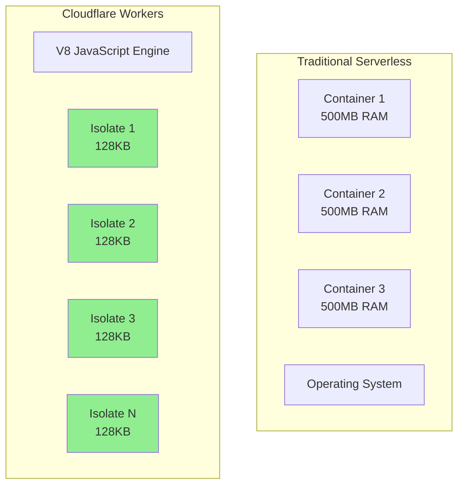

---

author: Anubhav Gain
pubDatetime: 2025-01-27T10:00:00+05:30
modDatetime: 2025-01-27T10:00:00+05:30
title: "Cloudflare Workers: Building Serverless Applications at the Edge"
slug: 'cloudflare-workers-edge-computing-guide-9ea8b0'
featured: true
draft: false
tags:
  - Cloudflare
  - Edge-Computing
  - Serverless
  - Workers
  - JavaScript
  - WebAssembly
  - Performance
  - API
  - Security
  - DevOps
category: Cloud
description: Complete guide to building high-performance serverless applications with Cloudflare Workers. Learn edge computing, KV storage, Durable Objects, and real-world implementation patterns.

---

# Cloudflare Workers: Building Serverless Applications at the Edge

## Introduction

Cloudflare Workers revolutionizes serverless computing by running JavaScript, Rust, C, and C++ code at the edge of Cloudflare's global network. With **200+ data centers worldwide**, Workers provide ultra-low latency execution closer to your users than traditional cloud functions.

### Key Advantages

- ⚡ **0ms Cold Starts**: Instant execution without container spinup delays
- 🌍 **Global Distribution**: Deploy once, run everywhere automatically
- 💰 **Cost-Effective**: 10 million requests free per month
- 🔧 **V8 Isolates**: Lightweight, secure sandboxing technology
- 📊 **Built-in Analytics**: Real-time performance monitoring
- 🛡️ **DDoS Protection**: Automatic protection at no extra cost

## Architecture Deep Dive

### V8 Isolates vs Containers



## Getting Started

### 1. Install Wrangler CLI

```bash
# Install via npm
npm install -g wrangler

# Or via pnpm
pnpm install -g wrangler

# Authenticate with Cloudflare
wrangler login
```

### 2. Create Your First Worker

```bash
# Create new project
npm create cloudflare@latest my-worker

# Navigate to project
cd my-worker

# Start development server
npm run dev
```

## Core Concepts and APIs

### Basic Worker Structure

```javascript
// src/index.js
export default {
  async fetch(request, env, ctx) {
    // Request: Incoming HTTP request
    // Env: Environment bindings (KV, Durable Objects, secrets)
    // Ctx: Execution context (waitUntil, passThroughOnException)
    
    const url = new URL(request.url);
    
    // Route handling
    switch (url.pathname) {
      case '/api/users':
        return handleUsers(request, env);
      case '/api/auth':
        return handleAuth(request, env);
      default:
        return new Response('Not Found', { status: 404 });
    }
  },
  
  // Scheduled handler (Cron triggers)
  async scheduled(event, env, ctx) {
    ctx.waitUntil(doBackgroundTask());
  },
  
  // Email handler (Email routing)
  async email(message, env, ctx) {
    const allowList = ['admin@example.com'];
    if (allowList.includes(message.from)) {
      await message.forward('internal@example.com');
    } else {
      message.reject('Unauthorized sender');
    }
  }
};
```

### Workers KV (Key-Value Storage)

```javascript
// wrangler.toml
// [[kv_namespaces]]
// binding = "CACHE"
// id = "your-kv-namespace-id"

// Using KV for caching
async function handleWithCache(request, env) {
  const cacheKey = `cache:${request.url}`;
  
  // Check cache
  const cached = await env.CACHE.get(cacheKey);
  if (cached) {
    return new Response(cached, {
      headers: { 'X-Cache': 'HIT' }
    });
  }
  
  // Fetch fresh data
  const data = await fetchExpensiveData();
  
  // Store in KV with TTL
  await env.CACHE.put(cacheKey, JSON.stringify(data), {
    expirationTtl: 3600 // 1 hour
  });
  
  return new Response(JSON.stringify(data), {
    headers: { 
      'Content-Type': 'application/json',
      'X-Cache': 'MISS'
    }
  });
}
```

### Durable Objects (Stateful Edge Computing)

```javascript
// Durable Object class
export class RateLimiter {
  constructor(state, env) {
    this.state = state;
    this.env = env;
  }
  
  async fetch(request) {
    const ip = request.headers.get('CF-Connecting-IP');
    const now = Date.now();
    
    // Get current count
    let data = await this.state.storage.get(ip) || { count: 0, resetAt: now + 60000 };
    
    // Reset if window expired
    if (now > data.resetAt) {
      data = { count: 0, resetAt: now + 60000 };
    }
    
    // Check rate limit
    if (data.count >= 100) {
      return new Response('Rate limit exceeded', { status: 429 });
    }
    
    // Increment counter
    data.count++;
    await this.state.storage.put(ip, data);
    
    return new Response(JSON.stringify({ 
      remaining: 100 - data.count,
      resetAt: data.resetAt 
    }));
  }
}

// Worker using Durable Object
export default {
  async fetch(request, env) {
    const id = env.RATE_LIMITER.idFromName('global');
    const limiter = env.RATE_LIMITER.get(id);
    return limiter.fetch(request);
  }
};
```

## Real-World Implementation Patterns

### 1. API Gateway with Authentication

```javascript
// JWT verification at the edge
import jwt from '@tsndr/cloudflare-worker-jwt';

async function authenticate(request, env) {
  const token = request.headers.get('Authorization')?.replace('Bearer ', '');
  
  if (!token) {
    return new Response('Unauthorized', { status: 401 });
  }
  
  try {
    const isValid = await jwt.verify(token, env.JWT_SECRET);
    if (!isValid) {
      return new Response('Invalid token', { status: 401 });
    }
    
    const decoded = jwt.decode(token);
    return { authenticated: true, user: decoded.payload };
  } catch (error) {
    return new Response('Authentication failed', { status: 401 });
  }
}

export default {
  async fetch(request, env) {
    // CORS headers
    const corsHeaders = {
      'Access-Control-Allow-Origin': '*',
      'Access-Control-Allow-Methods': 'GET, POST, PUT, DELETE, OPTIONS',
      'Access-Control-Allow-Headers': 'Content-Type, Authorization',
    };
    
    // Handle preflight
    if (request.method === 'OPTIONS') {
      return new Response(null, { headers: corsHeaders });
    }
    
    // Authenticate
    const auth = await authenticate(request, env);
    if (!auth.authenticated) {
      return auth; // Return error response
    }
    
    // Route to backend services
    const backendUrl = new URL(request.url);
    backendUrl.hostname = 'api.internal.example.com';
    
    const backendRequest = new Request(backendUrl, request);
    backendRequest.headers.set('X-User-ID', auth.user.sub);
    
    const response = await fetch(backendRequest);
    
    // Add CORS headers to response
    const newResponse = new Response(response.body, response);
    Object.entries(corsHeaders).forEach(([key, value]) => {
      newResponse.headers.set(key, value);
    });
    
    return newResponse;
  }
};
```

### 2. Image Optimization Service

```javascript
// Real-time image transformation
export default {
  async fetch(request, env) {
    const url = new URL(request.url);
    const imageUrl = url.searchParams.get('url');
    const width = parseInt(url.searchParams.get('w') || '0');
    const quality = parseInt(url.searchParams.get('q') || '85');
    const format = url.searchParams.get('f') || 'auto';
    
    if (!imageUrl) {
      return new Response('Missing image URL', { status: 400 });
    }
    
    // Cache key based on parameters
    const cacheKey = new Request(url.toString(), request);
    const cache = caches.default;
    
    // Check cache
    let response = await cache.match(cacheKey);
    if (response) {
      return response;
    }
    
    // Fetch original image
    const imageRequest = new Request(imageUrl, {
      headers: {
        'Accept': 'image/*'
      }
    });
    
    const imageResponse = await fetch(imageRequest, {
      cf: {
        image: {
          width: width || undefined,
          quality: quality,
          format: format === 'auto' ? undefined : format,
          fit: 'scale-down',
          metadata: 'none',
          background: '#FFFFFF'
        }
      }
    });
    
    // Create response with caching headers
    response = new Response(imageResponse.body, imageResponse);
    response.headers.set('Cache-Control', 'public, max-age=31536000');
    response.headers.set('Vary', 'Accept');
    
    // Store in cache
    await cache.put(cacheKey, response.clone());
    
    return response;
  }
};
```

### 3. A/B Testing at the Edge

```javascript
// Cookie-based A/B testing
export default {
  async fetch(request, env) {
    const cookie = request.headers.get('Cookie');
    let variant = getCookie(cookie, 'ab_variant');
    
    // Assign variant if not set
    if (!variant) {
      variant = Math.random() < 0.5 ? 'A' : 'B';
    }
    
    // Fetch appropriate content
    const variantUrl = variant === 'A' 
      ? 'https://cdn.example.com/page-a.html'
      : 'https://cdn.example.com/page-b.html';
    
    const response = await fetch(variantUrl);
    const html = await response.text();
    
    // Track analytics
    env.ANALYTICS.writeDataPoint({
      blobs: ['pageview', variant],
      doubles: [1],
      indexes: [`variant-${variant}`]
    });
    
    // Return with variant cookie
    const newResponse = new Response(html, {
      headers: {
        'Content-Type': 'text/html',
        'Set-Cookie': `ab_variant=${variant}; Path=/; Max-Age=2592000; SameSite=Lax`
      }
    });
    
    return newResponse;
  }
};

function getCookie(cookieString, name) {
  if (!cookieString) return null;
  const cookies = cookieString.split('; ');
  for (const cookie of cookies) {
    const [key, value] = cookie.split('=');
    if (key === name) return value;
  }
  return null;
}
```

### 4. WebSocket Server

```javascript
// Real-time chat using Durable Objects
export class ChatRoom {
  constructor(state, env) {
    this.state = state;
    this.env = env;
    this.sessions = [];
  }
  
  async fetch(request) {
    const upgradeHeader = request.headers.get('Upgrade');
    if (upgradeHeader !== 'websocket') {
      return new Response('Expected websocket', { status: 400 });
    }
    
    const [client, server] = Object.values(new WebSocketPair());
    
    await this.handleSession(server);
    
    return new Response(null, {
      status: 101,
      webSocket: client
    });
  }
  
  async handleSession(webSocket) {
    webSocket.accept();
    this.sessions.push(webSocket);
    
    webSocket.addEventListener('message', async (event) => {
      const message = JSON.parse(event.data);
      
      // Broadcast to all connected clients
      this.broadcast(JSON.stringify({
        type: 'message',
        user: message.user,
        text: message.text,
        timestamp: new Date().toISOString()
      }));
      
      // Store message history
      const history = await this.state.storage.get('history') || [];
      history.push(message);
      await this.state.storage.put('history', history.slice(-100)); // Keep last 100
    });
    
    webSocket.addEventListener('close', () => {
      this.sessions = this.sessions.filter(session => session !== webSocket);
    });
    
    // Send history to new connection
    const history = await this.state.storage.get('history') || [];
    webSocket.send(JSON.stringify({
      type: 'history',
      messages: history
    }));
  }
  
  broadcast(message) {
    this.sessions.forEach(session => {
      try {
        session.send(message);
      } catch (error) {
        // Remove dead connections
        this.sessions = this.sessions.filter(s => s !== session);
      }
    });
  }
}
```

## Advanced Features

### Workers AI (Machine Learning at the Edge)

```javascript
import { Ai } from '@cloudflare/ai';

export default {
  async fetch(request, env) {
    const ai = new Ai(env.AI);
    
    const { text } = await request.json();
    
    // Text classification
    const classification = await ai.run('@cf/huggingface/distilbert-sst-2-int8', {
      text: text
    });
    
    // Image generation
    const image = await ai.run('@cf/stabilityai/stable-diffusion-xl-base-1.0', {
      prompt: text
    });
    
    // Text embedding
    const embeddings = await ai.run('@cf/baai/bge-base-en-v1.5', {
      text: [text]
    });
    
    return Response.json({
      sentiment: classification,
      imageUrl: URL.createObjectURL(image),
      embedding: embeddings.data[0]
    });
  }
};
```

### R2 Storage Integration

```javascript
// Object storage at the edge
export default {
  async fetch(request, env) {
    const url = new URL(request.url);
    const key = url.pathname.slice(1);
    
    switch (request.method) {
      case 'GET':
        const object = await env.BUCKET.get(key);
        
        if (!object) {
          return new Response('Object not found', { status: 404 });
        }
        
        const headers = new Headers();
        object.writeHttpMetadata(headers);
        headers.set('etag', object.httpEtag);
        
        return new Response(object.body, { headers });
        
      case 'PUT':
        await env.BUCKET.put(key, request.body, {
          httpMetadata: request.headers,
          customMetadata: {
            uploadedBy: request.headers.get('X-User-ID'),
            timestamp: new Date().toISOString()
          }
        });
        
        return new Response('Object uploaded', { status: 201 });
        
      case 'DELETE':
        await env.BUCKET.delete(key);
        return new Response('Object deleted', { status: 204 });
        
      default:
        return new Response('Method not allowed', { status: 405 });
    }
  }
};
```

## Performance Optimization

### 1. Response Streaming

```javascript
// Stream large responses
export default {
  async fetch(request) {
    const { readable, writable } = new TransformStream();
    const writer = writable.getWriter();
    
    // Start streaming immediately
    streamResponse(writer);
    
    return new Response(readable, {
      headers: {
        'Content-Type': 'text/html; charset=utf-8',
        'Transfer-Encoding': 'chunked'
      }
    });
  }
};

async function streamResponse(writer) {
  await writer.write(new TextEncoder().encode('<html><head><title>Streaming</title></head><body>'));
  
  // Fetch data in chunks
  for (let i = 0; i < 10; i++) {
    const chunk = await fetchDataChunk(i);
    await writer.write(new TextEncoder().encode(`<div>${chunk}</div>`));
  }
  
  await writer.write(new TextEncoder().encode('</body></html>'));
  await writer.close();
}
```

### 2. Cache API Usage

```javascript
// Multi-tier caching
export default {
  async fetch(request, env) {
    const cacheUrl = new URL(request.url);
    const cacheKey = new Request(cacheUrl.toString(), request);
    const cache = caches.default;
    
    // Check edge cache
    let response = await cache.match(cacheKey);
    
    if (!response) {
      // Check KV cache
      const kvKey = `cache:${cacheUrl.pathname}`;
      const kvData = await env.KV.get(kvKey);
      
      if (kvData) {
        response = new Response(kvData, {
          headers: {
            'Content-Type': 'application/json',
            'X-Cache': 'KV-HIT'
          }
        });
      } else {
        // Fetch from origin
        response = await fetchFromOrigin(request);
        
        // Store in KV
        await env.KV.put(kvKey, await response.clone().text(), {
          expirationTtl: 3600
        });
        
        response = new Response(response.body, response);
        response.headers.set('X-Cache', 'MISS');
      }
      
      // Store in edge cache
      response.headers.set('Cache-Control', 'public, max-age=300');
      await cache.put(cacheKey, response.clone());
    } else {
      response = new Response(response.body, response);
      response.headers.set('X-Cache', 'EDGE-HIT');
    }
    
    return response;
  }
};
```

## Security Best Practices

### 1. Input Validation

```javascript
// Comprehensive input validation
import { z } from 'zod';

const UserSchema = z.object({
  email: z.string().email(),
  password: z.string().min(8).max(100),
  age: z.number().int().min(13).max(120),
  preferences: z.object({
    newsletter: z.boolean(),
    notifications: z.enum(['all', 'important', 'none'])
  }).optional()
});

export default {
  async fetch(request, env) {
    if (request.method !== 'POST') {
      return new Response('Method not allowed', { status: 405 });
    }
    
    try {
      const body = await request.json();
      const validated = UserSchema.parse(body);
      
      // Process validated data
      await createUser(validated, env);
      
      return new Response('User created', { status: 201 });
    } catch (error) {
      if (error instanceof z.ZodError) {
        return Response.json({
          error: 'Validation failed',
          details: error.errors
        }, { status: 400 });
      }
      
      return new Response('Internal error', { status: 500 });
    }
  }
};
```

### 2. Rate Limiting

```javascript
// IP-based rate limiting
export default {
  async fetch(request, env) {
    const ip = request.headers.get('CF-Connecting-IP');
    const rateLimitKey = `ratelimit:${ip}`;
    
    // Get current count
    const current = await env.KV.get(rateLimitKey);
    const count = current ? parseInt(current) : 0;
    
    // Check limit
    if (count >= 100) {
      return new Response('Rate limit exceeded', {
        status: 429,
        headers: {
          'Retry-After': '60',
          'X-RateLimit-Limit': '100',
          'X-RateLimit-Remaining': '0',
          'X-RateLimit-Reset': new Date(Date.now() + 60000).toISOString()
        }
      });
    }
    
    // Increment counter
    await env.KV.put(rateLimitKey, (count + 1).toString(), {
      expirationTtl: 60
    });
    
    // Process request
    const response = await handleRequest(request, env);
    
    // Add rate limit headers
    response.headers.set('X-RateLimit-Limit', '100');
    response.headers.set('X-RateLimit-Remaining', (99 - count).toString());
    
    return response;
  }
};
```

## Deployment and CI/CD

### GitHub Actions Workflow

```yaml
# .github/workflows/deploy.yml
name: Deploy to Cloudflare Workers

on:
  push:
    branches: [main]
  pull_request:
    branches: [main]

jobs:
  deploy:
    runs-on: ubuntu-latest
    
    steps:
      - uses: actions/checkout@v3
      
      - uses: actions/setup-node@v3
        with:
          node-version: '18'
          
      - run: npm ci
      
      - run: npm test
      
      - name: Deploy to Cloudflare
        uses: cloudflare/wrangler-action@v3
        with:
          apiToken: ${{ secrets.CLOUDFLARE_API_TOKEN }}
          accountId: ${{ secrets.CLOUDFLARE_ACCOUNT_ID }}
          command: deploy
        env:
          CLOUDFLARE_API_TOKEN: ${{ secrets.CLOUDFLARE_API_TOKEN }}
```

### Wrangler Configuration

```toml
# wrangler.toml
name = "my-worker"
main = "src/index.js"
compatibility_date = "2024-01-01"

[env.production]
vars = { ENVIRONMENT = "production" }
kv_namespaces = [
  { binding = "CACHE", id = "abc123" }
]
durable_objects.bindings = [
  { name = "RATE_LIMITER", class_name = "RateLimiter" }
]
r2_buckets = [
  { binding = "BUCKET", bucket_name = "my-bucket" }
]

[env.staging]
vars = { ENVIRONMENT = "staging" }
kv_namespaces = [
  { binding = "CACHE", id = "def456" }
]

[[routes]]
pattern = "api.example.com/*"
zone_name = "example.com"

[observability]
enabled = true

[limits]
cpu_ms = 50
memory_mb = 128
```

## Monitoring and Analytics

### Custom Analytics with Workers Analytics Engine

```javascript
export default {
  async fetch(request, env) {
    const start = Date.now();
    const url = new URL(request.url);
    
    // Process request
    const response = await handleRequest(request, env);
    
    // Record analytics
    env.ANALYTICS.writeDataPoint({
      blobs: [
        url.pathname,
        request.method,
        response.status.toString(),
        request.headers.get('CF-Connecting-IP')
      ],
      doubles: [
        Date.now() - start, // Response time
        parseInt(response.headers.get('Content-Length') || '0')
      ],
      indexes: [
        `status-${response.status}`,
        `path-${url.pathname}`
      ]
    });
    
    return response;
  }
};
```

## Cost Optimization

### Request Coalescing

```javascript
// Deduplicate concurrent requests
const inFlight = new Map();

export default {
  async fetch(request, env) {
    const key = request.url;
    
    // Check if request is already in flight
    if (inFlight.has(key)) {
      return inFlight.get(key);
    }
    
    // Create new request promise
    const promise = handleRequest(request, env)
      .finally(() => inFlight.delete(key));
    
    inFlight.set(key, promise);
    
    return promise;
  }
};
```

## Conclusion

Cloudflare Workers provides a powerful platform for building globally distributed, serverless applications. With zero cold starts, automatic scaling, and integrated services like KV, Durable Objects, and R2, it's ideal for:

- ✅ API gateways and middleware
- ✅ Real-time applications
- ✅ Static site generation
- ✅ Image and media processing
- ✅ Authentication services
- ✅ A/B testing and personalization
- ✅ IoT data processing
- ✅ Webhooks and integrations

Start building at [workers.cloudflare.com](https://workers.cloudflare.com) and join the edge computing revolution!

## Resources

- [Workers Documentation](https://developers.cloudflare.com/workers/)
- [Wrangler CLI](https://developers.cloudflare.com/workers/wrangler/)
- [Workers Examples](https://github.com/cloudflare/workers-examples)
- [Discord Community](https://discord.gg/cloudflaredev)