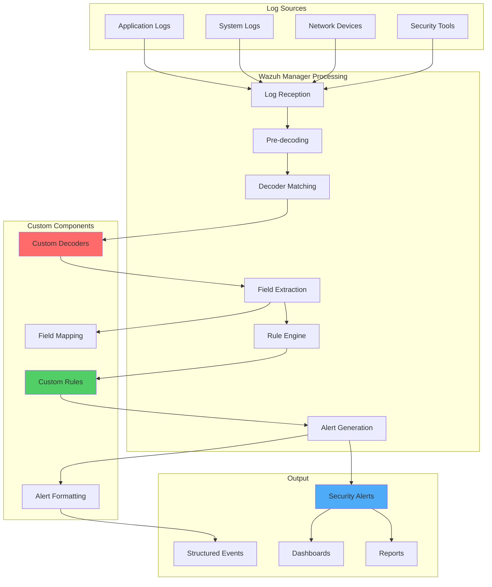

# Creating Decoders and Rules from Scratch in Wazuh

## Introduction

Wazuh provides an extensive out-of-the-box ruleset for threat detection and response, continuously updated by contributors and developers. However, organizations often need to ingest and process custom log sources or create specialized detection logic. This is where custom decoders and rules become essential.

Creating decoders and rules from scratch allows you to:

- 🔍 **Parse New Log Sources**: Process logs from custom applications or devices
- 🎯 **Extract Specific Fields**: Pull out relevant data for analysis and correlation
- 🛡️ **Detect Custom Threats**: Create detection logic tailored to your environment
- 📊 **Enhance Visibility**: Gain insights into previously unmonitored systems
- ⚡ **Improve Accuracy**: Reduce false positives with precise pattern matching

## Understanding the Wazuh Analysis Pipeline

### Log Processing Flow



### Key Components

1. **Decoders**: Parse raw logs and extract structured data
2. **Rules**: Analyze parsed data and determine alert conditions
3. **Field Extraction**: Pull specific values from log messages
4. **Alert Generation**: Create security alerts based on rule matches

## Example Log Analysis

Let's work with a Fortigate firewall log to demonstrate the complete process:

```
date=2019-10-10 time=17:01:31 devname="FG111E-INFT2" devid="FG201E4Q17901611" logid="0000000020" type="traffic" subtype="forward" level="notice" vd="root" eventtime=1573570891 srcip=192.168.56.105 srcname="wazuh.test.local" srcport=63874 srcintf="port1" srcintfrole="lan" dstip=54.97.146.111 dstport=443 dstintf="wan1" dstintfrole="wan" poluuid="3e421d8c-0210-51ea-2e5e-6dd151c37590" sessionid=261713795 proto=6 action="accept" user="WAZUH" authserver="FSSO_TEST_LOCAL" policyid=131 policytype="policy" service="HTTPS" dstcountry="United Kingdom" srccountry="Reserved" trandisp="snat" transip=195.46.111.2 transport=63874 appid=45553 app="Microsoft.Outlook.Office.365" appcat="Email" apprisk="medium" applist="INF-APP-MONITOR" appact="detected" duration=815 sentbyte=13941 rcvdbyte=13429 sentpkt=58 rcvdpkt=63 sentdelta=360 rcvddelta=2189 devtype="Windows PC" devcategory="Windows Device" osname="Windows" osversion="8.1" mastersrcmac="fc:45:96:44:79:c9" srcmac="fc:45:96:44:79:c9" srcserver=1 dstdevtype="Router/NAT Device" dstdevcategory="None" masterdstmac="28:8b:1c:db:7c:48" dstmac="28:8b:1c:db:7c:48" dstserver=0
```

### Log Structure Analysis

This Fortigate log follows a **key=value** pattern with:
- **Syntax**: Whitespace-separated pairs
- **String Values**: Surrounded by double quotes
- **Structure**: Consistent header fields followed by variable data

## Decoder Design Principles

### Phase 1: Root Decoder Creation

The root decoder identifies the log type using a **prematch** pattern. It should match static text that appears consistently across all logs from the source.

#### Identifying Static Patterns

From our Fortigate example, these fields are always present:
- `date=YYYY-MM-DD`
- `time=HH:MM:SS` 
- `devname="device_name"`

#### Root Decoder Implementation

Add to `/var/ossec/etc/decoders/local_decoder.xml`:

```xml
<!-- Fortigate Root Decoder -->
<decoder name="fortigate-custom">
  <prematch>^date=\d\d\d\d-\d\d-\d\d time=\d\d:\d\d:\d\d devname="\S+"</prematch>
</decoder>
```

**Regex Pattern Breakdown**:
- `^date=\d\d\d\d-\d\d-\d\d`: Matches date field with YYYY-MM-DD format
- `time=\d\d:\d\d:\d\d`: Matches time field with HH:MM:SS format  
- `devname="\S+"`: Matches device name in quotes (non-whitespace characters)

### Phase 2: Field Extraction Decoders

Child decoders extract specific values using the `regex` and `order` options.

#### Basic Field Extraction

```xml
<!-- Extract header fields -->
<decoder name="fortigate-custom1">
  <parent>fortigate-custom</parent>
  <regex>^date=(\d\d\d\d-\d\d-\d\d) time=(\d\d:\d\d:\d\d) devname="(\S+)"</regex>
  <order>date, time, devname</order>
</decoder>

<!-- Extract device and log information -->
<decoder name="fortigate-custom1">
  <parent>fortigate-custom</parent>
  <regex>devid="(\S+)" logid="(\S+)" type="(\S+)" subtype="(\S+)"</regex>
  <order>devid, logid, type, subtype</order>
</decoder>
```

#### Advanced Field Extraction

For flexible parsing of variable log structures:

```xml
<!-- Source IP with flexible format -->
<decoder name="fortigate-custom1">
  <parent>fortigate-custom</parent>
  <regex>srcip="(\S+)"|srcip=(\S+) </regex>
  <order>srcip</order>
</decoder>

<!-- Destination IP -->
<decoder name="fortigate-custom1">
  <parent>fortigate-custom</parent>
  <regex>dstip=(\S+) </regex>
  <order>dstip</order>
</decoder>

<!-- Action field -->
<decoder name="fortigate-custom1">
  <parent>fortigate-custom</parent>
  <regex>action="(\S+)" </regex>
  <order>action</order>
</decoder>

<!-- Traffic statistics -->
<decoder name="fortigate-custom1">
  <parent>fortigate-custom</parent>
  <regex>sentbyte=(\d+) rcvdbyte=(\d+)</regex>
  <order>sent_bytes, received_bytes</order>
</decoder>

<!-- Application information -->
<decoder name="fortigate-custom1">
  <parent>fortigate-custom</parent>
  <regex>app="([^"]+)" appcat="([^"]+)"</regex>
  <order>application, app_category</order>
</decoder>
```

### Phase 3: Enhanced Decoders for Complex Patterns

#### Geographic Information

```xml
<decoder name="fortigate-custom1">
  <parent>fortigate-custom</parent>
  <regex>dstcountry="([^"]+)" srccountry="([^"]+)"</regex>
  <order>dst_country, src_country</order>
</decoder>
```

#### Device Classification

```xml
<decoder name="fortigate-custom1">
  <parent>fortigate-custom</parent>
  <regex>devtype="([^"]+)" devcategory="([^"]+)"</regex>
  <order>device_type, device_category</order>
</decoder>
```

#### User and Authentication

```xml
<decoder name="fortigate-custom1">
  <parent>fortigate-custom</parent>
  <regex>user="([^"]+)" authserver="([^"]+)"</regex>
  <order>user, auth_server</order>
</decoder>
```

## Rule Design Patterns

### Phase 1: Grouping Rules

Create a base rule that matches all events from your decoders:

Add to `/var/ossec/etc/rules/local_rules.xml`:

```xml
<group name="fortigate,firewall,">
  <!-- Base grouping rule -->
  <rule id="200000" level="3">
    <decoded_as>fortigate-custom</decoded_as>
    <description>Fortigate firewall messages grouped.</description>
    <group>fortigate,</group>
  </rule>
</group>
```

### Phase 2: Traffic Analysis Rules

#### Connection Monitoring

```xml
<!-- Accepted connections -->
<rule id="200001" level="3">
  <if_sid>200000</if_sid>
  <field name="action">accept</field>
  <description>Fortigate: Connection accepted from $(srcip) to $(dstip):$(dstport)</description>
  <group>connection_accepted,</group>
</rule>

<!-- Blocked connections -->
<rule id="200002" level="5">
  <if_sid>200000</if_sid>
  <field name="action">deny|block</field>
  <description>Fortigate: Connection blocked from $(srcip) to $(dstip):$(dstport)</description>
  <group>connection_blocked,</group>
</rule>

<!-- High-risk applications -->
<rule id="200003" level="7">
  <if_sid>200001</if_sid>
  <field name="app_category">P2P|File.Sharing|Proxy</field>
  <description>Fortigate: High-risk application $(application) accessed by $(srcip)</description>
  <group>high_risk_app,policy_violation,</group>
</rule>
```

#### Geographic Threat Detection

```xml
<!-- Connections from high-risk countries -->
<rule id="200004" level="6">
  <if_sid>200001</if_sid>
  <field name="src_country">China|Russia|Iran|North.Korea</field>
  <description>Fortigate: Connection from high-risk country $(src_country) - $(srcip)</description>
  <group>geographic_risk,</group>
</rule>

<!-- Unusual destination countries -->
<rule id="200005" level="4">
  <if_sid>200001</if_sid>
  <field name="dst_country">!United.States|!Canada|!United.Kingdom|!Germany</field>
  <description>Fortigate: Connection to unusual destination $(dst_country) - $(dstip)</description>
  <group>unusual_destination,</group>
</rule>
```

### Phase 3: Advanced Detection Rules

#### Brute Force Detection

```xml
<!-- Multiple blocked connections -->
<rule id="200010" level="8" frequency="10" timeframe="300">
  <if_sid>200002</if_sid>
  <same_field>srcip</same_field>
  <description>Fortigate: Multiple blocked connections from $(srcip)</description>
  <group>multiple_blocks,brute_force,</group>
</rule>

<!-- Port scanning detection -->
<rule id="200011" level="10" frequency="20" timeframe="60">
  <if_sid>200002</if_sid>
  <same_field>srcip</same_field>
  <different_field>dstport</different_field>
  <description>Fortigate: Possible port scan from $(srcip)</description>
  <group>port_scan,reconnaissance,</group>
</rule>
```

#### Data Exfiltration Detection

```xml
<!-- Large data transfers -->
<rule id="200020" level="6">
  <if_sid>200001</if_sid>
  <field name="sent_bytes" type="pcre2">^[1-9]\d{8,}</field>
  <description>Fortigate: Large outbound data transfer $(sent_bytes) bytes to $(dstip)</description>
  <group>large_transfer,data_exfiltration,</group>
</rule>

<!-- Unusual application usage -->
<rule id="200021" level="7">
  <if_sid>200001</if_sid>
  <field name="application">TeamViewer|AnyDesk|VNC</field>
  <field name="action">accept</field>
  <description>Fortigate: Remote access tool $(application) used by $(srcip)</description>
  <group>remote_access,policy_violation,</group>
</rule>
```

#### Authentication and Policy Violations

```xml
<!-- Failed authentication attempts -->
<rule id="200030" level="5">
  <if_sid>200000</if_sid>
  <field name="action">auth_failed|login_failed</field>
  <description>Fortigate: Authentication failed for user $(user) from $(srcip)</description>
  <group>auth_failed,</group>
</rule>

<!-- Policy violations -->
<rule id="200031" level="8">
  <if_sid>200000</if_sid>
  <field name="policytype">policy</field>
  <field name="action">deny</field>
  <match>policy.violation</match>
  <description>Fortigate: Policy violation detected - $(user) from $(srcip)</description>
  <group>policy_violation,</group>
</rule>
```

### Phase 4: Correlation Rules

#### Multi-stage Attack Detection

```xml
<!-- Reconnaissance followed by access -->
<rule id="200040" level="12">
  <if_matched_sid>200011</if_matched_sid>
  <if_matched_sid>200001</if_matched_sid>
  <same_field>srcip</same_field>
  <description>Fortigate: Port scan followed by successful connection from $(srcip)</description>
  <group>multi_stage_attack,correlation,</group>
</rule>

<!-- Blocked then allowed pattern -->
<rule id="200041" level="10">
  <if_matched_sid>200010</if_matched_sid>
  <if_matched_sid>200001</if_matched_sid>
  <same_field>srcip</same_field>
  <description>Fortigate: Persistent attacker $(srcip) gained access after multiple blocks</description>
  <group>persistent_attack,</group>
</rule>
```

## Testing and Validation

### Phase 1: Using ossec-logtest

Test decoders and rules with sample logs:

```bash
# Run logtest
/var/ossec/bin/ossec-logtest

# Input the sample log and observe output
```

Expected output for our Fortigate example:

```
**Phase 2: Completed decoding.
       decoder: 'fortigate-custom'
       date: '2019-10-10'
       time: '17:01:31'
       devname: 'FG111E-INFT2'
       devid: 'FG201E4Q17901611'
       logid: '0000000020'
       type: 'traffic'
       subtype: 'forward'
       srcip: '192.168.56.105'
       dstip: '54.97.146.111'
       action: 'accept'
       sent_bytes: '13941'
       received_bytes: '13429'
       application: 'Microsoft.Outlook.Office.365'
       app_category: 'Email'

**Phase 3: Completed filtering (rules).
       Rule id: '200000'
       Level: '3'
       Description: 'Fortigate firewall messages grouped.'
**Alert to be generated.
```

### Phase 2: Live Testing

Create a test log file to validate the complete pipeline:

```bash
# Create test file
touch /var/log/test_fortigate.log

# Add log monitoring to ossec.conf
echo '<localfile>
  <log_format>syslog</log_format>
  <location>/var/log/test_fortigate.log</location>
</localfile>' >> /var/ossec/etc/ossec.conf

# Restart Wazuh manager
systemctl restart wazuh-manager

# Add test log entry
echo 'date=2019-10-10 time=17:01:31 devname="FG111E-INFT2" devid="FG201E4Q17901611" logid="0000000020" type="traffic" subtype="forward" level="notice" srcip=192.168.56.105 dstip=54.97.146.111 dstport=443 proto=6 action="accept" user="WAZUH" service="HTTPS"' >> /var/log/test_fortigate.log
```

### Phase 3: Alert Verification

Check that alerts are generated correctly:

```bash
# Monitor alerts
tail -f /var/ossec/logs/alerts/alerts.log

# Look for the generated alert
grep "Fortigate" /var/ossec/logs/alerts/alerts.log
```

## Advanced Decoder Techniques

### Conditional Decoding

Use different decoders based on log content:

```xml
<!-- Decoder for authentication logs -->
<decoder name="fortigate-auth">
  <parent>fortigate-custom</parent>
  <prematch>type="event" subtype="user"</prematch>
  <regex>action="(\w+)" user="([^"]+)" srcip=(\S+)</regex>
  <order>auth_action, username, source_ip</order>
</decoder>

<!-- Decoder for traffic logs -->
<decoder name="fortigate-traffic">
  <parent>fortigate-custom</parent>
  <prematch>type="traffic"</prematch>
  <regex>srcip=(\S+) dstip=(\S+) srcport=(\d+) dstport=(\d+)</regex>
  <order>src_ip, dst_ip, src_port, dst_port</order>
</decoder>
```

### Multi-line Log Support

Handle logs that span multiple lines:

```xml
<!-- Multi-line decoder -->
<decoder name="fortigate-multiline">
  <parent>fortigate-custom</parent>
  <prematch offset="after_parent">msg="</prematch>
  <regex offset="after_prematch">([^"]+)"</regex>
  <order>full_message</order>
</decoder>
```

### JSON Log Parsing

For JSON-formatted logs:

```xml
<!-- JSON decoder -->
<decoder name="application-json">
  <parent>json</parent>
  <use_own_name>true</use_own_name>
  <plugin_decoder>JSON_Decoder</plugin_decoder>
</decoder>
```

## Performance Optimization

### Efficient Regex Patterns

1. **Use Anchors**: Start patterns with `^` when possible
2. **Avoid Greedy Matching**: Use `[^"]+` instead of `.*` where appropriate
3. **Specific Character Classes**: Use `\d` for digits, `\w` for word characters

### Example Optimizations

```xml
<!-- Inefficient -->
<regex>.*srcip=(.*).*dstip=(.*)</regex>

<!-- Optimized -->
<regex>srcip=(\S+).*dstip=(\S+)</regex>

<!-- Even better -->
<regex>srcip=(\S+)(?:.*dstip=(\S+))?</regex>
```

### Rule Efficiency

1. **Order Rules by Frequency**: Put most common matches first
2. **Use Specific Field Matching**: Prefer `field` over `match`
3. **Group Related Rules**: Use parent-child relationships

```xml
<!-- Less efficient -->
<rule id="200100" level="5">
  <decoded_as>fortigate-custom</decoded_as>
  <match>action="deny"</match>
  <description>Connection denied</description>
</rule>

<!-- More efficient -->
<rule id="200100" level="5">
  <if_sid>200000</if_sid>
  <field name="action">deny</field>
  <description>Connection denied</description>
</rule>
```

## Common Log Sources and Patterns

### Web Server Logs

```xml
<!-- Apache/Nginx access logs -->
<decoder name="web-access">
  <prematch>^\S+ \S+ \S+ \[</prematch>
  <regex>^(\S+) \S+ \S+ \[([^\]]+)\] "(\S+) ([^"]+)" (\d+) (\S+)</regex>
  <order>srcip, timestamp, method, url, status_code, response_size</order>
</decoder>
```

### Database Logs

```xml
<!-- MySQL/PostgreSQL logs -->
<decoder name="database-query">
  <prematch>Query|SELECT|INSERT|UPDATE|DELETE</prematch>
  <regex>(\d{4}-\d{2}-\d{2} \d{2}:\d{2}:\d{2}).*Query.*: (.*)</regex>
  <order>timestamp, query</order>
</decoder>
```

### Application Logs

```xml
<!-- Custom application logs -->
<decoder name="app-custom">
  <prematch>^\d{4}-\d{2}-\d{2} \d{2}:\d{2}:\d{2} \[(\w+)\]</prematch>
  <regex>^(\d{4}-\d{2}-\d{2} \d{2}:\d{2}:\d{2}) \[(\w+)\] (.*): (.*)</regex>
  <order>timestamp, log_level, component, message</order>
</decoder>
```

### Network Device Logs

```xml
<!-- Cisco ASA logs -->
<decoder name="cisco-asa">
  <prematch>%ASA-</prematch>
  <regex>%ASA-(\d)-(\d+): (.+)</regex>
  <order>severity, event_id, message</order>
</decoder>
```

## Best Practices

### Decoder Design

1. **Start Simple**: Begin with basic field extraction
2. **Iterate and Improve**: Add complexity gradually
3. **Use Descriptive Names**: Make decoder purpose clear
4. **Test Thoroughly**: Validate with various log samples
5. **Document Patterns**: Comment complex regex patterns

### Rule Creation

1. **Logical Grouping**: Organize rules by function or system
2. **Appropriate Levels**: Use consistent severity levels
3. **Clear Descriptions**: Make alert messages informative
4. **Avoid False Positives**: Test rules extensively
5. **Use Groups**: Facilitate filtering and correlation

### Maintenance

1. **Version Control**: Track changes to custom rules
2. **Regular Testing**: Validate rules with new log samples  
3. **Performance Monitoring**: Watch for resource usage
4. **Documentation**: Maintain rule purpose and logic
5. **Backup Configurations**: Preserve custom work

## Troubleshooting Guide

### Common Issues

#### Decoders Not Matching

```bash
# Test decoder patterns
echo "your_log_line" | /var/ossec/bin/ossec-logtest

# Check for syntax errors
/var/ossec/bin/ossec-logtest -t
```

#### Rules Not Triggering

```bash
# Verify rule syntax
/var/ossec/bin/ossec-logtest -t

# Check rule dependencies
grep -A5 -B5 "rule_id" /var/ossec/etc/rules/local_rules.xml
```

#### Performance Issues

```bash
# Monitor processing times
tail -f /var/ossec/logs/ossec.log | grep "Rules processed"

# Check decoder efficiency
grep "decoder" /var/ossec/logs/ossec.log
```

### Debugging Techniques

1. **Use ossec-logtest**: Test individual log lines
2. **Enable Debug Mode**: Increase verbosity in ossec.conf
3. **Check Logs**: Monitor /var/ossec/logs/ for errors
4. **Incremental Development**: Add one decoder/rule at a time
5. **Validate Regex**: Use online regex testers

## Advanced Integration

### External Enrichment

```xml
<!-- GeoIP enrichment -->
<decoder name="geo-enriched">
  <parent>fortigate-custom</parent>
  <regex>srcip=(\S+)</regex>
  <order>src_ip</order>
  <plugin_decoder>GeoIP_Decoder</plugin_decoder>
</decoder>
```

### Dynamic Field Mapping

```xml
<!-- Dynamic field extraction -->
<decoder name="dynamic-fields">
  <parent>fortigate-custom</parent>
  <regex>(\w+)="([^"]+)"</regex>
  <order>field_name, field_value</order>
  <type>dynamic</type>
</decoder>
```

### Integration with Threat Intelligence

```xml
<!-- Threat intel correlation -->
<rule id="200200" level="10">
  <if_sid>200001</if_sid>
  <list field="srcip" lookup="address_match_key">etc/lists/malicious_ips</list>
  <description>Fortigate: Connection from known malicious IP $(srcip)</description>
  <group>threat_intel,malicious_ip,</group>
</rule>
```

## Conclusion

Creating custom decoders and rules in Wazuh empowers organizations to:

- 🎯 **Monitor Any Log Source**: Parse logs from custom applications and devices
- 📊 **Extract Meaningful Data**: Structure unstructured log data for analysis
- 🛡️ **Detect Custom Threats**: Create detection logic specific to your environment
- ⚡ **Improve Security Posture**: Gain visibility into previously unmonitored systems
- 🔄 **Adapt to Changes**: Quickly respond to new log formats and threat patterns

The key to success is starting with simple patterns and iterating based on real log data and security requirements.

## Key Takeaways

1. **Understand Log Structure**: Analyze log format before creating decoders
2. **Start with Root Decoders**: Use static patterns for initial matching
3. **Extract Relevant Fields**: Focus on security-relevant data points
4. **Test Thoroughly**: Validate with ossec-logtest and live data
5. **Optimize Performance**: Use efficient regex patterns and rule structures
6. **Document Everything**: Maintain clear documentation for future reference

## Resources

- [Wazuh Rules Syntax Documentation](https://documentation.wazuh.com/current/user-manual/ruleset/rules-syntax.html)
- [Wazuh Decoders Syntax Documentation](https://documentation.wazuh.com/current/user-manual/ruleset/decoders-syntax.html)
- [Regular Expression Tester](https://regex101.com/)
- [Wazuh Ruleset Repository](https://github.com/wazuh/wazuh-ruleset)

---

*Master the art of custom log analysis with Wazuh decoders and rules! 🔍📊*