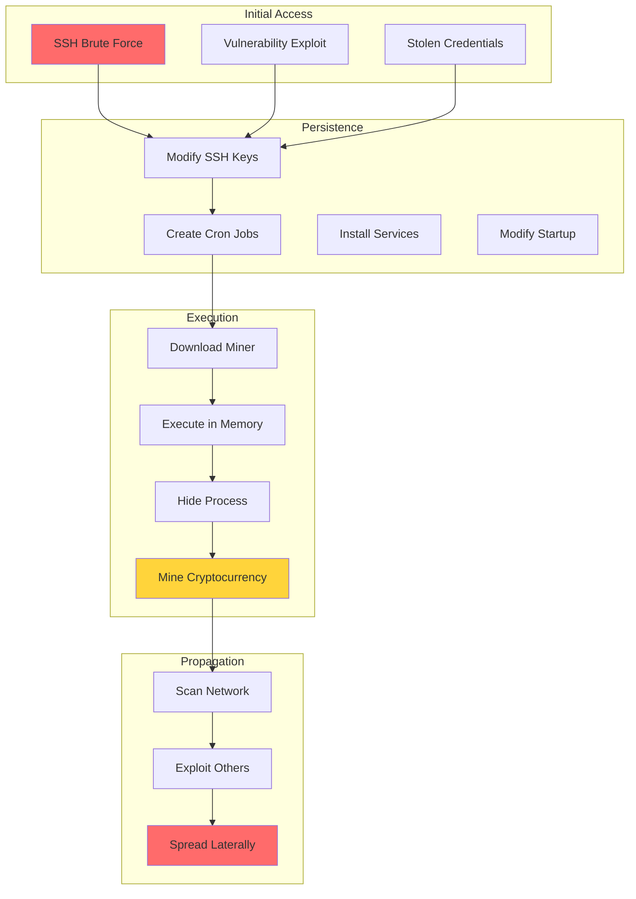

# Detecting Illegitimate Crypto Miners on Linux Endpoints with Wazuh

## Introduction

Cryptocurrency mining has become a profitable activity that attracts both legitimate miners and cybercriminals. Threat actors compromise unsuspecting users' endpoints to mine cryptocurrency using their computational resources, often organizing these compromised systems into botnets controlled by Command and Control (CnC) servers.

The monetary incentive of crypto mining motivates attackers to continuously evolve their techniques. Common Linux-based crypto mining botnets include PyCryptoMiner, Panchan, Lemon Duck, Sysrv, and HolesWarm. These threats can significantly impact system performance, increase electricity costs, and serve as a gateway for additional malicious activities.

Wazuh provides comprehensive capabilities to detect crypto mining activities through:

- 🔍 **Initial Access Detection**: Monitor SSH brute force and exploitation attempts
- 📁 **File Integrity Monitoring**: Track modifications to critical files
- 💻 **Resource Monitoring**: Detect abnormal CPU and memory usage
- 🌐 **Network Analysis**: Identify connections to mining pools
- 🛡️ **Automated Response**: Block malicious activities in real-time

## Understanding Crypto Miner Behavior

### Typical Attack Flow



### Common Indicators of Compromise

1. **Initial Access**:
   - Multiple SSH authentication failures
   - Exploitation of known vulnerabilities
   - Use of default or weak credentials

2. **Persistence Mechanisms**:
   - Unauthorized SSH key additions
   - Suspicious cron job creation
   - Modified system startup scripts

3. **Execution Patterns**:
   - High CPU usage (often 90%+)
   - Memory-resident processes
   - Obfuscated process names

4. **Network Behavior**:
   - Connections to known mining pools
   - Outbound SSH scanning
   - Communication with CnC servers

## Implementation Guide

### Prerequisites

- **Wazuh Server**: Version 4.3.7+ with all components
- **Linux Endpoints**: Ubuntu/CentOS with Wazuh agents
- **Network**: Suricata for deep packet inspection (optional)

### Detection Strategy 1: Initial Access Monitoring

#### SSH Brute Force Detection

Wazuh includes built-in rules for SSH authentication monitoring:

```xml
<!-- Rules 5551-5553: SSH authentication failures -->
<rule id="5551" level="10" frequency="6" timeframe="360">
  <if_matched_sid>5550</if_matched_sid>
  <same_source_ip />
  <description>Multiple SSH authentication failures</description>
  <mitre>
    <id>T1110</id>
  </mitre>
</rule>
```

Monitor the dashboard for:
- Rule 5551: Multiple authentication failures
- Rule 5715: SSH brute force attack

#### Outbound SSH Scanning Detection

```xml
<group name="crypto_miner_detection,">
  <rule id="100001" level="10" frequency="20" timeframe="60">
    <if_sid>5402</if_sid>
    <match>ssh</match>
    <different_dst_ip />
    <description>Possible SSH scanning activity - crypto miner propagation</description>
    <mitre>
      <id>T1021.004</id>
    </mitre>
  </rule>
</group>
```

### Detection Strategy 2: SSH Key Monitoring

#### Configure File Integrity Monitoring

Edit `/var/ossec/etc/shared/default/agent.conf` on the Wazuh server:

```xml
<agent_config os="linux">
  <syscheck>
    <directories check_all="yes" realtime="yes">/home/*/.ssh/</directories>
    <directories check_all="yes" realtime="yes">/var/lib/*/.ssh/</directories>
    <directories check_all="yes" realtime="yes">/root/.ssh/</directories>
  </syscheck>
</agent_config>
```

#### Create Detection Rules

Add to `/var/ossec/etc/rules/local_rules.xml`:

```xml
<group name="cryptominer,">
  <rule id="100010" level="10">
    <if_sid>554</if_sid>
    <field name="file" type="pcre2">\/authorized_keys$</field>
    <regex type="pcre2">added</regex>
    <description>SSH authorized_keys file "$(file)" has been added</description>
    <mitre>
      <id>T1098.004</id>
    </mitre>
  </rule>
  
  <rule id="100011" level="10">
    <if_sid>550</if_sid>
    <field name="file" type="pcre2">\/authorized_keys$</field>
    <regex type="pcre2">modified</regex>
    <description>SSH authorized_keys file "$(file)" has been modified</description>
    <mitre>
      <id>T1098.004</id>
    </mitre>
  </rule>
</group>
```

### Detection Strategy 3: Cron Job Monitoring

#### Configure FIM with Report Changes

```xml
<agent_config os="linux">
  <syscheck>
    <directories check_all="yes" realtime="yes" report_changes="yes">/var/spool/cron/crontabs/</directories>
  </syscheck>
</agent_config>
```

#### Enhanced Cron Monitoring Rules

```xml
<rule id="100012" level="12">
  <if_sid>550, 554</if_sid>
  <field name="file" type="pcre2">^\/var\/spool\/cron\/crontabs</field>
  <description>Cron job has been modified for user "$(uname)". Changes: "$(changed_content)"</description>
  <mitre>
    <id>T1053.003</id>
  </mitre>
</rule>

<!-- Detect suspicious cron patterns -->
<rule id="100013" level="13">
  <if_sid>100012</if_sid>
  <match>wget|curl|/tmp/|/var/tmp/|base64|eval</match>
  <description>Suspicious cron job detected - possible crypto miner</description>
</rule>
```

### Detection Strategy 4: Malware Detection with VirusTotal

#### Configure FIM for Common Drop Locations

```xml
<agent_config os="linux">
  <syscheck>
    <directories check_all="yes" realtime="yes">/tmp/</directories>
    <directories check_all="yes" realtime="yes">/var/tmp/</directories>
    <directories check_all="yes" realtime="yes">/home/*/Downloads/</directories>
  </syscheck>
</agent_config>
```

#### Enable VirusTotal Integration

Add to `/var/ossec/etc/ossec.conf` on the Wazuh server:

```xml
<integration>
  <name>virustotal</name>
  <api_key>YOUR_VIRUSTOTAL_API_KEY</api_key>
  <group>syscheck</group>
  <alert_format>json</alert_format>
</integration>
```

### Detection Strategy 5: CPU Usage Monitoring

#### Configure Resource Monitoring

```xml
<agent_config os="linux">
  <localfile>
    <log_format>full_command</log_format>
    <command>top -bn1 | grep "Cpu(s)" | sed "s/.*, *\([0-9.]*\)%* id.*/\1/" | awk '{print 100 - $1"%"}'</command>
    <alias>top cpu usage</alias>
    <frequency>60</frequency>
  </localfile>
</agent_config>
```

Enable remote commands on agents:

```bash
echo "logcollector.remote_commands=1" >> /var/ossec/etc/local_internal_options.conf
systemctl restart wazuh-agent
```

#### CPU Monitoring Rules

```xml
<rule id="100013" level="12" ignore="600">
  <if_sid>530</if_sid>
  <match>ossec: output: 'top cpu usage</match>
  <regex type="pcre2">9\d%|100%</regex>
  <description>CPU usage higher than 90%</description>
  <mitre>
    <id>T1496</id>
  </mitre>
</rule>

<!-- Sustained high CPU usage -->
<rule id="100014" level="14" frequency="5" timeframe="300">
  <if_sid>100013</if_sid>
  <description>Sustained high CPU usage - possible crypto mining</description>
  <options>alert_by_email</options>
</rule>
```

### Detection Strategy 6: Network Monitoring with Suricata

#### Install and Configure Suricata

```bash
# Install Suricata
add-apt-repository ppa:oisf/suricata-5.0
apt-get update
apt install suricata

# Download Emerging Threats rules
wget https://rules.emergingthreats.net/open/suricata-5.0.9/emerging.rules.tar.gz
tar zxvf emerging.rules.tar.gz
rm /etc/suricata/rules/* -f
mv rules/*.rules /etc/suricata/rules/ -f

# Download crypto miner rules
wget -O /etc/suricata/rules/crypto-Miners_public_pools.rules \
  https://raw.githubusercontent.com/al0ne/suricata-rules/master/Crypto_miner_pool/crypto-Miners_public_pools.rules
```

#### Configure Suricata

Edit `/etc/suricata/suricata.yaml`:

```yaml
default-rule-path: /etc/suricata/rules
rule-files:
  - "*.rules"

af-packet:
  - interface: eth0  # Change to your interface

outputs:
  - eve-log:
      enabled: yes
      filetype: regular
      filename: eve.json
```

#### Configure Wazuh Agent

Add to `/var/ossec/etc/ossec.conf`:

```xml
<localfile>
  <log_format>json</log_format>
  <location>/var/log/suricata/eve.json</location>
</localfile>
```

## Advanced Detection Rules

### Comprehensive Crypto Miner Detection

```xml
<group name="crypto_miner_advanced,">
  <!-- Known miner process names -->
  <rule id="100020" level="12">
    <if_sid>530</if_sid>
    <match>xmrig|minerd|cpuminer|xmr-stak|cgminer|bfgminer</match>
    <description>Known crypto miner process detected: $(full_log)</description>
    <mitre>
      <id>T1496</id>
    </mitre>
  </rule>

  <!-- Suspicious binary locations -->
  <rule id="100021" level="11">
    <if_sid>554</if_sid>
    <field name="file" type="pcre2">\/tmp\/|\/var\/tmp\/|\/dev\/shm\/</field>
    <regex>\.sh$|\.bin$|\.elf$</regex>
    <description>Suspicious executable in temporary directory: $(file)</description>
  </rule>

  <!-- Hidden process detection -->
  <rule id="100022" level="12">
    <if_sid>530</if_sid>
    <match>ps aux</match>
    <regex>\[\s*\]|\[crypto\]|\[kworker\]</regex>
    <description>Possible hidden crypto miner process</description>
  </rule>

  <!-- Mining pool connections -->
  <rule id="100023" level="13">
    <if_sid>530</if_sid>
    <match>netstat|ss</match>
    <regex>pool\.minexmr|nanopool|f2pool|antpool|stratum</regex>
    <description>Connection to known mining pool detected</description>
  </rule>

  <!-- Firewall modification -->
  <rule id="100024" level="11">
    <if_sid>2902</if_sid>
    <match>iptables -F|ufw disable</match>
    <description>Firewall rules cleared - possible miner activity</description>
  </rule>

  <!-- Multiple indicators correlation -->
  <rule id="100025" level="15" frequency="3" timeframe="300">
    <if_sid>100010,100012,100013</if_sid>
    <description>Multiple crypto miner indicators detected</description>
    <options>alert_by_email</options>
  </rule>
</group>
```

### Process Monitoring

```xml
<!-- Monitor specific processes -->
<localfile>
  <log_format>full_command</log_format>
  <command>ps aux | grep -v grep | grep -E "xmrig|minerd|kworker|crypto" || echo "No miners found"</command>
  <alias>miner_process_check</alias>
  <frequency>300</frequency>
</localfile>

<!-- Check for suspicious network connections -->
<localfile>
  <log_format>full_command</log_format>
  <command>ss -tupn | grep -E ":3333|:4444|:5555|:7777|:8333|:9999" || echo "No suspicious connections"</command>
  <alias>miner_connection_check</alias>
  <frequency>300</frequency>
</localfile>
```

## Active Response Configuration

### Automated Blocking

Create `/var/ossec/active-response/bin/block-crypto-miner.sh`:

```bash
#!/bin/bash
# Block crypto miner activity

ACTION=$1
USER=$2
IP=$3
ALERTID=$4
RULEID=$5

if [ "$ACTION" = "add" ]; then
    # Kill suspicious processes
    pkill -f "xmrig|minerd|cpuminer|xmr-stak"
    
    # Block known mining pool IPs
    iptables -A OUTPUT -p tcp --dport 3333 -j DROP
    iptables -A OUTPUT -p tcp --dport 4444 -j DROP
    iptables -A OUTPUT -p tcp --dport 5555 -j DROP
    
    # Remove suspicious files
    find /tmp /var/tmp -name "*.sh" -mtime -1 -exec rm -f {} \;
    
    # Log action
    echo "$(date) - Blocked crypto miner activity" >> /var/log/crypto-miner-blocked.log
fi

if [ "$ACTION" = "delete" ]; then
    # Remove blocks (if needed)
    iptables -D OUTPUT -p tcp --dport 3333 -j DROP 2>/dev/null
    iptables -D OUTPUT -p tcp --dport 4444 -j DROP 2>/dev/null
    iptables -D OUTPUT -p tcp --dport 5555 -j DROP 2>/dev/null
fi
```

Configure active response in `/var/ossec/etc/ossec.conf`:

```xml
<command>
  <name>block-crypto-miner</name>
  <executable>block-crypto-miner.sh</executable>
  <expect>srcip</expect>
  <timeout_allowed>yes</timeout_allowed>
</command>

<active-response>
  <command>block-crypto-miner</command>
  <location>local</location>
  <rules_id>100013,100020,100023,100025</rules_id>
</active-response>
```

## Monitoring Dashboard

### Key Metrics to Track

1. **Authentication Metrics**:
   - Failed SSH attempts
   - Successful logins from new IPs
   - Outbound SSH connections

2. **File System Changes**:
   - SSH key modifications
   - Cron job changes
   - Executable files in /tmp

3. **Resource Usage**:
   - CPU usage trends
   - Memory consumption
   - Process count

4. **Network Activity**:
   - Connections to mining pools
   - Unusual port usage
   - Data transfer volumes

### Custom Visualizations

```json
{
  "visualization": {
    "title": "Crypto Miner Detection Dashboard",
    "visState": {
      "type": "dashboard",
      "params": {
        "panels": [
          {
            "id": "ssh-failures",
            "type": "line",
            "title": "SSH Authentication Failures",
            "query": "rule.id:5551"
          },
          {
            "id": "cpu-usage",
            "type": "gauge",
            "title": "CPU Usage Alert Frequency",
            "query": "rule.id:100013"
          },
          {
            "id": "file-changes",
            "type": "data_table",
            "title": "Critical File Modifications",
            "query": "rule.groups:cryptominer"
          },
          {
            "id": "network-connections",
            "type": "pie",
            "title": "Mining Pool Connections",
            "query": "rule.id:100023"
          }
        ]
      }
    }
  }
}
```

## Best Practices

### 1. Prevention Strategies

```yaml
Security Hardening:
  SSH Configuration:
    - Disable password authentication
    - Use key-based authentication only
    - Implement fail2ban
    - Change default SSH port
  
  System Hardening:
    - Regular security updates
    - Minimal software installation
    - Strict file permissions
    - SELinux/AppArmor enabled
  
  Network Security:
    - Outbound traffic filtering
    - Block unnecessary ports
    - Monitor DNS queries
    - Implement IDS/IPS
```

### 2. Detection Tuning

```xml
<!-- Environment-specific rules -->
<rule id="100030" level="8">
  <if_sid>100013</if_sid>
  <time>8:00 am - 6:00 pm</time>
  <weekday>monday,tuesday,wednesday,thursday,friday</weekday>
  <description>High CPU during business hours - investigate</description>
</rule>

<rule id="100031" level="14">
  <if_sid>100013</if_sid>
  <time>10:00 pm - 6:00 am</time>
  <description>High CPU during off-hours - likely crypto mining</description>
</rule>
```

### 3. Incident Response

```bash
#!/bin/bash
# Crypto miner incident response script

echo "=== Crypto Miner Incident Response ==="
echo "Started: $(date)"

# 1. Isolate the system
echo "Isolating system..."
# iptables -A INPUT -j DROP
# iptables -A OUTPUT -j DROP

# 2. Collect evidence
echo "Collecting evidence..."
mkdir -p /tmp/incident_response
ps aux > /tmp/incident_response/processes.txt
netstat -tulpn > /tmp/incident_response/connections.txt
crontab -l > /tmp/incident_response/crontab.txt
find /tmp /var/tmp -type f -mtime -7 > /tmp/incident_response/recent_files.txt

# 3. Kill malicious processes
echo "Terminating suspicious processes..."
pkill -f "xmrig|minerd|cpuminer|kworker"

# 4. Remove persistence
echo "Removing persistence mechanisms..."
# Check and clean crontabs
crontab -l | grep -v "wget\|curl\|/tmp/\|base64" | crontab -

# 5. Clean up
echo "Cleaning temporary files..."
find /tmp /var/tmp -name "*.sh" -o -name "config.json" | xargs rm -f

echo "Response completed: $(date)"
```

## Advanced Threat Hunting

### Behavioral Analysis

```xml
<!-- Detect process name spoofing -->
<rule id="100040" level="12">
  <if_sid>530</if_sid>
  <match>/usr/sbin/httpd</match>
  <regex>cpu.*[8-9]\d\.[0-9]%|cpu.*100\.[0-9]%</regex>
  <description>Suspicious high CPU usage by httpd - possible fake process</description>
</rule>

<!-- Detect mining through containers -->
<rule id="100041" level="11">
  <if_sid>87903</if_sid>
  <match>docker run</match>
  <regex>xmrig|monero|nicehash</regex>
  <description>Crypto mining container detected</description>
</rule>

<!-- Memory-based miner detection -->
<rule id="100042" level="12">
  <if_sid>530</if_sid>
  <match>ps aux</match>
  <regex>RSS.*[5-9]\d{5}|RSS.*[1-9]\d{6}</regex>
  <description>Process using excessive memory - possible miner</description>
</rule>
```

### Network Traffic Analysis

```python
#!/usr/bin/env python3
# Analyze network traffic for mining patterns

import json
import re
from collections import defaultdict

def analyze_mining_traffic(log_file):
    """Analyze network logs for crypto mining patterns"""
    
    mining_pools = [
        'pool.minexmr.com',
        'xmr-us-east1.nanopool.org',
        'xmr.f2pool.com',
        'pool.supportxmr.com'
    ]
    
    suspicious_ports = [3333, 4444, 5555, 7777, 8333, 9999]
    connections = defaultdict(int)
    
    with open(log_file, 'r') as f:
        for line in f:
            try:
                log = json.loads(line)
                
                # Check for mining pool connections
                for pool in mining_pools:
                    if pool in log.get('dest_ip', ''):
                        connections[pool] += 1
                
                # Check for suspicious ports
                dest_port = log.get('dest_port', 0)
                if dest_port in suspicious_ports:
                    connections[f"Port_{dest_port}"] += 1
                    
            except:
                continue
    
    return connections

# Generate alert if threshold exceeded
def check_thresholds(connections):
    for dest, count in connections.items():
        if count > 10:
            print(f"ALERT: Multiple connections to {dest} ({count} times)")
```

## Integration Examples

### 1. SIEM Integration

```python
#!/usr/bin/env python3
# Forward crypto miner alerts to external SIEM

import requests
import json

def forward_to_siem(alert):
    """Forward high-priority crypto miner alerts"""
    
    if alert['rule']['id'] in ['100025', '100014', '100023']:
        siem_event = {
            'timestamp': alert['timestamp'],
            'severity': 'critical',
            'category': 'crypto_mining',
            'host': alert['agent']['name'],
            'details': {
                'rule': alert['rule']['description'],
                'indicators': extract_indicators(alert)
            }
        }
        
        requests.post(
            'https://siem.company.com/api/events',
            json=siem_event,
            headers={'Authorization': 'Bearer YOUR_TOKEN'}
        )

def extract_indicators(alert):
    """Extract IoCs from alert"""
    indicators = {
        'ips': [],
        'domains': [],
        'hashes': [],
        'processes': []
    }
    
    # Extract relevant indicators based on rule
    if 'full_log' in alert:
        # Extract IPs
        ips = re.findall(r'\b\d{1,3}\.\d{1,3}\.\d{1,3}\.\d{1,3}\b', 
                         alert['full_log'])
        indicators['ips'] = list(set(ips))
    
    return indicators
```

### 2. Automated Threat Intelligence

```bash
#!/bin/bash
# Update threat intelligence for crypto miners

THREAT_INTEL_DIR="/var/ossec/etc/lists"

# Download latest mining pool list
wget -O "$THREAT_INTEL_DIR/mining_pools.txt" \
  "https://raw.githubusercontent.com/your-repo/threat-intel/main/mining_pools.txt"

# Download latest miner hashes
wget -O "$THREAT_INTEL_DIR/miner_hashes.txt" \
  "https://raw.githubusercontent.com/your-repo/threat-intel/main/miner_hashes.txt"

# Convert to CDB format
cat "$THREAT_INTEL_DIR/mining_pools.txt" | awk '{print $1":"}' > \
  "$THREAT_INTEL_DIR/mining_pools"

cat "$THREAT_INTEL_DIR/miner_hashes.txt" | awk '{print $1":"}' > \
  "$THREAT_INTEL_DIR/miner_hashes"

# Restart Wazuh manager
systemctl restart wazuh-manager
```

## Performance Impact

### Monitoring Overhead

```yaml
Resource Usage Guidelines:
  FIM Monitoring:
    - Limit directories monitored
    - Use scan intervals appropriately
    - Exclude large/frequently changing directories
  
  Command Monitoring:
    - CPU check: Every 60 seconds
    - Process check: Every 300 seconds
    - Network check: Every 300 seconds
  
  Log Collection:
    - Rotate logs regularly
    - Compress archived logs
    - Set appropriate retention periods
```

### Optimization Strategies

```xml
<!-- Reduce noise from legitimate high CPU usage -->
<rule id="100050" level="0">
  <if_sid>100013</if_sid>
  <match>gcc|make|npm|docker|java</match>
  <description>Ignore high CPU from known processes</description>
</rule>

<!-- Time-based rule suppression -->
<rule id="100051" level="0">
  <if_sid>100010</if_sid>
  <time>8:00 am - 9:00 am</time>
  <description>Suppress SSH key alerts during maintenance window</description>
</rule>
```

## Conclusion

Detecting illegitimate crypto miners on Linux endpoints requires a multi-layered approach combining various Wazuh capabilities. By implementing comprehensive monitoring across initial access vectors, persistence mechanisms, execution patterns, and network behavior, organizations can effectively detect and respond to crypto mining threats.

Key achievements through this implementation:

- ✅ **Early Detection**: Identify crypto miners at various stages of the attack chain
- 🛡️ **Automated Response**: Block malicious activities in real-time
- 📊 **Comprehensive Visibility**: Monitor all critical indicators of compromise
- 🔍 **Threat Hunting**: Proactively search for hidden mining activities
- 📈 **Continuous Improvement**: Adapt detection rules based on emerging threats

## Key Takeaways

1. **Layer Your Defenses**: Combine multiple detection strategies for comprehensive coverage
2. **Monitor Holistically**: Track authentication, files, resources, and network together
3. **Automate Responses**: Implement active responses to minimize damage
4. **Update Regularly**: Keep threat intelligence and detection rules current
5. **Test Continuously**: Validate detection capabilities with controlled tests

## Resources

- [Wazuh Crypto Miner Detection](https://wazuh.com/blog/detecting-crypto-miners/)
- [MITRE ATT&CK - Resource Hijacking](https://attack.mitre.org/techniques/T1496/)
- [Emerging Threats Suricata Rules](https://rules.emergingthreats.net/)
- [Linux Malware Analysis](https://www.sans.org/white-papers/linux-malware-analysis/)

---

*Protect your Linux infrastructure from crypto mining threats with Wazuh! 💎🛡️*