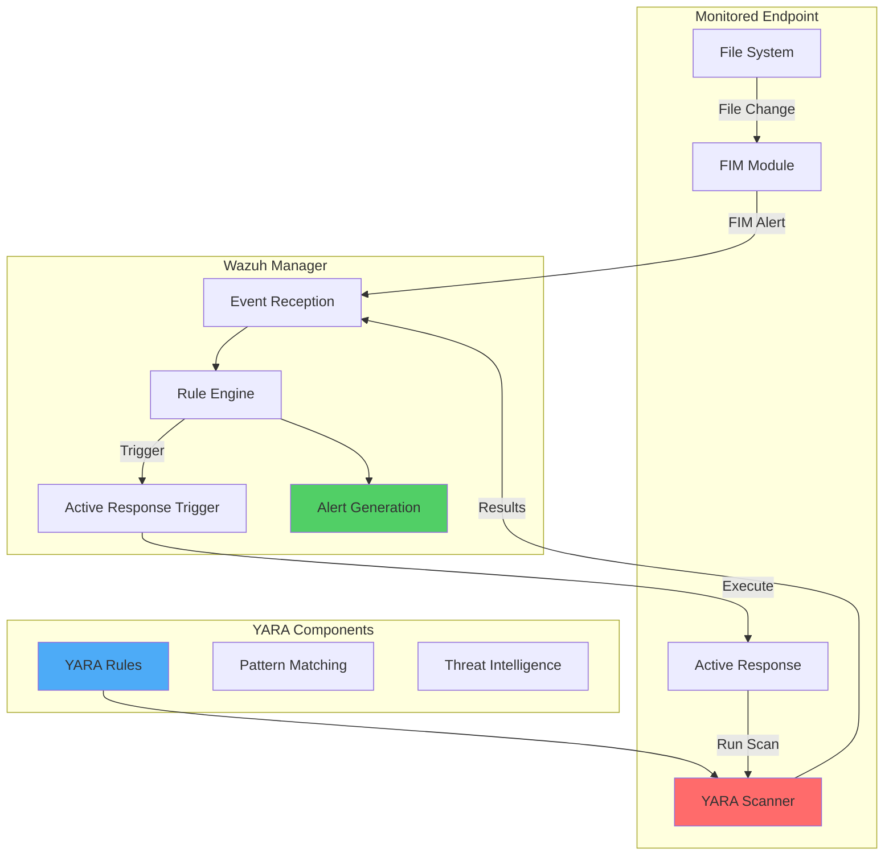

# Detecting Malware Using YARA Integration with Wazuh

## Introduction

YARA is a powerful pattern matching engine designed to identify and classify malware. When integrated with Wazuh, it provides real-time malware detection capabilities by scanning files that are added or modified on monitored endpoints. This integration leverages Wazuh's File Integrity Monitoring (FIM) module to trigger YARA scans through Active Response, creating an automated malware detection system.

The integration offers several key benefits:

- 🔍 **Real-time Detection**: Automatically scan new or modified files as they appear
- 🛡️ **Pattern-based Detection**: Use YARA's powerful rule engine to identify malware
- 🚀 **Automated Response**: Trigger immediate actions when malware is detected
- 📊 **Centralized Monitoring**: View all detections through Wazuh dashboard
- 🔧 **Cross-platform Support**: Works on both Linux and Windows endpoints

## Architecture Overview

### How YARA Integration Works



### Key Components

1. **File Integrity Monitoring (FIM)**: Monitors specified directories for file changes
2. **Active Response Module**: Executes YARA scans when triggered by FIM events
3. **YARA Engine**: Performs pattern matching against malware signatures
4. **Rule Processing**: Analyzes scan results and generates appropriate alerts

## Infrastructure Requirements

| Component | Requirements |
|-----------|--------------|
| **Linux Endpoint** | Ubuntu 22.04 / RHEL 9.0 with Wazuh agent |
| **Windows Endpoint** | Windows 11 with Wazuh agent |
| **YARA Version** | 4.2.3 or higher |
| **Wazuh Version** | 3.1.0 or higher (3.6.0+ for checksum verification) |

## Linux Configuration

### Phase 1: Install YARA on Linux Endpoint

#### Ubuntu Installation

```bash
# Update system and install dependencies
sudo apt update
sudo apt install -y make gcc autoconf libtool libssl-dev pkg-config jq

# Download YARA
sudo curl -LO https://github.com/VirusTotal/yara/archive/v4.2.3.tar.gz
sudo tar -xvzf v4.2.3.tar.gz -C /usr/local/bin/ && rm -f v4.2.3.tar.gz

# Compile and install
cd /usr/local/bin/yara-4.2.3/
sudo ./bootstrap.sh && sudo ./configure && sudo make && sudo make install && sudo make check
```

#### RHEL Installation

```bash
# Install dependencies
sudo yum makecache
sudo yum install epel-release
sudo yum update
sudo yum install -y make automake gcc autoconf libtool openssl-devel pkg-config jq

# Download YARA
sudo curl -LO https://github.com/VirusTotal/yara/archive/v4.2.3.tar.gz
sudo tar -xvzf v4.2.3.tar.gz -C /usr/local/bin/ && rm -f v4.2.3.tar.gz

# Compile and install
cd /usr/local/bin/yara-4.2.3/
sudo ./bootstrap.sh && sudo ./configure && sudo make && sudo make install && sudo make check
```

#### Verify Installation

```bash
yara
```

Expected output:
```
yara: wrong number of arguments
Usage: yara [OPTION]... [NAMESPACE:]RULES_FILE... FILE | DIR | PID

Try `--help` for more options
```

#### Fix Library Path (if needed)

If you encounter library loading errors:

```bash
sudo su
echo "/usr/local/lib" >> /etc/ld.so.conf
ldconfig
exit
```

### Phase 2: Download YARA Rules

```bash
# Create rules directory
sudo mkdir -p /tmp/yara/rules

# Download Valhalla rules (demo set)
sudo curl 'https://valhalla.nextron-systems.com/api/v1/get' \
-H 'Accept: text/html,application/xhtml+xml,application/xml;q=0.9,*/*;q=0.8' \
-H 'Accept-Language: en-US,en;q=0.5' \
--compressed \
-H 'Referer: https://valhalla.nextron-systems.com/' \
-H 'Content-Type: application/x-www-form-urlencoded' \
-H 'DNT: 1' -H 'Connection: keep-alive' -H 'Upgrade-Insecure-Requests: 1' \
--data 'demo=demo&apikey=1111111111111111111111111111111111111111111111111111111111111111&format=text' \
-o /tmp/yara/rules/yara_rules.yar
```

### Phase 3: Create YARA Active Response Script

Create `/var/ossec/active-response/bin/yara.sh`:

```bash
#!/bin/bash
# Wazuh - Yara active response
# Copyright (C) 2015-2022, Wazuh Inc.
#
# This program is free software; you can redistribute it
# and/or modify it under the terms of the GNU General Public
# License (version 2) as published by the FSF - Free Software
# Foundation.


#------------------------- Gather parameters -------------------------#

# Extra arguments
read INPUT_JSON
YARA_PATH=$(echo $INPUT_JSON | jq -r .parameters.extra_args[1])
YARA_RULES=$(echo $INPUT_JSON | jq -r .parameters.extra_args[3])
FILENAME=$(echo $INPUT_JSON | jq -r .parameters.alert.syscheck.path)

# Set LOG_FILE path
LOG_FILE="logs/active-responses.log"

size=0
actual_size=$(stat -c %s ${FILENAME})
while [ ${size} -ne ${actual_size} ]; do
    sleep 1
    size=${actual_size}
    actual_size=$(stat -c %s ${FILENAME})
done

#----------------------- Analyze parameters -----------------------#

if [[ ! $YARA_PATH ]] || [[ ! $YARA_RULES ]]
then
    echo "wazuh-yara: ERROR - Yara active response error. Yara path and rules parameters are mandatory." >> ${LOG_FILE}
    exit 1
fi

#------------------------- Main workflow --------------------------#

# Execute Yara scan on the specified filename
yara_output="$("${YARA_PATH}"/yara -w -r "$YARA_RULES" "$FILENAME")"

if [[ $yara_output != "" ]]
then
    # Iterate every detected rule and append it to the LOG_FILE
    while read -r line; do
        echo "wazuh-yara: INFO - Scan result: $line" >> ${LOG_FILE}
    done <<< "$yara_output"
fi

exit 0;
```

Set proper permissions:

```bash
sudo chown root:wazuh /var/ossec/active-response/bin/yara.sh
sudo chmod 750 /var/ossec/active-response/bin/yara.sh
```

### Phase 4: Configure FIM on Linux Agent

Add to `/var/ossec/etc/ossec.conf`:

```xml
<syscheck>
  <directories realtime="yes">/tmp/yara/malware</directories>
</syscheck>
```

Restart the agent:

```bash
sudo systemctl restart wazuh-agent
```

## Windows Configuration

### Phase 1: Install Python and YARA

1. **Install Python**:
   - Download from [python.org](https://www.python.org/)
   - During installation, check:
     - "Install launcher for all users"
     - "Add Python 3.X to PATH"

2. **Install Visual C++ Redistributable**:
   - Download and install the latest package from Microsoft

3. **Download and Install YARA**:

```powershell
# Download YARA
Invoke-WebRequest -Uri https://github.com/VirusTotal/yara/releases/download/v4.2.3/yara-4.2.3-2029-win64.zip -OutFile v4.2.3-2029-win64.zip
Expand-Archive v4.2.3-2029-win64.zip; Remove-Item v4.2.3-2029-win64.zip

# Create directory and copy YARA
mkdir 'C:\Program Files (x86)\ossec-agent\active-response\bin\yara\'
cp .\v4.2.3-2029-win64\yara64.exe 'C:\Program Files (x86)\ossec-agent\active-response\bin\yara\'
```

### Phase 2: Download YARA Rules

```powershell
# Install valhallaAPI
pip install valhallaAPI

# Create download script
@'
from valhallaAPI.valhalla import ValhallaAPI

v = ValhallaAPI(api_key="1111111111111111111111111111111111111111111111111111111111111111")
response = v.get_rules_text()

with open('yara_rules.yar', 'w') as fh:
    fh.write(response)
'@ | Out-File -FilePath download_yara_rules.py -Encoding UTF8

# Run script and copy rules
python.exe download_yara_rules.py
mkdir 'C:\Program Files (x86)\ossec-agent\active-response\bin\yara\rules\'
cp yara_rules.yar 'C:\Program Files (x86)\ossec-agent\active-response\bin\yara\rules\'
```

### Phase 3: Create Windows Active Response Script

Create `C:\Program Files (x86)\ossec-agent\active-response\bin\yara.bat`:

```batch
@echo off

setlocal enableDelayedExpansion

reg Query "HKLM\Hardware\Description\System\CentralProcessor\0" | find /i "x86" > NUL && SET OS=32BIT || SET OS=64BIT

if %OS%==32BIT (
    SET log_file_path="%programfiles%\ossec-agent\active-response\active-responses.log"
)

if %OS%==64BIT (
    SET log_file_path="%programfiles(x86)%\ossec-agent\active-response\active-responses.log"
)

set input=
for /f "delims=" %%a in ('PowerShell -command "$logInput = Read-Host; Write-Output $logInput"') do (
    set input=%%a
)

set json_file_path="C:\Program Files (x86)\ossec-agent\active-response\stdin.txt"
set syscheck_file_path=
echo %input% > %json_file_path%

for /F "tokens=* USEBACKQ" %%F in (`Powershell -Nop -C "(Get-Content 'C:\Program Files (x86)\ossec-agent\active-response\stdin.txt'|ConvertFrom-Json).parameters.alert.syscheck.path"`) do (
set syscheck_file_path=%%F
)

del /f %json_file_path%
set yara_exe_path="C:\Program Files (x86)\ossec-agent\active-response\bin\yara\yara64.exe"
set yara_rules_path="C:\Program Files (x86)\ossec-agent\active-response\bin\yara\rules\yara_rules.yar"
echo %syscheck_file_path% >> %log_file_path%
for /f "delims=" %%a in ('powershell -command "& \"%yara_exe_path%\" \"%yara_rules_path%\" \"%syscheck_file_path%\""') do (
    echo wazuh-yara: INFO - Scan result: %%a >> %log_file_path%
)

exit /b
```

### Phase 4: Configure FIM on Windows Agent

Add to `C:\Program Files (x86)\ossec-agent\ossec.conf`:

```xml
<syscheck>
  <directories realtime="yes">C:\Users\<USER_NAME>\Downloads</directories>
</syscheck>
```

Restart the agent:

```powershell
Restart-Service -Name wazuh
```

## Wazuh Server Configuration

### Phase 1: Create Custom Decoders

Add to `/var/ossec/etc/decoders/local_decoder.xml`:

```xml
<!-- YARA Decoders -->
<decoder name="yara_decoder">
  <prematch>wazuh-yara:</prematch>
</decoder>

<decoder name="yara_decoder1">
  <parent>yara_decoder</parent>
  <regex>wazuh-yara: (\S+) - Scan result: (\S+) (\S+)</regex>
  <order>log_type, yara_rule, yara_scanned_file</order>
</decoder>
```

### Phase 2: Create Detection Rules

Add to `/var/ossec/etc/rules/local_rules.xml`:

```xml
<group name="syscheck,">
  <!-- Linux FIM rules -->
  <rule id="100300" level="7">
    <if_sid>550</if_sid>
    <field name="file">/tmp/yara/malware/</field>
    <description>File modified in /tmp/yara/malware/ directory.</description>
  </rule>
  
  <rule id="100301" level="7">
    <if_sid>554</if_sid>
    <field name="file">/tmp/yara/malware/</field>
    <description>File added to /tmp/yara/malware/ directory.</description>
  </rule>
  
  <!-- Windows FIM rules -->
  <rule id="100303" level="7">
    <if_sid>550</if_sid>
    <field name="file">C:\\Users\\<USER_NAME>\\Downloads</field>
    <description>File modified in C:\Users\<USER_NAME>\Downloads directory.</description>
  </rule>
  
  <rule id="100304" level="7">
    <if_sid>554</if_sid>
    <field name="file">C:\\Users\\<USER_NAME>\\Downloads</field>
    <description>File added to C:\Users\<USER_NAME>\Downloads directory.</description>
  </rule>
</group>

<group name="yara,">
  <rule id="108000" level="0">
    <decoded_as>yara_decoder</decoded_as>
    <description>Yara grouping rule</description>
  </rule>
  
  <rule id="108001" level="12">
    <if_sid>108000</if_sid>
    <match>wazuh-yara: INFO - Scan result: </match>
    <description>File "$(yara_scanned_file)" is a positive match. Yara rule: $(yara_rule)</description>
  </rule>
</group>
```

### Phase 3: Configure Active Response

Add to `/var/ossec/etc/ossec.conf`:

```xml
<ossec_config>
  <!-- Linux YARA command -->
  <command>
    <name>yara_linux</name>
    <executable>yara.sh</executable>
    <extra_args>-yara_path /usr/local/bin -yara_rules /tmp/yara/rules/yara_rules.yar</extra_args>
    <timeout_allowed>no</timeout_allowed>
  </command>

  <!-- Windows YARA command -->
  <command>
    <name>yara_windows</name>
    <executable>yara.bat</executable>
    <timeout_allowed>no</timeout_allowed>
  </command>

  <!-- Active Response configurations -->
  <active-response>
    <disabled>no</disabled>
    <command>yara_linux</command>
    <location>local</location>
    <rules_id>100300,100301</rules_id>
  </active-response>

  <active-response>
    <disabled>no</disabled>
    <command>yara_windows</command>
    <location>local</location>
    <rules_id>100303,100304</rules_id>
  </active-response>
</ossec_config>
```

Restart Wazuh manager:

```bash
sudo systemctl restart wazuh-manager
```

## Testing the Integration

### Linux Testing

1. Create malware downloader script at `/tmp/yara/malware/malware_downloader.sh`:

```bash
#!/bin/bash
# Wazuh - Malware Downloader for test purposes
# Copyright (C) 2015-2022, Wazuh Inc.
#
# This program is free software; you can redistribute it
# and/or modify it under the terms of the GNU General Public
# License (version 2) as published by the FSF - Free Software
# Foundation.

function fetch_sample(){
  curl -s -XGET "$1" -o "$2"
}

echo "WARNING: Downloading Malware samples, please use this script with caution."
read -p "  Do you want to continue? (y/n)" -n 1 -r ANSWER
echo

if [[ $ANSWER =~ ^[Yy]$ ]]
then
    echo
    # Mirai
    echo "# Mirai: https://en.wikipedia.org/wiki/Mirai_(malware)"
    echo "Downloading malware sample..."
    fetch_sample "https://wazuh-demo.s3-us-west-1.amazonaws.com/mirai" "/tmp/yara/malware/mirai" && echo "Done!" || echo "Error while downloading."
    echo

    # Xbash
    echo "# Xbash: https://unit42.paloaltonetworks.com/unit42-xbash-combines-botnet-ransomware-coinmining-worm-targets-linux-windows/"
    echo "Downloading malware sample..."
    fetch_sample "https://wazuh-demo.s3-us-west-1.amazonaws.com/xbash" "/tmp/yara/malware/xbash" && echo "Done!" || echo "Error while downloading."
    echo

    # VPNFilter
    echo "# VPNFilter: https://news.sophos.com/en-us/2018/05/24/vpnfilter-botnet-a-sophoslabs-analysis/"
    echo "Downloading malware sample..."
    fetch_sample "https://wazuh-demo.s3-us-west-1.amazonaws.com/vpn_filter" "/tmp/yara/malware/vpn_filter" && echo "Done!" || echo "Error while downloading."
    echo

    # Webshell
    echo "# WebShell: https://github.com/SecWiki/WebShell-2/blob/master/Php/Worse%20Linux%20Shell.php"
    echo "Downloading malware sample..."
    fetch_sample "https://wazuh-demo.s3-us-west-1.amazonaws.com/webshell" "/tmp/yara/malware/webshell" && echo "Done!" || echo "Error while downloading."
    echo
fi
```

2. Run the script:

```bash
sudo bash /tmp/yara/malware/malware_downloader.sh
```

### Windows Testing

Download EICAR test file:

```powershell
# Turn off Windows Defender temporarily
# Download EICAR test file
Invoke-WebRequest -Uri https://secure.eicar.org/eicar_com.zip -OutFile eicar.zip

# Extract and copy to monitored directory
Expand-Archive .\eicar.zip
cp .\eicar\eicar.com C:\Users\<USER_NAME>\Downloads
```

## Viewing Alerts

To view YARA detection alerts in Wazuh dashboard:

1. Navigate to **Threat Hunting** module
2. Add filter: `rule.groups:yara`
3. View detailed alert information including:
   - Detected file path
   - YARA rule that matched
   - Timestamp of detection
   - Agent that detected the threat

## Advanced YARA Rules

### Custom Rule Example

Create custom YARA rules for specific threats:

```yara
rule Ransomware_Generic
{
    meta:
        description = "Generic ransomware detection"
        author = "Security Team"
        date = "2024-01-01"
        severity = "high"
    
    strings:
        $ransom1 = "Your files have been encrypted" nocase
        $ransom2 = "Bitcoin" nocase
        $ransom3 = "decrypt" nocase
        $ransom4 = ".locked" nocase
        $crypto1 = "AES" nocase
        $crypto2 = "RSA" nocase
        
    condition:
        2 of ($ransom*) and 1 of ($crypto*)
}

rule Webshell_Detection
{
    meta:
        description = "Detects common webshells"
        author = "Security Team"
        
    strings:
        $php1 = "<?php" nocase
        $shell1 = "system(" nocase
        $shell2 = "exec(" nocase
        $shell3 = "shell_exec(" nocase
        $shell4 = "passthru(" nocase
        $eval = "eval(" nocase
        
    condition:
        $php1 and ($eval or 2 of ($shell*))
}
```

### Rule Management Best Practices

1. **Organize Rules by Category**:
   ```
   /tmp/yara/rules/
   ├── malware/
   ├── ransomware/
   ├── webshells/
   └── apt/
   ```

2. **Regular Updates**:
   - Subscribe to threat intelligence feeds
   - Update rules weekly
   - Test new rules before production

3. **Performance Optimization**:
   - Use fast pattern matching
   - Avoid overly complex conditions
   - Limit file size for scanning

## Troubleshooting

### Common Issues

#### YARA Not Found
```bash
# Check installation
which yara

# Verify library path
ldd $(which yara)

# Fix missing libraries
sudo ldconfig
```

#### No Alerts Generated
```bash
# Check FIM configuration
grep -A5 "syscheck" /var/ossec/etc/ossec.conf

# Verify Active Response
tail -f /var/ossec/logs/active-responses.log

# Test YARA manually
yara /tmp/yara/rules/yara_rules.yar /tmp/yara/malware/test_file
```

#### Permission Issues
```bash
# Fix script permissions
sudo chown root:wazuh /var/ossec/active-response/bin/yara.sh
sudo chmod 750 /var/ossec/active-response/bin/yara.sh

# Fix rule permissions
sudo chown -R root:wazuh /tmp/yara/rules/
sudo chmod -R 640 /tmp/yara/rules/*
```

## Performance Tuning

### Optimize Scanning

1. **Limit File Types**:
   ```xml
   <syscheck>
     <directories realtime="yes">/var/www</directories>
     <ignore type="sregex">.log$|.txt$|.jpg$|.png$</ignore>
   </syscheck>
   ```

2. **Set File Size Limits**:
   ```bash
   # In yara.sh, add size check
   MAX_SIZE=52428800  # 50MB
   if [ $(stat -c%s "$FILENAME") -gt $MAX_SIZE ]; then
       echo "File too large, skipping YARA scan" >> ${LOG_FILE}
       exit 0
   fi
   ```

3. **Use Efficient Rules**:
   - Avoid regex when possible
   - Use specific byte patterns
   - Optimize condition logic

## Integration with Threat Intelligence

### Automated Rule Updates

Create update script `/opt/yara-rule-updater.sh`:

```bash
#!/bin/bash

RULES_DIR="/tmp/yara/rules"
TEMP_DIR="/tmp/yara_update"

# Create temp directory
mkdir -p $TEMP_DIR

# Download latest rules from multiple sources
echo "Downloading YARA rules..."

# Yara-Rules project
git clone https://github.com/Yara-Rules/rules.git $TEMP_DIR/yara-rules

# Neo23x0 signature base
git clone https://github.com/Neo23x0/signature-base.git $TEMP_DIR/signature-base

# Compile all rules
echo "Compiling rules..."
find $TEMP_DIR -name "*.yar" -o -name "*.yara" | while read rule; do
    yara -w $rule /dev/null 2>/dev/null && cp $rule $RULES_DIR/
done

# Cleanup
rm -rf $TEMP_DIR

# Restart Wazuh manager to reload rules
systemctl restart wazuh-manager

echo "YARA rules updated successfully"
```

Schedule with cron:

```bash
# Run daily at 2 AM
0 2 * * * /opt/yara-rule-updater.sh > /var/log/yara-update.log 2>&1
```

## Conclusion

Integrating YARA with Wazuh provides a powerful malware detection system that combines:

- 🎯 **Signature-based Detection**: Leverage YARA's pattern matching capabilities
- ⚡ **Real-time Scanning**: Automatically scan files as they're created or modified  
- 🔄 **Automated Response**: Take immediate action on detected threats
- 📈 **Scalable Architecture**: Deploy across multiple endpoints
- 🔍 **Centralized Visibility**: Monitor all detections from Wazuh dashboard

This integration enhances your security posture by adding an additional layer of malware detection that works alongside traditional antivirus solutions.

## Key Takeaways

1. **Proper Setup is Critical**: Ensure YARA is correctly installed and paths are configured
2. **Rule Quality Matters**: Use well-tested YARA rules from reputable sources
3. **Monitor Performance**: Large rule sets can impact system performance
4. **Regular Updates**: Keep YARA rules updated with latest threat intelligence
5. **Test Thoroughly**: Always test in non-production environments first

## Resources

- [YARA Documentation](https://yara.readthedocs.io/)
- [Wazuh Active Response Documentation](https://documentation.wazuh.com/current/user-manual/capabilities/active-response/)
- [Valhalla YARA Rules](https://valhalla.nextron-systems.com/)
- [YARA Rules Repository](https://github.com/Yara-Rules/rules)

---

*Enhance your malware detection capabilities with YARA and Wazuh integration! 🛡️🔍*