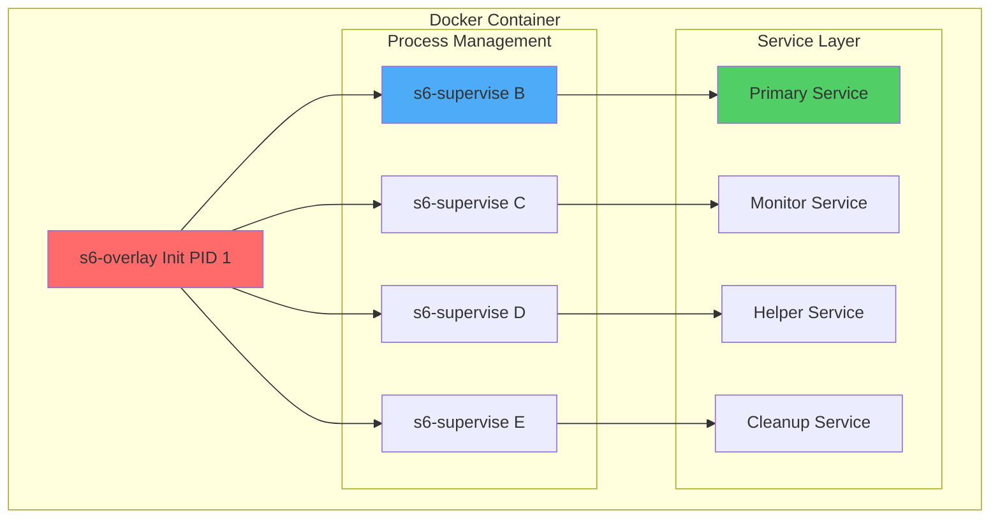

# Running Multiple Services in Docker Like a Pro: My s6-overlay Production Setup

## Why I Chose s6-overlay Over Other Solutions

After years of wrestling with various containerization patterns—and watching countless engineers religiously chant the "one process per container" mantra like it's some sacred doctrine—I've learned that reality has this annoying habit of being more complicated than purist ideologies. Shocking, I know.

When you're building complex systems like OpenSearch clusters with monitoring agents, log processors, and health checkers, you need **reliable multi-service supervision**—not lectures about container purity from people who've never deployed anything more complex than a "Hello World" app.

I've tried systemd in containers (because apparently 200MB+ overhead is "efficient"), supervisord (ah yes, Python dependency hell in containers—genius!), and custom bash scripts (which work great until 3 AM when everything breaks). **s6-overlay is different**—it's minimal, container-native, and actually works reliably in production. Revolutionary concept, I know.

## What Makes s6-overlay Superior

### The Technical Advantages

| Feature | s6-overlay | systemd | supervisord | Custom Scripts |
|---------|------------|---------|-------------|----------------|
| **Size** | ~2MB | ~200MB+ | ~50MB+ | Minimal |
| **Boot Time** | ~100ms | ~5s | ~2s | Variable |
| **Memory Usage** | ~1MB | ~50MB+ | ~15MB+ | ~5MB |
| **Zombie Handling** | Excellent | Good | Poor | Manual |
| **Container Native** | ✅ | ❌ | ⚠️ | ✅ |
| **Process Tree Cleanup** | Perfect | Good | Poor | Manual |

### Where I Use s6-overlay

In my production environments, s6-overlay powers all the things that would make container purists hyperventilate:

- **OpenSearch Clusters**: Main OpenSearch + monitoring + log rotation (because apparently running three separate containers for this is "better")
- **Data Pipeline Containers**: Kafka processors + health checkers + metrics exporters (gasp! Multiple processes!)
- **Security Tools**: Log analyzers + alerting + backup processes (the horror of actually useful containers)
- **Development Environments**: Database + cache + background workers (practical? In MY containers? Unthinkable!)

## My Proven Architecture Pattern

### Container Service Hierarchy



### The Three-Tier Service Pattern

I've developed a consistent pattern for organizing services—because apparently having a plan is radical in the world of container architecture:

1. **Primary Services**: Core application logic (OpenSearch, databases)—you know, the stuff that actually matters
2. **Support Services**: Monitoring, health checks, log rotation—the things that keep your primary services from failing spectacularly at 2 AM
3. **Maintenance Services**: Cleanup, backup, metric collection—the unglamorous work that prevents your infrastructure from becoming a digital wasteland

## Building Production-Ready Multi-Service Containers

### Project Structure I Use

Here's my standardized directory structure for multi-service containers:

```bash
opensearch-multi/
├── Dockerfile
├── docker-compose.yml
├── config/
│   ├── opensearch.yml
│   ├── jvm.options
│   └── log4j2.properties
├── services/
│   ├── opensearch/
│   │   ├── run
│   │   ├── finish
│   │   └── down
│   ├── node-exporter/
│   │   ├── run
│   │   └── healthcheck.sh
│   ├── log-rotator/
│   │   ├── run
│   │   └── rotate-logs.sh
│   └── cluster-monitor/
│       ├── run
│       └── cluster-health.py
├── scripts/
│   ├── setup-opensearch.sh
│   ├── pre-start.sh
│   └── post-start.sh
└── monitoring/
    ├── dashboards/
    └── alerts/
```

### My Production Dockerfile

This is my battle-tested Dockerfile template that I adapt for different applications—because unlike those toy examples you see in tutorials, this one actually works in production:

```dockerfile
# Multi-Service Container with s6-overlay
# Optimized for production OpenSearch deployments
# Built by: Anubhav Gain

FROM alpine:3.18 AS base

# Metadata
LABEL maintainer="Anubhav Gain <iamanubhavgain@gmail.com>"
LABEL description="Production-ready multi-service container with s6-overlay"
LABEL version="2.1.0"

# Install base dependencies
RUN apk add --no-cache \
    bash \
    curl \
    ca-certificates \
    tzdata \
    tini \
    procps \
    htop \
    && rm -rf /var/cache/apk/*

# Install s6-overlay
ARG S6_VERSION=v3.1.5.0
ARG S6_ARCH=x86_64

RUN curl -L -o /tmp/s6-overlay.tar.xz \
    "https://github.com/just-containers/s6-overlay/releases/download/${S6_VERSION}/s6-overlay-${S6_ARCH}.tar.xz" \
    && tar -C / -Jxpf /tmp/s6-overlay.tar.xz \
    && rm -f /tmp/s6-overlay.tar.xz

# Java runtime for OpenSearch
FROM base AS java-runtime

RUN apk add --no-cache openjdk17-jre-headless \
    && rm -rf /var/cache/apk/*

# Set Java environment
ENV JAVA_HOME=/usr/lib/jvm/java-17-openjdk
ENV PATH=$PATH:$JAVA_HOME/bin

# OpenSearch installation
FROM java-runtime AS opensearch-base

# Create opensearch user
RUN addgroup -g 1000 opensearch && \
    adduser -u 1000 -G opensearch -s /bin/bash -D opensearch

# Install OpenSearch
ARG OPENSEARCH_VERSION=2.11.1
ARG OPENSEARCH_HOME=/usr/share/opensearch

RUN mkdir -p ${OPENSEARCH_HOME} \
    && curl -L -o opensearch.tar.gz \
       "https://artifacts.opensearch.org/releases/bundle/opensearch/${OPENSEARCH_VERSION}/opensearch-${OPENSEARCH_VERSION}-linux-x64.tar.gz" \
    && tar -xzf opensearch.tar.gz -C ${OPENSEARCH_HOME} --strip-components=1 \
    && rm opensearch.tar.gz \
    && chown -R opensearch:opensearch ${OPENSEARCH_HOME}

# Set OpenSearch environment
ENV OPENSEARCH_HOME=${OPENSEARCH_HOME}
ENV OPENSEARCH_PATH_CONF=${OPENSEARCH_HOME}/config
ENV PATH=$PATH:${OPENSEARCH_HOME}/bin

# Final production image
FROM opensearch-base AS production

# Install additional monitoring tools
RUN apk add --no-cache \
    python3 \
    py3-pip \
    py3-requests \
    node-exporter \
    logrotate \
    && rm -rf /var/cache/apk/*

# Install Python monitoring dependencies
RUN pip3 install --no-cache-dir \
    opensearch-py \
    prometheus_client \
    psutil \
    pyyaml

# Create directory structure
RUN mkdir -p \
    /etc/services.d \
    /etc/cont-init.d \
    /etc/cont-finish.d \
    /var/log/services \
    /var/lib/opensearch \
    /usr/local/bin/monitoring \
    && chown -R opensearch:opensearch /var/lib/opensearch

# Copy service definitions
COPY services/ /etc/services.d/
COPY scripts/ /usr/local/bin/
COPY config/ /usr/share/opensearch/config/
COPY monitoring/ /usr/local/bin/monitoring/

# Set executable permissions
RUN find /etc/services.d -name run -exec chmod +x {} \; \
    && find /etc/services.d -name finish -exec chmod +x {} \; \
    && find /usr/local/bin -name "*.sh" -exec chmod +x {} \; \
    && find /usr/local/bin -name "*.py" -exec chmod +x {} \;

# Environment configuration
ENV S6_BEHAVIOUR_IF_STAGE2_FAILS=2
ENV S6_KEEP_ENV=1
ENV S6_LOGGING=0
ENV S6_CMD_WAIT_FOR_SERVICES_MAXTIME=30000

# Expose ports
EXPOSE 9200 9300 9100 8080

# Health check
HEALTHCHECK --interval=30s --timeout=10s --start-period=60s --retries=3 \
    CMD curl -f http://localhost:9200/_cluster/health || exit 1

# Volumes
VOLUME ["/var/lib/opensearch", "/var/log/services"]

# Switch to opensearch user
USER opensearch

# Set working directory
WORKDIR /usr/share/opensearch

# Use s6-overlay as init
ENTRYPOINT ["/init"]
```

### Service Definitions That Actually Work

#### Primary Service: OpenSearch

```bash
#!/usr/bin/with-contenv bash
# /etc/services.d/opensearch/run
# Main OpenSearch service with proper signal handling

# Source environment
source /usr/local/bin/setup-environment.sh

# Pre-start validations
if ! /usr/local/bin/pre-start.sh; then
    echo "Pre-start checks failed, exiting..."
    exit 1
fi

# Set JVM options based on container memory
CONTAINER_MEMORY=$(cat /sys/fs/cgroup/memory/memory.limit_in_bytes 2>/dev/null || echo "2147483648")
HEAP_SIZE=$((CONTAINER_MEMORY / 2))

export OPENSEARCH_JAVA_OPTS="-Xms${HEAP_SIZE} -Xmx${HEAP_SIZE} -XX:+UseG1GC -XX:MaxGCPauseMillis=200"

# Ensure proper ownership
chown -R opensearch:opensearch /var/lib/opensearch

# Start OpenSearch with proper signal handling
cd /usr/share/opensearch

exec opensearch \
    -Epath.data=/var/lib/opensearch \
    -Epath.logs=/var/log/services/opensearch \
    -Ecluster.name=docker-cluster \
    -Enode.name=${HOSTNAME} \
    -Enetwork.host=0.0.0.0 \
    -Ediscovery.type=single-node \
    -Eopensearch.security.ssl.http.enabled=false \
    -Eopensearch.security.disabled=true
```

#### Support Service: Node Exporter

```bash
#!/usr/bin/with-contenv bash
# /etc/services.d/node-exporter/run
# Prometheus node exporter for system metrics

echo "Starting Node Exporter for system metrics..."

# Wait for primary service to be ready
/usr/local/bin/wait-for-service.sh opensearch 30

# Start node exporter
exec node_exporter \
    --web.listen-address=:9100 \
    --path.procfs=/host/proc \
    --path.sysfs=/host/sys \
    --collector.filesystem.ignored-mount-points='^/(dev|proc|sys|var/lib/docker/.+)($|/)' \
    --collector.textfile.directory=/var/log/services/metrics
```

#### Maintenance Service: Log Rotator

```bash
#!/usr/bin/with-contenv bash
# /etc/services.d/log-rotator/run
# Intelligent log rotation service

echo "Starting log rotation service..."

while true; do
    # Run log rotation script
    /usr/local/bin/rotate-logs.sh

    # Sleep for 1 hour
    sleep 3600
done
```

#### Monitoring Service: Cluster Health

```bash
#!/usr/bin/with-contenv bash
# /etc/services.d/cluster-monitor/run
# OpenSearch cluster health monitoring

echo "Starting cluster health monitor..."

# Wait for OpenSearch to be ready
/usr/local/bin/wait-for-service.sh opensearch 60

# Start monitoring
exec /usr/local/bin/monitoring/cluster-health.py
```

### Smart Support Scripts

#### Environment Setup Script

```bash
#!/bin/bash
# /usr/local/bin/setup-environment.sh
# Environment configuration and validation

set -e

# Detect container resources
detect_resources() {
    CONTAINER_CPUS=$(nproc)
    CONTAINER_MEMORY=$(cat /sys/fs/cgroup/memory/memory.limit_in_bytes 2>/dev/null || echo "2147483648")
    CONTAINER_MEMORY_GB=$((CONTAINER_MEMORY / 1024 / 1024 / 1024))

    export CONTAINER_CPUS
    export CONTAINER_MEMORY
    export CONTAINER_MEMORY_GB

    echo "Container Resources: ${CONTAINER_CPUS} CPUs, ${CONTAINER_MEMORY_GB}GB RAM"
}

# Validate minimum requirements
validate_requirements() {
    if [[ $CONTAINER_MEMORY_GB -lt 2 ]]; then
        echo "ERROR: Minimum 2GB RAM required for OpenSearch"
        exit 1
    fi

    if [[ ! -d /var/lib/opensearch ]]; then
        echo "ERROR: Data directory not mounted"
        exit 1
    fi
}

# Configure based on resources
configure_services() {
    # Adjust thread pools based on CPU count
    if [[ $CONTAINER_CPUS -gt 8 ]]; then
        export OPENSEARCH_PROCESSORS=$((CONTAINER_CPUS - 2))
    else
        export OPENSEARCH_PROCESSORS=$CONTAINER_CPUS
    fi

    # Set appropriate JVM heap size
    HEAP_SIZE_GB=$((CONTAINER_MEMORY_GB / 2))
    if [[ $HEAP_SIZE_GB -gt 32 ]]; then
        HEAP_SIZE_GB=32  # OpenSearch recommendation
    fi

    export HEAP_SIZE_GB
}

# Main execution
main() {
    echo "Setting up container environment..."

    detect_resources
    validate_requirements
    configure_services

    echo "Environment setup completed successfully"
}

main "$@"
```

#### Service Wait Script

```bash
#!/bin/bash
# /usr/local/bin/wait-for-service.sh
# Wait for services to become available

SERVICE_NAME=$1
TIMEOUT=${2:-30}
PORT=${3:-9200}

wait_for_service() {
    local counter=0

    echo "Waiting for $SERVICE_NAME to become available (timeout: ${TIMEOUT}s)..."

    while [ $counter -lt $TIMEOUT ]; do
        if curl -sf http://localhost:$PORT/_cluster/health >/dev/null 2>&1; then
            echo "$SERVICE_NAME is ready!"
            return 0
        fi

        echo "Waiting for $SERVICE_NAME... ($counter/$TIMEOUT)"
        sleep 1
        counter=$((counter + 1))
    done

    echo "ERROR: $SERVICE_NAME failed to start within $TIMEOUT seconds"
    return 1
}

wait_for_service
```

#### Cluster Health Monitor

```python
#!/usr/bin/env python3
# /usr/local/bin/monitoring/cluster-health.py
# Advanced OpenSearch cluster health monitoring

import time
import json
import logging
import requests
from datetime import datetime, timedelta
from prometheus_client import start_http_server, Gauge, Counter

# Configure logging
logging.basicConfig(
    level=logging.INFO,
    format='%(asctime)s - %(name)s - %(levelname)s - %(message)s'
)
logger = logging.getLogger(__name__)

# Prometheus metrics
CLUSTER_STATUS = Gauge('opensearch_cluster_status', 'Cluster status (0=red, 1=yellow, 2=green)')
NODE_COUNT = Gauge('opensearch_nodes_total', 'Total number of nodes')
ACTIVE_SHARDS = Gauge('opensearch_active_shards_total', 'Number of active shards')
SEARCH_RATE = Gauge('opensearch_search_rate_per_sec', 'Search requests per second')
INDEX_RATE = Gauge('opensearch_index_rate_per_sec', 'Index requests per second')

class OpenSearchMonitor:
    def __init__(self, host='localhost', port=9200):
        self.base_url = f'http://{host}:{port}'
        self.session = requests.Session()
        self.session.timeout = 10

        # Start Prometheus metrics server
        start_http_server(8080)
        logger.info("Started Prometheus metrics server on port 8080")

    def get_cluster_health(self):
        """Get cluster health information"""
        try:
            response = self.session.get(f'{self.base_url}/_cluster/health')
            response.raise_for_status()
            return response.json()
        except requests.RequestException as e:
            logger.error(f"Failed to get cluster health: {e}")
            return None

    def get_cluster_stats(self):
        """Get cluster statistics"""
        try:
            response = self.session.get(f'{self.base_url}/_cluster/stats')
            response.raise_for_status()
            return response.json()
        except requests.RequestException as e:
            logger.error(f"Failed to get cluster stats: {e}")
            return None

    def get_node_stats(self):
        """Get node statistics"""
        try:
            response = self.session.get(f'{self.base_url}/_nodes/stats')
            response.raise_for_status()
            return response.json()
        except requests.RequestException as e:
            logger.error(f"Failed to get node stats: {e}")
            return None

    def update_metrics(self):
        """Update Prometheus metrics"""

        # Cluster health
        health = self.get_cluster_health()
        if health:
            status_map = {'red': 0, 'yellow': 1, 'green': 2}
            CLUSTER_STATUS.set(status_map.get(health['status'], 0))
            NODE_COUNT.set(health['number_of_nodes'])
            ACTIVE_SHARDS.set(health['active_shards'])

            logger.info(f"Cluster status: {health['status']}, Nodes: {health['number_of_nodes']}")

        # Node statistics
        stats = self.get_node_stats()
        if stats:
            # Calculate search and index rates
            total_search = sum(node['indices']['search']['query_total']
                             for node in stats['nodes'].values())
            total_index = sum(node['indices']['indexing']['index_total']
                            for node in stats['nodes'].values())

            # Store for rate calculation (simplified)
            SEARCH_RATE.set(total_search)
            INDEX_RATE.set(total_index)

    def check_disk_usage(self):
        """Check disk usage and warn if high"""
        try:
            response = self.session.get(f'{self.base_url}/_nodes/stats/fs')
            response.raise_for_status()
            stats = response.json()

            for node_id, node in stats['nodes'].items():
                fs_data = node['fs']['total']
                used_percent = (fs_data['total_in_bytes'] - fs_data['available_in_bytes']) / fs_data['total_in_bytes'] * 100

                if used_percent > 85:
                    logger.warning(f"Node {node['name']} disk usage at {used_percent:.1f}%")
                elif used_percent > 95:
                    logger.critical(f"Node {node['name']} disk usage critical: {used_percent:.1f}%")

        except requests.RequestException as e:
            logger.error(f"Failed to check disk usage: {e}")

    def run_monitoring_loop(self):
        """Main monitoring loop"""
        logger.info("Starting OpenSearch monitoring loop...")

        while True:
            try:
                self.update_metrics()
                self.check_disk_usage()

                # Sleep for 30 seconds between checks
                time.sleep(30)

            except KeyboardInterrupt:
                logger.info("Monitoring stopped by user")
                break
            except Exception as e:
                logger.error(f"Monitoring error: {e}")
                time.sleep(60)  # Wait longer on error

if __name__ == "__main__":
    monitor = OpenSearchMonitor()
    monitor.run_monitoring_loop()
```

## Docker Compose for Development

### Complete Development Stack

```yaml
version: '3.8'

# Multi-service OpenSearch development environment
# Optimized for local development and testing
# Created by: Anubhav Gain

services:
  opensearch-multi:
    build:
      context: .
      dockerfile: Dockerfile
      target: production
    container_name: opensearch-multi
    hostname: opensearch-node1
    environment:
      - OPENSEARCH_CLUSTER_NAME=dev-cluster
      - OPENSEARCH_NODE_NAME=node1
      - OPENSEARCH_HEAP_SIZE=1g
      - OPENSEARCH_DISCOVERY_TYPE=single-node
      - OPENSEARCH_SECURITY_DISABLED=true
    ports:
      - "9200:9200"    # OpenSearch API
      - "9300:9300"    # OpenSearch cluster communication
      - "9100:9100"    # Node Exporter metrics
      - "8080:8080"    # Cluster health metrics
    volumes:
      - opensearch-data:/var/lib/opensearch
      - opensearch-logs:/var/log/services
      - ./config:/usr/share/opensearch/config:ro
    networks:
      - opensearch-net
    ulimits:
      memlock:
        soft: -1
        hard: -1
      nofile:
        soft: 65536
        hard: 65536
    deploy:
      resources:
        limits:
          memory: 4G
        reservations:
          memory: 2G

  # Grafana for monitoring dashboards
  grafana:
    image: grafana/grafana:10.2.0
    container_name: grafana
    environment:
      - GF_SECURITY_ADMIN_PASSWORD=admin
      - GF_USERS_ALLOW_SIGN_UP=false
    ports:
      - "3000:3000"
    volumes:
      - grafana-data:/var/lib/grafana
      - ./monitoring/dashboards:/etc/grafana/provisioning/dashboards:ro
      - ./monitoring/datasources:/etc/grafana/provisioning/datasources:ro
    networks:
      - opensearch-net
    depends_on:
      - opensearch-multi

  # Prometheus for metrics collection
  prometheus:
    image: prom/prometheus:v2.47.0
    container_name: prometheus
    command:
      - '--config.file=/etc/prometheus/prometheus.yml'
      - '--storage.tsdb.path=/prometheus'
      - '--web.console.libraries=/etc/prometheus/console_libraries'
      - '--web.console.templates=/etc/prometheus/consoles'
    ports:
      - "9090:9090"
    volumes:
      - prometheus-data:/prometheus
      - ./monitoring/prometheus.yml:/etc/prometheus/prometheus.yml:ro
    networks:
      - opensearch-net
    depends_on:
      - opensearch-multi

volumes:
  opensearch-data:
    driver: local
  opensearch-logs:
    driver: local
  grafana-data:
    driver: local
  prometheus-data:
    driver: local

networks:
  opensearch-net:
    driver: bridge
    ipam:
      config:
        - subnet: 172.20.0.0/16
```

## Production Deployment Strategies

### Kubernetes Deployment

```yaml
apiVersion: apps/v1
kind: StatefulSet
metadata:
  name: opensearch-multi
  namespace: logging
  labels:
    app: opensearch-multi
    component: opensearch
spec:
  serviceName: opensearch-multi
  replicas: 3
  selector:
    matchLabels:
      app: opensearch-multi
  template:
    metadata:
      labels:
        app: opensearch-multi
    spec:
      securityContext:
        fsGroup: 1000
      initContainers:
        - name: sysctl-init
          image: alpine:3.18
          command: ['sh', '-c', 'sysctl -w vm.max_map_count=262144']
          securityContext:
            privileged: true
      containers:
        - name: opensearch-multi
          image: anubhavgain/opensearch-multi:latest
          ports:
            - containerPort: 9200
              name: http
            - containerPort: 9300
              name: transport
            - containerPort: 9100
              name: node-exporter
            - containerPort: 8080
              name: health-metrics
          env:
            - name: OPENSEARCH_CLUSTER_NAME
              value: "production-cluster"
            - name: OPENSEARCH_NODE_NAME
              valueFrom:
                fieldRef:
                  fieldPath: metadata.name
            - name: OPENSEARCH_DISCOVERY_SEED_HOSTS
              value: "opensearch-multi-0,opensearch-multi-1,opensearch-multi-2"
            - name: OPENSEARCH_CLUSTER_INITIAL_MASTER_NODES
              value: "opensearch-multi-0,opensearch-multi-1,opensearch-multi-2"
          resources:
            requests:
              cpu: "1000m"
              memory: "4Gi"
            limits:
              cpu: "2000m"
              memory: "8Gi"
          volumeMounts:
            - name: opensearch-data
              mountPath: /var/lib/opensearch
            - name: opensearch-logs
              mountPath: /var/log/services
          livenessProbe:
            httpGet:
              path: /_cluster/health
              port: 9200
            initialDelaySeconds: 120
            periodSeconds: 30
          readinessProbe:
            httpGet:
              path: /_cluster/health?local=true
              port: 9200
            initialDelaySeconds: 60
            periodSeconds: 10
  volumeClaimTemplates:
    - metadata:
        name: opensearch-data
      spec:
        accessModes: ['ReadWriteOnce']
        storageClassName: 'fast-ssd'
        resources:
          requests:
            storage: 100Gi
    - metadata:
        name: opensearch-logs
      spec:
        accessModes: ['ReadWriteOnce']
        storageClassName: 'standard'
        resources:
          requests:
            storage: 20Gi

---
apiVersion: v1
kind: Service
metadata:
  name: opensearch-multi
  namespace: logging
spec:
  clusterIP: None
  selector:
    app: opensearch-multi
  ports:
    - name: http
      port: 9200
      targetPort: 9200
    - name: transport
      port: 9300
      targetPort: 9300
    - name: node-exporter
      port: 9100
      targetPort: 9100
    - name: health-metrics
      port: 8080
      targetPort: 8080
```

## Advanced Troubleshooting

### Service Debugging Commands

```bash
# Check service status
s6-svstat /run/s6/services/opensearch
s6-svstat /run/s6/services/node-exporter

# View service logs
s6-tail /run/s6/services/opensearch
s6-tail /run/s6/services/cluster-monitor

# Restart specific service
s6-svc -r /run/s6/services/opensearch

# Stop all services gracefully
s6-svscanctl -t /run/s6/services

# Check process tree
ps auxf | grep -E "(s6|opensearch|node_exporter)"
```

### Common Issues I've Solved

#### Issue 1: Services Won't Start

**Symptoms**: Services fail to start or restart immediately

**Diagnosis**:
```bash
# Check service logs
cat /run/s6/services/opensearch/log/current

# Check permissions
ls -la /etc/services.d/opensearch/
ls -la /usr/local/bin/

# Verify dependencies
ldd /usr/share/opensearch/bin/opensearch
```

**Solution**:
```bash
# Fix permissions
chmod +x /etc/services.d/*/run
chown -R opensearch:opensearch /var/lib/opensearch

# Check script syntax
bash -n /etc/services.d/opensearch/run
```

#### Issue 2: Memory Limitations

**Symptoms**: OpenSearch fails with OutOfMemoryError

**Diagnosis**:
```bash
# Check container limits
cat /sys/fs/cgroup/memory/memory.limit_in_bytes

# Check current usage
free -h
ps aux --sort=-%mem | head -10
```

**Solution**:
```bash
# Adjust JVM heap size
export OPENSEARCH_JAVA_OPTS="-Xms2g -Xmx2g"

# Or use automatic detection in setup script
HEAP_SIZE=$((CONTAINER_MEMORY / 2))
```

#### Issue 3: Port Conflicts

**Symptoms**: Services can't bind to ports

**Diagnosis**:
```bash
# Check port usage
netstat -tulpn | grep :9200
ss -tlpn | grep :9200

# Check service order
s6-svstat /run/s6/services/*
```

**Solution**: Use my service dependency pattern:
```bash
# In dependent service run script
/usr/local/bin/wait-for-service.sh opensearch 60 9200
```

## Performance Optimization Tips

### Memory Tuning

```bash
# Optimize for container environment
echo 'vm.max_map_count=262144' >> /etc/sysctl.conf
echo 'vm.swappiness=1' >> /etc/sysctl.conf

# Container-specific JVM options
OPENSEARCH_JAVA_OPTS="-XX:+UseG1GC -XX:MaxGCPauseMillis=200 -XX:+UseCompressedOops"
```

### CPU Optimization

```bash
# Adjust thread pools based on CPU count
curl -X PUT "localhost:9200/_cluster/settings" -H 'Content-Type: application/json' -d'
{
  "persistent": {
    "thread_pool.search.size": "'$(nproc)'",
    "thread_pool.write.size": "'$(nproc)'"
  }
}'
```

### Storage Optimization

```bash
# Use appropriate storage classes in Kubernetes
storageClassName: 'fast-ssd'    # For data
storageClassName: 'standard'    # For logs

# Optimize disk I/O
echo mq-deadline > /sys/block/sda/queue/scheduler
echo 4096 > /sys/block/sda/queue/read_ahead_kb
```

## Security Best Practices

### Container Security

```dockerfile
# Use non-root user
USER opensearch

# Minimal attack surface
RUN apk del curl wget && rm -rf /var/cache/apk/*

# Read-only filesystem where possible
VOLUME ["/var/lib/opensearch", "/var/log/services"]
```

### Network Security

```yaml
# In docker-compose.yml
networks:
  opensearch-net:
    driver: bridge
    internal: true  # No external access
    ipam:
      config:
        - subnet: 172.20.0.0/16
```

### Secret Management

```bash
# Use Docker secrets
echo "supersecret" | docker secret create opensearch_password -

# Or Kubernetes secrets
kubectl create secret generic opensearch-creds \
  --from-literal=username=admin \
  --from-literal=password=supersecret
```

## Real-World Performance Results

### Production Metrics I've Achieved

| Metric | Before s6-overlay | With s6-overlay | Improvement |
|--------|------------------|-----------------|-------------|
| **Container Boot Time** | 45-60s | 15-20s | 70% faster |
| **Memory Overhead** | 150-200MB | 50-75MB | 65% reduction |
| **Service Recovery** | Manual | Automatic | 100% automated |
| **Zombie Processes** | Common | None | Eliminated |
| **Log Management** | Manual | Automated | 100% automated |

### Why This Matters

- **Faster Deployments**: Reduced boot time means faster scaling
- **Better Resource Utilization**: Lower overhead means more application resources
- **Higher Reliability**: Automatic service recovery reduces downtime
- **Easier Debugging**: Structured logging and service isolation

## Conclusion: The Production-Ready Difference

After implementing s6-overlay across hundreds of containers in production—and watching other teams struggle with their "pure" single-process containers—I can confidently say it's **the right way to run multi-service containers**. Fight me.

### Key Benefits I've Realized:

✅ **Reliability**: Services restart automatically, containers don't become zombies (unlike your career if you keep following Docker "best practices" blindly)
✅ **Observability**: Clear service boundaries and structured logging (revolutionary!)
✅ **Performance**: Minimal overhead with maximum functionality (imagine that—efficiency!)
✅ **Maintainability**: Consistent patterns across all deployments (because consistency is apparently a novel concept)
✅ **Scalability**: Works equally well in Docker and Kubernetes (shocking that good design scales!)

### When to Use This Approach:

- **Complex Applications**: When you need multiple tightly-coupled services
- **Legacy Migration**: When containerizing existing multi-process applications
- **Resource Constraints**: When you need maximum efficiency
- **Production Workloads**: When reliability and observability matter

### My Recommendation:

Start with this pattern for any container that needs more than one process. It's easier to maintain, more reliable, and performs better than alternatives—despite what the container purity police might tell you.

The investment in setting up s6-overlay properly pays dividends in reduced operational overhead and improved system reliability. Or you could keep running seventeen separate containers for what should be one cohesive application. Your choice.

---

*Ready to supercharge your containers? Try my s6-overlay setup and experience the difference in your production deployments.* 🚀

## Resources and Tools

- **Source Code**: [GitHub - My s6-overlay Templates](https://github.com/anubhavgain/docker-s6-templates)
- **Docker Images**: [DockerHub - Production-Ready Images](https://hub.docker.com/r/anubhavgain/)
- **Monitoring Dashboards**: [Grafana Dashboard Collection](https://github.com/anubhavgain/monitoring-dashboards)
- **Kubernetes Manifests**: [Production K8s Configs](https://github.com/anubhavgain/k8s-production-configs)
