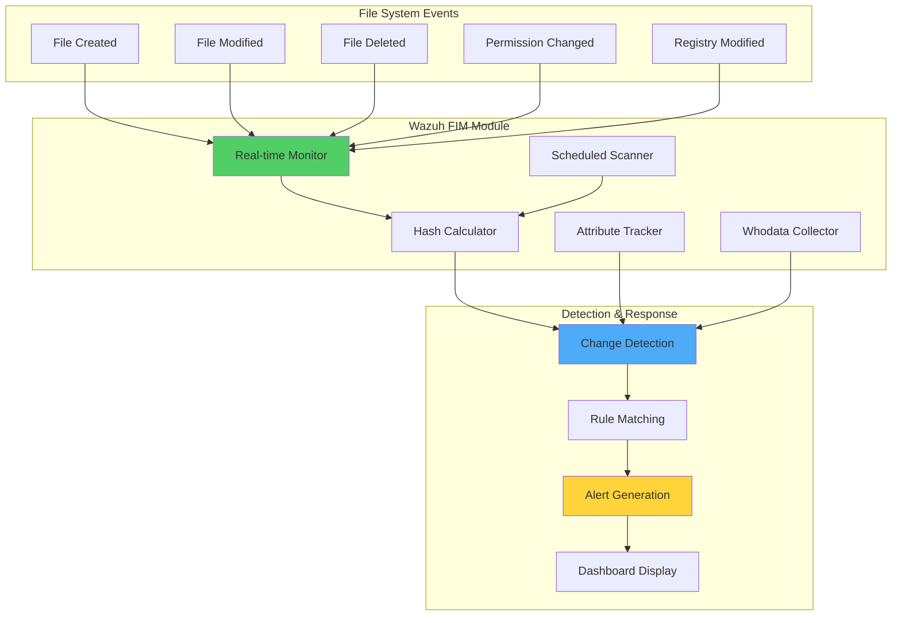
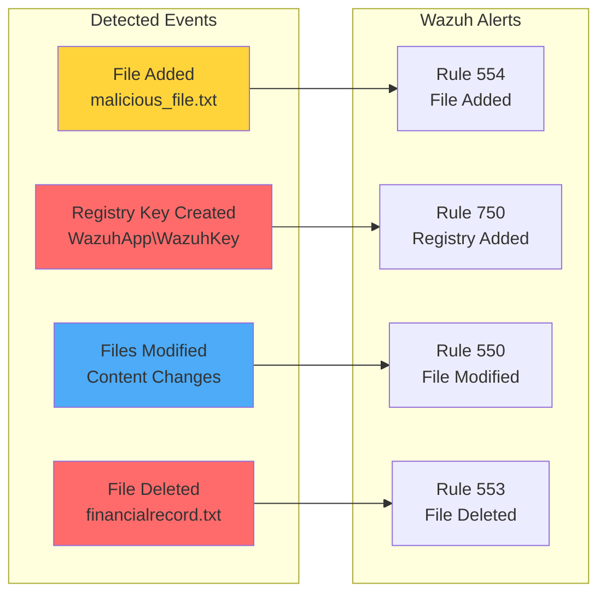

# Enhancing Data Security with the Wazuh Open Source FIM

## Introduction

File Integrity Monitoring (FIM) is a critical security process that validates the integrity of system files to ensure they haven't been tampered with or modified. In today's threat landscape, where advanced persistent threats and insider attacks are increasingly common, organizations need robust FIM capabilities to detect unauthorized changes and maintain security compliance.

Wazuh provides a powerful open source FIM module that helps security analysts:

- 🔍 **Track file changes** in real-time or scheduled intervals
- 👤 **Identify who** made changes using whodata functionality
- 📝 **Monitor what** was changed with detailed content tracking
- 🗓️ **Know when** changes occurred with precise timestamps
- 🛡️ **Protect critical** system files and directories
- 📊 **Meet compliance** requirements (PCI DSS, GDPR, NIST 800-53)

## Understanding Wazuh FIM Architecture

### How FIM Works



### FIM Capabilities

| Feature | Description | Platform |
|---------|-------------|----------|
| **Real-time Monitoring** | Detect changes as they happen | Windows, Linux, macOS |
| **Scheduled Scans** | Periodic integrity checks | All platforms |
| **Whodata** | Track user responsible for changes | Linux (with auditd) |
| **Content Changes** | Report what changed in files | All platforms |
| **Registry Monitoring** | Track Windows Registry modifications | Windows only |
| **Hash Verification** | MD5, SHA1, SHA256 checksums | All platforms |

## Benefits of Wazuh Open Source FIM

### 1. Open Source Advantages
- **Cost-effective**: No licensing fees
- **Transparent**: Audit the source code
- **Customizable**: Adapt to specific needs
- **Community-driven**: Active development and support

### 2. Change Management
- Real-time visibility into file system changes
- Detailed audit trails for compliance
- User attribution for accountability
- Historical tracking and reporting

### 3. Cyber Threat Protection
- Detect malware persistence mechanisms
- Identify unauthorized system modifications
- Alert on suspicious file activities
- Integrate with automated response

### 4. Compliance Support
- Meet regulatory requirements
- Generate audit reports
- Maintain change logs
- Demonstrate security controls

## Infrastructure Setup

For this demonstration, we'll use:

- **Wazuh Server**: Pre-built OVA 4.7.2 with all components
- **Windows Endpoint**: Windows 11 with Wazuh agent 4.7.2
- **Linux Endpoint**: Ubuntu 22.04.3 with Wazuh agent 4.7.2

## Implementation Guide

### Attack Scenario Simulation

We'll simulate a malicious actor performing these actions:

1. Create malicious files in monitored directories
2. Change file permissions to executable
3. Create Windows Registry keys (Windows only)
4. Modify content of existing files
5. Delete sensitive financial records

### Phase 1: Windows Configuration

#### Prepare Test Environment

```powershell
# Create test directory
mkdir C:\WazuhFIMtest

# Create dummy files
type NUL > C:\WazuhFIMtest\financialrecord.txt
type NUL > C:\WazuhFIMtest\sensitivefile.txt
type NUL > C:\WazuhFIMtest\testfile.txt
```

#### Configure FIM Monitoring

Edit `C:\Program Files (x86)\ossec-agent\ossec.conf`:

```xml
<ossec_config>
  <syscheck>
    <!-- Monitor directory with real-time detection -->
    <directories realtime="yes" check_all="yes">C:\WazuhFIMtest</directories>

    <!-- Monitor Windows Registry -->
    <windows_registry>HKEY_LOCAL_MACHINE\SYSTEM\Setup</windows_registry>
  </syscheck>
</ossec_config>
```

Restart the agent:
```powershell
Restart-Service -Name wazuh
```

### Phase 2: Linux Configuration

#### Install Prerequisites

```bash
# Install auditd for whodata functionality
apt-get install auditd
```

#### Prepare Test Environment

```bash
# Create test directory
mkdir /root/WazuhFIMtest && cd /root/WazuhFIMtest

# Create dummy files
touch financialrecord.txt
touch sensitivefile.txt
touch testfile.txt
```

#### Configure FIM with Whodata

Add to `/var/ossec/etc/ossec.conf`:

```xml
<ossec_config>
  <syscheck>
    <directories whodata="yes" check_all="yes" report_changes="yes">/root/WazuhFIMtest</directories>
  </syscheck>
</ossec_config>
```

Restart the agent:
```bash
systemctl restart wazuh-agent
```

### Phase 3: Attack Simulation Script

Create `fim_script.py` that simulates malicious behavior:

```python
import platform
import subprocess
import os
import time

# Function to detect the OS
def get_os():
    return platform.system()

# Function to create a file
def create_file(filename, content=""):
    with open(filename, 'w') as file:
        file.write(content)
        print(f"File created: {filename}")

# Function to modify a file
def modify_file(file_path, text_to_append):
    try:
        if os.path.isfile(file_path):
            with open(file_path, 'a') as file:
                file.write(text_to_append + '\n')
            print(f"Text appended to {file_path}")
        else:
            print(f"File not found: {file_path}")
    except IOError as e:
        print(f"Error modifying file: {e}")

# Function to find and modify files in the specified directory
def find_and_modify_files(directory, text_to_append, file_extension=None):
    for file in os.listdir(directory):
        if file_extension and not file.endswith(file_extension):
            continue
        file_path = os.path.join(directory, file)
        if os.path.isfile(file_path):
            modify_file(file_path, text_to_append)

# Function to delete a file
def delete_file(filename):
    try:
        os.remove(filename)
        print(f"File deleted: {filename}")
    except Exception as e:
        print(f"Error deleting file: {e}")

def create_registry_key(key_path, key_name, value="Your Value"):
    os_type = get_os()
    if os_type != "Windows":
        print("Registry operations are only supported on Windows.")
        return

    try:
        import winreg
        with winreg.ConnectRegistry(None, winreg.HKEY_LOCAL_MACHINE) as hkey:
            with winreg.CreateKey(hkey, key_path) as reg_key:
                winreg.SetValueEx(reg_key, key_name, 0, winreg.REG_SZ, value)
                print(f"Registry key {key_name} created at {key_path}")
    except Exception as e:
        print(f"Error creating registry key: {e}")

# Main function to use the above functions
def main():
    if get_os() == "Windows":
        directory = r"C:\WazuhFIMtest"
    elif get_os() == "Linux":
        directory = "/root/WazuhFIMtest"
    else:
        print("Unsupported operating system.")
        return

    print(f"The current working directory is {directory}")
    filename = os.path.join(directory, "malicious_file.txt")

    # Create malicious file
    create_file(filename)
    time.sleep(2)

    if get_os() == "Linux":
        # Change file permission to rwx for the root user
        subprocess.run(['chmod', '0744', filename], check=True)
        print(f"File permissions changed to rwx for the root user: {filename}")
        time.sleep(2)
    elif get_os() == "Windows":
        create_registry_key(r"SYSTEM\Setup\WazuhApp", "WazuhKey")

    # Modify files in the specified directory
    text_to_append = "Wazuh FIM test: malicious hex"
    find_and_modify_files(directory, text_to_append)

    # Wait for 5 seconds before deleting the file
    time.sleep(5)

    if get_os() == "Windows":
        delete_file(r"C:\WazuhFIMtest\financialrecord.txt")
    elif get_os() == "Linux":
        delete_file(r"/root/WazuhFIMtest/financialrecord.txt")
    else:
        print("Unsupported operating system.")

if __name__ == "__main__":
    main()
```

### Phase 4: Execute Attack Simulation

#### On Windows:

```powershell
# Install required dependency
pip install pywin32

# Run the script with administrator privileges
python fim_script.py
```

#### On Linux:

```bash
# Ensure Python3 is installed
sudo apt update
sudo apt install python3

# Execute the script
python3 /tmp/fim_script.py
```

## Detection Results

### Windows Detection



### Linux Detection with Whodata

The Linux implementation provides additional context through whodata:

1. **File Creation Alert**: Shows who created `malicious_file.txt`
2. **Permission Change**: Tracks modification from 644 to 744
3. **Content Modification**: Reports changes with user attribution
4. **File Deletion**: Identifies who deleted `financialrecord.txt`

## Advanced FIM Configuration

### Custom FIM Rules

Create advanced detection rules for specific scenarios:

```xml
<group name="fim_advanced,">
  <!-- Detect executable file creation -->
  <rule id="100200" level="8">
    <if_sid>554</if_sid>
    <field name="file">\.exe$|\.dll$|\.so$|\.sh$|\.py$</field>
    <description>Executable file created: $(file)</description>
  </rule>

  <!-- Detect configuration file changes -->
  <rule id="100201" level="7">
    <if_sid>550</if_sid>
    <field name="file">\.conf$|\.cfg$|\.ini$|\.json$|\.xml$</field>
    <description>Configuration file modified: $(file)</description>
  </rule>

  <!-- Detect sensitive file deletion -->
  <rule id="100202" level="10">
    <if_sid>553</if_sid>
    <field name="file">financial|sensitive|confidential|secret</field>
    <description>Sensitive file deleted: $(file)</description>
    <options>alert_by_email</options>
  </rule>

  <!-- Detect mass file modifications -->
  <rule id="100203" level="9" frequency="10" timeframe="60">
    <if_sid>550</if_sid>
    <description>Multiple files modified in short time</description>
  </rule>
</group>
```

### Comprehensive Monitoring Configuration

```xml
<ossec_config>
  <syscheck>
    <!-- System directories -->
    <directories check_all="yes" realtime="yes">/etc,/bin,/sbin</directories>

    <!-- User home directories -->
    <directories check_all="yes" whodata="yes">/home</directories>

    <!-- Web server files -->
    <directories check_all="yes" report_changes="yes">/var/www</directories>

    <!-- Exclude temporary files -->
    <ignore>/tmp</ignore>
    <ignore>/var/cache</ignore>
    <ignore type="sregex">\.log$</ignore>

    <!-- Frequency settings -->
    <frequency>43200</frequency>

    <!-- Maximum files per second -->
    <max_eps>100</max_eps>

    <!-- Database synchronization -->
    <synchronization>
      <enabled>yes</enabled>
      <interval>12h</interval>
      <max_interval>1d</max_interval>
    </synchronization>
  </syscheck>
</ossec_config>
```

## Best Practices

### 1. Strategic Directory Selection

```yaml
Critical Directories to Monitor:
  System:
    - /etc (Linux) or C:\Windows\System32 (Windows)
    - /bin, /sbin, /usr/bin, /usr/sbin (Linux)
    - Boot directories

  Application:
    - Web server roots
    - Application configuration directories
    - Database directories

  Security:
    - SSH keys directory
    - Certificate stores
    - Authentication files
```

### 2. Performance Optimization

```xml
<!-- Optimize for large filesystems -->
<syscheck>
  <!-- Limit scan frequency -->
  <frequency>86400</frequency>  <!-- Daily scans -->

  <!-- Exclude non-critical large files -->
  <ignore type="sregex">\.log$|\.tmp$|\.cache$</ignore>

  <!-- Set maximum depth -->
  <max_depth>10</max_depth>

  <!-- Limit files per second -->
  <max_eps>50</max_eps>
</syscheck>
```

### 3. Compliance Mapping

| Compliance Standard | FIM Requirement | Wazuh Configuration |
|-------------------|-----------------|---------------------|
| **PCI DSS 11.5** | Critical file monitoring | Real-time + Daily scans |
| **GDPR Article 32** | Integrity verification | Hash checking + Reporting |
| **NIST 800-53 SI-7** | Software integrity | System file monitoring |
| **HIPAA 164.312(c)** | Access tracking | Whodata + Audit logs |

## Troubleshooting

### Common Issues and Solutions

#### Issue 1: Whodata Not Working on Linux

```bash
# Verify auditd is running
systemctl status auditd

# Check audit rules
auditctl -l

# Ensure proper permissions
ls -la /var/ossec/queue/fim/db/
```

#### Issue 2: High CPU Usage

```xml
<!-- Reduce monitoring scope -->
<syscheck>
  <!-- Increase scan interval -->
  <frequency>86400</frequency>

  <!-- Limit concurrent scans -->
  <max_eps>25</max_eps>

  <!-- Exclude large directories -->
  <ignore>/var/lib</ignore>
  <ignore>/usr/share</ignore>
</syscheck>
```

#### Issue 3: Missing File Content Changes

```bash
# Verify report_changes is enabled
grep -A5 "report_changes" /var/ossec/etc/ossec.conf

# Check diff queue
ls -la /var/ossec/queue/diff/
```

## Integration with Other Wazuh Capabilities

### 1. Active Response

```xml
<!-- Block user after unauthorized file modification -->
<active-response>
  <command>disable-account</command>
  <location>local</location>
  <rules_id>100202</rules_id>
</active-response>
```

### 2. Vulnerability Detection

Combine FIM with vulnerability detection to identify when vulnerable files are modified:

```xml
<rule id="100204" level="12">
  <if_sid>550</if_sid>
  <match>CVE-2023</match>
  <description>Vulnerable file modified: $(file)</description>
</rule>
```

### 3. Threat Intelligence

Integrate with threat feeds to detect known malicious file hashes:

```python
# Check file hash against threat intelligence
def check_threat_intel(file_hash):
    threat_feeds = load_threat_feeds()
    if file_hash in threat_feeds:
        generate_alert("Malicious file detected", severity="critical")
```

## Use Cases

### 1. Ransomware Detection

```xml
<rule id="100205" level="12" frequency="20" timeframe="60">
  <if_sid>550</if_sid>
  <field name="changed_attributes">^.*size.*$</field>
  <description>Possible ransomware activity - mass file encryption</description>
</rule>
```

### 2. Insider Threat Detection

```xml
<rule id="100206" level="10">
  <if_sid>550</if_sid>
  <field name="uname">^(?!root|admin)</field>
  <field name="file">/etc/passwd|/etc/shadow</field>
  <description>Non-admin user modified critical auth file</description>
</rule>
```

### 3. Compliance Auditing

```bash
#!/bin/bash
# Generate FIM compliance report

echo "=== FIM Compliance Report ==="
echo "Date: $(date)"
echo ""

# PCI DSS 11.5 - Critical file changes
echo "Critical File Changes (Last 24h):"
grep -E "rule:550|rule:553|rule:554" /var/ossec/logs/alerts/alerts.json | \
  jq -r 'select(.timestamp > (now - 86400)) |
    "\(.timestamp) - \(.rule.description) - \(.data.file)"'
```

## Performance Metrics

### Monitoring FIM Performance

```bash
# Check FIM database size
du -sh /var/ossec/queue/fim/

# Monitor scan times
grep "fim_scan_time" /var/ossec/logs/ossec.log

# Check queue status
ls -la /var/ossec/queue/diff/ | wc -l
```

### Optimization Strategies

1. **Scan Scheduling**: Run intensive scans during off-peak hours
2. **Directory Prioritization**: Real-time for critical, scheduled for others
3. **Hash Algorithm Selection**: Balance security vs performance
4. **Exclusion Lists**: Carefully exclude non-critical files

## Conclusion

Wazuh's open source File Integrity Monitoring module provides comprehensive protection for your critical files and systems. By implementing FIM, organizations can:

- ✅ **Detect unauthorized changes** in real-time
- 👤 **Track user activities** with whodata
- 📊 **Meet compliance requirements** with detailed reporting
- 🛡️ **Protect against malware** and insider threats
- 🔍 **Maintain audit trails** for forensic analysis

The flexibility of Wazuh FIM allows customization for any environment while maintaining high security standards.

## Key Takeaways

1. **Strategic Implementation**: Focus on critical files and directories
2. **Performance Balance**: Optimize between security and system resources
3. **Integration Benefits**: Combine FIM with other Wazuh modules
4. **Compliance Ready**: Built-in support for major standards
5. **Open Source Power**: Customize and extend as needed

## Resources

- [Wazuh FIM Documentation](https://documentation.wazuh.com/current/user-manual/capabilities/file-integrity/)
- [FIM Configuration Reference](https://documentation.wazuh.com/current/user-manual/reference/ossec-conf/syscheck.html)
- [Audit Rules for Linux](https://documentation.wazuh.com/current/user-manual/capabilities/file-integrity/advanced-settings.html)
- [Windows Registry Monitoring](https://documentation.wazuh.com/current/user-manual/capabilities/file-integrity/registry-monitoring.html)

---

*Protect your critical files with Wazuh FIM. Detect, track, respond! 🛡️📁*
