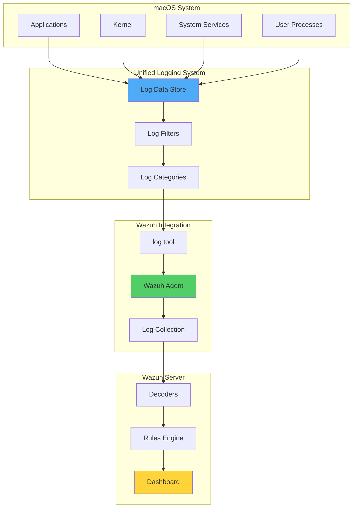

# Enhancing macOS Protection with Wazuh

## Introduction

Since version 4.3.0, Wazuh has introduced enhanced capabilities for collecting and analyzing logs from macOS endpoints using the Unified Logging System (ULS). This integration provides comprehensive visibility into macOS security events, enabling organizations to detect threats, monitor user activities, and maintain compliance across their Apple device fleet.

The Unified Logging System, available in macOS 10.12 and later, centralizes all system and application logs, providing a rich source of security-relevant information. Wazuh leverages the CLI `log` tool to collect these logs in syslog format, applying sophisticated filtering to capture only the most relevant security events.

This integration enables:

- 🔍 **Comprehensive Event Collection**: Monitor sudo, SSH, authentication, and system events
- 🛡️ **Enhanced Security Visibility**: Track permission changes and user activities
- 📊 **Intelligent Filtering**: Collect only relevant security events to minimize noise
- 🚨 **Real-time Threat Detection**: Identify suspicious activities as they occur
- 📈 **Compliance Support**: Maintain audit trails for regulatory requirements

## Understanding macOS Unified Logging System

### Architecture Overview



### Log Collection Process

The `log` tool provides powerful filtering capabilities:

```bash
# View all system logs (generates massive output)
log stream

# Filter for specific processes
log stream --process="sudo"

# Apply complex filters
log stream --predicate='process == "sshd" AND eventMessage CONTAINS "authentication"'
```

## Default Wazuh Configuration

### Agent Configuration

Starting from version 4.4.2, Wazuh agents include this default configuration in `/Library/Ossec/etc/ossec.conf`:

```xml
<localfile>
  <location>macos</location>
  <log_format>macos</log_format>
  <query type="trace,log,activity" level="info">
    (process == "sudo") or 
    (process == "sessionlogoutd" and message contains "logout is complete.") or 
    (process == "sshd") or 
    (process == "tccd" and message contains "Update Access Record") or 
    (message contains "SessionAgentNotificationCenter") or 
    (process == "screensharingd" and message contains "Authentication") or 
    (process == "securityd" and eventMessage contains "Session" and subsystem == "com.apple.securityd")
  </query>
</localfile>
```

This configuration monitors:
- **Sudo events**: Privilege escalation activities
- **SSH events**: Remote access attempts
- **Session events**: User login/logout activities
- **TCC events**: Privacy permission changes
- **Screen sharing**: Remote desktop access
- **Security sessions**: Authentication and authorization

### Important Notes

- New installations automatically include this configuration
- Upgrades from older versions require manual configuration
- The configuration uses efficient filtering to minimize performance impact

## Implementation Guide

### Prerequisites

- **Wazuh Server**: Version 4.4.4 with all components
- **macOS Endpoint**: macOS 10.12+ with Wazuh agent 4.4.2+
- **Permissions**: Administrative access for configuration

### Phase 1: Verify Agent Configuration

Check if the ULS configuration exists:

```bash
grep -A 10 "macos" /Library/Ossec/etc/ossec.conf
```

If missing, add the configuration manually and restart the agent:

```bash
sudo /Library/Ossec/bin/wazuh-control restart
```

### Phase 2: Understanding Decoders

Wazuh includes specialized decoders in `/var/ossec/ruleset/decoders/0580-macos_decoders.xml`:

```xml
<!-- macOS ULS decoder base -->
<decoder name="macos">
  <program_name>^log$</program_name>
</decoder>

<!-- Session logout decoder -->
<decoder name="macos-sessionlogoutd">
  <parent>macos</parent>
  <prematch>sessionlogoutd</prematch>
  <regex>(\S+): (\S+): logout is complete</regex>
  <order>process_id, user</order>
</decoder>

<!-- TCC permission changes -->
<decoder name="macos-tccd">
  <parent>macos</parent>
  <prematch>tccd</prematch>
  <regex>Update Access Record: (\S+) for (\S+)</regex>
  <order>permission, application</order>
</decoder>

<!-- Screen sharing authentication -->
<decoder name="macos-screensharing">
  <parent>macos</parent>
  <prematch>screensharingd</prematch>
  <regex>Authentication: (\w+) for user (\S+)</regex>
  <order>auth_result, user</order>
</decoder>
```

### Phase 3: Understanding Rules

Key rules from `/var/ossec/ruleset/rules/0960-macos_rules.xml`:

```xml
<group name="macos,">
  <!-- Session logout -->
  <rule id="89600" level="3">
    <decoded_as>macos-sessionlogoutd</decoded_as>
    <description>macOS: User $(user) logged out</description>
  </rule>

  <!-- TCC permission granted -->
  <rule id="89601" level="5">
    <decoded_as>macos-tccd</decoded_as>
    <match>granted</match>
    <description>macOS: Permission $(permission) granted to $(application)</description>
  </rule>

  <!-- TCC permission denied -->
  <rule id="89602" level="7">
    <decoded_as>macos-tccd</decoded_as>
    <match>denied</match>
    <description>macOS: Permission $(permission) denied to $(application)</description>
  </rule>

  <!-- Screen sharing successful -->
  <rule id="89606" level="5">
    <decoded_as>macos-screensharing</decoded_as>
    <match>SUCCEEDED</match>
    <description>macOS: Screen sharing authentication succeeded for $(user)</description>
  </rule>

  <!-- Screen sharing failed -->
  <rule id="89607" level="8">
    <decoded_as>macos-screensharing</decoded_as>
    <match>FAILED</match>
    <description>macOS: Screen sharing authentication failed for $(user)</description>
  </rule>
</group>
```

## Use Cases

### Use Case 1: Monitoring Sudo Events

#### Simulate sudo activity:

```bash
# Switch to root user
sudo -i

# Execute command with sudo
sudo systemctl status
```

#### Expected Alerts:

- Rule 5401-5406: Various sudo authentication and command execution events
- Provides complete audit trail of privilege escalation

#### Dashboard View:

```sql
-- Query for sudo activity analysis
rule.id: [5401 TO 5406] AND agent.os.platform: "darwin"
```

### Use Case 2: Tracking Permission Changes with TCC

#### Understanding TCC (Transparency, Consent, and Control):

TCC manages app permissions for:
- Full Disk Access
- Camera and Microphone
- Contacts and Calendar
- Location Services
- Accessibility features

#### Simulate Permission Changes:

1. Open **System Preferences → Security & Privacy**
2. Click the lock icon and authenticate
3. Navigate to **Privacy → Full Disk Access**
4. Toggle Terminal on/off

#### Expected Alerts:

- Rule 89600: Permission granted
- Rule 89601: Permission denied

#### Custom Rules for Specific Permissions:

```xml
<!-- Alert on camera access -->
<rule id="100200" level="10">
  <if_sid>89600</if_sid>
  <field name="permission">camera</field>
  <description>Camera access granted to $(application)</description>
  <options>alert_by_email</options>
</rule>

<!-- Alert on full disk access -->
<rule id="100201" level="12">
  <if_sid>89600</if_sid>
  <field name="permission">kTCCServiceSystemPolicyAllFiles</field>
  <description>Full disk access granted to $(application)</description>
  <options>alert_by_email</options>
</rule>
```

### Use Case 3: Monitoring Screen Sharing Activities

#### Setup Screen Sharing:

**On target Mac (with Wazuh agent):**
1. **System Settings → General → Sharing**
2. Enable **Screen Sharing**
3. Note the VNC address (vnc://[IPAddress])

**From another Mac:**
1. **Finder → Go → Connect to Server**
2. Enter the VNC address
3. Attempt authentication (both success and failure)

#### Expected Alerts:

- Rule 89606: Successful screen sharing authentication
- Rule 89607: Failed screen sharing authentication

#### Enhanced Monitoring:

```xml
<!-- Multiple failed attempts -->
<rule id="100202" level="12" frequency="3" timeframe="300">
  <if_sid>89607</if_sid>
  <description>Multiple screen sharing authentication failures</description>
</rule>

<!-- After hours screen sharing -->
<rule id="100203" level="10">
  <if_sid>89606</if_sid>
  <time>6:00 pm - 8:00 am</time>
  <description>Screen sharing access outside business hours</description>
</rule>
```

## Advanced Configuration

### Extended Log Collection

Add additional processes to monitor:

```xml
<localfile>
  <location>macos</location>
  <log_format>macos</log_format>
  <query type="trace,log,activity" level="info">
    (process == "sudo") or 
    (process == "sshd") or 
    (process == "tccd") or 
    (process == "screensharingd") or 
    (process == "loginwindow") or 
    (process == "authd") or 
    (process == "SecurityAgent") or 
    (process == "kernel" and eventMessage contains "sandbox")
  </query>
</localfile>
```

### Custom Decoders

Create `/var/ossec/etc/decoders/local_decoder.xml`:

```xml
<!-- FileVault events -->
<decoder name="macos-filevault">
  <parent>macos</parent>
  <prematch>fdesetup</prematch>
  <regex>FileVault (\w+) for user (\S+)</regex>
  <order>action, user</order>
</decoder>

<!-- Gatekeeper events -->
<decoder name="macos-gatekeeper">
  <parent>macos</parent>
  <prematch>syspolicyd</prematch>
  <regex>Gatekeeper (\w+) execution of (\S+)</regex>
  <order>action, application</order>
</decoder>

<!-- Keychain access -->
<decoder name="macos-keychain">
  <parent>macos</parent>
  <prematch>securityd</prematch>
  <regex>Keychain (\w+) for (\S+) by (\S+)</regex>
  <order>action, item, application</order>
</decoder>
```

### Custom Rules

Add to `/var/ossec/etc/rules/local_rules.xml`:

```xml
<group name="macos_security,">
  <!-- FileVault monitoring -->
  <rule id="100210" level="8">
    <decoded_as>macos-filevault</decoded_as>
    <field name="action">disabled</field>
    <description>FileVault encryption disabled for user $(user)</description>
    <mitre>
      <id>T1486</id>
    </mitre>
  </rule>

  <!-- Gatekeeper bypass attempts -->
  <rule id="100211" level="10">
    <decoded_as>macos-gatekeeper</decoded_as>
    <field name="action">blocked</field>
    <description>Gatekeeper blocked execution of $(application)</description>
    <mitre>
      <id>T1553.001</id>
    </mitre>
  </rule>

  <!-- Suspicious keychain access -->
  <rule id="100212" level="9">
    <decoded_as>macos-keychain</decoded_as>
    <field name="action">exported</field>
    <description>Keychain item $(item) exported by $(application)</description>
    <mitre>
      <id>T1555.001</id>
    </mitre>
  </rule>

  <!-- System Integrity Protection (SIP) violations -->
  <rule id="100213" level="14">
    <if_sid>86001</if_sid>
    <match>System Integrity Protection</match>
    <description>SIP violation detected</description>
    <options>alert_by_email</options>
  </rule>
</group>
```

## Security Monitoring Scenarios

### 1. Insider Threat Detection

```xml
<!-- Unusual sudo usage pattern -->
<rule id="100220" level="10" frequency="10" timeframe="300">
  <if_sid>5402</if_sid>
  <description>Excessive sudo usage by $(srcuser)</description>
</rule>

<!-- Mass permission changes -->
<rule id="100221" level="12" frequency="5" timeframe="60">
  <if_sid>89600,89601</if_sid>
  <description>Multiple TCC permission changes detected</description>
</rule>

<!-- Suspicious application permissions -->
<rule id="100222" level="11">
  <if_sid>89600</if_sid>
  <regex>Terminal|iTerm|Script Editor</regex>
  <field name="permission">kTCCServiceSystemPolicyAllFiles</field>
  <description>Developer tool granted full disk access</description>
</rule>
```

### 2. Compliance Monitoring

```xml
<!-- Track administrative actions -->
<rule id="100230" level="5">
  <if_sid>5402</if_sid>
  <options>log_alert</options>
  <description>Administrative action: $(command) by $(srcuser)</description>
  <group>audit_trail</group>
</rule>

<!-- Monitor security setting changes -->
<rule id="100231" level="8">
  <if_sid>89600,89601</if_sid>
  <field name="permission">kTCCServiceAccessibility</field>
  <description>Accessibility permission modified - compliance review required</description>
  <group>compliance,pci_dss_2.2</group>
</rule>
```

### 3. Advanced Threat Detection

```xml
<!-- Potential malware behavior -->
<rule id="100240" level="12">
  <if_sid>89600</if_sid>
  <field name="application">/tmp/|/var/tmp/|Downloads</field>
  <description>Suspicious application requesting permissions: $(application)</description>
  <mitre>
    <id>T1222</id>
  </mitre>
</rule>

<!-- Lateral movement detection -->
<rule id="100241" level="11" frequency="3" timeframe="300">
  <if_sid>89606</if_sid>
  <same_field>agent.name</same_field>
  <description>Multiple screen sharing sessions from same host</description>
  <mitre>
    <id>T1021.006</id>
  </mitre>
</rule>
```

## Performance Optimization

### 1. Log Filtering Best Practices

```xml
<!-- Optimized query for high-volume environments -->
<localfile>
  <location>macos</location>
  <log_format>macos</log_format>
  <query type="log" level="default">
    (process == "sudo" AND eventType == "logEvent") or 
    (process == "tccd" AND eventMessage contains "Update Access Record") or 
    (process == "screensharingd" AND category == "authentication")
  </query>
</localfile>
```

### 2. Resource Management

```bash
# Monitor log stream impact
sudo fs_usage -w -f filesys | grep log

# Check agent resource usage
ps aux | grep wazuh

# Optimize log retention
log config --mode "private_data:off"
```

### 3. Event Rate Limiting

```xml
<!-- Prevent log flooding -->
<rule id="100250" level="2">
  <if_sid>86001</if_sid>
  <options>no_log</options>
  <match>com.apple.xpc.launchd</match>
  <description>Suppressed: High-frequency XPC event</description>
</rule>
```

## Integration Examples

### 1. SOAR Integration

```python
#!/usr/bin/env python3
import json
import requests

def process_macos_alert(alert):
    """Process macOS security alerts for SOAR platform"""
    
    # Check for critical TCC changes
    if alert['rule']['id'] in ['89600', '89601']:
        if 'kTCCServiceSystemPolicyAllFiles' in alert['full_log']:
            create_incident(alert, 'Critical Permission Change')
    
    # Check for authentication anomalies
    elif alert['rule']['id'] == '89607':
        if check_user_location(alert['data']['user']):
            block_user_account(alert['data']['user'])
            create_incident(alert, 'Suspicious Authentication')

def create_incident(alert, incident_type):
    """Create incident in SOAR platform"""
    incident = {
        'title': f'{incident_type} on {alert["agent"]["name"]}',
        'severity': 'high',
        'description': alert['rule']['description'],
        'raw_alert': json.dumps(alert)
    }
    
    requests.post('https://soar.company.com/api/incidents', json=incident)
```

### 2. Compliance Reporting

```bash
#!/bin/bash
# Generate macOS compliance report

echo "=== macOS Security Compliance Report ==="
echo "Generated: $(date)"
echo ""

# Administrative actions
echo "Administrative Actions (Last 24h):"
curl -s -k -u admin:admin "https://localhost:9200/wazuh-alerts-*/_search" \
  -H 'Content-Type: application/json' \
  -d '{
    "query": {
      "bool": {
        "must": [
          {"range": {"timestamp": {"gte": "now-24h"}}},
          {"terms": {"rule.id": ["5401", "5402", "5403"]}}
        ]
      }
    }
  }' | jq '.hits.hits[]._source | "\(.timestamp) - \(.full_log)"'

# Permission changes
echo -e "\nPermission Changes:"
# Similar query for rules 89600, 89601

# Failed authentications
echo -e "\nFailed Authentication Attempts:"
# Query for rules 5503, 5551, 89607
```

## Monitoring Dashboard

### Custom Visualizations

```json
{
  "visualization": {
    "title": "macOS Security Events Timeline",
    "visState": {
      "type": "line",
      "params": {
        "grid": {
          "categoryLines": false,
          "valueAxis": "ValueAxis-1"
        },
        "categoryAxes": [{
          "id": "CategoryAxis-1",
          "type": "category",
          "position": "bottom",
          "show": true,
          "style": {},
          "scale": {
            "type": "linear"
          },
          "labels": {
            "show": true,
            "truncate": 100
          },
          "title": {}
        }],
        "valueAxes": [{
          "id": "ValueAxis-1",
          "name": "LeftAxis-1",
          "type": "value",
          "position": "left",
          "show": true,
          "style": {},
          "scale": {
            "type": "linear",
            "mode": "normal"
          },
          "labels": {
            "show": true,
            "rotate": 0,
            "filter": false,
            "truncate": 100
          },
          "title": {
            "text": "Event Count"
          }
        }],
        "seriesParams": [{
          "show": true,
          "type": "line",
          "mode": "normal",
          "data": {
            "label": "Security Events",
            "id": "1"
          },
          "valueAxis": "ValueAxis-1",
          "drawLinesBetweenPoints": true,
          "lineWidth": 2,
          "interpolate": "linear",
          "showCircles": true
        }],
        "addTooltip": true,
        "addLegend": true,
        "legendPosition": "right",
        "times": [],
        "addTimeMarker": false,
        "thresholdLine": {
          "show": false,
          "value": 10,
          "width": 1,
          "style": "full",
          "color": "#E7664C"
        }
      }
    }
  }
}
```

### Security Metrics Dashboard

Key metrics to display:
- Authentication success/failure rates
- Permission change frequency
- Screen sharing activity patterns
- Sudo usage trends
- Top users by security events

## Troubleshooting

### Common Issues and Solutions

#### Issue 1: No ULS Logs Collected

```bash
# Verify log stream is working
log stream --process="sudo" --type log --level info

# Check Wazuh agent configuration
grep -A 10 "location>macos" /Library/Ossec/etc/ossec.conf

# Verify agent is processing logs
tail -f /Library/Ossec/logs/ossec.log
```

#### Issue 2: High CPU Usage from Log Collection

```bash
# Check log stream resource usage
top -pid $(pgrep log)

# Optimize query filters
# Use more specific process filters
# Reduce log level from "info" to "default"
```

#### Issue 3: Missing Specific Events

```bash
# Test query directly
log stream --predicate='process == "tccd"' --level info

# Verify decoder matching
/var/ossec/bin/wazuh-logtest -v
```

## Best Practices

### 1. Security Configuration

```yaml
Log Collection:
  - Use specific process filters
  - Avoid overly broad queries
  - Monitor collection performance
  
Alert Tuning:
  - Set appropriate severity levels
  - Implement frequency-based rules
  - Use time-based correlations
  
Privacy Compliance:
  - Respect user privacy settings
  - Implement data retention policies
  - Document monitoring scope
```

### 2. Deployment Strategy

```yaml
Rollout Phases:
  Phase 1:
    - Deploy to test group
    - Monitor performance impact
    - Tune configurations
  
  Phase 2:
    - Expand to pilot users
    - Refine alert rules
    - Document procedures
  
  Phase 3:
    - Full deployment
    - Implement automation
    - Continuous improvement
```

### 3. Maintenance Tasks

```bash
#!/bin/bash
# Weekly maintenance script

echo "=== Wazuh macOS Maintenance ==="

# Check agent status
/Library/Ossec/bin/wazuh-control status

# Verify log collection
ps aux | grep -E "log.*stream"

# Review disk usage
du -sh /Library/Ossec/logs/

# Test critical rules
echo "Testing sudo detection..."
sudo echo "Test" > /dev/null

# Generate report
echo "Maintenance completed: $(date)"
```

## Conclusion

Wazuh's enhanced macOS protection capabilities through ULS integration provide organizations with unprecedented visibility into their Apple device security posture. By leveraging the comprehensive log collection, sophisticated decoders, and targeted rules, security teams can:

- ✅ **Detect threats** in real-time across the macOS fleet
- 🔍 **Monitor user activities** for insider threat detection
- 📊 **Track permission changes** to maintain security baselines
- 🛡️ **Prevent unauthorized access** through screen sharing monitoring
- 📈 **Maintain compliance** with detailed audit trails

The flexibility of Wazuh's configuration allows organizations to tailor monitoring to their specific security requirements while minimizing performance impact.

## Key Takeaways

1. **Default Configuration**: Leverage the built-in ULS configuration for immediate value
2. **Gradual Enhancement**: Start with default rules and progressively add custom detections
3. **Performance Balance**: Use efficient log queries to minimize system impact
4. **Compliance Focus**: Implement audit trails for regulatory requirements
5. **Continuous Improvement**: Regularly review and update rules based on threat landscape

## Resources

- [Wazuh macOS Documentation](https://documentation.wazuh.com/current/user-manual/agent/agent-management/macos.html)
- [Apple Unified Logging Documentation](https://developer.apple.com/documentation/os/logging)
- [macOS Security Compliance Project](https://github.com/usnistgov/macos_security)
- [Wazuh Rules Documentation](https://documentation.wazuh.com/current/user-manual/ruleset/index.html)

---

*Secure your macOS environment with Wazuh's comprehensive monitoring capabilities! 🍎🛡️*