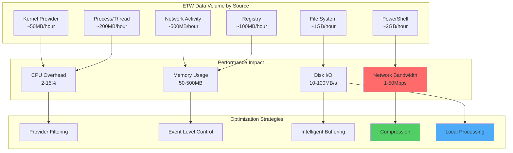
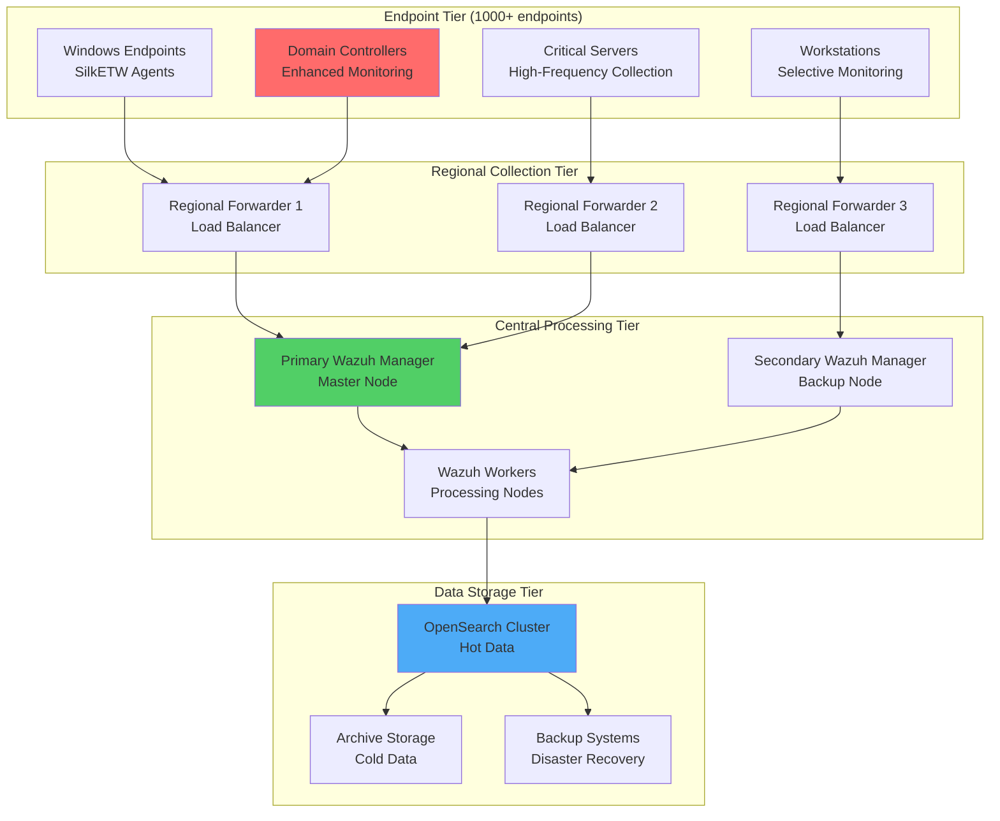

# ETW Performance Optimization and Enterprise Deployment with Wazuh

## Introduction

While ETW (Event Tracing for Windows) provides unparalleled visibility into Windows systems, enterprise deployments face significant challenges around performance, scalability, and resource management. High-volume ETW data can overwhelm systems and networks, making optimization crucial for successful production implementations.

This guide covers advanced ETW deployment strategies that enable organizations to:

- 🚀 **Optimize Performance**: Handle high-volume ETW data efficiently
- 📈 **Scale Enterprise-Wide**: Deploy across thousands of endpoints
- ⚡ **Minimize Resource Impact**: Reduce CPU, memory, and network overhead
- 🎯 **Target Critical Events**: Focus on security-relevant data streams
- 🔄 **Maintain Reliability**: Ensure consistent data collection and forwarding

## ETW Performance Challenges

### Understanding ETW Overhead

ETW data generation varies dramatically based on system activity and enabled providers:



### Resource Consumption Metrics

| Component | Low Volume | Medium Volume | High Volume |
|-----------|------------|---------------|-------------|
| **CPU Usage** | 2-5% | 8-15% | 20-40% |
| **Memory** | 50-100MB | 200-500MB | 1-2GB |
| **Disk I/O** | 5-15MB/s | 25-50MB/s | 100-200MB/s |
| **Network** | 1-5Mbps | 10-25Mbps | 50-100Mbps |

## Advanced SilkETW Configuration

### High-Performance Configuration Template

Create an optimized `SilkServiceConfig.xml` for production environments:

```xml
<?xml version="1.0" encoding="utf-8"?>
<SilkServiceConfig>
  <ETWCollector>
    <!-- Core Performance Settings -->
    <BufferSize>256</BufferSize>
    <MinBuffers>8</MinBuffers>
    <MaxBuffers>64</MaxBuffers>
    <FlushTimer>5</FlushTimer>
    <MaxFileSize>50</MaxFileSize>
    
    <!-- Advanced Buffer Management -->
    <LogFileMode>EVENT_TRACE_USE_PAGED_MEMORY</LogFileMode>
    <EnableKernelTrace>false</EnableKernelTrace>
    <ProcessPrivateLoggers>true</ProcessPrivateLoggers>
    
    <!-- Compression and Optimization -->
    <UseCompression>true</UseCompression>
    <CompressionLevel>6</CompressionLevel>
    <BatchSize>1000</BatchSize>
    <AsyncProcessing>true</AsyncProcessing>
  </ETWCollector>

  <!-- Security-Focused Provider Configuration -->
  <EventFilters>
    <!-- PowerShell Execution with Filtering -->
    <Filter>
      <ProviderGuid>{A0C1853B-5C40-4B15-8766-3CF1C58F985A}</ProviderGuid>
      <ProviderName>Microsoft-Windows-PowerShell</ProviderName>
      <Level>Informational</Level>
      <Keywords>0x0000F00000000000</Keywords>
      <FilterType>Include</FilterType>
      <Conditions>
        <Condition Field="EventID" Operator="In" Value="4103,4104,4105,4106"/>
        <Condition Field="ScriptBlockText" Operator="NotContains" Value="Get-Process,Get-Service"/>
        <Condition Field="Level" Operator="GreaterEqual" Value="3"/>
      </Conditions>
    </Filter>

    <!-- Process and Thread Creation -->
    <Filter>
      <ProviderGuid>{22FB2CD6-0E7B-422B-A0C7-2FAD1FD0E716}</ProviderGuid>
      <ProviderName>Microsoft-Windows-Kernel-Process</ProviderName>
      <Level>Informational</Level>
      <Keywords>0x0000000000000010</Keywords>
      <FilterType>Include</FilterType>
      <Conditions>
        <Condition Field="ProcessName" Operator="NotIn" Value="svchost.exe,explorer.exe,dwm.exe"/>
        <Condition Field="CommandLine" Operator="Contains" Value="powershell,cmd,wscript,cscript"/>
      </Conditions>
    </Filter>

    <!-- Network Connections (TCP/UDP) -->
    <Filter>
      <ProviderGuid>{7DD42A49-5329-4832-8DFD-43D979153A88}</ProviderGuid>
      <ProviderName>Microsoft-Windows-Kernel-Network</ProviderName>
      <Level>Informational</Level>
      <Keywords>0x0000000000040000</Keywords>
      <FilterType>Include</FilterType>
      <Conditions>
        <Condition Field="DestinationPort" Operator="NotIn" Value="80,443,53,123"/>
        <Condition Field="SourceIP" Operator="NotStartsWith" Value="127.0.0.1,::1"/>
        <Condition Field="ProcessName" Operator="NotIn" Value="chrome.exe,firefox.exe"/>
      </Conditions>
    </Filter>

    <!-- Registry Modifications -->
    <Filter>
      <ProviderGuid>{AE53722E-C863-11D2-8659-00C04FA321A1}</ProviderGuid>
      <ProviderName>Microsoft-Windows-Kernel-Registry</ProviderName>
      <Level>Informational</Level>
      <Keywords>0x0000000000000020</Keywords>
      <FilterType>Include</FilterType>
      <Conditions>
        <Condition Field="KeyName" Operator="Contains" Value="SOFTWARE\Microsoft\Windows\CurrentVersion\Run"/>
        <Condition Field="KeyName" Operator="Contains" Value="SYSTEM\CurrentControlSet\Services"/>
        <Condition Field="KeyName" Operator="Contains" Value="SOFTWARE\Classes\exefile"/>
      </Conditions>
    </Filter>

    <!-- File System Activity -->
    <Filter>
      <ProviderGuid>{EDD08927-9CC4-4E65-B970-C2560FB5C289}</ProviderGuid>
      <ProviderName>Microsoft-Windows-Kernel-File</ProviderName>
      <Level>Informational</Level>
      <Keywords>0x0000000000000100</Keywords>
      <FilterType>Include</FilterType>
      <Conditions>
        <Condition Field="FileName" Operator="EndsWith" Value=".exe,.dll,.ps1,.bat,.vbs,.scr"/>
        <Condition Field="FileName" Operator="NotContains" Value="Windows\System32,Windows\SysWOW64"/>
        <Condition Field="ProcessName" Operator="NotIn" Value="Windows Defender,MsMpEng.exe"/>
      </Conditions>
    </Filter>
  </EventFilters>

  <!-- Output Configuration -->
  <Outputs>
    <Output>
      <Type>UDP</Type>
      <Target>127.0.0.1</Target>
      <Port>514</Port>
      <Format>JSON</Format>
      <Compression>gzip</Compression>
      <BufferEvents>100</BufferEvents>
      <FlushInterval>10</FlushInterval>
      <MaxRetries>3</MaxRetries>
      <RetryDelay>5000</RetryDelay>
    </Output>
    
    <!-- Backup File Output -->
    <Output>
      <Type>File</Type>
      <Path>C:\ProgramData\SilkETW\Logs</Path>
      <FileRotation>Hourly</FileRotation>
      <MaxFileSize>100MB</MaxFileSize>
      <MaxFiles>24</MaxFiles>
      <Compression>true</Compression>
      <Format>JSONL</Format>
    </Output>
  </Outputs>

  <!-- Performance Monitoring -->
  <Monitoring>
    <EnablePerformanceCounters>true</EnablePerformanceCounters>
    <LogLevel>Warning</LogLevel>
    <StatsInterval>300</StatsInterval>
    <MaxCPUUsage>25</MaxCPUUsage>
    <MaxMemoryUsage>1024</MaxMemoryUsage>
    <AlertThresholds>
      <DroppedEvents>1000</DroppedEvents>
      <BufferOverflows>10</BufferOverflows>
      <NetworkErrors>50</NetworkErrors>
    </AlertThresholds>
  </Monitoring>
</SilkServiceConfig>
```

### Advanced PowerShell Configuration Script

```powershell
# Advanced SilkETW Performance Configuration
param(
    [string]$ConfigPath = "C:\ProgramData\SilkETW\SilkServiceConfig.xml",
    [string]$LogPath = "C:\ProgramData\SilkETW\Logs",
    [string]$WazuhServer = "10.0.0.100",
    [int]$SyslogPort = 514,
    [switch]$HighPerformance,
    [switch]$EnableDebugging
)

# Performance optimization function
function Optimize-ETWPerformance {
    param(
        [string]$ConfigPath,
        [bool]$HighPerformanceMode = $false
    )
    
    Write-Host "[INFO] Optimizing ETW performance settings..." -ForegroundColor Green
    
    # Set high-performance power plan
    if ($HighPerformanceMode) {
        powercfg.exe /setactive SCHEME_MIN
        Write-Host "[INFO] Switched to high-performance power plan" -ForegroundColor Yellow
    }
    
    # Optimize network settings
    netsh int tcp set global autotuninglevel=normal
    netsh int tcp set global chimney=enabled
    netsh int tcp set global rss=enabled
    netsh int tcp set global netdma=enabled
    
    # Configure ETW session parameters
    $registryPath = "HKLM:\SYSTEM\CurrentControlSet\Control\WMI\Autologger\EventLog-System"
    if (Test-Path $registryPath) {
        Set-ItemProperty -Path $registryPath -Name "BufferSize" -Value 256
        Set-ItemProperty -Path $registryPath -Name "MinimumBuffers" -Value 8
        Set-ItemProperty -Path $registryPath -Name "MaximumBuffers" -Value 64
        Set-ItemProperty -Path $registryPath -Name "FlushTimer" -Value 5
        
        Write-Host "[INFO] Optimized ETW session parameters" -ForegroundColor Green
    }
    
    # Set process priority for SilkETW
    $processName = "SilkETW"
    $priority = "High"
    
    $startupScript = @"
Get-Process -Name '$processName' -ErrorAction SilentlyContinue | ForEach-Object {
    `$_.PriorityClass = '$priority'
    Write-Host "Set `$(`$_.ProcessName) priority to $priority"
}
"@
    
    $startupScript | Out-File -FilePath "C:\ProgramData\SilkETW\SetPriority.ps1" -Encoding UTF8
    
    # Create scheduled task for priority setting
    $action = New-ScheduledTaskAction -Execute "powershell.exe" -Argument "-ExecutionPolicy Bypass -File C:\ProgramData\SilkETW\SetPriority.ps1"
    $trigger = New-ScheduledTaskTrigger -AtStartup
    $settings = New-ScheduledTaskSettingsSet -AllowStartIfOnBatteries -DontStopIfGoingOnBatteries
    
    Register-ScheduledTask -TaskName "SilkETW-Priority" -Action $action -Trigger $trigger -Settings $settings -User "SYSTEM" -Force
    
    Write-Host "[INFO] Created SilkETW priority optimization task" -ForegroundColor Green
}

# Advanced filtering configuration
function Set-AdvancedFiltering {
    param(
        [string]$ConfigPath
    )
    
    $filteringScript = @"
# Advanced ETW Event Filtering
class ETWEventFilter {
    [hashtable] `$SuspiciousProcesses = @{
        'powershell.exe' = @('Invoke-Expression', 'DownloadString', 'System.Reflection.Assembly')
        'cmd.exe' = @('net user', 'net group', 'reg add', 'schtasks')
        'wscript.exe' = @('WScript.Shell', 'ADODB.Stream', 'Scripting.FileSystemObject')
        'cscript.exe' = @('WScript.Shell', 'ADODB.Stream', 'ActiveXObject')
    }
    
    [hashtable] `$SuspiciousNetworkActivity = @{
        'DestinationPorts' = @(1433, 3389, 4444, 5985, 5986)
        'SourceProcesses' = @('powershell.exe', 'cmd.exe', 'rundll32.exe')
        'SuspiciousIPs' = @('10.0.0.0/8', '172.16.0.0/12', '192.168.0.0/16')
    }
    
    [hashtable] `$CriticalRegistryKeys = @{
        'Persistence' = @(
            'SOFTWARE\Microsoft\Windows\CurrentVersion\Run',
            'SOFTWARE\Microsoft\Windows\CurrentVersion\RunOnce',
            'SYSTEM\CurrentControlSet\Services'
        )
        'Security' = @(
            'SOFTWARE\Microsoft\Windows\CurrentVersion\Policies',
            'SYSTEM\CurrentControlSet\Control\SecurityProviders'
        )
    }
    
    [bool] FilterEvent([object]`$Event) {
        # Process-based filtering
        if (`$Event.ProcessName -and `$this.SuspiciousProcesses.ContainsKey(`$Event.ProcessName)) {
            foreach (`$pattern in `$this.SuspiciousProcesses[`$Event.ProcessName]) {
                if (`$Event.CommandLine -match `$pattern) {
                    return `$true
                }
            }
        }
        
        # Network activity filtering
        if (`$Event.EventID -in @(5156, 5157, 5158) -and `$Event.DestinationPort) {
            if (`$Event.DestinationPort -in `$this.SuspiciousNetworkActivity.DestinationPorts) {
                return `$true
            }
        }
        
        # Registry activity filtering
        if (`$Event.EventID -in @(12, 13, 14) -and `$Event.TargetObject) {
            foreach (`$keyGroup in `$this.CriticalRegistryKeys.Values) {
                foreach (`$key in `$keyGroup) {
                    if (`$Event.TargetObject -match `$key) {
                        return `$true
                    }
                }
            }
        }
        
        return `$false
    }
}

# Initialize filter
`$Global:ETWFilter = [ETWEventFilter]::new()
"@
    
    $filteringScript | Out-File -FilePath "C:\ProgramData\SilkETW\AdvancedFiltering.ps1" -Encoding UTF8
    Write-Host "[INFO] Created advanced filtering configuration" -ForegroundColor Green
}

# Monitoring and alerting setup
function Set-PerformanceMonitoring {
    $monitoringScript = @"
# ETW Performance Monitoring Script
param([int]`$IntervalSeconds = 300)

function Get-ETWPerformanceMetrics {
    `$metrics = @{
        Timestamp = Get-Date
        CPUUsage = 0
        MemoryUsage = 0
        NetworkThroughput = 0
        DroppedEvents = 0
        BufferOverflows = 0
    }
    
    # Get SilkETW process metrics
    `$silkProcess = Get-Process -Name 'SilkETW' -ErrorAction SilentlyContinue
    if (`$silkProcess) {
        `$metrics.CPUUsage = `$silkProcess.CPU
        `$metrics.MemoryUsage = `$silkProcess.WorkingSet64 / 1MB
    }
    
    # Get ETW session statistics
    try {
        `$etwSessions = logman query -ets
        foreach (`$session in `$etwSessions) {
            if (`$session -match 'SilkETW') {
                # Parse session statistics
                `$sessionStats = logman query "`$session" -ets
                # Extract metrics from session stats
            }
        }
    }
    catch {
        Write-Warning "Failed to query ETW sessions: `$(`$_.Exception.Message)"
    }
    
    return `$metrics
}

function Send-PerformanceAlert {
    param([hashtable]`$Metrics, [hashtable]`$Thresholds)
    
    `$alerts = @()
    
    if (`$Metrics.CPUUsage -gt `$Thresholds.MaxCPU) {
        `$alerts += "High CPU usage: `$(`$Metrics.CPUUsage)%"
    }
    
    if (`$Metrics.MemoryUsage -gt `$Thresholds.MaxMemory) {
        `$alerts += "High memory usage: `$(`$Metrics.MemoryUsage) MB"
    }
    
    if (`$Metrics.DroppedEvents -gt `$Thresholds.MaxDroppedEvents) {
        `$alerts += "High dropped events: `$(`$Metrics.DroppedEvents)"
    }
    
    if (`$alerts.Count -gt 0) {
        `$alertMessage = "ETW Performance Alert:`n" + (`$alerts -join "`n")
        Write-Warning `$alertMessage
        
        # Send to Windows Event Log
        New-EventLog -LogName "Application" -Source "SilkETW-Monitor" -ErrorAction SilentlyContinue
        Write-EventLog -LogName "Application" -Source "SilkETW-Monitor" -EntryType Warning -EventId 1001 -Message `$alertMessage
    }
}

# Main monitoring loop
`$thresholds = @{
    MaxCPU = 25
    MaxMemory = 1024
    MaxDroppedEvents = 1000
}

while (`$true) {
    try {
        `$metrics = Get-ETWPerformanceMetrics
        Send-PerformanceAlert -Metrics `$metrics -Thresholds `$thresholds
        
        # Log metrics
        `$metricsJson = `$metrics | ConvertTo-Json -Compress
        Add-Content -Path "C:\ProgramData\SilkETW\Logs\performance.log" -Value "`$(Get-Date -Format 'yyyy-MM-dd HH:mm:ss') `$metricsJson"
        
        Start-Sleep -Seconds `$IntervalSeconds
    }
    catch {
        Write-Error "Monitoring error: `$(`$_.Exception.Message)"
        Start-Sleep -Seconds 60
    }
}
"@
    
    $monitoringScript | Out-File -FilePath "C:\ProgramData\SilkETW\PerformanceMonitor.ps1" -Encoding UTF8
    
    # Create scheduled task for monitoring
    $action = New-ScheduledTaskAction -Execute "powershell.exe" -Argument "-ExecutionPolicy Bypass -File C:\ProgramData\SilkETW\PerformanceMonitor.ps1"
    $trigger = New-ScheduledTaskTrigger -AtStartup
    $settings = New-ScheduledTaskSettingsSet -AllowStartIfOnBatteries -DontStopIfGoingOnBatteries -RestartCount 3 -RestartInterval (New-TimeSpan -Minutes 5)
    
    Register-ScheduledTask -TaskName "SilkETW-Monitor" -Action $action -Trigger $trigger -Settings $settings -User "SYSTEM" -Force
    
    Write-Host "[INFO] Created performance monitoring task" -ForegroundColor Green
}

# Main execution
try {
    Write-Host "Starting advanced ETW configuration..." -ForegroundColor Cyan
    
    # Create directories
    New-Item -ItemType Directory -Path (Split-Path $LogPath -Parent) -Force | Out-Null
    New-Item -ItemType Directory -Path $LogPath -Force | Out-Null
    
    # Apply performance optimizations
    Optimize-ETWPerformance -ConfigPath $ConfigPath -HighPerformanceMode:$HighPerformance
    
    # Set up advanced filtering
    Set-AdvancedFiltering -ConfigPath $ConfigPath
    
    # Configure monitoring
    Set-PerformanceMonitoring
    
    Write-Host "[SUCCESS] Advanced ETW configuration completed!" -ForegroundColor Green
    Write-Host "Configuration saved to: $ConfigPath" -ForegroundColor Yellow
    Write-Host "Logs will be written to: $LogPath" -ForegroundColor Yellow
    
    if ($EnableDebugging) {
        Write-Host "[DEBUG] Debug mode enabled - additional logging active" -ForegroundColor Magenta
    }
}
catch {
    Write-Error "Configuration failed: $($_.Exception.Message)"
    exit 1
}
```

## Enterprise Deployment Architecture

### Centralized Collection Architecture



### Regional Forwarder Configuration

Deploy Rsyslog-based regional forwarders to handle ETW data aggregation:

```bash
# Regional Forwarder Setup Script
#!/bin/bash

# Install and configure Rsyslog for ETW data forwarding
setup_regional_forwarder() {
    local region=$1
    local wazuh_manager=$2
    local max_connections=${3:-1000}
    
    echo "[INFO] Setting up regional forwarder for region: $region"
    
    # Install Rsyslog
    apt-get update && apt-get install -y rsyslog rsyslog-relp
    
    # Configure high-performance Rsyslog
    cat > /etc/rsyslog.d/90-etw-forwarder.conf << 'EOF'
# High-Performance ETW Forwarder Configuration

# Load modules
module(load="imudp" threads="4")
module(load="omfwd")
module(load="omrelp")
module(load="mmjsonparse")
module(load="mmnormalize" allow="yes")

# Global configuration
global(
    maxMessageSize="64k"
    workDirectory="/var/spool/rsyslog"
    
    # Performance tuning
    parser.permitSlashInProgramName="on"
    parser.escapeControlCharactersCStyle="off"
    
    # Queue configuration
    main_queue.size="1000000"
    main_queue.dequeueBatchSize="1000"
    main_queue.workerThreads="4"
    main_queue.workerThreadMinimumMessages="1000"
    
    # Memory and disk queues
    main_queue.type="LinkedList"
    main_queue.highWatermark="900000"
    main_queue.lowWatermark="50000"
    main_queue.maxDiskSpace="2g"
    main_queue.saveOnShutdown="on"
)

# Input configuration for ETW data
input(type="imudp" port="514" ruleset="etw_processing" rcvbuf="1048576")
input(type="imudp" port="1514" ruleset="etw_processing" rcvbuf="2097152")

# ETW processing ruleset
ruleset(name="etw_processing" queue.size="500000" queue.workerThreads="2") {
    # Parse JSON messages
    action(type="mmjsonparse" cookie="")
    
    # Add regional metadata
    set $!region = "REGION_NAME";
    set $!forwarder_host = $$myhostname;
    set $!processed_time = $$now;
    
    # Filter high-noise events
    if ($parsesuccess == "OK" and $!event.EventID exists) then {
        # Skip common noisy events
        if ($!event.EventID == "4624" and $!event.LogonType == "3") then {
            stop
        }
        if ($!event.EventID == "4634" and $!event.LogonType == "3") then {
            stop
        }
        
        # Forward to Wazuh manager
        action(
            type="omfwd"
            target="WAZUH_MANAGER_IP"
            port="1514"
            protocol="udp"
            
            # Queue configuration
            queue.filename="etw_forward"
            queue.size="100000"
            queue.highWatermark="90000"
            queue.lowWatermark="10000"
            queue.maxDiskSpace="1g"
            queue.saveOnShutdown="on"
            queue.type="LinkedList"
            
            # Retry configuration
            action.resumeRetryCount="3"
            action.resumeInterval="5"
            
            # Format message
            template="ETWForwardFormat"
        )
    }
}

# Template for forwarded messages
template(name="ETWForwardFormat" type="string" string="%timestamp:::date-rfc3339% %$!region%_%hostname% etw: %msg%\n")

# Statistics and monitoring
module(load="impstats" interval="300" severity="info" log.syslog="off" log.file="/var/log/rsyslog-stats.log")

EOF

    # Replace placeholders
    sed -i "s/REGION_NAME/$region/g" /etc/rsyslog.d/90-etw-forwarder.conf
    sed -i "s/WAZUH_MANAGER_IP/$wazuh_manager/g" /etc/rsyslog.d/90-etw-forwarder.conf
    
    # Set up log rotation
    cat > /etc/logrotate.d/rsyslog-etw << EOF
/var/log/rsyslog-stats.log {
    daily
    rotate 7
    compress
    delaycompress
    missingok
    notifempty
    postrotate
        systemctl reload rsyslog
    endscript
}
EOF

    # Configure system limits
    cat >> /etc/security/limits.conf << EOF
rsyslog    soft    nofile    65536
rsyslog    hard    nofile    65536
rsyslog    soft    nproc     4096
rsyslog    hard    nproc     4096
EOF

    # Set kernel parameters
    cat >> /etc/sysctl.conf << EOF
# Network optimizations for high-volume syslog
net.core.rmem_default = 262144
net.core.rmem_max = 16777216
net.core.wmem_default = 262144
net.core.wmem_max = 16777216
net.core.netdev_max_backlog = 5000
net.ipv4.udp_mem = 102400 873800 16777216
net.ipv4.udp_rmem_min = 8192
net.ipv4.udp_wmem_min = 8192
EOF

    sysctl -p
    
    # Start services
    systemctl restart rsyslog
    systemctl enable rsyslog
    
    echo "[SUCCESS] Regional forwarder configured for region: $region"
}

# Performance monitoring function
setup_forwarder_monitoring() {
    cat > /usr/local/bin/monitor_etw_forwarder.sh << 'EOF'
#!/bin/bash

LOG_FILE="/var/log/etw-forwarder-monitor.log"
STATS_FILE="/var/log/rsyslog-stats.log"

log_message() {
    echo "[$(date '+%Y-%m-%d %H:%M:%S')] $1" >> "$LOG_FILE"
}

check_performance() {
    # Check message rates
    if [[ -f "$STATS_FILE" ]]; then
        MESSAGE_RATE=$(tail -n 20 "$STATS_FILE" | grep "messages" | tail -n 1 | awk '{print $NF}')
        if [[ $MESSAGE_RATE -gt 10000 ]]; then
            log_message "HIGH MESSAGE RATE: $MESSAGE_RATE messages/sec"
        fi
    fi
    
    # Check memory usage
    MEMORY_USAGE=$(ps aux | grep rsyslog | grep -v grep | awk '{sum += $6} END {print sum/1024}')
    if (( $(echo "$MEMORY_USAGE > 1024" | bc -l) )); then
        log_message "HIGH MEMORY USAGE: ${MEMORY_USAGE}MB"
    fi
    
    # Check disk space
    DISK_USAGE=$(df /var/spool/rsyslog | tail -n 1 | awk '{print $5}' | sed 's/%//')
    if [[ $DISK_USAGE -gt 80 ]]; then
        log_message "HIGH DISK USAGE: ${DISK_USAGE}%"
    fi
    
    # Check network connections
    CONN_COUNT=$(netstat -an | grep ":514\|:1514" | grep ESTABLISHED | wc -l)
    if [[ $CONN_COUNT -gt 500 ]]; then
        log_message "HIGH CONNECTION COUNT: $CONN_COUNT active connections"
    fi
}

# Run checks every 5 minutes
while true; do
    check_performance
    sleep 300
done
EOF

    chmod +x /usr/local/bin/monitor_etw_forwarder.sh
    
    # Create systemd service for monitoring
    cat > /etc/systemd/system/etw-forwarder-monitor.service << EOF
[Unit]
Description=ETW Forwarder Performance Monitor
After=rsyslog.service

[Service]
Type=simple
ExecStart=/usr/local/bin/monitor_etw_forwarder.sh
Restart=always
RestartSec=30
User=rsyslog

[Install]
WantedBy=multi-user.target
EOF

    systemctl daemon-reload
    systemctl enable etw-forwarder-monitor.service
    systemctl start etw-forwarder-monitor.service
}

# Main execution
if [[ $# -lt 2 ]]; then
    echo "Usage: $0 <region_name> <wazuh_manager_ip> [max_connections]"
    echo "Example: $0 us-east-1 10.0.0.100 2000"
    exit 1
fi

setup_regional_forwarder "$1" "$2" "$3"
setup_forwarder_monitoring

echo "[SUCCESS] Regional ETW forwarder deployment completed!"
```

## Wazuh Manager Optimization for ETW

### High-Volume ETW Processing Configuration

Optimize the Wazuh manager for high-volume ETW data processing:

```xml
<!-- Enhanced Wazuh Configuration for ETW -->
<ossec_config>
  <!-- Global Configuration -->
  <global>
    <logall>no</logall>
    <logall_json>no</logall_json>
    <email_notification>no</email_notification>
    <smtp_server>localhost</smtp_server>
    <email_from>wazuh@company.com</email_from>
    <email_to>admin@company.com</email_to>
    <alerts_log>yes</alerts_log>
    <jsonout_output>yes</jsonout_output>
    <prelude_output>no</prelude_output>
    
    <!-- Performance optimizations -->
    <stats>300</stats>
    <memory_size>256</memory_size>
    <white_list>127.0.0.1</white_list>
    <white_list>^localhost.localdomain$</white_list>
    
    <!-- Queue configuration -->
    <queue_size>100000</queue_size>
    <input_threads>4</input_threads>
    <processing_threads>8</processing_threads>
  </global>

  <!-- Alerts Configuration -->
  <alerts>
    <log_alert_level>3</log_alert_level>
    <email_alert_level>12</email_alert_level>
  </alerts>

  <!-- Remote syslog configuration -->
  <remote>
    <connection>syslog</connection>
    <port>1514</port>
    <protocol>udp</protocol>
    <allowed-ips>0.0.0.0/0</allowed-ips>
    <local_ip>0.0.0.0</local_ip>
    
    <!-- High-performance settings -->
    <queue_size>50000</queue_size>
    <recv_buffer>1048576</recv_buffer>
  </remote>

  <!-- ETW-specific remote configurations -->
  <remote>
    <connection>syslog</connection>
    <port>1515</port>
    <protocol>tcp</protocol>
    <allowed-ips>10.0.0.0/8</allowed-ips>
    <allowed-ips>172.16.0.0/12</allowed-ips>
    <allowed-ips>192.168.0.0/16</allowed-ips>
    
    <!-- SSL/TLS for encrypted ETW data -->
    <ssl_ciphers>HIGH:!aNULL:!eNULL:!EXPORT:!CAMELLIA:!DES:!MD5:!PSK:!RC4</ssl_ciphers>
    <ssl_verify_mode>none</ssl_verify_mode>
    <ssl_auto_negotiate>no</ssl_auto_negotiate>
  </remote>

  <!-- Analysis Configuration -->
  <analysisd>
    <memory_size>256</memory_size>
    <log_all>no</log_all>
    <log_all_json>no</log_all_json>
    
    <!-- Performance tuning -->
    <stats>300</stats>
    <batch_size>1000</batch_size>
    <queue_size>100000</queue_size>
    <decoder_order_size>8192</decoder_order_size>
    
    <!-- ETW-specific settings -->
    <enable_prefilter>yes</enable_prefilter>
    <prefilter_cmd>/var/ossec/bin/etw_prefilter.py</prefilter_cmd>
    
    <!-- Threading configuration -->
    <analysis_threads>4</analysis_threads>
    <rule_matching_threads>2</rule_matching_threads>
  </analysisd>

  <!-- Logging Configuration -->
  <logging>
    <log_format>json</log_format>
    <log_level>3</log_level>
    
    <!-- Separate ETW logs -->
    <log_file>/var/ossec/logs/etw.log</log_file>
    <log_file_size>100MB</log_file_size>
    <log_file_rotate>10</log_file_rotate>
  </logging>

  <!-- Archive Configuration -->
  <archive>
    <log_format>json</log_format>
    <compress>yes</compress>
    <rotate>daily</rotate>
    <keep>30</keep>
    <size>1000MB</size>
  </archive>

  <!-- Integration with external systems -->
  <integration>
    <name>splunk</name>
    <hook_url>https://splunk.company.com:8088/services/collector</hook_url>
    <api_key>YOUR_SPLUNK_HEC_TOKEN</api_key>
    <level>5</level>
    <group>etw</group>
    <options>{"index": "wazuh", "source": "etw", "sourcetype": "wazuh:etw"}</options>
    <max_log_size>50MB</max_log_size>
    <alert_format>json</alert_format>
    
    <!-- Retry configuration -->
    <max_retries>3</max_retries>
    <retry_interval>30</retry_interval>
  </integration>

  <!-- Database output -->
  <database_output>
    <hostname>postgresql.company.com</hostname>
    <port>5432</port>
    <username>wazuh</username>
    <password>SecurePassword123!</password>
    <database>wazuh_etw</database>
    <type>postgresql</type>
    
    <!-- Performance settings -->
    <reconnect>yes</reconnect>
    <max_reconnect_attempts>10</max_reconnect_attempts>
    <batch_size>1000</batch_size>
    <commit_interval>30</commit_interval>
  </database_output>
</ossec_config>
```

### Advanced ETW Rule Set

Create optimized rules for high-volume ETW processing:

```xml
<!-- High-Performance ETW Rules -->
<group name="etw,windows,">

  <!-- Base ETW grouping rules -->
  <rule id="300000" level="0">
    <decoded_as>json</decoded_as>
    <field name="Event.System.Provider.Name">^Microsoft-Windows-</field>
    <description>ETW events grouping rule</description>
    <group>etw,</group>
  </rule>

  <!-- PowerShell ETW events -->
  <rule id="300001" level="3">
    <if_sid>300000</if_sid>
    <field name="Event.System.Provider.Name">Microsoft-Windows-PowerShell</field>
    <description>PowerShell ETW: $(Event.System.EventID) - Script execution</description>
    <group>etw,powershell,</group>
  </rule>

  <!-- High-risk PowerShell activities -->
  <rule id="300002" level="8">
    <if_sid>300001</if_sid>
    <field name="Event.EventData.ScriptBlockText" type="pcre2">(?i)(invoke-expression|downloadstring|system\.reflection\.assembly|bypass|hidden|encodedcommand)</field>
    <description>PowerShell ETW: Suspicious script execution - $(Event.EventData.ScriptBlockText)</description>
    <group>etw,powershell,suspicious,</group>
    <options>no_full_log</options>
  </rule>

  <!-- Process creation events -->
  <rule id="300010" level="3">
    <if_sid>300000</if_sid>
    <field name="Event.System.Provider.Name">Microsoft-Windows-Kernel-Process</field>
    <field name="Event.System.EventID">1|5</field>
    <description>Process ETW: $(Event.System.EventID) - Process $(Event.EventData.ProcessName)</description>
    <group>etw,process,</group>
  </rule>

  <!-- Suspicious process execution -->
  <rule id="300011" level="7">
    <if_sid>300010</if_sid>
    <field name="Event.EventData.ProcessName" type="pcre2">(?i)(powershell\.exe|cmd\.exe|wscript\.exe|cscript\.exe|rundll32\.exe|regsvr32\.exe)</field>
    <field name="Event.EventData.CommandLine" type="pcre2">(?i)(-enc|-w\s+hidden|-exec\s+bypass|downloadstring|invoke-)</field>
    <description>Process ETW: Suspicious process execution - $(Event.EventData.ProcessName) $(Event.EventData.CommandLine)</description>
    <group>etw,process,suspicious,</group>
  </rule>

  <!-- Network connection events -->
  <rule id="300020" level="3">
    <if_sid>300000</if_sid>
    <field name="Event.System.Provider.Name">Microsoft-Windows-Kernel-Network</field>
    <field name="Event.System.EventID">5154|5156|5158</field>
    <description>Network ETW: $(Event.System.EventID) - Connection from $(Event.EventData.SourceAddress):$(Event.EventData.SourcePort)</description>
    <group>etw,network,</group>
  </rule>

  <!-- Suspicious network activity -->
  <rule id="300021" level="6">
    <if_sid>300020</if_sid>
    <field name="Event.EventData.DestinationPort">1433|3389|4444|5985|5986|8080|8443</field>
    <description>Network ETW: Suspicious destination port $(Event.EventData.DestinationPort) - $(Event.EventData.ProcessName)</description>
    <group>etw,network,suspicious,</group>
  </rule>

  <!-- Registry modification events -->
  <rule id="300030" level="3">
    <if_sid>300000</if_sid>
    <field name="Event.System.Provider.Name">Microsoft-Windows-Kernel-Registry</field>
    <field name="Event.System.EventID">12|13|14</field>
    <description>Registry ETW: $(Event.System.EventID) - Registry modification</description>
    <group>etw,registry,</group>
  </rule>

  <!-- Critical registry modifications -->
  <rule id="300031" level="8">
    <if_sid>300030</if_sid>
    <field name="Event.EventData.TargetObject" type="pcre2">(?i)(\\\\software\\\\microsoft\\\\windows\\\\currentversion\\\\run|\\\\system\\\\currentcontrolset\\\\services|\\\\software\\\\classes\\\\exefile)</field>
    <description>Registry ETW: Critical registry modification - $(Event.EventData.TargetObject)</description>
    <group>etw,registry,persistence,</group>
  </rule>

  <!-- File system activity -->
  <rule id="300040" level="2">
    <if_sid>300000</if_sid>
    <field name="Event.System.Provider.Name">Microsoft-Windows-Kernel-File</field>
    <field name="Event.System.EventID">11</field>
    <description>File ETW: File creation - $(Event.EventData.TargetFilename)</description>
    <group>etw,file,</group>
  </rule>

  <!-- Suspicious file activity -->
  <rule id="300041" level="6">
    <if_sid>300040</if_sid>
    <field name="Event.EventData.TargetFilename" type="pcre2">(?i)\\\\(temp|tmp|appdata)\\\\.*\\.(exe|scr|bat|ps1|vbs)$</field>
    <description>File ETW: Suspicious file creation in temp directory - $(Event.EventData.TargetFilename)</description>
    <group>etw,file,suspicious,</group>
  </rule>

  <!-- Authentication events -->
  <rule id="300050" level="3">
    <if_sid>300000</if_sid>
    <field name="Event.System.Provider.Name">Microsoft-Windows-Security-Auditing</field>
    <field name="Event.System.EventID">4624|4625</field>
    <description>Auth ETW: $(Event.System.EventID) - User $(Event.EventData.TargetUserName)</description>
    <group>etw,authentication,</group>
  </rule>

  <!-- Failed authentication attempts -->
  <rule id="300051" level="5" frequency="5" timeframe="300">
    <if_sid>300000</if_sid>
    <field name="Event.System.EventID">4625</field>
    <same_field>Event.EventData.IpAddress</same_field>
    <description>Auth ETW: Multiple failed logins from $(Event.EventData.IpAddress)</description>
    <group>etw,authentication,brute_force,</group>
  </rule>

  <!-- DNS query monitoring -->
  <rule id="300060" level="2">
    <if_sid>300000</if_sid>
    <field name="Event.System.Provider.Name">Microsoft-Windows-DNS-Client</field>
    <field name="Event.System.EventID">3008</field>
    <description>DNS ETW: Query for $(Event.EventData.QueryName)</description>
    <group>etw,dns,</group>
  </rule>

  <!-- Suspicious DNS queries -->
  <rule id="300061" level="6">
    <if_sid>300060</if_sid>
    <field name="Event.EventData.QueryName" type="pcre2">(?i)(dga|tunnel|\.tk$|\.ml$|\.ga$|\.cf$)</field>
    <description>DNS ETW: Suspicious domain query - $(Event.EventData.QueryName)</description>
    <group>etw,dns,suspicious,</group>
  </rule>

  <!-- Performance optimization rules -->
  <rule id="300100" level="0">
    <if_sid>300000</if_sid>
    <field name="Event.System.EventID">4634</field>
    <field name="Event.EventData.LogonType">3</field>
    <description>ETW: Suppressed noisy logoff event</description>
    <options>no_log</options>
  </rule>

  <rule id="300101" level="0">
    <if_sid>300000</if_sid>
    <field name="Event.System.EventID">4624</field>
    <field name="Event.EventData.LogonType">3</field>
    <field name="Event.EventData.TargetUserName">SYSTEM|ANONYMOUS</field>
    <description>ETW: Suppressed system logon events</description>
    <options>no_log</options>
  </rule>

  <!-- Correlation rules -->
  <rule id="300200" level="10">
    <if_matched_sid>300002</if_matched_sid>
    <if_matched_sid>300021</if_matched_sid>
    <same_field>Event.System.Computer</same_field>
    <timeframe>600</timeframe>
    <description>ETW Correlation: Suspicious PowerShell followed by network activity on $(Event.System.Computer)</description>
    <group>etw,correlation,attack,</group>
  </rule>

  <rule id="300201" level="12">
    <if_matched_sid>300031</if_matched_sid>
    <if_matched_sid>300041</if_matched_sid>
    <same_field>Event.System.Computer</same_field>
    <timeframe>300</timeframe>
    <description>ETW Correlation: Registry persistence followed by file creation on $(Event.System.Computer)</description>
    <group>etw,correlation,persistence,</group>
  </rule>

</group>
```

## Performance Tuning and Optimization

### System-Level Optimizations

```bash
#!/bin/bash
# ETW System Optimization Script

optimize_system_for_etw() {
    echo "[INFO] Applying system-level optimizations for ETW processing..."
    
    # Kernel parameters for high-volume log processing
    cat >> /etc/sysctl.d/99-etw-optimization.conf << EOF
# Network optimizations
net.core.rmem_default = 262144
net.core.rmem_max = 134217728
net.core.wmem_default = 262144
net.core.wmem_max = 134217728
net.core.netdev_max_backlog = 30000
net.core.netdev_budget = 600

# UDP optimizations
net.ipv4.udp_mem = 102400 873800 134217728
net.ipv4.udp_rmem_min = 8192
net.ipv4.udp_wmem_min = 8192

# TCP optimizations
net.ipv4.tcp_rmem = 8192 262144 134217728
net.ipv4.tcp_wmem = 8192 262144 134217728
net.ipv4.tcp_congestion_control = bbr

# File system optimizations
fs.file-max = 2097152
fs.inotify.max_user_watches = 524288
fs.inotify.max_user_instances = 8192

# Memory management
vm.swappiness = 1
vm.dirty_ratio = 15
vm.dirty_background_ratio = 5
vm.vfs_cache_pressure = 50
EOF

    sysctl -p /etc/sysctl.d/99-etw-optimization.conf
    
    # Increase system limits
    cat >> /etc/security/limits.d/99-etw.conf << EOF
# ETW processing limits
wazuh    soft    nofile    65536
wazuh    hard    nofile    65536
wazuh    soft    nproc     4096
wazuh    hard    nproc     4096
wazuh    soft    memlock   unlimited
wazuh    hard    memlock   unlimited
EOF

    # Optimize I/O scheduler for log processing
    echo 'ACTION=="add|change", KERNEL=="sd[a-z]", ATTR{queue/scheduler}="deadline"' > /etc/udev/rules.d/60-etw-io-scheduler.rules
    
    echo "[SUCCESS] System optimizations applied"
}

optimize_wazuh_performance() {
    echo "[INFO] Optimizing Wazuh manager for ETW processing..."
    
    # Create performance monitoring script
    cat > /var/ossec/bin/etw_performance_monitor.py << 'EOF'
#!/usr/bin/env python3
"""
ETW Performance Monitor for Wazuh
Monitors queue sizes, processing rates, and resource usage
"""

import os
import time
import json
import psutil
import logging
from datetime import datetime
from pathlib import Path

class ETWPerformanceMonitor:
    def __init__(self):
        self.log_file = "/var/ossec/logs/etw-performance.log"
        self.stats_file = "/var/ossec/logs/etw-stats.json"
        self.alert_threshold = {
            'queue_size': 50000,
            'cpu_usage': 80,
            'memory_usage': 4096,  # MB
            'processing_rate': 1000  # events/sec
        }
        
        logging.basicConfig(
            filename=self.log_file,
            level=logging.INFO,
            format='%(asctime)s - %(levelname)s - %(message)s'
        )
    
    def get_wazuh_processes(self):
        """Get Wazuh process information"""
        processes = []
        for proc in psutil.process_iter(['pid', 'name', 'cpu_percent', 'memory_info', 'cmdline']):
            try:
                if 'ossec' in proc.info['name'] or 'wazuh' in proc.info['name']:
                    processes.append(proc)
            except (psutil.NoSuchProcess, psutil.AccessDenied):
                continue
        return processes
    
    def get_queue_statistics(self):
        """Get queue statistics from Wazuh logs"""
        queue_stats = {}
        
        try:
            # Parse analysisd stats
            with open('/var/ossec/var/run/wazuh-analysisd.state', 'r') as f:
                for line in f:
                    if 'total_events_decoded' in line:
                        queue_stats['decoded_events'] = int(line.split('=')[1].strip())
                    elif 'syscheck_events_decoded' in line:
                        queue_stats['syscheck_events'] = int(line.split('=')[1].strip())
                    elif 'rules_matched' in line:
                        queue_stats['rules_matched'] = int(line.split('=')[1].strip())
        except FileNotFoundError:
            logging.warning("Wazuh state file not found")
        
        return queue_stats
    
    def calculate_processing_rate(self):
        """Calculate ETW event processing rate"""
        current_time = time.time()
        
        try:
            with open(self.stats_file, 'r') as f:
                prev_stats = json.load(f)
                
            prev_time = prev_stats.get('timestamp', current_time)
            time_diff = current_time - prev_time
            
            if time_diff > 0:
                current_events = self.get_queue_statistics().get('decoded_events', 0)
                prev_events = prev_stats.get('decoded_events', 0)
                processing_rate = (current_events - prev_events) / time_diff
                return max(0, processing_rate)
        except (FileNotFoundError, json.JSONDecodeError, KeyError):
            pass
        
        return 0
    
    def check_disk_space(self):
        """Check available disk space for logs"""
        disk_usage = {}
        
        for path in ['/var/ossec/logs', '/var/ossec/queue']:
            if os.path.exists(path):
                usage = psutil.disk_usage(path)
                disk_usage[path] = {
                    'total': usage.total,
                    'used': usage.used,
                    'free': usage.free,
                    'percent': (usage.used / usage.total) * 100
                }
        
        return disk_usage
    
    def generate_performance_report(self):
        """Generate comprehensive performance report"""
        report = {
            'timestamp': time.time(),
            'datetime': datetime.now().isoformat(),
            'system': {
                'cpu_percent': psutil.cpu_percent(interval=1),
                'memory': psutil.virtual_memory()._asdict(),
                'disk': self.check_disk_space()
            },
            'wazuh': {
                'processes': [],
                'queues': self.get_queue_statistics(),
                'processing_rate': self.calculate_processing_rate()
            }
        }
        
        # Get Wazuh process information
        for proc in self.get_wazuh_processes():
            try:
                proc_info = {
                    'name': proc.info['name'],
                    'pid': proc.info['pid'],
                    'cpu_percent': proc.info['cpu_percent'],
                    'memory_mb': proc.info['memory_info'].rss / 1024 / 1024,
                    'cmdline': ' '.join(proc.info['cmdline'][:3])  # First 3 args only
                }
                report['wazuh']['processes'].append(proc_info)
            except (psutil.NoSuchProcess, psutil.AccessDenied):
                continue
        
        return report
    
    def check_alerts(self, report):
        """Check for performance alerts"""
        alerts = []
        
        # Check CPU usage
        if report['system']['cpu_percent'] > self.alert_threshold['cpu_usage']:
            alerts.append(f"High CPU usage: {report['system']['cpu_percent']:.1f}%")
        
        # Check memory usage
        memory_mb = report['system']['memory']['used'] / 1024 / 1024
        if memory_mb > self.alert_threshold['memory_usage']:
            alerts.append(f"High memory usage: {memory_mb:.1f}MB")
        
        # Check processing rate
        if report['wazuh']['processing_rate'] > self.alert_threshold['processing_rate']:
            alerts.append(f"High processing rate: {report['wazuh']['processing_rate']:.1f} events/sec")
        
        # Check disk space
        for path, usage in report['system']['disk'].items():
            if usage['percent'] > 85:
                alerts.append(f"High disk usage in {path}: {usage['percent']:.1f}%")
        
        return alerts
    
    def run_monitor(self):
        """Main monitoring loop"""
        logging.info("Starting ETW performance monitor")
        
        while True:
            try:
                report = self.generate_performance_report()
                alerts = self.check_alerts(report)
                
                # Save current stats
                with open(self.stats_file, 'w') as f:
                    json.dump({
                        'timestamp': report['timestamp'],
                        'decoded_events': report['wazuh']['queues'].get('decoded_events', 0),
                        'processing_rate': report['wazuh']['processing_rate']
                    }, f)
                
                # Log performance data
                logging.info(f"Performance: CPU={report['system']['cpu_percent']:.1f}%, "
                           f"Memory={report['system']['memory']['percent']:.1f}%, "
                           f"Processing={report['wazuh']['processing_rate']:.1f} events/sec")
                
                # Handle alerts
                if alerts:
                    for alert in alerts:
                        logging.warning(f"ALERT: {alert}")
                
                time.sleep(300)  # Check every 5 minutes
                
            except KeyboardInterrupt:
                logging.info("Performance monitor stopped")
                break
            except Exception as e:
                logging.error(f"Monitor error: {str(e)}")
                time.sleep(60)

if __name__ == "__main__":
    monitor = ETWPerformanceMonitor()
    monitor.run_monitor()
EOF

    chmod +x /var/ossec/bin/etw_performance_monitor.py
    
    # Create systemd service for performance monitoring
    cat > /etc/systemd/system/wazuh-etw-monitor.service << EOF
[Unit]
Description=Wazuh ETW Performance Monitor
After=wazuh-manager.service

[Service]
Type=simple
ExecStart=/var/ossec/bin/etw_performance_monitor.py
Restart=always
RestartSec=30
User=wazuh
Group=wazuh

[Install]
WantedBy=multi-user.target
EOF

    systemctl daemon-reload
    systemctl enable wazuh-etw-monitor.service
    systemctl start wazuh-etw-monitor.service
    
    echo "[SUCCESS] Wazuh ETW performance monitoring configured"
}

# Load balancing configuration
setup_load_balancing() {
    echo "[INFO] Setting up ETW load balancing..."
    
    # HAProxy configuration for Wazuh managers
    cat > /etc/haproxy/haproxy.cfg << 'EOF'
global
    daemon
    user haproxy
    group haproxy
    
    # Performance tuning
    maxconn 100000
    nbproc 4
    nbthread 4
    
    # SSL configuration
    tune.ssl.default-dh-param 2048
    ssl-default-bind-ciphers HIGH:!aNULL:!eNULL:!EXPORT:!CAMELLIA:!DES:!MD5:!PSK:!RC4
    ssl-default-bind-options ssl-min-ver TLSv1.2

defaults
    mode tcp
    timeout connect 5000ms
    timeout client 50000ms
    timeout server 50000ms
    option tcplog
    
    # Load balancing algorithm
    balance roundrobin

# ETW data collection load balancer
frontend etw_syslog_frontend
    bind *:1514
    mode tcp
    option tcplog
    
    # ACLs for different types of ETW data
    tcp-request inspect-delay 5s
    tcp-request content accept if { req.len gt 0 }
    
    default_backend etw_wazuh_managers

backend etw_wazuh_managers
    mode tcp
    balance roundrobin
    option tcp-check
    tcp-check send "test\n"
    tcp-check expect string "ok"
    
    # Wazuh manager nodes
    server wazuh-master1 10.0.1.100:1514 check inter 5s fall 3 rise 2 weight 100
    server wazuh-master2 10.0.1.101:1514 check inter 5s fall 3 rise 2 weight 100 backup
    server wazuh-worker1 10.0.1.110:1514 check inter 5s fall 3 rise 2 weight 80
    server wazuh-worker2 10.0.1.111:1514 check inter 5s fall 3 rise 2 weight 80

# Statistics interface
frontend stats
    bind *:8404
    mode http
    stats enable
    stats uri /stats
    stats refresh 10s
    stats show-legends
    stats show-node
EOF

    systemctl restart haproxy
    systemctl enable haproxy
    
    echo "[SUCCESS] Load balancing configured"
}

# Main execution
main() {
    echo "Starting ETW enterprise deployment optimization..."
    
    optimize_system_for_etw
    optimize_wazuh_performance
    setup_load_balancing
    
    echo "[SUCCESS] ETW enterprise deployment optimization completed!"
    echo "Monitor performance at: http://$(hostname):8404/stats"
    echo "Performance logs: /var/ossec/logs/etw-performance.log"
}

main "$@"
```

## Monitoring and Maintenance

### Advanced Monitoring Dashboard

Create a comprehensive monitoring solution for ETW deployments:

```python
#!/usr/bin/env python3
"""
ETW Enterprise Monitoring Dashboard
Real-time monitoring of ETW data collection and processing
"""

import asyncio
import json
import time
import psutil
import logging
from datetime import datetime, timedelta
from pathlib import Path
import aiohttp
from aiohttp import web
import aiofiles

class ETWMonitoringDashboard:
    def __init__(self):
        self.data_dir = Path("/var/ossec/logs/etw-monitoring")
        self.data_dir.mkdir(exist_ok=True)
        
        self.metrics = {
            'endpoints': {},
            'forwarders': {},
            'managers': {},
            'performance': {},
            'alerts': []
        }
        
        logging.basicConfig(
            level=logging.INFO,
            format='%(asctime)s - %(levelname)s - %(message)s'
        )
    
    async def collect_endpoint_metrics(self):
        """Collect metrics from Windows endpoints running SilkETW"""
        endpoint_configs = await self.load_endpoint_config()
        
        for endpoint in endpoint_configs:
            try:
                # Collect via WinRM or SSH
                metrics = await self.query_endpoint_metrics(endpoint)
                self.metrics['endpoints'][endpoint['hostname']] = {
                    'timestamp': time.time(),
                    'cpu_usage': metrics.get('cpu_percent', 0),
                    'memory_usage': metrics.get('memory_mb', 0),
                    'events_per_second': metrics.get('events_rate', 0),
                    'dropped_events': metrics.get('dropped_events', 0),
                    'status': 'online' if metrics else 'offline'
                }
            except Exception as e:
                logging.error(f"Failed to collect metrics from {endpoint['hostname']}: {e}")
                self.metrics['endpoints'][endpoint['hostname']] = {
                    'timestamp': time.time(),
                    'status': 'offline',
                    'error': str(e)
                }
    
    async def collect_forwarder_metrics(self):
        """Collect metrics from regional forwarders"""
        forwarder_configs = await self.load_forwarder_config()
        
        for forwarder in forwarder_configs:
            try:
                async with aiohttp.ClientSession() as session:
                    async with session.get(f"http://{forwarder['hostname']}:8080/metrics") as resp:
                        if resp.status == 200:
                            metrics = await resp.json()
                            self.metrics['forwarders'][forwarder['hostname']] = {
                                'timestamp': time.time(),
                                'messages_per_second': metrics.get('message_rate', 0),
                                'queue_size': metrics.get('queue_size', 0),
                                'connection_count': metrics.get('connections', 0),
                                'cpu_usage': metrics.get('cpu_percent', 0),
                                'memory_usage': metrics.get('memory_mb', 0),
                                'status': 'online'
                            }
            except Exception as e:
                logging.error(f"Failed to collect forwarder metrics from {forwarder['hostname']}: {e}")
                self.metrics['forwarders'][forwarder['hostname']] = {
                    'timestamp': time.time(),
                    'status': 'offline',
                    'error': str(e)
                }
    
    async def collect_manager_metrics(self):
        """Collect metrics from Wazuh managers"""
        manager_configs = await self.load_manager_config()
        
        for manager in manager_configs:
            try:
                # Use Wazuh API
                auth_token = await self.get_wazuh_auth_token(manager)
                
                async with aiohttp.ClientSession() as session:
                    headers = {'Authorization': f'Bearer {auth_token}'}
                    
                    # Get cluster status
                    async with session.get(f"https://{manager['hostname']}:55000/cluster/status", headers=headers, ssl=False) as resp:
                        cluster_data = await resp.json() if resp.status == 200 else {}
                    
                    # Get agent status
                    async with session.get(f"https://{manager['hostname']}:55000/agents", headers=headers, ssl=False) as resp:
                        agents_data = await resp.json() if resp.status == 200 else {}
                    
                    # Get statistics
                    async with session.get(f"https://{manager['hostname']}:55000/manager/stats", headers=headers, ssl=False) as resp:
                        stats_data = await resp.json() if resp.status == 200 else {}
                    
                    self.metrics['managers'][manager['hostname']] = {
                        'timestamp': time.time(),
                        'cluster_status': cluster_data.get('data', {}).get('running', 'unknown'),
                        'active_agents': len(agents_data.get('data', {}).get('affected_items', [])),
                        'events_per_second': stats_data.get('data', {}).get('events_received', 0),
                        'rules_matched': stats_data.get('data', {}).get('rules_matched', 0),
                        'cpu_usage': psutil.cpu_percent(),
                        'memory_usage': psutil.virtual_memory().percent,
                        'status': 'online'
                    }
            except Exception as e:
                logging.error(f"Failed to collect manager metrics from {manager['hostname']}: {e}")
                self.metrics['managers'][manager['hostname']] = {
                    'timestamp': time.time(),
                    'status': 'offline',
                    'error': str(e)
                }
    
    async def generate_performance_report(self):
        """Generate comprehensive performance report"""
        current_time = time.time()
        
        # Calculate aggregate metrics
        total_endpoints = len(self.metrics['endpoints'])
        online_endpoints = sum(1 for ep in self.metrics['endpoints'].values() if ep.get('status') == 'online')
        
        total_events_per_second = 0
        total_cpu_usage = 0
        total_memory_usage = 0
        
        for endpoint_metrics in self.metrics['endpoints'].values():
            if endpoint_metrics.get('status') == 'online':
                total_events_per_second += endpoint_metrics.get('events_per_second', 0)
                total_cpu_usage += endpoint_metrics.get('cpu_usage', 0)
                total_memory_usage += endpoint_metrics.get('memory_usage', 0)
        
        # Calculate averages
        avg_cpu = total_cpu_usage / max(online_endpoints, 1)
        avg_memory = total_memory_usage / max(online_endpoints, 1)
        
        performance_report = {
            'timestamp': current_time,
            'datetime': datetime.fromtimestamp(current_time).isoformat(),
            'summary': {
                'total_endpoints': total_endpoints,
                'online_endpoints': online_endpoints,
                'offline_endpoints': total_endpoints - online_endpoints,
                'endpoint_availability': (online_endpoints / max(total_endpoints, 1)) * 100,
                'total_events_per_second': total_events_per_second,
                'average_cpu_usage': avg_cpu,
                'average_memory_usage': avg_memory
            },
            'forwarders': len([f for f in self.metrics['forwarders'].values() if f.get('status') == 'online']),
            'managers': len([m for m in self.metrics['managers'].values() if m.get('status') == 'online']),
            'alerts': len(self.metrics['alerts'])
        }
        
        self.metrics['performance'] = performance_report
        return performance_report
    
    async def check_thresholds_and_alert(self):
        """Check performance thresholds and generate alerts"""
        thresholds = {
            'cpu_usage_critical': 85,
            'memory_usage_critical': 90,
            'endpoint_availability_critical': 95,
            'events_rate_critical': 10000,
            'dropped_events_critical': 1000
        }
        
        current_time = time.time()
        new_alerts = []
        
        # Check endpoint availability
        performance = self.metrics['performance']
        if performance and performance['summary']['endpoint_availability'] < thresholds['endpoint_availability_critical']:
            alert = {
                'timestamp': current_time,
                'level': 'critical',
                'type': 'availability',
                'message': f"Endpoint availability dropped to {performance['summary']['endpoint_availability']:.1f}%",
                'details': {
                    'online_endpoints': performance['summary']['online_endpoints'],
                    'total_endpoints': performance['summary']['total_endpoints']
                }
            }
            new_alerts.append(alert)
        
        # Check individual endpoint performance
        for hostname, metrics in self.metrics['endpoints'].items():
            if metrics.get('status') == 'online':
                if metrics.get('cpu_usage', 0) > thresholds['cpu_usage_critical']:
                    alert = {
                        'timestamp': current_time,
                        'level': 'critical',
                        'type': 'performance',
                        'message': f"High CPU usage on {hostname}: {metrics['cpu_usage']:.1f}%",
                        'details': {'hostname': hostname, 'cpu_usage': metrics['cpu_usage']}
                    }
                    new_alerts.append(alert)
                
                if metrics.get('dropped_events', 0) > thresholds['dropped_events_critical']:
                    alert = {
                        'timestamp': current_time,
                        'level': 'warning',
                        'type': 'data_loss',
                        'message': f"High dropped events on {hostname}: {metrics['dropped_events']}",
                        'details': {'hostname': hostname, 'dropped_events': metrics['dropped_events']}
                    }
                    new_alerts.append(alert)
        
        # Add new alerts to the alerts list
        self.metrics['alerts'].extend(new_alerts)
        
        # Keep only recent alerts (last 24 hours)
        cutoff_time = current_time - (24 * 3600)
        self.metrics['alerts'] = [alert for alert in self.metrics['alerts'] if alert['timestamp'] > cutoff_time]
        
        return new_alerts
    
    async def web_dashboard_handler(self, request):
        """Web dashboard HTTP handler"""
        dashboard_html = """
<!DOCTYPE html>
<html>
<head>
    <title>ETW Enterprise Monitoring Dashboard</title>
    <meta charset="utf-8">
    <meta name="viewport" content="width=device-width, initial-scale=1">
    <style>
        body { font-family: Arial, sans-serif; margin: 0; padding: 20px; background-color: #f5f5f5; }
        .container { max-width: 1200px; margin: 0 auto; }
        .header { background: linear-gradient(135deg, #667eea 0%, #764ba2 100%); color: white; padding: 20px; border-radius: 8px; margin-bottom: 20px; }
        .metric-grid { display: grid; grid-template-columns: repeat(auto-fit, minmax(300px, 1fr)); gap: 20px; }
        .metric-card { background: white; padding: 20px; border-radius: 8px; box-shadow: 0 2px 4px rgba(0,0,0,0.1); }
        .metric-value { font-size: 2em; font-weight: bold; color: #333; }
        .metric-label { color: #666; margin-bottom: 10px; }
        .status-online { color: #4CAF50; }
        .status-offline { color: #f44336; }
        .status-warning { color: #ff9800; }
        .alert { padding: 10px; margin: 5px 0; border-radius: 4px; }
        .alert-critical { background-color: #ffebee; border-left: 4px solid #f44336; }
        .alert-warning { background-color: #fff3e0; border-left: 4px solid #ff9800; }
        .chart-container { height: 300px; margin: 20px 0; }
        table { width: 100%; border-collapse: collapse; }
        th, td { padding: 12px; text-align: left; border-bottom: 1px solid #ddd; }
        th { background-color: #f8f9fa; }
    </style>
    <script src="https://cdn.jsdelivr.net/npm/chart.js"></script>
</head>
<body>
    <div class="container">
        <div class="header">
            <h1>ETW Enterprise Monitoring Dashboard</h1>
            <p>Last updated: <span id="last-updated"></span></p>
        </div>
        
        <div class="metric-grid">
            <div class="metric-card">
                <div class="metric-label">Total Endpoints</div>
                <div class="metric-value" id="total-endpoints">-</div>
            </div>
            <div class="metric-card">
                <div class="metric-label">Online Endpoints</div>
                <div class="metric-value status-online" id="online-endpoints">-</div>
            </div>
            <div class="metric-card">
                <div class="metric-label">Events/Second</div>
                <div class="metric-value" id="events-per-second">-</div>
            </div>
            <div class="metric-card">
                <div class="metric-label">Average CPU Usage</div>
                <div class="metric-value" id="avg-cpu">-</div>
            </div>
        </div>
        
        <div class="metric-card">
            <h3>Recent Alerts</h3>
            <div id="alerts-container">No recent alerts</div>
        </div>
        
        <div class="metric-card">
            <h3>Endpoint Status</h3>
            <table>
                <thead>
                    <tr>
                        <th>Hostname</th>
                        <th>Status</th>
                        <th>CPU %</th>
                        <th>Memory (MB)</th>
                        <th>Events/sec</th>
                        <th>Dropped Events</th>
                    </tr>
                </thead>
                <tbody id="endpoints-table">
                </tbody>
            </table>
        </div>
        
        <div class="metric-card">
            <h3>Performance Charts</h3>
            <div class="chart-container">
                <canvas id="events-chart"></canvas>
            </div>
        </div>
    </div>
    
    <script>
        async function updateDashboard() {
            try {
                const response = await fetch('/api/metrics');
                const data = await response.json();
                
                // Update summary metrics
                document.getElementById('total-endpoints').textContent = data.performance.summary.total_endpoints;
                document.getElementById('online-endpoints').textContent = data.performance.summary.online_endpoints;
                document.getElementById('events-per-second').textContent = Math.round(data.performance.summary.total_events_per_second);
                document.getElementById('avg-cpu').textContent = data.performance.summary.average_cpu_usage.toFixed(1) + '%';
                
                document.getElementById('last-updated').textContent = new Date().toLocaleString();
                
                // Update alerts
                const alertsContainer = document.getElementById('alerts-container');
                if (data.alerts && data.alerts.length > 0) {
                    alertsContainer.innerHTML = data.alerts.slice(-10).map(alert => 
                        `<div class="alert alert-${alert.level}">
                            <strong>${alert.type.toUpperCase()}</strong>: ${alert.message}
                            <br><small>${new Date(alert.timestamp * 1000).toLocaleString()}</small>
                        </div>`
                    ).join('');
                } else {
                    alertsContainer.innerHTML = 'No recent alerts';
                }
                
                // Update endpoints table
                const endpointsTable = document.getElementById('endpoints-table');
                endpointsTable.innerHTML = Object.entries(data.endpoints).map(([hostname, metrics]) =>
                    `<tr>
                        <td>${hostname}</td>
                        <td><span class="status-${metrics.status}">${metrics.status}</span></td>
                        <td>${metrics.cpu_usage ? metrics.cpu_usage.toFixed(1) + '%' : '-'}</td>
                        <td>${metrics.memory_usage ? Math.round(metrics.memory_usage) : '-'}</td>
                        <td>${metrics.events_per_second ? Math.round(metrics.events_per_second) : '-'}</td>
                        <td>${metrics.dropped_events || '0'}</td>
                    </tr>`
                ).join('');
                
            } catch (error) {
                console.error('Failed to update dashboard:', error);
            }
        }
        
        // Update dashboard every 30 seconds
        updateDashboard();
        setInterval(updateDashboard, 30000);
    </script>
</body>
</html>
        """
        return web.Response(text=dashboard_html, content_type='text/html')
    
    async def api_metrics_handler(self, request):
        """API endpoint for metrics data"""
        return web.json_response(self.metrics)
    
    async def start_web_server(self):
        """Start web dashboard server"""
        app = web.Application()
        app.router.add_get('/', self.web_dashboard_handler)
        app.router.add_get('/api/metrics', self.api_metrics_handler)
        
        runner = web.AppRunner(app)
        await runner.setup()
        
        site = web.TCPSite(runner, '0.0.0.0', 8080)
        await site.start()
        
        logging.info("Web dashboard started on http://0.0.0.0:8080")
    
    async def run_monitoring_loop(self):
        """Main monitoring loop"""
        while True:
            try:
                # Collect all metrics
                await asyncio.gather(
                    self.collect_endpoint_metrics(),
                    self.collect_forwarder_metrics(),
                    self.collect_manager_metrics()
                )
                
                # Generate performance report
                await self.generate_performance_report()
                
                # Check for alerts
                new_alerts = await self.check_thresholds_and_alert()
                
                if new_alerts:
                    for alert in new_alerts:
                        logging.warning(f"ALERT: {alert['message']}")
                
                # Save metrics to file
                metrics_file = self.data_dir / f"metrics_{int(time.time())}.json"
                async with aiofiles.open(metrics_file, 'w') as f:
                    await f.write(json.dumps(self.metrics, indent=2))
                
                # Wait 60 seconds before next collection
                await asyncio.sleep(60)
                
            except Exception as e:
                logging.error(f"Monitoring loop error: {e}")
                await asyncio.sleep(10)
    
    async def load_endpoint_config(self):
        """Load endpoint configuration"""
        # This would typically load from a configuration file or database
        return [
            {'hostname': '10.0.1.100', 'port': 5985, 'username': 'admin', 'password': 'password'},
            {'hostname': '10.0.1.101', 'port': 5985, 'username': 'admin', 'password': 'password'},
            # Add more endpoints as needed
        ]
    
    async def load_forwarder_config(self):
        """Load forwarder configuration"""
        return [
            {'hostname': '10.0.2.100', 'region': 'us-east-1'},
            {'hostname': '10.0.2.101', 'region': 'us-west-1'},
            # Add more forwarders as needed
        ]
    
    async def load_manager_config(self):
        """Load manager configuration"""
        return [
            {'hostname': '10.0.3.100', 'username': 'admin', 'password': 'password'},
            {'hostname': '10.0.3.101', 'username': 'admin', 'password': 'password'},
            # Add more managers as needed
        ]
    
    async def query_endpoint_metrics(self, endpoint):
        """Query metrics from a Windows endpoint"""
        # This would use WinRM, SSH, or SNMP to collect metrics
        # For now, return mock data
        import random
        return {
            'cpu_percent': random.uniform(10, 80),
            'memory_mb': random.uniform(200, 1000),
            'events_rate': random.uniform(100, 2000),
            'dropped_events': random.randint(0, 100)
        }
    
    async def get_wazuh_auth_token(self, manager):
        """Get authentication token for Wazuh API"""
        # This would authenticate with the Wazuh API
        # For now, return a mock token
        return "mock_token_123456"

async def main():
    dashboard = ETWMonitoringDashboard()
    
    # Start web server
    await dashboard.start_web_server()
    
    # Start monitoring loop
    await dashboard.run_monitoring_loop()

if __name__ == "__main__":
    asyncio.run(main())
```

## Best Practices and Lessons Learned

### ETW Deployment Checklist

1. **Pre-deployment Assessment**
   - [ ] Network bandwidth analysis
   - [ ] Storage capacity planning  
   - [ ] CPU/memory impact assessment
   - [ ] Security requirements review

2. **Performance Optimization**
   - [ ] Provider filtering configuration
   - [ ] Event level restrictions
   - [ ] Buffer size optimization
   - [ ] Compression enabled

3. **Monitoring and Alerting**
   - [ ] Performance thresholds set
   - [ ] Alert mechanisms configured
   - [ ] Dashboard deployment
   - [ ] Automated remediation

4. **Security Considerations**
   - [ ] Encrypted transmission
   - [ ] Access controls implemented
   - [ ] Audit logging enabled
   - [ ] Credential management

5. **Disaster Recovery**
   - [ ] Backup procedures
   - [ ] Recovery testing
   - [ ] Failover mechanisms
   - [ ] Documentation updated

## Conclusion

ETW enterprise deployment with Wazuh requires careful planning, optimization, and monitoring to achieve production-ready performance at scale. This guide provides the foundation for building robust, efficient, and maintainable ETW monitoring solutions that can handle enterprise-level data volumes while maintaining security and reliability.

Key success factors include:

- 🎯 **Selective Data Collection**: Focus on security-relevant events only
- ⚡ **Performance Optimization**: Tune all components for high-volume processing
- 📊 **Continuous Monitoring**: Track performance and adjust configurations
- 🔄 **Automated Management**: Implement self-healing and scaling mechanisms
- 🛡️ **Security First**: Maintain security throughout the deployment

## Key Takeaways

1. **Start with Pilot Deployments**: Test configurations with small groups before enterprise rollout
2. **Optimize Continuously**: Monitor performance and adjust configurations regularly
3. **Plan for Growth**: Design architectures that can scale with organizational needs
4. **Document Everything**: Maintain comprehensive documentation for troubleshooting and maintenance
5. **Test Disaster Recovery**: Regularly test backup and recovery procedures

## Resources

- [Microsoft ETW Documentation](https://docs.microsoft.com/en-us/windows-hardware/test/wpt/event-tracing-for-windows)
- [SilkETW GitHub Repository](https://github.com/mandiant/SilkETW)
- [Wazuh Performance Tuning Guide](https://documentation.wazuh.com/current/user-manual/manager/configuration.html)
- [Enterprise Log Management Best Practices](https://www.nist.gov/cybersecurity)

---

*Deploy ETW monitoring at enterprise scale with confidence! 🚀📈*