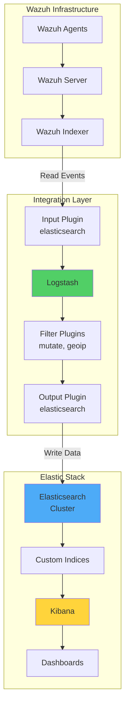

# Extending Wazuh Detection with Elastic Stack Integration

## Introduction

While Wazuh comes with its own indexer and dashboard based on OpenSearch, many organizations have existing investments in Elastic Stack infrastructure. Integrating Wazuh with Elasticsearch, Logstash, and Kibana (ELK) enables organizations to leverage their existing analytics platform while benefiting from Wazuh's powerful security detection capabilities.

This integration provides:

- 🔍 **Unified Analytics**: Combine Wazuh alerts with other data sources
- 📊 **Advanced Visualizations**: Create custom Kibana dashboards
- 🔄 **Data Pipeline Flexibility**: Process and enrich security events
- 📈 **Scalable Architecture**: Leverage Elasticsearch's distributed capabilities
- 🤝 **Ecosystem Integration**: Connect with existing Elastic tools and plugins

## Architecture Overview



## Infrastructure Requirements

For this integration, we'll need:

- **Wazuh Server**: Version 4.5+ with indexer
- **Elastic Stack**: Elasticsearch 8.x, Logstash 8.x, Kibana 8.x
- **System Requirements**:
  - Minimum 8GB RAM for Logstash node
  - Adequate storage for data retention
  - Network connectivity between all components

## Implementation Guide

### Phase 1: Prepare Elastic Stack

#### Configure Elasticsearch

Edit `/etc/elasticsearch/elasticsearch.yml`:

```yaml
# Cluster settings
cluster.name: security-analytics
node.name: elastic-node-1

# Network settings
network.host: 0.0.0.0
http.port: 9200

# Security settings
xpack.security.enabled: true
xpack.security.enrollment.enabled: true

# Discovery settings
discovery.seed_hosts: ["localhost"]
cluster.initial_master_nodes: ["elastic-node-1"]

# Performance settings
indices.memory.index_buffer_size: 30%
thread_pool.write.queue_size: 1000
```

#### Setup Authentication

```bash
# Set up passwords for built-in users
/usr/share/elasticsearch/bin/elasticsearch-setup-passwords auto

# Save the generated passwords securely
```

### Phase 2: Install and Configure Logstash

#### Installation

```bash
# Add Elastic repository
wget -qO - https://artifacts.elastic.co/GPG-KEY-elasticsearch | sudo gpg --dearmor -o /usr/share/keyrings/elastic-keyring.gpg
echo "deb [signed-by=/usr/share/keyrings/elastic-keyring.gpg] https://artifacts.elastic.co/packages/8.x/apt stable main" | sudo tee /etc/apt/sources.list.d/elastic-8.x.list

# Install Logstash
sudo apt-get update && sudo apt-get install logstash

# Start Logstash
sudo systemctl enable logstash
sudo systemctl start logstash
```

#### Configure Certificate Management

```bash
# Create certificate directory
sudo mkdir -p /etc/logstash/certs

# Copy Wazuh indexer certificates
sudo cp /path/to/wazuh-indexer-ca.pem /etc/logstash/certs/
sudo cp /path/to/elasticsearch-ca.pem /etc/logstash/certs/

# Set permissions
sudo chown -R logstash:logstash /etc/logstash/certs/
sudo chmod 600 /etc/logstash/certs/*
```

### Phase 3: Create Logstash Pipeline

#### Download Index Template

```bash
# Create templates directory
sudo mkdir -p /etc/logstash/templates

# Download Wazuh template for Elasticsearch
sudo wget -O /etc/logstash/templates/wazuh-template.json \
  https://raw.githubusercontent.com/wazuh/wazuh/4.5/extensions/elasticsearch/7.x/wazuh-template.json

# Modify template for Elasticsearch 8.x compatibility
sudo sed -i 's/"number_of_shards": 3/"number_of_shards": 1/g' /etc/logstash/templates/wazuh-template.json
```

#### Configure Keystore

```bash
# Set keystore password
export LOGSTASH_KEYSTORE_PASS="YourSecurePassword"
echo "LOGSTASH_KEYSTORE_PASS=\"$LOGSTASH_KEYSTORE_PASS\"" | sudo tee /etc/default/logstash

# Create keystore
sudo -E /usr/share/logstash/bin/logstash-keystore --path.settings /etc/logstash create

# Add credentials
sudo -E /usr/share/logstash/bin/logstash-keystore --path.settings /etc/logstash add ES_USER
sudo -E /usr/share/logstash/bin/logstash-keystore --path.settings /etc/logstash add ES_PWD
sudo -E /usr/share/logstash/bin/logstash-keystore --path.settings /etc/logstash add WAZUH_USER
sudo -E /usr/share/logstash/bin/logstash-keystore --path.settings /etc/logstash add WAZUH_PWD
```

#### Create Pipeline Configuration

Create `/etc/logstash/conf.d/wazuh-elastic.conf`:

```ruby
input {
  elasticsearch {
    hosts => ["https://wazuh-indexer:9200"]
    user => "${WAZUH_USER}"
    password => "${WAZUH_PWD}"
    index => "wazuh-alerts-4.x-*"
    ssl => true
    ca_file => "/etc/logstash/certs/wazuh-indexer-ca.pem"
    docinfo => true
    docinfo_fields => ["_index", "_type", "_id"]
    query => '{
      "query": {
        "range": {
          "@timestamp": {
            "gt": "now-5m"
          }
        }
      }
    }'
    schedule => "* * * * *"
  }
}

filter {
  # Remove unnecessary fields
  mutate {
    remove_field => ["@version", "host"]
  }

  # Add processing timestamp
  mutate {
    add_field => { "processed_at" => "%{+YYYY.MM.dd HH:mm:ss}" }
  }

  # GeoIP enrichment for source IPs
  if [data][srcip] {
    geoip {
      source => "[data][srcip]"
      target => "[data][geoip]"
      fields => ["country_name", "city_name", "location", "continent_code"]
    }
  }

  # Extract Windows event data
  if [data][win] {
    mutate {
      add_field => {
        "event_provider" => "%{[data][win][system][providerName]}"
        "event_id" => "%{[data][win][system][eventID]}"
      }
    }
  }

  # Parse syslog priority
  if [data][syslog] {
    ruby {
      code => '
        priority = event.get("[data][syslog][priority]").to_i
        severity = priority % 8
        facility = priority / 8
        event.set("[data][syslog][severity]", severity)
        event.set("[data][syslog][facility]", facility)
      '
    }
  }

  # Add severity mapping
  translate {
    field => "[rule][level]"
    destination => "[alert][severity]"
    dictionary => {
      "0" => "info"
      "1" => "info"
      "2" => "info"
      "3" => "info"
      "4" => "info"
      "5" => "low"
      "6" => "low"
      "7" => "medium"
      "8" => "medium"
      "9" => "high"
      "10" => "high"
      "11" => "critical"
      "12" => "critical"
      "13" => "critical"
      "14" => "critical"
      "15" => "critical"
    }
    fallback => "unknown"
  }
}

output {
  elasticsearch {
    hosts => ["https://elasticsearch:9200"]
    user => "${ES_USER}"
    password => "${ES_PWD}"
    index => "wazuh-alerts-%{+YYYY.MM.dd}"
    ssl => true
    cacert => "/etc/logstash/certs/elasticsearch-ca.pem"
    template => "/etc/logstash/templates/wazuh-template.json"
    template_name => "wazuh"
    template_overwrite => true
    
    # Performance settings
    pipeline => "wazuh-pipeline"
    pool_max => 50
    pool_max_per_route => 25
    timeout => 60
    
    # Retry configuration
    retry_on_conflict => 5
    retry_max_interval => 10
    retry_initial_interval => 2
  }

  # Optional: Debug output
  # stdout { codec => rubydebug }
}
```

### Phase 4: Optimize Pipeline Performance

#### JVM Configuration

Edit `/etc/logstash/jvm.options`:

```bash
# Heap size (set to 50-75% of available RAM)
-Xms4g
-Xmx4g

# GC configuration
-XX:+UseG1GC
-XX:MaxGCPauseMillis=200
-XX:InitiatingHeapOccupancyPercent=75

# GC logging
-Xlog:gc*:file=/var/log/logstash/gc.log:time,uptime:filecount=5,filesize=50M
```

#### Pipeline Settings

Edit `/etc/logstash/pipelines.yml`:

```yaml
- pipeline.id: wazuh-elastic
  path.config: "/etc/logstash/conf.d/wazuh-elastic.conf"
  pipeline.workers: 4
  pipeline.batch.size: 1000
  pipeline.batch.delay: 50
  queue.type: persisted
  queue.max_bytes: 1gb
  queue.checkpoint.writes: 1000
```

### Phase 5: Configure Kibana

#### Create Index Pattern

1. Navigate to **Stack Management → Index Patterns**
2. Click **Create index pattern**
3. Enter `wazuh-alerts-*` as the pattern
4. Select `@timestamp` as the time field
5. Click **Create index pattern**

#### Import Wazuh Dashboards

Create a dashboard import script:

```bash
#!/bin/bash
# import-wazuh-dashboards.sh

KIBANA_URL="http://localhost:5601"
KIBANA_USER="elastic"
KIBANA_PASS="your_password"

# Import visualizations
curl -X POST "$KIBANA_URL/api/saved_objects/_import" \
  -H "kbn-xsrf: true" \
  -H "Content-Type: multipart/form-data" \
  -u "$KIBANA_USER:$KIBANA_PASS" \
  -F file=@wazuh-kibana-dashboards.ndjson
```

## Advanced Configuration

### Multi-Pipeline Architecture

Create separate pipelines for different data types:

```ruby
# /etc/logstash/conf.d/wazuh-fim.conf
input {
  elasticsearch {
    hosts => ["https://wazuh-indexer:9200"]
    index => "wazuh-alerts-4.x-*"
    query => '{
      "query": {
        "bool": {
          "must": [
            { "range": { "@timestamp": { "gt": "now-5m" } } },
            { "term": { "rule.groups": "syscheck" } }
          ]
        }
      }
    }'
    schedule => "*/5 * * * *"
  }
}

filter {
  # FIM-specific processing
  if [syscheck][event] {
    mutate {
      add_field => {
        "file_change_type" => "%{[syscheck][event]}"
        "file_permissions" => "%{[syscheck][perm]}"
      }
    }
  }
  
  # Calculate file hash if available
  if [syscheck][md5_after] {
    fingerprint {
      source => "[syscheck][md5_after]"
      target => "[file][hash][md5]"
      method => "MD5"
    }
  }
}

output {
  elasticsearch {
    hosts => ["https://elasticsearch:9200"]
    index => "wazuh-fim-%{+YYYY.MM.dd}"
    # ... other settings
  }
}
```

### Data Enrichment Pipeline

```ruby
filter {
  # Threat intelligence enrichment
  if [data][srcip] {
    # Check against threat intel database
    jdbc_streaming {
      jdbc_driver_library => "/usr/share/logstash/jdbc/mysql-connector-java.jar"
      jdbc_driver_class => "com.mysql.cj.jdbc.Driver"
      jdbc_connection_string => "jdbc:mysql://threatintel-db:3306/threats"
      jdbc_user => "readonly"
      jdbc_password => "password"
      statement => "SELECT threat_level, threat_type FROM ip_threats WHERE ip = :ip"
      parameters => { "ip" => "[data][srcip]" }
      target => "threat_intel"
    }
  }

  # User context enrichment
  if [data][dstuser] {
    elasticsearch {
      hosts => ["https://elasticsearch:9200"]
      index => "user-context"
      query => "username:%{[data][dstuser]}"
      fields => {
        "department" => "[user][department]"
        "manager" => "[user][manager]"
        "risk_score" => "[user][risk_score]"
      }
    }
  }

  # Asset enrichment
  if [agent][name] {
    translate {
      field => "[agent][name]"
      destination => "[asset][criticality]"
      dictionary_path => "/etc/logstash/lookups/asset_criticality.yml"
      fallback => "medium"
    }
  }
}
```

### Performance Monitoring

Create monitoring configuration:

```ruby
# /etc/logstash/conf.d/self-monitoring.conf
input {
  # Monitor Logstash metrics
  http_poller {
    urls => {
      stats => "http://localhost:9600/_node/stats"
      hot_threads => "http://localhost:9600/_node/hot_threads"
    }
    request_timeout => 60
    schedule => { every => "30s" }
    codec => "json"
    metadata_target => "http_poller_metadata"
  }
}

filter {
  mutate {
    add_field => {
      "[@metadata][target_index]" => "logstash-monitoring-%{+YYYY.MM.dd}"
      "monitoring_type" => "logstash_stats"
    }
  }
}

output {
  elasticsearch {
    hosts => ["https://elasticsearch:9200"]
    index => "%{[@metadata][target_index]}"
    # ... authentication settings
  }
}
```

## Custom Kibana Visualizations

### Security Operations Dashboard

```json
{
  "version": "8.5.0",
  "objects": [
    {
      "id": "wazuh-security-overview",
      "type": "dashboard",
      "attributes": {
        "title": "Wazuh Security Overview",
        "kibanaSavedObjectMeta": {
          "searchSourceJSON": {
            "query": {
              "language": "kuery",
              "query": ""
            },
            "filter": []
          }
        },
        "panels": [
          {
            "version": "8.5.0",
            "type": "visualization",
            "gridData": {
              "x": 0,
              "y": 0,
              "w": 24,
              "h": 15,
              "i": "1"
            },
            "panelConfig": {
              "title": "Alert Trend",
              "type": "line",
              "params": {
                "grid": {
                  "categoryLines": false,
                  "style": {
                    "color": "#eee"
                  }
                },
                "categoryAxes": [{
                  "id": "CategoryAxis-1",
                  "type": "category",
                  "position": "bottom",
                  "show": true,
                  "style": {},
                  "scale": {
                    "type": "linear"
                  },
                  "labels": {
                    "show": true,
                    "truncate": 100
                  },
                  "title": {}
                }],
                "valueAxes": [{
                  "id": "ValueAxis-1",
                  "name": "LeftAxis-1",
                  "type": "value",
                  "position": "left",
                  "show": true,
                  "style": {},
                  "scale": {
                    "type": "linear",
                    "mode": "normal"
                  },
                  "labels": {
                    "show": true,
                    "rotate": 0,
                    "filter": false,
                    "truncate": 100
                  },
                  "title": {
                    "text": "Alert Count"
                  }
                }]
              }
            }
          },
          {
            "version": "8.5.0",
            "type": "visualization",
            "gridData": {
              "x": 24,
              "y": 0,
              "w": 24,
              "h": 15,
              "i": "2"
            },
            "panelConfig": {
              "title": "Top Threats",
              "type": "tagcloud",
              "params": {
                "scale": "linear",
                "orientation": "single",
                "minFontSize": 18,
                "maxFontSize": 72,
                "showLabel": true
              }
            }
          }
        ]
      }
    }
  ]
}
```

### Alert Correlation Visualization

```javascript
// Custom Vega visualization for alert correlation
{
  "$schema": "https://vega.github.io/schema/vega-lite/v5.json",
  "data": {
    "url": {
      "index": "wazuh-alerts-*",
      "body": {
        "size": 0,
        "aggs": {
          "time_buckets": {
            "date_histogram": {
              "field": "@timestamp",
              "interval": "1h"
            },
            "aggs": {
              "rule_correlation": {
                "terms": {
                  "field": "rule.id",
                  "size": 10
                },
                "aggs": {
                  "agent_count": {
                    "cardinality": {
                      "field": "agent.id"
                    }
                  }
                }
              }
            }
          }
        }
      }
    }
  },
  "mark": "circle",
  "encoding": {
    "x": {
      "field": "key",
      "type": "temporal",
      "axis": {"title": "Time"}
    },
    "y": {
      "field": "rule_correlation.buckets.key",
      "type": "nominal",
      "axis": {"title": "Rule ID"}
    },
    "size": {
      "field": "rule_correlation.buckets.agent_count.value",
      "type": "quantitative",
      "scale": {"range": [100, 1000]}
    },
    "color": {
      "field": "rule_correlation.buckets.doc_count",
      "type": "quantitative",
      "scale": {"scheme": "blues"}
    }
  }
}
```

## Monitoring and Troubleshooting

### Pipeline Health Monitoring

```bash
# Check pipeline statistics
curl -XGET 'localhost:9600/_node/stats/pipelines?pretty'

# Monitor pipeline throughput
watch -n 5 'curl -s localhost:9600/_node/stats/pipelines | jq .pipelines.\"wazuh-elastic\".events'

# Check for pipeline errors
tail -f /var/log/logstash/logstash-plain.log | grep -E 'ERROR|WARN'
```

### Common Issues and Solutions

#### Issue 1: Connection Timeout

```ruby
# Increase timeout settings
input {
  elasticsearch {
    hosts => ["https://wazuh-indexer:9200"]
    request_timeout => 120  # Increase from default 60
    socket_timeout => 120
    connect_timeout => 120
  }
}
```

#### Issue 2: Memory Pressure

```bash
# Monitor JVM heap usage
curl -s localhost:9600/_node/stats/jvm | jq '.jvm.mem.heap_used_percent'

# Adjust heap size if needed
sudo sed -i 's/-Xmx4g/-Xmx6g/g' /etc/logstash/jvm.options
sudo systemctl restart logstash
```

#### Issue 3: Certificate Validation

```ruby
# Temporary workaround for testing (not for production)
output {
  elasticsearch {
    ssl_certificate_verification => false
    # ... other settings
  }
}
```

## Best Practices

### 1. Security Hardening

```yaml
# Secure inter-node communication
Security Configuration:
  Transport Layer:
    - Enable TLS for all connections
    - Use strong cipher suites
    - Implement mutual authentication
  
  Access Control:
    - Use role-based access control
    - Implement API key authentication
    - Enable audit logging
  
  Network Isolation:
    - Use private networks for cluster communication
    - Implement firewall rules
    - Disable unnecessary ports
```

### 2. Data Retention Strategy

```bash
# Create ILM policy for Wazuh indices
PUT _ilm/policy/wazuh-alerts-policy
{
  "policy": {
    "phases": {
      "hot": {
        "min_age": "0ms",
        "actions": {
          "rollover": {
            "max_size": "50GB",
            "max_age": "7d"
          },
          "set_priority": {
            "priority": 100
          }
        }
      },
      "warm": {
        "min_age": "7d",
        "actions": {
          "shrink": {
            "number_of_shards": 1
          },
          "forcemerge": {
            "max_num_segments": 1
          },
          "set_priority": {
            "priority": 50
          }
        }
      },
      "cold": {
        "min_age": "30d",
        "actions": {
          "set_priority": {
            "priority": 0
          }
        }
      },
      "delete": {
        "min_age": "90d",
        "actions": {
          "delete": {}
        }
      }
    }
  }
}
```

### 3. Performance Optimization

```yaml
Optimization Strategies:
  Indexing:
    - Use bulk requests
    - Optimize refresh intervals
    - Implement proper sharding strategy
  
  Querying:
    - Use filters instead of queries
    - Implement caching strategies
    - Optimize aggregations
  
  Hardware:
    - Use SSDs for hot data
    - Allocate sufficient heap memory
    - Implement proper load balancing
```

## Use Cases

### 1. Multi-Tenant Security Monitoring

```ruby
filter {
  # Extract tenant information
  if [agent][labels][tenant] {
    mutate {
      add_field => { "[@metadata][tenant]" => "%{[agent][labels][tenant]}" }
    }
  } else {
    # Default tenant
    mutate {
      add_field => { "[@metadata][tenant]" => "default" }
    }
  }
  
  # Add tenant-specific enrichment
  if [@metadata][tenant] == "finance" {
    mutate {
      add_tag => ["pci-dss", "sensitive"]
    }
  }
}

output {
  elasticsearch {
    hosts => ["https://elasticsearch:9200"]
    # Route to tenant-specific index
    index => "wazuh-%{[@metadata][tenant]}-%{+YYYY.MM.dd}"
    # ... other settings
  }
}
```

### 2. Compliance Reporting

```ruby
filter {
  # Map rules to compliance frameworks
  if [rule][pci_dss] {
    mutate {
      add_field => { "[compliance][framework]" => "PCI-DSS" }
      add_field => { "[compliance][requirement]" => "%{[rule][pci_dss]}" }
    }
  }
  
  if [rule][gdpr] {
    mutate {
      add_field => { "[compliance][framework]" => "GDPR" }
      add_field => { "[compliance][article]" => "%{[rule][gdpr]}" }
    }
  }
  
  if [rule][hipaa] {
    mutate {
      add_field => { "[compliance][framework]" => "HIPAA" }
      add_field => { "[compliance][control]" => "%{[rule][hipaa]}" }
    }
  }
}
```

### 3. Threat Hunting Workflows

```javascript
// Elasticsearch query for threat hunting
GET wazuh-alerts-*/_search
{
  "size": 0,
  "query": {
    "bool": {
      "must": [
        {
          "range": {
            "@timestamp": {
              "gte": "now-24h"
            }
          }
        }
      ]
    }
  },
  "aggs": {
    "suspicious_patterns": {
      "significant_terms": {
        "field": "data.win.eventdata.commandLine.keyword",
        "size": 20,
        "gnd": {
          "background_is_superset": false
        }
      }
    },
    "rare_processes": {
      "rare_terms": {
        "field": "data.win.eventdata.image.keyword",
        "max_doc_count": 2
      }
    }
  }
}
```

## Integration with Elastic Tools

### 1. Machine Learning

```json
{
  "job_id": "wazuh-anomaly-detection",
  "analysis_config": {
    "bucket_span": "15m",
    "detectors": [
      {
        "detector_description": "Unusual number of authentication failures",
        "function": "high_count",
        "partition_field_name": "agent.name",
        "detector_index": 0
      }
    ],
    "influencers": ["agent.name", "data.srcip", "rule.id"]
  },
  "data_description": {
    "time_field": "@timestamp"
  },
  "datafeed_config": {
    "datafeed_id": "datafeed-wazuh-anomaly-detection",
    "job_id": "wazuh-anomaly-detection",
    "query": {
      "bool": {
        "must": [
          {"term": {"rule.groups": "authentication_failed"}}
        ]
      }
    },
    "indices": ["wazuh-alerts-*"]
  }
}
```

### 2. Elastic APM Integration

```ruby
filter {
  # Correlate security events with APM data
  if [data][srcip] and [data][dstport] {
    elasticsearch {
      hosts => ["https://elasticsearch:9200"]
      index => "apm-*-transaction"
      query => "context.request.socket.remote_address:%{[data][srcip]} AND context.request.socket.local_port:%{[data][dstport]}"
      fields => {
        "service.name" => "[correlation][service_name]"
        "transaction.id" => "[correlation][transaction_id]"
        "trace.id" => "[correlation][trace_id]"
      }
    }
  }
}
```

## Performance Metrics

### Key Performance Indicators

```yaml
Monitoring Metrics:
  Logstash:
    - Events per second (in/out)
    - Pipeline latency
    - JVM heap usage
    - Queue size and backpressure
  
  Elasticsearch:
    - Indexing rate
    - Query latency
    - Disk usage
    - Cluster health status
  
  End-to-End:
    - Alert ingestion delay
    - Dashboard load time
    - Search performance
    - Data retention compliance
```

### Monitoring Script

```bash
#!/bin/bash
# monitor-integration.sh

echo "=== Wazuh-Elastic Integration Monitor ==="
echo "Timestamp: $(date)"
echo ""

# Logstash metrics
echo "Logstash Pipeline Stats:"
curl -s localhost:9600/_node/stats/pipelines/wazuh-elastic | \
  jq '{
    events_in: .events.in,
    events_out: .events.out,
    queue_size: .queue.events_count,
    failures: .failures
  }'

echo ""
echo "Elasticsearch Cluster Health:"
curl -s -u elastic:$ES_PASS https://localhost:9200/_cluster/health?pretty

echo ""
echo "Index Statistics:"
curl -s -u elastic:$ES_PASS https://localhost:9200/wazuh-alerts-*/_stats/docs,store | \
  jq '{
    total_docs: ._all.total.docs.count,
    total_size: ._all.total.store.size_in_bytes
  }'
```

## Conclusion

Integrating Wazuh with Elastic Stack provides organizations with a powerful and flexible security analytics platform that combines:

- ✅ **Enterprise-grade scalability** with Elasticsearch's distributed architecture
- 📊 **Rich visualization capabilities** through Kibana's extensive features
- 🔄 **Flexible data processing** with Logstash's plugin ecosystem
- 🤖 **Advanced analytics** including machine learning and anomaly detection
- 🔍 **Unified platform** for security and operational data

This integration enables security teams to leverage their existing Elastic Stack investments while benefiting from Wazuh's comprehensive security detection capabilities.

## Key Takeaways

1. **Plan Architecture**: Design your pipeline architecture based on data volume and use cases
2. **Optimize Performance**: Tune JVM settings and pipeline configurations for your workload
3. **Secure Communications**: Always use TLS/SSL for data in transit
4. **Monitor Continuously**: Track pipeline metrics and cluster health
5. **Leverage Ecosystem**: Take advantage of Elastic's extensive tool ecosystem

## Resources

- [Elastic Stack Documentation](https://www.elastic.co/guide/index.html)
- [Logstash Best Practices](https://www.elastic.co/guide/en/logstash/current/deploying-and-scaling.html)
- [Wazuh Integration Guide](https://documentation.wazuh.com/current/user-manual/elasticsearch/index.html)
- [Elasticsearch Performance Tuning](https://www.elastic.co/guide/en/elasticsearch/reference/current/tune-for-indexing-speed.html)

---

*Enhance your security analytics with Wazuh and Elastic Stack integration! 🚀🔍*