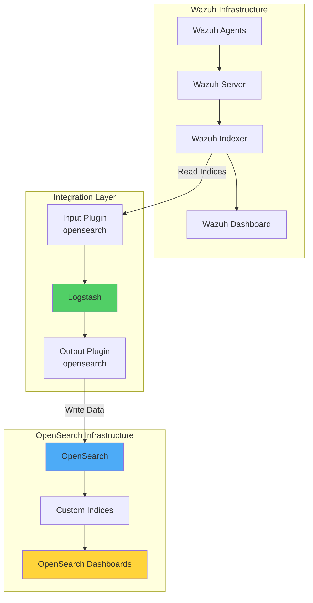
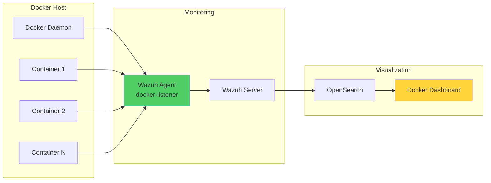

# Extending Wazuh Detection with OpenSearch Integration

## Introduction

While Wazuh provides comprehensive security monitoring capabilities out of the box, organizations often need to integrate with existing data analysis platforms for enhanced visualization and analytics. OpenSearch, an open source search and analytics engine, offers powerful capabilities for managing and visualizing security data.

Integrating Wazuh with OpenSearch provides:

- 🔍 **Advanced Search**: Leverage OpenSearch's powerful search capabilities
- 📊 **Custom Visualizations**: Create tailored dashboards for specific use cases
- 🔄 **Data Forwarding**: Stream security events to existing analytics infrastructure
- 📈 **Scalable Analytics**: Handle large-scale security data analysis
- 🤝 **Platform Integration**: Combine Wazuh alerts with other data sources

## Architecture Overview



## Infrastructure Requirements

For this integration, we'll need:

- **Wazuh Server**: CentOS 7 with Wazuh indexer and server 4.5.2
- **OpenSearch Server**: Ubuntu 22.04 with OpenSearch 2.10.0
- **Logstash**: Version 8.10 (installed on OpenSearch server)

## Implementation Guide

### Phase 1: Install and Configure Logstash

#### Installation

```bash
# Install prerequisites
sudo apt-get install apt-transport-https

# Add Elastic repository
wget -qO - https://artifacts.elastic.co/GPG-KEY-elasticsearch | sudo gpg --dearmor -o /usr/share/keyrings/elastic-keyring.gpg
echo "deb [signed-by=/usr/share/keyrings/elastic-keyring.gpg] https://artifacts.elastic.co/packages/8.x/apt stable main" | \
  sudo tee -a /etc/apt/sources.list.d/elastic-8.x.list

# Install Logstash
sudo apt-get update && sudo apt-get install logstash
sudo systemctl start logstash
sudo systemctl status logstash
```

#### Install Required Plugins

```bash
# Install OpenSearch input and output plugins
sudo /usr/share/logstash/bin/logstash-plugin install \
  logstash-input-opensearch logstash-output-opensearch
```

### Phase 2: Certificate Management

#### Setup Certificate Directories

```bash
# Create certificate directories
sudo mkdir /etc/logstash/wazuh-indexer-certs
sudo mkdir /etc/logstash/opensearch-certs

# Copy certificates (adjust paths as needed)
sudo cp /path/to/wazuh-root-ca.pem /etc/logstash/wazuh-indexer-certs/
sudo cp /path/to/opensearch-root-ca.pem /etc/logstash/opensearch-certs/

# Set permissions
sudo chmod -R 755 /etc/logstash/wazuh-indexer-certs/root-ca.pem
sudo chmod -R 755 /etc/logstash/opensearch-certs/root-ca.pem
```

### Phase 3: Configure Logstash Pipeline

#### Download Index Template

```bash
# Create templates directory
sudo mkdir /etc/logstash/templates

# Download Wazuh template for OpenSearch
sudo curl -o /etc/logstash/templates/wazuh.json \
  https://packages.wazuh.com/integrations/opensearch/4.x-2.x/dashboards/wz-os-4.x-2.x-template.json
```

#### Configure Keystore

```bash
# Set keystore password
set +o history
echo 'LOGSTASH_KEYSTORE_PASS="<MY_KEYSTORE_PASSWORD>"' | sudo tee /etc/default/logstash
export LOGSTASH_KEYSTORE_PASS=<MY_KEYSTORE_PASSWORD>
set -o history

# Secure the file
sudo chown root /etc/default/logstash
sudo chmod 600 /etc/default/logstash
sudo systemctl restart logstash

# Create keystore
sudo -E /usr/share/logstash/bin/logstash-keystore --path.settings /etc/logstash create

# Store credentials
sudo -E /usr/share/logstash/bin/logstash-keystore --path.settings /etc/logstash add OPENSEARCH_USERNAME
sudo -E /usr/share/logstash/bin/logstash-keystore --path.settings /etc/logstash add OPENSEARCH_PASSWORD
sudo -E /usr/share/logstash/bin/logstash-keystore --path.settings /etc/logstash add WAZUH_INDEXER_USERNAME
sudo -E /usr/share/logstash/bin/logstash-keystore --path.settings /etc/logstash add WAZUH_INDEXER_PASSWORD
```

#### Create Pipeline Configuration

Create `/etc/logstash/conf.d/wazuh-opensearch.conf`:

```ruby
input {
  opensearch {
    hosts =>  ["<WAZUH_INDEXER_ADDRESS>:9200"]
    user  =>  "${WAZUH_INDEXER_USERNAME}"
    password  =>  "${WAZUH_INDEXER_PASSWORD}"
    index =>  "wazuh-alerts-4.x-*"
    ssl => true
    ca_file => "/etc/logstash/wazuh-indexer-certs/root-ca.pem"
    query =>  '{
        "query": {
            "range": {
                "@timestamp": {
                    "gt": "now-1m"
                }
            }
        }
    }'
    schedule => "* * * * *"
  }
}

output {
    opensearch {
        hosts => ["<OPENSEARCH_ADDRESS>"]
        auth_type => {
            type => 'basic'
            user => '${OPENSEARCH_USERNAME}'
            password => '${OPENSEARCH_PASSWORD}'
        }
        index  => "wazuh-alerts-4.x-%{+YYYY.MM.dd}"
        cacert => "/etc/logstash/opensearch-certs/root-ca.pem"
        ssl => true
        template => "/etc/logstash/templates/wazuh.json"
        template_name => "wazuh"
        template_overwrite => true
    }
}
```

### Phase 4: Run and Test Logstash

#### Test Configuration

```bash
# Stop service
sudo systemctl stop logstash

# Test configuration
sudo -E /usr/share/logstash/bin/logstash \
  -f /etc/logstash/conf.d/wazuh-opensearch.conf \
  --path.settings /etc/logstash/
```

#### Run as Service

```bash
# Enable and start service
sudo systemctl enable logstash
sudo systemctl start logstash
```

### Phase 5: Configure OpenSearch Dashboards

#### Create Index Pattern

1. Navigate to **☰ > Management > Dashboards Management**
2. Choose **Index Patterns** and select **Create index pattern**
3. Define `wazuh-alerts-*` as the index pattern name
4. Select `timestamp` as the primary time field
5. Click **Create the index pattern**

#### Verify Integration

Navigate to **☰ > Discover** to view Wazuh security data in the `wazuh-alerts-4.x*` index pattern.

## Use Case: Docker Security Monitoring

### Overview

We'll demonstrate the integration's value by monitoring Docker events and visualizing them with a custom dashboard in OpenSearch.



### Configure Docker Monitoring

#### On CentOS Endpoint

1. **Install Prerequisites**:

```bash
# Install Python and pip
sudo yum install python3 python3-pip

# Install Docker
sudo curl -sSL https://get.docker.com/ | sh
sudo systemctl start docker

# Install Python Docker library
sudo pip3 install docker==4.2.0
```

2. **Enable Docker Listener Module**:

Edit `/var/ossec/etc/ossec.conf`:

```xml
<ossec_config>
  <wodle name="docker-listener">
    <interval>10m</interval>
    <attempts>5</attempts>
    <run_on_start>yes</run_on_start>
    <disabled>no</disabled>
  </wodle>
</ossec_config>
```

3. **Restart Wazuh Agent**:

```bash
sudo systemctl restart wazuh-agent
```

4. **Generate Docker Events**:

```bash
# Pull and run containers
sudo docker pull nginx
sudo docker run -d -P --name nginx_container nginx

# Execute commands in container
sudo docker exec -it nginx_container cat /etc/passwd
sudo docker exec -it nginx_container /bin/bash
exit

# Stop and remove container
sudo docker stop nginx_container
sudo docker rm nginx_container
sudo docker rmi nginx
```

### Import Docker Events Dashboard

1. **Download Dashboard File**: Get the Wazuh Docker events dashboard for OpenSearch

2. **Import in OpenSearch Dashboards**:
   - Navigate to **Management > Dashboards management**
   - Click **Saved Objects** → **Import**
   - Select the dashboard file and import

3. **View Dashboard**: Navigate to **Dashboards** to see Docker events visualization

## Advanced Integration Patterns

### Multi-Pipeline Configuration

Create separate pipelines for different data types:

```ruby
# /etc/logstash/conf.d/wazuh-fim.conf
input {
  opensearch {
    hosts => ["<WAZUH_INDEXER>:9200"]
    index => "wazuh-alerts-4.x-*"
    query => '{
      "query": {
        "bool": {
          "must": [
            { "range": { "@timestamp": { "gt": "now-5m" } } },
            { "term": { "rule.groups": "syscheck" } }
          ]
        }
      }
    }'
    schedule => "*/5 * * * *"
  }
}

output {
  opensearch {
    hosts => ["<OPENSEARCH>"]
    index => "wazuh-fim-%{+YYYY.MM.dd}"
    # ... other settings
  }
}
```

### Data Enrichment Pipeline

```ruby
filter {
  # Add GeoIP information
  if [data][srcip] {
    geoip {
      source => "[data][srcip]"
      target => "[data][geoip]"
    }
  }
  
  # Add custom fields
  mutate {
    add_field => {
      "environment" => "production"
      "processed_by" => "logstash"
    }
  }
  
  # Parse user agent strings
  if [data][http][user_agent] {
    useragent {
      source => "[data][http][user_agent]"
      target => "[data][user_agent_parsed]"
    }
  }
}
```

### Performance Optimization

#### Buffer Configuration

```ruby
output {
  opensearch {
    hosts => ["<OPENSEARCH>"]
    index => "wazuh-alerts-4.x-%{+YYYY.MM.dd}"
    
    # Buffer settings
    flush_size => 5000
    idle_flush_time => 5
    
    # Connection pooling
    pool_max => 50
    pool_max_per_route => 25
    
    # Retry configuration
    retry_on_conflict => 5
    retry_max_interval => 10
    retry_initial_interval => 2
  }
}
```

#### Resource Allocation

```yaml
# /etc/logstash/jvm.options
-Xms2g
-Xmx2g

# Pipeline settings
# /etc/logstash/pipelines.yml
- pipeline.id: wazuh-opensearch
  path.config: "/etc/logstash/conf.d/wazuh-opensearch.conf"
  pipeline.workers: 4
  pipeline.batch.size: 1000
  pipeline.batch.delay: 50
```

## Monitoring and Troubleshooting

### Pipeline Monitoring

```bash
# Check Logstash pipeline stats
curl -XGET 'localhost:9600/_node/stats/pipelines?pretty'

# Monitor Logstash logs
tail -f /var/log/logstash/logstash-plain.log

# Check OpenSearch indices
curl -XGET 'https://<OPENSEARCH>:9200/_cat/indices/wazuh-*?v'
```

### Common Issues and Solutions

#### Issue 1: No Data in OpenSearch

```bash
# Verify Wazuh indexer connectivity
curl -k -u admin:admin https://<WAZUH_INDEXER>:9200/_cat/indices?v

# Check Logstash input
sudo -E /usr/share/logstash/bin/logstash \
  -e 'input { opensearch { hosts => ["<WAZUH_INDEXER>:9200"] 
       index => "wazuh-alerts-*" } } 
       output { stdout { codec => rubydebug } }'
```

#### Issue 2: SSL Certificate Errors

```ruby
# Temporary workaround (not for production)
output {
  opensearch {
    ssl_certificate_verification => false
    # ... other settings
  }
}
```

#### Issue 3: Performance Issues

```bash
# Increase heap size
sudo sed -i 's/-Xms1g/-Xms4g/g' /etc/logstash/jvm.options
sudo sed -i 's/-Xmx1g/-Xmx4g/g' /etc/logstash/jvm.options

# Restart Logstash
sudo systemctl restart logstash
```

## Best Practices

### 1. Security Hardening

```yaml
# Secure certificate storage
certificates:
  strict_permissions: true
  verification_mode: full
  
# Network isolation
firewall_rules:
  - source: logstash_server
    destination: wazuh_indexer
    port: 9200
    protocol: tcp
  
  - source: logstash_server
    destination: opensearch_cluster
    port: 9200
    protocol: tcp
```

### 2. Data Retention Policy

```bash
# Create index lifecycle policy
PUT _plugins/_ism/policies/wazuh-retention
{
  "policy": {
    "description": "Wazuh data retention policy",
    "default_state": "hot",
    "states": [
      {
        "name": "hot",
        "actions": [],
        "transitions": [
          {
            "state_name": "warm",
            "conditions": {
              "min_index_age": "7d"
            }
          }
        ]
      },
      {
        "name": "warm",
        "actions": [
          {
            "replica_count": {
              "number_of_replicas": 1
            }
          }
        ],
        "transitions": [
          {
            "state_name": "delete",
            "conditions": {
              "min_index_age": "30d"
            }
          }
        ]
      },
      {
        "name": "delete",
        "actions": [
          {
            "delete": {}
          }
        ]
      }
    ]
  }
}
```

### 3. Monitoring Best Practices

```yaml
monitoring_checklist:
  - metric: pipeline_throughput
    threshold: "> 1000 events/sec"
    action: scale_horizontally
    
  - metric: indexing_latency
    threshold: "< 100ms"
    action: optimize_bulk_settings
    
  - metric: error_rate
    threshold: "< 1%"
    action: investigate_failures
```

## Custom Visualizations

### Creating Security Dashboards

```json
{
  "visualization": {
    "title": "Wazuh Security Events Timeline",
    "visState": {
      "type": "line",
      "params": {
        "grid": {
          "categoryLines": false,
          "style": {
            "color": "#eee"
          }
        },
        "categoryAxes": [{
          "id": "CategoryAxis-1",
          "type": "category",
          "position": "bottom",
          "show": true,
          "style": {},
          "scale": {
            "type": "linear"
          },
          "labels": {
            "show": true,
            "truncate": 100
          },
          "title": {}
        }],
        "valueAxes": [{
          "id": "ValueAxis-1",
          "name": "LeftAxis-1",
          "type": "value",
          "position": "left",
          "show": true,
          "style": {},
          "scale": {
            "type": "linear",
            "mode": "normal"
          },
          "labels": {
            "show": true,
            "rotate": 0,
            "filter": false,
            "truncate": 100
          },
          "title": {
            "text": "Event Count"
          }
        }],
        "seriesParams": [{
          "show": true,
          "type": "line",
          "mode": "normal",
          "data": {
            "label": "Security Events",
            "id": "1"
          },
          "valueAxis": "ValueAxis-1",
          "drawLinesBetweenPoints": true,
          "showCircles": true
        }]
      }
    }
  }
}
```

### Alert Correlation Dashboard

```javascript
// Custom OpenSearch query for correlation
GET wazuh-alerts-*/_search
{
  "size": 0,
  "aggs": {
    "correlations": {
      "composite": {
        "sources": [
          { "agent": { "terms": { "field": "agent.name" } } },
          { "rule": { "terms": { "field": "rule.id" } } }
        ]
      },
      "aggs": {
        "alert_count": {
          "value_count": {
            "field": "_id"
          }
        },
        "severity_stats": {
          "stats": {
            "field": "rule.level"
          }
        }
      }
    }
  }
}
```

## Integration Use Cases

### 1. Compliance Monitoring

```ruby
# Compliance-specific pipeline
input {
  opensearch {
    hosts => ["<WAZUH_INDEXER>:9200"]
    index => "wazuh-alerts-4.x-*"
    query => '{
      "query": {
        "bool": {
          "should": [
            { "exists": { "field": "rule.pci_dss" } },
            { "exists": { "field": "rule.gdpr" } },
            { "exists": { "field": "rule.hipaa" } }
          ]
        }
      }
    }'
    schedule => "*/10 * * * *"
  }
}

output {
  opensearch {
    hosts => ["<OPENSEARCH>"]
    index => "wazuh-compliance-%{+YYYY.MM}"
    # ... configuration
  }
}
```

### 2. Threat Intelligence Integration

```ruby
filter {
  # Enrich with threat intelligence
  translate {
    field => "[data][srcip]"
    destination => "[threat][classification]"
    dictionary_path => "/etc/logstash/threat_intel.yml"
  }
  
  # Add threat score
  ruby {
    code => "
      if event.get('[threat][classification]')
        threat_scores = {
          'malicious' => 10,
          'suspicious' => 7,
          'unknown' => 5
        }
        event.set('[threat][score]', 
          threat_scores[event.get('[threat][classification]')] || 0)
      end
    "
  }
}
```

### 3. Multi-Tenant Deployment

```ruby
# Route alerts to tenant-specific indices
filter {
  # Determine tenant based on agent metadata
  if [agent][labels][tenant] {
    mutate {
      add_field => { "[@metadata][tenant]" => "%{[agent][labels][tenant]}" }
    }
  } else {
    mutate {
      add_field => { "[@metadata][tenant]" => "default" }
    }
  }
}

output {
  opensearch {
    hosts => ["<OPENSEARCH>"]
    index => "wazuh-%{[@metadata][tenant]}-%{+YYYY.MM.dd}"
    # ... configuration
  }
}
```

## Performance Metrics

### Key Performance Indicators

```yaml
kpi_monitoring:
  pipeline_metrics:
    - events_received_rate
    - events_filtered_rate
    - events_out_rate
    - queue_push_duration
    - queue_backpressure
    
  opensearch_metrics:
    - indexing_rate
    - indexing_latency
    - search_latency
    - disk_usage
    - heap_usage
    
  system_metrics:
    - cpu_usage
    - memory_usage
    - network_throughput
    - disk_io
```

### Optimization Strategies

1. **Batch Processing**: Optimize batch sizes for throughput
2. **Index Sharding**: Distribute data across multiple shards
3. **Query Optimization**: Use filters instead of queries where possible
4. **Resource Allocation**: Scale vertically or horizontally based on load

## Alternative Integration Method

### Direct Wazuh Server Integration

For resource-constrained environments, you can forward alerts directly from the Wazuh server:

```xml
<!-- /var/ossec/etc/ossec.conf -->
<ossec_config>
  <global>
    <jsonout_output>yes</jsonout_output>
    <logall_json>yes</logall_json>
  </global>
  
  <output>
    <name>opensearch-output</name>
    <format>json</format>
    <server>logstash.example.com</server>
    <port>5000</port>
  </output>
</ossec_config>
```

## Conclusion

Integrating Wazuh with OpenSearch through Logstash provides a powerful solution for organizations seeking to:

- ✅ **Enhance visualization** capabilities beyond standard dashboards
- 📊 **Combine security data** with other organizational data
- 🔄 **Maintain flexibility** in data processing and storage
- 📈 **Scale analytics** infrastructure independently
- 🛡️ **Preserve existing** OpenSearch investments

This integration enables security teams to leverage the best of both platforms while maintaining operational efficiency.

## Key Takeaways

1. **Plan Architecture**: Design pipeline architecture based on data volume and requirements
2. **Secure Communications**: Always use SSL/TLS for data in transit
3. **Monitor Performance**: Track pipeline metrics to ensure optimal operation
4. **Optimize Resources**: Tune Logstash settings based on workload
5. **Document Configuration**: Maintain clear documentation of all integrations

## Resources

- [OpenSearch Documentation](https://opensearch.org/docs/latest/)
- [Logstash Reference](https://www.elastic.co/guide/en/logstash/current/index.html)
- [Wazuh Integration Guide](https://documentation.wazuh.com/current/user-manual/elasticsearch/index.html)
- [Docker Monitoring with Wazuh](https://documentation.wazuh.com/current/user-manual/capabilities/container-security/monitoring-docker.html)

---

*Extend your security monitoring capabilities with Wazuh and OpenSearch integration! 🚀🔍*