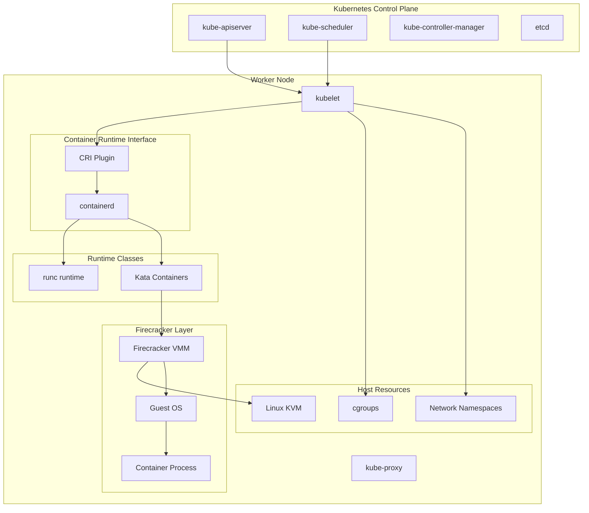
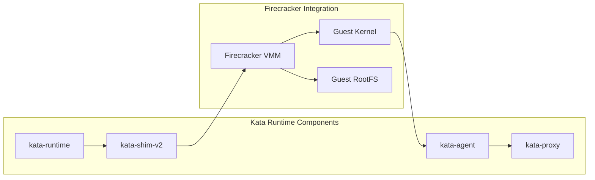

## Table of Contents

## Introduction

Container orchestration platforms like Kubernetes traditionally rely on shared-kernel containers for workload isolation. While efficient, this approach can pose security risks in multi-tenant environments. Firecracker bridges this gap by providing VM-level isolation for containers without sacrificing the orchestration benefits of Kubernetes.

This comprehensive guide explores integrating Firecracker with container orchestration platforms, focusing on Kubernetes through Kata Containers. We'll cover installation, configuration, runtime classes, and production deployment patterns that enable secure, high-performance container workloads.

## Architecture Overview



### Integration Benefits

**Enhanced Security**: VM-level isolation for containers running untrusted workloads
**Kubernetes Native**: Full compatibility with existing Kubernetes APIs and tooling
**Performance Optimized**: Fast boot times and minimal overhead compared to traditional VMs
**Multi-Tenancy**: Strong isolation boundaries for running multiple customer workloads
**Compliance Ready**: Meets regulatory requirements for workload isolation

## Kata Containers Overview

Kata Containers is an open-source container runtime that creates lightweight VMs for each container or pod. It integrates seamlessly with Kubernetes through the Container Runtime Interface (CRI).

### Kata Components



## Installation and Setup

### Prerequisites

```bash
#!/bin/bash

# Check system requirements
echo "=== Kata Containers Prerequisites ==="

# Check KVM support
if [ -e /dev/kvm ]; then
    echo "✓ KVM device available"
    ls -la /dev/kvm
else
    echo "✗ KVM device not found"
    exit 1
fi

# Check CPU virtualization
if grep -q -E 'vmx|svm' /proc/cpuinfo; then
    echo "✓ CPU virtualization supported"
else
    echo "✗ CPU virtualization not supported"
    exit 1
fi

# Check kernel version
kernel_version=$(uname -r | cut -d. -f1,2)
required_version="4.14"
if awk "BEGIN {exit !($kernel_version >= $required_version)}"; then
    echo "✓ Kernel version $kernel_version >= $required_version"
else
    echo "✗ Kernel version $kernel_version < $required_version"
    exit 1
fi

# Install dependencies
echo "Installing dependencies..."
sudo apt update
sudo apt install -y \
    curl \
    gnupg \
    lsb-release \
    apt-transport-https \
    ca-certificates \
    software-properties-common

echo "Prerequisites check complete!"
```

### Installing Kata Containers

```bash
#!/bin/bash

# Install Kata Containers
echo "=== Installing Kata Containers ==="

# Add Kata repository
sudo sh -c "echo 'deb http://download.opensuse.org/repositories/home:/katacontainers:/releases:/$(lsb_release -cs):/main/xUbuntu_$(lsb_release -rs)/ /' > /etc/apt/sources.list.d/kata-containers.list"

# Add repository key
curl -fsSL https://download.opensuse.org/repositories/home:katacontainers:releases:$(lsb_release -cs):main/xUbuntu_$(lsb_release -rs)/Release.key | sudo gpg --dearmor -o /etc/apt/trusted.gpg.d/kata-containers.gpg

# Update package list
sudo apt update

# Install Kata Containers
sudo apt install -y kata-containers

# Verify installation
echo "Kata Containers version:"
kata-runtime --version

# Check configuration
echo "Kata configuration:"
kata-runtime kata-check

# Install Firecracker
echo "=== Installing Firecracker ==="
ARCH="$(uname -m)"
latest=$(basename $(curl -fsSLI -o /dev/null -w %{url_effective} https://github.com/firecracker-microvm/firecracker/releases/latest))
curl -L "https://github.com/firecracker-microvm/firecracker/releases/download/${latest}/firecracker-${latest}-${ARCH}.tgz" | tar -xz

sudo mv release-${latest}-${ARCH}/firecracker-${latest}-${ARCH} /usr/local/bin/firecracker
sudo chmod +x /usr/local/bin/firecracker

echo "Firecracker version:"
firecracker --version
```

### Configuring Kata with Firecracker

```bash
#!/bin/bash

# Configure Kata to use Firecracker
echo "=== Configuring Kata Containers ==="

# Backup default configuration
sudo cp /etc/kata-containers/configuration.toml /etc/kata-containers/configuration.toml.backup

# Create Firecracker-specific configuration
sudo tee /etc/kata-containers/configuration-fc.toml << 'EOF'
# Kata Containers configuration for Firecracker

[hypervisor.firecracker]
path = "/usr/local/bin/firecracker"
kernel = "/usr/share/kata-containers/vmlinux.container"
image = "/usr/share/kata-containers/kata-containers.img"
machine_type = ""
kernel_params = "console=ttyS0 reboot=k panic=1 pci=off nomodules ro systemd.unit=kata-containers.target systemd.mask=systemd-networkd.service systemd.mask=systemd-resolved.service"
initrd = ""
firmware = ""
machine_accelerators = ""
cpu_features = ""
default_vcpus = 1
default_maxvcpus = 4
default_memory = 512
default_bridges = 1
default_maxhotplugvifs = 1
path_to_vhost_net = "/dev/vhost-net"
path_to_vhost_vsock = "/dev/vhost-vsock"
disable_block_device_use = false
shared_fs = "virtio-9p"
virtio_fs_daemon = ""
virtio_fs_cache_size = 0
virtio_fs_extra_args = []
block_device_driver = "virtio-blk"
block_device_cache_set = false
block_device_cache_direct = false
block_device_cache_noflush = false
enable_iothreads = false
enable_mem_prealloc = false
enable_hugepages = false
enable_swap = false
enable_debug = false
disable_nesting_checks = true
enable_entropy = false
valid_entropy_sources = ["/dev/urandom","/dev/random",""]
file_mem_backend = ""
pflash = []
enable_annotations = []
disable_image_nvdimm = false
hotplug_vfio_on_root_bus = false
disable_vhost_net = true
guest_hook_path = ""
rxfile_mem_backend = ""
sgx_epc_size = 0

[agent.kata]
use_vsock = false
debug_console_enabled = false
container_pipe_size = 0

[runtime]
internetworking_model = "tcfilter"
disable_guest_seccomp = false
disable_new_netns = false
sandbox_cgroup_with_parent = false
static_sandbox_resource_mgmt = true
enable_cpu_memory_hotplug = false
disable_guest_empty_dir = false
experimental = []
EOF

# Set Firecracker as default hypervisor for Kata
sudo sed -i 's/default_hypervisor = "qemu"/default_hypervisor = "firecracker"/' /etc/kata-containers/configuration.toml

# Enable Kata runtime
echo "Kata Containers configured for Firecracker"
kata-runtime kata-check --verbose
```

## Kubernetes Integration

### Installing containerd with Kata Support

```bash
#!/bin/bash

# Install containerd
echo "=== Installing containerd ==="

# Install containerd
curl -fsSL https://download.docker.com/linux/ubuntu/gpg | sudo apt-key add -
sudo add-apt-repository "deb [arch=amd64] https://download.docker.com/linux/ubuntu $(lsb_release -cs) stable"
sudo apt update
sudo apt install -y containerd.io

# Configure containerd for Kata
sudo mkdir -p /etc/containerd

# Generate default config
containerd config default | sudo tee /etc/containerd/config.toml

# Add Kata runtime configuration
cat << 'EOF' | sudo tee -a /etc/containerd/config.toml

# Kata Containers runtime configuration
[plugins."io.containerd.grpc.v1.cri".containerd.runtimes.kata]
  runtime_type = "io.containerd.kata.v2"
  privileged_without_host_devices = false
  pod_annotations = ["io.katacontainers.*"]
  
[plugins."io.containerd.grpc.v1.cri".containerd.runtimes.kata.options]
  BinaryName = "kata-runtime"
  ConfigPath = "/etc/kata-containers/configuration.toml"

# Kata with Firecracker runtime
[plugins."io.containerd.grpc.v1.cri".containerd.runtimes.kata-fc]
  runtime_type = "io.containerd.kata.v2"
  privileged_without_host_devices = false
  pod_annotations = ["io.katacontainers.*"]
  
[plugins."io.containerd.grpc.v1.cri".containerd.runtimes.kata-fc.options]
  BinaryName = "kata-runtime"
  ConfigPath = "/etc/kata-containers/configuration-fc.toml"
EOF

# Restart containerd
sudo systemctl restart containerd
sudo systemctl enable containerd

# Verify configuration
echo "Checking containerd configuration..."
sudo ctr version
```

### Installing Kubernetes

```bash
#!/bin/bash

# Install Kubernetes components
echo "=== Installing Kubernetes ==="

# Add Kubernetes repository
curl -s https://packages.cloud.google.com/apt/doc/apt-key.gpg | sudo apt-key add -
echo "deb https://apt.kubernetes.io/ kubernetes-xenial main" | sudo tee /etc/apt/sources.list.d/kubernetes.list

sudo apt update
sudo apt install -y kubelet kubeadm kubectl
sudo apt-mark hold kubelet kubeadm kubectl

# Configure kubelet for containerd
cat << 'EOF' | sudo tee /etc/default/kubelet
KUBELET_EXTRA_ARGS="--container-runtime=remote --container-runtime-endpoint=unix:///var/run/containerd/containerd.sock --cgroup-driver=systemd"
EOF

# Initialize Kubernetes cluster (master node)
if [ "$1" == "master" ]; then
    echo "Initializing Kubernetes master..."
    sudo kubeadm init --cri-socket unix:///var/run/containerd/containerd.sock --pod-network-cidr=10.244.0.0/16
    
    # Configure kubectl for regular user
    mkdir -p $HOME/.kube
    sudo cp -i /etc/kubernetes/admin.conf $HOME/.kube/config
    sudo chown $(id -u):$(id -g) $HOME/.kube/config
    
    # Install Flannel CNI
    kubectl apply -f https://raw.githubusercontent.com/coreos/flannel/master/Documentation/kube-flannel.yml
    
    echo "Kubernetes master initialized!"
    echo "To add worker nodes, use the join command displayed above."
fi

echo "Kubernetes installation complete!"
```

## RuntimeClass Configuration

RuntimeClass provides a way to select different container runtimes in Kubernetes.

### Creating RuntimeClass Resources

```yaml
# runtime-classes.yaml
apiVersion: node.k8s.io/v1
kind: RuntimeClass
metadata:
  name: kata-fc
handler: kata-fc
overhead:
  podFixed:
    memory: "50Mi"
    cpu: "50m"
scheduling:
  nodeClassification:
    katacontainers.io/kata-runtime: "firecracker"

---
apiVersion: node.k8s.io/v1
kind: RuntimeClass
metadata:
  name: kata-qemu
handler: kata
overhead:
  podFixed:
    memory: "120Mi"
    cpu: "100m"
scheduling:
  nodeClassification:
    katacontainers.io/kata-runtime: "qemu"

---
apiVersion: node.k8s.io/v1
kind: RuntimeClass
metadata:
  name: runc
handler: runc
overhead:
  podFixed:
    memory: "5Mi"
    cpu: "10m"
```

### Applying RuntimeClass Configuration

```bash
#!/bin/bash

# Apply RuntimeClass configurations
kubectl apply -f runtime-classes.yaml

# Verify RuntimeClasses
echo "Available RuntimeClasses:"
kubectl get runtimeclass

# Label nodes for runtime scheduling
kubectl label node <node-name> katacontainers.io/kata-runtime=firecracker

# Check node labels
kubectl get nodes --show-labels
```

## Container Deployment Examples

### Basic Pod with Kata Firecracker

```yaml
# kata-pod.yaml
apiVersion: v1
kind: Pod
metadata:
  name: kata-firecracker-pod
  labels:
    app: secure-workload
spec:
  runtimeClassName: kata-fc
  containers:
  - name: secure-container
    image: nginx:alpine
    ports:
    - containerPort: 80
    resources:
      requests:
        memory: "128Mi"
        cpu: "100m"
      limits:
        memory: "256Mi"
        cpu: "200m"
    securityContext:
      runAsNonRoot: true
      runAsUser: 1000
      allowPrivilegeEscalation: false
      capabilities:
        drop:
        - ALL
      readOnlyRootFilesystem: true
    volumeMounts:
    - name: tmp-volume
      mountPath: /tmp
    - name: var-cache-nginx
      mountPath: /var/cache/nginx
    - name: var-run
      mountPath: /var/run
  volumes:
  - name: tmp-volume
    emptyDir: {}
  - name: var-cache-nginx
    emptyDir: {}
  - name: var-run
    emptyDir: {}
  restartPolicy: Always
```

### Deployment with Mixed Runtimes

```yaml
# mixed-runtime-deployment.yaml
apiVersion: apps/v1
kind: Deployment
metadata:
  name: web-application
spec:
  replicas: 3
  selector:
    matchLabels:
      app: web-app
  template:
    metadata:
      labels:
        app: web-app
    spec:
      runtimeClassName: kata-fc  # Secure runtime for web tier
      containers:
      - name: web-server
        image: nginx:alpine
        ports:
        - containerPort: 80
        resources:
          requests:
            memory: "128Mi"
            cpu: "100m"
          limits:
            memory: "256Mi"
            cpu: "200m"

---
apiVersion: apps/v1
kind: Deployment
metadata:
  name: background-workers
spec:
  replicas: 2
  selector:
    matchLabels:
      app: worker
  template:
    metadata:
      labels:
        app: worker
    spec:
      runtimeClassName: runc  # Standard runtime for internal workers
      containers:
      - name: worker
        image: alpine:latest
        command: ["/bin/sh"]
        args: ["-c", "while true; do echo 'Processing...'; sleep 30; done"]
        resources:
          requests:
            memory: "64Mi"
            cpu: "50m"
          limits:
            memory: "128Mi"
            cpu: "100m"
```

### StatefulSet with Persistent Storage

```yaml
# kata-statefulset.yaml
apiVersion: apps/v1
kind: StatefulSet
metadata:
  name: secure-database
spec:
  serviceName: "database"
  replicas: 3
  selector:
    matchLabels:
      app: database
  template:
    metadata:
      labels:
        app: database
    spec:
      runtimeClassName: kata-fc
      containers:
      - name: postgres
        image: postgres:13-alpine
        env:
        - name: POSTGRES_PASSWORD
          valueFrom:
            secretKeyRef:
              name: postgres-secret
              key: password
        - name: PGDATA
          value: /var/lib/postgresql/data/pgdata
        ports:
        - containerPort: 5432
        resources:
          requests:
            memory: "256Mi"
            cpu: "200m"
          limits:
            memory: "512Mi"
            cpu: "500m"
        volumeMounts:
        - name: postgres-storage
          mountPath: /var/lib/postgresql/data
        securityContext:
          runAsUser: 999
          runAsGroup: 999
          fsGroup: 999
        livenessProbe:
          exec:
            command:
            - pg_isready
            - -U
            - postgres
          initialDelaySeconds: 30
          periodSeconds: 10
        readinessProbe:
          exec:
            command:
            - pg_isready
            - -U
            - postgres
          initialDelaySeconds: 5
          periodSeconds: 5
  volumeClaimTemplates:
  - metadata:
      name: postgres-storage
    spec:
      accessModes: ["ReadWriteOnce"]
      resources:
        requests:
          storage: 10Gi
      storageClassName: fast-ssd

---
apiVersion: v1
kind: Secret
metadata:
  name: postgres-secret
type: Opaque
data:
  password: cG9zdGdyZXMxMjM=  # postgres123 base64 encoded
```

## Advanced Configuration

### Custom Kata Configuration

```toml
# /etc/kata-containers/configuration-custom.toml
[hypervisor.firecracker]
path = "/usr/local/bin/firecracker"
kernel = "/usr/share/kata-containers/vmlinux-fc.container"
image = "/usr/share/kata-containers/kata-containers-fc.img"

# Optimized for microservices
default_vcpus = 1
default_maxvcpus = 2
default_memory = 256
default_bridges = 1

# Kernel parameters for faster boot
kernel_params = "console=ttyS0 reboot=k panic=1 pci=off nomodules ro systemd.unit=kata-containers.target systemd.mask=systemd-networkd.service systemd.mask=systemd-resolved.service quiet"

# Security enhancements
disable_block_device_use = false
shared_fs = "virtio-fs"
block_device_driver = "virtio-blk"
enable_debug = false
disable_nesting_checks = true

# Performance optimizations
enable_mem_prealloc = true
enable_hugepages = true
enable_iothreads = true

[agent.kata]
use_vsock = true
debug_console_enabled = false
container_pipe_size = 2097152

[runtime]
internetworking_model = "tcfilter"
disable_guest_seccomp = false
disable_new_netns = false
sandbox_cgroup_with_parent = true
static_sandbox_resource_mgmt = false
enable_cpu_memory_hotplug = true
```

### Network Policies for Kata Workloads

```yaml
# kata-network-policy.yaml
apiVersion: networking.k8s.io/v1
kind: NetworkPolicy
metadata:
  name: kata-secure-policy
spec:
  podSelector:
    matchLabels:
      security-level: high
  policyTypes:
  - Ingress
  - Egress
  ingress:
  - from:
    - podSelector:
        matchLabels:
          allowed-access: "true"
    - namespaceSelector:
        matchLabels:
          name: trusted-namespace
    ports:
    - protocol: TCP
      port: 80
    - protocol: TCP
      port: 443
  egress:
  - to:
    - podSelector:
        matchLabels:
          app: database
    ports:
    - protocol: TCP
      port: 5432
  - to: []  # Allow DNS
    ports:
    - protocol: UDP
      port: 53
    - protocol: TCP
      port: 53
```

### Resource Quotas and Limits

```yaml
# kata-resource-quota.yaml
apiVersion: v1
kind: ResourceQuota
metadata:
  name: kata-quota
  namespace: secure-workloads
spec:
  hard:
    requests.cpu: "10"
    requests.memory: 20Gi
    limits.cpu: "20"
    limits.memory: 40Gi
    persistentvolumeclaims: "10"
    pods: "50"
    # Kata-specific quotas
    count/pods.kata-fc: "20"
    count/pods.kata-qemu: "10"

---
apiVersion: v1
kind: LimitRange
metadata:
  name: kata-limits
  namespace: secure-workloads
spec:
  limits:
  - type: Pod
    max:
      cpu: "2"
      memory: "4Gi"
    min:
      cpu: "100m"
      memory: "128Mi"
    default:
      cpu: "500m"
      memory: "512Mi"
    defaultRequest:
      cpu: "100m"
      memory: "128Mi"
  - type: Container
    max:
      cpu: "1"
      memory: "2Gi"
    min:
      cpu: "50m"
      memory: "64Mi"
    default:
      cpu: "200m"
      memory: "256Mi"
    defaultRequest:
      cpu: "50m"
      memory: "64Mi"
```

## Monitoring and Observability

### Kata Metrics Collection

```python
#!/usr/bin/env python3
import json
import time
import subprocess
from datetime import datetime
from prometheus_client import start_http_server, Gauge, Counter, Histogram

class KataMetricsCollector:
    """Collect metrics from Kata Containers and Firecracker"""
    
    def __init__(self):
        # Prometheus metrics
        self.kata_pods_total = Gauge('kata_pods_total', 'Total number of Kata pods')
        self.kata_memory_usage = Gauge('kata_memory_usage_bytes', 'Memory usage of Kata pods', ['pod_name', 'namespace'])
        self.kata_cpu_usage = Gauge('kata_cpu_usage_percent', 'CPU usage of Kata pods', ['pod_name', 'namespace'])
        self.kata_boot_time = Histogram('kata_boot_time_seconds', 'Time to boot Kata containers')
        self.firecracker_vms = Gauge('firecracker_vms_total', 'Total number of Firecracker VMs')
        
    def collect_kata_metrics(self):
        """Collect metrics from Kata runtime"""
        
        try:
            # Get running Kata containers
            result = subprocess.run([
                'kata-runtime', 'list', '--format=json'
            ], capture_output=True, text=True, check=True)
            
            containers = json.loads(result.stdout) if result.stdout else []
            
            # Update total pods
            self.kata_pods_total.set(len(containers))
            
            for container in containers:
                self.collect_container_metrics(container)
                
        except subprocess.CalledProcessError as e:
            print(f"Error collecting Kata metrics: {e}")
        except json.JSONDecodeError as e:
            print(f"Error parsing Kata metrics: {e}")
    
    def collect_container_metrics(self, container):
        """Collect metrics for individual container"""
        
        container_id = container.get('id', '')
        
        try:
            # Get container stats
            result = subprocess.run([
                'kata-runtime', 'events', '--stats', container_id
            ], capture_output=True, text=True, check=True)
            
            stats = json.loads(result.stdout)
            
            # Extract pod information from labels
            pod_name = container.get('labels', {}).get('io.kubernetes.pod.name', 'unknown')
            namespace = container.get('labels', {}).get('io.kubernetes.pod.namespace', 'default')
            
            # Memory metrics
            memory_stats = stats.get('data', {}).get('memory', {})
            if 'usage' in memory_stats:
                self.kata_memory_usage.labels(
                    pod_name=pod_name,
                    namespace=namespace
                ).set(memory_stats['usage'])
            
            # CPU metrics
            cpu_stats = stats.get('data', {}).get('cpu', {})
            if 'usage' in cpu_stats and 'total' in cpu_stats['usage']:
                cpu_percent = self.calculate_cpu_percent(cpu_stats)
                self.kata_cpu_usage.labels(
                    pod_name=pod_name,
                    namespace=namespace
                ).set(cpu_percent)
                
        except (subprocess.CalledProcessError, json.JSONDecodeError, KeyError) as e:
            print(f"Error collecting container metrics for {container_id}: {e}")
    
    def calculate_cpu_percent(self, cpu_stats):
        """Calculate CPU percentage from stats"""
        
        # This is a simplified calculation
        # In production, you'd need to track deltas over time
        usage = cpu_stats.get('usage', {})
        total = usage.get('total', 0)
        
        # Return a normalized percentage (0-100)
        return min(total / 1000000, 100.0)  # Convert nanoseconds to percentage
    
    def collect_firecracker_metrics(self):
        """Collect Firecracker-specific metrics"""
        
        try:
            # Count Firecracker processes
            result = subprocess.run([
                'pgrep', '-c', 'firecracker'
            ], capture_output=True, text=True, check=False)
            
            vm_count = int(result.stdout.strip()) if result.stdout.strip().isdigit() else 0
            self.firecracker_vms.set(vm_count)
            
        except (subprocess.CalledProcessError, ValueError) as e:
            print(f"Error collecting Firecracker metrics: {e}")
    
    def start_collection(self, interval=30):
        """Start metrics collection"""
        
        print(f"Starting Kata metrics collection (interval: {interval}s)")
        
        while True:
            try:
                self.collect_kata_metrics()
                self.collect_firecracker_metrics()
                time.sleep(interval)
                
            except KeyboardInterrupt:
                print("Stopping metrics collection")
                break
            except Exception as e:
                print(f"Error in collection loop: {e}")
                time.sleep(interval)

if __name__ == '__main__':
    # Start Prometheus metrics server
    start_http_server(8000)
    print("Prometheus metrics server started on port 8000")
    
    # Start metrics collection
    collector = KataMetricsCollector()
    collector.start_collection(interval=30)
```

### Kubernetes Monitoring Integration

```yaml
# kata-monitoring.yaml
apiVersion: v1
kind: ServiceMonitor
metadata:
  name: kata-metrics
  labels:
    app: kata-containers
spec:
  selector:
    matchLabels:
      app: kata-metrics
  endpoints:
  - port: metrics
    path: /metrics
    interval: 30s

---
apiVersion: apps/v1
kind: DaemonSet
metadata:
  name: kata-metrics-exporter
spec:
  selector:
    matchLabels:
      app: kata-metrics
  template:
    metadata:
      labels:
        app: kata-metrics
    spec:
      hostNetwork: true
      hostPID: true
      containers:
      - name: metrics-exporter
        image: kata-metrics:latest
        ports:
        - containerPort: 8000
          name: metrics
        resources:
          requests:
            memory: "64Mi"
            cpu: "50m"
          limits:
            memory: "128Mi"
            cpu: "100m"
        securityContext:
          privileged: true
        volumeMounts:
        - name: proc
          mountPath: /host/proc
          readOnly: true
        - name: sys
          mountPath: /host/sys
          readOnly: true
        - name: kata-runtime
          mountPath: /usr/bin/kata-runtime
        env:
        - name: HOST_PROC
          value: /host/proc
        - name: HOST_SYS
          value: /host/sys
      volumes:
      - name: proc
        hostPath:
          path: /proc
      - name: sys
        hostPath:
          path: /sys
      - name: kata-runtime
        hostPath:
          path: /usr/bin/kata-runtime
      tolerations:
      - effect: NoSchedule
        key: node-role.kubernetes.io/master
```

### Logging Configuration

```yaml
# kata-logging.yaml
apiVersion: v1
kind: ConfigMap
metadata:
  name: kata-logging-config
data:
  fluent.conf: |
    <source>
      @type tail
      path /var/log/kata-runtime.log
      pos_file /var/log/fluentd-kata.log.pos
      tag kata.runtime
      format json
      time_key time
      time_format %Y-%m-%dT%H:%M:%S.%NZ
    </source>
    
    <source>
      @type tail
      path /var/log/firecracker.log
      pos_file /var/log/fluentd-firecracker.log.pos
      tag firecracker.vmm
      format /^(?<time>\d{4}-\d{2}-\d{2}T\d{2}:\d{2}:\d{2}\.\d+Z) \[(?<level>\w+)\] (?<message>.*)$/
      time_key time
      time_format %Y-%m-%dT%H:%M:%S.%NZ
    </source>
    
    <filter kata.**>
      @type record_transformer
      <record>
        runtime kata-containers
        host "#{Socket.gethostname}"
      </record>
    </filter>
    
    <filter firecracker.**>
      @type record_transformer
      <record>
        runtime firecracker
        host "#{Socket.gethostname}"
      </record>
    </filter>
    
    <match **>
      @type elasticsearch
      host elasticsearch-service
      port 9200
      logstash_format true
      logstash_prefix kata-logs
    </match>

---
apiVersion: apps/v1
kind: DaemonSet
metadata:
  name: kata-log-collector
spec:
  selector:
    matchLabels:
      app: kata-logs
  template:
    metadata:
      labels:
        app: kata-logs
    spec:
      containers:
      - name: fluentd
        image: fluent/fluentd-kubernetes-daemonset:v1-debian-elasticsearch
        resources:
          requests:
            memory: "128Mi"
            cpu: "100m"
          limits:
            memory: "256Mi"
            cpu: "200m"
        volumeMounts:
        - name: varlog
          mountPath: /var/log
        - name: config
          mountPath: /fluentd/etc
        env:
        - name: FLUENT_ELASTICSEARCH_HOST
          value: "elasticsearch-service"
        - name: FLUENT_ELASTICSEARCH_PORT
          value: "9200"
      volumes:
      - name: varlog
        hostPath:
          path: /var/log
      - name: config
        configMap:
          name: kata-logging-config
```

## Production Deployment Patterns

### Multi-Tier Application

```yaml
# production-app.yaml
apiVersion: v1
kind: Namespace
metadata:
  name: secure-app
  labels:
    security-level: high

---
# Frontend (Public-facing, needs highest security)
apiVersion: apps/v1
kind: Deployment
metadata:
  name: frontend
  namespace: secure-app
spec:
  replicas: 3
  selector:
    matchLabels:
      app: frontend
      tier: web
  template:
    metadata:
      labels:
        app: frontend
        tier: web
        security-level: high
    spec:
      runtimeClassName: kata-fc  # Firecracker for maximum security
      containers:
      - name: nginx
        image: nginx:alpine
        ports:
        - containerPort: 80
        resources:
          requests:
            memory: "128Mi"
            cpu: "100m"
          limits:
            memory: "256Mi"
            cpu: "200m"
        securityContext:
          runAsNonRoot: true
          runAsUser: 101
          allowPrivilegeEscalation: false
          capabilities:
            drop:
            - ALL
          readOnlyRootFilesystem: true
        volumeMounts:
        - name: nginx-tmp
          mountPath: /tmp
        - name: nginx-cache
          mountPath: /var/cache/nginx
      volumes:
      - name: nginx-tmp
        emptyDir: {}
      - name: nginx-cache
        emptyDir: {}

---
# Backend API (Internal services, moderate security)
apiVersion: apps/v1
kind: Deployment
metadata:
  name: api-server
  namespace: secure-app
spec:
  replicas: 2
  selector:
    matchLabels:
      app: api-server
      tier: api
  template:
    metadata:
      labels:
        app: api-server
        tier: api
        security-level: medium
    spec:
      runtimeClassName: kata-qemu  # QEMU for balance of security/performance
      containers:
      - name: app
        image: node:16-alpine
        ports:
        - containerPort: 3000
        env:
        - name: NODE_ENV
          value: production
        - name: DB_HOST
          value: database-service
        resources:
          requests:
            memory: "256Mi"
            cpu: "200m"
          limits:
            memory: "512Mi"
            cpu: "500m"

---
# Database (Trusted internal component)
apiVersion: apps/v1
kind: StatefulSet
metadata:
  name: database
  namespace: secure-app
spec:
  serviceName: database-service
  replicas: 1
  selector:
    matchLabels:
      app: database
      tier: data
  template:
    metadata:
      labels:
        app: database
        tier: data
        security-level: high
    spec:
      runtimeClassName: kata-fc  # Firecracker for data security
      containers:
      - name: postgres
        image: postgres:13-alpine
        env:
        - name: POSTGRES_DB
          value: appdb
        - name: POSTGRES_USER
          value: appuser
        - name: POSTGRES_PASSWORD
          valueFrom:
            secretKeyRef:
              name: db-secret
              key: password
        ports:
        - containerPort: 5432
        resources:
          requests:
            memory: "512Mi"
            cpu: "250m"
          limits:
            memory: "1Gi"
            cpu: "500m"
        volumeMounts:
        - name: postgres-storage
          mountPath: /var/lib/postgresql/data
  volumeClaimTemplates:
  - metadata:
      name: postgres-storage
    spec:
      accessModes: ["ReadWriteOnce"]
      resources:
        requests:
          storage: 20Gi

---
# Services
apiVersion: v1
kind: Service
metadata:
  name: frontend-service
  namespace: secure-app
spec:
  selector:
    app: frontend
  ports:
  - port: 80
    targetPort: 80
  type: LoadBalancer

---
apiVersion: v1
kind: Service
metadata:
  name: api-service
  namespace: secure-app
spec:
  selector:
    app: api-server
  ports:
  - port: 3000
    targetPort: 3000
  type: ClusterIP

---
apiVersion: v1
kind: Service
metadata:
  name: database-service
  namespace: secure-app
spec:
  selector:
    app: database
  ports:
  - port: 5432
    targetPort: 5432
  type: ClusterIP

---
# Secrets
apiVersion: v1
kind: Secret
metadata:
  name: db-secret
  namespace: secure-app
type: Opaque
data:
  password: cG9zdGdyZXMxMjM0  # postgres1234 base64 encoded
```

### Horizontal Pod Autoscaling

```yaml
# kata-hpa.yaml
apiVersion: autoscaling/v2
kind: HorizontalPodAutoscaler
metadata:
  name: frontend-hpa
  namespace: secure-app
spec:
  scaleTargetRef:
    apiVersion: apps/v1
    kind: Deployment
    name: frontend
  minReplicas: 3
  maxReplicas: 10
  metrics:
  - type: Resource
    resource:
      name: cpu
      target:
        type: Utilization
        averageUtilization: 70
  - type: Resource
    resource:
      name: memory
      target:
        type: Utilization
        averageUtilization: 80
  behavior:
    scaleDown:
      stabilizationWindowSeconds: 300
      policies:
      - type: Percent
        value: 10
        periodSeconds: 60
    scaleUp:
      stabilizationWindowSeconds: 60
      policies:
      - type: Percent
        value: 50
        periodSeconds: 60
      - type: Pods
        value: 2
        periodSeconds: 60
      selectPolicy: Max

---
apiVersion: autoscaling/v2
kind: HorizontalPodAutoscaler
metadata:
  name: api-server-hpa
  namespace: secure-app
spec:
  scaleTargetRef:
    apiVersion: apps/v1
    kind: Deployment
    name: api-server
  minReplicas: 2
  maxReplicas: 8
  metrics:
  - type: Resource
    resource:
      name: cpu
      target:
        type: Utilization
        averageUtilization: 60
  - type: Resource
    resource:
      name: memory
      target:
        type: Utilization
        averageUtilization: 75
```

## Troubleshooting

### Common Issues and Solutions

```bash
#!/bin/bash

# Kata Containers Troubleshooting Guide

echo "=== Kata Containers Troubleshooting ==="

# 1. Check Kata runtime status
echo "1. Checking Kata runtime..."
kata-runtime kata-check --verbose

# 2. Check containerd configuration
echo -e "\n2. Checking containerd configuration..."
sudo containerd config dump | grep -A 10 -B 5 kata

# 3. Check runtime classes
echo -e "\n3. Checking RuntimeClasses..."
kubectl get runtimeclass

# 4. Check for Kata pods
echo -e "\n4. Checking Kata pods..."
kubectl get pods --all-namespaces -o jsonpath='{.items[?(@.spec.runtimeClassName)].metadata.name}'

# 5. Debug pod creation
debug_pod_creation() {
    local pod_name=$1
    local namespace=${2:-default}
    
    echo -e "\n=== Debugging pod: $pod_name ==="
    
    # Check pod events
    echo "Pod events:"
    kubectl describe pod $pod_name -n $namespace | grep -A 20 "Events:"
    
    # Check containerd logs
    echo -e "\nContainerd logs (last 20 lines):"
    sudo journalctl -u containerd -n 20 --no-pager
    
    # Check kata runtime logs
    echo -e "\nKata runtime logs:"
    sudo journalctl -u kata-containers -n 20 --no-pager
    
    # Check node resource usage
    echo -e "\nNode resource usage:"
    kubectl top node
    kubectl describe node | grep -A 10 "Allocated resources"
}

# 6. Check Firecracker processes
echo -e "\n6. Checking Firecracker processes..."
ps aux | grep firecracker | grep -v grep
echo "Total Firecracker VMs: $(pgrep -c firecracker || echo 0)"

# 7. Check KVM availability
echo -e "\n7. Checking KVM..."
if [ -c /dev/kvm ]; then
    echo "✓ /dev/kvm is available"
    ls -la /dev/kvm
else
    echo "✗ /dev/kvm is not available"
    echo "Check if KVM is enabled and user has permissions"
fi

# 8. Check memory usage
echo -e "\n8. Checking memory usage..."
free -h
echo "Kata containers memory overhead estimate:"
kata_pods=$(kubectl get pods --all-namespaces -o jsonpath='{.items[?(@.spec.runtimeClassName=="kata-fc")].metadata.name}' | wc -w)
echo "Kata pods: $kata_pods"
echo "Estimated overhead: $((kata_pods * 50))MB"

# Function to clean up stuck containers
cleanup_stuck_containers() {
    echo -e "\n=== Cleaning up stuck containers ==="
    
    # Stop all kata containers
    kata_containers=$(sudo kata-runtime list | grep -v ID | awk '{print $1}')
    for container in $kata_containers; do
        echo "Stopping container: $container"
        sudo kata-runtime delete $container --force
    done
    
    # Kill stuck firecracker processes
    sudo pkill -f firecracker
    
    # Restart containerd
    sudo systemctl restart containerd
    
    echo "Cleanup complete"
}

# Function to validate configuration
validate_configuration() {
    echo -e "\n=== Validating Configuration ==="
    
    # Check kata configuration
    if kata-runtime kata-check; then
        echo "✓ Kata configuration is valid"
    else
        echo "✗ Kata configuration issues found"
    fi
    
    # Check containerd kata runtime
    if sudo ctr plugins ls | grep -q kata; then
        echo "✓ Kata plugin loaded in containerd"
    else
        echo "✗ Kata plugin not found in containerd"
    fi
    
    # Check runtime class
    if kubectl get runtimeclass kata-fc &>/dev/null; then
        echo "✓ kata-fc RuntimeClass exists"
    else
        echo "✗ kata-fc RuntimeClass not found"
    fi
    
    # Check node labels
    nodes_with_kata=$(kubectl get nodes -l katacontainers.io/kata-runtime=firecracker --no-headers | wc -l)
    echo "Nodes with Kata Firecracker support: $nodes_with_kata"
}

# Run validation
validate_configuration

# Uncomment to run specific debugging functions
# debug_pod_creation "your-pod-name" "your-namespace"
# cleanup_stuck_containers
```

### Performance Debugging

```python
#!/usr/bin/env python3
import time
import json
import subprocess
from datetime import datetime

class KataPerformanceAnalyzer:
    """Analyze performance of Kata Containers with Firecracker"""
    
    def __init__(self):
        self.metrics = {
            'boot_times': [],
            'memory_usage': {},
            'cpu_usage': {},
            'network_latency': []
        }
    
    def measure_boot_time(self, pod_name, namespace='default'):
        """Measure pod boot time"""
        
        start_time = time.time()
        
        # Create pod
        subprocess.run([
            'kubectl', 'run', pod_name,
            '--image=alpine:latest',
            '--runtime-class-name=kata-fc',
            '--command', '--', 'sleep', '3600'
        ], check=True)
        
        # Wait for pod to be ready
        while True:
            result = subprocess.run([
                'kubectl', 'get', 'pod', pod_name,
                '-o', 'jsonpath={.status.phase}'
            ], capture_output=True, text=True)
            
            if result.stdout.strip() == 'Running':
                break
            
            time.sleep(0.1)
        
        boot_time = time.time() - start_time
        self.metrics['boot_times'].append(boot_time)
        
        print(f"Boot time for {pod_name}: {boot_time:.2f}s")
        
        # Cleanup
        subprocess.run(['kubectl', 'delete', 'pod', pod_name], check=True)
        
        return boot_time
    
    def measure_resource_usage(self, duration=60):
        """Measure resource usage over time"""
        
        print(f"Measuring resource usage for {duration} seconds...")
        
        start_time = time.time()
        while time.time() - start_time < duration:
            # Get all kata pods
            result = subprocess.run([
                'kubectl', 'get', 'pods', '--all-namespaces',
                '-o', 'json'
            ], capture_output=True, text=True, check=True)
            
            pods = json.loads(result.stdout)
            
            for pod in pods['items']:
                if pod.get('spec', {}).get('runtimeClassName') == 'kata-fc':
                    pod_name = pod['metadata']['name']
                    namespace = pod['metadata']['namespace']
                    
                    # Get resource usage
                    self._collect_pod_metrics(pod_name, namespace)
            
            time.sleep(5)  # Collect every 5 seconds
    
    def _collect_pod_metrics(self, pod_name, namespace):
        """Collect metrics for a specific pod"""
        
        try:
            # Get CPU and memory usage
            result = subprocess.run([
                'kubectl', 'top', 'pod', pod_name, '-n', namespace,
                '--no-headers'
            ], capture_output=True, text=True, check=False)
            
            if result.returncode == 0:
                parts = result.stdout.strip().split()
                if len(parts) >= 3:
                    cpu_usage = parts[1]
                    memory_usage = parts[2]
                    
                    key = f"{namespace}/{pod_name}"
                    timestamp = datetime.now().isoformat()
                    
                    if key not in self.metrics['cpu_usage']:
                        self.metrics['cpu_usage'][key] = []
                    if key not in self.metrics['memory_usage']:
                        self.metrics['memory_usage'][key] = []
                    
                    self.metrics['cpu_usage'][key].append({
                        'timestamp': timestamp,
                        'value': cpu_usage
                    })
                    self.metrics['memory_usage'][key].append({
                        'timestamp': timestamp,
                        'value': memory_usage
                    })
        
        except Exception as e:
            print(f"Error collecting metrics for {pod_name}: {e}")
    
    def run_performance_tests(self, num_pods=5):
        """Run comprehensive performance tests"""
        
        print("=== Kata Performance Analysis ===")
        
        # Test boot times
        print(f"\nTesting boot times with {num_pods} pods...")
        for i in range(num_pods):
            self.measure_boot_time(f'test-pod-{i}')
        
        # Calculate boot time statistics
        boot_times = self.metrics['boot_times']
        if boot_times:
            avg_boot = sum(boot_times) / len(boot_times)
            min_boot = min(boot_times)
            max_boot = max(boot_times)
            
            print(f"\nBoot time statistics:")
            print(f"  Average: {avg_boot:.2f}s")
            print(f"  Minimum: {min_boot:.2f}s")
            print(f"  Maximum: {max_boot:.2f}s")
        
        # Test concurrent pod creation
        print(f"\nTesting concurrent pod creation...")
        self.test_concurrent_creation(num_pods)
        
        # Generate report
        self.generate_report()
    
    def test_concurrent_creation(self, num_pods):
        """Test concurrent pod creation performance"""
        
        start_time = time.time()
        
        # Create pods concurrently
        processes = []
        for i in range(num_pods):
            proc = subprocess.Popen([
                'kubectl', 'run', f'concurrent-test-{i}',
                '--image=alpine:latest',
                '--runtime-class-name=kata-fc',
                '--command', '--', 'sleep', '300'
            ])
            processes.append(proc)
        
        # Wait for all processes to start
        for proc in processes:
            proc.wait()
        
        # Wait for all pods to be running
        all_running = False
        timeout = 120  # 2 minutes timeout
        start_wait = time.time()
        
        while not all_running and (time.time() - start_wait) < timeout:
            running_count = 0
            for i in range(num_pods):
                result = subprocess.run([
                    'kubectl', 'get', 'pod', f'concurrent-test-{i}',
                    '-o', 'jsonpath={.status.phase}'
                ], capture_output=True, text=True, check=False)
                
                if result.stdout.strip() == 'Running':
                    running_count += 1
            
            if running_count == num_pods:
                all_running = True
            else:
                time.sleep(1)
        
        total_time = time.time() - start_time
        
        if all_running:
            print(f"Successfully created {num_pods} pods concurrently in {total_time:.2f}s")
            print(f"Average time per pod: {total_time/num_pods:.2f}s")
        else:
            print(f"Timeout waiting for all pods to be ready after {timeout}s")
        
        # Cleanup
        for i in range(num_pods):
            subprocess.run([
                'kubectl', 'delete', 'pod', f'concurrent-test-{i}'
            ], check=False)
    
    def generate_report(self):
        """Generate performance analysis report"""
        
        report = {
            'timestamp': datetime.now().isoformat(),
            'boot_times': self.metrics['boot_times'],
            'resource_usage': {
                'cpu': self.metrics['cpu_usage'],
                'memory': self.metrics['memory_usage']
            }
        }
        
        # Save report
        with open(f'kata_performance_report_{int(time.time())}.json', 'w') as f:
            json.dump(report, f, indent=2)
        
        print(f"\nPerformance report saved to kata_performance_report_{int(time.time())}.json")

if __name__ == '__main__':
    analyzer = KataPerformanceAnalyzer()
    analyzer.run_performance_tests(num_pods=3)
```

## Conclusion

Integrating Firecracker with Kubernetes through Kata Containers provides a powerful solution for secure, multi-tenant container orchestration. Key benefits include:

- 🔐 VM-level security isolation for containers
- ⚡ Fast boot times suitable for dynamic workloads
- 🎛️ Full Kubernetes API compatibility
- 📊 Fine-grained resource control and monitoring
- 🏗️ Production-ready deployment patterns

This integration enables organizations to run untrusted workloads safely while maintaining the operational benefits of container orchestration platforms.

## Resources

- [Kata Containers Documentation](https://github.com/kata-containers/kata-containers)
- [Kubernetes RuntimeClass](https://kubernetes.io/docs/concepts/containers/runtime-class/)
- [containerd CRI Plugin](https://github.com/containerd/containerd/tree/main/pkg/cri)
- [Firecracker containerd Integration](https://github.com/firecracker-microvm/firecracker-containerd)
- [CNI Networking](https://github.com/containernetworking/cni)
- [Kubernetes Security Best Practices](https://kubernetes.io/docs/concepts/security/)