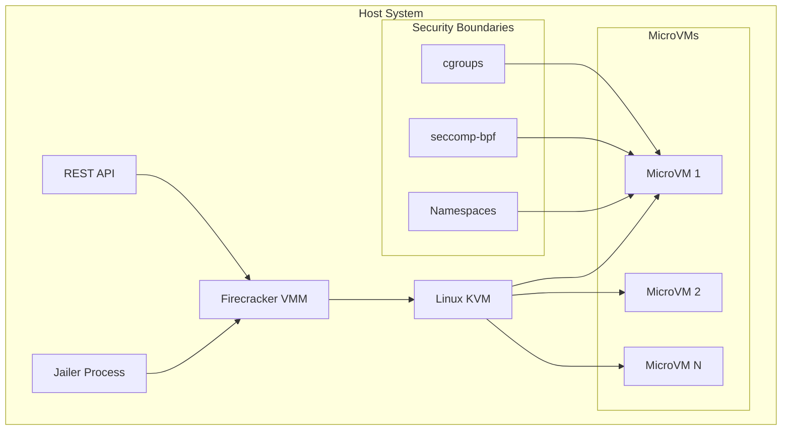

## Table of Contents

## Introduction

Firecracker is an open-source virtualization technology that revolutionizes serverless computing by providing lightweight virtual machines called microVMs. Developed by Amazon Web Services to power AWS Lambda and AWS Fargate, Firecracker achieves the perfect balance between the security of traditional VMs and the efficiency of containers.

With boot times under 125ms and memory overhead of just 5MB per microVM, Firecracker enables unprecedented density and performance for serverless workloads. This comprehensive guide explores Firecracker's architecture, implementation patterns, and real-world applications.

## Architecture Overview



### Core Components

Firecracker's architecture consists of several key components working together:

**Virtual Machine Monitor (VMM)**: The core Firecracker process written in Rust that manages microVMs through KVM
**REST API**: Control interface for creating, configuring, and managing microVMs
**Jailer**: Security wrapper that isolates the Firecracker process using Linux security primitives
**Device Model**: Minimal set of emulated devices (virtio-net, virtio-block, virtio-vsock, serial console, keyboard controller)

## Key Features and Benefits

### ⚡ Ultra-Fast Boot Times

Firecracker achieves industry-leading performance metrics:
- Boot times under 125 milliseconds
- MicroVM creation rate of 150 per second per host
- Thousands of concurrent microVMs on a single server
- Zero cold start overhead for serverless functions

### 🛡️ Security-First Design

Built with security as the primary concern:
- Written in memory-safe Rust language
- Minimal attack surface with only 5 emulated devices
- Process isolation using cgroups and seccomp-bpf
- Static linking with controlled system call access
- Defense-in-depth architecture

### 💰 Resource Efficiency

Optimized for high-density deployments:
- 5MB memory overhead per microVM
- Minimal CPU overhead
- Efficient resource sharing through rate limiting
- Support for oversubscription strategies

### 🔧 API-Driven Management

Full programmatic control through REST API:
- Dynamic microVM configuration
- Runtime resource adjustment
- Metrics and monitoring endpoints
- Snapshot and restore capabilities

## Installation and Setup

### Prerequisites

```bash
# Check system requirements
uname -r  # Linux kernel 4.14+ required
grep -E 'vmx|svm' /proc/cpuinfo  # Intel VT-x or AMD-V support

# Install dependencies on Ubuntu/Debian
sudo apt update
sudo apt install -y curl git build-essential

# Install dependencies on RHEL/CentOS/Fedora
sudo yum install -y curl git gcc make
```

### Installing Firecracker

```bash
# Download latest Firecracker release
ARCH="$(uname -m)"
latest=$(basename $(curl -fsSLI -o /dev/null -w  %{url_effective} https://github.com/firecracker-microvm/firecracker/releases/latest))
curl -L "https://github.com/firecracker-microvm/firecracker/releases/download/${latest}/firecracker-${latest}-${ARCH}.tgz" \
  | tar -xz

# Move binaries to system path
sudo mv release-${latest}-${ARCH}/firecracker-${latest}-${ARCH} /usr/local/bin/firecracker
sudo mv release-${latest}-${ARCH}/jailer-${latest}-${ARCH} /usr/local/bin/jailer

# Verify installation
firecracker --version
jailer --version

# Set up permissions
sudo chmod +x /usr/local/bin/firecracker
sudo chmod +x /usr/local/bin/jailer
```

### Network Configuration

```bash
# Create TAP interface for networking
sudo ip tuntap add tap0 mode tap
sudo ip addr add 172.16.0.1/24 dev tap0
sudo ip link set tap0 up

# Enable IP forwarding
sudo sh -c "echo 1 > /proc/sys/net/ipv4/ip_forward"

# Configure iptables for NAT
sudo iptables -t nat -A POSTROUTING -o eth0 -j MASQUERADE
sudo iptables -A FORWARD -m conntrack --ctstate RELATED,ESTABLISHED -j ACCEPT
sudo iptables -A FORWARD -i tap0 -o eth0 -j ACCEPT
```

## Basic MicroVM Creation

### Preparing the Guest Kernel

```bash
# Download a minimal kernel (or build your own)
curl -fsSL -o vmlinux.bin https://s3.amazonaws.com/spec.ccfc.min/img/quickstart_guide/x86_64/kernels/vmlinux.bin

# Create kernel configuration file
cat > kernel_config.json << EOF
{
  "kernel_image_path": "./vmlinux.bin",
  "boot_args": "console=ttyS0 reboot=k panic=1 pci=off"
}
EOF
```

### Creating a Root Filesystem

```bash
# Download Alpine Linux root filesystem
curl -fsSL -o alpine-minirootfs.tar.gz \
  https://dl-cdn.alpinelinux.org/alpine/v3.19/releases/x86_64/alpine-minirootfs-3.19.0-x86_64.tar.gz

# Create ext4 filesystem image
dd if=/dev/zero of=rootfs.ext4 bs=1M count=512
mkfs.ext4 rootfs.ext4

# Mount and extract Alpine
mkdir -p /tmp/rootfs
sudo mount rootfs.ext4 /tmp/rootfs
sudo tar -xzf alpine-minirootfs.tar.gz -C /tmp/rootfs

# Configure guest networking
sudo cat > /tmp/rootfs/etc/network/interfaces << EOF
auto lo
iface lo inet loopback

auto eth0
iface eth0 inet static
    address 172.16.0.2
    netmask 255.255.255.0
    gateway 172.16.0.1
EOF

# Set up init script
sudo cat > /tmp/rootfs/etc/init.d/setup << 'EOF'
#!/bin/sh
# Configure networking
ip addr add 172.16.0.2/24 dev eth0
ip link set eth0 up
ip route add default via 172.16.0.1

# Start SSH server (optional)
/usr/sbin/sshd -D &
EOF

sudo chmod +x /tmp/rootfs/etc/init.d/setup

# Unmount filesystem
sudo umount /tmp/rootfs
```

### Starting Firecracker

```bash
# Start Firecracker in API server mode
rm -f /tmp/firecracker.socket
firecracker --api-sock /tmp/firecracker.socket &

# Wait for API socket
sleep 1

# Configure the kernel
curl --unix-socket /tmp/firecracker.socket -i \
  -X PUT 'http://localhost/boot-source' \
  -H 'Accept: application/json' \
  -H 'Content-Type: application/json' \
  -d '{
    "kernel_image_path": "./vmlinux.bin",
    "boot_args": "console=ttyS0 reboot=k panic=1 pci=off"
  }'

# Configure the root filesystem
curl --unix-socket /tmp/firecracker.socket -i \
  -X PUT 'http://localhost/drives/rootfs' \
  -H 'Accept: application/json' \
  -H 'Content-Type: application/json' \
  -d '{
    "drive_id": "rootfs",
    "path_on_host": "./rootfs.ext4",
    "is_root_device": true,
    "is_read_only": false
  }'

# Configure network interface
curl --unix-socket /tmp/firecracker.socket -i \
  -X PUT 'http://localhost/network-interfaces/eth0' \
  -H 'Accept: application/json' \
  -H 'Content-Type: application/json' \
  -d '{
    "iface_id": "eth0",
    "guest_mac": "AA:FC:00:00:00:01",
    "host_dev_name": "tap0"
  }'

# Configure machine resources
curl --unix-socket /tmp/firecracker.socket -i \
  -X PUT 'http://localhost/machine-config' \
  -H 'Accept: application/json' \
  -H 'Content-Type: application/json' \
  -d '{
    "vcpu_count": 2,
    "mem_size_mib": 256
  }'

# Start the microVM
curl --unix-socket /tmp/firecracker.socket -i \
  -X PUT 'http://localhost/actions' \
  -H 'Accept: application/json' \
  -H 'Content-Type: application/json' \
  -d '{
    "action_type": "InstanceStart"
  }'
```

## API Operations

### Python SDK Example

```python
#!/usr/bin/env python3
import json
import requests_unixsocket
import time

class FirecrackerVM:
    def __init__(self, socket_path='/tmp/firecracker.socket'):
        self.socket_path = socket_path
        self.session = requests_unixsocket.Session()
        self.base_url = f'http+unix://{socket_path.replace("/", "%2F")}'
    
    def configure_boot_source(self, kernel_path, boot_args):
        """Configure the kernel and boot arguments"""
        response = self.session.put(
            f'{self.base_url}/boot-source',
            json={
                'kernel_image_path': kernel_path,
                'boot_args': boot_args
            }
        )
        return response.status_code == 204
    
    def add_drive(self, drive_id, path, is_root=False, read_only=False):
        """Add a block device to the microVM"""
        response = self.session.put(
            f'{self.base_url}/drives/{drive_id}',
            json={
                'drive_id': drive_id,
                'path_on_host': path,
                'is_root_device': is_root,
                'is_read_only': read_only
            }
        )
        return response.status_code == 204
    
    def configure_network(self, iface_id, host_dev, guest_mac):
        """Configure a network interface"""
        response = self.session.put(
            f'{self.base_url}/network-interfaces/{iface_id}',
            json={
                'iface_id': iface_id,
                'host_dev_name': host_dev,
                'guest_mac': guest_mac
            }
        )
        return response.status_code == 204
    
    def set_machine_config(self, vcpus=2, memory_mib=256):
        """Set VM resources"""
        response = self.session.put(
            f'{self.base_url}/machine-config',
            json={
                'vcpu_count': vcpus,
                'mem_size_mib': memory_mib
            }
        )
        return response.status_code == 204
    
    def start(self):
        """Start the microVM"""
        response = self.session.put(
            f'{self.base_url}/actions',
            json={'action_type': 'InstanceStart'}
        )
        return response.status_code == 204
    
    def pause(self):
        """Pause the microVM"""
        response = self.session.patch(
            f'{self.base_url}/vm',
            json={'state': 'Paused'}
        )
        return response.status_code == 204
    
    def resume(self):
        """Resume the microVM"""
        response = self.session.patch(
            f'{self.base_url}/vm',
            json={'state': 'Resumed'}
        )
        return response.status_code == 204
    
    def get_machine_config(self):
        """Get current machine configuration"""
        response = self.session.get(f'{self.base_url}/machine-config')
        return response.json() if response.status_code == 200 else None

# Usage example
if __name__ == '__main__':
    vm = FirecrackerVM()
    
    # Configure the VM
    vm.configure_boot_source(
        kernel_path='./vmlinux.bin',
        boot_args='console=ttyS0 reboot=k panic=1 pci=off'
    )
    
    vm.add_drive(
        drive_id='rootfs',
        path='./rootfs.ext4',
        is_root=True,
        read_only=False
    )
    
    vm.configure_network(
        iface_id='eth0',
        host_dev='tap0',
        guest_mac='AA:FC:00:00:00:01'
    )
    
    vm.set_machine_config(vcpus=2, memory_mib=256)
    
    # Start the VM
    if vm.start():
        print("MicroVM started successfully")
        
        # Get configuration
        config = vm.get_machine_config()
        print(f"Running with {config['vcpu_count']} vCPUs and {config['mem_size_mib']}MB RAM")
```

### Go SDK Example

```go
package main

import (
    "bytes"
    "context"
    "encoding/json"
    "fmt"
    "net"
    "net/http"
    "time"
)

type FirecrackerClient struct {
    socketPath string
    client     *http.Client
}

func NewFirecrackerClient(socketPath string) *FirecrackerClient {
    return &FirecrackerClient{
        socketPath: socketPath,
        client: &http.Client{
            Transport: &http.Transport{
                DialContext: func(_ context.Context, _, _ string) (net.Conn, error) {
                    return net.Dial("unix", socketPath)
                },
            },
            Timeout: 30 * time.Second,
        },
    }
}

type BootSource struct {
    KernelImagePath string `json:"kernel_image_path"`
    BootArgs        string `json:"boot_args"`
}

type Drive struct {
    DriveID      string `json:"drive_id"`
    PathOnHost   string `json:"path_on_host"`
    IsRootDevice bool   `json:"is_root_device"`
    IsReadOnly   bool   `json:"is_read_only"`
}

type NetworkInterface struct {
    IfaceID     string `json:"iface_id"`
    GuestMAC    string `json:"guest_mac"`
    HostDevName string `json:"host_dev_name"`
}

type MachineConfig struct {
    VcpuCount   int `json:"vcpu_count"`
    MemSizeMib  int `json:"mem_size_mib"`
}

func (c *FirecrackerClient) ConfigureBootSource(kernel, bootArgs string) error {
    boot := BootSource{
        KernelImagePath: kernel,
        BootArgs:        bootArgs,
    }
    
    body, _ := json.Marshal(boot)
    req, err := http.NewRequest("PUT", "http://localhost/boot-source", bytes.NewReader(body))
    if err != nil {
        return err
    }
    
    req.Header.Set("Content-Type", "application/json")
    resp, err := c.client.Do(req)
    if err != nil {
        return err
    }
    defer resp.Body.Close()
    
    if resp.StatusCode != http.StatusNoContent {
        return fmt.Errorf("failed to configure boot source: %d", resp.StatusCode)
    }
    
    return nil
}

func (c *FirecrackerClient) AddDrive(driveID, path string, isRoot, readOnly bool) error {
    drive := Drive{
        DriveID:      driveID,
        PathOnHost:   path,
        IsRootDevice: isRoot,
        IsReadOnly:   readOnly,
    }
    
    body, _ := json.Marshal(drive)
    url := fmt.Sprintf("http://localhost/drives/%s", driveID)
    req, err := http.NewRequest("PUT", url, bytes.NewReader(body))
    if err != nil {
        return err
    }
    
    req.Header.Set("Content-Type", "application/json")
    resp, err := c.client.Do(req)
    if err != nil {
        return err
    }
    defer resp.Body.Close()
    
    if resp.StatusCode != http.StatusNoContent {
        return fmt.Errorf("failed to add drive: %d", resp.StatusCode)
    }
    
    return nil
}

func (c *FirecrackerClient) ConfigureNetwork(ifaceID, hostDev, guestMAC string) error {
    netif := NetworkInterface{
        IfaceID:     ifaceID,
        GuestMAC:    guestMAC,
        HostDevName: hostDev,
    }
    
    body, _ := json.Marshal(netif)
    url := fmt.Sprintf("http://localhost/network-interfaces/%s", ifaceID)
    req, err := http.NewRequest("PUT", url, bytes.NewReader(body))
    if err != nil {
        return err
    }
    
    req.Header.Set("Content-Type", "application/json")
    resp, err := c.client.Do(req)
    if err != nil {
        return err
    }
    defer resp.Body.Close()
    
    if resp.StatusCode != http.StatusNoContent {
        return fmt.Errorf("failed to configure network: %d", resp.StatusCode)
    }
    
    return nil
}

func (c *FirecrackerClient) SetMachineConfig(vcpus, memoryMB int) error {
    config := MachineConfig{
        VcpuCount:  vcpus,
        MemSizeMib: memoryMB,
    }
    
    body, _ := json.Marshal(config)
    req, err := http.NewRequest("PUT", "http://localhost/machine-config", bytes.NewReader(body))
    if err != nil {
        return err
    }
    
    req.Header.Set("Content-Type", "application/json")
    resp, err := c.client.Do(req)
    if err != nil {
        return err
    }
    defer resp.Body.Close()
    
    if resp.StatusCode != http.StatusNoContent {
        return fmt.Errorf("failed to set machine config: %d", resp.StatusCode)
    }
    
    return nil
}

func (c *FirecrackerClient) Start() error {
    action := map[string]string{"action_type": "InstanceStart"}
    body, _ := json.Marshal(action)
    
    req, err := http.NewRequest("PUT", "http://localhost/actions", bytes.NewReader(body))
    if err != nil {
        return err
    }
    
    req.Header.Set("Content-Type", "application/json")
    resp, err := c.client.Do(req)
    if err != nil {
        return err
    }
    defer resp.Body.Close()
    
    if resp.StatusCode != http.StatusNoContent {
        return fmt.Errorf("failed to start instance: %d", resp.StatusCode)
    }
    
    return nil
}

func main() {
    client := NewFirecrackerClient("/tmp/firecracker.socket")
    
    // Configure boot source
    err := client.ConfigureBootSource("./vmlinux.bin", "console=ttyS0 reboot=k panic=1 pci=off")
    if err != nil {
        panic(err)
    }
    
    // Add root filesystem
    err = client.AddDrive("rootfs", "./rootfs.ext4", true, false)
    if err != nil {
        panic(err)
    }
    
    // Configure network
    err = client.ConfigureNetwork("eth0", "tap0", "AA:FC:00:00:00:01")
    if err != nil {
        panic(err)
    }
    
    // Set machine configuration
    err = client.SetMachineConfig(2, 256)
    if err != nil {
        panic(err)
    }
    
    // Start the microVM
    err = client.Start()
    if err != nil {
        panic(err)
    }
    
    fmt.Println("MicroVM started successfully")
}
```

## Resource Management

### Rate Limiting

```bash
# Configure rate limiting for network interface
curl --unix-socket /tmp/firecracker.socket -i \
  -X PATCH 'http://localhost/network-interfaces/eth0' \
  -H 'Content-Type: application/json' \
  -d '{
    "iface_id": "eth0",
    "rx_rate_limiter": {
      "bandwidth": {
        "size": 1000000,
        "refill_time": 100
      },
      "ops": {
        "size": 100,
        "refill_time": 100
      }
    },
    "tx_rate_limiter": {
      "bandwidth": {
        "size": 1000000,
        "refill_time": 100
      },
      "ops": {
        "size": 100,
        "refill_time": 100
      }
    }
  }'

# Configure rate limiting for block device
curl --unix-socket /tmp/firecracker.socket -i \
  -X PATCH 'http://localhost/drives/rootfs' \
  -H 'Content-Type: application/json' \
  -d '{
    "drive_id": "rootfs",
    "rate_limiter": {
      "bandwidth": {
        "size": 10485760,
        "refill_time": 100
      },
      "ops": {
        "size": 1000,
        "refill_time": 100
      }
    }
  }'
```

### CPU Templates

```bash
# Apply CPU template for better security/compatibility
curl --unix-socket /tmp/firecracker.socket -i \
  -X PUT 'http://localhost/cpu-config' \
  -H 'Content-Type: application/json' \
  -d '{
    "cpu_template": "C3"
  }'

# Available templates:
# - C3: AWS C3 instance compatibility
# - T2: AWS T2 instance compatibility  
# - T2S: T2 with SMT disabled
# - T2CL: T2 with cache line side channels mitigation
```

## Metrics and Monitoring

### Enabling Metrics

```bash
# Configure metrics endpoint
curl --unix-socket /tmp/firecracker.socket -i \
  -X PUT 'http://localhost/metrics' \
  -H 'Content-Type: application/json' \
  -d '{
    "metrics_path": "/tmp/firecracker-metrics.json"
  }'

# Retrieve metrics
curl --unix-socket /tmp/firecracker.socket -i \
  -X GET 'http://localhost/metrics' \
  -H 'Accept: application/json'
```

### Metrics Structure

```json
{
  "api_server": {
    "process_startup_time_us": 12345,
    "process_startup_time_cpu_us": 6789
  },
  "block": {
    "activate_fails": 0,
    "cfg_fails": 0,
    "event_fails": 0,
    "execute_fails": 0,
    "invalid_reqs_count": 0,
    "flush_count": 142,
    "queue_event_count": 142,
    "read_count": 142,
    "write_count": 0,
    "rate_limiter_throttled_events": 0
  },
  "net": {
    "activate_fails": 0,
    "cfg_fails": 0,
    "event_fails": 0,
    "rx_queue_event_count": 25,
    "tx_queue_event_count": 17,
    "tx_rate_limiter_throttled_events": 0
  },
  "vcpu": {
    "vcpu_0": {
      "exit_io_in": 100,
      "exit_io_out": 200,
      "exit_mmio_read": 50,
      "exit_mmio_write": 75
    }
  }
}
```

### Custom Monitoring Script

```python
#!/usr/bin/env python3
import json
import time
import requests_unixsocket
from datetime import datetime

class FirecrackerMonitor:
    def __init__(self, socket_path='/tmp/firecracker.socket'):
        self.session = requests_unixsocket.Session()
        self.base_url = f'http+unix://{socket_path.replace("/", "%2F")}'
        self.previous_metrics = None
    
    def get_metrics(self):
        """Retrieve current metrics from Firecracker"""
        response = self.session.get(f'{self.base_url}/metrics')
        if response.status_code == 200:
            return response.json()
        return None
    
    def calculate_rates(self, current, previous):
        """Calculate rate metrics between two snapshots"""
        if not previous:
            return {}
        
        rates = {}
        time_delta = 1.0  # Assuming 1 second interval
        
        # Network rates
        if 'net' in current and 'net' in previous:
            net_current = current['net']
            net_previous = previous['net']
            
            rates['rx_rate'] = (net_current.get('rx_queue_event_count', 0) - 
                               net_previous.get('rx_queue_event_count', 0)) / time_delta
            rates['tx_rate'] = (net_current.get('tx_queue_event_count', 0) - 
                               net_previous.get('tx_queue_event_count', 0)) / time_delta
        
        # Block I/O rates
        if 'block' in current and 'block' in previous:
            block_current = current['block']
            block_previous = previous['block']
            
            rates['read_rate'] = (block_current.get('read_count', 0) - 
                                 block_previous.get('read_count', 0)) / time_delta
            rates['write_rate'] = (block_current.get('write_count', 0) - 
                                  block_previous.get('write_count', 0)) / time_delta
        
        return rates
    
    def monitor_loop(self, interval=1):
        """Continuous monitoring loop"""
        print(f"Starting Firecracker monitoring (interval: {interval}s)")
        print("-" * 60)
        
        while True:
            try:
                current_metrics = self.get_metrics()
                
                if current_metrics:
                    rates = self.calculate_rates(current_metrics, self.previous_metrics)
                    
                    # Display metrics
                    timestamp = datetime.now().strftime('%Y-%m-%d %H:%M:%S')
                    print(f"\n[{timestamp}]")
                    
                    # Network metrics
                    if 'net' in current_metrics:
                        net = current_metrics['net']
                        print(f"Network: RX={net.get('rx_queue_event_count', 0):,} " +
                              f"TX={net.get('tx_queue_event_count', 0):,}")
                        if 'rx_rate' in rates:
                            print(f"  Rates: RX={rates['rx_rate']:.1f}/s " +
                                  f"TX={rates['tx_rate']:.1f}/s")
                    
                    # Block I/O metrics
                    if 'block' in current_metrics:
                        block = current_metrics['block']
                        print(f"Block I/O: Reads={block.get('read_count', 0):,} " +
                              f"Writes={block.get('write_count', 0):,}")
                        if 'read_rate' in rates:
                            print(f"  Rates: Read={rates['read_rate']:.1f}/s " +
                                  f"Write={rates['write_rate']:.1f}/s")
                    
                    # vCPU metrics
                    if 'vcpu' in current_metrics:
                        for vcpu_id, vcpu_data in current_metrics['vcpu'].items():
                            io_exits = vcpu_data.get('exit_io_in', 0) + vcpu_data.get('exit_io_out', 0)
                            mmio_exits = vcpu_data.get('exit_mmio_read', 0) + vcpu_data.get('exit_mmio_write', 0)
                            print(f"{vcpu_id}: IO exits={io_exits:,} MMIO exits={mmio_exits:,}")
                    
                    self.previous_metrics = current_metrics
                
                time.sleep(interval)
                
            except KeyboardInterrupt:
                print("\nMonitoring stopped")
                break
            except Exception as e:
                print(f"Error: {e}")
                time.sleep(interval)

if __name__ == '__main__':
    monitor = FirecrackerMonitor()
    monitor.monitor_loop(interval=1)
```

## Performance Optimization

### Boot Time Optimization

```bash
# Minimal kernel configuration
cat > minimal_kernel_config << EOF
# Disable unnecessary drivers
CONFIG_ACPI=n
CONFIG_PCI=n
CONFIG_USB=n
CONFIG_SOUND=n
CONFIG_DRM=n

# Enable only required features
CONFIG_VIRTIO=y
CONFIG_VIRTIO_BLK=y
CONFIG_VIRTIO_NET=y
CONFIG_VIRTIO_VSOCKETS=y
CONFIG_SERIAL_8250=y
CONFIG_SERIAL_8250_CONSOLE=y

# Optimize for size
CONFIG_CC_OPTIMIZE_FOR_SIZE=y
CONFIG_KERNEL_XZ=y
EOF

# Build minimal kernel
make defconfig
./scripts/kconfig/merge_config.sh .config minimal_kernel_config
make -j$(nproc) vmlinux
```

### Memory Optimization

```python
#!/usr/bin/env python3
import subprocess
import json

def optimize_memory_allocation(num_vms, total_memory_gb):
    """Calculate optimal memory allocation for microVMs"""
    
    # Reserve memory for host system (2GB minimum)
    host_reserved_mb = 2048
    
    # Firecracker overhead per VM (5MB)
    firecracker_overhead_mb = 5
    
    # Calculate available memory for VMs
    total_memory_mb = total_memory_gb * 1024
    available_memory_mb = total_memory_mb - host_reserved_mb
    
    # Calculate per-VM allocation
    total_overhead = num_vms * firecracker_overhead_mb
    usable_memory = available_memory_mb - total_overhead
    per_vm_memory = usable_memory // num_vms
    
    # Memory ballooning configuration
    balloon_config = {
        "initial_size_mb": per_vm_memory,
        "min_size_mb": per_vm_memory // 2,
        "max_size_mb": per_vm_memory * 2,
        "swap_enabled": True
    }
    
    return {
        "per_vm_memory_mb": per_vm_memory,
        "total_vms": num_vms,
        "host_reserved_mb": host_reserved_mb,
        "total_overhead_mb": total_overhead,
        "balloon_config": balloon_config
    }

# Example usage
config = optimize_memory_allocation(num_vms=100, total_memory_gb=64)
print(json.dumps(config, indent=2))
```

## Security Best Practices

### Using the Jailer

```bash
# Create jailer configuration
cat > jailer_config.json << EOF
{
  "firecracker_binary": "/usr/local/bin/firecracker",
  "kernel_path": "/var/lib/firecracker/kernels/vmlinux.bin",
  "rootfs_path": "/var/lib/firecracker/rootfs/alpine.ext4",
  "jailer_workspace": "/srv/jailer",
  "cgroup_version": 2,
  "uid": 1000,
  "gid": 1000,
  "numa_node": 0,
  "exec_file": "/usr/local/bin/firecracker"
}
EOF

# Run Firecracker with jailer
sudo jailer \
  --id=vm001 \
  --exec-file=/usr/local/bin/firecracker \
  --uid=1000 \
  --gid=1000 \
  --chroot-base-dir=/srv/jailer \
  --daemonize \
  -- \
  --api-sock /tmp/firecracker.socket \
  --config-file /etc/firecracker/vm_config.json
```

### Seccomp Filtering

```json
{
  "seccomp": {
    "level": 2,
    "allowed_syscalls": [
      "read",
      "write",
      "open",
      "close",
      "stat",
      "fstat",
      "lseek",
      "mmap",
      "mprotect",
      "munmap",
      "brk",
      "rt_sigaction",
      "rt_sigprocmask",
      "ioctl",
      "pread64",
      "pwrite64",
      "readv",
      "writev",
      "pipe",
      "select",
      "sched_yield",
      "mremap",
      "msync",
      "mincore",
      "madvise",
      "shmget",
      "shmat",
      "shmctl",
      "dup",
      "dup2",
      "pause",
      "nanosleep",
      "getitimer",
      "setitimer",
      "alarm",
      "getpid",
      "sendfile",
      "socket",
      "connect",
      "accept",
      "sendto",
      "recvfrom",
      "sendmsg",
      "recvmsg",
      "shutdown",
      "bind",
      "listen",
      "getsockname",
      "getpeername",
      "socketpair",
      "setsockopt",
      "getsockopt",
      "clone",
      "fork",
      "vfork",
      "execve",
      "exit",
      "wait4",
      "kill",
      "uname",
      "semget",
      "semop",
      "semctl",
      "shmdt",
      "msgget",
      "msgsnd",
      "msgrcv",
      "msgctl",
      "fcntl",
      "flock",
      "fsync",
      "fdatasync",
      "truncate",
      "ftruncate",
      "getdents",
      "getcwd",
      "chdir",
      "fchdir",
      "rename",
      "mkdir",
      "rmdir",
      "creat",
      "link",
      "unlink",
      "symlink",
      "readlink",
      "chmod",
      "fchmod",
      "chown",
      "fchown",
      "lchown",
      "umask",
      "gettimeofday",
      "getrlimit",
      "getrusage",
      "sysinfo",
      "times",
      "ptrace",
      "getuid",
      "syslog",
      "getgid",
      "setuid",
      "setgid",
      "geteuid",
      "getegid",
      "setpgid",
      "getppid",
      "getpgrp",
      "setsid",
      "setreuid",
      "setregid",
      "getgroups",
      "setgroups",
      "setresuid",
      "getresuid",
      "setresgid",
      "getresgid",
      "getpgid",
      "setfsuid",
      "setfsgid",
      "getsid",
      "capget",
      "capset",
      "rt_sigpending",
      "rt_sigtimedwait",
      "rt_sigqueueinfo",
      "rt_sigsuspend",
      "sigaltstack",
      "utime",
      "mknod",
      "uselib",
      "personality",
      "ustat",
      "statfs",
      "fstatfs",
      "sysfs",
      "getpriority",
      "setpriority",
      "sched_setparam",
      "sched_getparam",
      "sched_setscheduler",
      "sched_getscheduler",
      "sched_get_priority_max",
      "sched_get_priority_min",
      "sched_rr_get_interval",
      "mlock",
      "munlock",
      "mlockall",
      "munlockall",
      "vhangup",
      "modify_ldt",
      "pivot_root",
      "_sysctl",
      "prctl",
      "arch_prctl",
      "adjtimex",
      "setrlimit",
      "chroot",
      "sync",
      "acct",
      "settimeofday",
      "mount",
      "umount2",
      "swapon",
      "swapoff",
      "reboot",
      "sethostname",
      "setdomainname",
      "iopl",
      "ioperm",
      "create_module",
      "init_module",
      "delete_module",
      "get_kernel_syms",
      "query_module",
      "quotactl",
      "nfsservctl",
      "getpmsg",
      "putpmsg",
      "afs_syscall",
      "tuxcall",
      "security",
      "gettid",
      "readahead",
      "setxattr",
      "lsetxattr",
      "fsetxattr",
      "getxattr",
      "lgetxattr",
      "fgetxattr",
      "listxattr",
      "llistxattr",
      "flistxattr",
      "removexattr",
      "lremovexattr",
      "fremovexattr",
      "tkill",
      "time",
      "futex",
      "sched_setaffinity",
      "sched_getaffinity",
      "set_thread_area",
      "io_setup",
      "io_destroy",
      "io_getevents",
      "io_submit",
      "io_cancel",
      "get_thread_area",
      "lookup_dcookie",
      "epoll_create",
      "epoll_ctl_old",
      "epoll_wait_old",
      "remap_file_pages",
      "getdents64",
      "set_tid_address",
      "restart_syscall",
      "semtimedop",
      "fadvise64",
      "timer_create",
      "timer_settime",
      "timer_gettime",
      "timer_getoverrun",
      "timer_delete",
      "clock_settime",
      "clock_gettime",
      "clock_getres",
      "clock_nanosleep",
      "exit_group",
      "epoll_wait",
      "epoll_ctl",
      "tgkill",
      "utimes",
      "vserver",
      "mbind",
      "set_mempolicy",
      "get_mempolicy",
      "mq_open",
      "mq_unlink",
      "mq_timedsend",
      "mq_timedreceive",
      "mq_notify",
      "mq_getsetattr",
      "kexec_load",
      "waitid",
      "add_key",
      "request_key",
      "keyctl",
      "ioprio_set",
      "ioprio_get",
      "inotify_init",
      "inotify_add_watch",
      "inotify_rm_watch",
      "migrate_pages",
      "openat",
      "mkdirat",
      "mknodat",
      "fchownat",
      "futimesat",
      "newfstatat",
      "unlinkat",
      "renameat",
      "linkat",
      "symlinkat",
      "readlinkat",
      "fchmodat",
      "faccessat",
      "pselect6",
      "ppoll",
      "unshare",
      "set_robust_list",
      "get_robust_list",
      "splice",
      "tee",
      "sync_file_range",
      "vmsplice",
      "move_pages",
      "utimensat",
      "epoll_pwait",
      "signalfd",
      "timerfd_create",
      "eventfd",
      "fallocate",
      "timerfd_settime",
      "timerfd_gettime",
      "accept4",
      "signalfd4",
      "eventfd2",
      "epoll_create1",
      "dup3",
      "pipe2",
      "inotify_init1",
      "preadv",
      "pwritev",
      "rt_tgsigqueueinfo",
      "perf_event_open",
      "recvmmsg",
      "fanotify_init",
      "fanotify_mark",
      "prlimit64",
      "name_to_handle_at",
      "open_by_handle_at",
      "clock_adjtime",
      "syncfs",
      "sendmmsg",
      "setns",
      "getcpu",
      "process_vm_readv",
      "process_vm_writev"
    ]
  }
}
```

## Real-World Use Cases

### Serverless Function Platform

```python
#!/usr/bin/env python3
import os
import json
import time
import subprocess
import tempfile
from concurrent.futures import ThreadPoolExecutor, as_completed

class ServerlessPlatform:
    def __init__(self, max_workers=10):
        self.max_workers = max_workers
        self.executor = ThreadPoolExecutor(max_workers=max_workers)
        self.active_vms = {}
    
    def create_function_vm(self, function_id, code, runtime='python3'):
        """Create a microVM for a serverless function"""
        
        # Create temporary directory for this function
        work_dir = tempfile.mkdtemp(prefix=f'function_{function_id}_')
        
        # Write function code
        code_path = os.path.join(work_dir, 'handler.py')
        with open(code_path, 'w') as f:
            f.write(code)
        
        # Create rootfs with function code
        rootfs_path = os.path.join(work_dir, 'rootfs.ext4')
        self._create_function_rootfs(rootfs_path, code_path, runtime)
        
        # Start Firecracker
        socket_path = os.path.join(work_dir, 'firecracker.socket')
        firecracker_proc = subprocess.Popen([
            'firecracker',
            '--api-sock', socket_path
        ])
        
        # Wait for socket
        time.sleep(0.5)
        
        # Configure VM
        vm_config = {
            'socket_path': socket_path,
            'kernel_path': '/var/lib/firecracker/kernels/vmlinux.bin',
            'rootfs_path': rootfs_path,
            'vcpus': 1,
            'memory_mb': 128
        }
        
        self._configure_vm(vm_config)
        
        # Store VM info
        self.active_vms[function_id] = {
            'process': firecracker_proc,
            'socket': socket_path,
            'work_dir': work_dir,
            'start_time': time.time()
        }
        
        return function_id
    
    def invoke_function(self, function_id, event):
        """Invoke a serverless function"""
        
        if function_id not in self.active_vms:
            raise ValueError(f"Function {function_id} not found")
        
        vm_info = self.active_vms[function_id]
        
        # Send event to VM (simplified - in reality would use vsock or network)
        result = self._send_event_to_vm(vm_info['socket'], event)
        
        return result
    
    def cleanup_function(self, function_id):
        """Clean up a function VM"""
        
        if function_id in self.active_vms:
            vm_info = self.active_vms[function_id]
            
            # Terminate Firecracker process
            vm_info['process'].terminate()
            vm_info['process'].wait()
            
            # Clean up files
            subprocess.run(['rm', '-rf', vm_info['work_dir']])
            
            del self.active_vms[function_id]
    
    def _create_function_rootfs(self, rootfs_path, code_path, runtime):
        """Create a minimal rootfs with function code"""
        
        # This is simplified - in reality would build proper rootfs
        subprocess.run([
            'dd', 'if=/dev/zero', f'of={rootfs_path}',
            'bs=1M', 'count=100'
        ], check=True)
        
        subprocess.run(['mkfs.ext4', rootfs_path], check=True)
        
        # Mount and copy function code
        mount_point = tempfile.mkdtemp()
        subprocess.run(['sudo', 'mount', rootfs_path, mount_point], check=True)
        subprocess.run(['sudo', 'cp', code_path, f'{mount_point}/handler.py'], check=True)
        subprocess.run(['sudo', 'umount', mount_point], check=True)
        os.rmdir(mount_point)
    
    def _configure_vm(self, config):
        """Configure a Firecracker VM via API"""
        
        import requests_unixsocket
        session = requests_unixsocket.Session()
        base_url = f'http+unix://{config["socket_path"].replace("/", "%2F")}'
        
        # Set boot source
        session.put(
            f'{base_url}/boot-source',
            json={
                'kernel_image_path': config['kernel_path'],
                'boot_args': 'console=ttyS0 reboot=k panic=1 pci=off'
            }
        )
        
        # Add rootfs
        session.put(
            f'{base_url}/drives/rootfs',
            json={
                'drive_id': 'rootfs',
                'path_on_host': config['rootfs_path'],
                'is_root_device': True,
                'is_read_only': False
            }
        )
        
        # Set machine config
        session.put(
            f'{base_url}/machine-config',
            json={
                'vcpu_count': config['vcpus'],
                'mem_size_mib': config['memory_mb']
            }
        )
        
        # Start VM
        session.put(
            f'{base_url}/actions',
            json={'action_type': 'InstanceStart'}
        )
    
    def _send_event_to_vm(self, socket_path, event):
        """Send event to VM and get response"""
        
        # Simplified - in reality would use vsock or network communication
        return {"status": "success", "result": "Function executed"}

# Usage example
if __name__ == '__main__':
    platform = ServerlessPlatform()
    
    # Define a simple function
    function_code = '''
def handler(event):
    return {
        'statusCode': 200,
        'body': f'Hello from Firecracker! Event: {event}'
    }
'''
    
    # Create function VM
    function_id = platform.create_function_vm('hello-world', function_code)
    print(f"Created function: {function_id}")
    
    # Invoke function
    result = platform.invoke_function(function_id, {'name': 'World'})
    print(f"Result: {result}")
    
    # Clean up
    platform.cleanup_function(function_id)
```

### Container Runtime Integration

```bash
#!/bin/bash

# Install containerd with Firecracker support
wget https://github.com/containerd/containerd/releases/download/v1.7.0/containerd-1.7.0-linux-amd64.tar.gz
sudo tar -C /usr/local -xzf containerd-1.7.0-linux-amd64.tar.gz

# Install Firecracker-containerd
git clone https://github.com/firecracker-microvm/firecracker-containerd
cd firecracker-containerd
make
sudo make install

# Configure containerd for Firecracker
cat > /etc/containerd/config.toml << EOF
version = 2

[plugins]
  [plugins."io.containerd.grpc.v1.cri"]
    [plugins."io.containerd.grpc.v1.cri".containerd]
      default_runtime_name = "firecracker"
      
      [plugins."io.containerd.grpc.v1.cri".containerd.runtimes]
        [plugins."io.containerd.grpc.v1.cri".containerd.runtimes.firecracker]
          runtime_type = "io.containerd.runtime.v2.firecracker"
          
          [plugins."io.containerd.grpc.v1.cri".containerd.runtimes.firecracker.options]
            ConfigPath = "/etc/containerd/firecracker-runtime.json"
EOF

# Create Firecracker runtime configuration
cat > /etc/containerd/firecracker-runtime.json << EOF
{
  "firecracker_binary_path": "/usr/local/bin/firecracker",
  "kernel_image_path": "/var/lib/firecracker/kernels/vmlinux.bin",
  "kernel_args": "console=ttyS0 noapic reboot=k panic=1 pci=off nomodules rw",
  "root_drive": "/var/lib/firecracker/rootfs/ubuntu.ext4",
  "cpu_count": 1,
  "cpu_template": "T2",
  "mem_size_mib": 512,
  "network_interfaces": [{
    "iface_id": "eth0",
    "host_dev_name": "tap0",
    "guest_mac": "AA:FC:00:00:00:01"
  }]
}
EOF

# Restart containerd
sudo systemctl restart containerd

# Run container with Firecracker
sudo ctr run --runtime io.containerd.runtime.v2.firecracker \
  --rm docker.io/library/alpine:latest \
  test-firecracker sh -c "echo 'Hello from Firecracker!'"
```

## Troubleshooting

### Common Issues and Solutions

```bash
# Issue: Permission denied when accessing /dev/kvm
# Solution: Add user to kvm group
sudo usermod -aG kvm $USER
newgrp kvm

# Issue: Firecracker fails to start
# Solution: Check KVM availability
ls -la /dev/kvm
lsmod | grep kvm

# Issue: Network connectivity issues
# Solution: Check IP forwarding and iptables
sudo sysctl net.ipv4.ip_forward=1
sudo iptables -t nat -L
sudo iptables -L FORWARD

# Issue: High memory usage
# Solution: Enable memory ballooning
curl --unix-socket /tmp/firecracker.socket -i \
  -X PUT 'http://localhost/balloon' \
  -H 'Content-Type: application/json' \
  -d '{
    "amount_mib": 100,
    "deflate_on_oom": true,
    "stats_polling_interval_s": 1
  }'

# Issue: Slow boot times
# Solution: Use compressed kernel and optimize initramfs
xz -9 vmlinux
strip --strip-unneeded initramfs/*
```

### Debug Logging

```python
#!/usr/bin/env python3
import json
import logging
from datetime import datetime

# Configure logging
logging.basicConfig(
    level=logging.DEBUG,
    format='%(asctime)s - %(name)s - %(levelname)s - %(message)s',
    handlers=[
        logging.FileHandler('/var/log/firecracker-debug.log'),
        logging.StreamHandler()
    ]
)

logger = logging.getLogger('firecracker')

def configure_logging(socket_path):
    """Configure Firecracker logging"""
    
    import requests_unixsocket
    session = requests_unixsocket.Session()
    base_url = f'http+unix://{socket_path.replace("/", "%2F")}'
    
    # Set logging level
    response = session.put(
        f'{base_url}/logger',
        json={
            'level': 'Debug',
            'log_path': '/var/log/firecracker.log',
            'show_level': True,
            'show_log_origin': True
        }
    )
    
    if response.status_code == 204:
        logger.info("Logging configured successfully")
    else:
        logger.error(f"Failed to configure logging: {response.status_code}")
    
    return response.status_code == 204

# Monitor logs in real-time
def tail_logs(log_path='/var/log/firecracker.log'):
    """Tail Firecracker logs"""
    
    import subprocess
    
    try:
        process = subprocess.Popen(
            ['tail', '-f', log_path],
            stdout=subprocess.PIPE,
            stderr=subprocess.PIPE,
            text=True
        )
        
        for line in process.stdout:
            # Parse and format log entries
            try:
                if line.strip():
                    print(f"[FC] {line.strip()}")
            except Exception as e:
                logger.error(f"Error parsing log line: {e}")
                
    except KeyboardInterrupt:
        process.terminate()
        logger.info("Log monitoring stopped")
```

## Conclusion

Firecracker represents a paradigm shift in virtualization technology, offering the security of traditional VMs with the speed and efficiency of containers. Its minimal design, blazing-fast boot times, and low resource overhead make it ideal for:

- ✅ Serverless computing platforms
- ✅ Container runtime backends
- ✅ Multi-tenant workload isolation
- ✅ Edge computing deployments
- ✅ CI/CD pipeline acceleration
- ✅ Secure code execution environments

With its battle-tested deployment in AWS Lambda and growing ecosystem support, Firecracker is transforming how we think about virtualization in cloud-native environments.

## Resources

- [Official Firecracker Repository](https://github.com/firecracker-microvm/firecracker)
- [Firecracker Documentation](https://firecracker-microvm.github.io/)
- [Firecracker Getting Started Guide](https://github.com/firecracker-microvm/firecracker/blob/main/docs/getting-started.md)
- [Kata Containers with Firecracker](https://github.com/kata-containers/kata-containers)
- [Firecracker-containerd](https://github.com/firecracker-microvm/firecracker-containerd)
- [AWS Lambda Under the Hood](https://www.youtube.com/watch?v=xmacMfbrG28)